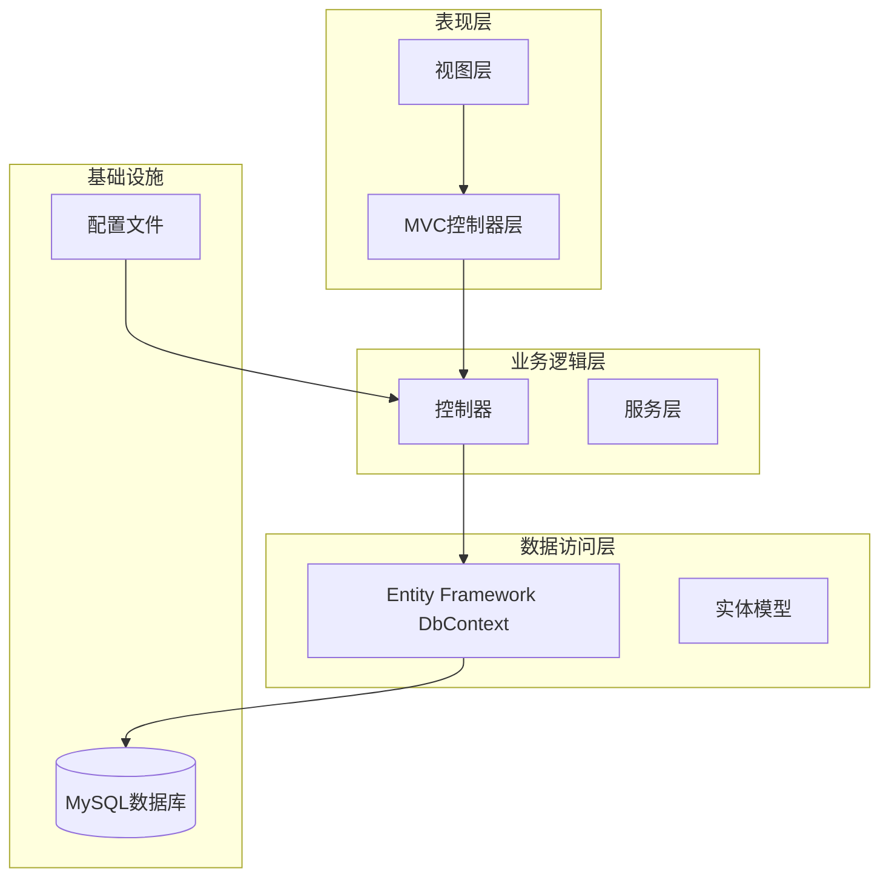
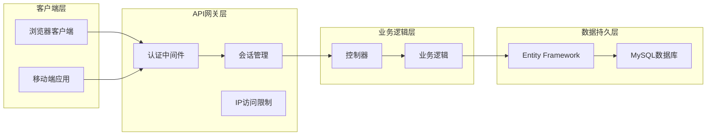
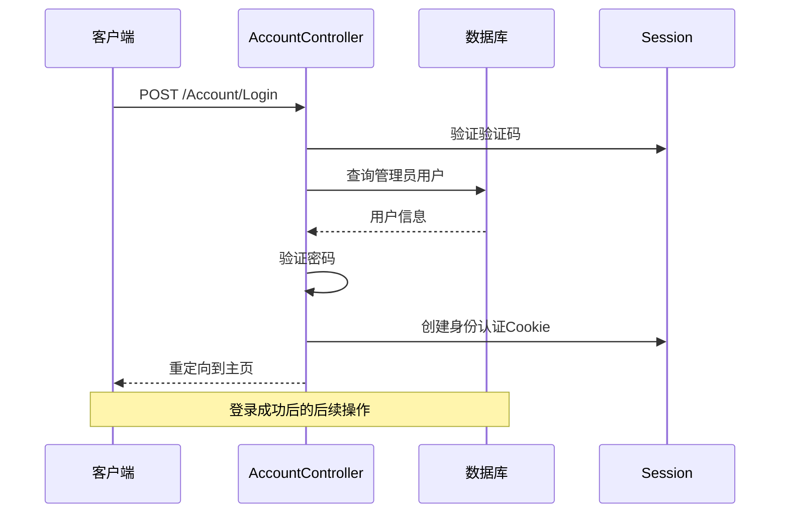
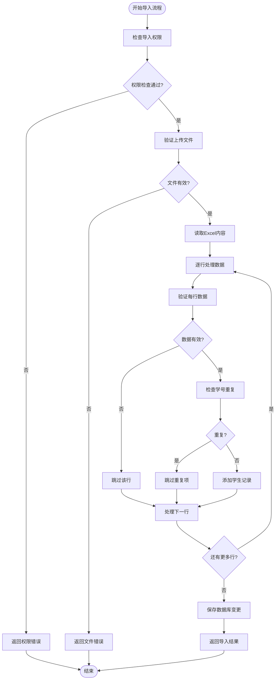
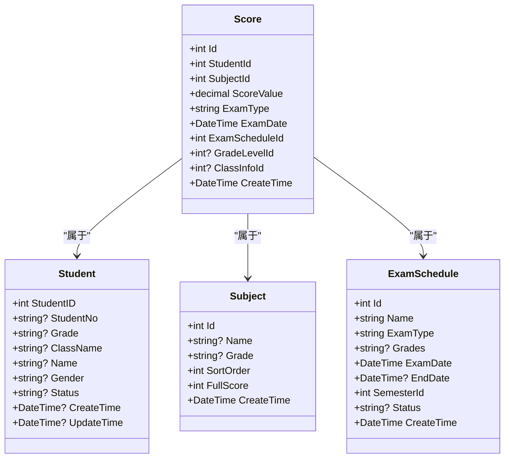
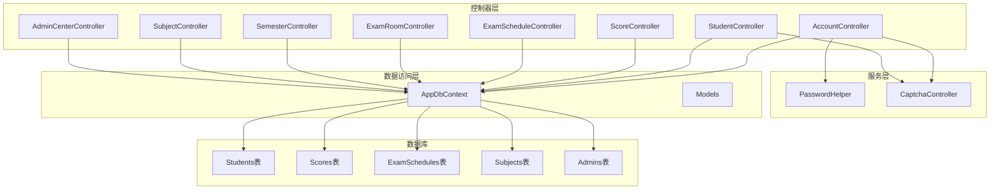

# API接口文档

<cite>
**本文档引用的文件**
- [Program.cs](file://Program.cs)
- [appsettings.json](file://appsettings.json)
- [AccountController.cs](file://Controllers/AccountController.cs)
- [CaptchaController.cs](file://Controllers/CaptchaController.cs)
- [StudentController.cs](file://Controllers/StudentController.cs)
- [GradeController.cs](file://Controllers/GradeController.cs)
- [ScoreController.cs](file://Controllers/ScoreController.cs)
- [ExamScheduleController.cs](file://Controllers/ExamScheduleController.cs)
- [ExamRoomController.cs](file://Controllers/ExamRoomController.cs)
- [SemesterController.cs](file://Controllers/SemesterController.cs)
- [SubjectController.cs](file://Controllers/SubjectController.cs)
- [AdminCenterController.cs](file://Controllers/AdminCenterController.cs)
- [AppDbContext.cs](file://Data/AppDbContext.cs)
- [Models.cs](file://Models/Models.cs)
- [GradeModels.cs](file://Models/GradeModels.cs)
</cite>

## 目录
1. [简介](#简介)
2. [项目结构](#项目结构)
3. [核心组件](#核心组件)
4. [架构概览](#架构概览)
5. [详细组件分析](#详细组件分析)
6. [依赖关系分析](#依赖关系分析)
7. [性能考虑](#性能考虑)
8. [故障排除指南](#故障排除指南)
9. [结论](#结论)
10. [附录](#附录)

## 简介
本项目是一个基于ASP.NET Core的学校管理系统，提供完整的用户认证、学生管理、成绩管理、考试安排和权限管理功能。系统采用MySQL数据库，支持验证码登录、密码强度验证、操作日志记录等安全特性。

## 项目结构
系统采用经典的三层架构设计，主要包含以下层次：

**图表来源**
- [Program.cs:1-123](file://Program.cs#L1-L123)
- [AppDbContext.cs:1-295](file://Data/AppDbContext.cs#L1-L295)

**章节来源**
- [Program.cs:1-123](file://Program.cs#L1-L123)
- [appsettings.json:1-16](file://appsettings.json#L1-L16)

## 核心组件
系统的核心组件包括：

### 认证与授权组件
- **AccountController**: 处理用户登录、注销、密码管理
- **CaptchaController**: 验证码生成与验证
- **Cookie认证**: 基于Cookie的身份验证机制

### 数据管理组件
- **StudentController**: 学生信息的CRUD操作
- **GradeController**: 年级和班级管理
- **ScoreController**: 成绩管理与统计
- **ExamScheduleController**: 考试安排管理
- **ExamRoomController**: 考场管理

### 系统管理组件
- **SemesterController**: 学年学期管理
- **SubjectController**: 科目管理
- **AdminCenterController**: 管理员中心

**章节来源**
- [AccountController.cs:15-261](file://Controllers/AccountController.cs#L15-L261)
- [StudentController.cs:12-997](file://Controllers/StudentController.cs#L12-L997)
- [ScoreController.cs:11-620](file://Controllers/ScoreController.cs#L11-L620)

## 架构概览
系统采用RESTful架构风格，结合传统的MVC模式，提供完整的Web应用体验。

**图表来源**
- [Program.cs:23-41](file://Program.cs#L23-L41)
- [AppDbContext.cs:10-29](file://Data/AppDbContext.cs#L10-L29)

## 详细组件分析

### 用户认证API

#### 登录接口
- **HTTP方法**: POST
- **URL**: `/Account/Login`
- **认证要求**: 无需认证
- **请求参数**:
  - `Username`: 用户名 (必填)
  - `Password`: 密码 (必填)
  - `RememberMe`: 记住登录 (可选)
  - `CaptchaCode`: 验证码 (必填)
- **响应格式**:
  - 成功: 重定向到主页
  - 失败: 返回错误信息和表单数据

#### 验证码获取
- **HTTP方法**: GET
- **URL**: `/Captcha/Index`
- **认证要求**: 无需认证
- **响应**: SVG格式的验证码图片
- **会话**: 验证码存储在Session中

#### 注销接口
- **HTTP方法**: GET
- **URL**: `/Account/Logout`
- **认证要求**: 需要认证
- **响应**: 重定向到登录页

#### 密码重置
- **HTTP方法**: POST
- **URL**: `/Account/ResetPassword`
- **认证要求**: 需要认证
- **请求参数**:
  - `oldPassword`: 旧密码
  - `newPassword`: 新密码
  - `confirmPassword`: 确认新密码
- **密码规则**: 至少8位，必须包含字母和数字

**图表来源**
- [AccountController.cs:50-125](file://Controllers/AccountController.cs#L50-L125)
- [CaptchaController.cs:13-24](file://Controllers/CaptchaController.cs#L13-L24)

**章节来源**
- [AccountController.cs:50-203](file://Controllers/AccountController.cs#L50-L203)
- [CaptchaController.cs:1-96](file://Controllers/CaptchaController.cs#L1-L96)

### 学生管理API

#### 学生列表查询
- **HTTP方法**: GET
- **URL**: `/Student/Index`
- **认证要求**: 需要认证
- **查询参数**:
  - `keyword`: 搜索关键词
  - `status`: 在读/已毕业/已删除
  - `gender`: 性别
  - `grade`: 年级
  - `className`: 班级
  - `page`: 页码 (默认1)
  - `tab`: 标签页 (student/grade/class/teaching)

#### 学生详情
- **HTTP方法**: GET
- **URL**: `/Student/Details/{id}`
- **认证要求**: 无需认证
- **路径参数**: `id` - 学生ID

#### 添加学生
- **HTTP方法**: POST
- **URL**: `/Student/Add`
- **认证要求**: 需要认证
- **请求体**: Student对象
- **权限**: 需要`student_add`权限

#### 编辑学生
- **HTTP方法**: POST
- **URL**: `/Student/Edit/{id}`
- **认证要求**: 需要认证
- **路径参数**: `id` - 学生ID
- **请求体**: Student对象
- **权限**: 需要`student_edit`权限

#### 删除学生
- **HTTP方法**: POST
- **URL**: `/Student/Delete/{id}`
- **认证要求**: 需要认证
- **路径参数**: `id` - 学生ID
- **权限**: 需要`student_delete`权限
- **行为**: 软删除，标记为"已删除"

#### 恢复学生
- **HTTP方法**: POST
- **URL**: `/Student/Restore/{id}`
- **认证要求**: 需要认证
- **路径参数**: `id` - 学生ID
- **权限**: 需要`student_delete`权限

#### 彻底删除学生
- **HTTP方法**: POST
- **URL**: `/Student/HardDelete/{id}`
- **认证要求**: 需要认证
- **路径参数**: `id` - 学生ID
- **权限**: 仅管理员
- **请求参数**: `securityCode` - 安全码

#### 批量导入
- **HTTP方法**: POST
- **URL**: `/Student/Import`
- **认证要求**: 需要认证
- **请求类型**: multipart/form-data
- **权限**: 需要`student_add`权限
- **文件格式**: .xlsx/.xls

#### 导出学生信息
- **HTTP方法**: GET
- **URL**: `/Student/Export`
- **认证要求**: 需要认证
- **权限**: 需要`student_edit`权限

**图表来源**
- [StudentController.cs:575-701](file://Controllers/StudentController.cs#L575-L701)

**章节来源**
- [StudentController.cs:22-800](file://Controllers/StudentController.cs#L22-L800)
- [StudentController.cs:575-728](file://Controllers/StudentController.cs#L575-L728)

### 成绩管理API

#### 成绩录入页面
- **HTTP方法**: GET
- **URL**: `/Score/Entry`
- **认证要求**: 需要认证
- **权限**: 需要科目教师权限

#### 获取录入数据
- **HTTP方法**: POST
- **URL**: `/Score/GetEntryData/{examScheduleId}`
- **认证要求**: 需要认证
- **路径参数**: `examScheduleId` - 考试安排ID
- **响应**: 包含学生列表和现有成绩

#### 保存成绩
- **HTTP方法**: POST
- **URL**: `/Score/SaveScores/{examScheduleId}`
- **认证要求**: 需要认证
- **路径参数**: `examScheduleId` - 考试安排ID
- **请求体**: 成绩数组
- **权限**: 需要科目教师权限

#### 成绩查看
- **HTTP方法**: GET
- **URL**: `/Score/ScoreView`
- **认证要求**: 需要认证

#### 获取查看数据
- **HTTP方法**: POST
- **URL**: `/Score/GetViewData/{examScheduleId}`
- **认证要求**: 需要认证
- **路径参数**: `examScheduleId` - 考试安排ID
- **查询参数**: `classInfoId` - 班级ID

#### 获取班级列表
- **HTTP方法**: POST
- **URL**: `/Score/GetClassList/{examScheduleId}`
- **认证要求**: 需要认证
- **路径参数**: `examScheduleId` - 考试安排ID

#### 导出成绩
- **HTTP方法**: GET
- **URL**: `/Score/ExportExcel/{examScheduleId}`
- **认证要求**: 需要认证
- **路径参数**: `examScheduleId` - 考试安排ID
- **查询参数**: `classInfoId` - 班级ID

#### 成绩导入页面
- **HTTP方法**: GET
- **URL**: `/Score/Import`
- **认证要求**: 需要认证

#### 下载导入模板
- **HTTP方法**: GET
- **URL**: `/Score/DownloadTemplate/{examScheduleId}`
- **认证要求**: 需要认证
- **路径参数**: `examScheduleId` - 考试安排ID

#### 导入预览
- **HTTP方法**: POST
- **URL**: `/Score/ImportPreview`
- **认证要求**: 需要认证
- **请求类型**: multipart/form-data

#### 保存导入
- **HTTP方法**: POST
- **URL**: `/Score/SaveImport`
- **认证要求**: 需要认证
- **请求体**: 导入请求对象

**图表来源**
- [Models.cs:314-358](file://Models/Models.cs#L314-L358)
- [AppDbContext.cs:204-224](file://Data/AppDbContext.cs#L204-L224)

**章节来源**
- [ScoreController.cs:32-591](file://Controllers/ScoreController.cs#L32-L591)
- [Models.cs:314-358](file://Models/Models.cs#L314-L358)

### 考试管理API

#### 考试安排列表
- **HTTP方法**: GET
- **URL**: `/ExamSchedule/Index`
- **认证要求**: 需要认证
- **权限**: 仅管理员
- **查询参数**: `keyword`, `examType`, `status`

#### 创建考试安排
- **HTTP方法**: POST
- **URL**: `/ExamSchedule/Create`
- **认证要求**: 需要认证
- **权限**: 仅管理员
- **请求体**: 考试安排数据

#### 编辑考试安排
- **HTTP方法**: POST
- **URL**: `/ExamSchedule/Edit/{id}`
- **认证要求**: 需要认证
- **权限**: 仅管理员
- **路径参数**: `id` - 考试安排ID
- **请求体**: 考试安排数据

#### 删除考试安排
- **HTTP方法**: POST
- **URL**: `/ExamSchedule/Delete/{id}`
- **认证要求**: 需要认证
- **权限**: 仅管理员
- **路径参数**: `id` - 考试安排ID

#### 获取科目列表
- **HTTP方法**: GET
- **URL**: `/ExamSchedule/GetSubjects`
- **认证要求**: 需要认证
- **权限**: 仅管理员

#### 获取考试科目
- **HTTP方法**: GET
- **URL**: `/ExamSchedule/GetExamSubjects/{examScheduleId}`
- **认证要求**: 需要认证
- **权限**: 仅管理员
- **路径参数**: `examScheduleId` - 考试安排ID

**章节来源**
- [ExamScheduleController.cs:20-250](file://Controllers/ExamScheduleController.cs#L20-L250)

### 考场管理API

#### 考场安排首页
- **HTTP方法**: GET
- **URL**: `/ExamRoom/Index/{examScheduleId}`
- **认证要求**: 需要认证
- **权限**: 仅管理员
- **路径参数**: `examScheduleId` - 考试安排ID

#### 生成考场安排
- **HTTP方法**: POST
- **URL**: `/ExamRoom/Generate`
- **认证要求**: 需要认证
- **权限**: 仅管理员
- **请求体**: 
  - `examScheduleId`: 考试安排ID
  - `grade`: 年级
  - `mode`: 安排模式 (Shuffle/InClass)
  - `studentsPerRoom`: 每室人数

#### 清除考场安排
- **HTTP方法**: POST
- **URL**: `/ExamRoom/Clear`
- **认证要求**: 需要认证
- **权限**: 仅管理员
- **请求体**:
  - `examScheduleId`: 考试安排ID
  - `grade`: 年级

#### 打印考场安排
- **HTTP方法**: GET
- **URL**: `/ExamRoom/Print/{examScheduleId}/{grade}`
- **认证要求**: 需要认证
- **权限**: 仅管理员
- **路径参数**: 
  - `examScheduleId` - 考试安排ID
  - `grade` - 年级

**章节来源**
- [ExamRoomController.cs:21-200](file://Controllers/ExamRoomController.cs#L21-L200)

### 学年学期管理API

#### 学年学期管理首页
- **HTTP方法**: GET
- **URL**: `/Semester/Index`
- **认证要求**: 需要认证
- **权限**: 仅管理员

#### 添加学年
- **HTTP方法**: POST
- **URL**: `/Semester/AddAcademicYear`
- **认证要求**: 需要认证
- **权限**: 仅管理员
- **请求体**: `yearName` - 学年名称

#### 设置当前学年
- **HTTP方法**: POST
- **URL**: `/Semester/SetCurrentYear/{id}`
- **认证要求**: 需要认证
- **权限**: 仅管理员
- **路径参数**: `id` - 学年ID

#### 删除学年
- **HTTP方法**: POST
- **URL**: `/Semester/DeleteYear/{id}`
- **认证要求**: 需要认证
- **权限**: 仅管理员
- **路径参数**: `id` - 学年ID

#### 添加学期
- **HTTP方法**: POST
- **URL**: `/Semester/AddSemester`
- **认证要求**: 需要认证
- **权限**: 仅管理员
- **请求体**: 
  - `academicYearId`: 学年ID
  - `semesterName`: 学期名称

#### 设置当前学期
- **HTTP方法**: POST
- **URL**: `/Semester/SetCurrentSemester/{id}`
- **认证要求**: 需要认证
- **权限**: 仅管理员
- **路径参数**: `id` - 学期ID

#### 删除学期
- **HTTP方法**: POST
- **URL**: `/Semester/DeleteSemester/{id}`
- **认证要求**: 需要认证
- **权限**: 仅管理员
- **路径参数**: `id` - 学期ID

#### 升级管理
- **HTTP方法**: GET
- **URL**: `/Semester/Promote`
- **认证要求**: 需要认证
- **权限**: 仅管理员

#### 执行升级
- **HTTP方法**: POST
- **URL**: `/Semester/DoPromote`
- **认证要求**: 需要认证
- **权限**: 仅管理员
- **请求体**: `fromGrade` - 源年级

#### 执行毕业
- **HTTP方法**: POST
- **URL**: `/Semester/DoGraduate`
- **认证要求**: 需要认证
- **权限**: 仅管理员
- **请求体**: `fromGrade` - 源年级

**章节来源**
- [SemesterController.cs:21-200](file://Controllers/SemesterController.cs#L21-L200)

### 科目管理API

#### 科目管理首页
- **HTTP方法**: GET
- **URL**: `/Subject/Index`
- **认证要求**: 需要认证
- **权限**: 仅管理员

#### 添加科目
- **HTTP方法**: POST
- **URL**: `/Subject/Add`
- **认证要求**: 需要认证
- **权限**: 仅管理员
- **请求体**:
  - `names[]`: 科目名称数组
  - `grades[]`: 适用年级数组

#### 编辑科目
- **HTTP方法**: POST
- **URL**: `/Subject/Edit/{id}`
- **认证要求**: 需要认证
- **权限**: 仅管理员
- **路径参数**: `id` - 科目ID
- **请求体**:
  - `name`: 科目名称
  - `grade`: 适用年级
  - `sortOrder`: 排序号
  - `fullScore`: 满分

#### 删除科目
- **HTTP方法**: POST
- **URL**: `/Subject/Delete/{id}`
- **认证要求**: 需要认证
- **权限**: 仅管理员
- **路径参数**: `id` - 科目ID

#### 获取教师列表
- **HTTP方法**: GET
- **URL**: `/Subject/GetTeachers`
- **认证要求**: 需要认证
- **权限**: 仅管理员

#### 获取科目教师
- **HTTP方法**: GET
- **URL**: `/Subject/GetSubjectTeachers/{subjectId}`
- **认证要求**: 需要认证
- **权限**: 仅管理员
- **路径参数**: `subjectId` - 科目ID

#### 保存科目教师授权
- **HTTP方法**: POST
- **URL**: `/Subject/SaveSubjectTeachers`
- **认证要求**: 需要认证
- **权限**: 仅管理员
- **请求体**:
  - `subjectId`: 科目ID
  - `classId`: 班级ID
  - `teacherIds[]`: 教师ID数组

#### 获取班级列表
- **HTTP方法**: GET
- **URL**: `/Subject/GetClassesByGrade/{grade}`
- **认证要求**: 需要认证
- **权限**: 仅管理员
- **路径参数**: `grade` - 年级

#### 获取科目班级
- **HTTP方法**: GET
- **URL**: `/Subject/GetSubjectClasses/{subjectId}`
- **认证要求**: 需要认证
- **权限**: 仅管理员
- **路径参数**: `subjectId` - 科目ID

#### 保存科目班级关联
- **HTTP方法**: POST
- **URL**: `/Subject/SaveSubjectClasses`
- **认证要求**: 需要认证
- **权限**: 仅管理员
- **请求体**:
  - `subjectId`: 科目ID
  - `classIds[]`: 班级ID数组

**章节来源**
- [SubjectController.cs:21-351](file://Controllers/SubjectController.cs#L21-L351)

### 管理员中心API

#### 管理员中心首页
- **HTTP方法**: GET
- **URL**: `/AdminCenter/Index`
- **认证要求**: 需要认证
- **权限**: 仅管理员

#### 个人中心
- **HTTP方法**: GET
- **URL**: `/AdminCenter/Profile`
- **认证要求**: 需要认证

#### 修改个人信息
- **HTTP方法**: POST
- **URL**: `/AdminCenter/Profile`
- **认证要求**: 需要认证
- **请求体**: 管理员信息

#### 添加管理员
- **HTTP方法**: POST
- **URL**: `/AdminCenter/Add`
- **认证要求**: 需要认证
- **权限**: 仅管理员
- **请求体**:
  - `username`: 用户名
  - `password`: 密码
  - `realName`: 姓名
  - `phone`: 电话
  - `role`: 角色
  - `grade`: 年级
  - `className`: 班级
  - `position`: 职务

#### 编辑管理员
- **HTTP方法**: POST
- **URL**: `/AdminCenter/Edit/{id}`
- **认证要求**: 需要认证
- **权限**: 仅管理员
- **路径参数**: `id` - 管理员ID
- **请求体**:
  - `username`: 用户名
  - `password`: 密码
  - `realName`: 姓名
  - `phone`: 电话

#### 删除管理员
- **HTTP方法**: POST
- **URL**: `/AdminCenter/Delete/{id}`
- **认证要求**: 需要认证
- **权限**: 仅管理员
- **路径参数**: `id` - 管理员ID

#### 批量更新学生权限
- **HTTP方法**: POST
- **URL**: `/AdminCenter/BatchUpdateStudentPermissions`
- **认证要求**: 需要认证
- **权限**: 仅管理员
- **请求体**: 权限更新数组

#### 批量更新教师权限
- **HTTP方法**: POST
- **URL**: `/AdminCenter/BatchUpdateTeacherPermissions`
- **认证要求**: 需要认证
- **权限**: 仅管理员
- **请求体**: 权限更新数组

#### 操作日志
- **HTTP方法**: GET
- **URL**: `/AdminCenter/OperationLogs`
- **认证要求**: 需要认证
- **权限**: 仅管理员
- **查询参数**:
  - `page`: 页码
  - `pageSize`: 页面大小
  - `actionType`: 操作类型
  - `keyword`: 关键词

#### 导出操作日志
- **HTTP方法**: GET
- **URL**: `/AdminCenter/ExportLogs`
- **认证要求**: 需要认证
- **权限**: 仅管理员
- **查询参数**:
  - `actionType`: 操作类型
  - `keyword`: 关键词

#### 清空操作日志
- **HTTP方法**: POST
- **URL**: `/AdminCenter/ClearLogs`
- **认证要求**: 需要认证
- **权限**: 仅管理员

#### 保存安全码
- **HTTP方法**: POST
- **URL**: `/AdminCenter/SaveSecurityCode`
- **认证要求**: 需要认证
- **权限**: 仅管理员
- **请求体**: `securityCode` - 安全码

**章节来源**
- [AdminCenterController.cs:22-491](file://Controllers/AdminCenterController.cs#L22-L491)

## 依赖关系分析

**图表来源**
- [AppDbContext.cs:10-29](file://Data/AppDbContext.cs#L10-L29)
- [Models.cs:6-463](file://Models/Models.cs#L6-L463)

**章节来源**
- [AppDbContext.cs:10-29](file://Data/AppDbContext.cs#L10-L29)
- [Models.cs:6-463](file://Models/Models.cs#L6-L463)

## 性能考虑
系统在设计时考虑了以下性能优化措施：

1. **数据库连接池**: 使用Entity Framework的连接池管理
2. **查询优化**: 合理使用Include进行关联查询，避免N+1查询问题
3. **分页处理**: 学生列表默认每页20条记录
4. **缓存策略**: Session用于验证码存储，减少数据库查询
5. **异步操作**: 大多数数据库操作使用异步方法
6. **批量操作**: 支持批量导入和批量权限更新

## 故障排除指南

### 常见认证问题
- **验证码错误**: 检查Session中验证码是否过期
- **密码强度不足**: 新密码必须至少8位，包含字母和数字
- **账户被锁定**: 管理员账户登录失败次数过多会被锁定
- **会话超时**: Cookie过期后需要重新登录

### 数据导入问题
- **Excel格式错误**: 确保Excel文件格式正确，包含必要的列
- **学号重复**: 导入时会跳过已存在的学号
- **权限不足**: 班主任无导入权限，需要管理员或具备相应权限
- **文件大小限制**: 单次导入文件大小有限制

### 数据库连接问题
- **连接字符串错误**: 检查appsettings.json中的连接字符串
- **数据库服务未启动**: 确认MySQL服务正常运行
- **权限不足**: 数据库用户需要足够的权限
- **网络问题**: 检查防火墙和网络连接

**章节来源**
- [AccountController.cs:205-225](file://Controllers/AccountController.cs#L205-L225)
- [StudentController.cs:575-701](file://Controllers/StudentController.cs#L575-L701)

## 结论
本学生管理系统提供了完整的教育管理解决方案，具有以下特点：

1. **安全性**: 多层认证机制，包括Cookie认证、验证码、密码强度验证
2. **完整性**: 覆盖学生管理、成绩管理、考试安排、权限管理等核心功能
3. **扩展性**: 基于Entity Framework的ORM设计，便于功能扩展
4. **易用性**: 提供完整的前后端交互，支持批量操作和数据导入导出
5. **可维护性**: 清晰的代码结构和完善的错误处理机制

系统采用现代化的Web技术栈，能够满足中小型学校的学生管理需求，并为未来的功能扩展奠定了良好的基础。

## 附录

### API版本控制策略
系统目前采用单版本架构，所有API接口保持向后兼容性。建议的版本控制策略：
- 使用URL版本前缀：`/api/v1/`
- 通过Accept头部指定版本：`Accept: application/json; version=1.0`
- 保持向后兼容，新增功能通过扩展字段实现

### 错误处理机制
系统实现了多层次的错误处理：
- **全局异常捕获**: 捕获所有未处理异常并返回友好的错误页面
- **业务逻辑验证**: 在控制器中进行参数验证和业务规则检查
- **数据库事务**: 使用事务确保数据一致性
- **操作日志**: 记录所有关键操作便于审计

### 安全特性
- **防CSRF攻击**: 启用Anti-Forgery Token验证
- **IP访问限制**: 支持IP白名单机制
- **密码加密**: 使用PBKDF2算法进行密码哈希
- **会话管理**: Cookie安全配置和过期时间控制
- **权限控制**: 基于角色的访问控制(RBAC)