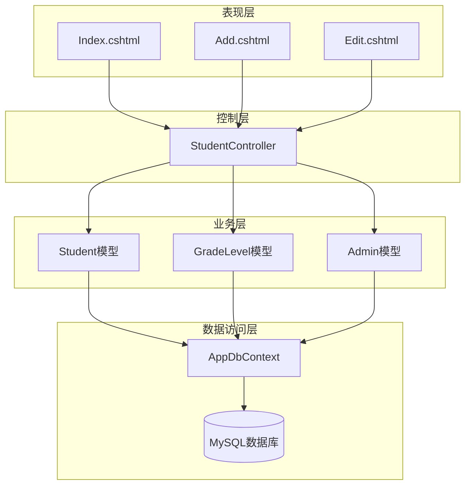
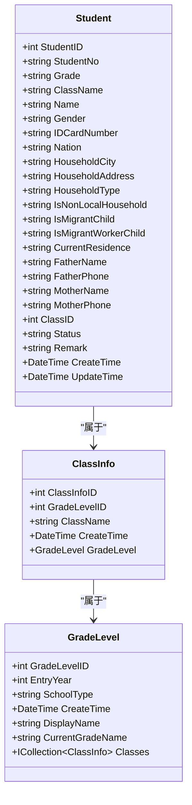
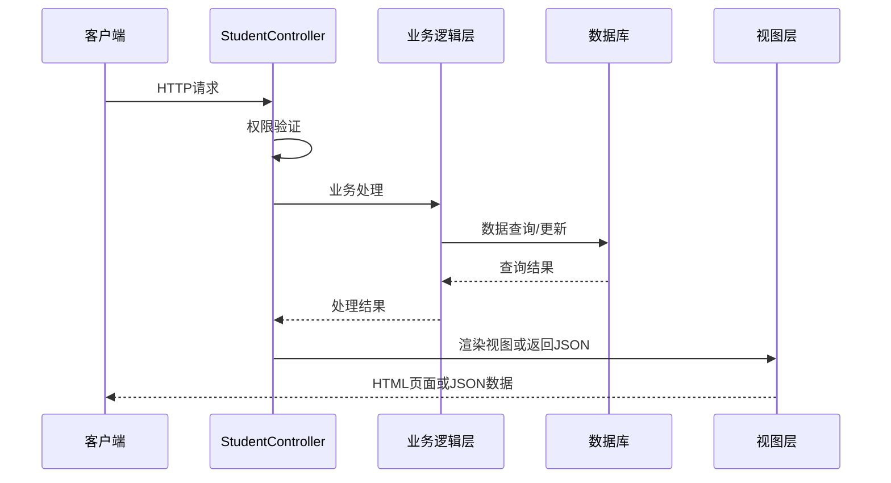
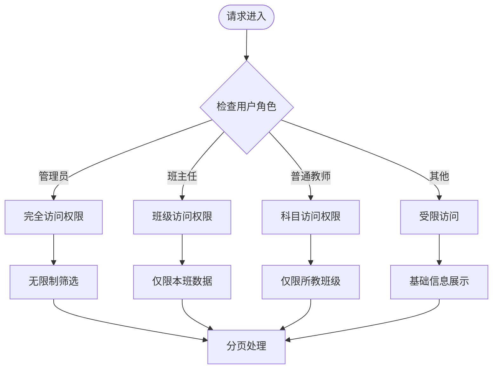
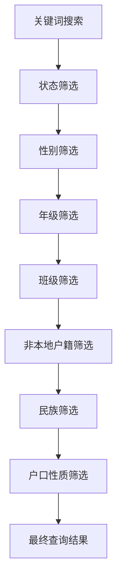
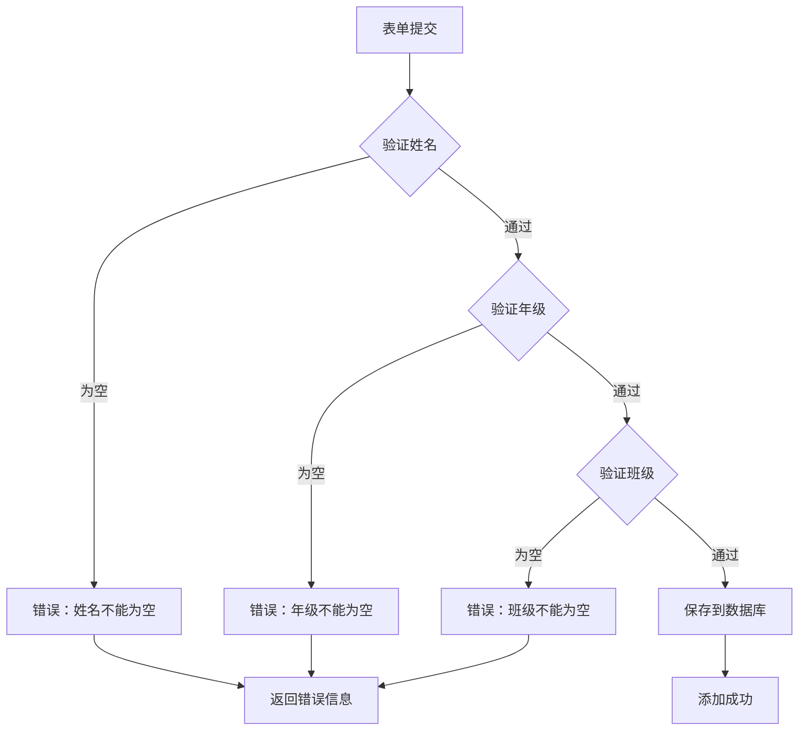
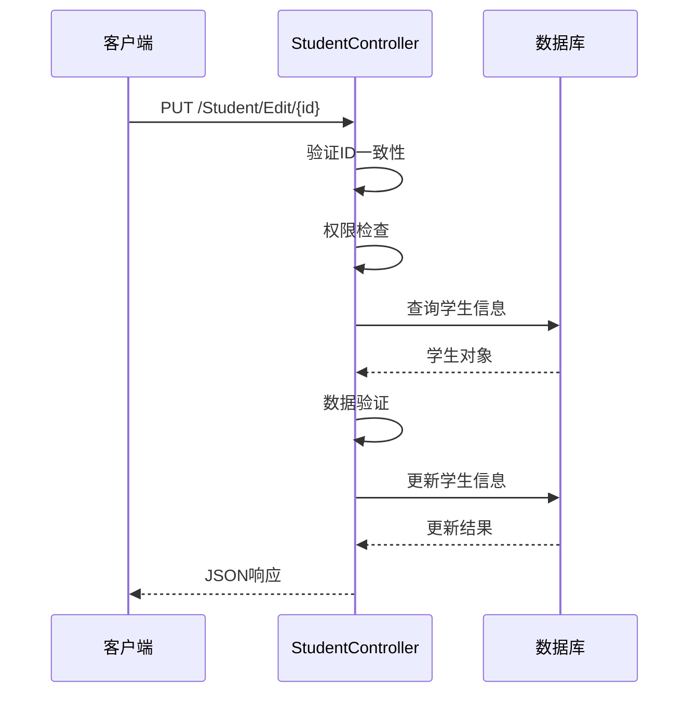
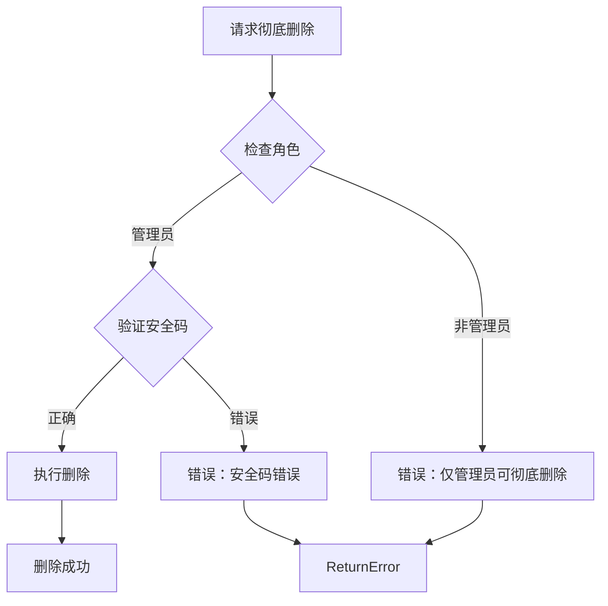
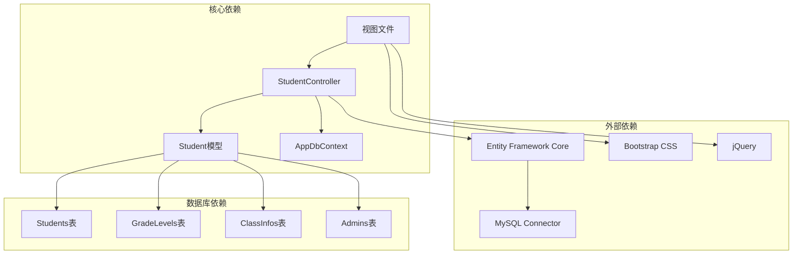

# 学生信息CRUD操作

<cite>
**本文档引用的文件**
- [StudentController.cs](file://Controllers/StudentController.cs)
- [Models.cs](file://Models/Models.cs)
- [GradeModels.cs](file://Models/GradeModels.cs)
- [AppDbContext.cs](file://Data/AppDbContext.cs)
- [Index.cshtml](file://Views/Student/Index.cshtml)
- [Add.cshtml](file://Views/Student/Add.cshtml)
- [Edit.cshtml](file://Views/Student/Edit.cshtml)
- [appsettings.json](file://appsettings.json)
</cite>

## 目录
1. [简介](#简介)
2. [项目结构](#项目结构)
3. [核心组件](#核心组件)
4. [架构概览](#架构概览)
5. [详细组件分析](#详细组件分析)
6. [依赖关系分析](#依赖关系分析)
7. [性能考虑](#性能考虑)
8. [故障排除指南](#故障排除指南)
9. [结论](#结论)

## 简介

本文档详细记录了学生信息管理系统中的CRUD操作API规范。系统基于ASP.NET Core框架构建，提供了完整的学生信息管理功能，包括学生列表查询、添加、编辑、删除、恢复和彻底删除等操作。

系统采用分层架构设计，包含控制器层、模型层、数据访问层和视图层，实现了完整的业务逻辑处理和数据持久化功能。

## 项目结构

学生信息管理系统的整体架构采用经典的三层架构模式：



**图表来源**
- [StudentController.cs:12-264](file://Controllers/StudentController.cs#L12-L264)
- [Models.cs:88-165](file://Models/Models.cs#L88-L165)
- [AppDbContext.cs:6-312](file://Data/AppDbContext.cs#L6-L312)

**章节来源**
- [StudentController.cs:12-264](file://Controllers/StudentController.cs#L12-L264)
- [Models.cs:88-165](file://Models/Models.cs#L88-L165)
- [AppDbContext.cs:6-312](file://Data/AppDbContext.cs#L6-L312)

## 核心组件

### 学生实体模型

学生实体是系统的核心数据模型，包含了学生的基本信息、户籍信息、家长信息等完整数据结构：



**图表来源**
- [Models.cs:88-165](file://Models/Models.cs#L88-L165)
- [GradeModels.cs:6-74](file://Models/GradeModels.cs#L6-L74)

### 控制器架构

StudentController作为核心控制器，负责处理所有学生相关的HTTP请求：

- **认证授权**：所有操作均需登录认证
- **权限控制**：基于角色和权限的细粒度控制
- **数据验证**：完整的客户端和服务端验证
- **异常处理**：统一的错误处理机制

**章节来源**
- [StudentController.cs:12-264](file://Controllers/StudentController.cs#L12-L264)
- [Models.cs:88-165](file://Models/Models.cs#L88-L165)

## 架构概览

系统采用MVC架构模式，实现了清晰的关注点分离：



**图表来源**
- [StudentController.cs:22-264](file://Controllers/StudentController.cs#L22-L264)
- [AppDbContext.cs:10-29](file://Data/AppDbContext.cs#L10-L29)

## 详细组件分析

### GET /Student/Index - 学生列表查询

#### 接口规范

**URL**: `/Student/Index`

**方法**: GET

**查询参数**:

| 参数名 | 类型 | 必填 | 默认值 | 描述 |
|--------|------|------|--------|------|
| keyword | string | 否 | null | 搜索关键词，支持姓名、学号、班级、年级模糊匹配 |
| status | string | 否 | null | 学生状态，可选值："在读"、"已删除"、"已毕业" |
| gender | string | 否 | null | 性别筛选，可选值："男"、"女" |
| grade | string | 否 | null | 年级筛选 |
| className | string | 否 | null | 班级筛选 |
| isNonLocal | string | 否 | null | 非本地户籍筛选 |
| nation | string | 否 | null | 民族筛选 |
| householdType | string | 否 | null | 户口性质筛选 |
| page | int | 否 | 1 | 页码，默认第1页 |
| tab | string | 否 | "student" | 显示标签页，可选值："student"、"grade"、"class"、"teaching" |
| examIds | int[] | 否 | null | 考试ID数组（仅在teaching标签页使用） |

#### 权限控制

系统根据用户角色实施不同的权限控制：



**图表来源**
- [StudentController.cs:22-264](file://Controllers/StudentController.cs#L22-L264)

#### 分页机制

系统采用固定大小的分页策略：

- **每页记录数**: 20条
- **分页算法**: 使用Skip/Take进行高效分页
- **总记录数**: 通过CountAsync统计
- **页码计算**: `(int)Math.Ceiling((double)total / pageSize)`

#### 筛选条件

系统支持多维度的复杂筛选：



**图表来源**
- [StudentController.cs:112-175](file://Controllers/StudentController.cs#L112-L175)

**章节来源**
- [StudentController.cs:22-264](file://Controllers/StudentController.cs#L22-L264)

### POST /Student/Add - 添加学生

#### 接口规范

**URL**: `/Student/Add`

**方法**: POST

**请求参数**（来自Add.cshtml表单）:

| 字段名 | 类型 | 必填 | 描述 |
|--------|------|------|------|
| StudentNo | string | 否 | 学号 |
| Name | string | 是 | 学生姓名 |
| Gender | string | 否 | 性别 |
| Nation | string | 否 | 民族 |
| IDCardNumber | string | 否 | 身份证号 |
| Grade | string | 是 | 年级 |
| ClassName | string | 是 | 班级 |
| Status | string | 否 | 就读状态，默认"在读" |
| HouseholdType | string | 否 | 户口性质 |
| HouseholdCity | string | 否 | 户口所在地 |
| HouseholdAddress | string | 否 | 户口地址 |
| IsNonLocalHousehold | string | 否 | 非本地户籍 |
| IsMigrantChild | string | 否 | 随迁子女 |
| IsMigrantWorkerChild | string | 否 | 工人子女 |
| CurrentResidence | string | 否 | 现居住地址 |
| FatherName | string | 否 | 父亲姓名 |
| FatherPhone | string | 否 | 父亲电话 |
| MotherName | string | 否 | 母亲姓名 |
| MotherPhone | string | 否 | 母亲电话 |
| Remark | string | 否 | 备注 |

#### 验证规则

系统实施严格的验证规则：



**图表来源**
- [StudentController.cs:302-335](file://Controllers/StudentController.cs#L302-L335)

#### 响应格式

**成功响应**:
```json
{
  "success": true
}
```

**失败响应**:
```json
{
  "success": false,
  "message": "错误信息"
}
```

**章节来源**
- [StudentController.cs:302-335](file://Controllers/StudentController.cs#L302-L335)
- [Add.cshtml:15-182](file://Views/Student/Add.cshtml#L15-L182)

### PUT /Student/Edit/{id} - 更新学生信息

#### 接口规范

**URL**: `/Student/Edit/{id}`

**方法**: POST

**路径参数**:
- `{id}`: 学生ID，整数类型

**请求参数**（与添加相同）:

系统采用相同的参数结构，但会进行额外的ID验证。

#### 权限控制

编辑操作实施更严格的权限控制：

- **管理员**: 可编辑所有学生信息
- **班主任**: 仅能编辑本班学生
- **普通教师**: 无编辑权限
- **受限用户**: 仅能查看基本信息

#### 处理流程



**图表来源**
- [StudentController.cs:392-454](file://Controllers/StudentController.cs#L392-L454)

#### 错误处理

系统提供详细的错误处理机制：

- **参数错误**: 返回"参数错误"
- **学生不存在**: 返回"学生不存在"
- **权限不足**: 返回"无编辑权限"
- **验证失败**: 返回具体验证错误

**章节来源**
- [StudentController.cs:392-454](file://Controllers/StudentController.cs#L392-L454)

### DELETE /Student/Delete/{id} - 软删除

#### 接口规范

**URL**: `/Student/Delete/{id}`

**方法**: POST

**路径参数**:
- `{id}`: 学生ID

#### 删除机制

系统采用软删除策略：

- **状态变更**: 将学生状态从"在读"改为"已删除"
- **保留数据**: 重要数据仍保留在数据库中
- **可恢复性**: 支持后续恢复操作

#### 响应格式

```json
{
  "success": true,
  "message": "已移入已删除"
}
```

**章节来源**
- [StudentController.cs:487-501](file://Controllers/StudentController.cs#L487-L501)

### POST /Student/Restore/{id} - 恢复删除

#### 接口规范

**URL**: `/Student/Restore/{id}`

**方法**: POST

**路径参数**:
- `{id}`: 学生ID

#### 恢复机制

系统支持从"已删除"状态恢复到"在读"状态：

- **状态还原**: 将Status字段恢复为"在读"
- **数据完整性**: 保持所有原始数据不变
- **权限控制**: 仅限于已删除的学生

**章节来源**
- [StudentController.cs:503-517](file://Controllers/StudentController.cs#L503-L517)

### POST /Student/HardDelete/{id} - 彻底删除

#### 接口规范

**URL**: `/Student/HardDelete/{id}`

**方法**: POST

**路径参数**:
- `{id}`: 学生ID

**请求参数**:
- `securityCode`: 安全码，需要管理员权限

#### 安全机制

彻底删除操作实施严格的安全控制：



**图表来源**
- [StudentController.cs:519-540](file://Controllers/StudentController.cs#L519-L540)

**章节来源**
- [StudentController.cs:519-540](file://Controllers/StudentController.cs#L519-L540)

## 依赖关系分析

系统各组件之间的依赖关系如下：



**图表来源**
- [StudentController.cs:5-6](file://Controllers/StudentController.cs#L5-L6)
- [AppDbContext.cs:10-29](file://Data/AppDbContext.cs#L10-L29)

**章节来源**
- [StudentController.cs:5-6](file://Controllers/StudentController.cs#L5-L6)
- [AppDbContext.cs:10-29](file://Data/AppDbContext.cs#L10-L29)

## 性能考虑

### 数据库优化

1. **索引策略**: 在常用查询字段上建立适当索引
2. **查询优化**: 使用投影查询减少数据传输
3. **连接池**: 合理配置数据库连接池
4. **缓存机制**: 对静态数据实施缓存

### 应用程序优化

1. **异步操作**: 所有数据库操作采用异步模式
2. **内存管理**: 及时释放不需要的对象
3. **并发控制**: 实施适当的并发访问控制
4. **资源管理**: 正确管理文件和网络资源

## 故障排除指南

### 常见问题及解决方案

#### 登录认证问题
- **症状**: 无法访问学生管理功能
- **原因**: 用户未登录或会话过期
- **解决**: 重新登录系统

#### 权限不足问题
- **症状**: 显示"无权限"或功能不可用
- **原因**: 用户角色权限不足
- **解决**: 联系管理员提升权限

#### 数据库连接问题
- **症状**: 页面加载缓慢或报错
- **原因**: 数据库连接异常
- **解决**: 检查数据库服务状态

#### 验证错误问题
- **症状**: 表单提交失败并显示验证错误
- **原因**: 必填字段缺失或格式不正确
- **解决**: 按提示修正表单数据

**章节来源**
- [StudentController.cs:302-335](file://Controllers/StudentController.cs#L302-L335)
- [StudentController.cs:392-454](file://Controllers/StudentController.cs#L392-L454)

## 结论

学生信息管理系统提供了完整、安全、高效的CRUD操作功能。系统采用现代化的架构设计，实现了良好的代码组织和职责分离。通过完善的权限控制、数据验证和错误处理机制，确保了系统的稳定性和安全性。

系统的主要优势包括：
- 完整的功能覆盖，满足日常学生管理需求
- 严格的安全控制，防止未授权访问
- 良好的用户体验，提供直观的操作界面
- 可扩展的设计，便于后续功能增强

建议在实际部署中重点关注数据库性能优化和安全配置，以确保系统在高负载情况下的稳定运行。