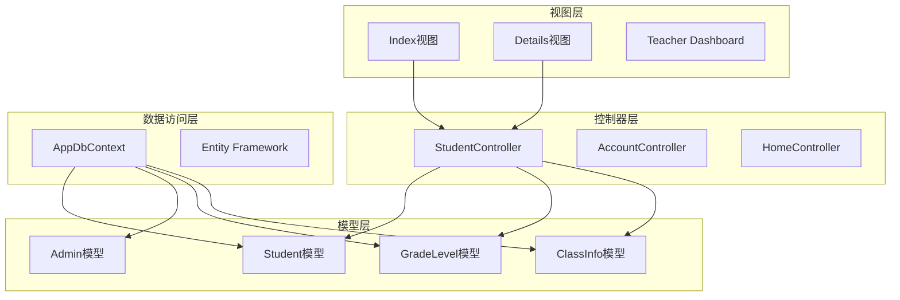
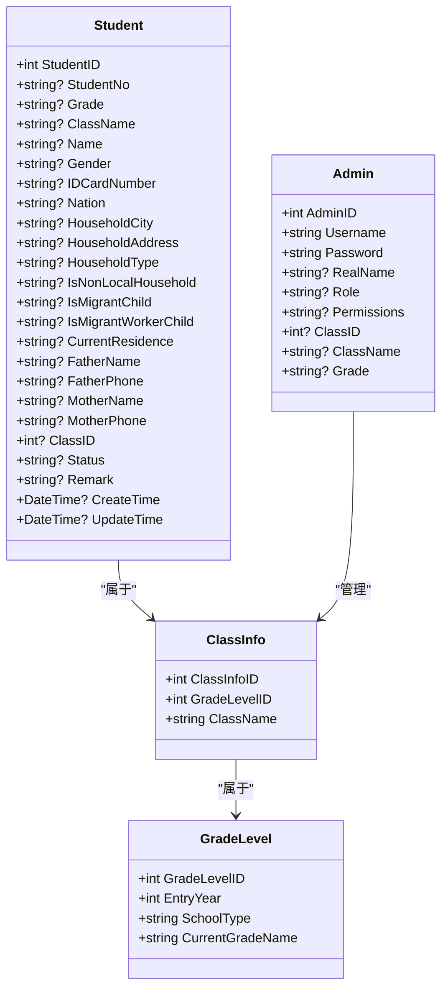
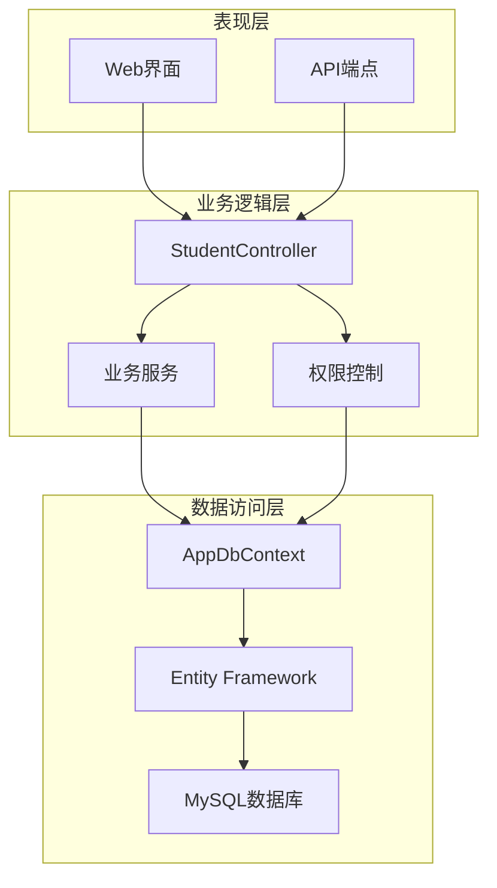
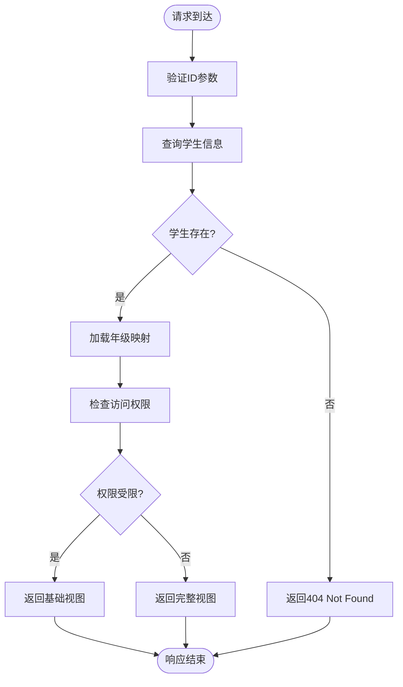
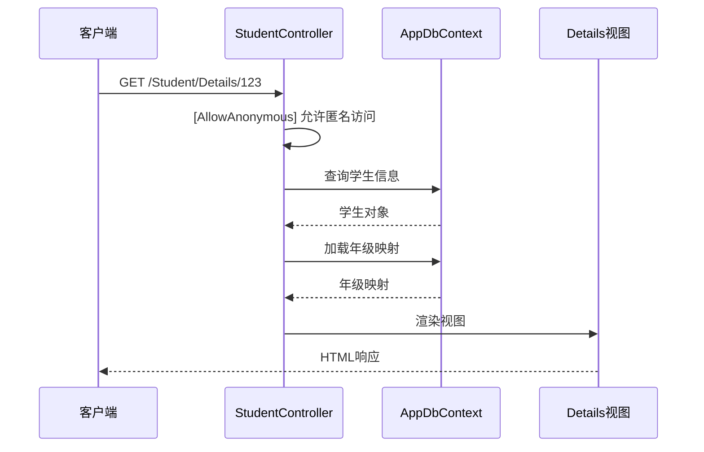
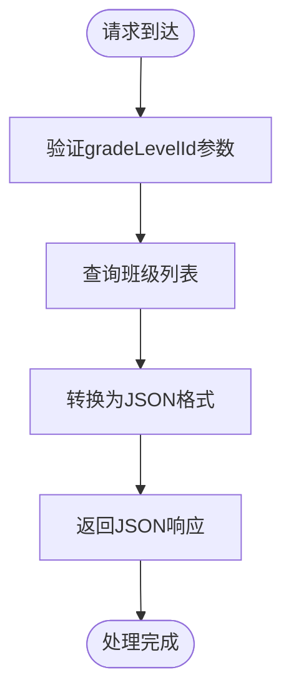
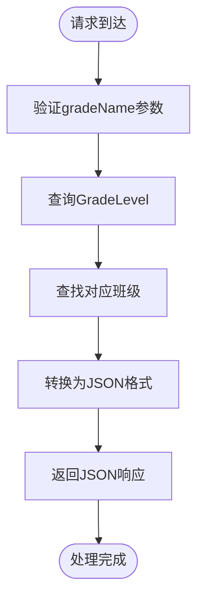
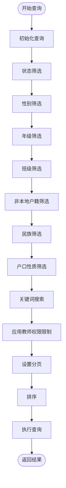
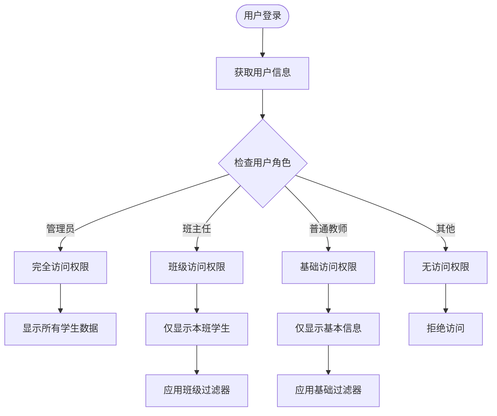
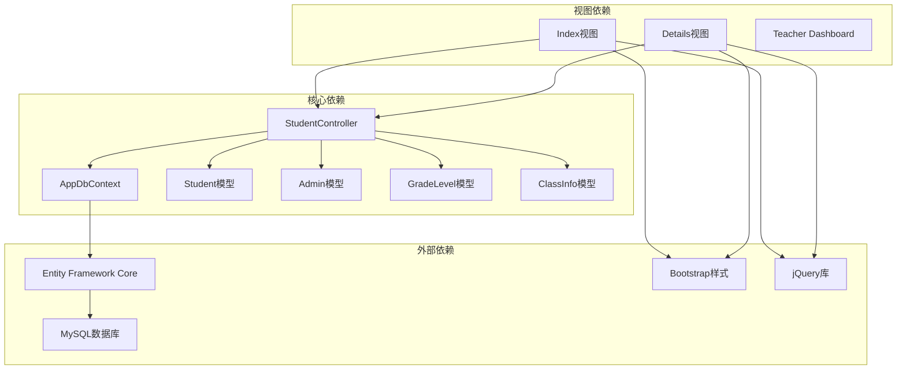

# 学生数据查询接口

<cite>
**本文档引用的文件**
- [StudentController.cs](file://Controllers/StudentController.cs)
- [Models.cs](file://Models/Models.cs)
- [GradeModels.cs](file://Models/GradeModels.cs)
- [AppDbContext.cs](file://Data/AppDbContext.cs)
- [Index.cshtml](file://Views/Student/Index.cshtml)
- [Details.cshtml](file://Views/Student/Details.cshtml)
- [Add_Permissions_Field.sql](file://Database/Add_Permissions_Field.sql)
- [Update_Permission_Keys.sql](file://Database/Update_Permission_Keys.sql)
</cite>

## 目录
1. [简介](#简介)
2. [项目结构](#项目结构)
3. [核心组件](#核心组件)
4. [架构概览](#架构概览)
5. [详细组件分析](#详细组件分析)
6. [依赖关系分析](#依赖关系分析)
7. [性能考虑](#性能考虑)
8. [故障排除指南](#故障排除指南)
9. [结论](#结论)

## 简介

本文档详细记录了学生数据查询接口的API规范，包括以下三个核心接口：

1. **GET /Student/Details/{id}** - 学生详情查询接口（匿名访问）
2. **GET /Student/GetClassesByGrade/{gradeLevelId}** - 根据年级ID获取班级列表
3. **GET /Student/GetClassesByGradeName/{gradeName}** - 根据年级名称获取班级列表
4. **GET /Student/Index** - 综合查询接口（多维度筛选、分页、排序）

这些接口提供了完整的学生成绩管理系统中的数据查询功能，支持不同角色用户的权限控制和数据访问限制。

## 项目结构

学生数据查询功能主要分布在以下模块中：



**图表来源**
- [StudentController.cs:12-20](file://Controllers/StudentController.cs#L12-L20)
- [Models.cs:88-165](file://Models/Models.cs#L88-L165)
- [GradeModels.cs:6-74](file://Models/GradeModels.cs#L6-L74)
- [AppDbContext.cs:10-29](file://Data/AppDbContext.cs#L10-L29)

**章节来源**
- [StudentController.cs:1-50](file://Controllers/StudentController.cs#L1-L50)
- [Models.cs:1-50](file://Models/Models.cs#L1-L50)
- [GradeModels.cs:1-25](file://Models/GradeModels.cs#L1-L25)
- [AppDbContext.cs:1-31](file://Data/AppDbContext.cs#L1-L31)

## 核心组件

### 学生模型设计

系统采用Entity Framework Core进行数据持久化，核心数据模型包括：



**图表来源**
- [Models.cs:88-165](file://Models/Models.cs#L88-L165)
- [Models.cs:6-86](file://Models/Models.cs#L6-L86)
- [GradeModels.cs:6-74](file://Models/GradeModels.cs#L6-L74)

### 权限控制系统

系统实现了基于角色的权限控制（RBAC），支持以下权限级别：

| 权限键 | 描述 | 默认拥有者 |
|--------|------|------------|
| `student_edit` | 编辑学生信息 | 班主任 |
| `student_delete` | 删除学生 | 班主任 |
| `student_add` | 添加学生 | 班主任 |
| `profile_basic` | 编辑基本信息 | 班主任 |
| `profile_phone` | 编辑联系方式 | 班主任 |
| `profile_idcard` | 编辑身份证信息 | 班主任 |
| `profile_cert` | 编辑证书信息 | 班主任 |

**章节来源**
- [Models.cs:46-48](file://Models/Models.cs#L46-L48)
- [Add_Permissions_Field.sql:1-43](file://Database/Add_Permissions_Field.sql#L1-L43)
- [Update_Permission_Keys.sql:1-35](file://Database/Update_Permission_Keys.sql#L1-L35)

## 架构概览

系统采用经典的三层架构设计，结合ASP.NET Core的MVC模式：



**图表来源**
- [StudentController.cs:12-20](file://Controllers/StudentController.cs#L12-L20)
- [AppDbContext.cs:31-312](file://Data/AppDbContext.cs#L31-L312)

## 详细组件分析

### GET /Student/Details/{id} - 学生详情查询

#### 接口规范

**请求方法**: GET  
**路径**: `/Student/Details/{id}`  
**认证**: 匿名访问  
**内容类型**: `text/html`  

#### 查询参数

| 参数名 | 类型 | 必需 | 描述 | 示例 |
|--------|------|------|------|------|
| id | int | 是 | 学生唯一标识符 | 123 |

#### 响应数据结构



**图表来源**
- [StudentController.cs:561-571](file://Controllers/StudentController.cs#L561-L571)
- [Details.cshtml:38-70](file://Views/Student/Details.cshtml#L38-L70)

#### 权限控制机制



**图表来源**
- [StudentController.cs:561-571](file://Controllers/StudentController.cs#L561-L571)
- [Details.cshtml:1-25](file://Views/Student/Details.cshtml#L1-L25)

**章节来源**
- [StudentController.cs:561-571](file://Controllers/StudentController.cs#L561-L571)
- [Details.cshtml:1-70](file://Views/Student/Details.cshtml#L1-L70)

### GET /Student/GetClassesByGrade/{gradeLevelId} - 按年级ID获取班级

#### 接口规范

**请求方法**: GET  
**路径**: `/Student/GetClassesByGrade/{gradeLevelId}`  
**认证**: 需要授权  
**内容类型**: `application/json`  

#### 查询参数

| 参数名 | 类型 | 必需 | 描述 | 示例 |
|--------|------|------|------|------|
| gradeLevelId | int | 是 | 年级级别ID | 5 |

#### 响应数据结构

响应为JSON数组，包含班级信息：

```json
[
  {
    "ClassInfoID": 1,
    "ClassName": "一班"
  },
  {
    "ClassInfoID": 2,
    "ClassName": "二班"
  }
]
```

#### 处理流程



**图表来源**
- [StudentController.cs:456-466](file://Controllers/StudentController.cs#L456-L466)

**章节来源**
- [StudentController.cs:456-466](file://Controllers/StudentController.cs#L456-L466)

### GET /Student/GetClassesByGradeName/{gradeName} - 按年级名称获取班级

#### 接口规范

**请求方法**: GET  
**路径**: `/Student/GetClassesByGradeName/{gradeName}`  
**认证**: 需要授权  
**内容类型**: `application/json`  

#### 查询参数

| 参数名 | 类型 | 必需 | 描述 | 示例 |
|--------|------|------|------|------|
| gradeName | string | 是 | 年级名称 | "一年级" |

#### 响应数据结构

响应为JSON数组，包含班级信息：

```json
[
  {
    "ClassInfoID": 1,
    "ClassName": "一班"
  },
  {
    "ClassInfoID": 2,
    "ClassName": "二班"
  }
]
```

#### 处理流程



**图表来源**
- [StudentController.cs:468-480](file://Controllers/StudentController.cs#L468-L480)

**章节来源**
- [StudentController.cs:468-480](file://Controllers/StudentController.cs#L468-L480)

### GET /Student/Index - 综合查询接口

#### 接口规范

**请求方法**: GET  
**路径**: `/Student/Index`  
**认证**: 需要授权  
**内容类型**: `text/html`  

#### 查询参数

| 参数名 | 类型 | 必需 | 描述 | 示例 |
|--------|------|------|------|------|
| keyword | string | 否 | 搜索关键词 | "张三" |
| status | string | 否 | 学生状态 | "在读" |
| gender | string | 否 | 性别 | "男" |
| grade | string | 否 | 年级 | "一年级" |
| className | string | 否 | 班级 | "一班" |
| isNonLocal | string | 否 | 非本地户籍 | "本地户籍" |
| nation | string | 否 | 民族 | "汉族" |
| householdType | string | 否 | 户口性质 | "农业" |
| page | int | 否 | 页码 | 1 |
| tab | string | 否 | 选项卡 | "student" |
| examIds | int[] | 否 | 考试ID数组 | [1,2,3] |

#### 筛选条件组合

系统支持多维度筛选条件的组合使用：



**图表来源**
- [StudentController.cs:112-222](file://Controllers/StudentController.cs#L112-L222)

#### 分页机制

- **每页大小**: 20条记录
- **排序规则**: 按StudentID降序排列
- **分页参数**: `page` (默认1)

#### 排序规则

系统支持多种排序方式：

| 排序字段 | 方向 | 用途 |
|----------|------|------|
| StudentID | 降序 | 默认排序，确保最新记录在前 |
| Grade, ClassName | 升序 | 年级和班级排序 |
| Name | 升序 | 姓名排序 |

#### 权限控制和数据范围限制



**图表来源**
- [StudentController.cs:26-215](file://Controllers/StudentController.cs#L26-L215)

#### 不同角色的查询权限差异

| 角色 | 可见字段 | 数据范围 | 操作权限 |
|------|----------|----------|----------|
| 管理员 | 全部字段 | 全校学生 | 完全操作 |
| 班主任 | 全部字段 | 本班学生 | 完全操作 |
| 普通教师 | 基本信息 | 任教班级 | 有限操作 |
| 其他用户 | 基本信息 | 无 | 无 |

#### 响应数据结构

查询结果返回HTML页面，包含以下主要部分：

1. **搜索表单** - 支持多维度筛选
2. **统计信息** - 显示总记录数和分页信息
3. **数据表格** - 展示学生详细信息
4. **分页控件** - 支持页码导航

**章节来源**
- [StudentController.cs:22-264](file://Controllers/StudentController.cs#L22-L264)
- [Index.cshtml:254-512](file://Views/Student/Index.cshtml#L254-L512)

## 依赖关系分析

系统各组件之间的依赖关系如下：



**图表来源**
- [StudentController.cs:1-20](file://Controllers/StudentController.cs#L1-L20)
- [AppDbContext.cs:1-31](file://Data/AppDbContext.cs#L1-L31)
- [Index.cshtml:597-674](file://Views/Student/Index.cshtml#L597-L674)

**章节来源**
- [StudentController.cs:1-50](file://Controllers/StudentController.cs#L1-L50)
- [AppDbContext.cs:1-31](file://Data/AppDbContext.cs#L1-L31)

## 性能考虑

### 查询优化策略

1. **索引优化**: 在常用查询字段上建立适当索引
2. **分页查询**: 使用Skip/Take避免一次性加载大量数据
3. **投影查询**: 只查询需要的字段，减少数据传输
4. **缓存策略**: 对静态数据（如年级、班级列表）实施缓存

### 内存管理

- **异步查询**: 使用async/await避免阻塞线程
- **及时释放**: 正确管理数据库连接和实体生命周期
- **批量操作**: 对大批量数据操作使用事务

### 安全考虑

- **SQL注入防护**: 使用Entity Framework的参数化查询
- **XSS防护**: 对用户输入进行适当的HTML编码
- **CSRF保护**: 使用Anti-Forgery Token防止跨站请求伪造

## 故障排除指南

### 常见问题及解决方案

#### 1. 权限不足错误

**症状**: 访问受限制的接口返回403状态码  
**原因**: 用户权限不足或未登录  
**解决方案**: 
- 确认用户已正确登录
- 检查用户权限配置
- 验证角色标识

#### 2. 数据查询异常

**症状**: 查询接口返回500错误  
**原因**: 数据库连接问题或查询语法错误  
**解决方案**:
- 检查数据库连接字符串
- 验证查询参数的有效性
- 查看服务器日志获取详细错误信息

#### 3. 分页显示问题

**症状**: 分页链接无效或数据不完整  
**原因**: 分页参数传递错误或数据库查询问题  
**解决方案**:
- 确认page参数为正整数
- 检查数据库中是否存在足够的数据
- 验证排序字段的正确性

**章节来源**
- [StudentController.cs:521-540](file://Controllers/StudentController.cs#L521-L540)
- [StudentController.cs:978-995](file://Controllers/StudentController.cs#L978-L995)

## 结论

本文档详细记录了学生数据查询接口的设计和实现，包括：

1. **接口规范**: 明确了各个API端点的请求方法、参数和响应格式
2. **权限控制**: 实现了基于角色的细粒度权限管理
3. **数据模型**: 设计了清晰的实体关系和数据结构
4. **性能优化**: 提供了查询优化和安全考虑建议
5. **故障排除**: 列出了常见问题及其解决方案

系统通过合理的架构设计和严格的权限控制，为不同角色的用户提供适当的数据访问能力，同时确保系统的安全性和性能。建议在实际部署时根据具体需求调整权限配置和查询参数，以满足特定的业务场景要求。