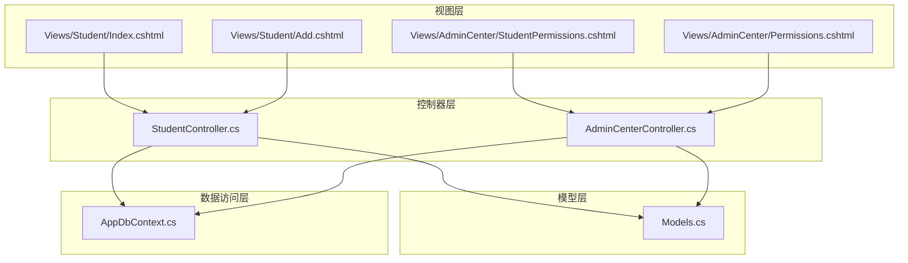
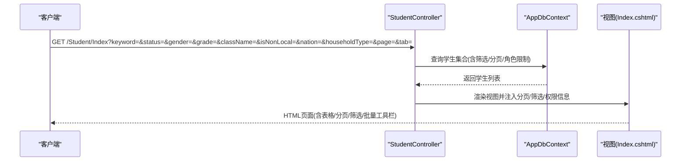
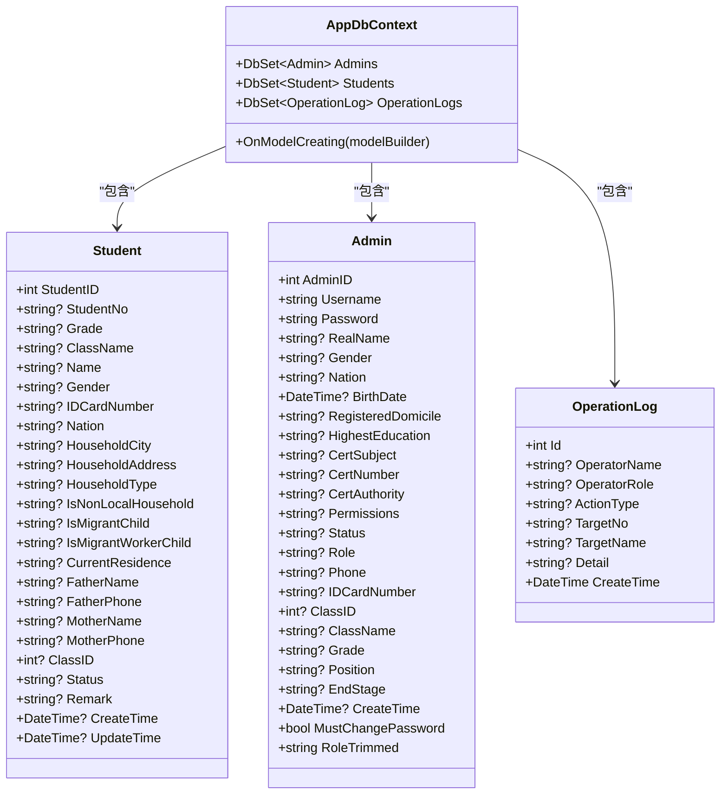

# 学生管理API

<cite>
**本文档引用的文件**
- [StudentController.cs](file://Controllers/StudentController.cs)
- [Models.cs](file://Models/Models.cs)
- [AppDbContext.cs](file://Data/AppDbContext.cs)
- [Index.cshtml](file://Views/Student/Index.cshtml)
- [Add.cshtml](file://Views/Student/Add.cshtml)
- [AdminCenterController.cs](file://Controllers/AdminCenterController.cs)
- [StudentPermissions.cshtml](file://Views/AdminCenter/StudentPermissions.cshtml)
- [Permissions.cshtml](file://Views/AdminCenter/Permissions.cshtml)
</cite>

## 目录
1. [简介](#简介)
2. [项目结构](#项目结构)
3. [核心组件](#核心组件)
4. [架构总览](#架构总览)
5. [详细组件分析](#详细组件分析)
6. [依赖关系分析](#依赖关系分析)
7. [性能考虑](#性能考虑)
8. [故障排查指南](#故障排查指南)
9. [结论](#结论)

## 简介
本文件面向学生管理系统的API接口文档，覆盖学生信息的增删改查、批量导入导出、软删除/恢复/彻底删除等能力，并说明筛选条件、权限控制与数据访问限制。文档同时提供请求/响应示例路径与最佳实践建议，帮助开发者快速集成与维护。

## 项目结构
系统采用经典的三层架构：控制器层负责HTTP请求处理与权限校验；模型层定义实体与数据验证；数据上下文层负责EF Core映射与数据库交互。学生管理功能主要集中在学生控制器与相关视图中。

图表来源
- [StudentController.cs:12-996](file://Controllers/StudentController.cs#L12-L996)
- [AdminCenterController.cs:12-346](file://Controllers/AdminCenterController.cs#L12-L346)
- [Models.cs:88-165](file://Models/Models.cs#L88-L165)
- [AppDbContext.cs:6-294](file://Data/AppDbContext.cs#L6-L294)
- [Index.cshtml:1-1030](file://Views/Student/Index.cshtml#L1-L1030)
- [Add.cshtml:1-210](file://Views/Student/Add.cshtml#L1-L210)
- [StudentPermissions.cshtml:1-117](file://Views/AdminCenter/StudentPermissions.cshtml#L1-L117)
- [Permissions.cshtml:1-145](file://Views/AdminCenter/Permissions.cshtml#L1-L145)

章节来源
- [StudentController.cs:12-996](file://Controllers/StudentController.cs#L12-L996)
- [Models.cs:88-165](file://Models/Models.cs#L88-L165)
- [AppDbContext.cs:6-294](file://Data/AppDbContext.cs#L6-L294)
- [Index.cshtml:1-1030](file://Views/Student/Index.cshtml#L1-L1030)
- [Add.cshtml:1-210](file://Views/Student/Add.cshtml#L1-L210)
- [AdminCenterController.cs:12-346](file://Controllers/AdminCenterController.cs#L12-L346)
- [StudentPermissions.cshtml:1-117](file://Views/AdminCenter/StudentPermissions.cshtml#L1-L117)
- [Permissions.cshtml:1-145](file://Views/AdminCenter/Permissions.cshtml#L1-L145)

## 核心组件
- 学生实体：包含学号、姓名、性别、民族、身份证号、年级、班级、状态、户籍信息、家长信息、备注及时间戳等字段。
- 数据上下文：映射Student、Admin、ClassInfo、GradeLevel、OperationLog等表，建立实体关系与索引约束。
- 学生控制器：提供查询、新增、编辑、删除、恢复、彻底删除、导入、导出、批量操作等接口。
- 权限控制器：提供批量学生权限管理界面与接口，支持按角色授予“添加/编辑/删除”学生权限。
- 视图：提供学生列表、添加/编辑弹窗、导入模板下载、批量操作UI等。

章节来源
- [Models.cs:88-165](file://Models/Models.cs#L88-L165)
- [AppDbContext.cs:50-78](file://Data/AppDbContext.cs#L50-L78)
- [StudentController.cs:22-264](file://Controllers/StudentController.cs#L22-L264)
- [AdminCenterController.cs:250-289](file://Controllers/AdminCenterController.cs#L250-L289)

## 架构总览
学生管理API遵循REST风格，结合AJAX异步交互与服务端渲染。控制器通过身份认证与授权中间件，结合角色与细粒度权限进行访问控制；数据访问层基于Entity Framework Core进行ORM映射与事务提交；视图层提供丰富的筛选、分页与批量操作UI。

图表来源
- [StudentController.cs:22-264](file://Controllers/StudentController.cs#L22-L264)
- [Index.cshtml:254-332](file://Views/Student/Index.cshtml#L254-L332)

## 详细组件分析

### 学生信息查询接口
- 方法与URL
  - GET /Student/Index
- 请求参数
  - keyword: 关键词（姓名/学号/班级/年级/民族/家长电话等）
  - status: 状态筛选（在读/已删除/已毕业/空值表示默认在读）
  - gender: 性别（男/女/全部）
  - grade: 年级（全部）
  - className: 班级（全部）
  - isNonLocal: 是否非本地户籍（本地户籍/省内非本地户籍/省外非本地户籍/全部）
  - nation: 民族（全部）
  - householdType: 户口性质（农业户口/非农业户口/全部）
  - page: 页码（默认1）
  - tab: 视图标签（student/grade/class/teaching）
  - examIds: 所教班级对比考试ID数组（仅teaching标签有效）
- 响应
  - 返回学生列表与分页信息，支持AJAX局部刷新（teaching标签）。
- 筛选逻辑
  - 默认排除“已删除”和“已毕业”学生（status为空时）。
  - 班主任仅能查看本人班级学生；管理年级标签仅按年级过滤。
  - 非班主任/非管理员角色仅展示受限字段。
- 示例路径
  - [查询入口:22-264](file://Controllers/StudentController.cs#L22-L264)
  - [视图筛选与分页:254-332](file://Views/Student/Index.cshtml#L254-L332)

章节来源
- [StudentController.cs:22-264](file://Controllers/StudentController.cs#L22-L264)
- [Index.cshtml:254-332](file://Views/Student/Index.cshtml#L254-L332)

### 学生信息新增接口
- 方法与URL
  - GET /Student/Add
  - POST /Student/Add
- 请求参数（POST）
  - Student模型字段（学号、姓名、性别、民族、身份证号、年级、班级、状态、户籍信息、家长信息、备注等）
- 响应
  - 新增成功：重定向至列表或返回JSON（AJAX）
  - 校验失败：返回表单与错误消息
- 示例路径
  - [新增页面:15-182](file://Views/Student/Add.cshtml#L15-L182)
  - [新增处理:302-335](file://Controllers/StudentController.cs#L302-L335)

章节来源
- [Add.cshtml:15-182](file://Views/Student/Add.cshtml#L15-L182)
- [StudentController.cs:302-335](file://Controllers/StudentController.cs#L302-L335)

### 学生信息编辑接口
- 方法与URL
  - GET /Student/Edit/{id}
  - POST /Student/Edit/{id}
- 请求参数（POST）
  - Student模型字段（同新增）
- 响应
  - 编辑成功：重定向至列表或返回JSON（AJAX）
  - 参数错误/不存在：返回错误信息
- 示例路径
  - [编辑页面:15-182](file://Views/Student/Add.cshtml#L15-L182)
  - [编辑处理:392-454](file://Controllers/StudentController.cs#L392-L454)

章节来源
- [Add.cshtml:15-182](file://Views/Student/Add.cshtml#L15-L182)
- [StudentController.cs:392-454](file://Controllers/StudentController.cs#L392-L454)

### 学生信息删除/恢复/彻底删除接口
- 方法与URL
  - POST /Student/Delete
  - POST /Student/Restore
  - POST /Student/HardDelete
- 请求参数
  - Delete/Restore: id
  - HardDelete: id, securityCode
- 权限与安全
  - Delete：所有有权限者可执行（AJAX返回JSON）
  - Restore：仅管理员可彻底删除
  - HardDelete：仅管理员且安全码正确方可执行
- 响应
  - 统一返回JSON：{success, message}
- 示例路径
  - [软删除/恢复/彻底删除:487-540](file://Controllers/StudentController.cs#L487-L540)

章节来源
- [StudentController.cs:487-540](file://Controllers/StudentController.cs#L487-L540)

### 批量操作接口
- 方法与URL
  - POST /Student/BatchDelete
  - POST /Student/BatchRestore
  - POST /Student/BatchGraduate
- 请求参数
  - ids: 学生ID数组
- 响应
  - JSON：{success, message}
- 示例路径
  - [批量删除/恢复/毕业:929-967](file://Controllers/StudentController.cs#L929-L967)

章节来源
- [StudentController.cs:929-967](file://Controllers/StudentController.cs#L929-L967)

### 批量导入接口
- 方法与URL
  - POST /Student/Import
- 请求参数
  - file: Excel文件（.xlsx/.xls）
- 权限与校验
  - 班主任无导入权限
  - 非管理员需具备student_add权限
  - 校验文件扩展名与空文件
  - 去重：根据现有在读学生学号集合判断重复
- 数据结构（Excel列顺序）
  - A: 学号*, B: 姓名*, C: 性别, D: 民族, E: 身份证号, F: 年级, G: 班级, H: 就读状态, I: 户口性质, J: 户口所在地, K: 户口簿地址, L: 是否非本地户籍, M: 是否随迁子女, N: 是否进城务工子女, O: 现居住地址, P: 父亲姓名, Q: 父亲电话, R: 母亲姓名, S: 毫秒级时间戳
- 响应
  - JSON：{success, message, imported, skipped, errors}
- 示例路径
  - [导入处理:575-701](file://Controllers/StudentController.cs#L575-L701)

章节来源
- [StudentController.cs:575-701](file://Controllers/StudentController.cs#L575-L701)

### 批量导出接口
- 方法与URL
  - GET /Student/Export
- 请求参数
  - 与查询接口相同的筛选参数（keyword/status/gender/grade/className/isNonLocal/nation/householdType）
  - 班主任仅能导出本人班级数据
- 响应
  - 返回Excel文件流（application/vnd.openxmlformats-officedocument.spreadsheetml.sheet）
- 示例路径
  - [导出处理:730-882](file://Controllers/StudentController.cs#L730-L882)

章节来源
- [StudentController.cs:730-882](file://Controllers/StudentController.cs#L730-L882)

### 下载导入模板接口
- 方法与URL
  - GET /Student/DownloadTemplate
- 权限
  - 班主任无权限
- 响应
  - 返回Excel模板文件流
- 示例路径
  - [模板下载:703-728](file://Controllers/StudentController.cs#L703-L728)

章节来源
- [StudentController.cs:703-728](file://Controllers/StudentController.cs#L703-L728)

### 班级联动接口
- 方法与URL
  - GET /Student/GetClassesByGrade?gradeLevelId={id}
  - GET /Student/GetClassesByGradeName?gradeName={name}
- 响应
  - JSON：[{ClassInfoID, ClassName}]
- 示例路径
  - [班级联动:456-480](file://Controllers/StudentController.cs#L456-L480)

章节来源
- [StudentController.cs:456-480](file://Controllers/StudentController.cs#L456-L480)

### 权限控制与角色差异
- 角色与权限
  - 管理员：拥有所有权限，可导入、导出、彻底删除、批量操作、权限管理
  - 班主任：仅能查看/编辑/删除本人班级学生，无导入/导出/彻底删除权限
  - 普通教师：按权限位student_edit/student_delete/student_add控制
- 权限管理界面
  - 管理员可通过“批量学生权限管理”页面勾选“添加/编辑/删除”学生权限
- 示例路径
  - [权限管理页面:1-117](file://Views/AdminCenter/StudentPermissions.cshtml#L1-L117)
  - [权限批量更新接口:260-289](file://Controllers/AdminCenterController.cs#L260-L289)

章节来源
- [StudentPermissions.cshtml:1-117](file://Views/AdminCenter/StudentPermissions.cshtml#L1-L117)
- [AdminCenterController.cs:260-289](file://Controllers/AdminCenterController.cs#L260-L289)

## 依赖关系分析

图表来源
- [Models.cs:88-165](file://Models/Models.cs#L88-L165)
- [AppDbContext.cs:10-294](file://Data/AppDbContext.cs#L10-L294)

章节来源
- [Models.cs:88-165](file://Models/Models.cs#L88-L165)
- [AppDbContext.cs:10-294](file://Data/AppDbContext.cs#L10-L294)

## 性能考虑
- 分页与筛选
  - 列表查询默认每页20条，支持多字段筛选与排序，避免一次性加载全量数据。
- 数据访问
  - 使用异步查询与延迟加载策略，减少不必要的数据库往返。
- 导入优化
  - Excel解析采用流式读取与内存池，避免大文件占用过多内存。
- 权限与角色
  - 在查询阶段即按角色裁剪数据范围，降低前端渲染压力。

## 故障排查指南
- 常见错误与处理
  - 参数错误/不存在：编辑接口会返回错误信息，确保id与模型StudentID一致。
  - 权限不足：导入/导出/彻底删除/权限管理需管理员角色。
  - 安全码错误：彻底删除需要正确的安全码。
  - Excel格式不符：导入前请下载模板，严格按列顺序填写。
- 日志审计
  - 所有学生相关操作均写入操作日志，管理员可在后台查看。
- 示例路径
  - [操作日志记录:978-995](file://Controllers/StudentController.cs#L978-L995)
  - [权限管理页面:1-145](file://Views/AdminCenter/Permissions.cshtml#L1-L145)

章节来源
- [StudentController.cs:978-995](file://Controllers/StudentController.cs#L978-L995)
- [Permissions.cshtml:1-145](file://Views/AdminCenter/Permissions.cshtml#L1-L145)

## 结论
本学生管理API提供了完整的增删改查、批量导入导出、软删除/恢复/彻底删除与权限控制能力。通过角色与细粒度权限的结合，系统在保证安全性的同时，提供了灵活的数据访问与操作体验。建议在生产环境中配合缓存、分页与日志审计，持续优化性能与可观测性。