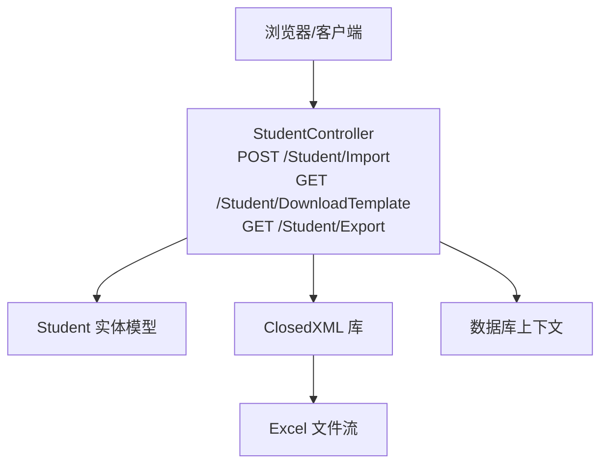
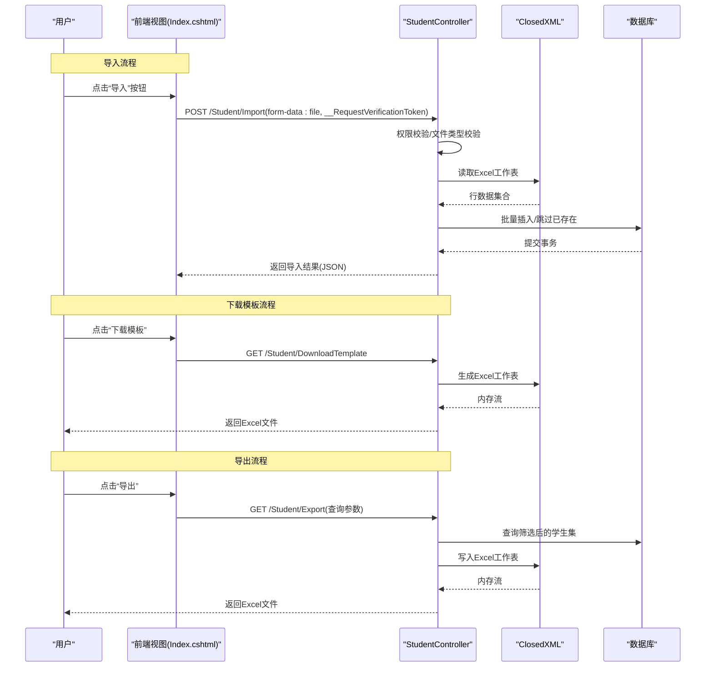
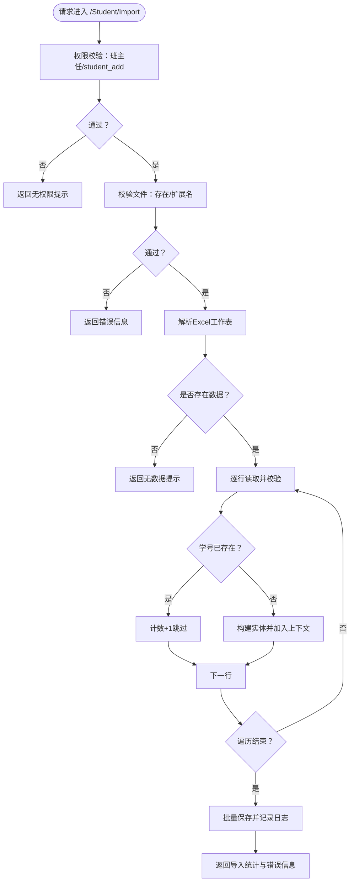
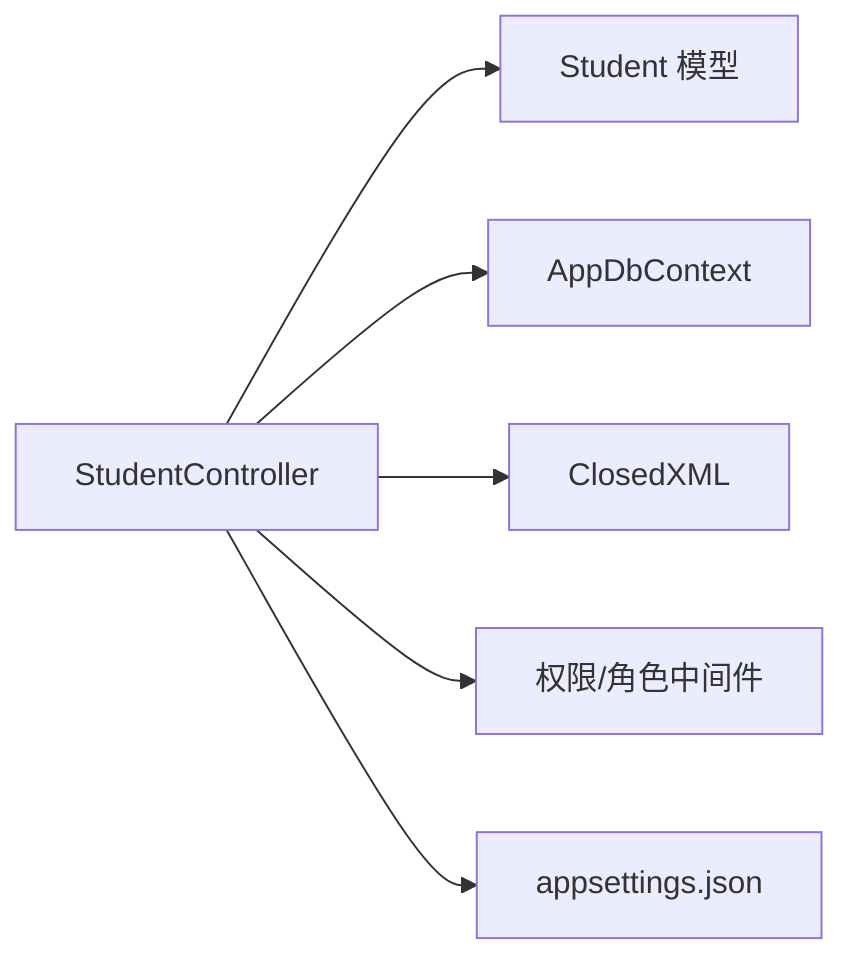

# 批量导入导出操作

<cite>
**本文引用的文件**
- [StudentController.cs](file://Controllers/StudentController.cs)
- [Models.cs](file://Models/Models.cs)
- [Index.cshtml](file://Views/Student/Index.cshtml)
- [appsettings.json](file://appsettings.json)
</cite>

## 目录
1. [简介](#简介)
2. [项目结构](#项目结构)
3. [核心组件](#核心组件)
4. [架构总览](#架构总览)
5. [详细组件分析](#详细组件分析)
6. [依赖关系分析](#依赖关系分析)
7. [性能考量](#性能考量)
8. [故障排查指南](#故障排查指南)
9. [结论](#结论)
10. [附录](#附录)

## 简介
本文件面向批量导入导出操作，聚焦以下三个接口：
- POST /Student/Import：Excel 文件批量导入学生数据
- GET /Student/DownloadTemplate：下载学生导入模板
- GET /Student/Export：批量导出学生数据

内容涵盖参数规范、Excel 列映射、数据校验规则、错误处理、权限控制、性能建议与最佳实践，并提供完整的导入流程说明与模板示例。

## 项目结构
- 控制器层：批量导入导出逻辑集中在控制器中，使用 ClosedXML 进行 Excel 读写
- 模型层：学生实体模型定义了导入/导出字段及长度限制
- 视图层：前端通过模态框触发导入、下载模板与导出

图表来源
- [StudentController.cs:573-882](file://Controllers/StudentController.cs#L573-L882)
- [Models.cs:88-165](file://Models/Models.cs#L88-L165)

章节来源
- [StudentController.cs:573-882](file://Controllers/StudentController.cs#L573-L882)
- [Models.cs:88-165](file://Models/Models.cs#L88-L165)

## 核心组件
- 控制器方法
  - 导入：POST /Student/Import（IFormFile 参数）
  - 下载模板：GET /Student/DownloadTemplate（返回 Excel 文件）
  - 导出：GET /Student/Export（查询参数筛选）
- 数据模型：Student 实体字段与长度约束
- 前端交互：通过视图中的按钮与模态框触发

章节来源
- [StudentController.cs:573-882](file://Controllers/StudentController.cs#L573-L882)
- [Models.cs:88-165](file://Models/Models.cs#L88-L165)
- [Index.cshtml:524-550](file://Views/Student/Index.cshtml#L524-L550)

## 架构总览
批量导入导出涉及前后端交互、Excel 解析、数据库持久化与权限校验。

图表来源
- [StudentController.cs:573-882](file://Controllers/StudentController.cs#L573-L882)
- [Index.cshtml:524-550](file://Views/Student/Index.cshtml#L524-L550)

## 详细组件分析

### POST /Student/Import 批量导入
- 请求方式与路径
  - 方法：POST
  - 路径：/Student/Import
- 参数
  - IFormFile file：上传的 Excel 文件（.xlsx/.xls）
  - 验证令牌：__RequestVerificationToken（由视图提供）
- 权限控制
  - 班主任无导入权限（直接拒绝）
  - 非管理员需具备“student_add”权限
- 文件格式要求
  - 仅支持 .xlsx 或 .xls
  - Excel 必须包含有效数据区域
- 列对应关系（按列序号读取，从第1列开始）
  - 1: 学号
  - 2: 姓名
  - 3: 性别
  - 4: 民族
  - 5: 身份证号
  - 6: 年级
  - 7: 班级
  - 8: 就读状态
  - 9: 户口性质
  - 10: 户口所在地
  - 11: 户口簿地址
  - 12: 是否非本地户籍
  - 13: 是否随迁子女
  - 14: 是否进城务工子女
  - 15: 现居住地址
  - 16: 父亲姓名
  - 17: 父亲电话
  - 18: 母亲姓名
  - 19: 母亲电话
  - 20: 备注
- 数据验证规则
  - 跳过空行：学号或姓名为空则跳过
  - 去重策略：若学号已存在且状态为“在读”，则跳过该行
  - 默认状态：未指定状态时，默认为“在读”
- 错误处理
  - 文件为空、类型不符、无数据区域、解析异常等均返回 JSON 结果
  - 成功后批量提交数据库并记录操作日志
- 返回值
  - JSON 包含 success、message、导入数量、跳过数量、错误详情

图表来源
- [StudentController.cs:573-701](file://Controllers/StudentController.cs#L573-L701)

章节来源
- [StudentController.cs:573-701](file://Controllers/StudentController.cs#L573-L701)
- [Index.cshtml:867-887](file://Views/Student/Index.cshtml#L867-L887)

### GET /Student/DownloadTemplate 下载导入模板
- 请求方式与路径
  - 方法：GET
  - 路径：/Student/DownloadTemplate
- 权限控制
  - 班主任无权限，直接返回提示文本
- 模板列定义
  - 1: 学号
  - 2: 姓名
  - 3: 性别
  - 4: 民族
  - 5: 身份证号
  - 6: 年级
  - 7: 班级
  - 8: 就读状态
  - 9: 户口性质
  - 10: 户口所在地
  - 11: 户口簿地址
  - 12: 是否非本地户籍
  - 13: 是否随迁子女
  - 14: 是否进城务工子女
  - 15: 现居住地址
  - 16: 父亲姓名
  - 17: 父亲电话
  - 18: 母亲姓名
  - 19: 母亲电话
  - 20: 备注
- 文件格式
  - application/vnd.openxmlformats-officedocument.spreadsheetml.sheet（.xlsx）

章节来源
- [StudentController.cs:703-728](file://Controllers/StudentController.cs#L703-L728)
- [Index.cshtml:530-530](file://Views/Student/Index.cshtml#L530-L530)

### GET /Student/Export 批量导出
- 请求方式与路径
  - 方法：GET
  - 路径：/Student/Export
- 查询参数
  - keyword：关键词（姓名/学号/班级/年级）
  - status：就讀状态（在读/已删除/已毕业）
  - gender：性别
  - grade：年级
  - className：班级
  - isNonLocal：是否非本地户籍
  - nation：民族（模糊匹配）
  - householdType：户口性质
- 权限控制
  - 班主任仅能导出其本人班级的数据
- 导出内容
  - 工作表“学生数据”，包含与编辑页一致的字段
  - 表头与字段顺序：学号、姓名、性别、民族、身份证号、年级、班级、就读状态、户口性质、户口所在地（省市）、户口簿中首页家庭地址、是否非本地户籍、是否随迁子女、是否进城务工人员子女、现居住家庭地址、父亲姓名、父亲电话、母亲姓名、母亲电话、备注
- 文件命名
  - 学生数据_年月日_时分秒.xlsx

章节来源
- [StudentController.cs:729-882](file://Controllers/StudentController.cs#L729-L882)

## 依赖关系分析
- 组件耦合
  - 控制器依赖模型与数据库上下文进行数据持久化
  - 使用 ClosedXML 进行 Excel 读写，降低对第三方服务的耦合
- 外部依赖
  - ClosedXML：用于读取/写入 Excel
  - ASP.NET Core MVC：用于路由、模型绑定与响应输出
- 权限与配置
  - 权限键“student_add”用于判断导入权限
  - 安全码用于彻底删除等敏感操作（与导入导出同属系统安全配置）

图表来源
- [StudentController.cs:573-882](file://Controllers/StudentController.cs#L573-L882)
- [Models.cs:88-165](file://Models/Models.cs#L88-L165)
- [appsettings.json](file://appsettings.json)

章节来源
- [StudentController.cs:573-882](file://Controllers/StudentController.cs#L573-L882)
- [Models.cs:88-165](file://Models/Models.cs#L88-L165)
- [appsettings.json](file://appsettings.json)

## 性能考量
- 导入性能
  - 使用内存流避免临时磁盘写入，提升读取速度
  - 批量保存：逐行解析完成后一次性提交，减少数据库往返
  - 去重策略：基于现有在读学生学号集合进行 O(1) 查找
- 导出性能
  - 仅导出筛选后的数据，避免全表扫描
  - 固定列宽与自适应列宽结合，保证文件体积可控
- 前端体验
  - 导入/导出过程显示进度与结果，避免长时间无反馈
- 最佳实践
  - 大文件拆分：建议每批不超过 1000 行，以平衡内存占用与网络传输
  - 异步处理：对于超大数据集，可考虑后台任务队列异步处理
  - 日志审计：导入/导出均记录操作日志，便于追踪与回溯

## 故障排查指南
- 常见错误与原因
  - 无导入权限：班主任或缺少“student_add”权限
  - 文件类型不支持：仅允许 .xlsx/.xls
  - Excel 无数据：未检测到有效数据区域
  - 行解析失败：某一行字段缺失或格式异常
  - 已存在：学号重复且状态为“在读”，被自动跳过
- 建议排查步骤
  - 确认当前用户角色与权限
  - 检查上传文件扩展名与大小
  - 使用模板校验列顺序与必填项
  - 查看返回 JSON 中的错误明细
  - 检查数据库中是否存在重复学号
- 相关实现参考
  - 权限校验与错误返回
  - 文件类型与空文件校验
  - 解析异常捕获与统计

章节来源
- [StudentController.cs:573-701](file://Controllers/StudentController.cs#L573-L701)

## 结论
本方案提供了完整、可落地的批量导入导出能力：明确的接口规范、严格的权限控制、完善的错误处理与性能优化建议。通过模板化与字段映射，确保数据一致性；通过批量提交与去重策略，兼顾效率与准确性。

## 附录

### Excel 模板示例（列定义）
- 模板列（共 20 列）
  - 1: 学号
  - 2: 姓名
  - 3: 性别
  - 4: 民族
  - 5: 身份证号
  - 6: 年级
  - 7: 班级
  - 8: 就读状态
  - 9: 户口性质
  - 10: 户口所在地
  - 11: 户口簿地址
  - 12: 是否非本地户籍
  - 13: 是否随迁子女
  - 14: 是否进城务工子女
  - 15: 现居住地址
  - 16: 父亲姓名
  - 17: 父亲电话
  - 18: 母亲姓名
  - 19: 母亲电话
  - 20: 备注

### 导入流程说明（前端触发）
- 步骤
  - 点击“导入”弹出模态框
  - 选择 Excel 文件并提交
  - 显示导入进度与结果
  - 支持下载模板与查看错误详情

章节来源
- [Index.cshtml:524-550](file://Views/Student/Index.cshtml#L524-L550)
- [Index.cshtml:867-887](file://Views/Student/Index.cshtml#L867-L887)