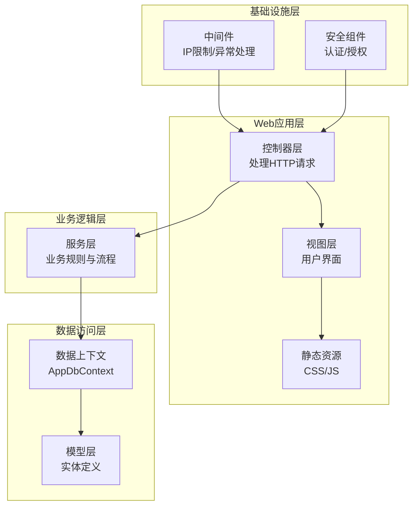
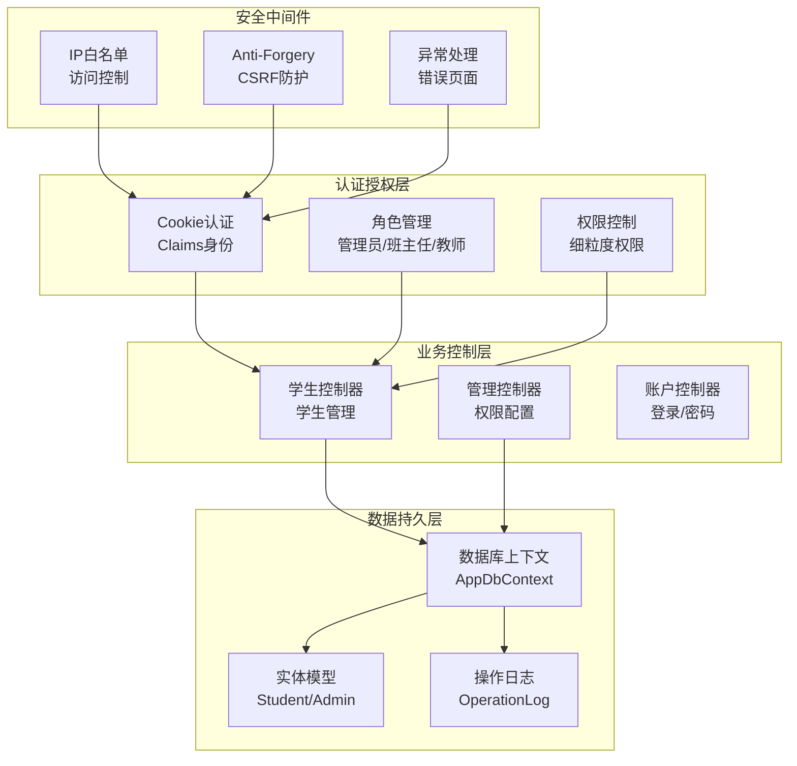
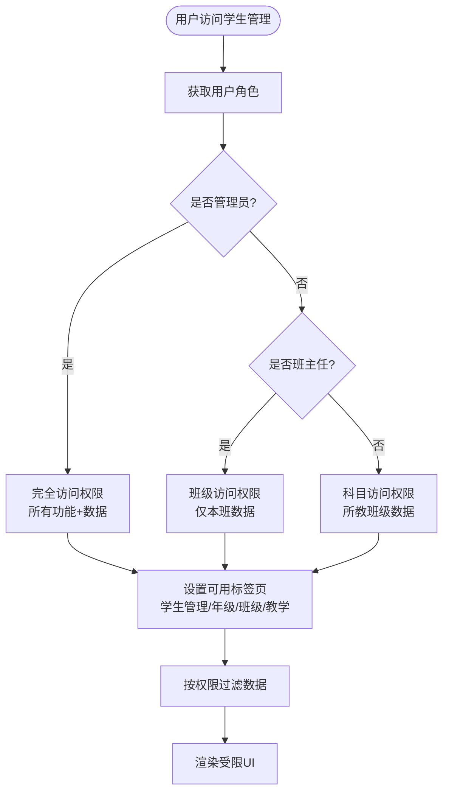
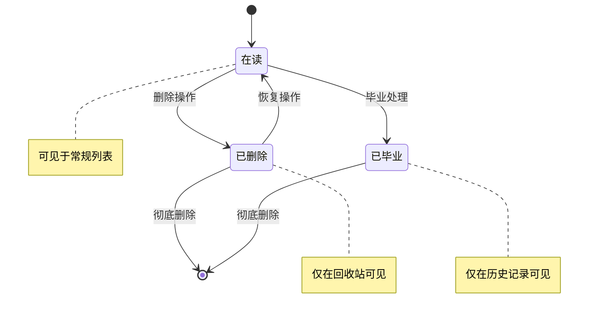
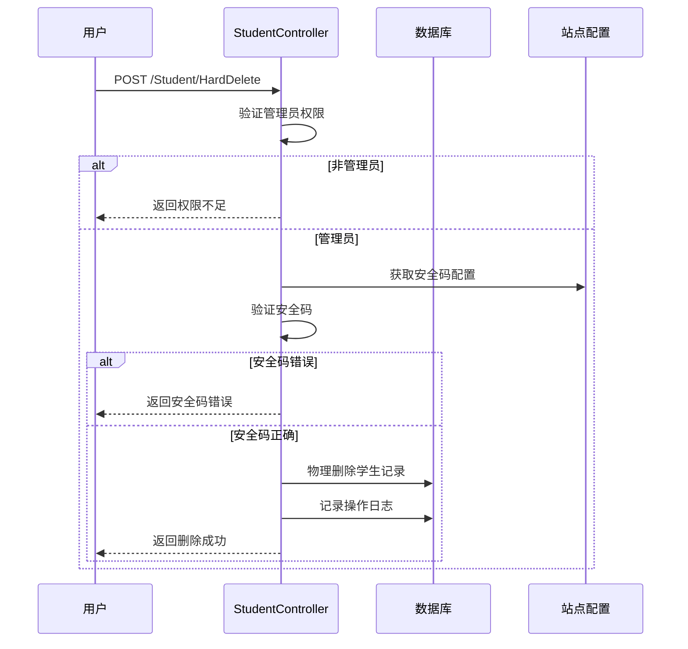
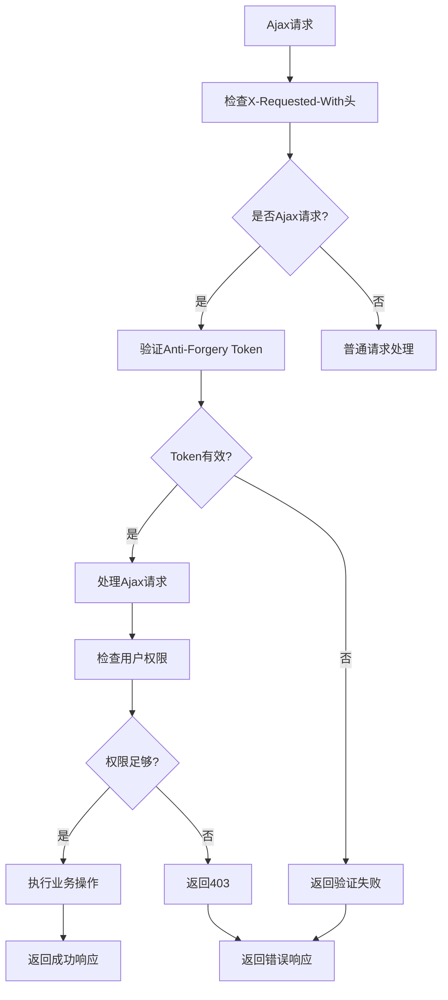
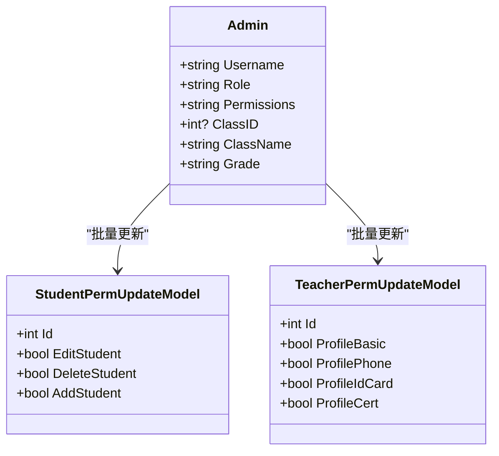
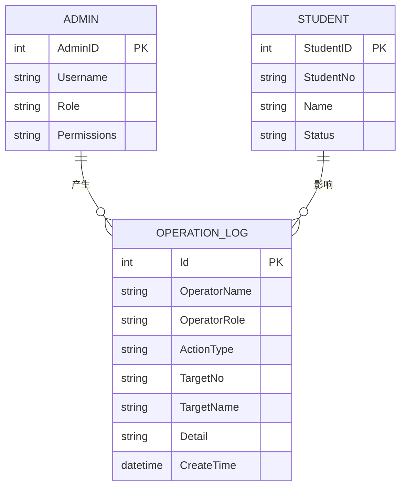
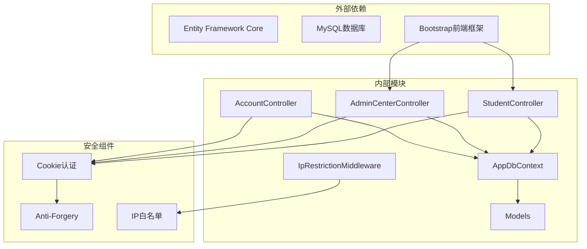

# 权限控制与安全机制

<cite>
**本文档引用的文件**
- [StudentController.cs](file://Controllers/StudentController.cs)
- [AdminCenterController.cs](file://Controllers/AdminCenterController.cs)
- [AppDbContext.cs](file://Data/AppDbContext.cs)
- [Models.cs](file://Models/Models.cs)
- [IpRestrictionMiddleware.cs](file://Middleware/IpRestrictionMiddleware.cs)
- [Program.cs](file://Program.cs)
- [OperationLogs.cshtml](file://Views/AdminCenter/OperationLogs.cshtml)
- [StudentPermissions.cshtml](file://Views/AdminCenter/StudentPermissions.cshtml)
- [Index.cshtml](file://Views/Student/Index.cshtml)
- [Login.cshtml](file://Views/Account/Login.cshtml)
- [site.js](file://wwwroot/js/site.js)
</cite>

## 目录
1. [引言](#引言)
2. [项目结构](#项目结构)
3. [核心组件](#核心组件)
4. [架构概览](#架构概览)
5. [详细组件分析](#详细组件分析)
6. [依赖关系分析](#依赖关系分析)
7. [性能考虑](#性能考虑)
8. [故障排除指南](#故障排除指南)
9. [结论](#结论)
10. [附录](#附录)

## 引言

本文件详细阐述学生管理系统中的权限控制与安全机制，涵盖不同角色用户（管理员、班主任、科任教师）在学生管理中的权限差异与操作限制，软删除机制的实现原理与数据状态管理，彻底删除的安全验证机制，Ajax请求的权限验证与跨域处理，以及权限配置的最佳实践、安全策略建议和常见安全问题的解决方案。同时，文档记录了操作日志的记录机制与审计追踪功能。

## 项目结构

系统采用经典的三层架构设计，主要由控制器层、数据访问层和模型层组成，并辅以中间件进行全局安全控制：

- 控制器层：负责处理HTTP请求、执行业务逻辑、调用服务层和数据访问层
- 数据访问层：基于Entity Framework Core，提供数据库连接与ORM映射
- 模型层：定义实体类与数据传输对象
- 中间件层：提供IP白名单、异常处理等横切关注点

**图表来源**
- [Program.cs:1-123](file://Program.cs#L1-L123)
- [AppDbContext.cs:1-312](file://Data/AppDbContext.cs#L1-L312)

**章节来源**
- [Program.cs:1-123](file://Program.cs#L1-L123)
- [AppDbContext.cs:1-312](file://Data/AppDbContext.cs#L1-L312)

## 核心组件

### 角色权限体系

系统定义了三种核心角色，每种角色在学生管理中具有不同的权限范围：

| 角色 | 权限范围 | 主要职责 |
|------|----------|----------|
| 管理员 | 全部权限 | 系统管理、权限配置、日志审计 |
| 班主任 | 班级管理 | 本班学生信息维护、成绩管理 |
| 科任教师 | 科目教学 | 所教科目学生成绩录入与查看 |

### 权限配置机制

权限通过逗号分隔的字符串存储在Admin实体的Permissions字段中，支持细粒度的权限控制：

- 学生管理权限：student_edit、student_delete、student_add
- 个人中心权限：profile_basic、profile_phone、profile_idcard、profile_cert
- 系统管理权限：site_config、user_management等

### 安全验证机制

系统实现了多层次的安全验证机制：

1. **身份认证**：基于Cookie的身份认证，支持会话管理和自动续期
2. **权限授权**：基于角色和自定义权限的细粒度授权
3. **CSRF防护**：启用Anti-Forgery Token，支持Header传递
4. **IP白名单**：可配置的访问控制，支持反向代理场景
5. **操作审计**：完整的操作日志记录与追踪

**章节来源**
- [Models.cs:6-86](file://Models/Models.cs#L6-L86)
- [AdminCenterController.cs:244-289](file://Controllers/AdminCenterController.cs#L244-L289)
- [StudentController.cs:26-54](file://Controllers/StudentController.cs#L26-L54)

## 架构概览

系统采用模块化设计，各功能模块相对独立又相互协作：

**图表来源**
- [Program.cs:23-41](file://Program.cs#L23-L41)
- [StudentController.cs:12-20](file://Controllers/StudentController.cs#L12-L20)
- [AdminCenterController.cs:12-20](file://Controllers/AdminCenterController.cs#L12-L20)

## 详细组件分析

### 学生管理权限控制

#### 角色权限差异

系统根据用户角色动态调整可访问的功能和数据范围：

**图表来源**
- [StudentController.cs:22-53](file://Controllers/StudentController.cs#L22-L53)

#### 数据访问权限控制

系统通过多种方式确保数据访问的正确性：

1. **状态过滤**：默认排除"已删除"和"已毕业"状态的学生
2. **班级限制**：班主任只能查看自己班级的学生
3. **年级限制**：年级管理者只能查看对应年级的学生
4. **字段遮蔽**：敏感字段在非管理员视图中进行遮蔽处理

**章节来源**
- [StudentController.cs:112-264](file://Controllers/StudentController.cs#L112-L264)

### 软删除机制

#### 实现原理

系统采用软删除策略，通过状态字段而非物理删除来保护数据完整性：

**图表来源**
- [StudentController.cs:487-540](file://Controllers/StudentController.cs#L487-L540)

#### 数据状态管理

软删除机制的关键实现：

1. **状态字段**：使用Status字段标识学生状态
2. **查询过滤**：默认查询排除已删除和已毕业状态
3. **回收站功能**：提供专门的回收站页面查看已删除数据
4. **恢复机制**：支持从回收站恢复数据

**章节来源**
- [StudentController.cs:487-517](file://Controllers/StudentController.cs#L487-L517)
- [Models.cs:88-165](file://Models/Models.cs#L88-L165)

### 彻底删除安全验证

#### 安全码验证机制

彻底删除操作需要双重安全验证：

**图表来源**
- [StudentController.cs:521-540](file://Controllers/StudentController.cs#L521-L540)

#### 安全策略

彻底删除的安全措施：

1. **管理员权限检查**：仅管理员可执行彻底删除
2. **安全码验证**：需要输入正确的安全码
3. **二次确认**：前端提供确认对话框
4. **操作日志**：记录彻底删除的详细信息

**章节来源**
- [StudentController.cs:521-540](file://Controllers/StudentController.cs#L521-L540)
- [AdminCenterController.cs:443-460](file://Controllers/AdminCenterController.cs#L443-L460)

### Ajax请求权限验证

#### 请求处理机制

系统通过多种方式确保Ajax请求的安全性：

**图表来源**
- [StudentController.cs:482-485](file://Controllers/StudentController.cs#L482-L485)
- [Program.cs:15-16](file://Program.cs#L15-L16)

#### 跨域请求处理

系统通过以下机制处理跨域请求：

1. **同源策略**：默认情况下，Ajax请求来自同一源
2. **Token传递**：通过RequestVerificationToken Header传递Anti-Forgery Token
3. **会话共享**：基于Cookie的会话机制确保跨页面请求的一致性

**章节来源**
- [StudentController.cs:482-485](file://Controllers/StudentController.cs#L482-L485)
- [Program.cs:15-16](file://Program.cs#L15-L16)

### 权限配置最佳实践

#### 权限分配策略

**图表来源**
- [Models.cs:6-86](file://Models/Models.cs#L6-L86)
- [AdminCenterController.cs:475-490](file://Controllers/AdminCenterController.cs#L475-L490)

#### 权限配置建议

1. **最小权限原则**：为每个角色分配完成工作所需的最小权限集
2. **定期审查**：定期审查和清理不必要的权限
3. **权限继承**：利用角色继承减少重复配置
4. **审计跟踪**：启用操作日志监控权限变更

**章节来源**
- [AdminCenterController.cs:244-289](file://Controllers/AdminCenterController.cs#L244-L289)
- [StudentPermissions.cshtml:1-118](file://Views/AdminCenter/StudentPermissions.cshtml#L1-L118)

### 操作日志与审计追踪

#### 日志记录机制

系统实现了全面的操作日志记录：

**图表来源**
- [Models.cs:237-260](file://Models/Models.cs#L237-L260)
- [AppDbContext.cs:138-150](file://Data/AppDbContext.cs#L138-L150)

#### 审计功能特性

1. **完整记录**：记录操作人、角色、操作类型、目标对象
2. **时间戳**：精确到秒的时间记录
3. **搜索过滤**：支持按操作类型和关键词搜索
4. **导出功能**：支持Excel格式导出
5. **统计分析**：提供当日操作统计

**章节来源**
- [OperationLogs.cshtml:1-194](file://Views/AdminCenter/OperationLogs.cshtml#L1-L194)
- [AdminCenterController.cs:340-439](file://Controllers/AdminCenterController.cs#L340-L439)

## 依赖关系分析

系统的核心依赖关系如下：

**图表来源**
- [Program.cs:1-43](file://Program.cs#L1-L43)
- [AppDbContext.cs:1-312](file://Data/AppDbContext.cs#L1-L312)

**章节来源**
- [Program.cs:1-43](file://Program.cs#L1-L43)
- [AppDbContext.cs:1-312](file://Data/AppDbContext.cs#L1-L312)

## 性能考虑

### 查询优化

1. **索引策略**：为常用查询字段建立适当的数据库索引
2. **分页处理**：默认每页20条记录，避免大数据量查询
3. **延迟加载**：合理使用延迟加载减少不必要的数据传输
4. **缓存机制**：对静态配置数据进行缓存

### 安全性能平衡

1. **会话超时**：15分钟滑动过期，平衡安全性与用户体验
2. **Token验证**：Anti-Forgery Token验证开销较小
3. **IP白名单**：仅在生产环境启用，避免开发调试影响
4. **日志异步**：操作日志采用异步记录，减少主流程阻塞

## 故障排除指南

### 常见权限问题

| 问题现象 | 可能原因 | 解决方案 |
|----------|----------|----------|
| 无法访问某些功能 | 权限不足 | 检查Permissions字段配置 |
| 看不到学生数据 | 班级/年级限制 | 验证用户绑定的班级信息 |
| CSRF验证失败 | Token缺失 | 确保请求包含RequestVerificationToken |
| Ajax请求被拒绝 | 跨域或权限问题 | 检查请求头和用户权限 |

### 安全配置问题

1. **IP访问被拒绝**
   - 检查IpRestriction:AllowedIPs配置
   - 验证反向代理场景下的X-Forwarded-For头
   - 确认本地回环地址的特殊处理

2. **会话超时频繁**
   - 检查ExpireTimeSpan配置
   - 验证SlidingExpiration设置
   - 确认用户活跃度

3. **操作日志缺失**
   - 检查数据库连接字符串
   - 验证OperationLogs表结构
   - 确认日志记录代码执行

**章节来源**
- [IpRestrictionMiddleware.cs:1-98](file://Middleware/IpRestrictionMiddleware.cs#L1-L98)
- [Program.cs:23-41](file://Program.cs#L23-L41)

## 结论

本学生管理系统的权限控制与安全机制体现了多层次、细粒度的安全设计理念。通过角色权限分离、软删除保护、双重安全验证、完善的审计追踪等措施，系统在保证功能灵活性的同时，有效提升了安全性。

建议在实际部署中重点关注：
1. 定期审查和优化权限配置
2. 建立完善的安全监控机制
3. 定期备份重要数据
4. 持续更新安全补丁

## 附录

### 安全配置清单

- [ ] 启用IP白名单（生产环境）
- [ ] 配置安全码（彻底删除）
- [ ] 定期轮换管理员密码
- [ ] 启用HTTPS加密传输
- [ ] 配置适当的会话超时时间
- [ ] 建立操作日志审计制度

### 最佳实践总结

1. **最小权限原则**：为每个角色分配必要的最小权限
2. **多重验证**：结合身份认证、权限授权、CSRF防护
3. **数据保护**：采用软删除保护重要数据
4. **审计追踪**：建立完整的操作日志体系
5. **定期审查**：定期审查权限配置和安全策略