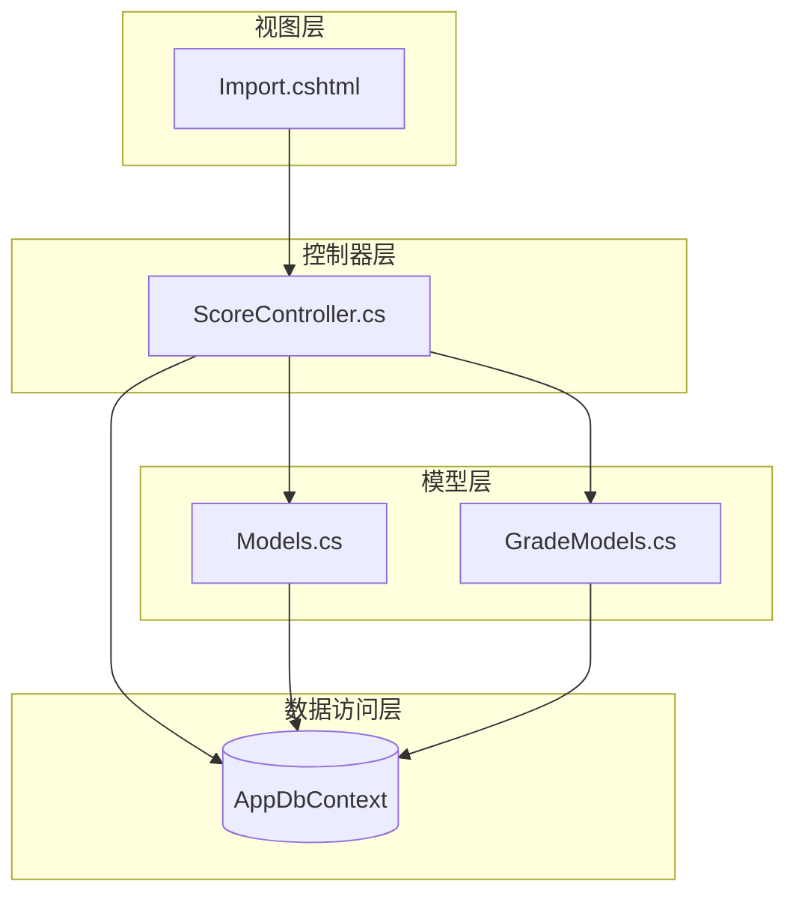
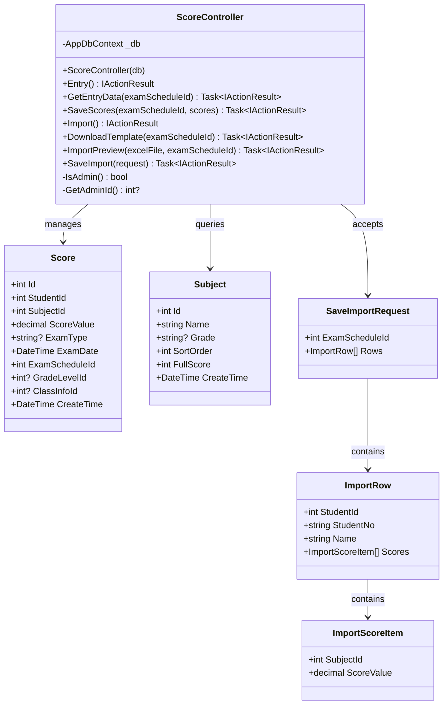
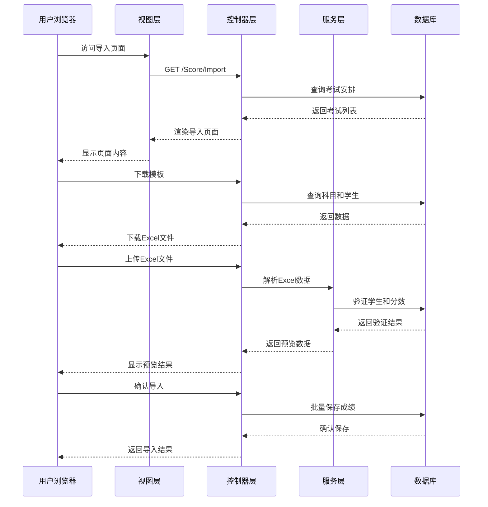
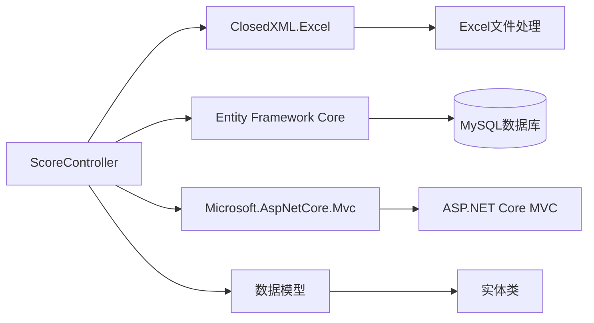
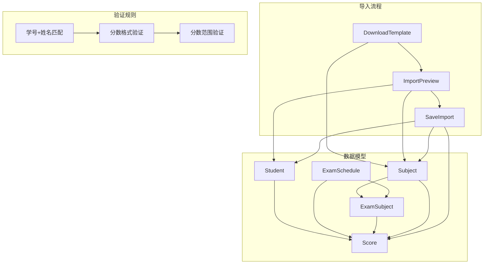

# 成绩导入API

<cite>
**本文档引用的文件**
- [ScoreController.cs](file://Controllers/ScoreController.cs)
- [Import.cshtml](file://Views/Score/Import.cshtml)
- [Models.cs](file://Models/Models.cs)
- [GradeModels.cs](file://Models/GradeModels.cs)
</cite>

## 目录
1. [简介](#简介)
2. [项目结构](#项目结构)
3. [核心组件](#核心组件)
4. [架构概览](#架构概览)
5. [详细组件分析](#详细组件分析)
6. [依赖关系分析](#依赖关系分析)
7. [性能考虑](#性能考虑)
8. [故障排除指南](#故障排除指南)
9. [结论](#结论)

## 简介

本文件详细记录了学生成绩批量导入系统的API接口规范，包括导入页面获取、模板下载、导入预览和导入保存等核心功能。该系统基于ASP.NET Core框架构建，使用ClosedXML库处理Excel文件操作，并采用Entity Framework Core进行数据持久化。

## 项目结构

成绩导入功能主要分布在以下模块中：



**图表来源**
- [ScoreController.cs:1-620](file://Controllers/ScoreController.cs#L1-L620)
- [Import.cshtml:1-253](file://Views/Score/Import.cshtml#L1-L253)

**章节来源**
- [ScoreController.cs:1-620](file://Controllers/ScoreController.cs#L1-L620)
- [Import.cshtml:1-253](file://Views/Score/Import.cshtml#L1-L253)

## 核心组件

### 控制器类结构



**图表来源**
- [ScoreController.cs:12-591](file://Controllers/ScoreController.cs#L12-L591)
- [Models.cs:315-358](file://Models/Models.cs#L315-L358)
- [Models.cs:300-312](file://Models/Models.cs#L300-L312)
- [ScoreController.cs:601-619](file://Controllers/ScoreController.cs#L601-L619)

### 数据模型关系

```mermaid
erDiagram
EXAM_SCHEDULE {
int Id PK
string Name
string ExamType
datetime ExamDate
datetime EndDate
string Status
string Grades
}
SUBJECT {
int Id PK
string Name
string Grade
int SortOrder
int FullScore
datetime CreateTime
}
STUDENT {
int StudentID PK
string StudentNo
string Name
string Grade
string ClassName
string Status
}
SCORE {
int Id PK
int StudentId FK
int SubjectId FK
decimal ScoreValue
string ExamType
datetime ExamDate
int ExamScheduleId FK
int? GradeLevelId
int? ClassInfoId
datetime CreateTime
}
EXAM_SUBJECT {
int Id PK
int ExamScheduleId FK
int SubjectId FK
}
EXAM_SCHEDULE ||--o{ EXAM_SUBJECT : contains
EXAM_SUBJECT ||--|| SUBJECT : links
STUDENT ||--o{ SCORE : has
SUBJECT ||--o{ SCORE : has
EXAM_SCHEDULE ||--o{ SCORE : records
```

**图表来源**
- [Models.cs:315-358](file://Models/Models.cs#L315-L358)
- [Models.cs:398-412](file://Models/Models.cs#L398-L412)
- [Models.cs:300-312](file://Models/Models.cs#L300-L312)

**章节来源**
- [ScoreController.cs:12-591](file://Controllers/ScoreController.cs#L12-L591)
- [Models.cs:315-358](file://Models/Models.cs#L315-L358)
- [Models.cs:398-412](file://Models/Models.cs#L398-L412)

## 架构概览

成绩导入系统采用经典的三层架构设计，包含Web界面层、业务逻辑层和数据访问层：



**图表来源**
- [ScoreController.cs:352-591](file://Controllers/ScoreController.cs#L352-L591)
- [Import.cshtml:86-252](file://Views/Score/Import.cshtml#L86-L252)

## 详细组件分析

### 导入页面获取接口

#### 接口定义
- **HTTP方法**: GET
- **URL模式**: `/Score/Import`
- **功能**: 获取成绩导入页面，显示所有可用的考试安排

#### 请求参数
- 无查询参数

#### 响应格式
- **状态码**: 200 OK
- **内容类型**: text/html
- **响应体**: HTML页面，包含导入界面和JavaScript逻辑

#### 实现细节
控制器通过查询数据库获取所有考试安排，按考试日期降序排列，传递给视图层渲染。

**章节来源**
- [ScoreController.cs:352-360](file://Controllers/ScoreController.cs#L352-L360)

### 模板下载接口

#### 接口定义
- **HTTP方法**: GET
- **URL模式**: `/Score/DownloadTemplate`
- **功能**: 下载成绩导入模板文件

#### 请求参数
- `examScheduleId`: 考试安排ID (必需)

#### 响应格式
- **状态码**: 200 OK 或 404 Not Found
- **内容类型**: application/vnd.openxmlformats-officedocument.spreadsheetml.sheet
- **响应体**: Excel文件流

#### 模板结构
模板包含以下列：
1. 序号 (自动填充)
2. 学号 (自动填充)
3. 姓名 (自动填充)
4. 年级 (自动填充)
5. 班级 (自动填充)
6. 各科目分数 (动态生成，基于考试安排关联的科目)

#### 满分标注规则
- 每个科目列顶部添加注释："满分 {科目满分}"
- 使用科目表中的FullScore字段作为满分标准

**章节来源**
- [ScoreController.cs:363-419](file://Controllers/ScoreController.cs#L363-L419)

### 导入预览接口

#### 接口定义
- **HTTP方法**: POST
- **URL模式**: `/Score/ImportPreview`
- **功能**: 预览Excel文件中的成绩数据，执行数据验证

#### 请求参数
- **Content-Type**: multipart/form-data
- **参数**:
  - `excelFile`: Excel文件 (必需)
  - `examScheduleId`: 考试安排ID (必需)

#### 响应格式
- **状态码**: 200 OK
- **内容类型**: application/json
- **响应体**: JSON对象，包含预览结果和统计信息

#### 预览响应结构
```json
{
  "success": true,
  "examScheduleId": 1,
  "rows": [
    {
      "studentNo": "2023001",
      "name": "张三",
      "studentId": 101,
      "grade": "高一",
      "className": "1班",
      "error": "",
      "scores": [
        {
          "subjectName": "语文",
          "score": 85,
          "error": ""
        }
      ]
    }
  ],
  "successCount": 45,
  "errorCount": 2,
  "totalCount": 47
}
```

#### 数据验证规则

##### 学生匹配验证
- 必须同时匹配学号和姓名
- 支持前后空格去除
- 未找到匹配学生的行标记为错误

##### 分数格式验证
- 支持整数和小数格式
- 使用decimal.TryParse进行解析
- 空白单元格视为无分数

##### 分数范围验证
- 必须在0到科目满分之间
- 超出范围的分数标记为错误
- 错误信息格式："超出满分({科目满分})"

##### 统计信息
- `successCount`: 验证通过的行数
- `errorCount`: 包含错误的行数
- `totalCount`: 总行数

**章节来源**
- [ScoreController.cs:422-521](file://Controllers/ScoreController.cs#L422-L521)

### 导入保存接口

#### 接口定义
- **HTTP方法**: POST
- **URL模式**: `/Score/SaveImport`
- **功能**: 批量保存导入的成绩数据

#### 请求参数
- **Content-Type**: application/json
- **请求体**: SaveImportRequest对象

#### SaveImportRequest结构
```json
{
  "examScheduleId": 1,
  "rows": [
    {
      "studentId": 101,
      "studentNo": "2023001",
      "name": "张三",
      "scores": [
        {
          "subjectId": 5,
          "scoreValue": 85
        }
      ]
    }
  ]
}
```

#### 响应格式
- **状态码**: 200 OK
- **内容类型**: application/json
- **响应体**: JSON对象，包含操作结果

#### 数据处理逻辑

##### 批量数据加载
- 批量查询所有相关学生信息
- 批量查询现有成绩记录
- 使用字典优化查找性能

##### 成绩更新策略
- 如果记录已存在：更新现有分数
- 如果记录不存在：创建新的成绩记录
- 自动填充班级和年级快照信息

##### 事务管理
- 使用Entity Framework Core的异步保存
- 单次调用完成所有数据持久化
- 支持回滚机制

**章节来源**
- [ScoreController.cs:525-590](file://Controllers/ScoreController.cs#L525-L590)
- [ScoreController.cs:601-619](file://Controllers/ScoreController.cs#L601-L619)

## 依赖关系分析

### 外部依赖



**图表来源**
- [ScoreController.cs:1-8](file://Controllers/ScoreController.cs#L1-L8)

### 内部依赖关系



**图表来源**
- [ScoreController.cs:363-590](file://Controllers/ScoreController.cs#L363-L590)
- [Models.cs:315-358](file://Models/Models.cs#L315-L358)

**章节来源**
- [ScoreController.cs:1-8](file://Controllers/ScoreController.cs#L1-L8)
- [Models.cs:315-358](file://Models/Models.cs#L315-L358)

## 性能考虑

### 数据库优化
- 使用批量查询减少数据库往返次数
- 通过字典索引优化查找性能
- 使用异步数据库操作避免阻塞

### 内存管理
- 流式处理Excel文件避免内存溢出
- 及时释放Excel工作簿资源
- 使用MemoryStream进行临时数据存储

### 缓存策略
- 批量加载学生和科目信息
- 复用数据库连接和上下文
- 避免重复的数据库查询

## 故障排除指南

### 常见错误及解决方案

#### Excel文件格式错误
- **症状**: 解析失败或提示文件格式不支持
- **原因**: 文件不是有效的Excel格式
- **解决方案**: 确保使用.xlsx或.xls格式文件

#### 考试安排不存在
- **症状**: 返回"考试安排不存在"错误
- **原因**: examScheduleId参数无效
- **解决方案**: 确保选择有效的考试安排

#### 学生信息不匹配
- **症状**: 预览结果显示"未找到该学生"
- **原因**: 学号和姓名不匹配或数据库中不存在
- **解决方案**: 检查模板中的学号和姓名是否正确

#### 分数格式错误
- **症状**: 预览结果显示"格式错误"
- **原因**: 分数不是有效数字格式
- **解决方案**: 确保分数为数字格式，支持整数和小数

#### 分数超出范围
- **症状**: 预览结果显示"超出满分({科目满分})"
- **原因**: 分数超过科目设定的满分
- **解决方案**: 检查分数是否在0到满分范围内

### 调试建议
1. 检查浏览器控制台是否有JavaScript错误
2. 确认AntiForgery Token是否正确传递
3. 验证Excel文件的编码和格式
4. 检查服务器端日志获取详细错误信息

**章节来源**
- [ScoreController.cs:424-429](file://Controllers/ScoreController.cs#L424-L429)
- [ScoreController.cs:460-465](file://Controllers/ScoreController.cs#L460-L465)
- [ScoreController.cs:480-494](file://Controllers/ScoreController.cs#L480-L494)

## 结论

成绩批量导入系统提供了完整的Excel文件导入解决方案，具有以下特点：

### 技术优势
- **完整的数据验证**: 包含学号姓名匹配、分数格式和范围验证
- **用户友好的界面**: 提供实时预览和错误提示
- **高性能处理**: 使用批量查询和异步操作优化性能
- **灵活的模板**: 动态生成科目列，支持不同考试安排

### 功能完整性
- **导入流程完整**: 从模板下载到数据导入的完整工作流
- **错误处理完善**: 详细的错误检测和用户反馈机制
- **数据一致性**: 通过事务管理和快照机制确保数据一致性

### 扩展性考虑
- **模块化设计**: 清晰的职责分离便于维护和扩展
- **标准化接口**: RESTful API设计便于集成其他系统
- **配置灵活**: 支持不同的考试安排和科目设置

该系统为教育管理系统提供了高效、可靠的批量成绩导入能力，能够满足学校日常教学管理的需求。