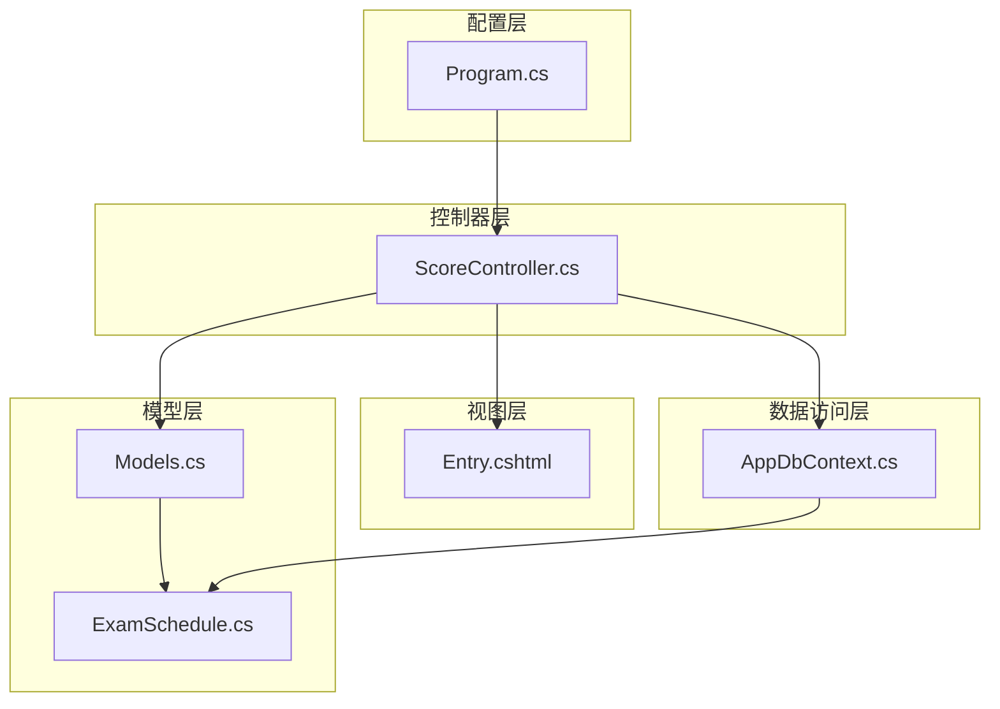
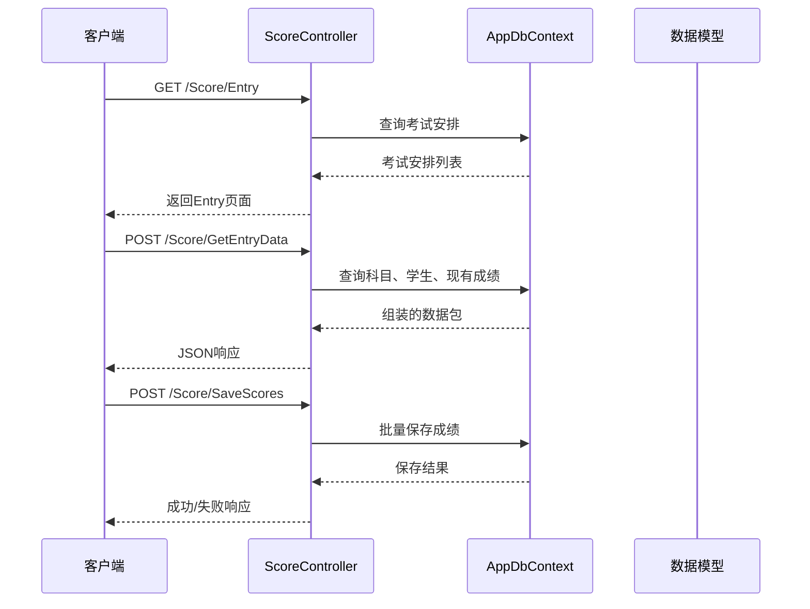
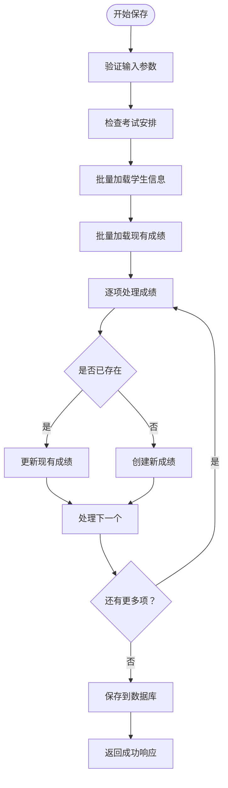
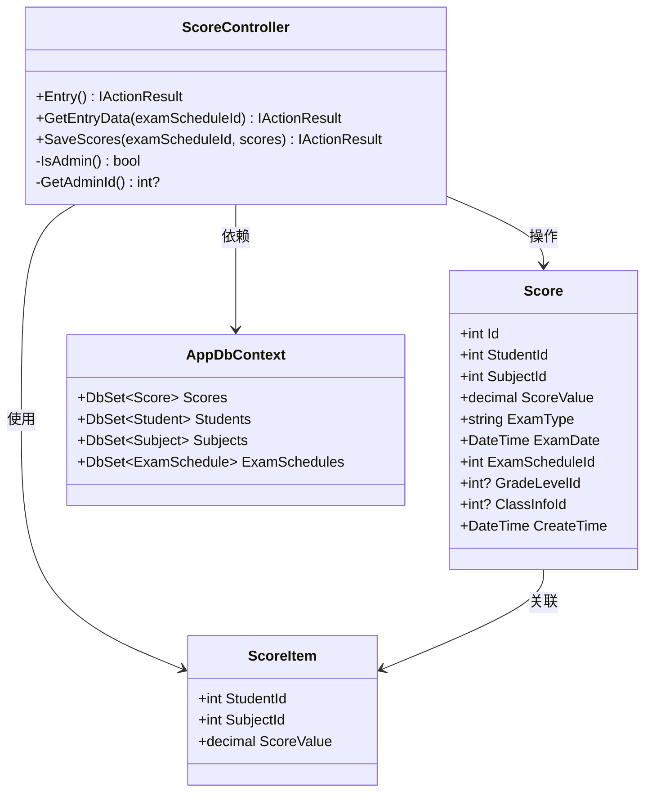

# 成绩录入API

<cite>
**本文档引用的文件**
- [ScoreController.cs](file://Controllers/ScoreController.cs)
- [Entry.cshtml](file://Views/Score/Entry.cshtml)
- [Models.cs](file://Models/Models.cs)
- [AppDbContext.cs](file://Data/AppDbContext.cs)
- [Program.cs](file://Program.cs)
- [ExamSchedule.cs](file://Models/ExamSchedule.cs)
</cite>

## 目录
1. [简介](#简介)
2. [项目结构](#项目结构)
3. [核心组件](#核心组件)
4. [架构概览](#架构概览)
5. [详细组件分析](#详细组件分析)
6. [依赖关系分析](#依赖关系分析)
7. [性能考虑](#性能考虑)
8. [故障排除指南](#故障排除指南)
9. [结论](#结论)

## 简介

本文件详细记录了学生成绩管理系统中的成绩录入相关API接口文档。系统提供了完整的成绩录入、数据加载和批量保存功能，支持Web界面和API调用两种方式。

## 项目结构

成绩录入功能主要分布在以下模块中：



**图表来源**
- [ScoreController.cs:1-620](file://Controllers/ScoreController.cs#L1-L620)
- [Entry.cshtml:1-226](file://Views/Score/Entry.cshtml#L1-L226)
- [Models.cs:1-490](file://Models/Models.cs#L1-L490)

**章节来源**
- [ScoreController.cs:1-620](file://Controllers/ScoreController.cs#L1-L620)
- [Entry.cshtml:1-226](file://Views/Score/Entry.cshtml#L1-L226)

## 核心组件

### 成绩录入控制器

ScoreController类提供了完整的成绩录入API接口，包含以下核心功能：

- **成绩录入页面获取**：`GET /Score/Entry`
- **数据加载接口**：`POST /Score/GetEntryData`
- **成绩保存接口**：`POST /Score/SaveScores`

### 数据模型

系统使用以下核心数据模型：

- **ScoreItem**：单个成绩项的数据传输对象
- **Score**：成绩实体模型
- **ExamSchedule**：考试安排模型

**章节来源**
- [ScoreController.cs:594-620](file://Controllers/ScoreController.cs#L594-L620)
- [Models.cs:314-358](file://Models/Models.cs#L314-L358)
- [ExamSchedule.cs:1-46](file://Models/ExamSchedule.cs#L1-L46)

## 架构概览



**图表来源**
- [ScoreController.cs:32-157](file://Controllers/ScoreController.cs#L32-L157)
- [Entry.cshtml:69-219](file://Views/Score/Entry.cshtml#L69-L219)

## 详细组件分析

### 成绩录入页面接口

#### 接口定义

| 属性 | 值 |
|------|-----|
| HTTP方法 | GET |
| URL模式 | `/Score/Entry` |
| 认证要求 | 需要登录 |
| 角色要求 | 任意认证用户 |

#### 功能描述

该接口负责加载成绩录入页面，查询并返回所有可用的考试安排供用户选择。

#### 请求参数

无请求参数

#### 响应格式

返回HTML页面，包含以下动态内容：
- 考试安排列表（按考试日期降序排列）
- 页面标题："成绩录入"

**章节来源**
- [ScoreController.cs:32-41](file://Controllers/ScoreController.cs#L32-L41)

### 数据加载接口

#### 接口定义

| 属性 | 值 |
|------|-----|
| HTTP方法 | POST |
| URL模式 | `/Score/GetEntryData` |
| 认证要求 | 需要登录 |
| 内容类型 | application/x-www-form-urlencoded |

#### 请求参数

| 参数名 | 类型 | 必需 | 描述 |
|--------|------|------|------|
| examScheduleId | int | 是 | 考试安排ID |

#### 响应格式

成功响应（success=true）：
```json
{
    "success": true,
    "subjects": [
        {
            "subjectId": 1,
            "subjectName": "数学",
            "fullScore": 100
        }
    ],
    "students": [
        {
            "studentID": 1001,
            "studentNo": "2024001",
            "name": "张三",
            "grade": "一年级",
            "className": "1班"
        }
    ],
    "existingScores": [
        {
            "studentId": 1001,
            "subjectId": 1,
            "scoreValue": 85.5
        }
    ],
    "subjectIds": [1, 2, 3]
}
```

失败响应（success=false）：
```json
{
    "success": false,
    "message": "考试安排不存在"
}
```

#### 处理逻辑

1. **考试安排验证**：检查指定的考试安排是否存在
2. **科目获取**：查询该考试安排关联的所有科目
3. **学生筛选**：根据考试覆盖的年级筛选在读学生
4. **现有成绩**：获取该考试安排下的所有已存在成绩
5. **数据组装**：返回完整的数据包给前端

**章节来源**
- [ScoreController.cs:43-88](file://Controllers/ScoreController.cs#L43-L88)

### 成绩保存接口

#### 接口定义

| 属性 | 值 |
|------|-----|
| HTTP方法 | POST |
| URL模式 | `/Score/SaveScores` |
| 认证要求 | 需要登录和CSRF令牌 |
| 内容类型 | application/json |

#### 请求参数

请求体参数（JSON格式）：
```json
[
    {
        "studentId": 1001,
        "subjectId": 1,
        "scoreValue": 85.5
    }
]
```

URL参数：
| 参数名 | 类型 | 必需 | 描述 |
|--------|------|------|------|
| examScheduleId | int | 是 | 考试安排ID |

#### 响应格式

成功响应：
```json
{
    "success": true,
    "message": "成功保存 45 条成绩"
}
```

失败响应：
```json
{
    "success": false,
    "message": "未提交任何成绩"
}
```

#### 处理逻辑



**图表来源**
- [ScoreController.cs:90-157](file://Controllers/ScoreController.cs#L90-L157)

#### 数据验证规则

1. **分数范围验证**：分数必须在0到科目满分之间
2. **重复键约束**：同一学生在同一次考试中同一科目的成绩唯一
3. **外键完整性**：确保学生ID和科目ID有效

**章节来源**
- [ScoreController.cs:90-157](file://Controllers/ScoreController.cs#L90-L157)

### 数据结构定义

#### ScoreItem模型

| 属性名 | 类型 | 描述 | 约束 |
|--------|------|------|------|
| StudentId | int | 学生ID | 必需 |
| SubjectId | int | 科目ID | 必需 |
| ScoreValue | decimal | 成绩值 | 0-科目满分 |

#### Score实体模型

| 属性名 | 类型 | 描述 | 约束 |
|--------|------|------|------|
| Id | int | 主键 | 自增 |
| StudentId | int | 学生ID | 必需 |
| SubjectId | int | 科目ID | 必需 |
| ScoreValue | decimal | 成绩值 | decimal(5,1) |
| ExamType | string | 考试类型 | 最大长度30 |
| ExamDate | datetime | 考试日期 | 必需 |
| ExamScheduleId | int | 考试安排ID | 必需 |
| GradeLevelId | int | 年级ID | 可空 |
| ClassInfoId | int | 班级ID | 可空 |
| CreateTime | datetime | 创建时间 | 默认当前时间 |

**章节来源**
- [Models.cs:594-620](file://Models/Models.cs#L594-L620)
- [Models.cs:314-358](file://Models/Models.cs#L314-L358)

## 依赖关系分析



**图表来源**
- [ScoreController.cs:11-157](file://Controllers/ScoreController.cs#L11-L157)
- [Models.cs:314-358](file://Models/Models.cs#L314-L358)

**章节来源**
- [AppDbContext.cs:205-225](file://Data/AppDbContext.cs#L205-L225)

## 性能考虑

### 数据库优化

1. **索引策略**：
   - 成绩表的唯一索引：`(StudentId, SubjectId, ExamScheduleId)`
   - 考试安排表的复合索引：`(ExamDate, Status)`

2. **查询优化**：
   - 使用投影查询减少数据传输
   - 批量加载学生和成绩信息
   - 条件查询过滤不需要的数据

### 前端性能

1. **缓存机制**：
   - 成绩变更缓存到客户端
   - 避免重复网络请求

2. **分页策略**：
   - 支持大量学生数据的分页显示

## 故障排除指南

### 常见错误及解决方案

| 错误类型 | 错误代码 | 描述 | 解决方案 |
|----------|----------|------|----------|
| 身份验证失败 | 401 | 用户未登录 | 确保用户已登录系统 |
| 权限不足 | 403 | 用户无权访问 | 检查用户角色和权限 |
| 考试安排不存在 | 404 | 考试ID无效 | 验证考试安排ID有效性 |
| CSRF验证失败 | 400 | 请求令牌无效 | 确保包含正确的CSRF令牌 |
| 数据库连接失败 | 500 | 数据库不可用 | 检查数据库连接配置 |

### 调试建议

1. **启用详细错误日志**：
   ```csharp
   // 在Program.cs中配置
   builder.Logging.AddConsole();
   ```

2. **检查数据库连接**：
   - 验证连接字符串正确性
   - 确认数据库服务正常运行

3. **前端调试**：
   - 使用浏览器开发者工具检查网络请求
   - 验证CSRF令牌传递

**章节来源**
- [Program.cs:49-81](file://Program.cs#L49-L81)

## 结论

本API接口设计完整地实现了成绩录入的核心功能，具有以下特点：

1. **安全性**：采用基于Cookie的身份认证和CSRF保护
2. **数据完整性**：严格的输入验证和数据库约束
3. **性能优化**：批量操作和缓存机制
4. **用户体验**：直观的Web界面和实时反馈

系统支持高效的批量成绩录入，适用于大规模教育机构的成绩管理需求。通过合理的架构设计和数据模型，确保了系统的可扩展性和维护性。