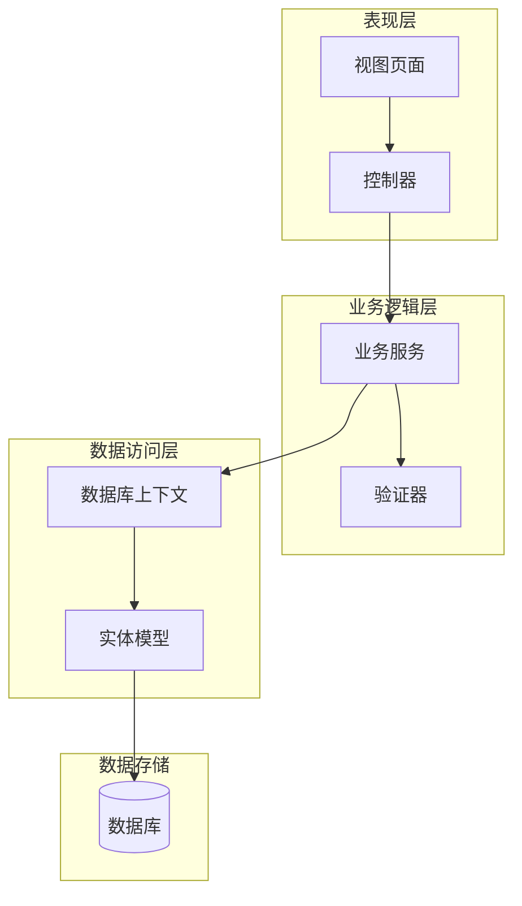
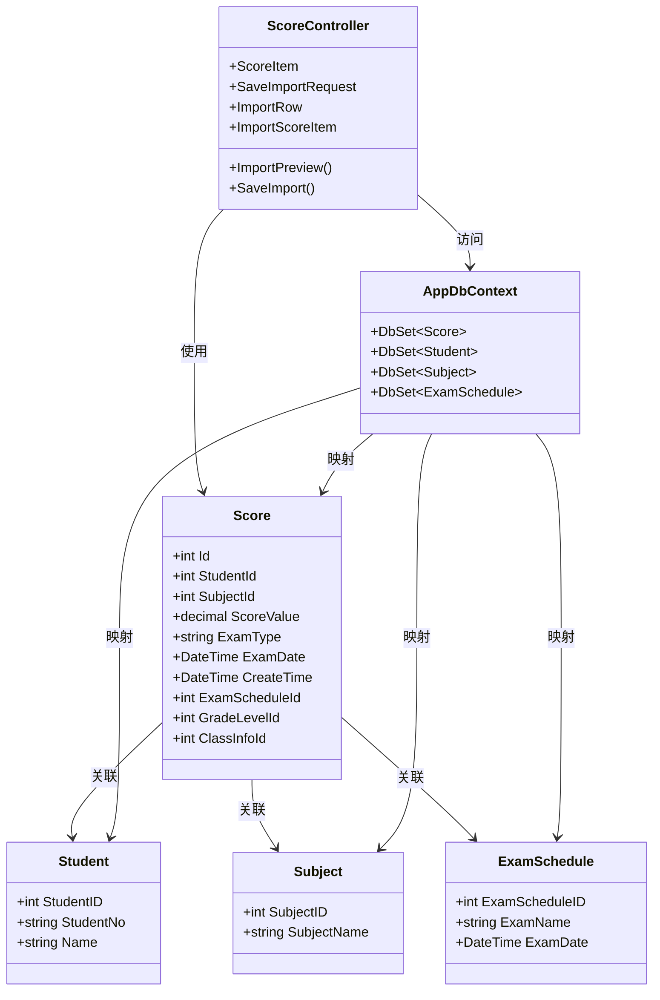
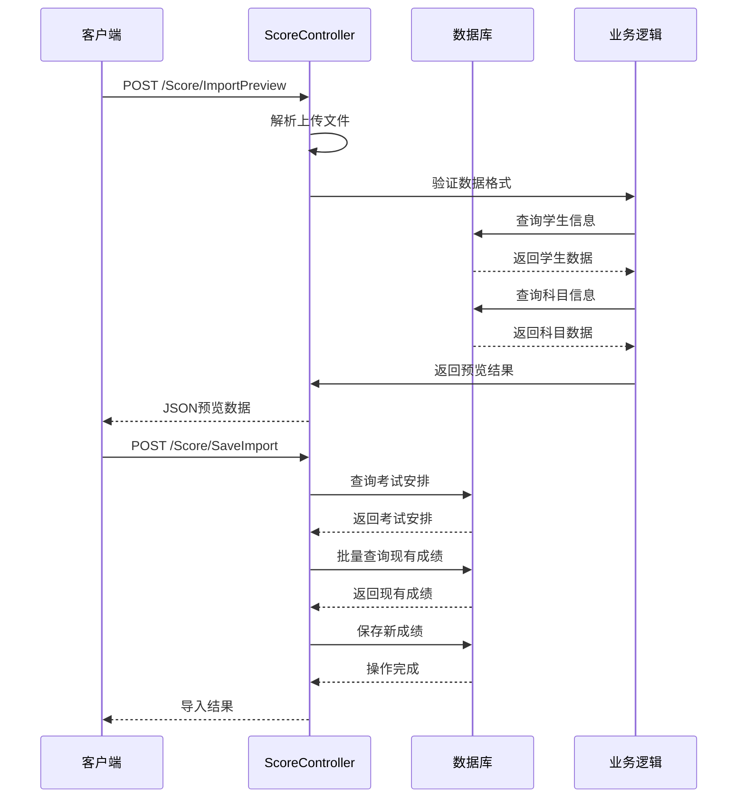
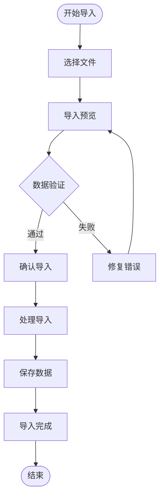
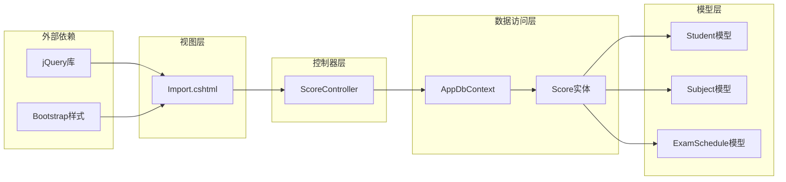

# 成绩数据模型

<cite>
**本文档引用的文件**
- [ScoreController.cs](file://Controllers/ScoreController.cs)
- [AppDbContext.cs](file://Data/AppDbContext.cs)
- [Models.cs](file://Models/Models.cs)
- [Import.cshtml](file://Views/Score/Import.cshtml)
</cite>

## 目录
1. [简介](#简介)
2. [项目结构](#项目结构)
3. [核心组件](#核心组件)
4. [架构概览](#架构概览)
5. [详细组件分析](#详细组件分析)
6. [依赖关系分析](#依赖关系分析)
7. [性能考虑](#性能考虑)
8. [故障排除指南](#故障排除指南)
9. [结论](#结论)

## 简介

本文档详细记录了学生成绩管理系统的数据模型设计，重点涵盖Score实体模型及其相关数据传输对象（DTO）的设计规范。该系统支持单个成绩录入和批量导入功能，包含完整的数据验证、业务约束和数据完整性保证。

## 项目结构

成绩管理系统采用分层架构设计，主要涉及以下关键组件：

**图表来源**
- [ScoreController.cs:11-619](file://Controllers/ScoreController.cs#L11-L619)
- [AppDbContext.cs:205-225](file://Data/AppDbContext.cs#L205-L225)

**章节来源**
- [ScoreController.cs:11-619](file://Controllers/ScoreController.cs#L11-L619)
- [AppDbContext.cs:205-225](file://Data/AppDbContext.cs#L205-L225)

## 核心组件

### Score 实体模型

Score是系统的核心实体，用于存储学生的考试成绩信息。该模型经过重构优化，提供了完整的数据持久化能力。

**字段定义与约束：**

| 字段名 | 数据类型 | 约束条件 | 描述 |
|--------|----------|----------|------|
| Id | int | 主键, 自增 | 成绩记录唯一标识符 |
| StudentId | int | 非空, 外键 | 学生外键标识 |
| SubjectId | int | 非空, 外键 | 科目外键标识 |
| ScoreValue | decimal(5,1) | 非空, 0-100范围 | 考试分数值，保留一位小数 |
| ExamType | string(30) | 可空 | 考试类型描述 |
| ExamDate | datetime | 可空 | 考试日期 |
| CreateTime | datetime | 非空 | 记录创建时间 |
| ExamScheduleId | int | 非空, 外键 | 考试安排外键标识 |
| GradeLevelId | int | 可空, 外键 | 年级级别外键标识 |
| ClassInfoId | int | 可空, 外键 | 班级信息外键标识 |

**唯一性约束：**
- 唯一索引：(StudentId, SubjectId, ExamScheduleId)
- 确保同一学生在同一次考试安排中每个科目的成绩唯一

**章节来源**
- [AppDbContext.cs:205-225](file://Data/AppDbContext.cs#L205-L225)
- [Models.cs:314-350](file://Models/Models.cs#L314-L350)

### ScoreItem 数据传输对象

ScoreItem用于前端成绩录入的数据传输，简化了数据交换过程。

**字段定义：**

| 字段名 | 数据类型 | 必填 | 描述 |
|--------|----------|------|------|
| StudentId | int | 是 | 学生标识符 |
| SubjectId | int | 是 | 科目标识符 |
| ScoreValue | decimal | 是 | 分数值 |

**章节来源**
- [ScoreController.cs:594-599](file://Controllers/ScoreController.cs#L594-L599)

### SaveImportRequest 数据传输对象

SaveImportRequest用于批量导入功能的请求封装，支持多行数据的统一处理。

**字段定义：**

| 字段名 | 数据类型 | 必填 | 描述 |
|--------|----------|------|------|
| ExamScheduleId | int | 是 | 考试安排标识符 |
| Rows | List<ImportRow> | 是 | 导入行数据列表 |

**章节来源**
- [ScoreController.cs:601-605](file://Controllers/ScoreController.cs#L601-L605)

### ImportRow 数据传输对象

ImportRow代表单个学生的导入数据行，包含学生基本信息和各科成绩。

**字段定义：**

| 字段名 | 数据类型 | 必填 | 描述 |
|--------|----------|------|------|
| StudentId | int | 是 | 学生标识符 |
| StudentNo | string | 是 | 学生学号 |
| Name | string | 是 | 学生姓名 |
| Scores | List<ImportScoreItem> | 是 | 科目成绩列表 |

**章节来源**
- [ScoreController.cs:607-613](file://Controllers/ScoreController.cs#L607-L613)

### ImportScoreItem 数据传输对象

ImportScoreItem用于表示单个科目的导入成绩信息。

**字段定义：**

| 字段名 | 数据类型 | 必填 | 描述 |
|--------|----------|------|------|
| SubjectId | int | 是 | 科目标识符 |
| ScoreValue | decimal | 是 | 分数值 |

**章节来源**
- [ScoreController.cs:615-619](file://Controllers/ScoreController.cs#L615-L619)

## 架构概览

系统采用经典的三层架构模式，实现了清晰的职责分离：

**图表来源**
- [ScoreController.cs:11-619](file://Controllers/ScoreController.cs#L11-L619)
- [AppDbContext.cs:205-225](file://Data/AppDbContext.cs#L205-L225)
- [Models.cs:314-350](file://Models/Models.cs#L314-L350)

## 详细组件分析

### 数据库映射配置

Score实体通过Entity Framework进行数据库映射，配置了完整的表结构和关系映射。

**表结构映射：**
- 表名：Score
- 主键：Id
- 字段映射：所有属性均映射到对应的列名

**关系映射：**
- 一对一关系：Score → Student
- 一对一关系：Score → Subject  
- 一对一关系：Score → ExamSchedule
- 一对一关系：Score → GradeLevel
- 一对一关系：Score → ClassInfo

**唯一索引配置：**
- 复合唯一索引：(StudentId, SubjectId, ExamScheduleId)
- 防止重复录入同一学生在同一考试中的相同科目成绩

**章节来源**
- [AppDbContext.cs:205-225](file://Data/AppDbContext.cs#L205-L225)

### 控制器实现分析

ScoreController提供了完整的成绩管理功能，包括导入预览和保存导入。

**导入流程时序：**

**图表来源**
- [ScoreController.cs:508-590](file://Controllers/ScoreController.cs#L508-L590)

**章节来源**
- [ScoreController.cs:508-590](file://Controllers/ScoreController.cs#L508-L590)

### 视图层交互

前端视图通过JavaScript实现完整的用户交互体验：

**导入界面流程：**

**图表来源**
- [Import.cshtml:115-217](file://Views/Score/Import.cshtml#L115-L217)

**章节来源**
- [Import.cshtml:115-217](file://Views/Score/Import.cshtml#L115-L217)

## 依赖关系分析

系统各组件间的依赖关系体现了清晰的分层设计：

**图表来源**
- [ScoreController.cs:11-619](file://Controllers/ScoreController.cs#L11-L619)
- [AppDbContext.cs:205-225](file://Data/AppDbContext.cs#L205-L225)
- [Import.cshtml:115-217](file://Views/Score/Import.cshtml#L115-L217)

**章节来源**
- [ScoreController.cs:11-619](file://Controllers/ScoreController.cs#L11-L619)
- [AppDbContext.cs:205-225](file://Data/AppDbContext.cs#L205-L225)

## 性能考虑

系统在设计时充分考虑了性能优化：

1. **批量操作优化**：导入功能使用批量查询和批量保存，减少数据库往返次数
2. **索引优化**：为常用查询字段建立复合索引，提高查询性能
3. **内存管理**：合理控制批量处理的数据量，避免内存溢出
4. **并发控制**：通过数据库事务确保数据一致性

## 故障排除指南

### 常见问题及解决方案

**导入数据格式错误：**
- 检查Excel文件格式是否符合要求
- 确认列标题与系统期望一致
- 验证数据类型转换是否正确

**重复数据导入：**
- 系统已通过唯一索引防止重复
- 如遇导入失败，检查是否存在重复记录

**外键约束错误：**
- 确认学生、科目、考试安排ID的有效性
- 检查相关实体是否存在

**章节来源**
- [ScoreController.cs:525-590](file://Controllers/ScoreController.cs#L525-L590)

## 结论

该成绩管理系统通过精心设计的数据模型和完善的业务逻辑，实现了高效的成绩管理功能。Score实体模型提供了完整的数据持久化能力，配合多种数据传输对象满足不同的业务场景需求。系统采用的分层架构设计确保了代码的可维护性和扩展性，为后续的功能扩展奠定了良好的基础。