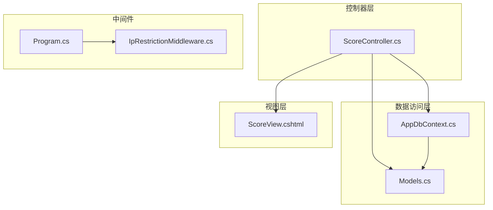
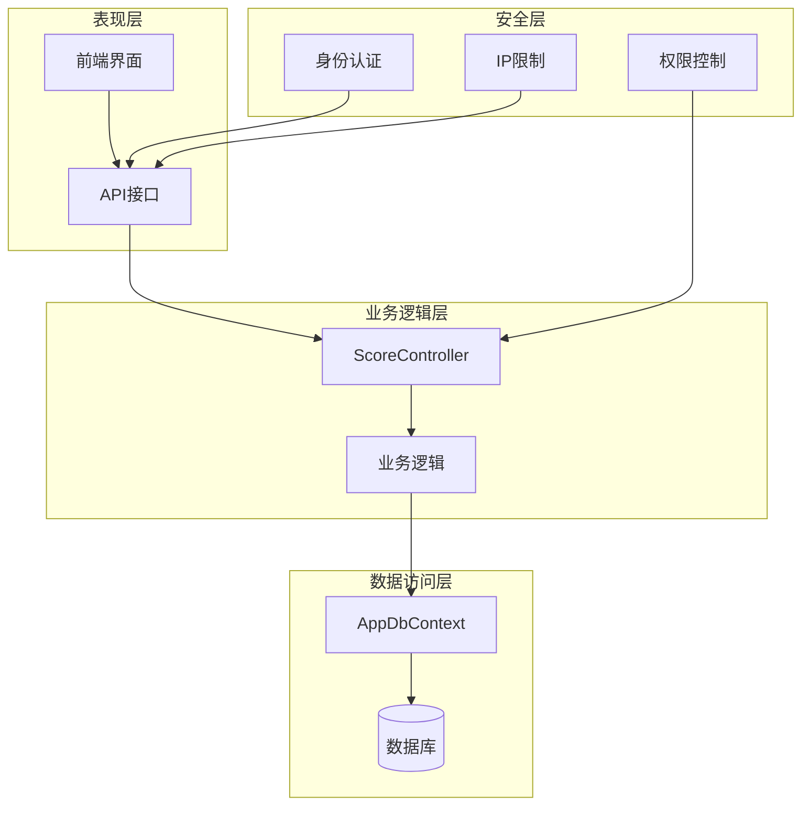
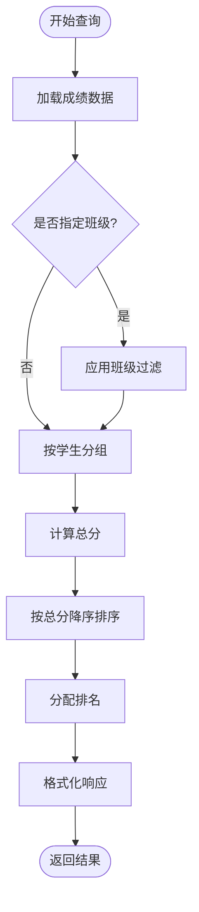
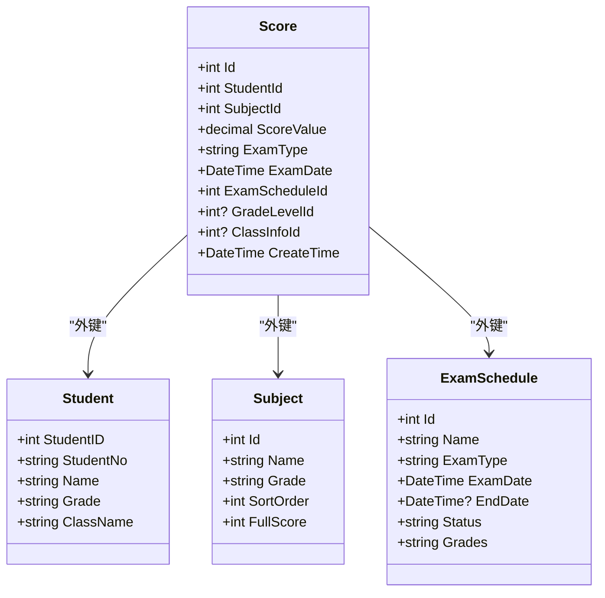

# 成绩查看API

<cite>
**本文档引用的文件**
- [ScoreController.cs](file://Controllers/ScoreController.cs)
- [AppDbContext.cs](file://Data/AppDbContext.cs)
- [Models.cs](file://Models/Models.cs)
- [Program.cs](file://Program.cs)
- [IpRestrictionMiddleware.cs](file://Middleware/IpRestrictionMiddleware.cs)
- [ScoreView.cshtml](file://Views/Score/ScoreView.cshtml)
- [create_new_tables.sql](file://create_new_tables.sql)
- [20260611075107_RefactorScoreModel.cs](file://Migrations/20260611075107_RefactorScoreModel.cs)
</cite>

## 目录
1. [简介](#简介)
2. [项目结构](#项目结构)
3. [核心组件](#核心组件)
4. [架构概览](#架构概览)
5. [详细组件分析](#详细组件分析)
6. [依赖关系分析](#依赖关系分析)
7. [性能考虑](#性能考虑)
8. [故障排除指南](#故障排除指南)
9. [结论](#结论)

## 简介

本文档详细记录了学生成绩查看系统的API接口规范，包括成绩查看页面获取接口、数据查询接口、班级列表获取接口以及Excel导出接口。系统基于ASP.NET Core框架构建，采用Entity Framework进行数据持久化，实现了完整的成绩管理功能。

## 项目结构

成绩查看功能主要分布在以下关键组件中：

**图表来源**
- [ScoreController.cs:1-620](file://Controllers/ScoreController.cs#L1-L620)
- [AppDbContext.cs:205-225](file://Data/AppDbContext.cs#L205-L225)
- [Program.cs:1-122](file://Program.cs#L1-L122)

**章节来源**
- [ScoreController.cs:1-620](file://Controllers/ScoreController.cs#L1-L620)
- [Program.cs:1-122](file://Program.cs#L1-L122)

## 核心组件

### 成绩控制器 (ScoreController)

ScoreController是成绩管理的核心控制器，负责处理所有与成绩相关的HTTP请求。该控制器使用[Authorize]特性确保只有认证用户才能访问。

**章节来源**
- [ScoreController.cs:11-19](file://Controllers/ScoreController.cs#L11-L19)

### 数据模型

系统采用强类型数据模型设计，主要包括以下核心实体：

- **Score**: 成绩实体，包含学生ID、科目ID、分数值等关键字段
- **ExamSchedule**: 考试安排实体，管理考试的基本信息
- **Subject**: 科目实体，定义各科目的属性和规则
- **Student**: 学生实体，存储学生基本信息

**章节来源**
- [Models.cs:315-358](file://Models/Models.cs#L315-L358)
- [Models.cs:295-312](file://Models/Models.cs#L295-L312)

## 架构概览

系统采用经典的三层架构设计，结合现代化的Web应用模式：

**图表来源**
- [ScoreController.cs:12-19](file://Controllers/ScoreController.cs#L12-L19)
- [Program.cs:24-32](file://Program.cs#L24-L32)
- [IpRestrictionMiddleware.cs:10-32](file://Middleware/IpRestrictionMiddleware.cs#L10-L32)

## 详细组件分析

### 成绩查看页面接口

#### GET /Score/ScoreView

**功能描述**: 获取成绩查看页面的HTML视图，包含考试安排的选择和基础数据准备。

**请求参数**: 无

**响应格式**: HTML页面，包含考试安排列表和页面布局

**实现逻辑**:
1. 查询所有考试安排，按考试日期降序排列
2. 将考试安排数据传递给视图
3. 返回ScoreView视图页面

**章节来源**
- [ScoreController.cs:160-169](file://Controllers/ScoreController.cs#L160-L169)

### 数据查询接口

#### POST /Score/GetViewData

**功能描述**: 获取指定考试安排和班级的成绩数据，支持按班级过滤。

**请求参数**:
- examScheduleId: 考试安排ID (必需)
- classInfoId: 班级ID (可选)

**响应格式**: JSON对象，包含以下字段：
- success: 布尔值，操作是否成功
- message: 字符串，错误消息（当success为false时）
- subjects: 科目数组，包含科目ID和名称
- studentScores: 学生成绩数组，包含学生信息和成绩详情

**实现逻辑**:
1. 验证考试安排是否存在
2. 获取关联的科目列表
3. 查询成绩数据，支持班级过滤
4. 按学生分组，计算总分和排名
5. 返回格式化的成绩数据

**章节来源**
- [ScoreController.cs:171-229](file://Controllers/ScoreController.cs#L171-L229)

### 班级列表获取接口

#### POST /Score/GetClassList

**功能描述**: 获取指定考试安排涉及的班级列表，支持按考试覆盖范围推断班级。

**请求参数**:
- examScheduleId: 考试安排ID (必需)

**响应格式**: JSON对象，包含以下字段：
- success: 布尔值，操作是否成功
- message: 字符串，错误消息（当success为false时）
- classes: 班级数组，包含班级ID、名称和年级信息

**实现逻辑**:
1. 验证考试安排是否存在
2. 优先查询已有成绩数据中的班级
3. 如果没有成绩数据，根据考试覆盖的年级推断班级
4. 返回排序后的班级列表

**章节来源**
- [ScoreController.cs:231-274](file://Controllers/ScoreController.cs#L231-L274)

### Excel导出接口

#### POST /Score/ExportExcel

**功能描述**: 导出指定考试安排和班级的成绩到Excel文件。

**请求参数**:
- examScheduleId: 考试安排ID (必需)
- classInfoId: 班级ID (可选)

**响应格式**: 文件流，Content-Type: application/vnd.openxmlformats-officedocument.spreadsheetml.sheet

**文件命名规则**: 成绩表_{考试名称}_{YYYYMMDD}.xlsx

**导出格式**:
- 表头: 排名、学号、姓名、各科目分数、总分
- 数据按总分降序排列
- 每个科目对应一列分数

**实现逻辑**:
1. 验证考试安排存在性
2. 获取科目列表和成绩数据
3. 按学生分组，计算总分和排名
4. 使用ClosedXML库创建Excel工作簿
5. 写入表头和数据
6. 设置列宽和格式
7. 返回文件流

**章节来源**
- [ScoreController.cs:276-348](file://Controllers/ScoreController.cs#L276-L348)

### 成绩数据分组统计功能

系统实现了完整的分组统计功能，包括按学生分组、总分计算和排名排序：

**图表来源**
- [ScoreController.cs:199-226](file://Controllers/ScoreController.cs#L199-L226)

**实现特点**:
- 使用LINQ GroupBy按学生ID分组
- 计算每科目的分数并汇总总分
- 通过OrderByDescending实现排名
- 支持动态科目数量和顺序

**章节来源**
- [ScoreController.cs:199-226](file://Controllers/ScoreController.cs#L199-L226)

## 依赖关系分析

### 数据模型依赖

**图表来源**
- [Models.cs:315-358](file://Models/Models.cs#L315-L358)
- [Models.cs:88-165](file://Models/Models.cs#L88-L165)
- [Models.cs:295-312](file://Models/Models.cs#L295-L312)

### 数据库连接和配置

系统使用Entity Framework Core进行数据访问，配置了MySQL数据库连接：

**章节来源**
- [AppDbContext.cs:205-225](file://Data/AppDbContext.cs#L205-L225)
- [Program.cs:19-21](file://Program.cs#L19-L21)

## 性能考虑

### 数据库优化

系统通过以下方式优化数据库性能：

1. **索引策略**: 在Scores表上建立了多个非聚集索引，包括StudentId、SubjectId、ExamType、ExamDate等字段
2. **查询优化**: 使用Include预加载关联数据，避免N+1查询问题
3. **分页支持**: 对于大量数据的查询，建议实现分页机制

**章节来源**
- [create_new_tables.sql:110-115](file://create_new_tables.sql#L110-L115)

### 缓存策略

建议实现以下缓存机制：
- 考试安排列表缓存
- 科目配置缓存
- 班级信息缓存

### 前端性能优化

前端页面实现了以下优化：
- 按需加载数据，避免一次性渲染大量DOM元素
- 实时计算和显示，减少服务器压力
- 输入验证和格式化，提升用户体验

## 故障排除指南

### 常见错误及解决方案

**1. 考试安排不存在**
- 错误信息: "考试安排不存在"
- 解决方案: 确认examScheduleId参数正确，检查数据库中是否存在对应的考试安排

**2. 权限不足**
- 错误信息: 403 Forbidden
- 解决方案: 确认用户已登录且具有相应的权限

**3. Excel导出失败**
- 错误信息: 500 Internal Server Error
- 解决方案: 检查服务器磁盘空间，确认ClosedXML库正常安装

**4. 数据查询超时**
- 错误信息: 请求超时
- 解决方案: 优化查询条件，添加适当的索引，考虑实现分页

### 调试技巧

1. **启用详细错误信息**: 在开发环境中查看完整的异常堆栈
2. **检查数据库连接**: 确认连接字符串配置正确
3. **监控数据库性能**: 使用SQL Profiler分析查询执行计划
4. **前端调试**: 使用浏览器开发者工具检查网络请求和响应

**章节来源**
- [ScoreController.cs:47-48](file://Controllers/ScoreController.cs#L47-L48)
- [Program.cs:49-81](file://Program.cs#L49-L81)

## 结论

本成绩查看API系统提供了完整、高效的成绩管理功能，具有以下特点：

1. **完整的功能覆盖**: 包含成绩查看、数据查询、班级管理和Excel导出
2. **良好的扩展性**: 基于标准的ASP.NET Core架构，易于功能扩展
3. **完善的错误处理**: 提供详细的错误信息和友好的用户反馈
4. **安全可靠**: 实现了多层次的安全控制和数据保护

系统通过合理的架构设计和性能优化，能够满足学校成绩管理的各种需求，为教学管理和学生发展提供了有力的技术支撑。