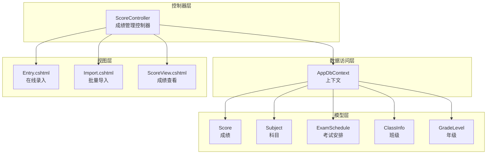
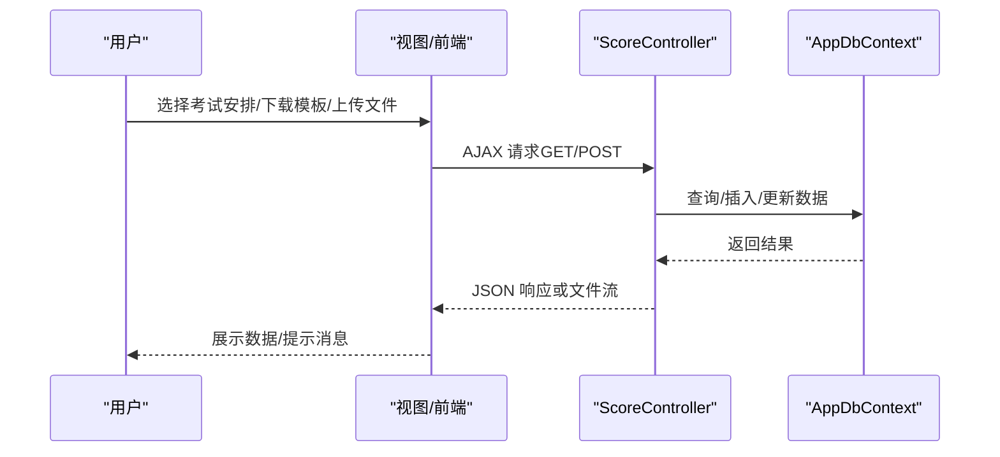
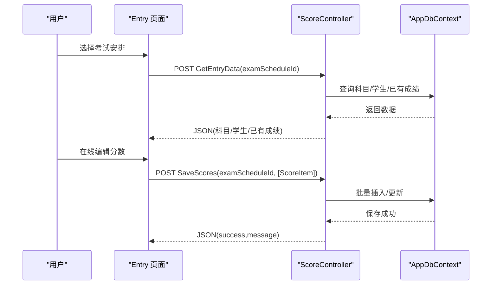
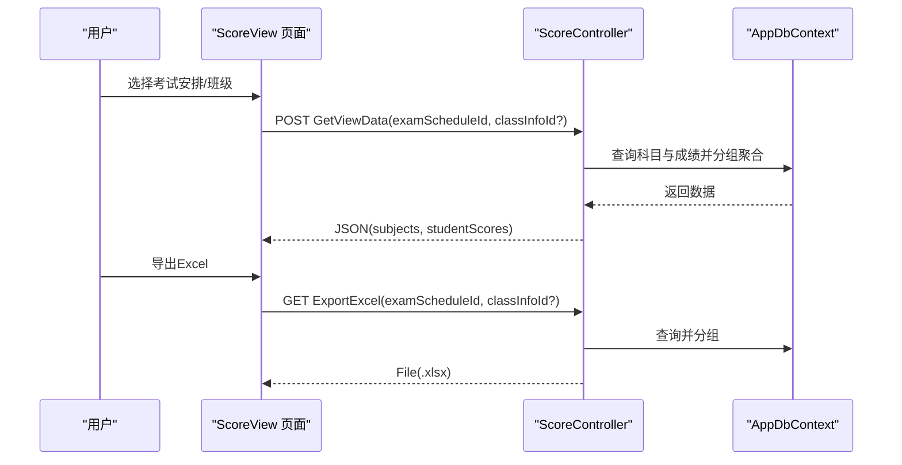
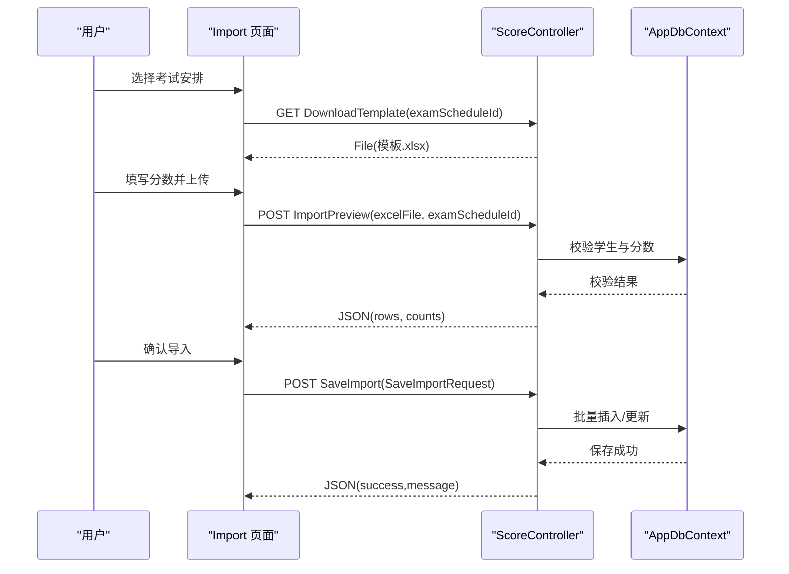
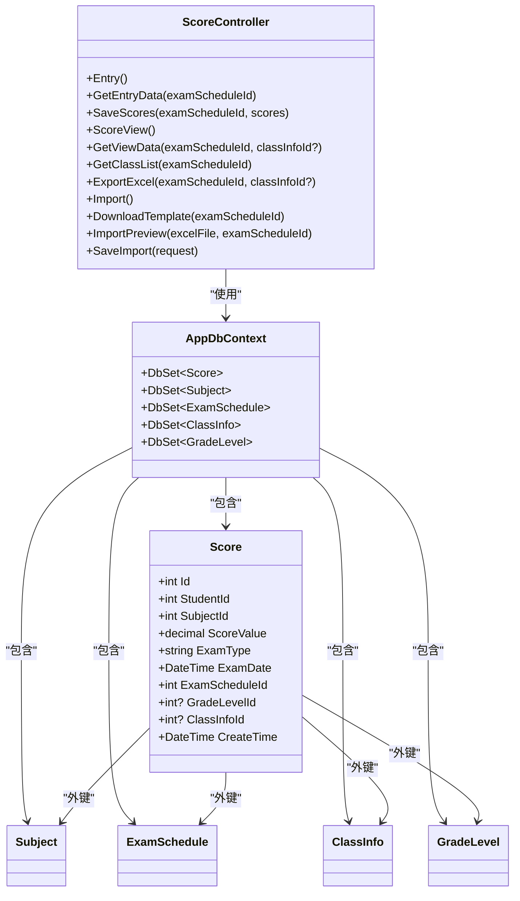

# 成绩管理API

<cite>
**本文引用的文件**
- [Controllers/ScoreController.cs](file://Controllers/ScoreController.cs)
- [Models/Models.cs](file://Models/Models.cs)
- [Models/GradeModels.cs](file://Models/GradeModels.cs)
- [Data/AppDbContext.cs](file://Data/AppDbContext.cs)
- [Views/Score/Entry.cshtml](file://Views/Score/Entry.cshtml)
- [Views/Score/Import.cshtml](file://Views/Score/Import.cshtml)
- [Views/Score/ScoreView.cshtml](file://Views/Score/ScoreView.cshtml)
- [Migrations/20260611075107_RefactorScoreModel.cs](file://Migrations/20260611075107_RefactorScoreModel.cs)
- [Migrations/20260609075559_InitialCreate.cs](file://Migrations/20260609075559_InitialCreate.cs)
- [create_new_tables.sql](file://create_new_tables.sql)
</cite>

## 目录
1. [简介](#简介)
2. [项目结构](#项目结构)
3. [核心组件](#核心组件)
4. [架构总览](#架构总览)
5. [详细组件分析](#详细组件分析)
6. [依赖关系分析](#依赖关系分析)
7. [性能考量](#性能考量)
8. [故障排查指南](#故障排查指南)
9. [结论](#结论)
10. [附录](#附录)

## 简介
本文件面向“成绩管理”模块的API与前端交互，覆盖以下能力：
- 成绩录入（在线表格式）
- 成绩查看与导出（Excel）
- 批量导入（Excel模板 + 预览 + 保存）
- 查询接口的筛选与排序
- 统计分析（按班级、科目、考试的汇总统计思路）
- 安全性与完整性约束说明

注意：当前控制器实现主要基于表单与AJAX交互，部分统计分析接口在控制器中提供基础框架，具体高级统计可在现有基础上扩展。

## 项目结构
围绕成绩管理的核心文件与职责如下：
- 控制器层：ScoreController 提供成绩录入、查看、导出、批量导入等接口
- 模型层：Score、Subject、ExamSchedule、ClassInfo、GradeLevel 等实体定义
- 数据访问层：AppDbContext 配置实体映射与索引
- 视图层：Entry.cshtml、Import.cshtml、ScoreView.cshtml 提供前端交互界面
- 迁移与脚本：EF Core 迁移与SQL脚本确保数据库结构演进



**图表来源**
- [Controllers/ScoreController.cs:11-591](file://Controllers/ScoreController.cs#L11-L591)
- [Data/AppDbContext.cs:6-295](file://Data/AppDbContext.cs#L6-L295)
- [Models/Models.cs:314-358](file://Models/Models.cs#L314-L358)
- [Models/GradeModels.cs:6-74](file://Models/GradeModels.cs#L6-L74)
- [Views/Score/Entry.cshtml:128-195](file://Views/Score/Entry.cshtml#L128-L195)
- [Views/Score/Import.cshtml:33-217](file://Views/Score/Import.cshtml#L33-L217)
- [Views/Score/ScoreView.cshtml:120-145](file://Views/Score/ScoreView.cshtml#L120-L145)

**章节来源**
- [Controllers/ScoreController.cs:11-591](file://Controllers/ScoreController.cs#L11-L591)
- [Data/AppDbContext.cs:6-295](file://Data/AppDbContext.cs#L6-L295)

## 核心组件
- 成绩实体 Score：包含分数、考试类型、考试日期、关联考试安排、班级与年级快照等字段，并具备唯一复合索引（学生+科目+考试安排）
- 科目 Subject：包含名称、适用年级、排序、满分等
- 考试安排 ExamSchedule：包含名称、类型、覆盖年级、日期范围、状态等
- 班级 ClassInfo 与 年级 GradeLevel：用于快照记录考试时的班级与年级信息
- 控制器 ScoreController：提供录入、查看、导出、导入等接口

**章节来源**
- [Models/Models.cs:296-358](file://Models/Models.cs#L296-L358)
- [Models/GradeModels.cs:6-74](file://Models/GradeModels.cs#L6-L74)
- [Data/AppDbContext.cs:204-224](file://Data/AppDbContext.cs#L204-L224)

## 架构总览
成绩管理采用经典的三层架构：
- 表单/前端页面负责输入与展示
- 控制器接收请求，调用业务逻辑（此处为直接数据库访问）
- 数据库通过 EF Core 上下文进行持久化



**图表来源**
- [Controllers/ScoreController.cs:32-157](file://Controllers/ScoreController.cs#L32-L157)
- [Controllers/ScoreController.cs:171-229](file://Controllers/ScoreController.cs#L171-L229)
- [Controllers/ScoreController.cs:276-348](file://Controllers/ScoreController.cs#L276-L348)
- [Controllers/ScoreController.cs:351-591](file://Controllers/ScoreController.cs#L351-L591)

## 详细组件分析

### 成绩录入（在线表格式）
- 功能概述：加载考试安排、科目、学生列表，支持在线编辑分数并批量保存
- 关键接口
  - GET /Score/Entry：加载最近考试安排列表
  - POST /Score/GetEntryData：按考试安排返回科目、学生、已有成绩
  - POST /Score/SaveScores：批量保存分数（支持新增与更新）
- 请求与响应要点
  - GetEntryData：请求包含 examScheduleId；响应包含 subjects、students、existingScores、subjectIds
  - SaveScores：请求体为数组 ScoreItem（包含 studentId、subjectId、scoreValue）；响应为 {success, message}
- 输入校验与约束
  - 分数范围受科目满分限制
  - 重复键（学生+科目+考试安排）由数据库唯一索引保证
- 前端交互
  - 前端使用 step="0.5"、min="0"、max="满 分" 的输入控件
  - 支持键盘导航与变更追踪



**图表来源**
- [Controllers/ScoreController.cs:32-157](file://Controllers/ScoreController.cs#L32-L157)
- [Views/Score/Entry.cshtml:128-195](file://Views/Score/Entry.cshtml#L128-L195)

**章节来源**
- [Controllers/ScoreController.cs:32-157](file://Controllers/ScoreController.cs#L32-L157)
- [Views/Score/Entry.cshtml:128-195](file://Views/Score/Entry.cshtml#L128-L195)

### 成绩查看与导出（Excel）
- 功能概述：按考试安排与可选班级筛选，返回学生成绩与总分排名，并支持导出Excel
- 关键接口
  - GET /Score/ScoreView：加载考试安排列表
  - POST /Score/GetViewData：按考试安排与班级返回科目与学生成绩（含总分与排名）
  - POST /Score/GetClassList：获取该考试涉及的班级列表
  - GET /Score/ExportExcel：导出Excel（排名、学号、姓名、各科分数、总分）
- 查询筛选与排序
  - 筛选：examScheduleId 必填；classInfoId 可选
  - 排序：按总分降序
- 响应结构
  - GetViewData 返回 subjects 与 studentScores（每条包含 rank、studentNo、studentName、scores、totalScore）
  - ExportExcel 返回文件流（.xlsx）



**图表来源**
- [Controllers/ScoreController.cs:160-229](file://Controllers/ScoreController.cs#L160-L229)
- [Controllers/ScoreController.cs:231-274](file://Controllers/ScoreController.cs#L231-L274)
- [Controllers/ScoreController.cs:276-348](file://Controllers/ScoreController.cs#L276-L348)

**章节来源**
- [Controllers/ScoreController.cs:160-229](file://Controllers/ScoreController.cs#L160-L229)
- [Controllers/ScoreController.cs:231-274](file://Controllers/ScoreController.cs#L231-L274)
- [Controllers/ScoreController.cs:276-348](file://Controllers/ScoreController.cs#L276-L348)
- [Views/Score/ScoreView.cshtml:120-145](file://Views/Score/ScoreView.cshtml#L120-L145)

### 批量导入（Excel模板 + 预览 + 保存）
- 功能概述：下载模板 → 填写分数 → 上传预览 → 确认保存
- 关键接口
  - GET /Score/Import：加载考试安排列表
  - GET /Score/DownloadTemplate：下载导入模板（含科目列与满分注释）
  - POST /Score/ImportPreview：上传Excel并预览，校验学生匹配与分数合法性
  - POST /Score/SaveImport：保存导入数据（支持新增与更新）
- 模板格式与校验规则
  - 模板列：序号、学号、姓名、年级、班级、各科目分数
  - 校验：学号+姓名需匹配；分数必须为数字且不得低于0、不得超过科目满分；空单元格视为缺考
- 请求与响应要点
  - ImportPreview：请求体为 multipart/form-data（excelFile, examScheduleId）；响应包含 rows、successCount、errorCount、totalCount
  - SaveImport：请求体为 SaveImportRequest（ExamScheduleId、Rows：ImportRow[]，每行包含 StudentId/No/Name 与 Scores：ImportScoreItem[]）



**图表来源**
- [Controllers/ScoreController.cs:351-591](file://Controllers/ScoreController.cs#L351-L591)
- [Views/Score/Import.cshtml:33-217](file://Views/Score/Import.cshtml#L33-L217)

**章节来源**
- [Controllers/ScoreController.cs:351-591](file://Controllers/ScoreController.cs#L351-L591)
- [Views/Score/Import.cshtml:33-217](file://Views/Score/Import.cshtml#L33-L217)

### 查询接口的筛选条件与排序选项
- 筛选条件
  - examScheduleId：必填，按考试安排过滤
  - classInfoId：可选，按班级过滤
- 排序选项
  - GetViewData：按总分降序
- 其他
  - 导出Excel同样支持按班级过滤

**章节来源**
- [Controllers/ScoreController.cs:171-229](file://Controllers/ScoreController.cs#L171-L229)
- [Controllers/ScoreController.cs:276-348](file://Controllers/ScoreController.cs#L276-L348)

### 统计分析接口（按班级/科目/考试汇总）
- 当前实现
  - 成绩查看接口返回按总分降序的排名与各科分数，可用于班级内统计
  - 可通过 GetClassList 获取涉及班级，结合 GetViewData 实现按班级汇总
- 扩展建议（基于现有结构）
  - 按科目：在 GetViewData 的分组逻辑基础上，按 SubjectId 聚合求平均分、最高/最低分、及格率等
  - 按考试：按 ExamScheduleId 聚合各班级平均分、标准差等
  - 建议在控制器中新增对应 Action，并复用现有查询与分组逻辑

**章节来源**
- [Controllers/ScoreController.cs:171-229](file://Controllers/ScoreController.cs#L171-L229)
- [Controllers/ScoreController.cs:231-274](file://Controllers/ScoreController.cs#L231-L274)

### 数据结构与计算公式
- 成绩数据结构
  - ScoreItem：{ studentId, subjectId, scoreValue }
  - SaveImportRequest：{ examScheduleId, rows: [{ studentId, studentNo, name, scores: [{ subjectId, scoreValue }] }] }
- 计算与展示
  - 总分：按学生分组求和
  - 排名：按总分降序生成自然序号
  - 前端高亮：示例中对单科≥90%满分与<60%满分进行颜色标记

**章节来源**
- [Controllers/ScoreController.cs:593-620](file://Controllers/ScoreController.cs#L593-L620)
- [Views/Score/ScoreView.cshtml:120-145](file://Views/Score/ScoreView.cshtml#L120-L145)

## 依赖关系分析
- 控制器依赖 AppDbContext 进行数据访问
- Score 实体与 Subject、ExamSchedule、ClassInfo、GradeLevel 存在外键关系
- 数据库层面通过唯一索引与外键约束保障完整性
- 前端视图通过AJAX与控制器交互，实现无刷新操作



**图表来源**
- [Controllers/ScoreController.cs:11-591](file://Controllers/ScoreController.cs#L11-L591)
- [Data/AppDbContext.cs:6-295](file://Data/AppDbContext.cs#L6-L295)
- [Models/Models.cs:314-358](file://Models/Models.cs#L314-L358)
- [Models/GradeModels.cs:6-74](file://Models/GradeModels.cs#L6-L74)

**章节来源**
- [Data/AppDbContext.cs:204-224](file://Data/AppDbContext.cs#L204-L224)
- [Migrations/20260611075107_RefactorScoreModel.cs:32-130](file://Migrations/20260611075107_RefactorScoreModel.cs#L32-L130)
- [Migrations/20260609075559_InitialCreate.cs:434-465](file://Migrations/20260609075559_InitialCreate.cs#L434-L465)
- [create_new_tables.sql:87-115](file://create_new_tables.sql#L87-L115)

## 性能考量
- 索引策略
  - 建议在 Scores 表上维护 StudentId、SubjectId、ExamType、ExamDate 等常用查询字段索引
- 查询优化
  - 批量加载：SaveScores 与 SaveImport 使用批量查询与字典缓存，避免 N+1 查询
  - 分组与排序：GetViewData 对学生成绩进行一次性分组与排序，避免前端二次处理
- 导出性能
  - ExportExcel 与 ImportPreview 对大数据集应考虑分页或服务端渲染

**章节来源**
- [create_new_tables.sql:110-115](file://create_new_tables.sql#L110-L115)
- [Controllers/ScoreController.cs:90-157](file://Controllers/ScoreController.cs#L90-L157)
- [Controllers/ScoreController.cs:523-591](file://Controllers/ScoreController.cs#L523-L591)

## 故障排查指南
- 常见错误与提示
  - 考试安排不存在：在 GetEntryData、GetViewData、ExportExcel、ImportPreview 等接口中均有明确提示
  - 未提交任何成绩：SaveScores 会返回相应提示
  - 未找到该学生：ImportPreview 会在预览中标注错误
  - 超出满分或格式错误：ImportPreview 校验分数范围与格式
- 建议排查步骤
  - 确认 examScheduleId 正确
  - 确认模板列与科目顺序一致
  - 检查分数范围与格式
  - 查看浏览器控制台与网络面板定位AJAX错误

**章节来源**
- [Controllers/ScoreController.cs:44-99](file://Controllers/ScoreController.cs#L44-L99)
- [Controllers/ScoreController.cs:421-521](file://Controllers/ScoreController.cs#L421-L521)

## 结论
本模块提供了完整的成绩管理闭环：在线录入、查看与导出、批量导入与预览、以及按班级/考试的基础统计能力。通过EF Core与数据库索引保障了数据一致性与查询效率。建议在此基础上扩展按科目与跨考试的统计分析接口，以满足更复杂的教学评估需求。

## 附录

### API 接口清单与说明
- 成绩录入
  - GET /Score/Entry：加载考试安排列表
  - POST /Score/GetEntryData：按考试安排返回科目、学生、已有成绩
  - POST /Score/SaveScores：批量保存分数
- 成绩查看与导出
  - GET /Score/ScoreView：加载考试安排列表
  - POST /Score/GetViewData：按考试安排与班级返回科目与学生成绩（含总分与排名）
  - POST /Score/GetClassList：获取该考试涉及的班级列表
  - GET /Score/ExportExcel：导出Excel
- 批量导入
  - GET /Score/Import：加载考试安排列表
  - GET /Score/DownloadTemplate：下载导入模板
  - POST /Score/ImportPreview：上传Excel并预览
  - POST /Score/SaveImport：保存导入数据

**章节来源**
- [Controllers/ScoreController.cs:32-157](file://Controllers/ScoreController.cs#L32-L157)
- [Controllers/ScoreController.cs:160-229](file://Controllers/ScoreController.cs#L160-L229)
- [Controllers/ScoreController.cs:231-274](file://Controllers/ScoreController.cs#L231-L274)
- [Controllers/ScoreController.cs:276-348](file://Controllers/ScoreController.cs#L276-L348)
- [Controllers/ScoreController.cs:351-591](file://Controllers/ScoreController.cs#L351-L591)

### 数据模型与关系
```mermaid
erDiagram
SUBJECT {
int Id PK
string Name
string Grade
int SortOrder
int FullScore
}
EXAMSCHEDULE {
int Id PK
string Name
string ExamType
string Grades
datetime ExamDate
datetime EndDate
int? SemesterId
string Status
}
STUDENT {
int StudentID PK
string StudentNo
string Name
string Grade
string ClassName
}
CLASSINFO {
int ClassInfoID PK
int GradeLevelID
string ClassName
}
GRADELEVEL {
int GradeLevelID PK
int EntryYear
string SchoolType
}
SCORE {
int Id PK
int StudentId
int SubjectId
decimal ScoreValue
string ExamType
datetime ExamDate
int ExamScheduleId
int? GradeLevelId
int? ClassInfoId
}
SUBJECT ||--o{ SCORE : "被考科目"
STUDENT ||--o{ SCORE : "拥有成绩"
EXAMSCHEDULE ||--o{ SCORE : "包含成绩"
CLASSINFO ||--o{ SCORE : "快照班级"
GRADELEVEL ||--o{ CLASSINFO : "包含班级"
```

**图表来源**
- [Models/Models.cs:296-358](file://Models/Models.cs#L296-L358)
- [Models/GradeModels.cs:6-74](file://Models/GradeModels.cs#L6-L74)
- [Data/AppDbContext.cs:204-224](file://Data/AppDbContext.cs#L204-L224)