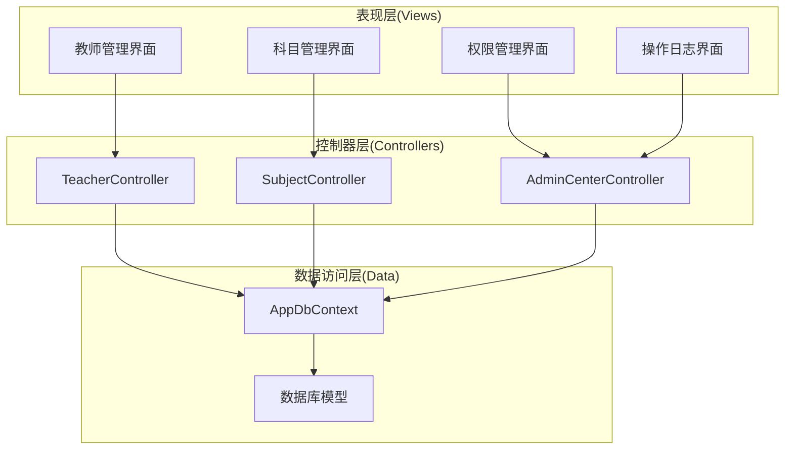
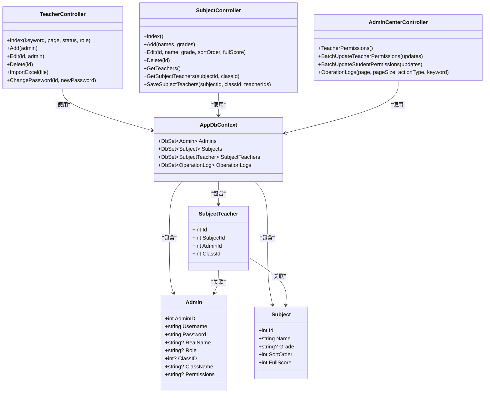
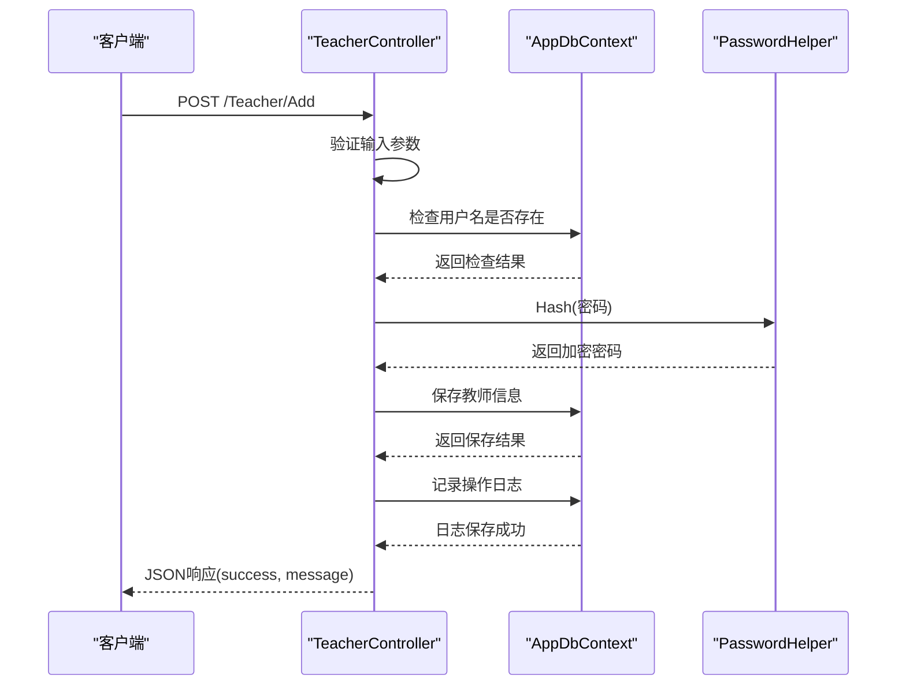
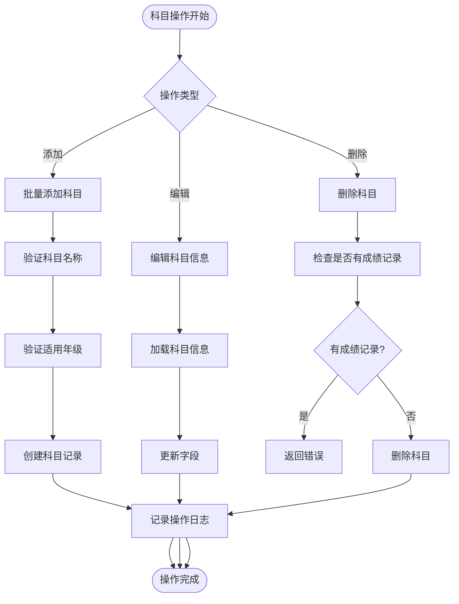
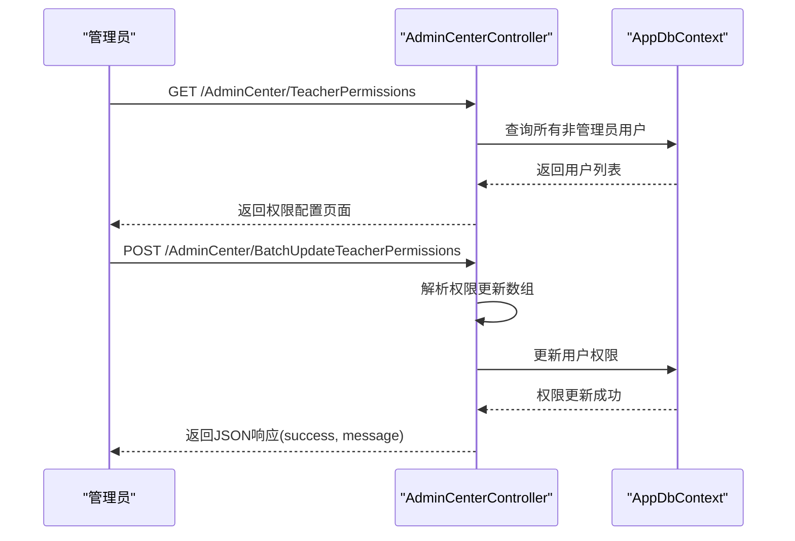
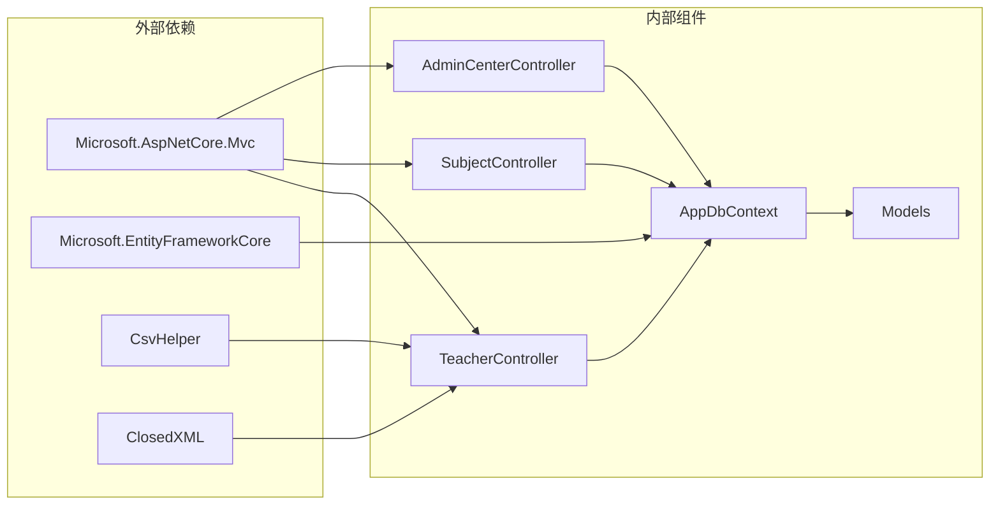
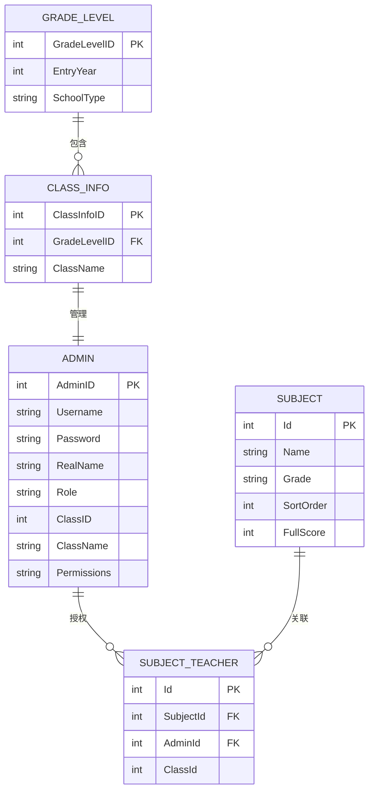

# 教师与班级API

<cite>
**本文档引用的文件**
- [TeacherController.cs](file://Controllers/TeacherController.cs)
- [SubjectController.cs](file://Controllers/SubjectController.cs)
- [AdminCenterController.cs](file://Controllers/AdminCenterController.cs)
- [AppDbContext.cs](file://Data/AppDbContext.cs)
- [Models.cs](file://Models/Models.cs)
- [Index.cshtml](file://Views/Teacher/Index.cshtml)
- [Index.cshtml](file://Views/Subject/Index.cshtml)
- [TeacherPermissions.cshtml](file://Views/AdminCenter/TeacherPermissions.cshtml)
- [Add_GradeManagement_Tables.sql](file://Database/Add_GradeManagement_Tables.sql)
</cite>

## 目录
1. [简介](#简介)
2. [项目结构](#项目结构)
3. [核心组件](#核心组件)
4. [架构概览](#架构概览)
5. [详细组件分析](#详细组件分析)
6. [依赖关系分析](#依赖关系分析)
7. [性能考虑](#性能考虑)
8. [故障排除指南](#故障排除指南)
9. [结论](#结论)

## 简介

本项目是一个基于ASP.NET Core的学生管理系统，专注于教师和班级管理功能。系统提供了完整的教师信息管理、班级管理、科目管理和权限控制功能，支持批量操作和AJAX交互。

## 项目结构

系统采用经典的三层架构设计，主要包含以下模块：

**图表来源**
- [TeacherController.cs:1-501](file://Controllers/TeacherController.cs#L1-L501)
- [SubjectController.cs:1-351](file://Controllers/SubjectController.cs#L1-L351)
- [AdminCenterController.cs:1-491](file://Controllers/AdminCenterController.cs#L1-L491)

**章节来源**
- [TeacherController.cs:1-501](file://Controllers/TeacherController.cs#L1-L501)
- [SubjectController.cs:1-351](file://Controllers/SubjectController.cs#L1-L351)
- [AdminCenterController.cs:1-491](file://Controllers/AdminCenterController.cs#L1-L491)

## 核心组件

### 教师管理组件
- **TeacherController**: 处理教师信息的CRUD操作，包括添加、编辑、删除、导入等功能
- **Admin模型**: 定义教师的基本信息、角色、权限等属性
- **班级关联**: 支持教师与班级的绑定关系管理

### 科目管理组件
- **SubjectController**: 管理学科信息，支持科目分配和教师授权
- **Subject模型**: 定义科目名称、适用年级、排序等属性
- **SubjectTeacher模型**: 建立科目与教师的关联关系

### 权限管理组件
- **AdminCenterController**: 提供权限配置和管理功能
- **权限模型**: 支持细粒度的权限控制，包括个人中心权限和学生管理权限

**章节来源**
- [Models.cs:6-86](file://Models/Models.cs#L6-L86)
- [Models.cs:295-381](file://Models/Models.cs#L295-L381)
- [Models.cs:360-381](file://Models/Models.cs#L360-L381)

## 架构概览

系统采用MVC架构模式，通过Entity Framework进行数据持久化：

**图表来源**
- [TeacherController.cs:12-501](file://Controllers/TeacherController.cs#L12-L501)
- [SubjectController.cs:12-351](file://Controllers/SubjectController.cs#L12-L351)
- [AdminCenterController.cs:12-491](file://Controllers/AdminCenterController.cs#L12-L491)
- [AppDbContext.cs:6-312](file://Data/AppDbContext.cs#L6-L312)

## 详细组件分析

### 教师信息管理API

#### 教师列表查询接口
- **端点**: `GET /Teacher/Index`
- **功能**: 分页查询教师列表，支持关键词搜索、状态筛选、角色筛选
- **参数**:
  - `keyword`: 搜索关键词（姓名、用户名、班级、年级）
  - `page`: 页码，默认1
  - `status`: 状态筛选（正常、已删除）
  - `role`: 角色筛选
- **响应**: 返回教师列表视图，包含分页信息和统计数据

#### 教师添加接口
- **端点**: `POST /Teacher/Add`
- **功能**: 添加新教师信息
- **请求体**: Admin对象
- **验证规则**:
  - 姓名不能为空
  - 用户名不能为空且唯一
  - 密码至少6位
  - 角色不能为空
- **响应**: JSON格式，包含success和message字段

#### 教师编辑接口
- **端点**: `POST /Teacher/Edit/{id}`
- **功能**: 更新教师信息
- **路径参数**: `id` - 教师ID
- **请求体**: Admin对象（不包含用户名和密码字段）
- **响应**: JSON格式，包含success和message字段

#### 教师删除接口
- **端点**: `POST /Teacher/Delete/{id}`
- **功能**: 软删除教师（标记为已删除）
- **响应**: JSON格式，包含操作结果

#### 教师导入接口
- **端点**: `POST /Teacher/ImportExcel`
- **功能**: 批量导入教师信息（支持.xlsx格式）
- **请求**: 文件上传
- **响应**: JSON格式，包含导入统计结果

**图表来源**
- [TeacherController.cs:88-135](file://Controllers/TeacherController.cs#L88-L135)
- [TeacherController.cs:476-493](file://Controllers/TeacherController.cs#L476-L493)

**章节来源**
- [TeacherController.cs:22-78](file://Controllers/TeacherController.cs#L22-L78)
- [TeacherController.cs:88-135](file://Controllers/TeacherController.cs#L88-L135)
- [TeacherController.cs:148-211](file://Controllers/TeacherController.cs#L148-L211)
- [TeacherController.cs:234-281](file://Controllers/TeacherController.cs#L234-L281)
- [TeacherController.cs:288-385](file://Controllers/TeacherController.cs#L288-L385)

### 科目管理API

#### 科目列表查询接口
- **端点**: `GET /Subject/Index`
- **功能**: 获取科目列表，包含班级和教师授权信息
- **响应**: 科目列表视图，包含科目详细信息

#### 科目添加接口
- **端点**: `POST /Subject/Add`
- **功能**: 批量添加科目
- **请求体**: names数组（科目名称）、grades数组（适用年级）
- **响应**: JSON格式，包含添加数量

#### 科目编辑接口
- **端点**: `POST /Subject/Edit/{id}`
- **功能**: 更新科目信息
- **路径参数**: `id` - 科目ID
- **请求体**: name、grade、sortOrder、fullScore参数
- **响应**: JSON格式，包含success字段

#### 科目删除接口
- **端点**: `POST /Subject/Delete/{id}`
- **功能**: 删除科目
- **响应**: JSON格式，包含操作结果

**图表来源**
- [SubjectController.cs:63-141](file://Controllers/SubjectController.cs#L63-L141)
- [SubjectController.cs:111-125](file://Controllers/SubjectController.cs#L111-L125)
- [SubjectController.cs:127-141](file://Controllers/SubjectController.cs#L127-L141)

**章节来源**
- [SubjectController.cs:21-61](file://Controllers/SubjectController.cs#L21-L61)
- [SubjectController.cs:63-141](file://Controllers/SubjectController.cs#L63-L141)
- [SubjectController.cs:111-125](file://Controllers/SubjectController.cs#L111-L125)
- [SubjectController.cs:127-141](file://Controllers/SubjectController.cs#L127-L141)

### 教师权限管理API

#### 教师权限配置接口
- **端点**: `GET /AdminCenter/TeacherPermissions`
- **功能**: 获取所有非管理员用户的权限配置页面
- **响应**: 权限配置视图

#### 批量权限更新接口
- **端点**: `POST /AdminCenter/BatchUpdateTeacherPermissions`
- **功能**: 批量更新教师的个人中心权限
- **请求体**: TeacherPermUpdateModel数组
- **响应**: JSON格式，包含操作结果

**图表来源**
- [AdminCenterController.cs:291-337](file://Controllers/AdminCenterController.cs#L291-L337)
- [AdminCenterController.cs:309-337](file://Controllers/AdminCenterController.cs#L309-L337)

**章节来源**
- [AdminCenterController.cs:291-337](file://Controllers/AdminCenterController.cs#L291-L337)
- [TeacherPermissions.cshtml:1-124](file://Views/AdminCenter/TeacherPermissions.cshtml#L1-L124)

### 班级管理API

#### 班级创建接口
- **端点**: `POST /Grade/AddClass`
- **功能**: 为指定年级创建班级
- **请求体**: gradeLevelId、className、count参数
- **响应**: JSON格式，包含操作结果

#### 班主任分配接口
- **端点**: `POST /Grade/AssignTeacher`
- **功能**: 为班级分配班主任
- **请求体**: classId、teacherId参数
- **响应**: JSON格式，包含分配结果

#### 班主任移除接口
- **端点**: `POST /Grade/RemoveTeacher`
- **功能**: 取消班级的班主任职务
- **请求体**: classId参数
- **响应**: JSON格式，包含操作结果

**章节来源**
- [GradeController.cs:167-228](file://Controllers/GradeController.cs#L167-L228)
- [GradeController.cs:266-292](file://Controllers/GradeController.cs#L266-L292)
- [GradeController.cs:294-330](file://Controllers/GradeController.cs#L294-L330)

## 依赖关系分析

系统的核心依赖关系如下：

**图表来源**
- [TeacherController.cs:1-8](file://Controllers/TeacherController.cs#L1-L8)
- [SubjectController.cs:1-7](file://Controllers/SubjectController.cs#L1-L7)
- [AdminCenterController.cs:1-8](file://Controllers/AdminCenterController.cs#L1-L8)

### 数据模型关系

**图表来源**
- [AppDbContext.cs:35-310](file://Data/AppDbContext.cs#L35-L310)
- [Models.cs:6-86](file://Models/Models.cs#L6-L86)
- [Models.cs:295-381](file://Models/Models.cs#L295-L381)
- [Models.cs:360-381](file://Models/Models.cs#L360-L381)

**章节来源**
- [AppDbContext.cs:35-310](file://Data/AppDbContext.cs#L35-L310)
- [Models.cs:6-86](file://Models/Models.cs#L6-L86)
- [Models.cs:295-381](file://Models/Models.cs#L295-L381)
- [Models.cs:360-381](file://Models/Models.cs#L360-L381)

## 性能考虑

### 数据库优化
- **索引策略**: 在常用查询字段上建立适当索引，如Username、ClassID、Role等
- **查询优化**: 使用Include方法进行必要的关联查询，避免N+1查询问题
- **分页处理**: 对大量数据采用分页查询，限制单次查询数量

### 缓存策略
- **静态数据缓存**: 年级、班级等静态数据可考虑缓存
- **权限缓存**: 用户权限信息可在登录时缓存

### 异步处理
- **异步操作**: 所有数据库操作均采用异步方法，提高并发性能
- **文件处理**: 大文件导入采用流式处理，避免内存溢出

## 故障排除指南

### 常见问题及解决方案

#### 教师导入失败
**问题**: 导入Excel文件时报错
**原因**: 文件格式不正确或数据格式不符合要求
**解决**: 确认文件为.xlsx格式，检查表头和数据格式

#### 权限不足
**问题**: 访问某些功能时报权限不足
**原因**: 当前用户角色权限不够
**解决**: 确保用户具有管理员角色或相应的权限配置

#### 数据重复
**问题**: 添加教师时提示用户名已存在
**原因**: 用户名重复
**解决**: 更换唯一的用户名或删除重复用户

**章节来源**
- [TeacherController.cs:288-359](file://Controllers/TeacherController.cs#L288-L359)
- [AdminCenterController.cs:340-345](file://Controllers/AdminCenterController.cs#L340-L345)

## 结论

本系统提供了完整的教师和班级管理解决方案，具有以下特点：

1. **功能完整**: 覆盖了教师管理、科目管理、权限控制等核心功能
2. **界面友好**: 提供了直观的Web界面和丰富的交互功能
3. **扩展性强**: 基于MVC架构，易于功能扩展和维护
4. **安全性高**: 包含权限控制、数据验证、操作日志等功能

系统通过合理的架构设计和完善的API接口，为学校管理提供了高效的技术支撑。