# 教师信息管理API

<cite>
**本文档引用的文件**
- [TeacherController.cs](file://Controllers/TeacherController.cs)
- [Models.cs](file://Models/Models.cs)
- [AppDbContext.cs](file://Data/AppDbContext.cs)
- [PasswordHelper.cs](file://Services/PasswordHelper.cs)
- [Add.cshtml](file://Views/Teacher/Add.cshtml)
- [Edit.cshtml](file://Views/Teacher/Edit.cshtml)
- [Import.cshtml](file://Views/Teacher/Import.cshtml)
- [Index.cshtml](file://Views/Teacher/Index.cshtml)
- [site.js](file://wwwroot/js/site.js)
</cite>

## 目录
1. [简介](#简介)
2. [项目结构](#项目结构)
3. [核心组件](#核心组件)
4. [架构概览](#架构概览)
5. [详细组件分析](#详细组件分析)
6. [依赖关系分析](#依赖关系分析)
7. [性能考虑](#性能考虑)
8. [故障排除指南](#故障排除指南)
9. [结论](#结论)

## 简介

教师信息管理API是学生管理系统中的核心功能模块，负责管理教职工的基本信息、状态管理和批量导入功能。该系统基于ASP.NET Core框架构建，采用MVC架构模式，提供了完整的教师信息CRUD操作接口。

系统主要功能包括：
- 教师基本信息的增删改查操作
- 教师状态管理（正常/已删除）
- 批量导入功能（CSV和Excel格式）
- AJAX异步请求处理
- 密码加密和验证
- 操作日志记录

## 项目结构

教师信息管理模块采用标准的ASP.NET Core MVC项目结构：

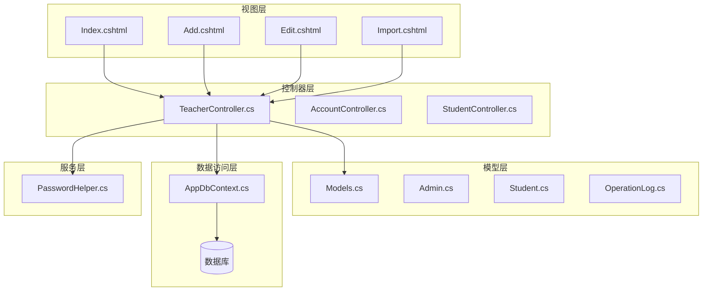

**图表来源**
- [TeacherController.cs:1-501](file://Controllers/TeacherController.cs#L1-L501)
- [Models.cs:1-490](file://Models/Models.cs#L1-L490)
- [AppDbContext.cs:1-312](file://Data/AppDbContext.cs#L1-L312)

**章节来源**
- [TeacherController.cs:1-501](file://Controllers/TeacherController.cs#L1-L501)
- [Models.cs:1-490](file://Models/Models.cs#L1-L490)
- [AppDbContext.cs:1-312](file://Data/AppDbContext.cs#L1-L312)

## 核心组件

### 教师实体模型

系统使用Admin类作为教师信息的核心数据模型，包含以下关键属性：

| 属性名 | 数据类型 | 长度限制 | 描述 |
|--------|----------|----------|------|
| AdminID | 整数 | 主键 | 教师唯一标识符 |
| Username | 字符串 | 50 | 用户名（登录凭据） |
| Password | 字符串 | 50 | 密码（已哈希存储） |
| RealName | 字符串 | 50 | 姓名 |
| Gender | 字符串 | 10 | 性别（男/女） |
| Nation | 字符串 | 20 | 民族 |
| BirthDate | 日期时间 | - | 出生日期 |
| RegisteredDomicile | 字符串 | 200 | 户口所在地 |
| HighestEducation | 字符串 | 50 | 最高学历 |
| CertSubject | 字符串 | 100 | 教师资格证科目 |
| CertNumber | 字符串 | 100 | 教师资格证号 |
| CertAuthority | 字符串 | 200 | 所属教育局 |
| Phone | 字符串 | 20 | 手机号 |
| Role | 字符串 | 20 | 角色（班主任/科任教师等） |
| Status | 字符串 | 20 | 状态（正常/已删除） |
| CreateTime | 日期时间 | - | 创建时间 |

### 数据库上下文配置

AppDbContext类定义了数据库连接和实体映射关系：

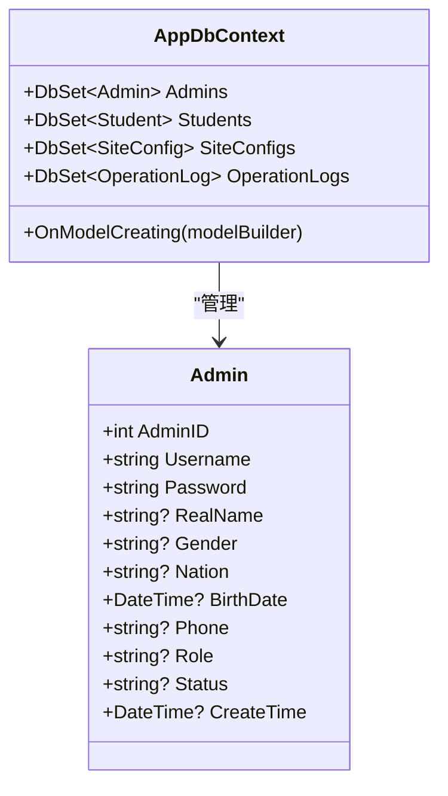

**图表来源**
- [AppDbContext.cs:10-312](file://Data/AppDbContext.cs#L10-L312)
- [Models.cs:6-86](file://Models/Models.cs#L6-L86)

**章节来源**
- [Models.cs:6-86](file://Models/Models.cs#L6-L86)
- [AppDbContext.cs:35-49](file://Data/AppDbContext.cs#L35-L49)

## 架构概览

系统采用经典的三层架构设计，结合MVC模式实现：

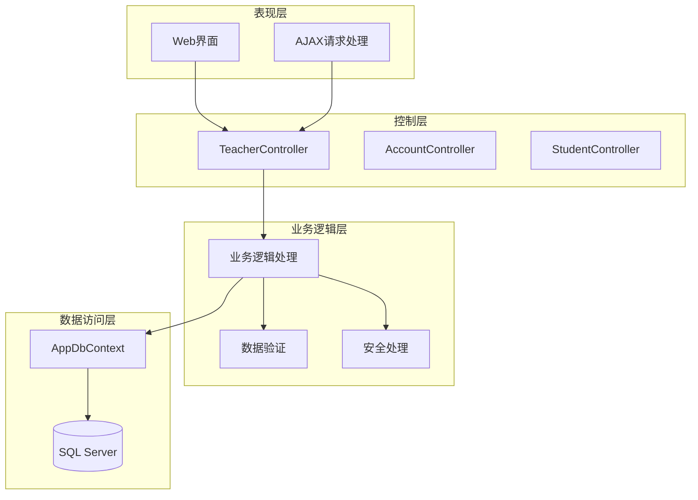

**图表来源**
- [TeacherController.cs:12-216](file://Controllers/TeacherController.cs#L12-L216)
- [PasswordHelper.cs:8-42](file://Services/PasswordHelper.cs#L8-L42)

## 详细组件分析

### 教师管理控制器

TeacherController是教师信息管理的核心控制器，实现了完整的CRUD操作：

#### 基础CRUD操作

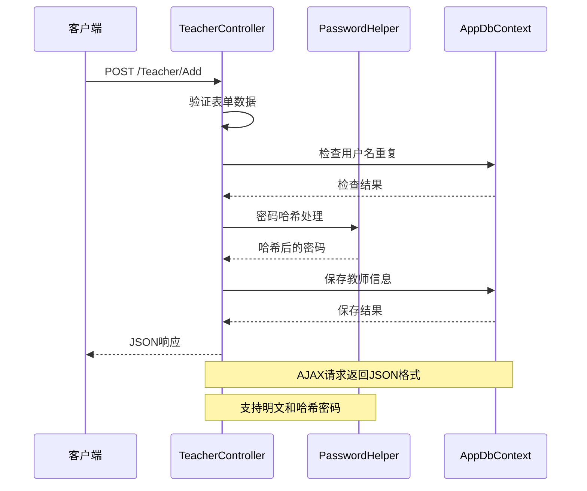

**图表来源**
- [TeacherController.cs:88-135](file://Controllers/TeacherController.cs#L88-L135)
- [PasswordHelper.cs:13-34](file://Services/PasswordHelper.cs#L13-L34)

#### 教师状态管理

系统提供多级状态管理机制：

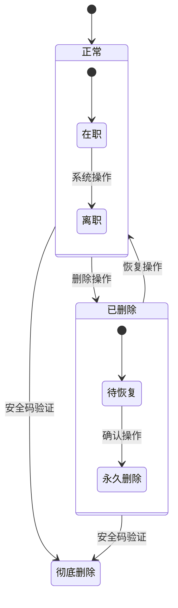

**图表来源**
- [TeacherController.cs:236-281](file://Controllers/TeacherController.cs#L236-L281)

#### 批量导入功能

系统支持两种导入格式：

**CSV导入流程：**
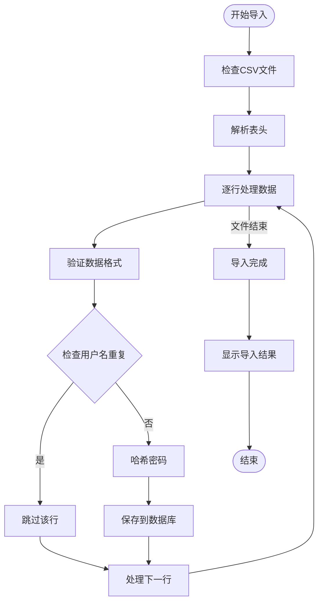

**图表来源**
- [TeacherController.cs:288-359](file://Controllers/TeacherController.cs#L288-L359)

**Excel导入流程：**
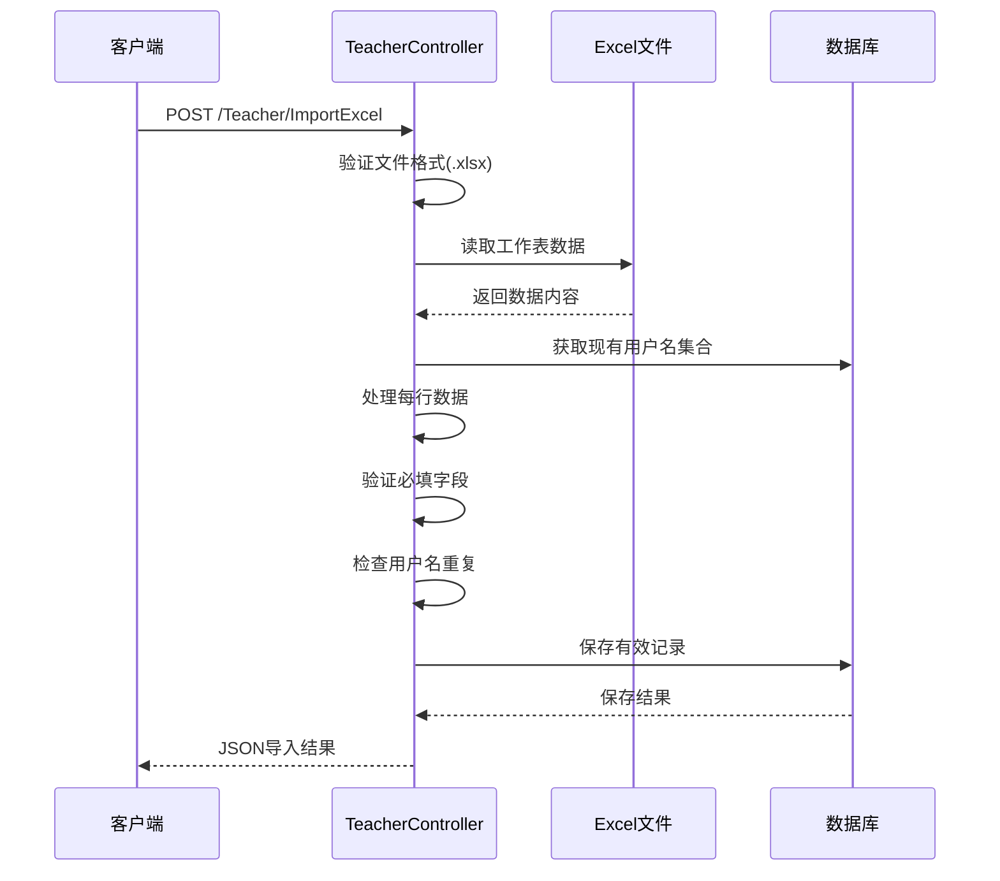

**图表来源**
- [TeacherController.cs:387-474](file://Controllers/TeacherController.cs#L387-L474)

**章节来源**
- [TeacherController.cs:88-135](file://Controllers/TeacherController.cs#L88-L135)
- [TeacherController.cs:236-281](file://Controllers/TeacherController.cs#L236-L281)
- [TeacherController.cs:288-359](file://Controllers/TeacherController.cs#L288-L359)
- [TeacherController.cs:387-474](file://Controllers/TeacherController.cs#L387-L474)

### AJAX异步请求处理

系统广泛使用AJAX技术提升用户体验：

#### 请求处理机制

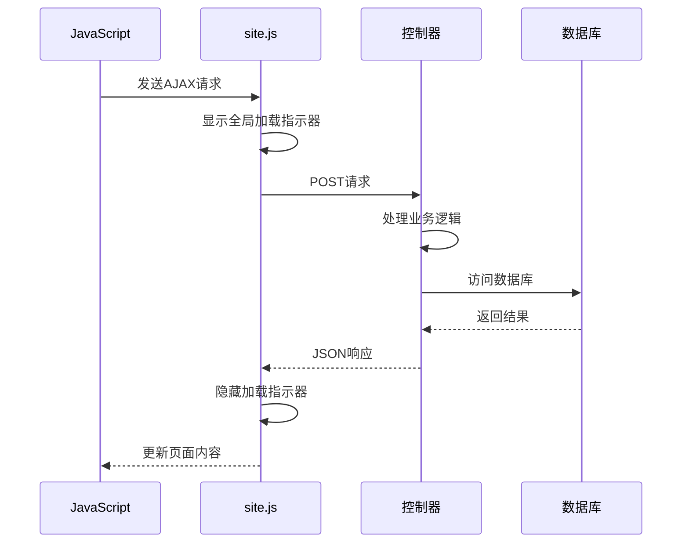

**图表来源**
- [site.js:30-66](file://wwwroot/js/site.js#L30-L66)

#### 错误处理机制

系统实现了多层次的错误处理：

| 错误类型 | 处理方式 | 用户反馈 |
|----------|----------|----------|
| 网络错误 | AJAX fail回调 | 弹出错误提示 |
| 服务器错误 | 404/500状态码 | 显示错误页面 |
| 验证错误 | Model Validation | 表单高亮显示 |
| 业务错误 | JSON success=false | 显示具体错误消息 |

**章节来源**
- [site.js:30-66](file://wwwroot/js/site.js#L30-L66)
- [TeacherController.cs:213-216](file://Controllers/TeacherController.cs#L213-L216)

### 密码安全处理

系统采用ASP.NET Core Identity的PBKDF2算法进行密码哈希：

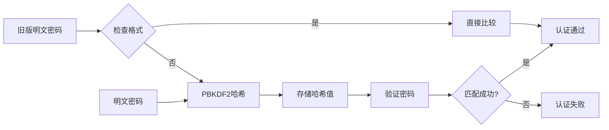

**图表来源**
- [PasswordHelper.cs:13-40](file://Services/PasswordHelper.cs#L13-L40)

**章节来源**
- [PasswordHelper.cs:8-42](file://Services/PasswordHelper.cs#L8-L42)

## 依赖关系分析

### 组件依赖图

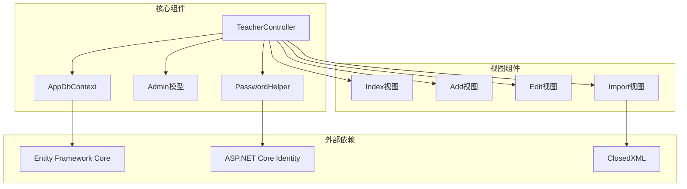

**图表来源**
- [TeacherController.cs:1-8](file://Controllers/TeacherController.cs#L1-L8)
- [PasswordHelper.cs:1](file://Services/PasswordHelper.cs#L1)

### 数据流分析

系统采用双向数据流设计：

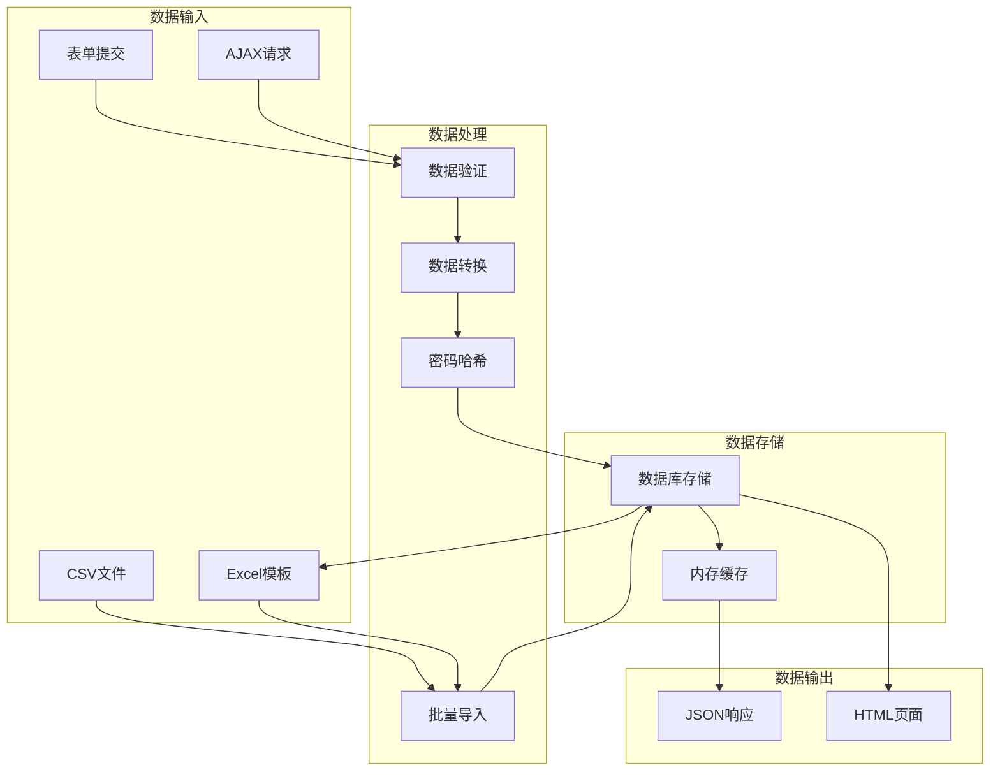

**图表来源**
- [TeacherController.cs:88-135](file://Controllers/TeacherController.cs#L88-L135)
- [TeacherController.cs:288-359](file://Controllers/TeacherController.cs#L288-L359)

**章节来源**
- [TeacherController.cs:1-501](file://Controllers/TeacherController.cs#L1-L501)
- [Models.cs:1-490](file://Models/Models.cs#L1-L490)

## 性能考虑

### 查询优化

系统在查询层面采用了多项优化策略：

1. **分页查询**：Index方法使用Skip/Take实现分页，避免一次性加载大量数据
2. **条件查询**：根据筛选条件动态构建查询语句，减少不必要的数据传输
3. **索引优化**：数据库层面为常用查询字段建立索引

### 缓存策略

- **内存缓存**：使用HashSet缓存现有用户名，提高重复检查效率
- **视图缓存**：静态页面内容缓存，减少服务器压力

### 异步处理

- **异步I/O**：所有数据库操作使用async/await模式
- **异步渲染**：AJAX请求避免页面完全刷新

## 故障排除指南

### 常见问题及解决方案

| 问题类型 | 症状 | 解决方案 |
|----------|------|----------|
| 导入失败 | 文件格式错误 | 确保CSV文件编码为UTF-8，检查文件扩展名 |
| 用户名重复 | 添加失败 | 检查用户名唯一性，修改重复用户名 |
| 密码错误 | 登录失败 | 确认密码长度至少6位，检查大小写 |
| AJAX请求失败 | 页面无响应 | 检查浏览器控制台错误，确认CSRF令牌 |
| Excel导入异常 | 内容解析错误 | 确保Excel文件格式正确，检查必填字段 |

### 调试技巧

1. **浏览器开发者工具**：查看Network标签页中的AJAX请求
2. **服务器日志**：检查Application Insights或Event Viewer
3. **数据库查询**：使用SQL Profiler监控数据库操作

**章节来源**
- [TeacherController.cs:213-216](file://Controllers/TeacherController.cs#L213-L216)
- [site.js:30-66](file://wwwroot/js/site.js#L30-L66)

## 结论

教师信息管理API提供了完整、安全、高效的教职工信息管理解决方案。系统具有以下特点：

**功能完整性**：涵盖了教师信息管理的所有核心需求，包括基础CRUD操作、状态管理、批量导入等。

**安全性保障**：采用PBKDF2密码哈希算法，支持明文和哈希密码兼容，确保数据安全。

**用户体验优化**：通过AJAX异步处理和全局加载指示器，提供流畅的交互体验。

**可维护性**：采用标准的MVC架构和依赖注入模式，便于代码维护和功能扩展。

该系统为学校管理提供了可靠的技术支撑，能够满足现代教育管理的需求。