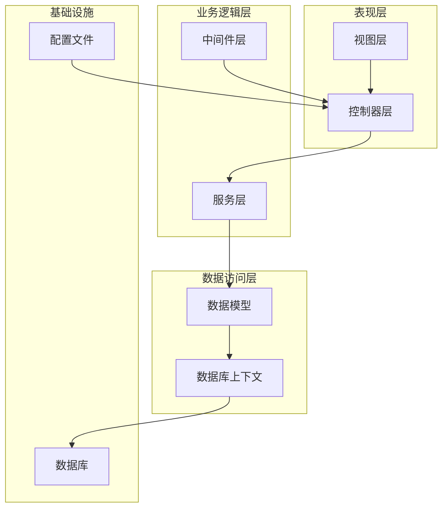
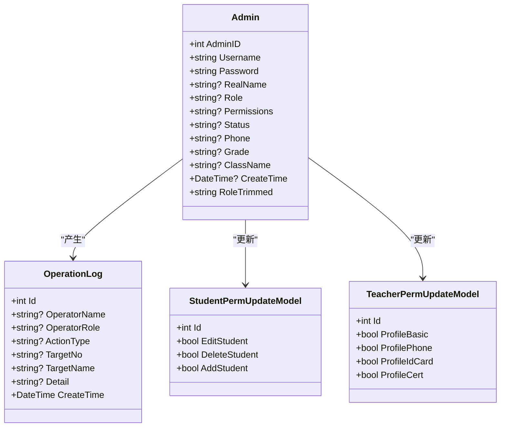
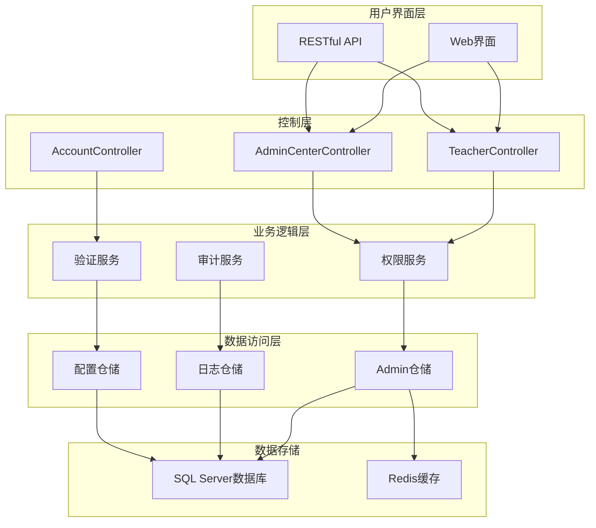
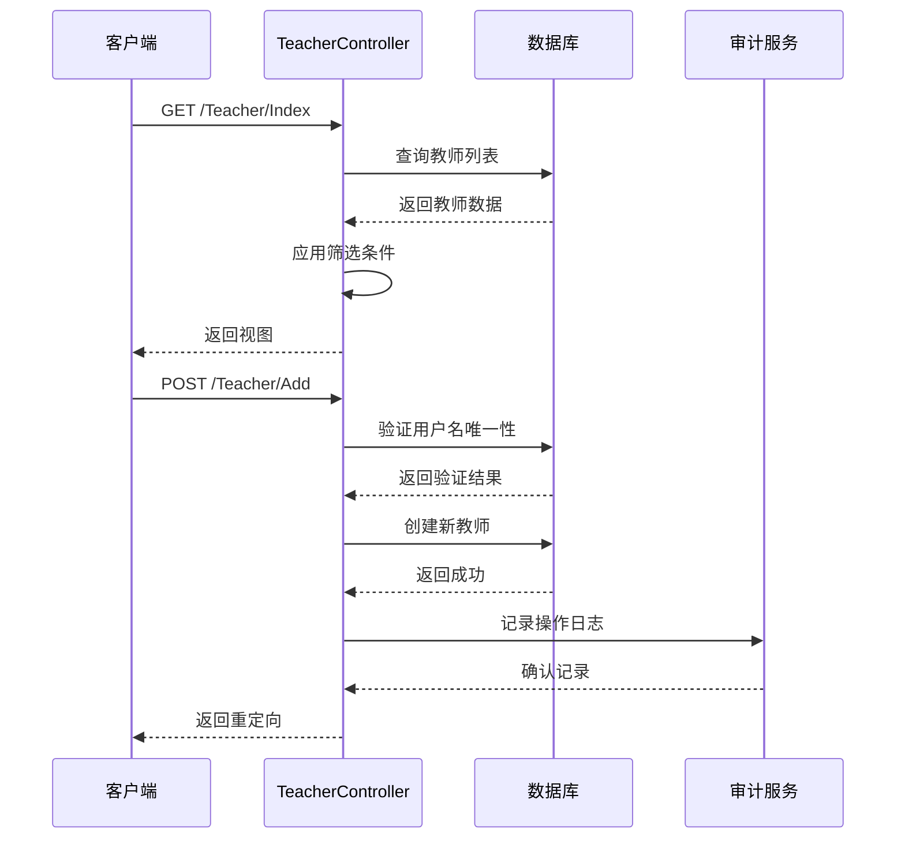
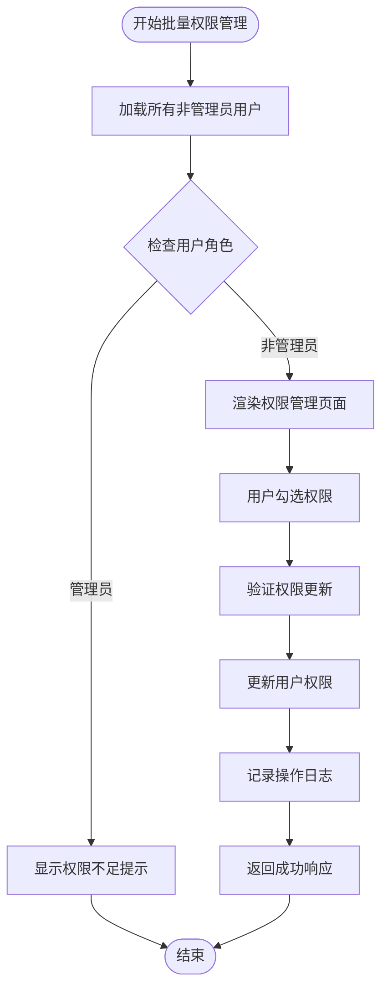
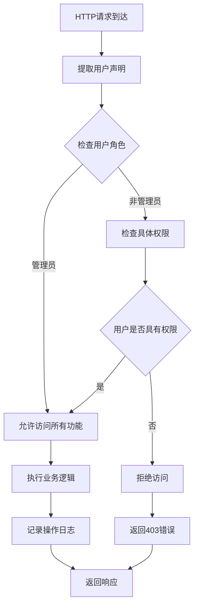
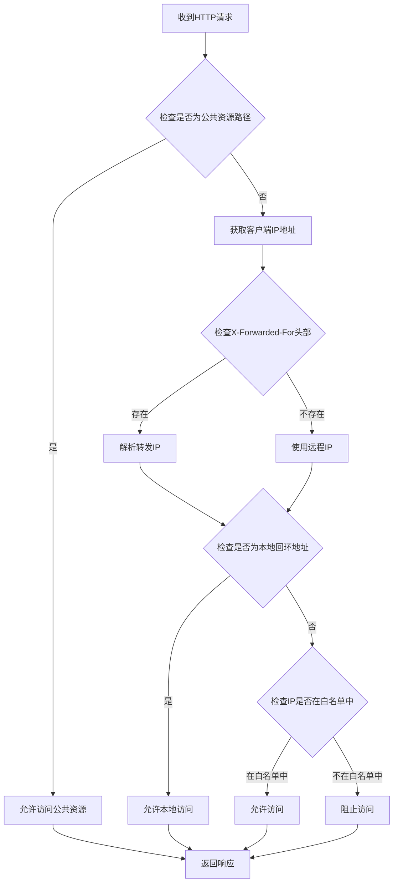
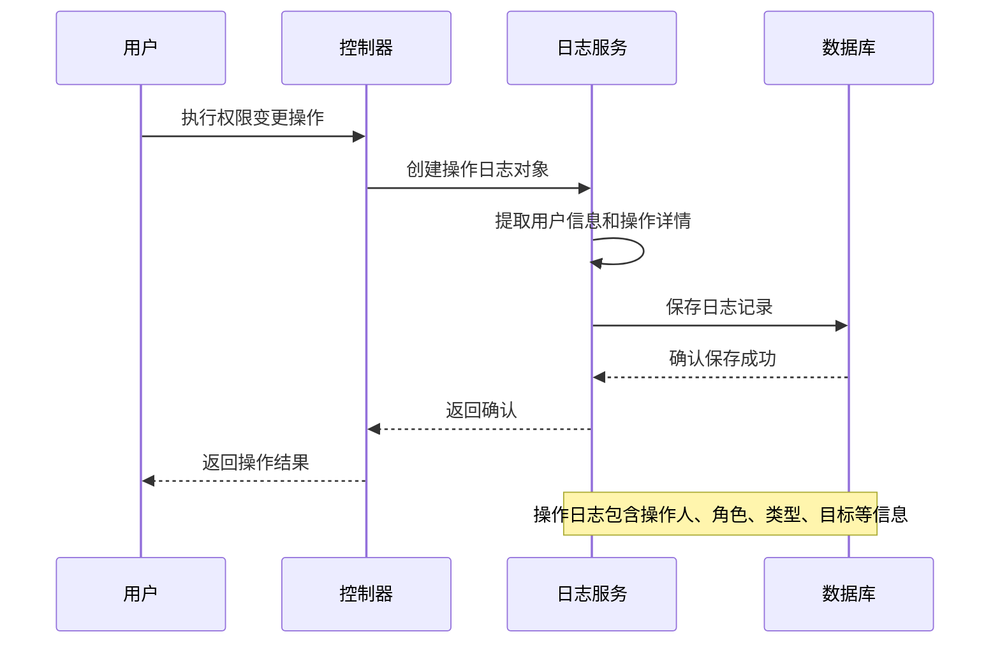
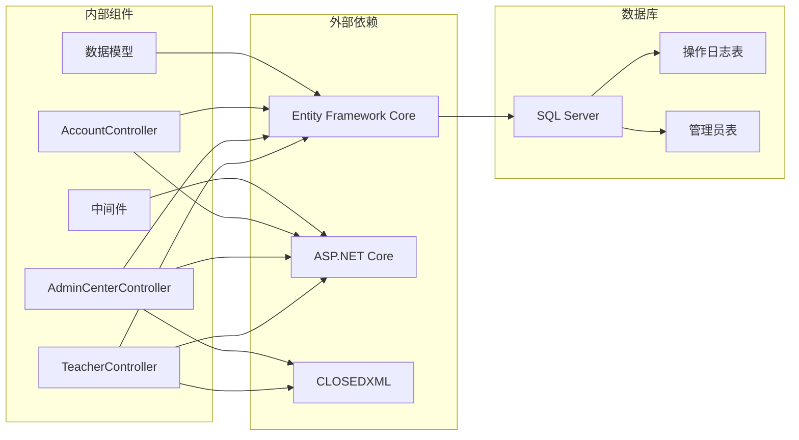

# 教师权限管理API

<cite>
**本文档引用的文件**
- [TeacherController.cs](file://Controllers/TeacherController.cs)
- [AdminCenterController.cs](file://Controllers/AdminCenterController.cs)
- [Models.cs](file://Models/Models.cs)
- [TeacherPermissions.cshtml](file://Views/AdminCenter/TeacherPermissions.cshtml)
- [Permissions.cshtml](file://Views/AdminCenter/Permissions.cshtml)
- [StudentPermissions.cshtml](file://Views/AdminCenter/StudentPermissions.cshtml)
- [OperationLogs.cshtml](file://Views/AdminCenter/OperationLogs.cshtml)
- [Add_Permissions_Field.sql](file://Database/Add_Permissions_Field.sql)
- [Update_Permission_Keys.sql](file://Database/Update_Permission_Keys.sql)
- [IpRestrictionMiddleware.cs](file://Middleware/IpRestrictionMiddleware.cs)
- [AccountController.cs](file://Controllers/AccountController.cs)
</cite>

## 目录
1. [简介](#简介)
2. [项目结构](#项目结构)
3. [核心组件](#核心组件)
4. [架构概览](#架构概览)
5. [详细组件分析](#详细组件分析)
6. [依赖关系分析](#依赖关系分析)
7. [性能考虑](#性能考虑)
8. [故障排除指南](#故障排除指南)
9. [结论](#结论)

## 简介

本项目是一个基于ASP.NET Core的学生管理系统，专门针对教师权限管理进行了深入设计和实现。系统提供了完善的权限管理体系，支持角色分配、权限修改和权限查询功能，能够有效区分不同角色（班主任、科任教师、年级级长）的权限差异和操作范围。

系统采用细粒度的权限控制机制，通过逗号分隔的权限标识字符串实现灵活的权限组合。权限管理不仅包括传统的CRUD操作，还涵盖了个人中心权限控制、批量权限管理和操作日志审计等功能。

## 项目结构

项目采用标准的ASP.NET Core MVC架构，主要分为以下几个层次：

**图表来源**
- [TeacherController.cs:10-20](file://Controllers/TeacherController.cs#L10-L20)
- [AdminCenterController.cs:12-20](file://Controllers/AdminCenterController.cs#L12-L20)

**章节来源**
- [TeacherController.cs:1-501](file://Controllers/TeacherController.cs#L1-L501)
- [AdminCenterController.cs:1-491](file://Controllers/AdminCenterController.cs#L1-L491)

## 核心组件

### 权限模型设计

系统的核心权限管理基于Admin实体类，其中包含了详细的权限字段设计：

**图表来源**
- [Models.cs:6-86](file://Models/Models.cs#L6-L86)
- [Models.cs:236-260](file://Models/Models.cs#L236-L260)
- [Models.cs:475-490](file://Models/Models.cs#L475-L490)

### 权限类型定义

系统实现了两种主要的权限类型：

1. **学生权限**：控制对学生的操作能力
   - `student_edit`：编辑学生信息
   - `student_delete`：删除学生
   - `student_add`：添加学生

2. **个人中心权限**：控制教师个人资料的修改范围
   - `profile_basic`：修改基本信息
   - `profile_phone`：修改手机号
   - `profile_idcard`：修改身份证
   - `profile_cert`：修改证书

**章节来源**
- [Models.cs:46-48](file://Models/Models.cs#L46-L48)
- [Add_Permissions_Field.sql:4-6](file://Database/Add_Permissions_Field.sql#L4-L6)

## 架构概览

系统采用分层架构设计，确保了良好的可维护性和扩展性：

**图表来源**
- [TeacherController.cs:12-20](file://Controllers/TeacherController.cs#L12-L20)
- [AdminCenterController.cs:12-20](file://Controllers/AdminCenterController.cs#L12-L20)
- [AccountController.cs:97-104](file://Controllers/AccountController.cs#L97-L104)

## 详细组件分析

### 教师权限管理控制器

#### 教师管理功能

TeacherController提供了完整的教师生命周期管理：

**图表来源**
- [TeacherController.cs:22-78](file://Controllers/TeacherController.cs#L22-L78)
- [TeacherController.cs:88-135](file://Controllers/TeacherController.cs#L88-L135)

#### 批量权限管理

AdminCenterController实现了精细化的权限批量管理功能：

**图表来源**
- [AdminCenterController.cs:291-337](file://Controllers/AdminCenterController.cs#L291-L337)
- [TeacherPermissions.cshtml:64-74](file://Views/AdminCenter/TeacherPermissions.cshtml#L64-L74)

**章节来源**
- [TeacherController.cs:12-501](file://Controllers/TeacherController.cs#L12-L501)
- [AdminCenterController.cs:291-337](file://Controllers/AdminCenterController.cs#L291-L337)

### 权限验证机制

系统实现了多层次的权限验证机制：

**图表来源**
- [AdminCenterController.cs:34-58](file://Controllers/AdminCenterController.cs#L34-L58)
- [AccountController.cs:97-104](file://Controllers/AccountController.cs#L97-L104)

**章节来源**
- [AdminCenterController.cs:34-151](file://Controllers/AdminCenterController.cs#L34-L151)
- [AccountController.cs:80-125](file://Controllers/AccountController.cs#L80-L125)

### 安全策略实现

#### IP白名单中间件

系统实现了严格的IP访问控制：

**图表来源**
- [IpRestrictionMiddleware.cs:34-63](file://Middleware/IpRestrictionMiddleware.cs#L34-L63)

**章节来源**
- [IpRestrictionMiddleware.cs:1-63](file://Middleware/IpRestrictionMiddleware.cs#L1-L63)

### 权限变更审计功能

系统实现了完整的操作日志记录机制：

**图表来源**
- [TeacherController.cs:476-493](file://Controllers/TeacherController.cs#L476-L493)
- [AdminCenterController.cs:340-376](file://Controllers/AdminCenterController.cs#L340-L376)

**章节来源**
- [TeacherController.cs:476-493](file://Controllers/TeacherController.cs#L476-L493)
- [AdminCenterController.cs:340-427](file://Controllers/AdminCenterController.cs#L340-L427)

## 依赖关系分析

系统各组件之间的依赖关系如下：

**图表来源**
- [TeacherController.cs:1-8](file://Controllers/TeacherController.cs#L1-L8)
- [AdminCenterController.cs:1-8](file://Controllers/AdminCenterController.cs#L1-L8)

**章节来源**
- [TeacherController.cs:1-20](file://Controllers/TeacherController.cs#L1-L20)
- [AdminCenterController.cs:1-20](file://Controllers/AdminCenterController.cs#L1-L20)

## 性能考虑

### 数据库优化策略

1. **索引优化**：为常用查询字段建立适当的索引
2. **查询优化**：使用异步查询方法避免阻塞
3. **连接池管理**：合理配置数据库连接池大小

### 缓存策略

1. **权限缓存**：缓存用户的权限信息减少数据库查询
2. **配置缓存**：缓存系统配置信息
3. **视图缓存**：对静态内容启用缓存

### 并发处理

1. **乐观锁**：使用并发标记防止数据冲突
2. **事务管理**：合理使用事务确保数据一致性
3. **异步编程**：大量使用async/await提高响应性

## 故障排除指南

### 常见问题及解决方案

#### 权限验证失败

**症状**：用户无法访问受保护的功能
**原因**：
- 用户未登录或会话过期
- 用户权限不足
- 权限配置错误

**解决方法**：
1. 检查用户登录状态
2. 验证用户角色和权限设置
3. 确认权限配置正确性

#### 数据库连接问题

**症状**：应用程序无法连接到数据库
**原因**：
- 连接字符串配置错误
- 数据库服务未启动
- 网络连接问题

**解决方法**：
1. 检查连接字符串配置
2. 验证数据库服务状态
3. 测试网络连通性

#### 权限迁移问题

**症状**：权限字段缺失或权限键名不正确
**解决方法**：
1. 运行权限迁移脚本
2. 验证权限字段存在性
3. 更新权限键名映射

**章节来源**
- [Add_Permissions_Field.sql:8-21](file://Database/Add_Permissions_Field.sql#L8-L21)
- [Update_Permission_Keys.sql:10-30](file://Database/Update_Permission_Keys.sql#L10-L30)

## 结论

本教师权限管理API系统提供了全面、灵活且安全的权限管理解决方案。通过细粒度的权限控制、完善的审计功能和严格的安全策略，系统能够有效满足不同角色的权限需求。

系统的主要优势包括：

1. **灵活性**：支持动态权限配置和批量权限管理
2. **安全性**：多层权限验证和完整的操作审计
3. **可扩展性**：模块化设计便于功能扩展
4. **易用性**：直观的用户界面和清晰的操作流程

通过持续的优化和改进，该系统能够为教育机构提供可靠的教师权限管理服务。