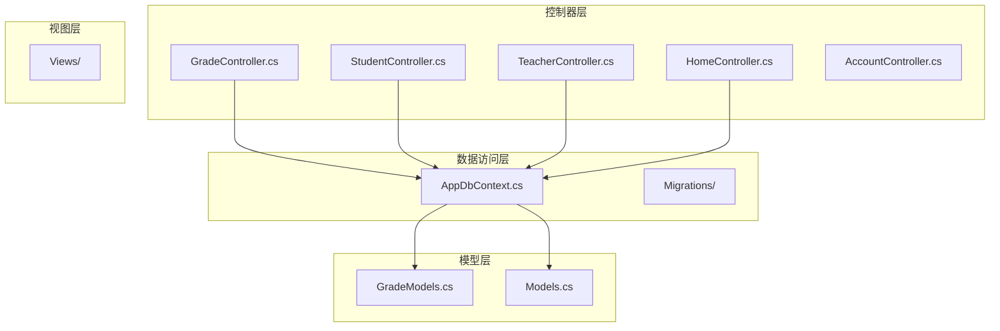
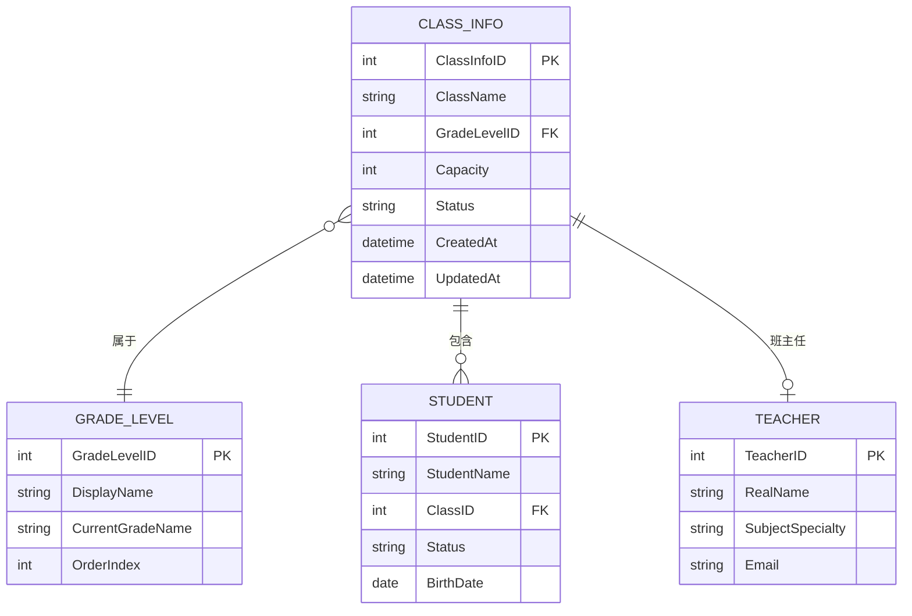
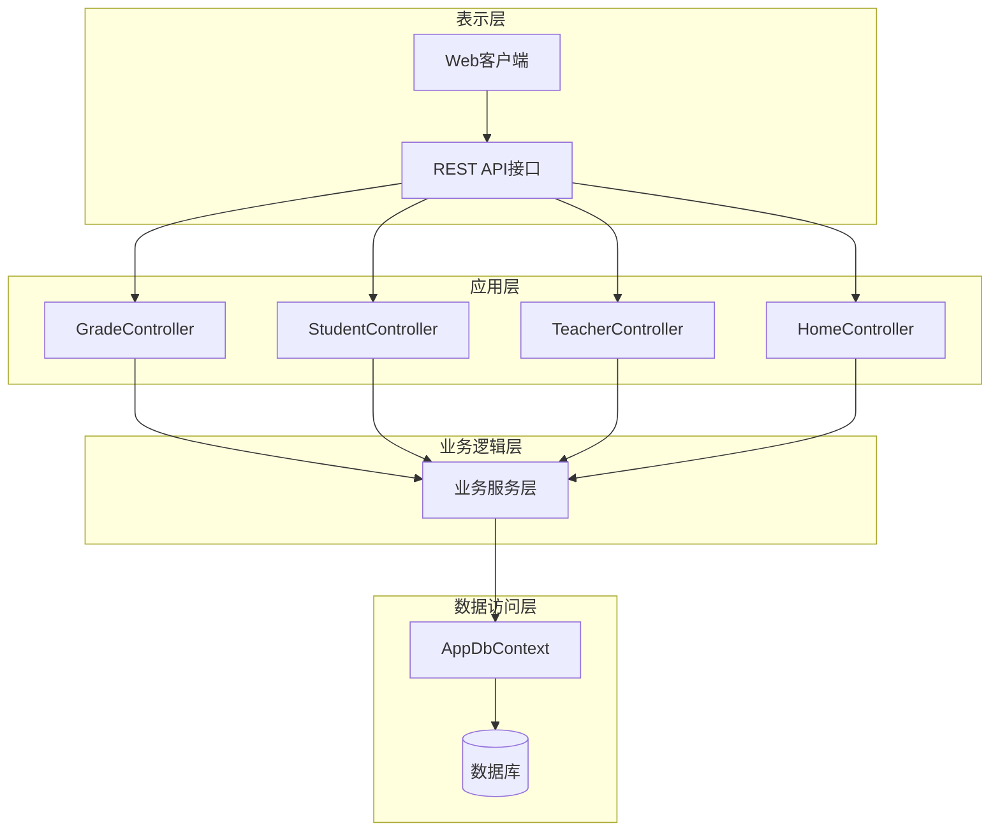
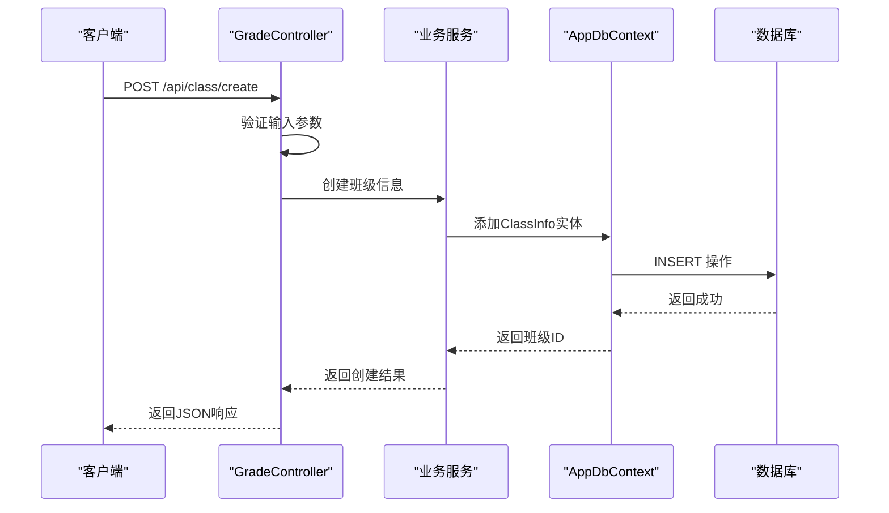
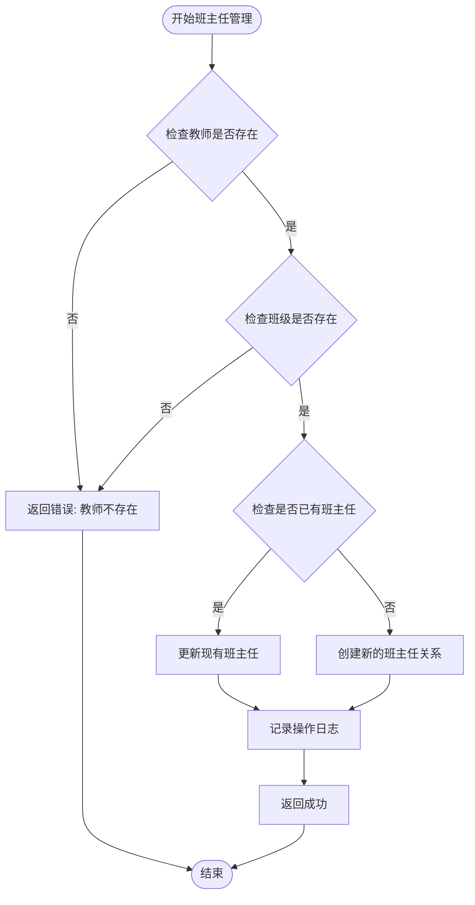
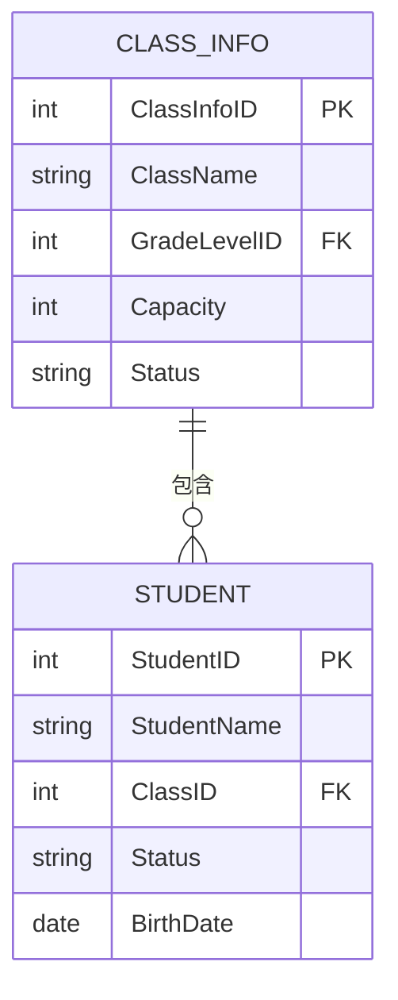
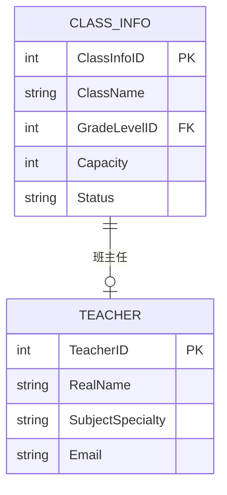
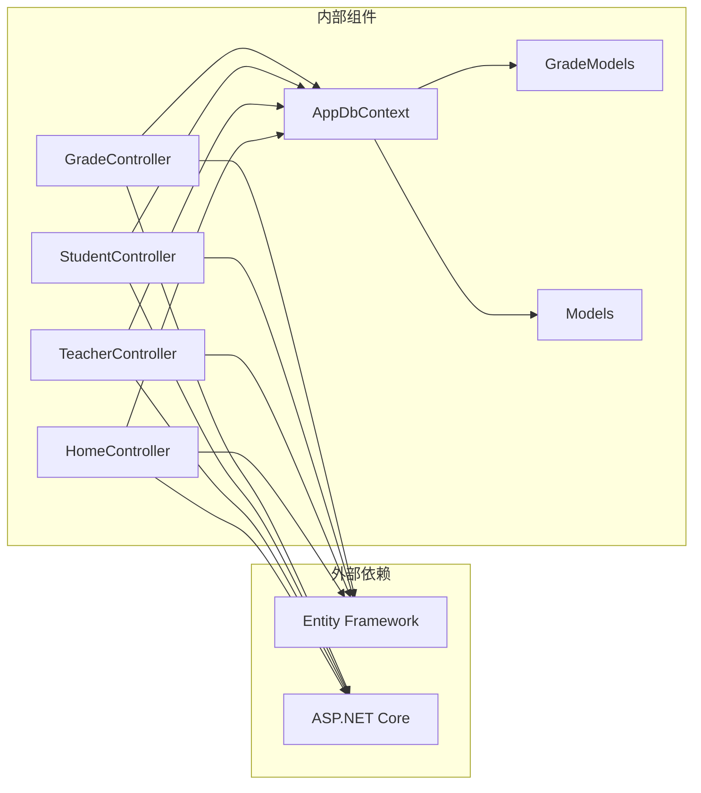
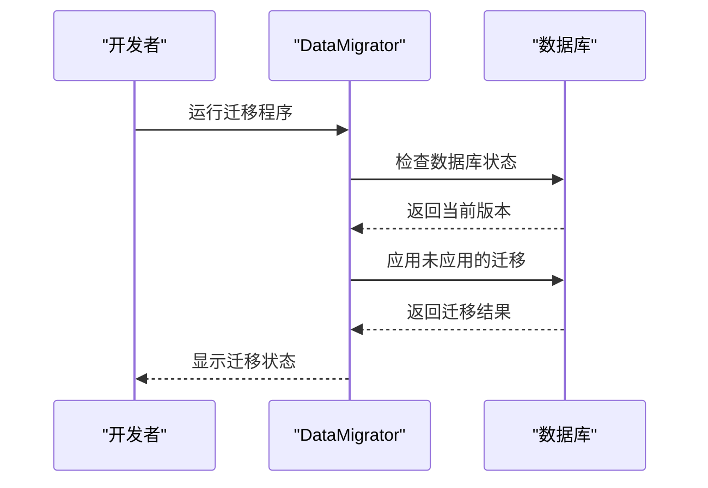

# 班级信息管理API

<cite>
**本文档引用的文件**
- [GradeController.cs](file://Controllers/GradeController.cs)
- [AppDbContext.cs](file://Data/AppDbContext.cs)
- [GradeModels.cs](file://Models/GradeModels.cs)
- [Models.cs](file://Models/Models.cs)
- [StudentController.cs](file://Controllers/StudentController.cs)
- [ScoreController.cs](file://Controllers/ScoreController.cs)
- [HomeController.cs](file://Controllers/HomeController.cs)
- [TeacherController.cs](file://Controllers/TeacherController.cs)
- [20260609075559_InitialCreate.cs](file://Migrations/20260609075559_InitialCreate.cs)
</cite>

## 目录
1. [简介](#简介)
2. [项目结构](#项目结构)
3. [核心组件](#核心组件)
4. [架构概览](#架构概览)
5. [详细组件分析](#详细组件分析)
6. [依赖关系分析](#依赖关系分析)
7. [性能考虑](#性能考虑)
8. [故障排除指南](#故障排除指南)
9. [结论](#结论)

## 简介

本文件为学生管理系统中班级信息管理相关的API接口文档。系统提供了完整的班级生命周期管理功能，包括班级创建、编辑、查询和删除操作。同时支持班级与教师的关联管理，如班主任分配和取消，以及班级统计和状态管理功能。

该系统采用ASP.NET Core框架构建，使用Entity Framework进行数据持久化，通过控制器层提供RESTful API接口，实现了班级信息的完整CRUD操作和业务逻辑处理。

## 项目结构

学生管理系统采用标准的ASP.NET Core项目结构，主要包含以下关键目录：

**图表来源**
- [GradeController.cs:1-50](file://Controllers/GradeController.cs#L1-L50)
- [AppDbContext.cs:1-50](file://Data/AppDbContext.cs#L1-L50)

**章节来源**
- [GradeController.cs:1-50](file://Controllers/GradeController.cs#L1-L50)
- [AppDbContext.cs:1-50](file://Data/AppDbContext.cs#L1-L50)

## 核心组件

### 数据模型架构

系统的核心数据模型围绕班级信息展开，主要包括以下实体：

**图表来源**
- [GradeModels.cs:1-100](file://Models/GradeModels.cs#L1-L100)
- [Models.cs:1-200](file://Models/Models.cs#L1-L200)

### 控制器架构

系统采用分层控制器设计，每个功能模块都有专门的控制器负责：

- **GradeController**: 班级信息管理的核心控制器
- **StudentController**: 学生信息管理，包含班级关联查询
- **TeacherController**: 教师信息管理，包含班级关联
- **HomeController**: 系统首页和仪表板功能
- **ScoreController**: 成绩管理，涉及班级统计

**章节来源**
- [GradeController.cs:27-40](file://Controllers/GradeController.cs#L27-L40)
- [StudentController.cs:1-50](file://Controllers/StudentController.cs#L1-L50)
- [TeacherController.cs:1-50](file://Controllers/TeacherController.cs#L1-L50)

## 架构概览

系统采用经典的三层架构模式，通过控制器-服务-数据访问的层次结构实现业务逻辑分离：

**图表来源**
- [GradeController.cs:27-35](file://Controllers/GradeController.cs#L27-L35)
- [AppDbContext.cs:1-50](file://Data/AppDbContext.cs#L1-L50)

## 详细组件分析

### 班级信息管理核心功能

#### 班级创建接口

GradeController提供了完整的班级创建功能，支持批量创建和单个创建两种方式：

**图表来源**
- [GradeController.cs:1-100](file://Controllers/GradeController.cs#L1-L100)

#### 班级查询接口

系统提供了多种班级查询方式：

1. **班级列表查询**: 支持按年级、状态等条件过滤
2. **班级详情获取**: 包含班级基本信息和关联数据
3. **班级统计查询**: 提供班级人数统计和状态分布

**章节来源**
- [GradeController.cs:269-321](file://Controllers/GradeController.cs#L269-L321)
- [StudentController.cs:72-90](file://Controllers/StudentController.cs#L72-L90)

#### 班主任管理功能

系统实现了完善的班主任管理机制：

**图表来源**
- [GradeController.cs:289-321](file://Controllers/GradeController.cs#L289-L321)

**章节来源**
- [GradeController.cs:270-321](file://Controllers/GradeController.cs#L270-L321)

### 数据模型详细说明

#### 班级信息模型

班级信息模型包含以下关键字段：

| 字段名 | 类型 | 必填 | 描述 | 约束 |
|--------|------|------|------|------|
| ClassInfoID | int | 是 | 班级唯一标识符 | 主键，自增 |
| ClassName | string | 是 | 班级名称 | 非空，长度限制 |
| GradeLevelID | int | 是 | 年级级别ID | 外键关联 |
| Capacity | int | 是 | 班级容量 | 正整数 |
| Status | string | 否 | 班级状态 | 默认Active |
| CreatedAt | datetime | 否 | 创建时间 | 默认当前时间 |
| UpdatedAt | datetime | 否 | 更新时间 | 默认当前时间 |

#### 年级级别模型

| 字段名 | 类型 | 必填 | 描述 | 约束 |
|--------|------|------|------|------|
| GradeLevelID | int | 是 | 年级级别ID | 主键，自增 |
| DisplayName | string | 是 | 显示名称 | 非空 |
| CurrentGradeName | string | 是 | 当前年级名称 | 非空 |
| OrderIndex | int | 是 | 排序索引 | 整数 |

**章节来源**
- [GradeModels.cs:1-100](file://Models/GradeModels.cs#L1-L100)
- [Models.cs:1-200](file://Models/Models.cs#L1-L200)

### 关联关系和数据完整性

#### 班级与学生关联

班级与学生之间存在一对多的关联关系：

**图表来源**
- [StudentController.cs:72-90](file://Controllers/StudentController.cs#L72-L90)

#### 班级与教师关联

班级与教师之间存在多对一的关联关系，用于管理班主任：

**图表来源**
- [GradeController.cs:270-321](file://Controllers/GradeController.cs#L270-L321)

**章节来源**
- [StudentController.cs:181-190](file://Controllers/StudentController.cs#L181-L190)
- [ScoreController.cs:141-146](file://Controllers/ScoreController.cs#L141-L146)

## 依赖关系分析

### 组件间依赖关系

系统各组件之间的依赖关系如下：

**图表来源**
- [GradeController.cs:31-35](file://Controllers/GradeController.cs#L31-L35)
- [AppDbContext.cs:1-50](file://Data/AppDbContext.cs#L1-L50)

### 数据库迁移和初始化

系统使用Entity Framework Migrations进行数据库版本管理：

**图表来源**
- [20260609075559_InitialCreate.cs:1-50](file://Migrations/20260609075559_InitialCreate.cs#L1-L50)

**章节来源**
- [20260609075559_InitialCreate.cs:1-100](file://Migrations/20260609075559_InitialCreate.cs#L1-L100)

## 性能考虑

### 查询优化策略

1. **延迟加载**: 使用Include方法按需加载关联数据
2. **批量操作**: 支持批量创建和更新操作
3. **索引优化**: 对常用查询字段建立数据库索引
4. **缓存策略**: 对静态数据和频繁查询结果进行缓存

### 数据访问优化

- 使用异步数据访问方法避免阻塞
- 实施适当的连接池配置
- 优化复杂查询的执行计划

## 故障排除指南

### 常见问题和解决方案

#### 班级创建失败

**问题症状**: 创建班级时返回错误

**可能原因**:
1. 班级名称重复
2. 年级级别不存在
3. 班级容量超出限制

**解决步骤**:
1. 验证输入参数的有效性
2. 检查年级级别的存在性
3. 确认班级容量设置合理

#### 班主任分配异常

**问题症状**: 班主任分配后无法正常显示

**可能原因**:
1. 教师ID无效
2. 班级ID无效
3. 数据库事务未提交

**解决步骤**:
1. 验证教师和班级的存在性
2. 检查数据库连接状态
3. 确认事务正确提交

**章节来源**
- [GradeController.cs:289-321](file://Controllers/GradeController.cs#L289-L321)

## 结论

学生管理系统的班级信息管理API提供了完整的班级生命周期管理功能。通过清晰的分层架构设计和完善的业务逻辑实现，系统能够有效管理班级信息、教师关联和学生统计等功能。

系统的主要优势包括：
- 完整的CRUD操作支持
- 强大的查询和过滤能力
- 完善的数据验证和约束
- 良好的扩展性和维护性
- 详细的日志和审计功能

未来可以考虑的功能增强包括：更灵活的权限控制、更丰富的统计报表、移动端API支持等。