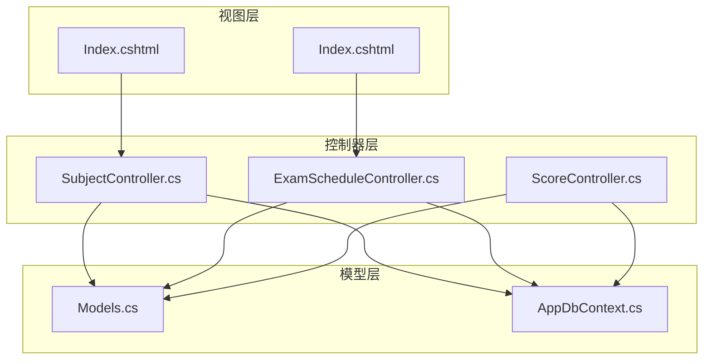
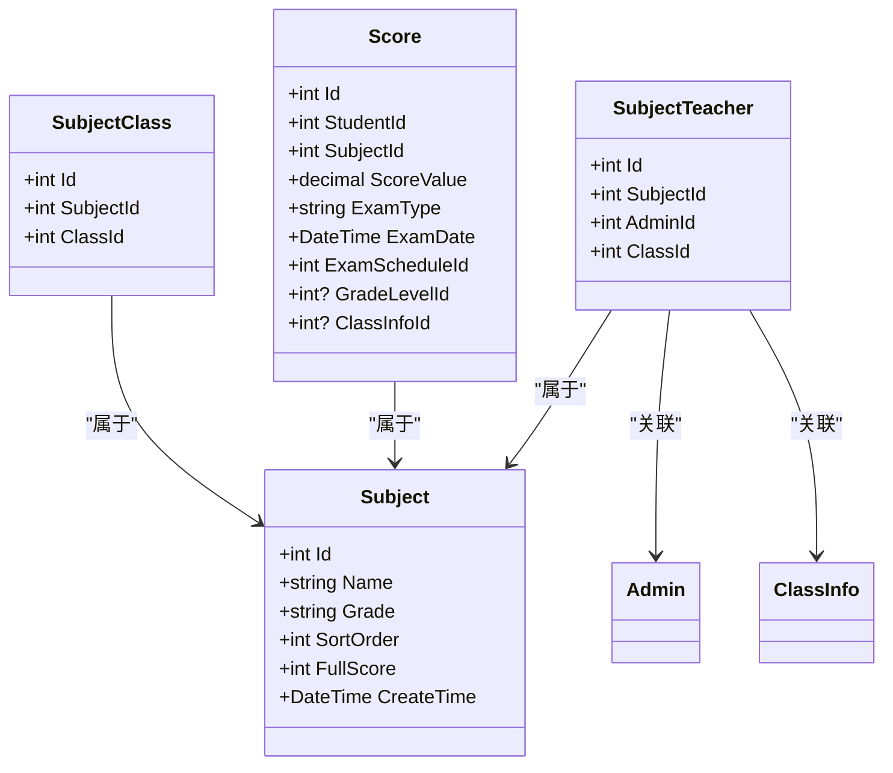
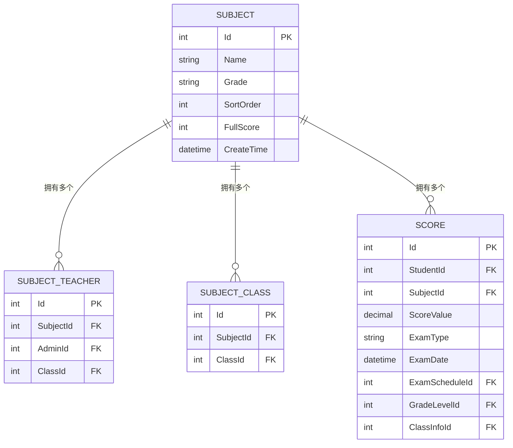
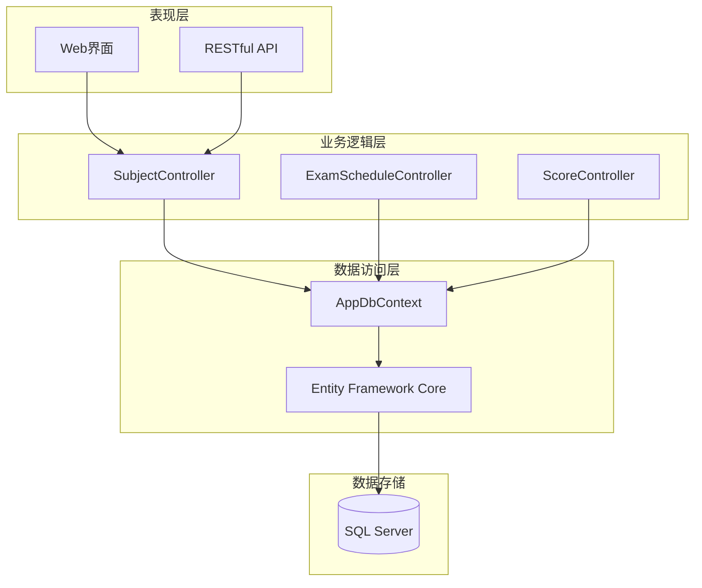
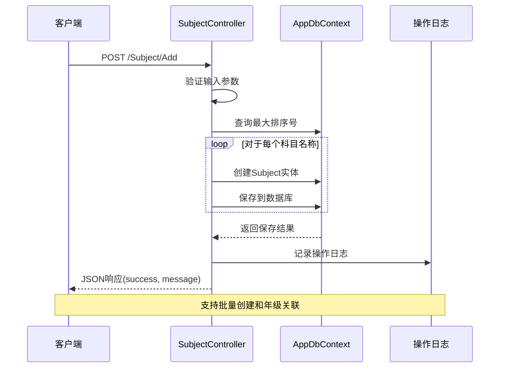
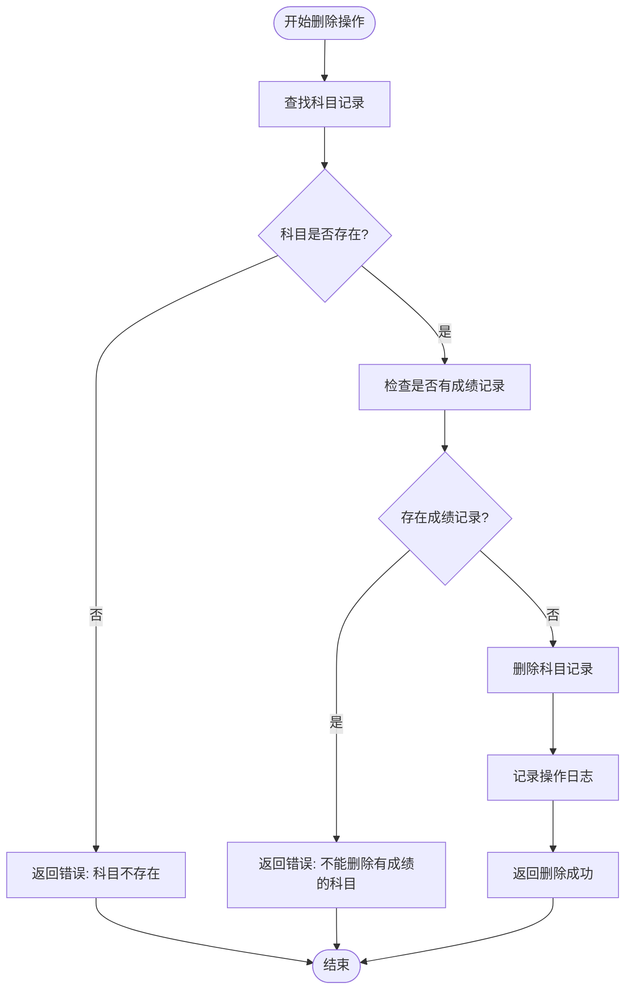
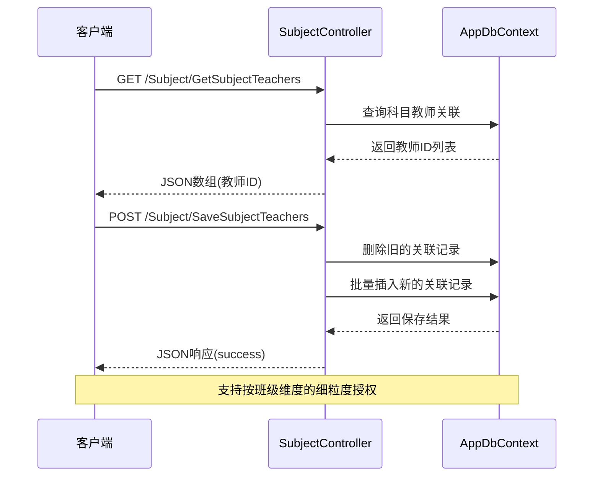
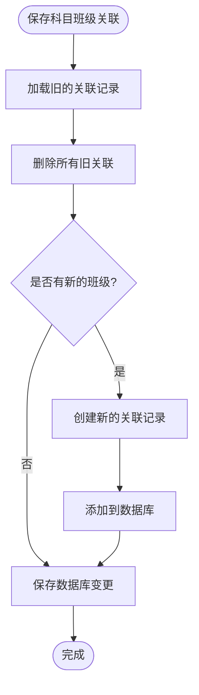
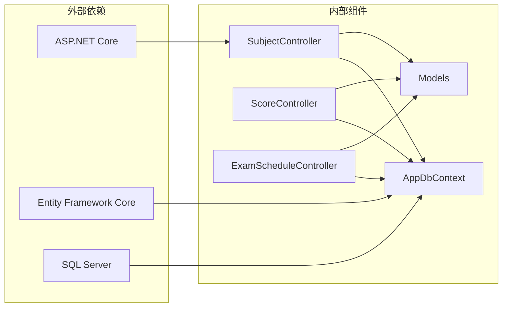

# 科目管理API

<cite>
**本文档引用的文件**
- [SubjectController.cs](file://Controllers/SubjectController.cs)
- [Models.cs](file://Models/Models.cs)
- [AppDbContext.cs](file://Data/AppDbContext.cs)
- [Index.cshtml](file://Views/Subject/Index.cshtml)
- [ExamScheduleController.cs](file://Controllers/ExamScheduleController.cs)
- [Index.cshtml](file://Views/ExamSchedule/Index.cshtml)
- [ScoreController.cs](file://Controllers/ScoreController.cs)
</cite>

## 目录
1. [简介](#简介)
2. [项目结构](#项目结构)
3. [核心组件](#核心组件)
4. [架构概览](#架构概览)
5. [详细组件分析](#详细组件分析)
6. [依赖关系分析](#依赖关系分析)
7. [性能考虑](#性能考虑)
8. [故障排除指南](#故障排除指南)
9. [结论](#结论)

## 简介

科目管理系统是学生信息管理平台中的核心模块，负责维护和管理学校的所有学科科目信息。该系统提供了完整的科目生命周期管理，包括科目创建、编辑、删除和查询功能，同时集成了教师任课管理和科目班级关联管理。

系统采用基于角色的权限控制机制，只有具备管理员角色的用户才能进行科目管理操作。所有操作都会被记录到操作日志中，确保系统的可追溯性和安全性。

## 项目结构

科目管理功能主要分布在以下文件中：

**图表来源**
- [SubjectController.cs:1-351](file://Controllers/SubjectController.cs#L1-L351)
- [Models.cs:295-395](file://Models/Models.cs#L295-L395)
- [AppDbContext.cs:20-29](file://Data/AppDbContext.cs#L20-L29)

**章节来源**
- [SubjectController.cs:11-61](file://Controllers/SubjectController.cs#L11-L61)
- [Models.cs:295-395](file://Models/Models.cs#L295-L395)
- [AppDbContext.cs:31-310](file://Data/AppDbContext.cs#L31-L310)

## 核心组件

### 科目实体模型

科目系统的核心数据结构由以下关键实体组成：

**图表来源**
- [Models.cs:295-395](file://Models/Models.cs#L295-L395)

### 数据库关系映射

系统使用Entity Framework Core进行数据库操作，建立了完善的实体关系映射：

**图表来源**
- [AppDbContext.cs:174-203](file://Data/AppDbContext.cs#L174-L203)
- [AppDbContext.cs:205-225](file://Data/AppDbContext.cs#L205-L225)

**章节来源**
- [Models.cs:295-395](file://Models/Models.cs#L295-L395)
- [AppDbContext.cs:174-225](file://Data/AppDbContext.cs#L174-L225)

## 架构概览

科目管理系统的整体架构采用经典的三层架构设计：

**图表来源**
- [SubjectController.cs:12-19](file://Controllers/SubjectController.cs#L12-L19)
- [AppDbContext.cs:6-8](file://Data/AppDbContext.cs#L6-L8)

系统采用基于角色的访问控制(RBAC)，通过ASP.NET Core的身份验证和授权机制实现权限管理。

## 详细组件分析

### 科目CRUD操作接口

#### 科目创建接口

系统支持批量创建科目，可以根据指定的年级生成对应的科目记录：

**图表来源**
- [SubjectController.cs:63-109](file://Controllers/SubjectController.cs#L63-L109)

#### 科目编辑接口

科目编辑接口支持对科目名称、适用年级、排序顺序和满分设置进行更新：

**章节来源**
- [SubjectController.cs:111-125](file://Controllers/SubjectController.cs#L111-L125)

#### 科目删除接口

删除操作包含完整性检查，确保科目没有关联的成绩记录：

**图表来源**
- [SubjectController.cs:127-141](file://Controllers/SubjectController.cs#L127-L141)

### 教师任课管理

#### 教师授权接口

系统实现了灵活的教师任课授权机制，支持按科目和班级维度进行授权：

**图表来源**
- [SubjectController.cs:252-289](file://Controllers/SubjectController.cs#L252-L289)

#### 教师列表查询

系统提供教师查询接口，支持获取所有具有教学权限的教师信息：

**章节来源**
- [SubjectController.cs:240-250](file://Controllers/SubjectController.cs#L240-L250)

### 科目班级关联管理

#### 班级关联接口

系统支持将科目与特定班级建立关联关系：

**图表来源**
- [SubjectController.cs:315-332](file://Controllers/SubjectController.cs#L315-L332)

#### 年级班级查询

系统提供根据年级查询对应班级的功能：

**章节来源**
- [SubjectController.cs:291-302](file://Controllers/SubjectController.cs#L291-L302)

### 数据一致性保证

#### 成绩完整性检查

系统在删除科目前会检查是否存在关联的成绩记录，确保数据完整性：

**章节来源**
- [SubjectController.cs:127-141](file://Controllers/SubjectController.cs#L127-L141)

#### 唯一性约束

数据库层面设置了多种唯一性约束：

**章节来源**
- [AppDbContext.cs:194](file://Data/AppDbContext.cs#L194)
- [AppDbContext.cs:202](file://Data/AppDbContext.cs#L202)
- [AppDbContext.cs:224](file://Data/AppDbContext.cs#L224)

## 依赖关系分析

### 组件间依赖关系

**图表来源**
- [SubjectController.cs:14-19](file://Controllers/SubjectController.cs#L14-L19)
- [AppDbContext.cs:10-29](file://Data/AppDbContext.cs#L10-L29)

### 数据流分析

系统的关键数据流包括：

1. **科目管理数据流**: 用户操作 → 控制器 → 数据库 → 视图
2. **教师授权数据流**: 教师查询 → 授权管理 → 关联存储
3. **成绩关联数据流**: 科目信息 → 成绩计算 → 成绩存储

**章节来源**
- [SubjectController.cs:21-61](file://Controllers/SubjectController.cs#L21-L61)
- [Models.cs:314-358](file://Models/Models.cs#L314-L358)

## 性能考虑

### 查询优化策略

1. **索引优化**: 关键查询字段建立了适当的索引
2. **批量操作**: 支持批量创建和批量删除操作
3. **延迟加载**: 使用异步查询避免阻塞

### 缓存策略

系统目前采用即时查询策略，对于频繁访问的静态数据可以考虑引入缓存机制。

### 数据库连接管理

使用Entity Framework Core的连接池管理，确保数据库连接的有效利用。

## 故障排除指南

### 常见问题及解决方案

#### 权限相关问题
- **问题**: 无法访问科目管理功能
- **原因**: 用户角色不是管理员
- **解决**: 确保用户具有管理员角色

#### 数据完整性错误
- **问题**: 删除科目时报错"该科目已有成绩记录"
- **原因**: 科目关联了成绩数据
- **解决**: 先删除或转移相关成绩记录

#### 数据库迁移问题
- **问题**: 新增字段后出现异常
- **解决**: 使用内置的迁移接口进行数据库升级

**章节来源**
- [SubjectController.cs:127-141](file://Controllers/SubjectController.cs#L127-L141)
- [SubjectController.cs:146-211](file://Controllers/SubjectController.cs#L146-L211)

## 结论

科目管理系统提供了完整的学科管理功能，包括：

1. **完整的CRUD操作**: 支持科目的创建、编辑、删除和查询
2. **灵活的授权机制**: 支持按科目和班级维度的教师授权
3. **数据完整性保证**: 通过外键约束和业务规则确保数据一致性
4. **权限控制**: 基于角色的访问控制确保系统安全
5. **操作审计**: 完整的操作日志记录便于追踪和审计

系统采用现代化的架构设计，具有良好的扩展性和维护性，能够满足学校教务管理的实际需求。