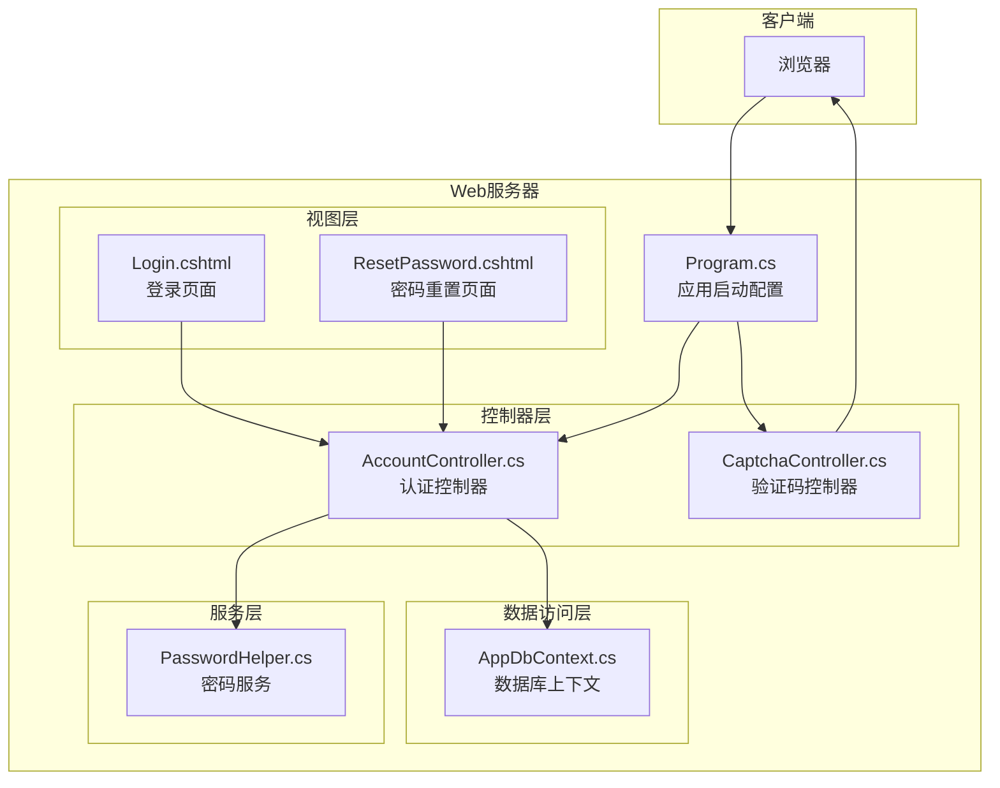
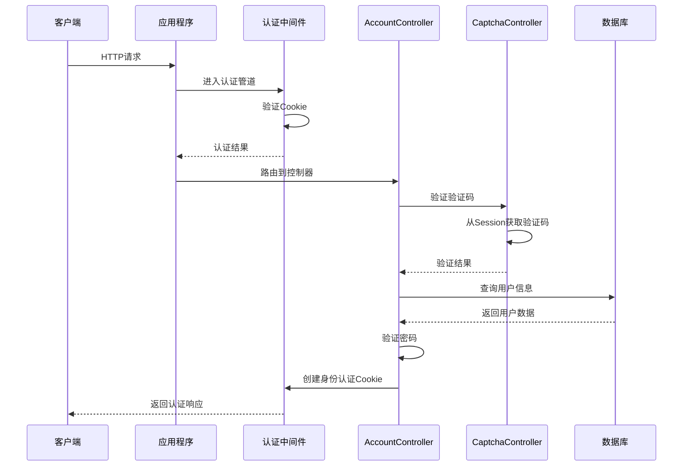
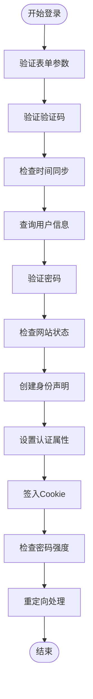
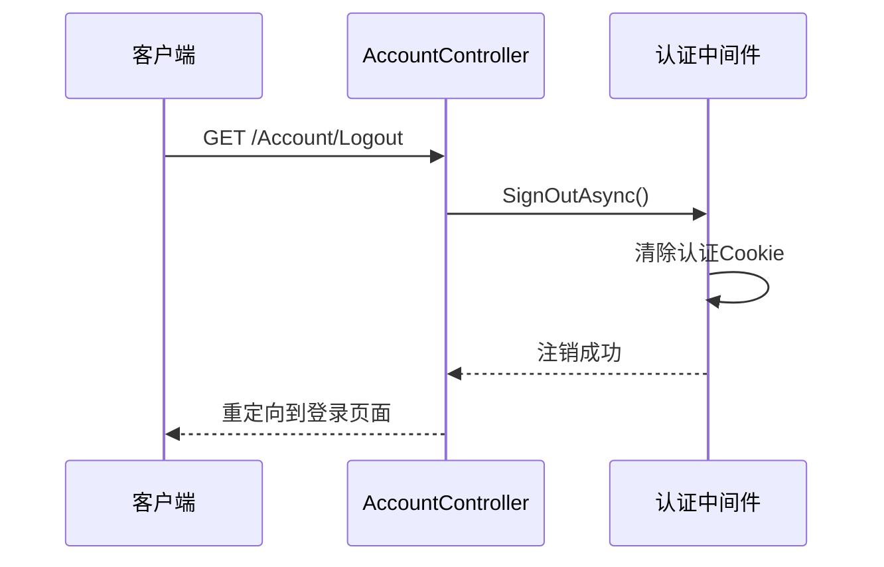
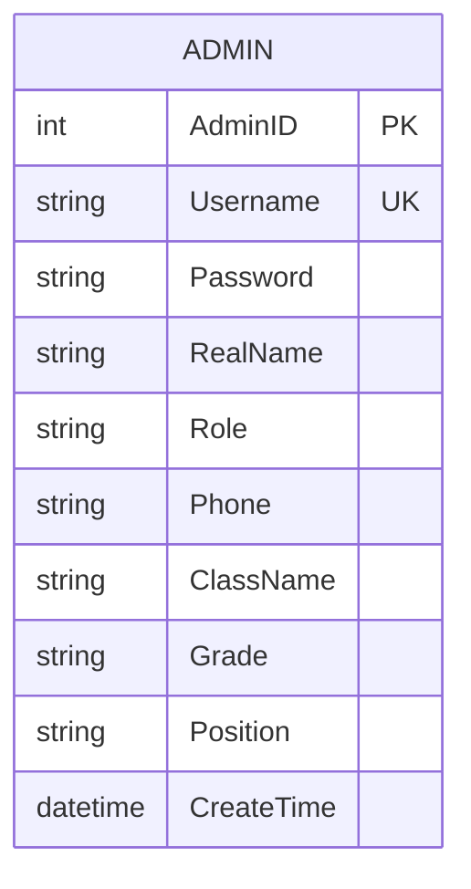
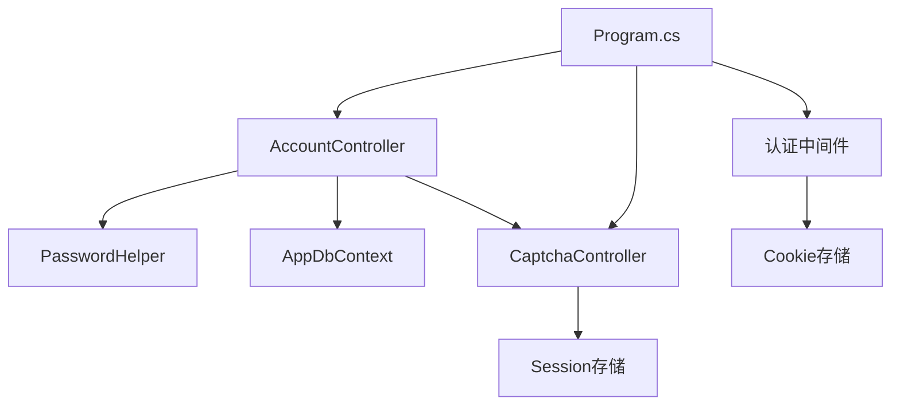

# 用户认证API

<cite>
**本文档引用的文件**
- [Program.cs](file://Program.cs)
- [AccountController.cs](file://Controllers/AccountController.cs)
- [CaptchaController.cs](file://Controllers/CaptchaController.cs)
- [PasswordHelper.cs](file://Services/PasswordHelper.cs)
- [AppDbContext.cs](file://Data/AppDbContext.cs)
- [Models.cs](file://Models/Models.cs)
- [Login.cshtml](file://Views/Account/Login.cshtml)
- [ResetPassword.cshtml](file://Views/Account/ResetPassword.cshtml)
- [appsettings.json](file://appsettings.json)
</cite>

## 目录
1. [简介](#简介)
2. [项目结构](#项目结构)
3. [核心组件](#核心组件)
4. [架构概览](#架构概览)
5. [详细组件分析](#详细组件分析)
6. [依赖关系分析](#依赖关系分析)
7. [性能考虑](#性能考虑)
8. [故障排除指南](#故障排除指南)
9. [结论](#结论)

## 简介
本文件详细记录了学生管理系统中的用户认证相关API接口，包括登录、注销、密码重置等功能。系统采用基于Cookie的身份认证机制，结合验证码验证、密码哈希和会话管理策略，确保系统的安全性与可用性。

## 项目结构
认证功能主要分布在以下模块：
- 控制器层：AccountController负责认证业务逻辑，CaptchaController负责验证码生成与验证
- 服务层：PasswordHelper提供密码哈希与验证功能
- 数据访问层：AppDbContext管理数据库连接与实体映射
- 视图层：Login.cshtml和ResetPassword.cshtml提供用户界面
- 配置层：Program.cs配置认证中间件，appsettings.json提供系统配置



**图表来源**
- [Program.cs:1-123](file://Program.cs#L1-L123)
- [AccountController.cs:15-261](file://Controllers/AccountController.cs#L15-L261)
- [CaptchaController.cs:5-96](file://Controllers/CaptchaController.cs#L5-L96)
- [PasswordHelper.cs:8-42](file://Services/PasswordHelper.cs#L8-L42)
- [AppDbContext.cs:6-295](file://Data/AppDbContext.cs#L6-L295)

**章节来源**
- [Program.cs:1-123](file://Program.cs#L1-L123)
- [AccountController.cs:15-261](file://Controllers/AccountController.cs#L15-L261)
- [CaptchaController.cs:5-96](file://Controllers/CaptchaController.cs#L5-L96)

## 核心组件

### 认证控制器(AccountController)
AccountController是认证系统的核心控制器，负责处理用户登录、注销、密码重置等操作。它实现了Claims-Based身份认证，支持会话持久化和滑动过期。

### 验证码控制器(CaptchaController)
CaptchaController专门处理图形验证码的生成与验证，使用Session存储验证码，防止重复使用。

### 密码服务(PasswordHelper)
PasswordHelper封装了ASP.NET Core Identity的密码哈希算法，支持新旧密码格式的兼容验证。

### 数据上下文(AppDbContext)
AppDbContext管理Admin实体的数据访问，包含用户认证所需的所有字段。

**章节来源**
- [AccountController.cs:15-261](file://Controllers/AccountController.cs#L15-L261)
- [CaptchaController.cs:5-96](file://Controllers/CaptchaController.cs#L5-L96)
- [PasswordHelper.cs:8-42](file://Services/PasswordHelper.cs#L8-L42)
- [AppDbContext.cs:6-295](file://Data/AppDbContext.cs#L6-L295)

## 架构概览

系统采用分层架构设计，认证流程通过中间件管道传递，确保请求在进入业务逻辑前完成身份验证。



**图表来源**
- [Program.cs:23-32](file://Program.cs#L23-L32)
- [AccountController.cs:50-125](file://Controllers/AccountController.cs#L50-L125)
- [CaptchaController.cs:85-94](file://Controllers/CaptchaController.cs#L85-L94)

## 详细组件分析

### 登录接口

#### HTTP接口规范
- **方法**: POST
- **URL**: `/Account/Login`
- **内容类型**: `application/x-www-form-urlencoded`
- **认证**: 无需认证

#### 请求参数
| 参数名 | 类型 | 必填 | 描述 | 示例 |
|--------|------|------|------|------|
| Username | string | 是 | 用户名 | admin |
| Password | string | 是 | 密码 | password123 |
| RememberMe | boolean | 否 | 是否记住登录 | true/false |
| CaptchaCode | string | 是 | 验证码 | 1234 |

#### 响应格式
- **成功**: 重定向到主页 (`/Home/Index`)
- **失败**: 返回登录页面并包含错误消息

#### 登录流程


**图表来源**
- [AccountController.cs:50-125](file://Controllers/AccountController.cs#L50-L125)

#### Cookie认证机制
系统使用ASP.NET Core的Cookie认证方案，配置如下：
- **登录路径**: `/Account/Login`
- **登出路径**: `/Account/Logout`
- **访问被拒绝路径**: `/Home/Error?statusCode=403`
- **会话过期时间**: 15分钟
- **滑动过期**: 启用

#### 会话管理策略
- **短期会话**: 默认15分钟过期
- **持久会话**: 记住我选项可延长至2小时
- **滑动过期**: 活跃期间自动延长有效期
- **HttpOnly Cookie**: 防止JavaScript访问

**章节来源**
- [AccountController.cs:50-125](file://Controllers/AccountController.cs#L50-L125)
- [Program.cs:23-32](file://Program.cs#L23-L32)

### 注销接口

#### HTTP接口规范
- **方法**: GET/POST
- **URL**: `/Account/Logout`
- **认证**: 需要认证

#### 响应格式
- **成功**: 重定向到登录页面 (`/Account/Login`)

#### 注销流程


**图表来源**
- [AccountController.cs:175-179](file://Controllers/AccountController.cs#L175-L179)

**章节来源**
- [AccountController.cs:175-179](file://Controllers/AccountController.cs#L175-L179)

### 密码重置接口

#### 强制密码重置
- **方法**: GET/POST
- **URL**: `/Account/ResetPassword`
- **认证**: 需要认证

##### 请求参数
| 参数名 | 类型 | 必填 | 描述 | 示例 |
|--------|------|------|------|------|
| oldPassword | string | 是 | 原密码 | oldPass123 |
| newPassword | string | 是 | 新密码 | NewPass123 |
| confirmPassword | string | 是 | 确认新密码 | NewPass123 |

##### 密码规则
- 至少8位字符
- 必须包含字母(a-z, A-Z)
- 必须包含数字(0-9)
- 新密码与确认密码必须一致

#### 主动密码修改
- **方法**: POST
- **URL**: `/Account/ChangePassword`
- **内容类型**: `application/json`
- **认证**: 需要认证

##### 请求参数
| 参数名 | 类型 | 必填 | 描述 |
|--------|------|------|------|
| oldPassword | string | 是 | 原密码 |
| newPassword | string | 是 | 新密码 |

##### 响应格式
```json
{
  "success": true,
  "message": "密码修改成功"
}
```

**章节来源**
- [AccountController.cs:127-203](file://Controllers/AccountController.cs#L127-L203)
- [PasswordHelper.cs:12-40](file://Services/PasswordHelper.cs#L12-L40)

### 验证码接口

#### HTTP接口规范
- **方法**: GET
- **URL**: `/Captcha/Index`
- **内容类型**: `image/svg+xml`

#### 响应格式
- **成功**: SVG格式的验证码图像
- **缓存控制**: `no-store`

#### 验证码验证
- **方法**: 静态方法调用
- **存储**: Session中存储4位数字验证码
- **验证后处理**: 验证后立即清除，防止重复使用

**章节来源**
- [CaptchaController.cs:12-94](file://Controllers/CaptchaController.cs#L12-L94)

### 数据模型

#### Admin实体


**图表来源**
- [AppDbContext.cs:34-48](file://Data/AppDbContext.cs#L34-L48)
- [Models.cs:6-86](file://Models/Models.cs#L6-L86)

**章节来源**
- [Models.cs:6-86](file://Models/Models.cs#L6-L86)
- [AppDbContext.cs:34-48](file://Data/AppDbContext.cs#L34-L48)

## 依赖关系分析

系统认证组件之间的依赖关系如下：



**图表来源**
- [Program.cs:23-32](file://Program.cs#L23-L32)
- [AccountController.cs:17-26](file://Controllers/AccountController.cs#L17-L26)
- [CaptchaController.cs:7-24](file://Controllers/CaptchaController.cs#L7-L24)

### 组件耦合度
- **低耦合**: 各组件职责明确，通过接口和依赖注入解耦
- **高内聚**: 认证相关功能集中在AccountController中
- **依赖方向**: 控制器依赖服务层，服务层依赖数据访问层

**章节来源**
- [Program.cs:23-32](file://Program.cs#L23-L32)
- [AccountController.cs:17-26](file://Controllers/AccountController.cs#L17-L26)

## 性能考虑

### 认证性能优化
1. **数据库查询优化**
   - 使用EF Core延迟加载避免不必要的数据传输
   - 对常用查询添加适当的索引

2. **会话管理优化**
   - Session存储使用内存缓存，减少磁盘I/O
   - 验证码验证后立即清理，避免Session膨胀

3. **密码验证优化**
   - 使用PBKDF2算法进行密码哈希，平衡安全性和性能
   - 支持旧版明文密码兼容，逐步迁移

### 缓存策略
- **验证码缓存**: Session级别缓存，自动过期
- **配置缓存**: SiteConfig使用数据库缓存，减少查询次数

## 故障排除指南

### 常见认证问题

#### 登录失败
**症状**: 提示"用户名或密码错误"
**可能原因**:
- 用户名或密码输入错误
- 账户被禁用或删除
- 验证码错误

**解决方案**:
1. 检查用户名和密码是否正确
2. 确认验证码是否过期
3. 验证账户状态

#### 会话超时
**症状**: 登录后一段时间自动退出
**可能原因**:
- 会话过期时间设置过短
- 浏览器禁用了Cookie
- 服务器时间不同步

**解决方案**:
1. 检查浏览器Cookie设置
2. 调整会话过期时间配置
3. 同步服务器时间

#### 密码重置失败
**症状**: 密码重置页面提示验证失败
**可能原因**:
- 新密码不符合规则
- 原密码验证失败
- 数据库连接问题

**解决方案**:
1. 检查新密码是否满足8位、包含字母和数字的要求
2. 确认原密码输入正确
3. 验证数据库连接状态

### 调试建议
1. **启用详细日志**: 在appsettings.json中调整日志级别
2. **检查认证中间件**: 确认Cookie认证配置正确
3. **验证数据库连接**: 确保Admin表存在且可访问

**章节来源**
- [AccountController.cs:233-259](file://Controllers/AccountController.cs#L233-L259)
- [Program.cs:49-81](file://Program.cs#L49-L81)

## 结论

本认证系统通过分层架构设计，实现了安全可靠的用户身份验证功能。系统采用Cookie认证机制，结合验证码验证、密码哈希和会话管理策略，提供了完整的认证生命周期管理。

### 主要特性
- **多层防护**: 验证码、时间同步、角色限制等多重安全措施
- **灵活会话**: 支持短期和持久会话，自动滑动过期
- **密码安全**: PBKDF2算法哈希，支持旧密码格式兼容
- **用户体验**: 简洁的登录界面，实时密码验证反馈

### 安全考虑
- 使用HttpOnly Cookie防止XSS攻击
- 实施滑动过期机制增强安全性
- 支持管理员特殊权限控制
- 验证码防重复使用机制

该系统为学生管理系统提供了坚实的身份认证基础，可根据实际需求进一步扩展权限管理和审计功能。