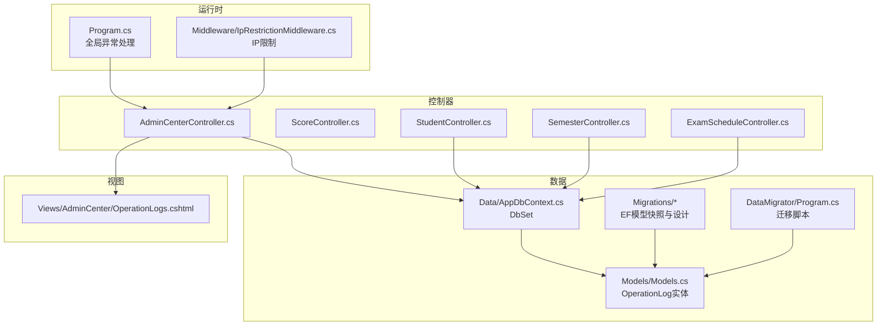
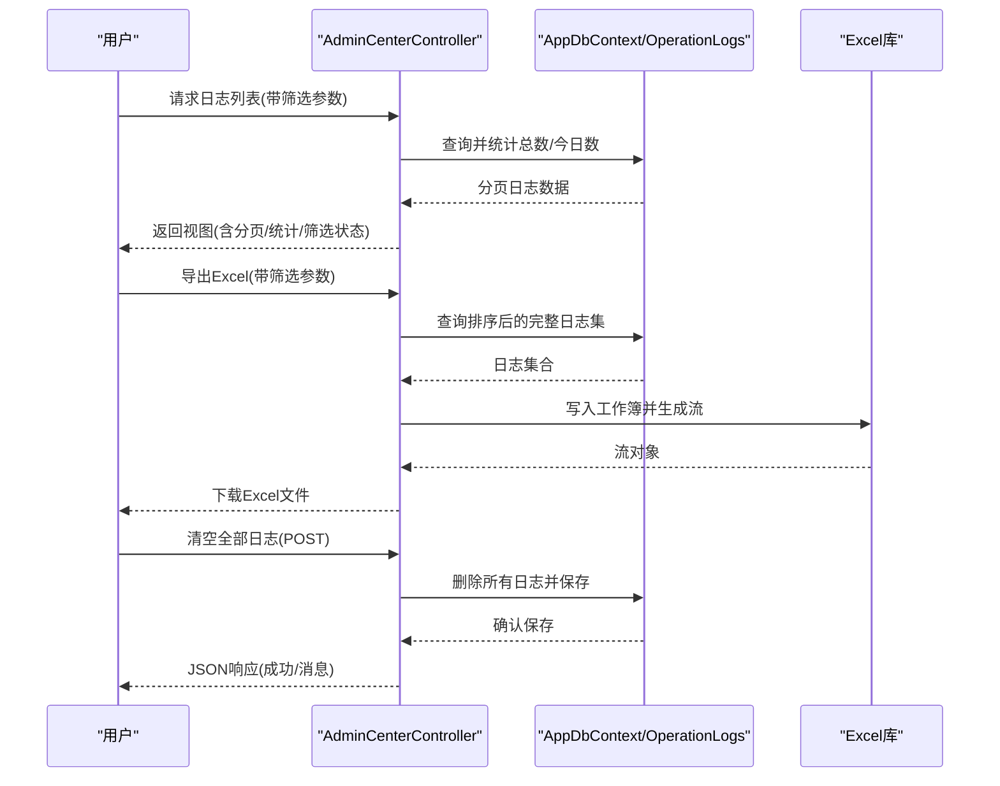
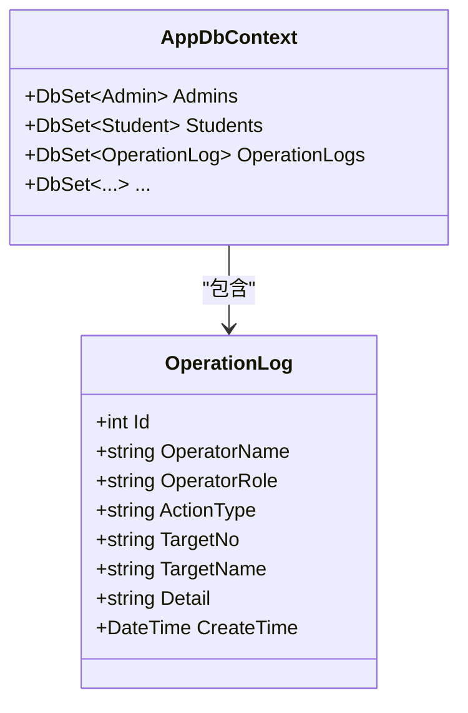
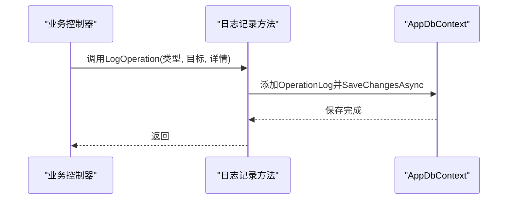
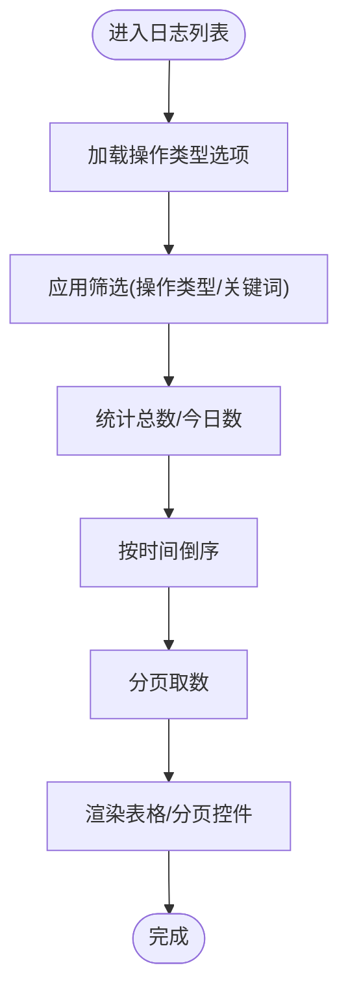
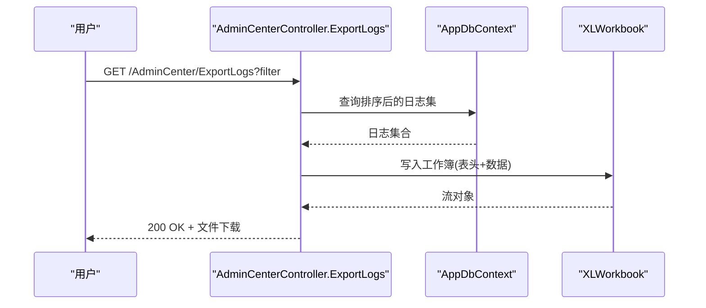
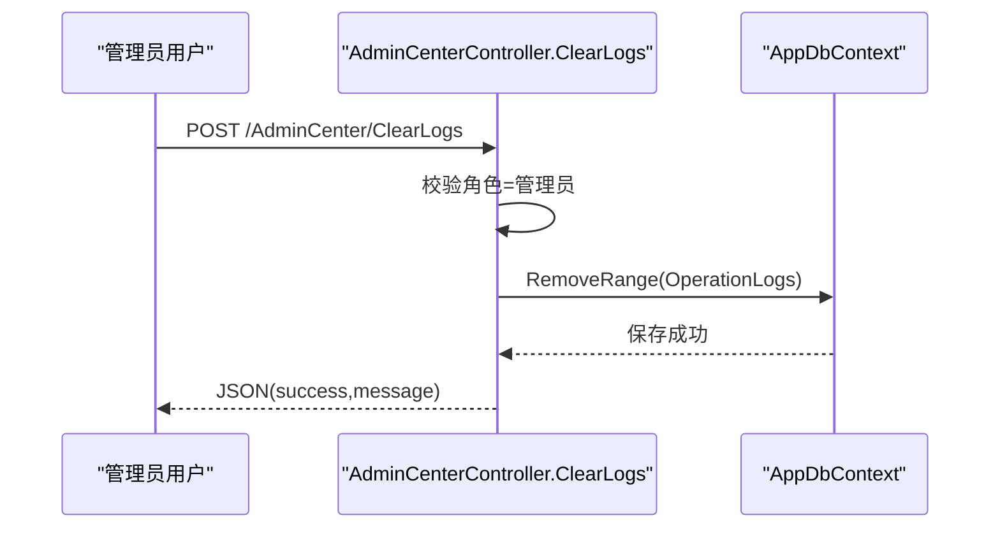
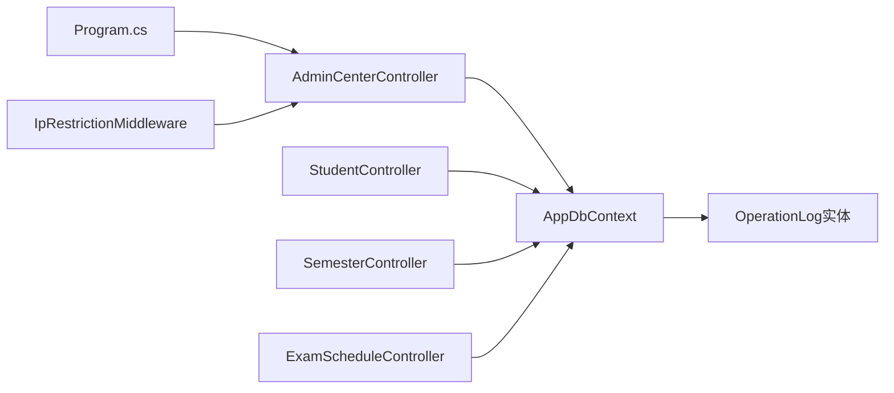

# 操作日志API

<cite>
**本文引用的文件**
- [Controllers/AdminCenterController.cs](file://Controllers/AdminCenterController.cs)
- [Views/AdminCenter/OperationLogs.cshtml](file://Views/AdminCenter/OperationLogs.cshtml)
- [Models/Models.cs](file://Models/Models.cs)
- [Data/AppDbContext.cs](file://Data/AppDbContext.cs)
- [Program.cs](file://Program.cs)
- [Middleware/IpRestrictionMiddleware.cs](file://Middleware/IpRestrictionMiddleware.cs)
- [Controllers/StudentController.cs](file://Controllers/StudentController.cs)
- [Controllers/SemesterController.cs](file://Controllers/SemesterController.cs)
- [Controllers/ExamScheduleController.cs](file://Controllers/ExamScheduleController.cs)
- [DataMigrator/Program.cs](file://DataMigrator/Program.cs)
- [Migrations/20260609075559_InitialCreate.Designer.cs](file://Migrations/20260609075559_InitialCreate.Designer.cs)
- [Migrations/AppDbContextModelSnapshot.cs](file://Migrations/AppDbContextModelSnapshot.cs)
- [Controllers/ScoreController.cs](file://Controllers/ScoreController.cs)
</cite>

## 目录
1. [简介](#简介)
2. [项目结构](#项目结构)
3. [核心组件](#核心组件)
4. [架构总览](#架构总览)
5. [详细组件分析](#详细组件分析)
6. [依赖关系分析](#依赖关系分析)
7. [性能考虑](#性能考虑)
8. [故障排除指南](#故障排除指南)
9. [结论](#结论)
10. [附录](#附录)

## 简介
本文件面向“操作日志管理”的API与前端界面，系统性梳理了日志采集、查询、导出、清理与安全保护机制。内容覆盖：
- 日志采集：系统操作自动记录、手动日志插入、异常日志捕获
- 日志查询：按时间段、操作类型、关键字等多维筛选
- 日志导出：Excel格式导出
- 清理策略：管理员清空全部日志
- 存储与性能：表结构、索引与查询优化建议
- 安全与防篡改：访问控制、安全码配置与异常统一处理

## 项目结构
围绕操作日志的核心文件分布如下：
- 控制器层：AdminCenterController 提供日志列表、导出、清空；多个业务控制器在关键操作处调用日志记录
- 视图层：AdminCenter/OperationLogs.cshtml 提供日志列表与筛选UI
- 模型与数据上下文：OperationLog 实体与 AppDbContext 集成
- 异常与中间件：Program.cs 中全局异常处理；IpRestrictionMiddleware 进行IP访问控制
- 导出：ScoreController 展示了Excel导出模式，可借鉴用于日志导出扩展

图表来源
- [Controllers/AdminCenterController.cs:346-446](file://Controllers/AdminCenterController.cs#L346-L446)
- [Views/AdminCenter/OperationLogs.cshtml:1-193](file://Views/AdminCenter/OperationLogs.cshtml#L1-L193)
- [Models/Models.cs:237-260](file://Models/Models.cs#L237-L260)
- [Data/AppDbContext.cs:10-17](file://Data/AppDbContext.cs#L10-L17)
- [Program.cs:45-86](file://Program.cs#L45-L86)
- [Middleware/IpRestrictionMiddleware.cs:34-63](file://Middleware/IpRestrictionMiddleware.cs#L34-L63)
- [Controllers/StudentController.cs:978-996](file://Controllers/StudentController.cs#L978-L996)
- [Controllers/SemesterController.cs:157-195](file://Controllers/SemesterController.cs#L157-L195)
- [Controllers/ExamScheduleController.cs:380-391](file://Controllers/ExamScheduleController.cs#L380-L391)
- [DataMigrator/Program.cs:177-191](file://DataMigrator/Program.cs#L177-L191)
- [Migrations/20260609075559_InitialCreate.Designer.cs:365-400](file://Migrations/20260609075559_InitialCreate.Designer.cs#L365-L400)
- [Migrations/AppDbContextModelSnapshot.cs:504-535](file://Migrations/AppDbContextModelSnapshot.cs#L504-L535)
- [Controllers/ScoreController.cs:276-348](file://Controllers/ScoreController.cs#L276-L348)

章节来源
- [Controllers/AdminCenterController.cs:346-446](file://Controllers/AdminCenterController.cs#L346-L446)
- [Views/AdminCenter/OperationLogs.cshtml:1-193](file://Views/AdminCenter/OperationLogs.cshtml#L1-L193)
- [Models/Models.cs:237-260](file://Models/Models.cs#L237-L260)
- [Data/AppDbContext.cs:10-17](file://Data/AppDbContext.cs#L10-L17)
- [Program.cs:45-86](file://Program.cs#L45-L86)
- [Middleware/IpRestrictionMiddleware.cs:34-63](file://Middleware/IpRestrictionMiddleware.cs#L34-L63)
- [Controllers/StudentController.cs:978-996](file://Controllers/StudentController.cs#L978-L996)
- [Controllers/SemesterController.cs:157-195](file://Controllers/SemesterController.cs#L157-L195)
- [Controllers/ExamScheduleController.cs:380-391](file://Controllers/ExamScheduleController.cs#L380-L391)
- [DataMigrator/Program.cs:177-191](file://DataMigrator/Program.cs#L177-L191)
- [Migrations/20260609075559_InitialCreate.Designer.cs:365-400](file://Migrations/20260609075559_InitialCreate.Designer.cs#L365-L400)
- [Migrations/AppDbContextModelSnapshot.cs:504-535](file://Migrations/AppDbContextModelSnapshot.cs#L504-L535)
- [Controllers/ScoreController.cs:276-348](file://Controllers/ScoreController.cs#L276-L348)

## 核心组件
- OperationLog 实体：记录操作人、角色、操作类型、目标、详情与时间
- AppDbContext：提供 OperationLogs DbSet
- AdminCenterController：提供日志列表、筛选、导出、清空
- 各业务控制器：在关键操作中调用日志记录方法
- 全局异常处理：统一捕获异常并记录到文件
- IP限制中间件：对访问路径进行白名单控制

章节来源
- [Models/Models.cs:237-260](file://Models/Models.cs#L237-L260)
- [Data/AppDbContext.cs:10-17](file://Data/AppDbContext.cs#L10-L17)
- [Controllers/AdminCenterController.cs:346-446](file://Controllers/AdminCenterController.cs#L346-L446)
- [Controllers/StudentController.cs:978-996](file://Controllers/StudentController.cs#L978-L996)
- [Controllers/SemesterController.cs:157-195](file://Controllers/SemesterController.cs#L157-L195)
- [Controllers/ExamScheduleController.cs:380-391](file://Controllers/ExamScheduleController.cs#L380-L391)
- [Program.cs:45-86](file://Program.cs#L45-L86)
- [Middleware/IpRestrictionMiddleware.cs:34-63](file://Middleware/IpRestrictionMiddleware.cs#L34-L63)

## 架构总览
操作日志的端到端流程如下：
- 用户通过 AdminCenter 页面查看日志、导出、清空
- 查询参数（操作类型、关键词）经由控制器筛选并分页返回
- 导出功能将筛选结果写入Excel工作簿并下载
- 清空功能仅管理员可执行，删除所有日志记录
- 全局异常处理器捕获未处理异常并写入日志文件，避免敏感信息泄露

图表来源
- [Controllers/AdminCenterController.cs:346-446](file://Controllers/AdminCenterController.cs#L346-L446)
- [Data/AppDbContext.cs:10-17](file://Data/AppDbContext.cs#L10-L17)
- [Controllers/ScoreController.cs:276-348](file://Controllers/ScoreController.cs#L276-L348)

## 详细组件分析

### 日志实体与数据模型
- 字段说明：主键、操作人姓名、角色、操作类型、目标编号/名称、详情、创建时间
- EF映射：在多个迁移文件中定义了字段长度、类型与表名
- 数据迁移：DataMigrator 在迁移脚本中包含 OperationLog 的插入

图表来源
- [Models/Models.cs:237-260](file://Models/Models.cs#L237-L260)
- [Data/AppDbContext.cs:10-17](file://Data/AppDbContext.cs#L10-L17)
- [Migrations/20260609075559_InitialCreate.Designer.cs:365-400](file://Migrations/20260609075559_InitialCreate.Designer.cs#L365-L400)
- [Migrations/AppDbContextModelSnapshot.cs:504-535](file://Migrations/AppDbContextModelSnapshot.cs#L504-L535)
- [DataMigrator/Program.cs:177-191](file://DataMigrator/Program.cs#L177-L191)

章节来源
- [Models/Models.cs:237-260](file://Models/Models.cs#L237-L260)
- [Migrations/20260609075559_InitialCreate.Designer.cs:365-400](file://Migrations/20260609075559_InitialCreate.Designer.cs#L365-L400)
- [Migrations/AppDbContextModelSnapshot.cs:504-535](file://Migrations/AppDbContextModelSnapshot.cs#L504-L535)
- [DataMigrator/Program.cs:177-191](file://DataMigrator/Program.cs#L177-L191)

### 日志采集机制
- 自动记录：多个业务控制器在关键操作后调用日志记录方法，填充操作人、角色、类型、目标与详情
- 手动插入：AdminCenterController 提供统一的日志记录入口（在各业务控制器中体现）
- 异常日志：全局异常中间件捕获未处理异常并写入 error.log 文件，避免堆栈泄露

图表来源
- [Controllers/StudentController.cs:978-996](file://Controllers/StudentController.cs#L978-L996)
- [Controllers/SemesterController.cs:157-195](file://Controllers/SemesterController.cs#L157-L195)
- [Controllers/ExamScheduleController.cs:380-391](file://Controllers/ExamScheduleController.cs#L380-L391)
- [Program.cs:45-86](file://Program.cs#L45-L86)

章节来源
- [Controllers/StudentController.cs:978-996](file://Controllers/StudentController.cs#L978-L996)
- [Controllers/SemesterController.cs:157-195](file://Controllers/SemesterController.cs#L157-L195)
- [Controllers/ExamScheduleController.cs:380-391](file://Controllers/ExamScheduleController.cs#L380-L391)
- [Program.cs:45-86](file://Program.cs#L45-L86)

### 日志查询接口
- 筛选条件：操作类型（下拉）、关键词（操作人/目标/详情）
- 排序与分页：按创建时间倒序，支持分页
- 统计信息：总条数、今日条数
- 权限控制：仅管理员可见与操作

图表来源
- [Controllers/AdminCenterController.cs:346-375](file://Controllers/AdminCenterController.cs#L346-L375)
- [Views/AdminCenter/OperationLogs.cshtml:60-115](file://Views/AdminCenter/OperationLogs.cshtml#L60-L115)

章节来源
- [Controllers/AdminCenterController.cs:346-375](file://Controllers/AdminCenterController.cs#L346-L375)
- [Views/AdminCenter/OperationLogs.cshtml:60-115](file://Views/AdminCenter/OperationLogs.cshtml#L60-L115)

### 日志导出功能
- Excel导出：基于筛选参数查询日志，写入工作簿并下载
- 字段：序号、操作人、角色、操作类型、目标、详情、操作时间
- 权限：仅管理员可导出

图表来源
- [Controllers/AdminCenterController.cs:378-427](file://Controllers/AdminCenterController.cs#L378-L427)
- [Controllers/ScoreController.cs:276-348](file://Controllers/ScoreController.cs#L276-L348)

章节来源
- [Controllers/AdminCenterController.cs:378-427](file://Controllers/AdminCenterController.cs#L378-L427)
- [Controllers/ScoreController.cs:276-348](file://Controllers/ScoreController.cs#L276-L348)

### 日志清理策略
- 清空全部：管理员POST请求触发，删除所有日志并保存
- 权限校验：基于角色判断
- 影响范围：影响所有日志记录，需谨慎使用

图表来源
- [Controllers/AdminCenterController.cs:429-439](file://Controllers/AdminCenterController.cs#L429-L439)

章节来源
- [Controllers/AdminCenterController.cs:429-439](file://Controllers/AdminCenterController.cs#L429-L439)

### 日志存储优化与索引策略
- 当前索引：未发现针对 OperationLog 的显式复合索引
- 建议索引：
  - CreateTime（降序）：加速时间范围查询与默认排序
  - ActionType + CreateTime：加速按类型+时间的组合查询
  - OperatorRole + CreateTime：加速角色+时间的组合查询
  - TargetNo/TargetName：加速按目标过滤
- 查询优化：
  - 使用投影与分页，避免一次性加载大量日志
  - 对高频筛选字段建立索引
  - 合理拆分“今日统计”与“列表查询”，减少重复扫描

章节来源
- [Migrations/20260609075559_InitialCreate.Designer.cs:365-400](file://Migrations/20260609075559_InitialCreate.Designer.cs#L365-L400)
- [Migrations/AppDbContextModelSnapshot.cs:504-535](file://Migrations/AppDbContextModelSnapshot.cs#L504-L535)

### 日志安全保护与防篡改
- 访问控制：IP限制中间件对静态资源与登录路径放行，其他路径进行IP白名单检查
- 管理员权限：日志导出与清空均要求角色为管理员
- 异常防护：全局异常中间件统一处理，避免堆栈泄露，同时写入 error.log 便于排查
- 安全码：站点配置中提供安全码保存接口，可用于额外的安全验证场景

章节来源
- [Middleware/IpRestrictionMiddleware.cs:34-63](file://Middleware/IpRestrictionMiddleware.cs#L34-L63)
- [Controllers/AdminCenterController.cs:378-439](file://Controllers/AdminCenterController.cs#L378-L439)
- [Program.cs:45-86](file://Program.cs#L45-L86)
- [Controllers/AdminCenterController.cs:448-460](file://Controllers/AdminCenterController.cs#L448-L460)

## 依赖关系分析
- 控制器依赖 AppDbContext 提供的 OperationLogs DbSet
- 视图依赖控制器传递的筛选状态与分页数据
- 全局异常处理与中间件贯穿请求生命周期
- 多个业务控制器共享日志记录逻辑

图表来源
- [Controllers/AdminCenterController.cs:346-446](file://Controllers/AdminCenterController.cs#L346-L446)
- [Controllers/StudentController.cs:978-996](file://Controllers/StudentController.cs#L978-L996)
- [Controllers/SemesterController.cs:157-195](file://Controllers/SemesterController.cs#L157-L195)
- [Controllers/ExamScheduleController.cs:380-391](file://Controllers/ExamScheduleController.cs#L380-L391)
- [Data/AppDbContext.cs:10-17](file://Data/AppDbContext.cs#L10-L17)
- [Program.cs:45-86](file://Program.cs#L45-L86)
- [Middleware/IpRestrictionMiddleware.cs:34-63](file://Middleware/IpRestrictionMiddleware.cs#L34-L63)

章节来源
- [Controllers/AdminCenterController.cs:346-446](file://Controllers/AdminCenterController.cs#L346-L446)
- [Controllers/StudentController.cs:978-996](file://Controllers/StudentController.cs#L978-L996)
- [Controllers/SemesterController.cs:157-195](file://Controllers/SemesterController.cs#L157-L195)
- [Controllers/ExamScheduleController.cs:380-391](file://Controllers/ExamScheduleController.cs#L380-L391)
- [Data/AppDbContext.cs:10-17](file://Data/AppDbContext.cs#L10-L17)
- [Program.cs:45-86](file://Program.cs#L45-L86)
- [Middleware/IpRestrictionMiddleware.cs:34-63](file://Middleware/IpRestrictionMiddleware.cs#L34-L63)

## 性能考虑
- 查询性能
  - 建议为 CreateTime、ActionType、OperatorRole、TargetNo/TargetName 建立合适索引
  - 对高频筛选组合（如 ActionType+CreateTime）建立复合索引
- 分页与投影
  - 使用 Skip/Take 分页，避免一次性加载全量数据
  - 列表页仅投影必要字段，减少网络与内存开销
- 导出性能
  - 导出前先按 CreateTime 排序，避免二次排序
  - 控制单次导出的数据量，必要时分批导出或增加筛选条件
- 存储与归档
  - 建议按月/季度归档旧日志至历史表，降低主表压力
  - 设置容量上限与定期清理策略（如保留最近1年）

## 故障排除指南
- 无法导出Excel
  - 检查角色是否为管理员
  - 确认筛选参数正确传递
  - 查看浏览器控制台与网络面板
- 清空日志无效
  - 确认当前用户角色为管理员
  - 检查CSRF令牌是否正确提交
- 日志缺失
  - 确认业务控制器在关键操作后调用了日志记录方法
  - 检查数据库连接与事务提交
- 异常未显示堆栈
  - 全局异常中间件会统一处理并写入 error.log
  - 查看服务目录下的 error.log 以定位问题

章节来源
- [Controllers/AdminCenterController.cs:378-439](file://Controllers/AdminCenterController.cs#L378-L439)
- [Program.cs:45-86](file://Program.cs#L45-L86)

## 结论
本系统实现了完善的操作日志管理能力：自动采集、多维查询、Excel导出、管理员清空与统一异常处理。建议后续完善索引策略、引入归档与容量限制，并在前端增强筛选与导出体验，以进一步提升性能与可用性。

## 附录
- API清单（基于现有实现）
  - GET /AdminCenter/OperationLogs：日志列表（支持操作类型、关键词筛选，分页）
  - GET /AdminCenter/ExportLogs：Excel导出（支持筛选参数）
  - POST /AdminCenter/ClearLogs：清空全部日志（管理员）
  - POST /AdminCenter/SaveSecurityCode：保存安全码（管理员）

章节来源
- [Controllers/AdminCenterController.cs:346-446](file://Controllers/AdminCenterController.cs#L346-L446)
- [Views/AdminCenter/OperationLogs.cshtml:15-21](file://Views/AdminCenter/OperationLogs.cshtml#L15-L21)