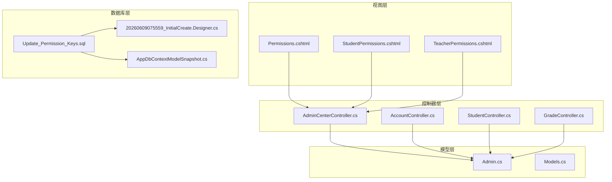
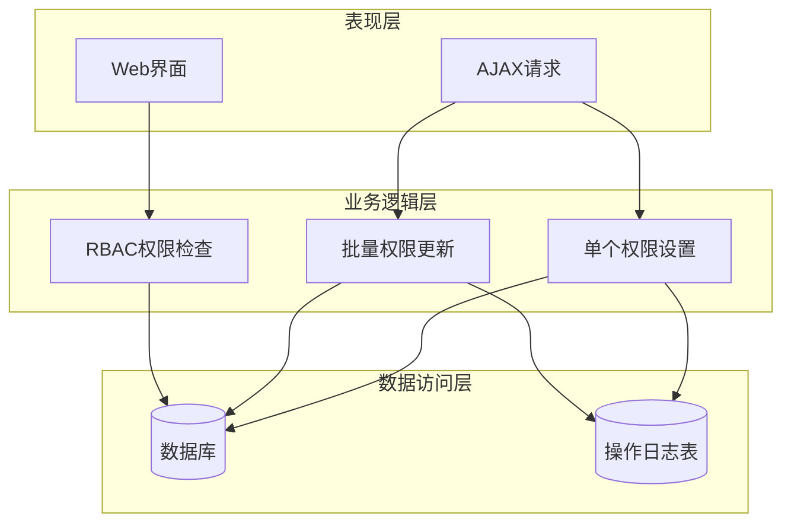
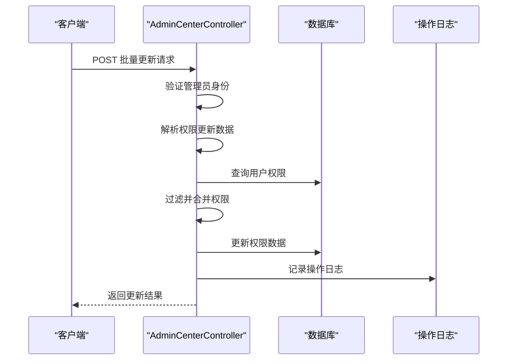
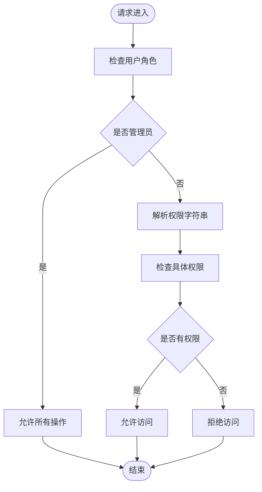
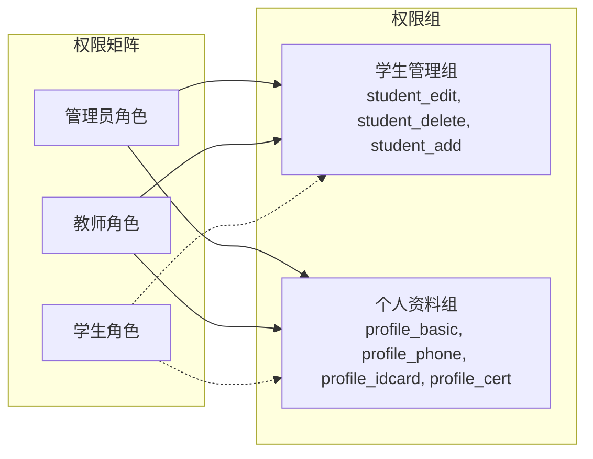
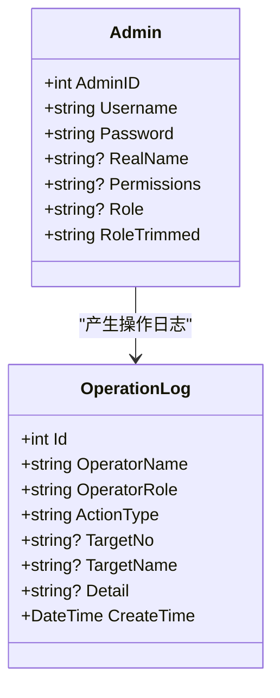
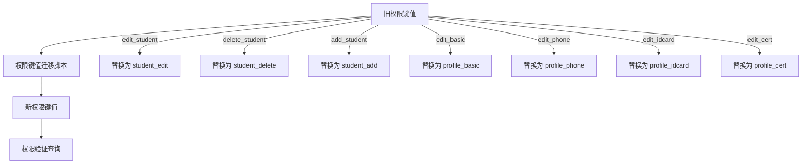

# 权限管理API

<cite>
**本文档引用的文件**
- [Controllers/AdminCenterController.cs](file://Controllers/AdminCenterController.cs)
- [Controllers/AccountController.cs](file://Controllers/AccountController.cs)
- [Controllers/StudentController.cs](file://Controllers/StudentController.cs)
- [Controllers/GradeController.cs](file://Controllers/GradeController.cs)
- [Models/Admin.cs](file://Models/Admin.cs)
- [Models/Models.cs](file://Models/Models.cs)
- [Views/AdminCenter/Permissions.cshtml](file://Views/AdminCenter/Permissions.cshtml)
- [Views/AdminCenter/StudentPermissions.cshtml](file://Views/AdminCenter/StudentPermissions.cshtml)
- [Views/AdminCenter/TeacherPermissions.cshtml](file://Views/AdminCenter/TeacherPermissions.cshtml)
- [Database/Update_Permission_Keys.sql](file://Database/Update_Permission_Keys.sql)
- [Migrations/20260609075559_InitialCreate.Designer.cs](file://Migrations/20260609075559_InitialCreate.Designer.cs)
- [Migrations/AppDbContextModelSnapshot.cs](file://Migrations/AppDbContextModelSnapshot.cs)
</cite>

## 目录
1. [简介](#简介)
2. [项目结构](#项目结构)
3. [核心组件](#核心组件)
4. [架构概览](#架构概览)
5. [详细组件分析](#详细组件分析)
6. [依赖关系分析](#依赖关系分析)
7. [性能考虑](#性能考虑)
8. [故障排除指南](#故障排除指南)
9. [结论](#结论)

## 简介
本文件为学生管理系统的权限管理API文档，详细记录了基于角色的访问控制（RBAC）体系，包括管理员、教师和学生角色的权限定义与分配机制。系统采用基于权限键值的细粒度权限检查，支持单个用户权限设置与批量权限更新功能。权限数据以逗号分隔的形式存储在数据库中，前端提供直观的勾选界面进行权限配置。

## 项目结构
权限管理相关的核心文件分布如下：
- 控制器层：AdminCenterController（权限管理）、AccountController（认证与密码策略）、StudentController/GradeController（操作审计）
- 模型层：Admin模型（用户信息与权限字段）
- 视图层：权限管理页面（批量权限配置界面）
- 数据库层：权限键值迁移脚本与EF Core模型快照
- 迁移层：数据库表结构定义（包含Permissions字段）

**图表来源**
- [Controllers/AdminCenterController.cs](file://Controllers/AdminCenterController.cs)
- [Controllers/AccountController.cs](file://Controllers/AccountController.cs)
- [Controllers/StudentController.cs](file://Controllers/StudentController.cs)
- [Controllers/GradeController.cs](file://Controllers/GradeController.cs)
- [Models/Admin.cs](file://Models/Admin.cs)
- [Views/AdminCenter/Permissions.cshtml](file://Views/AdminCenter/Permissions.cshtml)
- [Views/AdminCenter/StudentPermissions.cshtml](file://Views/AdminCenter/StudentPermissions.cshtml)
- [Views/AdminCenter/TeacherPermissions.cshtml](file://Views/AdminCenter/TeacherPermissions.cshtml)
- [Database/Update_Permission_Keys.sql](file://Database/Update_Permission_Keys.sql)
- [Migrations/20260609075559_InitialCreate.Designer.cs](file://Migrations/20260609075559_InitialCreate.Designer.cs)
- [Migrations/AppDbContextModelSnapshot.cs](file://Migrations/AppDbContextModelSnapshot.cs)

**章节来源**
- [Controllers/AdminCenterController.cs](file://Controllers/AdminCenterController.cs)
- [Models/Admin.cs](file://Models/Admin.cs)
- [Views/AdminCenter/Permissions.cshtml](file://Views/AdminCenter/Permissions.cshtml)

## 核心组件
本系统的核心组件围绕Admin模型展开，该模型包含用户基本信息与权限字段。权限以字符串形式存储，使用逗号分隔的权限键值集合。

### 权限键值体系
系统采用统一的权限键值命名规范：
- 学生相关权限：student_edit、student_delete、student_add
- 教职工资料权限：profile_basic、profile_phone、profile_idcard、profile_cert
- 管理员权限：管理员角色拥有所有权限，无需显式配置

### 权限存储与查询
权限数据存储在Admin模型的Permissions字段中，系统通过以下方式处理权限：
- 解析权限字符串为权限列表
- 使用LINQ过滤特定前缀的权限
- 合并新的权限设置

**章节来源**
- [Models/Admin.cs](file://Models/Admin.cs)
- [Controllers/AdminCenterController.cs](file://Controllers/AdminCenterController.cs)

## 架构概览
系统采用经典的三层架构，结合基于角色的访问控制（RBAC）与细粒度权限检查：

**图表来源**
- [Controllers/AdminCenterController.cs](file://Controllers/AdminCenterController.cs)
- [Controllers/StudentController.cs](file://Controllers/StudentController.cs)
- [Migrations/20260609075559_InitialCreate.Designer.cs](file://Migrations/20260609075559_InitialCreate.Designer.cs)

## 详细组件分析

### 管理员权限管理控制器
AdminCenterController是权限管理的核心控制器，负责：
- 批量更新学生权限
- 批量更新教职工权限
- 权限管理页面展示
- 操作审计日志

#### 批量权限更新流程

**图表来源**
- [Controllers/AdminCenterController.cs](file://Controllers/AdminCenterController.cs)
- [Controllers/StudentController.cs](file://Controllers/StudentController.cs)

#### 权限分配接口设计
系统提供两种主要的权限分配方式：

1. **批量权限更新接口**
   - 支持同时更新多个用户的权限
   - 保持现有权限不变，仅更新指定权限组
   - 提供防重复添加机制

2. **单个用户权限设置**
   - 通过前端勾选界面进行权限配置
   - 实时权限验证与反馈
   - 支持全选/取消功能

**章节来源**
- [Controllers/AdminCenterController.cs](file://Controllers/AdminCenterController.cs)
- [Views/AdminCenter/StudentPermissions.cshtml](file://Views/AdminCenter/StudentPermissions.cshtml)
- [Views/AdminCenter/TeacherPermissions.cshtml](file://Views/AdminCenter/TeacherPermissions.cshtml)

### 权限验证机制
系统采用基于角色的访问控制（RBAC）与细粒度权限检查相结合的方式：

**图表来源**
- [Controllers/AdminCenterController.cs](file://Controllers/AdminCenterController.cs)
- [Controllers/AccountController.cs](file://Controllers/AccountController.cs)

### 权限继承与组合规则
系统采用扁平化的权限设计，不支持复杂的权限继承关系。权限组合遵循以下规则：
- 权限以逗号分隔存储
- 同一权限键不会重复添加
- 不同权限组可以同时存在
- 管理员角色拥有最高权限

**章节来源**
- [Controllers/AdminCenterController.cs](file://Controllers/AdminCenterController.cs)
- [Database/Update_Permission_Keys.sql](file://Database/Update_Permission_Keys.sql)

### 权限矩阵与树结构
系统通过权限键值构建权限矩阵，支持以下权限分类：

**图表来源**
- [Views/AdminCenter/Permissions.cshtml](file://Views/AdminCenter/Permissions.cshtml)
- [Views/AdminCenter/StudentPermissions.cshtml](file://Views/AdminCenter/StudentPermissions.cshtml)
- [Views/AdminCenter/TeacherPermissions.cshtml](file://Views/AdminCenter/TeacherPermissions.cshtml)

## 依赖关系分析

### 数据模型依赖

**图表来源**
- [Models/Admin.cs](file://Models/Admin.cs)
- [Migrations/20260609075559_InitialCreate.Designer.cs](file://Migrations/20260609075559_InitialCreate.Designer.cs)

### 权限键值迁移依赖
系统通过SQL脚本实现权限键值的标准化迁移：

**图表来源**
- [Database/Update_Permission_Keys.sql](file://Database/Update_Permission_Keys.sql)

**章节来源**
- [Models/Admin.cs](file://Models/Admin.cs)
- [Database/Update_Permission_Keys.sql](file://Database/Update_Permission_Keys.sql)
- [Migrations/20260609075559_InitialCreate.Designer.cs](file://Migrations/20260609075559_InitialCreate.Designer.cs)

## 性能考虑
- 权限解析采用LINQ查询，建议在高并发场景下考虑缓存策略
- 批量更新操作使用事务处理，确保数据一致性
- 权限字符串长度限制为200字符，避免过长的权限列表影响性能
- 建议对频繁访问的权限数据建立内存缓存

## 故障排除指南

### 常见问题与解决方案
1. **权限更新失败**
   - 检查用户是否具有管理员权限
   - 验证权限键值格式是否正确
   - 确认数据库连接状态

2. **权限验证异常**
   - 检查权限字符串是否包含重复项
   - 验证权限键值是否符合新版本规范
   - 确认用户角色信息是否正确

3. **操作日志缺失**
   - 检查OperationLogs表是否存在
   - 验证数据库权限设置
   - 确认日志记录代码执行路径

**章节来源**
- [Controllers/AdminCenterController.cs](file://Controllers/AdminCenterController.cs)
- [Controllers/StudentController.cs](file://Controllers/StudentController.cs)
- [Controllers/GradeController.cs](file://Controllers/GradeController.cs)

## 结论
本权限管理系统采用简洁高效的RBAC架构，通过权限键值的扁平化设计实现了灵活的权限控制。系统提供了完善的权限分配、验证和审计功能，能够满足教育管理场景下的权限需求。建议在未来版本中考虑引入更复杂的权限继承机制和缓存优化策略。