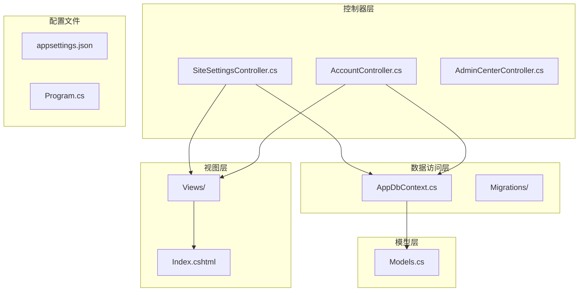
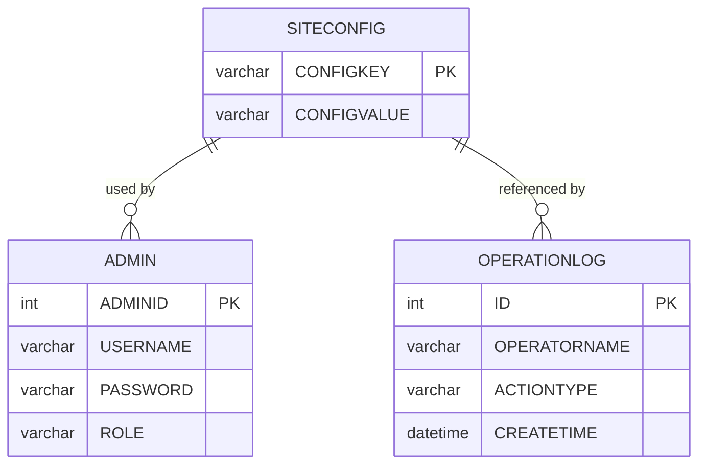
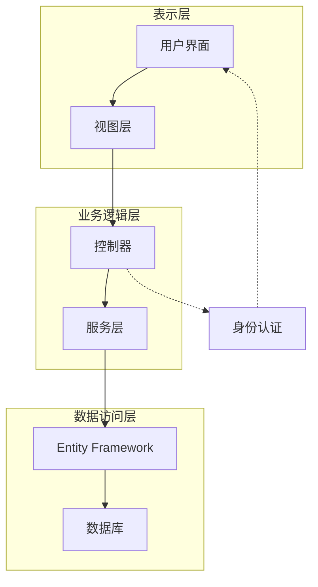
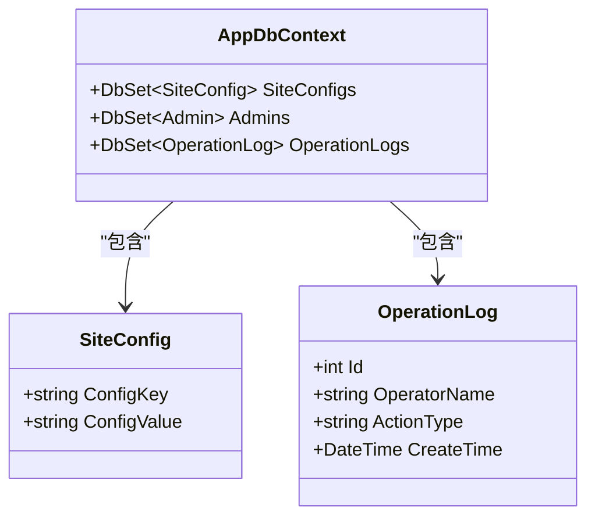
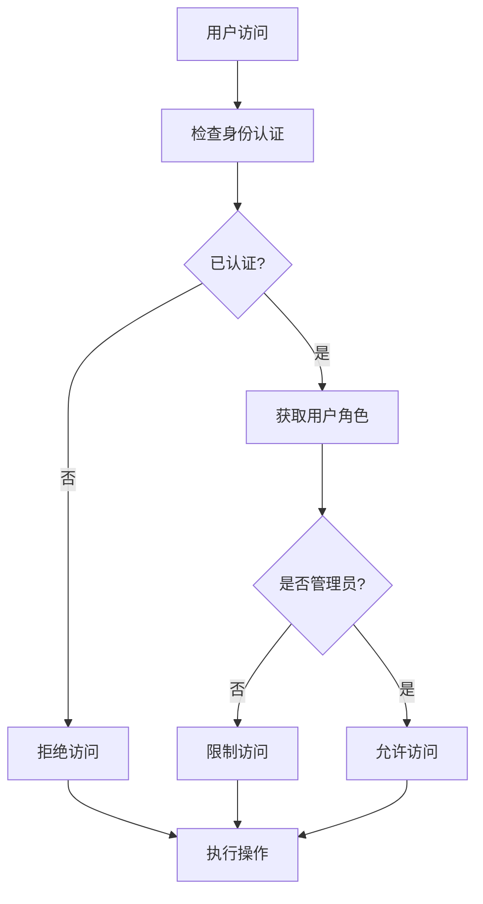
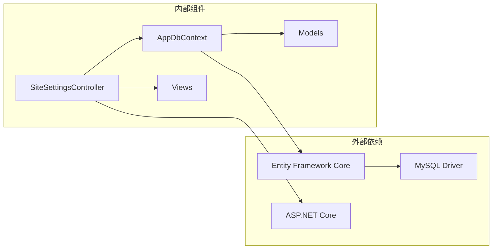

# 站点配置API

<cite>
**本文档引用的文件**
- [SiteSettingsController.cs](file://Controllers/SiteSettingsController.cs)
- [Models.cs](file://Models/Models.cs)
- [AppDbContext.cs](file://Data/AppDbContext.cs)
- [Index.cshtml](file://Views/SiteSettings/Index.cshtml)
- [AccountController.cs](file://Controllers/AccountController.cs)
- [20260609075559_InitialCreate.cs](file://Migrations/20260609075559_InitialCreate.cs)
- [Program.cs](file://Program.cs)
</cite>

## 目录
1. [简介](#简介)
2. [项目结构](#项目结构)
3. [核心组件](#核心组件)
4. [架构概览](#架构概览)
5. [详细组件分析](#详细组件分析)
6. [依赖关系分析](#依赖关系分析)
7. [性能考虑](#性能考虑)
8. [故障排除指南](#故障排除指南)
9. [结论](#结论)

## 简介

站点配置管理系统是一个基于ASP.NET Core的Web应用程序，提供了完整的站点配置管理功能。该系统允许管理员对网站的各项配置进行集中管理，包括全局配置项的增删改查操作、功能开关控制、站点基本信息配置以及文件上传管理。

系统采用分层架构设计，包含控制器层、数据访问层、模型层和视图层，确保了良好的代码组织和可维护性。通过Entity Framework Core进行数据持久化，支持MySQL数据库。

## 项目结构

项目采用标准的ASP.NET Core MVC架构，主要文件组织如下：

**图表来源**
- [SiteSettingsController.cs:1-139](file://Controllers/SiteSettingsController.cs#L1-L139)
- [AppDbContext.cs:1-312](file://Data/AppDbContext.cs#L1-L312)
- [Models.cs:167-175](file://Models/Models.cs#L167-L175)

**章节来源**
- [SiteSettingsController.cs:1-139](file://Controllers/SiteSettingsController.cs#L1-L139)
- [AppDbContext.cs:1-312](file://Data/AppDbContext.cs#L1-L312)

## 核心组件

### 站点配置模型

系统使用SiteConfig模型来存储所有配置项，该模型具有以下特性：

- **ConfigKey**: 配置键，最大长度100字符，作为主键
- **ConfigValue**: 配置值，最大长度500字符，可为空
- **数据类型**: 字符串类型，支持任意文本内容

### 数据库架构

配置数据存储在SiteConfig表中，采用键值对的形式存储：

**图表来源**
- [Models.cs:167-175](file://Models/Models.cs#L167-L175)
- [AppDbContext.cs:81-88](file://Data/AppDbContext.cs#L81-L88)

**章节来源**
- [Models.cs:167-175](file://Models/Models.cs#L167-L175)
- [AppDbContext.cs:81-88](file://Data/AppDbContext.cs#L81-L88)

## 架构概览

系统采用经典的三层架构模式，各层职责明确：

**图表来源**
- [SiteSettingsController.cs:9-19](file://Controllers/SiteSettingsController.cs#L9-L19)
- [AppDbContext.cs:6-31](file://Data/AppDbContext.cs#L6-L31)

## 详细组件分析

### 站点设置控制器

SiteSettingsController是系统的核心控制器，负责处理所有站点配置相关的请求。

#### 主要功能

1. **配置查看**: 获取所有站点配置项
2. **配置保存**: 新增或更新配置项
3. **文件上传**: 处理背景图片和Logo上传
4. **状态控制**: 管理网站开关状态

#### API接口定义

##### GET /SiteSettings
- **功能**: 获取所有站点配置
- **响应**: 返回配置字典
- **权限**: 需要身份认证

##### POST /SiteSettings/Save
- **功能**: 保存单个配置项
- **参数**: ConfigKey, ConfigValue
- **响应**: JSON对象包含success和message字段
- **权限**: 需要防伪标记验证

##### POST /SiteSettings/UploadBackground
- **功能**: 上传登录背景图片
- **参数**: 文件上传
- **支持格式**: JPG, JPEG, PNG
- **响应**: 包含上传结果和文件路径

##### POST /SiteSettings/UploadLogo
- **功能**: 上传网站Logo
- **参数**: 文件上传
- **支持格式**: JPG, JPEG, PNG
- **响应**: 包含上传结果和文件路径

**章节来源**
- [SiteSettingsController.cs:21-139](file://Controllers/SiteSettingsController.cs#L21-L139)

### 配置数据模型

系统使用简洁的数据模型来存储配置信息：

**图表来源**
- [Models.cs:167-175](file://Models/Models.cs#L167-L175)
- [AppDbContext.cs:10-29](file://Data/AppDbContext.cs#L10-L29)

#### 配置项分类

系统支持以下类型的配置项：

1. **基本信息配置**
   - SiteName: 网站标题
   - SiteDescription: 网站描述
   - Copyright: 版权信息

2. **媒体资源配置**
   - BackgroundImage: 登录背景图片路径
   - Logo: 网站Logo路径

3. **功能开关配置**
   - SiteClosed: 网站开关状态

**章节来源**
- [Models.cs:167-175](file://Models/Models.cs#L167-L175)

### 权限控制系统

系统实现了基于角色的权限控制机制：

**图表来源**
- [Index.cshtml:8-14](file://Views/SiteSettings/Index.cshtml#L8-L14)
- [Program.cs:27](file://Program.cs#L27)

**章节来源**
- [Index.cshtml:8-14](file://Views/SiteSettings/Index.cshtml#L8-L14)
- [Program.cs:27](file://Program.cs#L27)

### 文件上传处理

系统提供了完整的文件上传功能，支持图片文件的安全处理：

#### 支持的文件格式
- JPG: 最大文件大小限制
- JPEG: 最大文件大小限制  
- PNG: 最大文件大小限制

#### 文件存储策略
- 存储目录: wwwroot/imge/
- 文件命名: login_bg.(扩展名) 或 logo.(扩展名)
- 访问路径: /imge/(文件名)

**章节来源**
- [SiteSettingsController.cs:51-137](file://Controllers/SiteSettingsController.cs#L51-L137)

## 依赖关系分析

系统各组件之间的依赖关系如下：

**图表来源**
- [AppDbContext.cs:1-8](file://Data/AppDbContext.cs#L1-L8)
- [SiteSettingsController.cs:1-5](file://Controllers/SiteSettingsController.cs#L1-L5)

**章节来源**
- [AppDbContext.cs:1-8](file://Data/AppDbContext.cs#L1-L8)
- [SiteSettingsController.cs:1-5](file://Controllers/SiteSettingsController.cs#L1-L5)

## 性能考虑

### 数据库优化

1. **索引策略**: SiteConfig表使用ConfigKey作为主键，提供快速查找
2. **连接池**: Entity Framework Core自动管理数据库连接
3. **查询优化**: 使用异步方法避免阻塞线程

### 缓存策略

系统可以通过以下方式实现缓存：
- 配置项缓存：减少数据库查询次数
- 视图缓存：缓存渲染后的HTML内容
- 文件缓存：缓存静态资源文件

### 安全考虑

1. **SQL注入防护**: 使用Entity Framework Core的参数化查询
2. **文件上传安全**: 验证文件类型和大小
3. **XSS防护**: 对用户输入进行适当的转义
4. **CSRF防护**: 使用防伪标记验证

## 故障排除指南

### 常见问题及解决方案

#### 数据库连接问题
- **症状**: 应用启动时报数据库连接错误
- **原因**: 数据库连接字符串配置错误
- **解决**: 检查appsettings.json中的连接字符串

#### 权限不足问题
- **症状**: 访问站点设置页面显示权限不足
- **原因**: 用户未登录或不是管理员角色
- **解决**: 确保用户已正确登录且具有管理员权限

#### 文件上传失败
- **症状**: 图片上传后无法显示
- **原因**: 文件格式不支持或文件过大
- **解决**: 确认文件格式为JPG/JPEG/PNG且大小符合要求

#### 配置保存失败
- **症状**: 修改配置后重启应用丢失
- **原因**: 数据库写入权限问题
- **解决**: 检查数据库用户权限和连接状态

**章节来源**
- [SiteSettingsController.cs:32-33](file://Controllers/SiteSettingsController.cs#L32-L33)
- [SiteSettingsController.cs:55-60](file://Controllers/SiteSettingsController.cs#L55-L60)

## 结论

站点配置管理系统提供了完整、安全、易用的配置管理功能。系统采用现代化的ASP.NET Core技术栈，具有以下优势：

1. **架构清晰**: 分层设计确保了良好的可维护性
2. **功能完整**: 支持多种配置项类型和文件上传
3. **安全可靠**: 实现了完善的权限控制和安全防护
4. **易于扩展**: 模块化设计便于功能扩展和定制

系统为教育管理系统的配置管理提供了坚实的基础，可以根据具体需求进一步扩展功能，如添加配置版本管理、审计日志等功能。