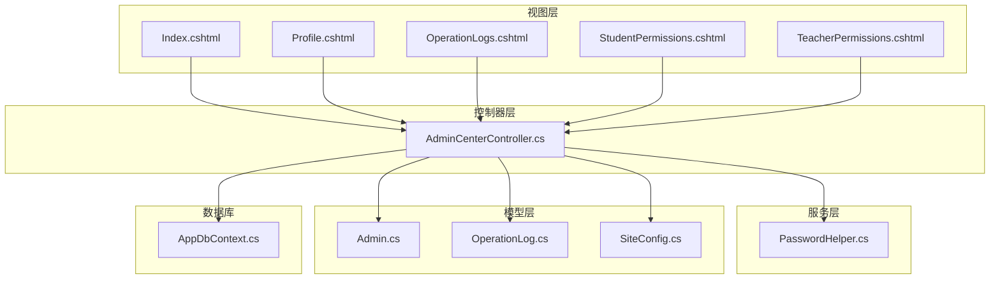
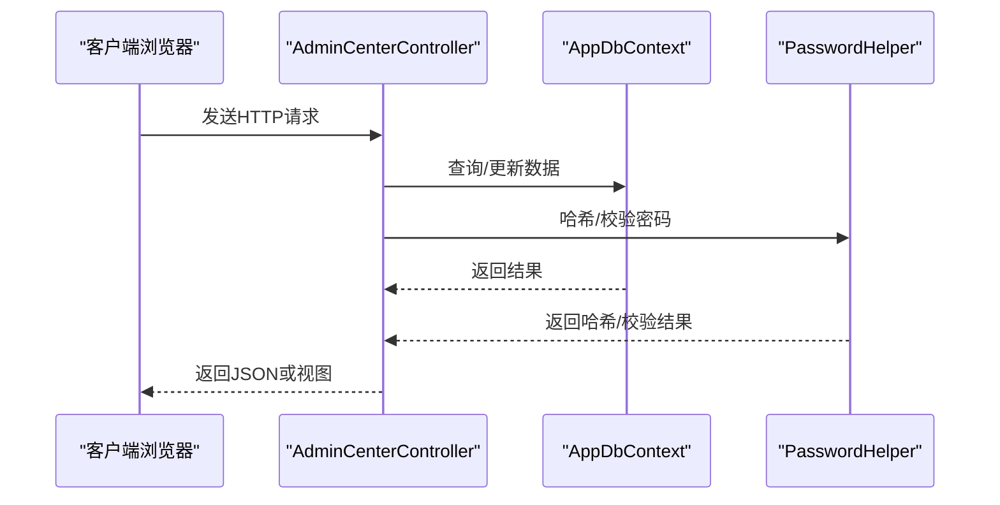
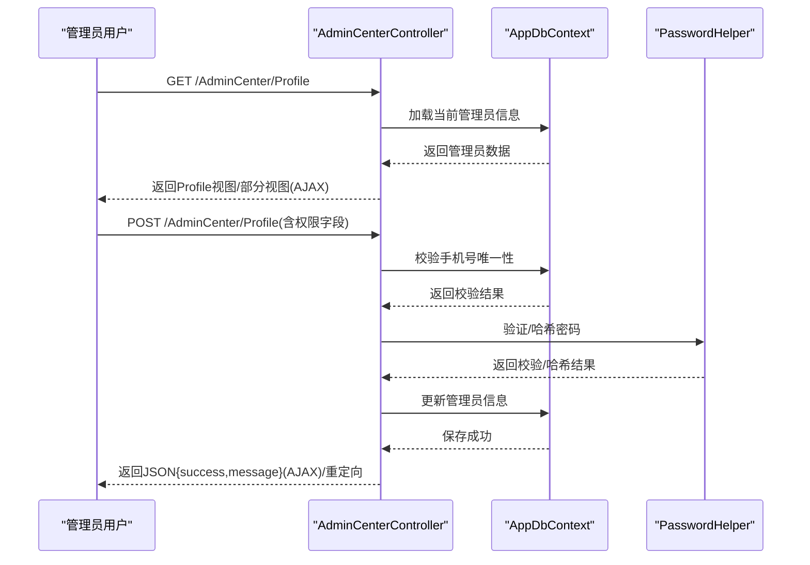
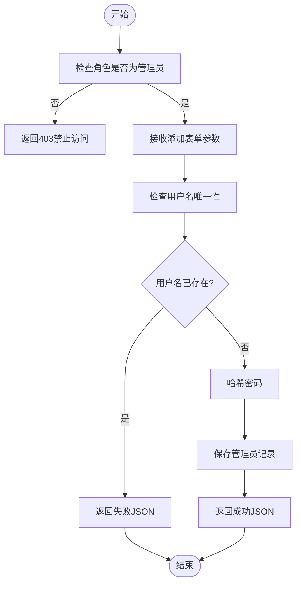
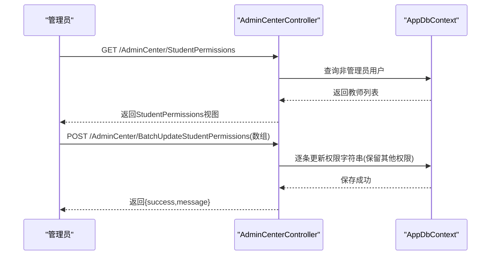
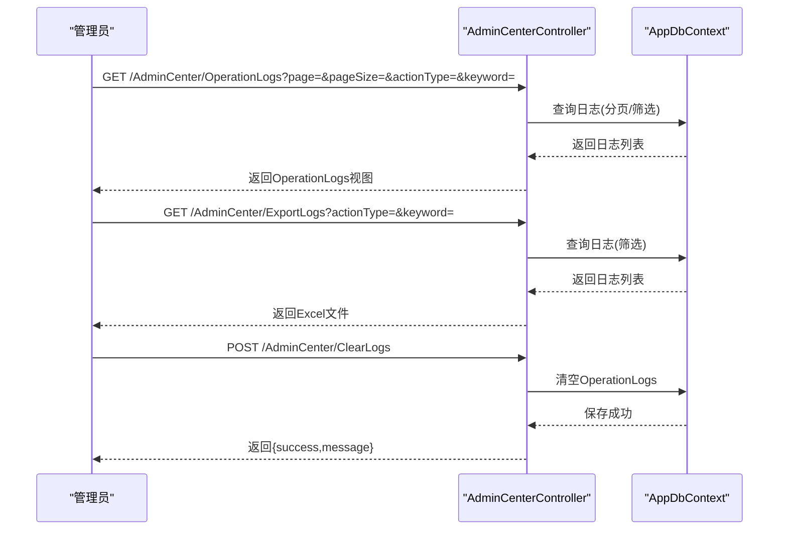
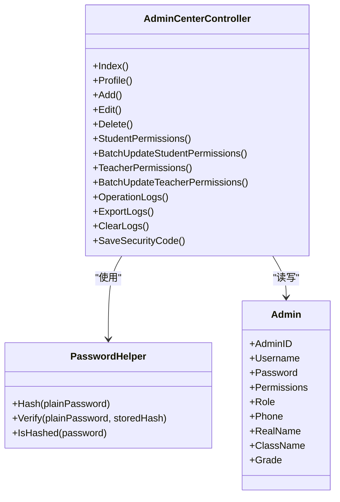

# 管理员中心API

<cite>
**本文档引用的文件**
- [Controllers/AdminCenterController.cs](file://Controllers/AdminCenterController.cs)
- [Models/Admin.cs](file://Models/Admin.cs)
- [Models/Models.cs](file://Models/Models.cs)
- [Services/PasswordHelper.cs](file://Services/PasswordHelper.cs)
- [Views/AdminCenter/Index.cshtml](file://Views/AdminCenter/Index.cshtml)
- [Views/AdminCenter/Profile.cshtml](file://Views/AdminCenter/Profile.cshtml)
- [Views/AdminCenter/OperationLogs.cshtml](file://Views/AdminCenter/OperationLogs.cshtml)
- [Views/AdminCenter/StudentPermissions.cshtml](file://Views/AdminCenter/StudentPermissions.cshtml)
- [Views/AdminCenter/TeacherPermissions.cshtml](file://Views/AdminCenter/TeacherPermissions.cshtml)
</cite>

## 目录
1. [简介](#简介)
2. [项目结构](#项目结构)
3. [核心组件](#核心组件)
4. [架构概览](#架构概览)
5. [详细组件分析](#详细组件分析)
6. [依赖关系分析](#依赖关系分析)
7. [性能考虑](#性能考虑)
8. [故障排除指南](#故障排除指南)
9. [结论](#结论)

## 简介
本文件为管理员中心功能的API接口文档，涵盖以下核心功能模块：
- 管理员个人资料管理：个人信息查看与修改、权限控制、AJAX异步更新
- 用户管理：管理员的添加、编辑、删除及批量操作
- 权限管理：学生权限与教职工权限的批量分配与更新机制
- 操作日志管理：日志查询、筛选、导出与清理
- 安全策略：权限验证、数据验证与密码安全机制

本API基于ASP.NET Core MVC实现，采用基于角色的访问控制（RBAC），通过Claims身份标识进行权限判定，并结合防CSRF令牌确保请求安全性。

## 项目结构
管理员中心相关的后端控制器位于Controllers/AdminCenterController.cs，前端视图位于Views/AdminCenter/目录下，数据模型定义于Models/Models.cs，密码处理逻辑位于Services/PasswordHelper.cs。

**图表来源**
- [Controllers/AdminCenterController.cs:12-473](file://Controllers/AdminCenterController.cs#L12-L473)
- [Models/Models.cs:6-86](file://Models/Models.cs#L6-L86)
- [Services/PasswordHelper.cs:8-41](file://Services/PasswordHelper.cs#L8-L41)
- [Views/AdminCenter/Index.cshtml:1-252](file://Views/AdminCenter/Index.cshtml#L1-L252)
- [Views/AdminCenter/Profile.cshtml:1-233](file://Views/AdminCenter/Profile.cshtml#L1-L233)
- [Views/AdminCenter/OperationLogs.cshtml:1-194](file://Views/AdminCenter/OperationLogs.cshtml#L1-L194)
- [Views/AdminCenter/StudentPermissions.cshtml:1-118](file://Views/AdminCenter/StudentPermissions.cshtml#L1-L118)
- [Views/AdminCenter/TeacherPermissions.cshtml:1-124](file://Views/AdminCenter/TeacherPermissions.cshtml#L1-L124)

**章节来源**
- [Controllers/AdminCenterController.cs:12-473](file://Controllers/AdminCenterController.cs#L12-L473)
- [Models/Models.cs:6-86](file://Models/Models.cs#L6-L86)

## 核心组件
- AdminCenterController：提供管理员中心的所有API接口，包括个人资料管理、用户管理、权限管理和操作日志管理。
- Admin模型：存储管理员账户信息、角色、权限字符串以及扩展字段。
- PasswordHelper：提供密码哈希与校验，兼容旧版明文密码。
- 视图层：负责渲染管理员中心页面，配合JavaScript实现AJAX异步交互。

**章节来源**
- [Controllers/AdminCenterController.cs:12-473](file://Controllers/AdminCenterController.cs#L12-L473)
- [Models/Admin.cs:1-3](file://Models/Admin.cs#L1-L3)
- [Models/Models.cs:6-86](file://Models/Models.cs#L6-L86)
- [Services/PasswordHelper.cs:8-41](file://Services/PasswordHelper.cs#L8-L41)

## 架构概览
管理员中心API采用经典的MVC架构，控制器负责处理HTTP请求、调用业务逻辑与数据访问层，视图层负责渲染页面与异步交互。权限控制通过[Authorize]特性与Claims角色实现，数据持久化通过Entity Framework Core完成。

**图表来源**
- [Controllers/AdminCenterController.cs:12-473](file://Controllers/AdminCenterController.cs#L12-L473)
- [Services/PasswordHelper.cs:8-41](file://Services/PasswordHelper.cs#L8-L41)

## 详细组件分析

### 管理员个人资料管理API
- 接口概述
  - GET /AdminCenter/Profile：加载当前管理员的个人资料，支持模态框AJAX异步加载。
  - POST /AdminCenter/Profile：更新个人资料，根据权限控制允许修改的字段；支持管理员直接修改密码与非管理员通过特定格式修改密码。
- 权限控制
  - 通过Claims中的角色与Permissions字符串决定可编辑字段：profile_basic、profile_phone、profile_idcard、profile_cert。
  - 管理员拥有全部权限，非管理员仅能按授权范围修改。
- 数据验证与安全
  - 手机号唯一性检查，避免重复。
  - 非管理员修改密码时需提供旧密码并满足新密码规则（至少8位且包含字母与数字）。
  - 使用防CSRF令牌与AJAX请求头识别实现异步更新。
- 响应格式
  - HTML视图：返回Profile页面。
  - AJAX：返回JSON对象{success, message}。

**图表来源**
- [Controllers/AdminCenterController.cs:33-151](file://Controllers/AdminCenterController.cs#L33-L151)
- [Services/PasswordHelper.cs:8-41](file://Services/PasswordHelper.cs#L8-L41)

**章节来源**
- [Controllers/AdminCenterController.cs:33-151](file://Controllers/AdminCenterController.cs#L33-L151)
- [Views/AdminCenter/Profile.cshtml:1-233](file://Views/AdminCenter/Profile.cshtml#L1-L233)

### 用户管理API
- 接口概述
  - GET /AdminCenter/Index：列出管理员列表，支持安全码配置展示。
  - POST /AdminCenter/Add：添加新管理员，用户名唯一性校验。
  - POST /AdminCenter/Edit：编辑管理员信息，支持用户名唯一性校验与密码更新。
  - POST /AdminCenter/Delete：删除管理员，禁止删除超级管理员。
  - POST /AdminCenter/SaveSecurityCode：保存安全码（仅管理员）。
- 数据验证与安全
  - 所有提交均包含防CSRF令牌。
  - 超级管理员账户名限制，防止被删除。
  - AJAX异步交互，返回统一JSON结构。
- 响应格式
  - JSON：{success, message}。

**图表来源**
- [Controllers/AdminCenterController.cs:170-241](file://Controllers/AdminCenterController.cs#L170-L241)

**章节来源**
- [Controllers/AdminCenterController.cs:170-241](file://Controllers/AdminCenterController.cs#L170-L241)
- [Views/AdminCenter/Index.cshtml:1-252](file://Views/AdminCenter/Index.cshtml#L1-L252)

### 权限管理API
- 学生权限批量管理
  - GET /AdminCenter/StudentPermissions：进入批量学生权限管理页面。
  - POST /AdminCenter/BatchUpdateStudentPermissions：批量更新班主任的学生操作权限（student_edit、student_delete、student_add），保留其他权限不变。
- 教职工权限批量管理
  - GET /AdminCenter/TeacherPermissions：进入批量个人中心权限管理页面。
  - POST /AdminCenter/BatchUpdateTeacherPermissions：批量更新教职工在个人中心的权限（profile_basic、profile_phone、profile_idcard、profile_cert），保留学生权限不变。
- 权限控制
  - 仅管理员可访问权限管理页面与执行批量更新。
  - 权限字符串以逗号分隔，更新时过滤并重新组合。
- 响应格式
  - JSON：{success, message}。

**图表来源**
- [Controllers/AdminCenterController.cs:243-337](file://Controllers/AdminCenterController.cs#L243-L337)

**章节来源**
- [Controllers/AdminCenterController.cs:243-337](file://Controllers/AdminCenterController.cs#L243-L337)
- [Views/AdminCenter/StudentPermissions.cshtml:1-118](file://Views/AdminCenter/StudentPermissions.cshtml#L1-L118)
- [Views/AdminCenter/TeacherPermissions.cshtml:1-124](file://Views/AdminCenter/TeacherPermissions.cshtml#L1-L124)

### 操作日志管理API
- 日志查询与筛选
  - GET /AdminCenter/OperationLogs：分页查询操作日志，支持按操作类型与关键词筛选，统计总数与当日数量。
- 日志导出
  - GET /AdminCenter/ExportLogs：导出筛选后的日志为Excel文件。
- 日志清理
  - POST /AdminCenter/ClearLogs：清空所有操作日志（仅管理员）。
- 响应格式
  - HTML视图：返回日志列表页面。
  - Excel文件：application/vnd.openxmlformats-officedocument.spreadsheetml.sheet。
  - JSON：{success, message}。

**图表来源**
- [Controllers/AdminCenterController.cs:339-439](file://Controllers/AdminCenterController.cs#L339-L439)

**章节来源**
- [Controllers/AdminCenterController.cs:339-439](file://Controllers/AdminCenterController.cs#L339-L439)
- [Views/AdminCenter/OperationLogs.cshtml:1-194](file://Views/AdminCenter/OperationLogs.cshtml#L1-L194)

## 依赖关系分析
- 控制器依赖
  - AdminCenterController依赖AppDbContext进行数据访问，依赖PasswordHelper进行密码处理。
- 视图依赖
  - 各视图通过URL辅助方法生成API链接，使用jQuery与Bootstrap实现交互。
- 模型依赖
  - Admin模型包含Permissions字符串用于权限控制，SiteConfig用于存储安全码配置。

**图表来源**
- [Controllers/AdminCenterController.cs:12-473](file://Controllers/AdminCenterController.cs#L12-L473)
- [Services/PasswordHelper.cs:8-41](file://Services/PasswordHelper.cs#L8-L41)
- [Models/Models.cs:6-86](file://Models/Models.cs#L6-L86)

**章节来源**
- [Controllers/AdminCenterController.cs:12-473](file://Controllers/AdminCenterController.cs#L12-L473)
- [Services/PasswordHelper.cs:8-41](file://Services/PasswordHelper.cs#L8-L41)
- [Models/Models.cs:6-86](file://Models/Models.cs#L6-L86)

## 性能考虑
- 分页查询：日志查询默认每页20条，减少一次性传输大量数据。
- 索引建议：对OperationLog的CreateTime、OperatorName、ActionType建立索引可提升筛选与排序性能。
- 权限字符串解析：权限分割与包含检查为O(n)操作，建议在权限频繁变更场景下考虑缓存策略。
- 导出Excel：使用ClosedXML进行内存流处理，注意大数据量导出时的内存占用。

## 故障排除指南
- 权限不足
  - 现象：访问权限管理或日志管理返回403。
  - 处理：确认当前用户角色为管理员，检查Claims中的Role与Permissions。
- 手机号冲突
  - 现象：更新个人资料时报手机号已被使用。
  - 处理：修改为未被使用的手机号或保持原手机号。
- 非管理员密码修改失败
  - 现象：提示原密码错误或新密码不符合规则。
  - 处理：提供正确的旧密码，新密码需至少8位且包含字母与数字。
- 超级管理员删除失败
  - 现象：删除失败并提示不能删除超级管理员。
  - 处理：避免对特殊用户名执行删除操作。
- AJAX请求失败
  - 现象：异步更新无响应或报网络错误。
  - 处理：检查防CSRF令牌与请求头，确认前端脚本正确发送__RequestVerificationToken。

**章节来源**
- [Controllers/AdminCenterController.cs:60-151](file://Controllers/AdminCenterController.cs#L60-L151)
- [Controllers/AdminCenterController.cs:170-241](file://Controllers/AdminCenterController.cs#L170-L241)
- [Controllers/AdminCenterController.cs:243-337](file://Controllers/AdminCenterController.cs#L243-L337)
- [Controllers/AdminCenterController.cs:339-439](file://Controllers/AdminCenterController.cs#L339-L439)

## 结论
管理员中心API提供了完整的后台管理能力，涵盖个人资料管理、用户管理、权限管理与操作日志管理。通过基于角色的权限控制与防CSRF保护，确保了系统的安全性与稳定性。建议在生产环境中进一步优化日志查询性能并加强权限缓存策略，以提升用户体验与系统吞吐量。