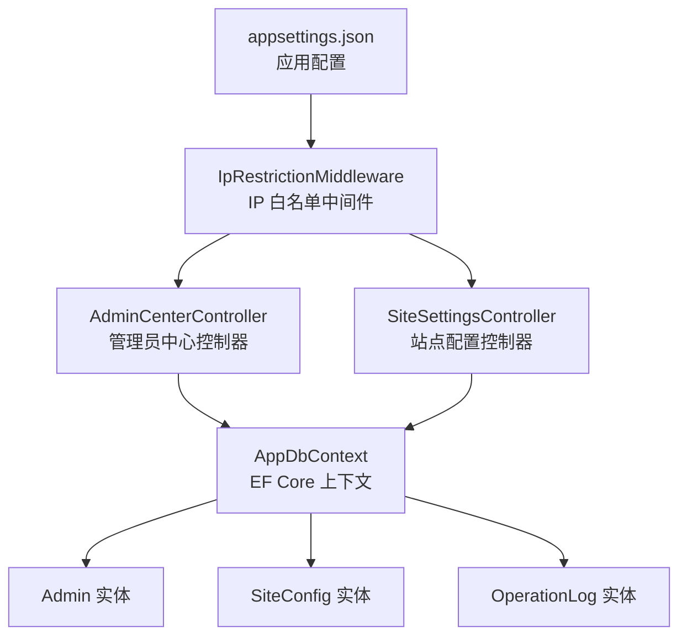
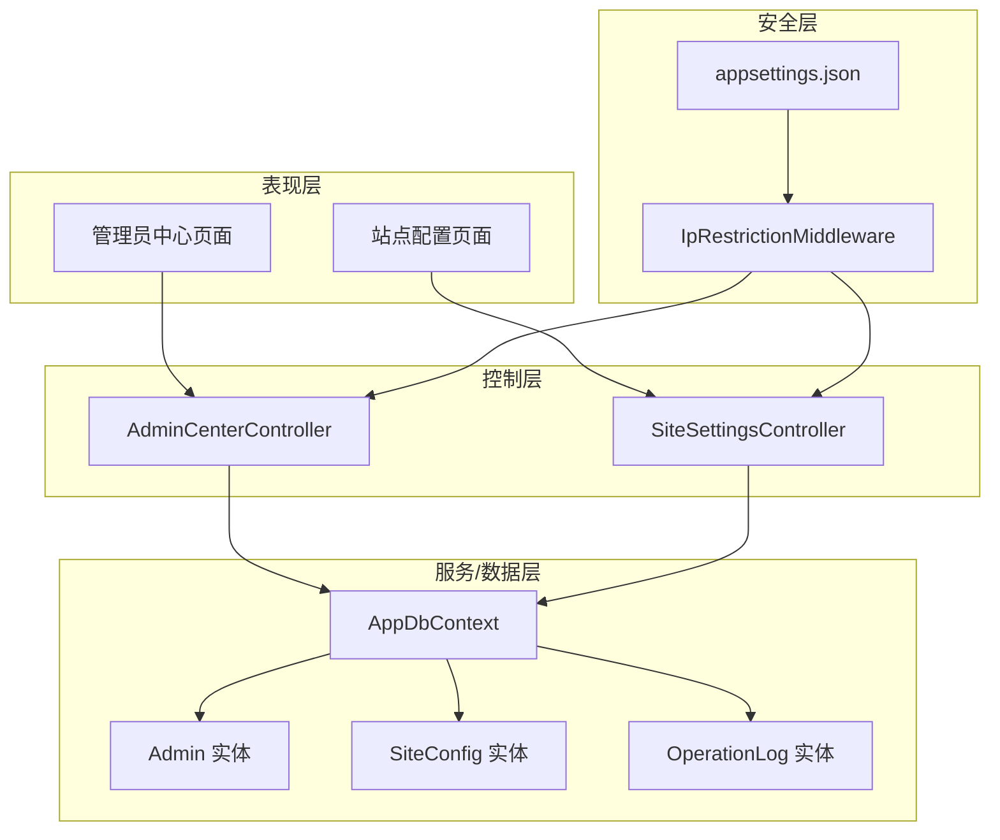
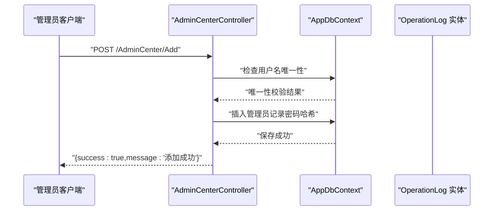
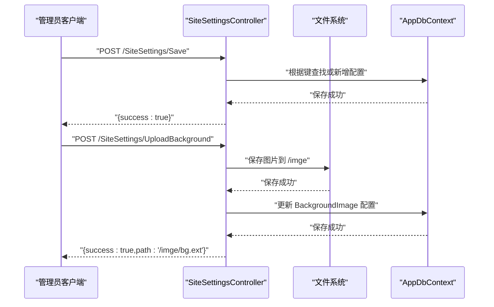
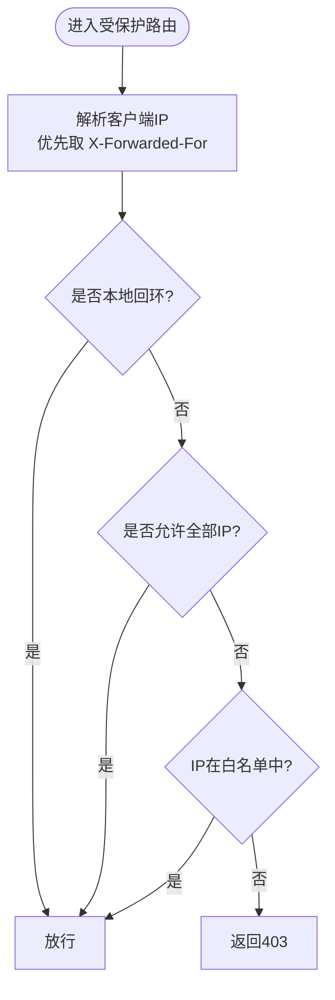
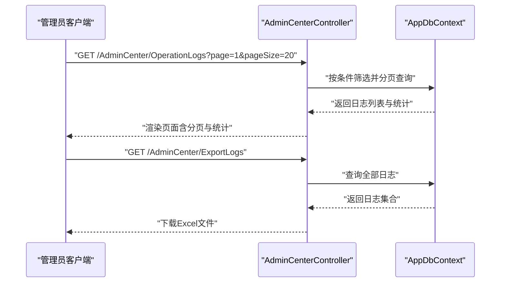
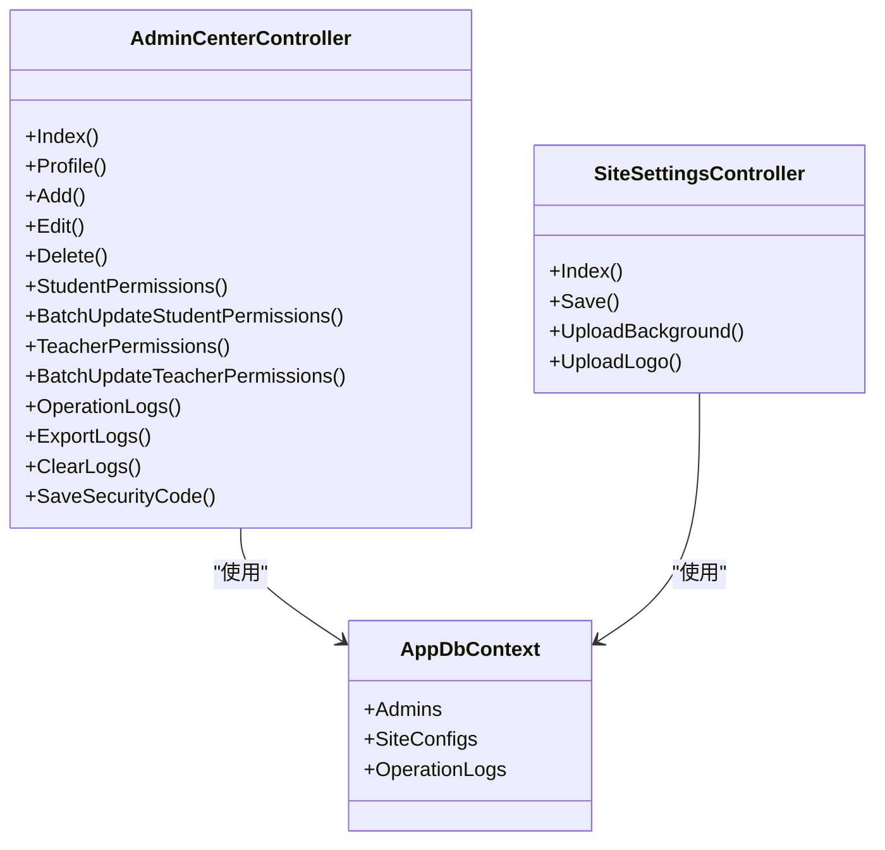
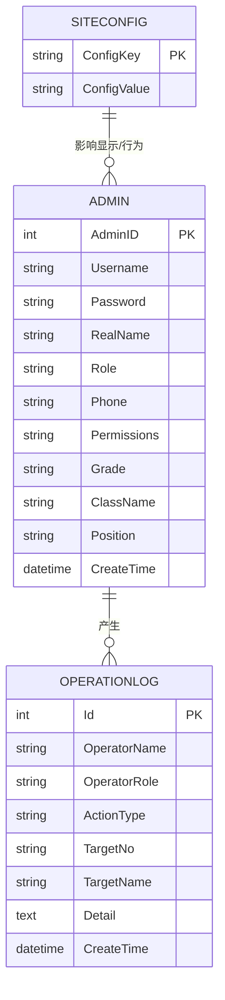

# 系统管理API

<cite>
**本文档引用的文件**
- [Controllers/AdminCenterController.cs](file://Controllers/AdminCenterController.cs)
- [Controllers/SiteSettingsController.cs](file://Controllers/SiteSettingsController.cs)
- [Data/AppDbContext.cs](file://Data/AppDbContext.cs)
- [Models/Admin.cs](file://Models/Admin.cs)
- [Models/Models.cs](file://Models/Models.cs)
- [Middleware/IpRestrictionMiddleware.cs](file://Middleware/IpRestrictionMiddleware.cs)
- [appsettings.json](file://appsettings.json)
</cite>

## 目录
1. [简介](#简介)
2. [项目结构](#项目结构)
3. [核心组件](#核心组件)
4. [架构总览](#架构总览)
5. [详细组件分析](#详细组件分析)
6. [依赖关系分析](#依赖关系分析)
7. [性能考虑](#性能考虑)
8. [故障排查指南](#故障排查指南)
9. [结论](#结论)
10. [附录](#附录)

## 简介
本文件面向系统管理员与后端开发者，系统化梳理“系统管理”相关API接口，覆盖管理员中心（用户管理、权限分配、操作日志）、站点配置（系统参数、功能开关、全局配置）、权限管理（角色定义、权限分配、访问控制）、系统监控（性能指标、日志管理、故障诊断）等模块。文档提供接口定义、数据模型、调用流程、安全与合规要点及常见问题排查建议。

## 项目结构
- 控制器层：AdminCenterController（管理员中心）、SiteSettingsController（站点配置）
- 数据访问层：AppDbContext（EF Core上下文）
- 模型层：Admin、SiteConfig、OperationLog 等实体
- 安全中间件：IP白名单限制
- 配置：appsettings.json（数据库连接、IP白名单、日志级别）

图表来源
- [Controllers/AdminCenterController.cs:12-491](file://Controllers/AdminCenterController.cs#L12-L491)
- [Controllers/SiteSettingsController.cs:9-139](file://Controllers/SiteSettingsController.cs#L9-L139)
- [Data/AppDbContext.cs:6-312](file://Data/AppDbContext.cs#L6-L312)
- [Middleware/IpRestrictionMiddleware.cs:10-98](file://Middleware/IpRestrictionMiddleware.cs#L10-L98)
- [appsettings.json:1-16](file://appsettings.json#L1-L16)

章节来源
- [Controllers/AdminCenterController.cs:12-491](file://Controllers/AdminCenterController.cs#L12-L491)
- [Controllers/SiteSettingsController.cs:9-139](file://Controllers/SiteSettingsController.cs#L9-L139)
- [Data/AppDbContext.cs:6-312](file://Data/AppDbContext.cs#L6-L312)
- [Middleware/IpRestrictionMiddleware.cs:10-98](file://Middleware/IpRestrictionMiddleware.cs#L10-L98)
- [appsettings.json:1-16](file://appsettings.json#L1-L16)

## 核心组件
- 管理员中心控制器（AdminCenterController）
  - 用户管理：新增、编辑、删除管理员账号
  - 权限管理：批量更新学生权限、批量更新教师个人资料权限
  - 操作日志：查询、导出、清空
  - 安全码：保存安全码
  - 个人资料：查看/修改（按权限拆分字段）
- 站点配置控制器（SiteSettingsController）
  - 参数保存：键值对保存
  - 资源上传：背景图、Logo上传并写入配置
- 数据上下文（AppDbContext）
  - 管理员、站点配置、操作日志等实体映射
- 权限与访问控制
  - 基于角色“管理员”的授权
  - 基于权限字符串的细粒度字段级控制
  - IP白名单中间件
- 配置与环境
  - appsettings.json 中的数据库连接、IP白名单、日志级别

章节来源
- [Controllers/AdminCenterController.cs:12-491](file://Controllers/AdminCenterController.cs#L12-L491)
- [Controllers/SiteSettingsController.cs:9-139](file://Controllers/SiteSettingsController.cs#L9-L139)
- [Data/AppDbContext.cs:6-312](file://Data/AppDbContext.cs#L6-L312)
- [Middleware/IpRestrictionMiddleware.cs:10-98](file://Middleware/IpRestrictionMiddleware.cs#L10-L98)
- [appsettings.json:1-16](file://appsettings.json#L1-L16)

## 架构总览
系统采用经典的三层架构：控制器负责HTTP请求处理与授权校验，数据上下文负责实体映射与持久化，中间件负责全局安全策略（IP白名单）。管理员中心与站点配置分别承担用户与配置两大管理域。

图表来源
- [Controllers/AdminCenterController.cs:12-491](file://Controllers/AdminCenterController.cs#L12-L491)
- [Controllers/SiteSettingsController.cs:9-139](file://Controllers/SiteSettingsController.cs#L9-L139)
- [Data/AppDbContext.cs:6-312](file://Data/AppDbContext.cs#L6-L312)
- [Middleware/IpRestrictionMiddleware.cs:10-98](file://Middleware/IpRestrictionMiddleware.cs#L10-L98)
- [appsettings.json:1-16](file://appsettings.json#L1-L16)

## 详细组件分析

### 管理员中心（AdminCenterController）
- 授权与入口
  - 所有方法均标注 [Authorize]，仅管理员可访问
  - 通过 Claims 中的 AdminID、Role 进行身份识别与权限判断
- 用户管理
  - 新增：校验用户名唯一性，哈希密码后入库
  - 编辑：支持用户名、密码、姓名、电话等字段更新
  - 删除：禁止删除超级管理员账号
- 权限管理
  - 学生权限：支持批量更新 edit/delete/add_student
  - 教职工个人资料权限：支持批量更新 profile_basic/phone/idcard/cert
- 操作日志
  - 查询：支持按操作类型、关键词筛选，分页返回
  - 导出：生成Excel报表（操作人、角色、类型、目标、详情、时间）
  - 清空：管理员可清空全部日志
- 安全码
  - 保存系统安全码到 SiteConfig
- 个人资料
  - 按权限拆分字段编辑：基础信息、电话、身份证、证书
  - 密码修改：管理员可直接设置；普通用户需提供旧密码并满足强度规则

图表来源
- [Controllers/AdminCenterController.cs:187-241](file://Controllers/AdminCenterController.cs#L187-L241)
- [Data/AppDbContext.cs:6-312](file://Data/AppDbContext.cs#L6-L312)

章节来源
- [Controllers/AdminCenterController.cs:12-491](file://Controllers/AdminCenterController.cs#L12-L491)
- [Data/AppDbContext.cs:6-312](file://Data/AppDbContext.cs#L6-L312)

### 站点配置（SiteSettingsController）
- 参数保存
  - 键值对保存到 SiteConfig 表，键唯一
- 资源上传
  - 背景图：仅支持 JPG/JPEG/PNG，保存至 wwwroot/imge，路径写入配置
  - Logo：同上
- 访问控制
  - 上传接口忽略防伪标记（IgnoreAntiforgeryToken），需配合IP白名单与HTTPS

图表来源
- [Controllers/SiteSettingsController.cs:28-137](file://Controllers/SiteSettingsController.cs#L28-L137)
- [Data/AppDbContext.cs:6-312](file://Data/AppDbContext.cs#L6-L312)

章节来源
- [Controllers/SiteSettingsController.cs:9-139](file://Controllers/SiteSettingsController.cs#L9-L139)
- [Data/AppDbContext.cs:6-312](file://Data/AppDbContext.cs#L6-L312)

### 权限管理与访问控制
- 角色与权限
  - 角色：管理员（具备最高权限）
  - 权限字符串：以逗号分隔，如 student_edit、student_delete、student_add、profile_basic、profile_phone、profile_idcard、profile_cert
- 字段级控制
  - 个人资料编辑时，依据权限决定可编辑字段
- IP白名单
  - 通过 appsettings.json 的 IpRestriction:AllowedIPs 配置
  - 放行登录页与静态资源路径
  - 支持反向代理场景下的 X-Forwarded-For 解析

图表来源
- [Middleware/IpRestrictionMiddleware.cs:34-96](file://Middleware/IpRestrictionMiddleware.cs#L34-L96)
- [appsettings.json:9-11](file://appsettings.json#L9-L11)

章节来源
- [Controllers/AdminCenterController.cs:34-151](file://Controllers/AdminCenterController.cs#L34-L151)
- [Middleware/IpRestrictionMiddleware.cs:10-98](file://Middleware/IpRestrictionMiddleware.cs#L10-L98)
- [appsettings.json:1-16](file://appsettings.json#L1-L16)

### 系统监控与审计
- 操作日志
  - 记录操作人、角色、类型、目标、详情、时间
  - 提供查询、导出、清空能力
- 性能与可用性
  - 日志查询支持分页与统计
  - Excel导出便于离线分析

图表来源
- [Controllers/AdminCenterController.cs:339-439](file://Controllers/AdminCenterController.cs#L339-L439)
- [Data/AppDbContext.cs:6-312](file://Data/AppDbContext.cs#L6-L312)

章节来源
- [Controllers/AdminCenterController.cs:339-439](file://Controllers/AdminCenterController.cs#L339-L439)
- [Data/AppDbContext.cs:6-312](file://Data/AppDbContext.cs#L6-L312)

## 依赖关系分析
- 控制器依赖数据上下文进行实体CRUD
- 管理员中心依赖权限字符串实现字段级控制
- 站点配置依赖文件系统与配置表
- IP白名单中间件贯穿所有请求，除放行路径外均进行校验

图表来源
- [Controllers/AdminCenterController.cs:12-491](file://Controllers/AdminCenterController.cs#L12-L491)
- [Controllers/SiteSettingsController.cs:9-139](file://Controllers/SiteSettingsController.cs#L9-L139)
- [Data/AppDbContext.cs:6-312](file://Data/AppDbContext.cs#L6-L312)

章节来源
- [Controllers/AdminCenterController.cs:12-491](file://Controllers/AdminCenterController.cs#L12-L491)
- [Controllers/SiteSettingsController.cs:9-139](file://Controllers/SiteSettingsController.cs#L9-L139)
- [Data/AppDbContext.cs:6-312](file://Data/AppDbContext.cs#L6-L312)

## 性能考虑
- 分页查询：日志查询与用户列表均支持分页，避免一次性加载大量数据
- 索引与查询：建议在操作日志的创建时间、操作类型、目标字段建立索引以提升查询性能
- 导出优化：导出逻辑一次性拉取数据并写入Excel，建议在低峰时段执行或限制导出范围
- 文件上传：图片上传后写入磁盘与配置表，注意磁盘空间与IO开销

## 故障排查指南
- 403 访问被拒绝
  - 检查 IP 白名单配置与反向代理头 X-Forwarded-For
  - 确认请求路径未被放行（登录页与静态资源除外）
- 无法保存配置/上传失败
  - 检查 wwwroot/imge 目录权限与磁盘空间
  - 确认文件扩展名符合要求（JPG/JPEG/PNG）
- 密码修改失败
  - 普通用户需提供正确旧密码且新密码满足长度与字符要求
- 日志为空或查询异常
  - 检查筛选条件与分页参数
  - 确认数据库中存在 OperationLog 数据

章节来源
- [Middleware/IpRestrictionMiddleware.cs:34-96](file://Middleware/IpRestrictionMiddleware.cs#L34-L96)
- [Controllers/SiteSettingsController.cs:50-137](file://Controllers/SiteSettingsController.cs#L50-L137)
- [Controllers/AdminCenterController.cs:60-151](file://Controllers/AdminCenterController.cs#L60-L151)

## 结论
本系统通过控制器、数据上下文与中间件协同，实现了管理员中心、站点配置、权限控制与审计日志的完整闭环。建议在生产环境中启用HTTPS、严格IP白名单、定期清理日志与备份数据库，并对敏感操作增加二次确认与审计追踪。

## 附录

### 数据模型与字段说明
- 管理员（Admin）
  - 关键字段：AdminID、Username、Password、RealName、Role、Phone、Permissions、Grade、ClassName、Position、CreateTime
  - 权限字符串示例：student_edit,student_delete,student_add,profile_basic,profile_phone,profile_idcard,profile_cert
- 站点配置（SiteConfig）
  - 关键字段：ConfigKey、ConfigValue
- 操作日志（OperationLog）
  - 关键字段：OperatorName、OperatorRole、ActionType、TargetNo、TargetName、Detail、CreateTime

图表来源
- [Models/Models.cs:6-86](file://Models/Models.cs#L6-L86)
- [Models/Models.cs:167-175](file://Models/Models.cs#L167-L175)
- [Models/Models.cs:236-260](file://Models/Models.cs#L236-L260)
- [Data/AppDbContext.cs:35-49](file://Data/AppDbContext.cs#L35-L49)
- [Data/AppDbContext.cs:81-88](file://Data/AppDbContext.cs#L81-L88)
- [Data/AppDbContext.cs:137-150](file://Data/AppDbContext.cs#L137-L150)

章节来源
- [Models/Models.cs:6-86](file://Models/Models.cs#L6-L86)
- [Models/Models.cs:167-175](file://Models/Models.cs#L167-L175)
- [Models/Models.cs:236-260](file://Models/Models.cs#L236-L260)
- [Data/AppDbContext.cs:35-49](file://Data/AppDbContext.cs#L35-L49)
- [Data/AppDbContext.cs:81-88](file://Data/AppDbContext.cs#L81-L88)
- [Data/AppDbContext.cs:137-150](file://Data/AppDbContext.cs#L137-L150)

### 安全与合规要点
- 身份认证与授权
  - 所有管理接口均需管理员角色
  - 个人资料编辑按权限字段拆分控制
- 传输安全
  - 建议启用 HTTPS，防止凭证与日志泄露
- 访问控制
  - IP白名单中间件限制访问来源
  - 登录页与静态资源路径放行
- 数据保护
  - 密码使用哈希存储
  - 上传文件扩展名校验与路径写入配置
- 审计与追溯
  - 操作日志记录关键动作，支持导出与清空
  - 建议对高风险操作（删除、清空）增加二次确认与审批

章节来源
- [Controllers/AdminCenterController.cs:12-491](file://Controllers/AdminCenterController.cs#L12-L491)
- [Controllers/SiteSettingsController.cs:9-139](file://Controllers/SiteSettingsController.cs#L9-L139)
- [Middleware/IpRestrictionMiddleware.cs:10-98](file://Middleware/IpRestrictionMiddleware.cs#L10-L98)
- [appsettings.json:1-16](file://appsettings.json#L1-L16)