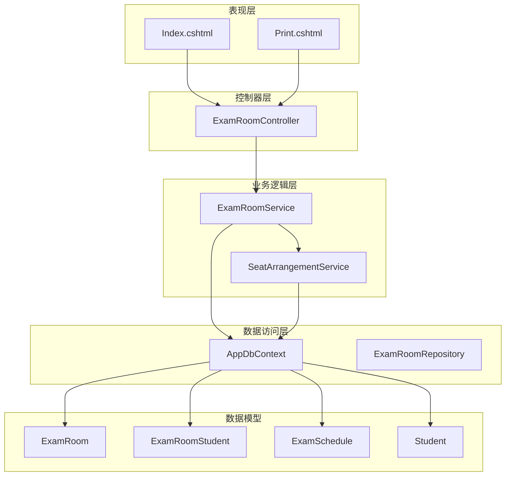
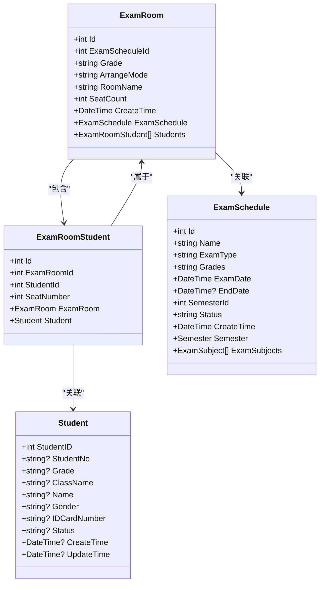
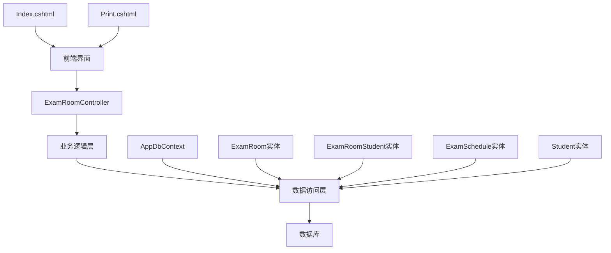
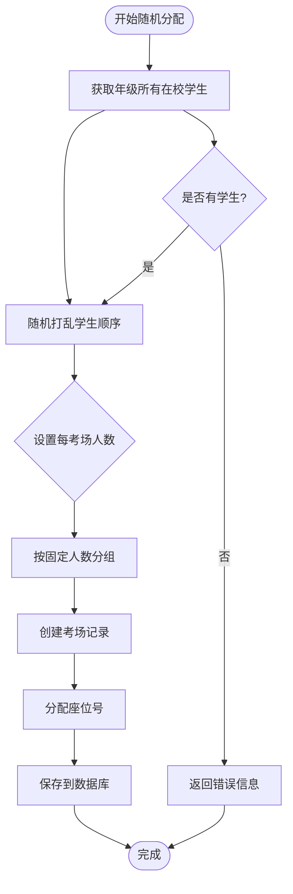
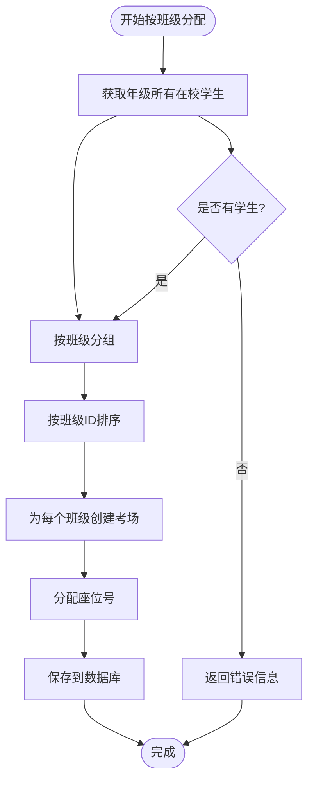
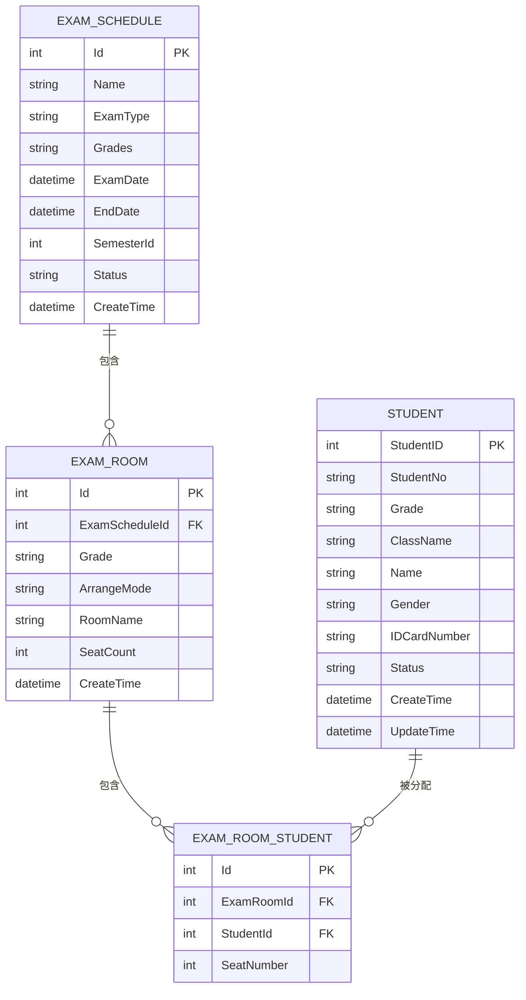
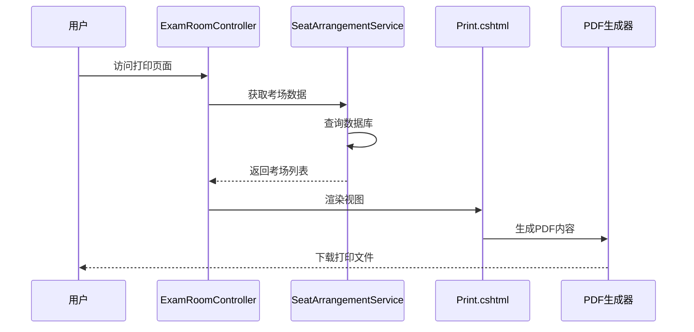
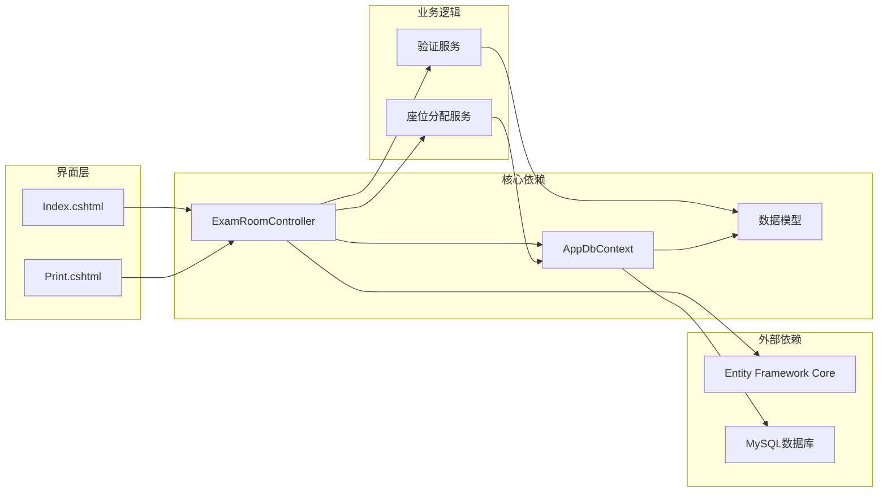
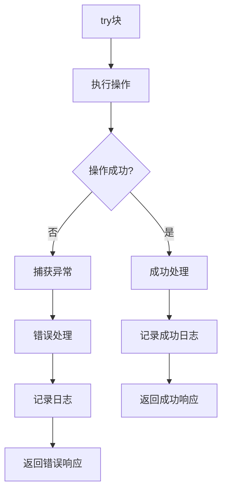

# 考场管理

<cite>
**本文档引用的文件**
- [ExamRoomController.cs](file://Controllers/ExamRoomController.cs)
- [Models.cs](file://Models/Models.cs)
- [AppDbContext.cs](file://Data/AppDbContext.cs)
- [20260610054012_AddExamRoom.cs](file://Migrations/20260610054012_AddExamRoom.cs)
- [Index.cshtml](file://Views/ExamRoom/Index.cshtml)
- [Print.cshtml](file://Views/ExamRoom/Print.cshtml)
- [ExamSchedule.cs](file://Models/ExamSchedule.cs)
- [GradeModels.cs](file://Models/GradeModels.cs)
</cite>

## 目录
1. [简介](#简介)
2. [项目结构](#项目结构)
3. [核心组件](#核心组件)
4. [架构概览](#架构概览)
5. [详细组件分析](#详细组件分析)
6. [依赖关系分析](#依赖关系分析)
7. [性能考虑](#性能考虑)
8. [故障排除指南](#故障排除指南)
9. [结论](#结论)

## 简介

本文件详细记录了学生管理系统中的考场管理API，包括考场信息的CRUD接口、数据结构定义、容量计算算法、座位安排策略以及与考试计划的关联机制。系统采用ASP.NET Core MVC架构，使用Entity Framework Core进行数据持久化，支持两种座位分配模式：随机分配和按原班级分配。

## 项目结构

系统采用经典的三层架构设计，主要包含以下模块：

**图表来源**
- [ExamRoomController.cs:1-200](file://Controllers/ExamRoomController.cs#L1-L200)
- [AppDbContext.cs:1-312](file://Data/AppDbContext.cs#L1-L312)

**章节来源**
- [ExamRoomController.cs:1-200](file://Controllers/ExamRoomController.cs#L1-L200)
- [AppDbContext.cs:1-312](file://Data/AppDbContext.cs#L1-L312)

## 核心组件

### 考场实体模型

系统定义了完整的考场管理数据模型，包括考场基本信息、座位分配和关联关系：

**图表来源**
- [Models.cs:414-462](file://Models/Models.cs#L414-L462)
- [ExamSchedule.cs:1-47](file://Models/ExamSchedule.cs#L1-L47)

### 考场管理控制器

ExamRoomController提供了完整的考场管理API，包括：

- **考场安排生成**：支持随机分配和按原班级分配两种模式
- **考场清理**：批量删除指定考试和年级的考场安排
- **考场打印**：生成PDF格式的考场安排表
- **考场查询**：按考试计划和年级查询考场信息

**章节来源**
- [ExamRoomController.cs:10-200](file://Controllers/ExamRoomController.cs#L10-L200)

## 架构概览

系统采用分层架构，各层职责明确：

**图表来源**
- [ExamRoomController.cs:1-200](file://Controllers/ExamRoomController.cs#L1-L200)
- [AppDbContext.cs:1-312](file://Data/AppDbContext.cs#L1-L312)

## 详细组件分析

### 考场容量计算算法

系统实现了两种座位分配策略：

#### 随机分配模式 (Shuffle)

**图表来源**
- [ExamRoomController.cs:78-140](file://Controllers/ExamRoomController.cs#L78-L140)

#### 按原班级分配模式 (InClass)

**图表来源**
- [ExamRoomController.cs:91-140](file://Controllers/ExamRoomController.cs#L91-L140)

### 考场与考试计划的关联机制

系统通过外键关联实现考场与考试计划的强约束关系：

**图表来源**
- [Models.cs:414-462](file://Models/Models.cs#L414-L462)
- [AppDbContext.cs:255-279](file://Data/AppDbContext.cs#L255-L279)

### 考场状态管理

系统实现了基于考试计划状态的考场管理：

| 考试计划状态 | 可用性 | 考场操作限制 |
|-------------|--------|-------------|
| 未开始 | ✅ 完全可用 | 可创建、编辑、删除考场 |
| 进行中 | ⚠️ 部分受限 | 可查看，不可删除 |
| 已结束 | ❌ 不可用 | 不可操作 |

**章节来源**
- [ExamSchedule.cs:34-36](file://Models/ExamSchedule.cs#L34-L36)

### 考场打印功能

系统提供专业的考场打印功能，支持多列布局和PDF导出：

**图表来源**
- [ExamRoomController.cs:166-182](file://Controllers/ExamRoomController.cs#L166-L182)
- [Print.cshtml:1-84](file://Views/ExamRoom/Print.cshtml#L1-L84)

**章节来源**
- [Print.cshtml:32-74](file://Views/ExamRoom/Print.cshtml#L32-L74)

## 依赖关系分析

系统各组件之间的依赖关系如下：

**图表来源**
- [AppDbContext.cs:1-312](file://Data/AppDbContext.cs#L1-L312)
- [ExamRoomController.cs:1-200](file://Controllers/ExamRoomController.cs#L1-L200)

**章节来源**
- [AppDbContext.cs:31-312](file://Data/AppDbContext.cs#L31-L312)

## 性能考虑

### 数据库优化策略

1. **索引优化**
   - ExamRoom表的ExamScheduleId列建立索引
   - ExamRoomStudent表的ExamRoomId和StudentId列建立索引

2. **查询优化**
   - 使用Include方法预加载关联数据
   - 实施分页查询避免大数据集加载

3. **缓存策略**
   - 考试计划信息可缓存减少数据库查询

### 内存管理

- 合理使用异步编程避免阻塞线程
- 及时释放数据库连接和上下文对象
- 对大对象使用流式处理

## 故障排除指南

### 常见问题及解决方案

| 问题类型 | 症状 | 可能原因 | 解决方案 |
|---------|------|---------|---------|
| 数据库连接失败 | 连接超时或拒绝 | 数据库配置错误 | 检查连接字符串和数据库服务状态 |
| 考场生成失败 | 返回错误信息 | 学生数据异常 | 验证学生状态和年级信息 |
| 打印格式错误 | PDF内容错位 | CSS样式问题 | 检查Print.cshtml中的样式定义 |
| 权限不足 | 401/403错误 | 角色权限配置 | 确认用户具有管理员角色 |

### 错误处理机制

系统实现了完善的错误处理机制：

**图表来源**
- [ExamRoomController.cs:144-147](file://Controllers/ExamRoomController.cs#L144-L147)

**章节来源**
- [ExamRoomController.cs:184-198](file://Controllers/ExamRoomController.cs#L184-L198)

## 结论

本考场管理系统提供了完整的考试安排解决方案，具有以下特点：

1. **功能完整**：支持两种座位分配模式，提供打印功能
2. **数据安全**：通过外键约束确保数据完整性
3. **用户体验**：直观的界面设计和清晰的操作流程
4. **扩展性强**：模块化设计便于功能扩展和维护

系统通过合理的架构设计和完善的错误处理机制，为学校考试管理工作提供了可靠的技术支撑。建议在实际部署中重点关注数据库性能优化和用户权限管理，以确保系统的稳定运行。