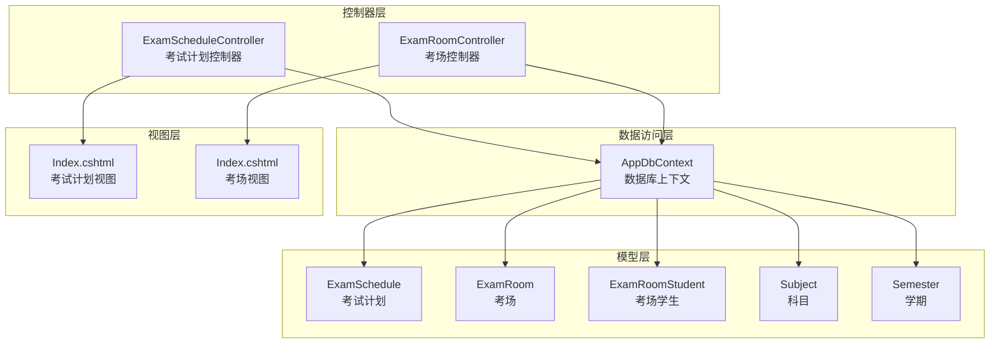
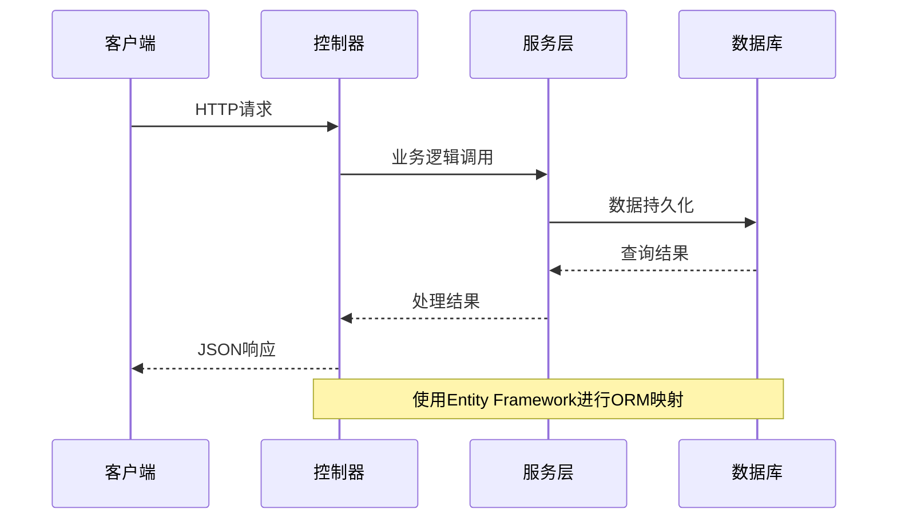
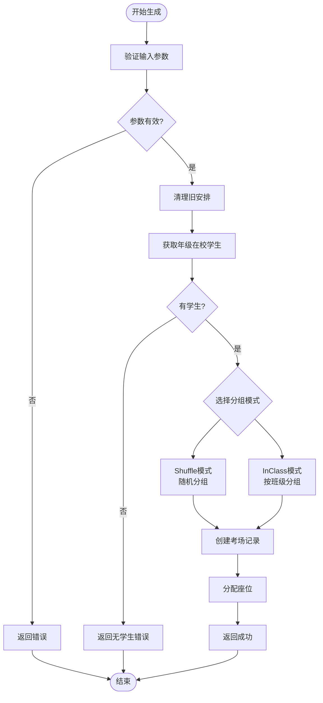
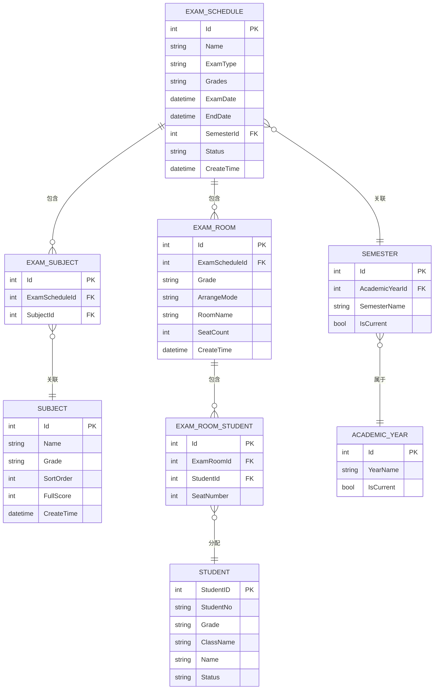
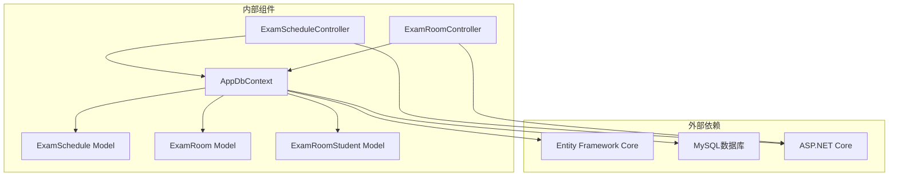

# 考试安排API

<cite>
**本文档引用的文件**
- [ExamScheduleController.cs](file://Controllers/ExamScheduleController.cs)
- [ExamRoomController.cs](file://Controllers/ExamRoomController.cs)
- [AppDbContext.cs](file://Data/AppDbContext.cs)
- [ExamSchedule.cs](file://Models/ExamSchedule.cs)
- [Models.cs](file://Models/Models.cs)
- [Index.cshtml](file://Views/ExamSchedule/Index.cshtml)
- [Index.cshtml](file://Views/ExamRoom/Index.cshtml)
- [AddExamRoom.cs](file://Migrations/20260610054012_AddExamRoom.cs)
- [AddExamEndDate.cs](file://Migrations/20260611001601_AddExamEndDate.cs)
</cite>

## 目录
1. [简介](#简介)
2. [项目结构](#项目结构)
3. [核心组件](#核心组件)
4. [架构概览](#架构概览)
5. [详细组件分析](#详细组件分析)
6. [依赖关系分析](#依赖关系分析)
7. [性能考虑](#性能考虑)
8. [故障排除指南](#故障排除指南)
9. [结论](#结论)

## 简介

本文件详细记录了学生管理系统的考试安排相关API接口文档。系统提供了完整的考试计划CRUD管理、考场分配、监控状态更新以及统计分析功能。所有接口均基于ASP.NET Core MVC框架构建，采用Entity Framework进行数据持久化。

## 项目结构

系统采用经典的三层架构设计，主要包含以下模块：



**图表来源**
- [ExamScheduleController.cs:1-250](file://Controllers/ExamScheduleController.cs#L1-L250)
- [ExamRoomController.cs:1-200](file://Controllers/ExamRoomController.cs#L1-L200)
- [AppDbContext.cs:1-295](file://Data/AppDbContext.cs#L1-L295)

**章节来源**
- [ExamScheduleController.cs:1-250](file://Controllers/ExamScheduleController.cs#L1-L250)
- [ExamRoomController.cs:1-200](file://Controllers/ExamRoomController.cs#L1-L200)
- [AppDbContext.cs:1-295](file://Data/AppDbContext.cs#L1-L295)

## 核心组件

### 考试计划管理模块

考试计划模块负责管理整个考试周期的安排，包括考试基本信息、适用年级、时间范围等。

**章节来源**
- [ExamScheduleController.cs:20-70](file://Controllers/ExamScheduleController.cs#L20-L70)
- [ExamSchedule.cs:1-47](file://Models/ExamSchedule.cs#L1-L47)

### 考场分配模块

考场分配模块提供智能的考场生成和座位分配功能，支持多种分配策略。

**章节来源**
- [ExamRoomController.cs:21-148](file://Controllers/ExamRoomController.cs#L21-L148)
- [Models.cs:414-462](file://Models/Models.cs#L414-L462)

### 数据模型层

系统采用强类型的数据模型设计，确保数据一致性和完整性约束。

**章节来源**
- [AppDbContext.cs:226-292](file://Data/AppDbContext.cs#L226-L292)
- [Models.cs:397-462](file://Models/Models.cs#L397-L462)

## 架构概览

系统采用分层架构设计，实现了清晰的关注点分离：



**图表来源**
- [ExamScheduleController.cs:72-132](file://Controllers/ExamScheduleController.cs#L72-L132)
- [AppDbContext.cs:30-295](file://Data/AppDbContext.cs#L30-L295)

## 详细组件分析

### 考试计划CRUD接口

#### GET /ExamSchedule/Index
**功能**: 获取考试计划列表，支持关键词、考试类型、状态筛选

**请求参数**:
- keyword: string - 考试名称关键词
- examType: string - 考试类型（全部/期中/期末/月考/单元测试/模拟考）
- status: string - 状态（全部/未开始/进行中/已结束）

**响应数据结构**:
```json
{
  "success": true,
  "data": [
    {
      "id": 1,
      "name": "2024学年第一学期期中考试",
      "examType": "期中",
      "grades": "小学2024级,小学2023级",
      "examDate": "2024-01-15",
      "endDate": "2024-01-17",
      "semester": {
        "academicYear": {"yearName": "2024-2025"},
        "semesterName": "上学期"
      },
      "status": "未开始"
    }
  ]
}
```

**章节来源**
- [ExamScheduleController.cs:20-70](file://Controllers/ExamScheduleController.cs#L20-L70)
- [Index.cshtml:82-129](file://Views/ExamSchedule/Index.cshtml#L82-L129)

#### POST /ExamSchedule/Create
**功能**: 创建新的考试计划

**请求参数**:
- name: string* - 考试名称
- examType: string* - 考试类型
- grades: string - 适用年级（逗号分隔）
- examDate: string* - 考试开始日期
- endDate: string - 结束日期（可选）
- semesterId: string* - 学期ID
- status: string - 状态
- subjectIds: string - 关联科目ID（逗号分隔）

**响应示例**:
```json
{
  "success": true
}
```

**错误处理**:
- 考试名称为空: 返回错误信息
- 日期格式错误: 返回错误信息
- 学期不存在: 返回错误信息

**章节来源**
- [ExamScheduleController.cs:72-132](file://Controllers/ExamScheduleController.cs#L72-L132)

#### POST /ExamSchedule/Edit
**功能**: 编辑现有考试计划

**请求参数**:
- id: int* - 考试计划ID
- name: string* - 考试名称
- examType: string* - 考试类型
- grades: string - 适用年级
- examDate: string* - 考试开始日期
- endDate: string - 结束日期
- semesterId: string* - 学期ID
- status: string - 状态
- subjectIds: string - 关联科目ID

**响应示例**:
```json
{
  "success": true
}
```

**章节来源**
- [ExamScheduleController.cs:134-194](file://Controllers/ExamScheduleController.cs#L134-L194)

#### GET /ExamSchedule/GetSubjects
**功能**: 获取所有可用科目列表

**响应示例**:
```json
[
  {
    "id": 1,
    "name": "语文",
    "grade": "小学2024级"
  },
  {
    "id": 2,
    "name": "数学",
    "grade": "小学2024级"
  }
]
```

**章节来源**
- [ExamScheduleController.cs:196-204](file://Controllers/ExamScheduleController.cs#L196-L204)

#### GET /ExamSchedule/GetExamSubjects
**功能**: 获取指定考试的科目列表

**请求参数**:
- examScheduleId: int* - 考试计划ID

**响应示例**:
```json
[1, 3, 5]
```

**章节来源**
- [ExamScheduleController.cs:206-214](file://Controllers/ExamScheduleController.cs#L206-L214)

#### POST /ExamSchedule/Delete
**功能**: 删除考试计划

**请求参数**:
- id: int* - 考试计划ID

**响应示例**:
```json
{
  "success": true
}
```

**章节来源**
- [ExamScheduleController.cs:216-230](file://Controllers/ExamScheduleController.cs#L216-L230)

### 考场分配接口

#### GET /ExamRoom/Index
**功能**: 考场安排首页，显示指定考试的所有考场

**请求参数**:
- examScheduleId: int* - 考试计划ID

**响应数据结构**:
```json
{
  "schedule": {
    "id": 1,
    "name": "期中考试",
    "examDate": "2024-01-15"
  },
  "rooms": [
    {
      "id": 1,
      "roomName": "第1考场",
      "grade": "小学2024级",
      "arrangeMode": "Shuffle",
      "seatCount": 30,
      "students": [
        {
          "studentId": 1001,
          "seatNumber": 1,
          "student": {
            "studentNo": "20240101",
            "name": "张三"
          }
        }
      ]
    }
  ]
}
```

**章节来源**
- [ExamRoomController.cs:21-51](file://Controllers/ExamRoomController.cs#L21-L51)
- [Index.cshtml:1-20](file://Views/ExamRoom/Index.cshtml#L1-L20)

#### POST /ExamRoom/Generate
**功能**: 生成考场安排

**请求参数**:
- examScheduleId: int* - 考试计划ID
- grade: string* - 年级
- mode: string* - 安排模式（Shuffle/InClass）
- studentsPerRoom: int - 每考场学生数，默认30

**安排模式说明**:
- Shuffle: 全年级随机打乱分组
- InClass: 按原班级分组

**响应示例**:
```json
{
  "success": true,
  "message": "共生成 5 个考场，150 名学生"
}
```

**算法流程**:



**图表来源**
- [ExamRoomController.cs:54-148](file://Controllers/ExamRoomController.cs#L54-L148)

**章节来源**
- [ExamRoomController.cs:54-148](file://Controllers/ExamRoomController.cs#L54-L148)

#### POST /ExamRoom/Clear
**功能**: 清除指定考试和年级的考场安排

**请求参数**:
- examScheduleId: int* - 考试计划ID
- grade: string* - 年级

**响应示例**:
```json
{
  "success": true
}
```

**章节来源**
- [ExamRoomController.cs:150-164](file://Controllers/ExamRoomController.cs#L150-L164)

#### GET /ExamRoom/Print
**功能**: 打印考场安排

**请求参数**:
- examScheduleId: int* - 考试计划ID
- grade: string* - 年级

**响应**: 返回打印视图

**章节来源**
- [ExamRoomController.cs:166-182](file://Controllers/ExamRoomController.cs#L166-L182)

### 数据模型设计

系统采用Entity Framework进行ORM映射，以下是核心数据模型的关系图：



**图表来源**
- [AppDbContext.cs:226-292](file://Data/AppDbContext.cs#L226-L292)
- [Models.cs:397-462](file://Models/Models.cs#L397-L462)

**章节来源**
- [AppDbContext.cs:226-292](file://Data/AppDbContext.cs#L226-L292)
- [Models.cs:397-462](file://Models/Models.cs#L397-L462)

## 依赖关系分析

系统各组件之间的依赖关系如下：



**图表来源**
- [AppDbContext.cs:1-295](file://Data/AppDbContext.cs#L1-L295)
- [ExamScheduleController.cs:1-250](file://Controllers/ExamScheduleController.cs#L1-L250)
- [ExamRoomController.cs:1-200](file://Controllers/ExamRoomController.cs#L1-L200)

**章节来源**
- [AppDbContext.cs:1-295](file://Data/AppDbContext.cs#L1-L295)

## 性能考虑

### 数据库优化策略

1. **索引优化**: 在常用查询字段上建立适当索引
   - ExamSchedule.ExamDate 和 ExamSchedule.Status
   - ExamRoom.ExamScheduleId 和 ExamRoom.Grade
   - ExamRoomStudent.ExamRoomId 和 ExamRoomStudent.StudentId

2. **查询优化**: 使用Include和ThenInclude进行必要的关联查询
3. **批量操作**: 使用RemoveRange进行批量删除操作

### 缓存策略

建议在高并发场景下考虑以下缓存策略：
- 考试类型和状态枚举值缓存
- 学期信息缓存
- 科目列表缓存

## 故障排除指南

### 常见错误及解决方案

**1. 考试日期过期但状态未更新**
- 现象: 考试日期已过但状态仍为"未开始"
- 解决方案: 系统会在界面中显示警告标识，需手动更新状态

**2. 考场生成失败**
- 可能原因: 该年级没有在校学生
- 解决方案: 检查学生状态，确保学生不是"已毕业"或"已删除"

**3. 学期不存在错误**
- 原因: 选择了不存在的学期
- 解决方案: 刷新页面重新选择学期

**4. 数据库连接问题**
- 检查appsettings.json中的连接字符串配置
- 确认MySQL服务正常运行

**章节来源**
- [ExamScheduleController.cs:76-131](file://Controllers/ExamScheduleController.cs#L76-L131)
- [ExamRoomController.cs:75-77](file://Controllers/ExamRoomController.cs#L75-L77)

## 结论

本考试安排API系统提供了完整的考试管理解决方案，具有以下特点：

1. **完整的CRUD功能**: 支持考试计划的全生命周期管理
2. **智能考场分配**: 提供多种分配策略，满足不同需求
3. **数据一致性保障**: 通过实体关系和外键约束确保数据完整性
4. **操作审计**: 记录所有关键操作的日志信息
5. **用户友好**: 提供直观的Web界面和清晰的错误提示

系统采用现代化的架构设计，具备良好的扩展性和维护性，能够满足学校考试管理的各种需求。