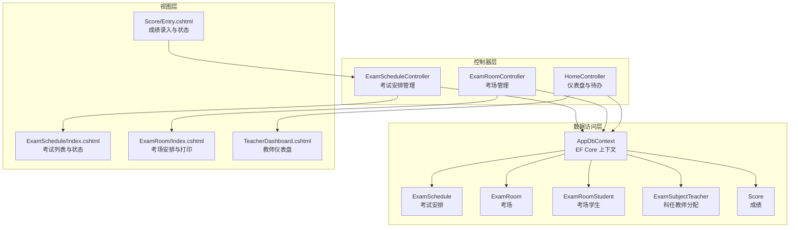
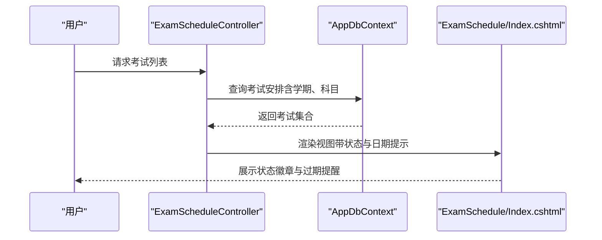
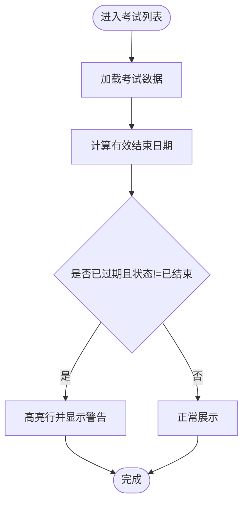
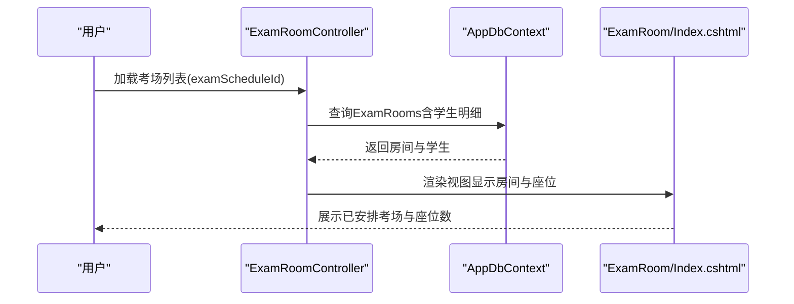
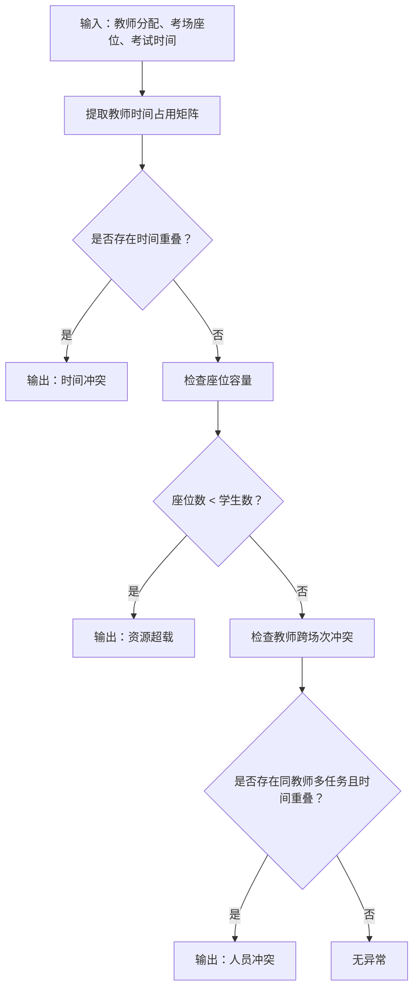
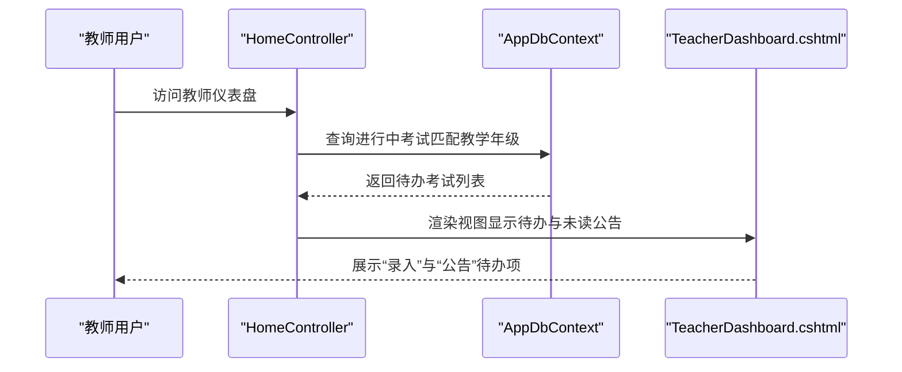
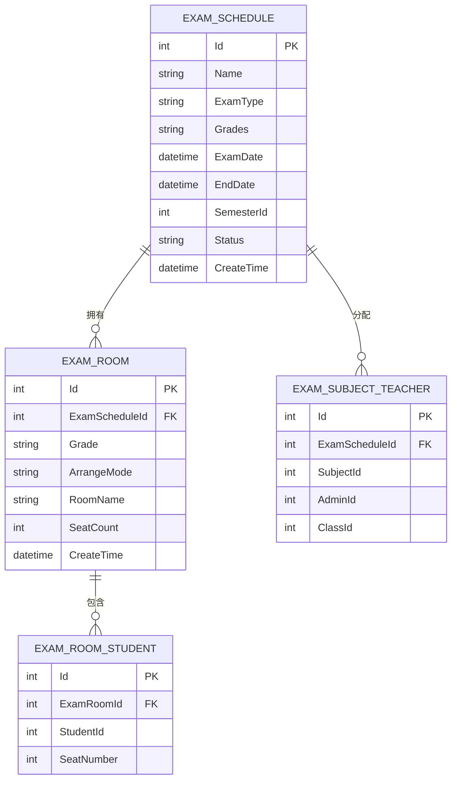

# 考试监控

<cite>
**本文引用的文件**
- [Controllers/ExamScheduleController.cs](file://Controllers/ExamScheduleController.cs)
- [Controllers/ExamRoomController.cs](file://Controllers/ExamRoomController.cs)
- [Data/AppDbContext.cs](file://Data/AppDbContext.cs)
- [Models/ExamSchedule.cs](file://Models/ExamSchedule.cs)
- [Models/Models.cs](file://Models/Models.cs)
- [Views/ExamSchedule/Index.cshtml](file://Views/ExamSchedule/Index.cshtml)
- [Views/ExamRoom/Index.cshtml](file://Views/ExamRoom/Index.cshtml)
- [Views/Score/Entry.cshtml](file://Views/Score/Entry.cshtml)
- [Controllers/HomeController.cs](file://Controllers/HomeController.cs)
- [Views/Home/TeacherDashboard.cshtml](file://Views/Home/TeacherDashboard.cshtml)
</cite>

## 目录
1. [简介](#简介)
2. [项目结构](#项目结构)
3. [核心组件](#核心组件)
4. [架构总览](#架构总览)
5. [详细组件分析](#详细组件分析)
6. [依赖关系分析](#依赖关系分析)
7. [性能考虑](#性能考虑)
8. [故障排查指南](#故障排查指南)
9. [结论](#结论)
10. [附录](#附录)

## 简介
本文件面向“考试监控”相关API与功能，围绕以下目标展开：
- 考试状态监控接口：支持实时状态更新、异常处理与预警提示。
- 考试进度跟踪：统计已安排考场数量、已分配监考人员、缺考统计等指标。
- 异常检测算法：识别时间冲突、资源超载、人员冲突等潜在问题。
- 统计分析接口：提供各科目成绩分布、及格率统计、平均分计算等能力。
- 可视化展示与实时更新：基于前端图表与交互实现监控面板与状态提示。

## 项目结构
系统采用经典的分层架构：
- 控制器层：负责接收请求、参数校验、调用服务与返回结果。
- 数据访问层：通过EF Core上下文访问数据库，定义实体关系映射。
- 视图层：ASP.NET Core MVC视图负责渲染页面与前端交互。
- 实体模型：定义考试安排、考场、考场学生、科目、教师分配等核心业务对象。

**图表来源**
- [Controllers/ExamScheduleController.cs:10-354](file://Controllers/ExamScheduleController.cs#L10-L354)
- [Controllers/ExamRoomController.cs:10-199](file://Controllers/ExamRoomController.cs#L10-L199)
- [Data/AppDbContext.cs:31-310](file://Data/AppDbContext.cs#L31-L310)
- [Views/ExamSchedule/Index.cshtml:83-157](file://Views/ExamSchedule/Index.cshtml#L83-L157)
- [Views/ExamRoom/Index.cshtml:1-20](file://Views/ExamRoom/Index.cshtml#L1-L20)
- [Views/Score/Entry.cshtml:69-96](file://Views/Score/Entry.cshtml#L69-L96)
- [Views/Home/TeacherDashboard.cshtml:42-68](file://Views/Home/TeacherDashboard.cshtml#L42-L68)

**章节来源**
- [Controllers/ExamScheduleController.cs:10-354](file://Controllers/ExamScheduleController.cs#L10-L354)
- [Controllers/ExamRoomController.cs:10-199](file://Controllers/ExamRoomController.cs#L10-L199)
- [Data/AppDbContext.cs:31-310](file://Data/AppDbContext.cs#L31-L310)

## 核心组件
- 考试安排实体与控制器
  - 实体：ExamSchedule（包含名称、类型、适用年级、考试日期、结束日期、学期、状态、创建时间等字段）。
  - 控制器：ExamScheduleController 提供考试创建、编辑、删除、科目查询、教师分配等接口。
- 考场实体与控制器
  - 实体：ExamRoom、ExamRoomStudent。
  - 控制器：ExamRoomController 提供考场生成（按全年级打乱或原班）、清除、打印等操作。
- 数据上下文
  - AppDbContext 定义了考试相关实体的表映射与唯一索引约束，确保数据一致性。
- 视图与前端交互
  - 考试列表页对“已过期但状态未结束”的考试进行高亮提示；考场页支持生成与打印；教师仪表盘展示待办事项。

**章节来源**
- [Models/ExamSchedule.cs:6-46](file://Models/ExamSchedule.cs#L6-L46)
- [Controllers/ExamScheduleController.cs:20-93](file://Controllers/ExamScheduleController.cs#L20-L93)
- [Controllers/ExamRoomController.cs:20-51](file://Controllers/ExamRoomController.cs#L20-L51)
- [Data/AppDbContext.cs:227-309](file://Data/AppDbContext.cs#L227-L309)
- [Views/ExamSchedule/Index.cshtml:83-120](file://Views/ExamSchedule/Index.cshtml#L83-L120)
- [Views/ExamRoom/Index.cshtml:49-60](file://Views/ExamRoom/Index.cshtml#L49-L60)
- [Views/Home/TeacherDashboard.cshtml:42-68](file://Views/Home/TeacherDashboard.cshtml#L42-L68)

## 架构总览
系统围绕“考试安排—考场—成绩”主链路构建监控能力：
- 考试状态由ExamSchedule.Status驱动，前端根据状态与结束日期进行视觉提示。
- 考场生成与座位分配形成“资源承载能力”的基础数据。
- 成绩录入与科目全分数结合，支撑后续统计分析与预警阈值。

**图表来源**
- [Controllers/ExamScheduleController.cs:20-93](file://Controllers/ExamScheduleController.cs#L20-L93)
- [Views/ExamSchedule/Index.cshtml:83-120](file://Views/ExamSchedule/Index.cshtml#L83-L120)

## 详细组件分析

### 考试状态监控与异常预警
- 状态字段与前端提示
  - ExamSchedule.Status 字段用于标识“未开始/进行中/已结束”，前端在考试列表中以徽章形式展示，并对“已过期但状态未结束”的记录添加警告标记。
- 实时更新机制
  - 列表页通过视图层直接计算有效结束日期并与当前日期比较，实现无需额外API即可的“实时”状态提示。
- 异常处理
  - 控制器对空参数、非法日期、学期不存在等情况进行校验并返回统一JSON结构，便于前端提示。

**图表来源**
- [Views/ExamSchedule/Index.cshtml:83-94](file://Views/ExamSchedule/Index.cshtml#L83-L94)

**章节来源**
- [Models/ExamSchedule.cs:34-36](file://Models/ExamSchedule.cs#L34-L36)
- [Views/ExamSchedule/Index.cshtml:83-120](file://Views/ExamSchedule/Index.cshtml#L83-L120)
- [Controllers/ExamScheduleController.cs:95-155](file://Controllers/ExamScheduleController.cs#L95-L155)

### 考试进度跟踪（考场、教师、缺考）
- 已安排考场数量
  - 通过ExamRoom按考试与年级聚合统计，控制器Index方法返回对应房间列表，前端可据此统计数量。
- 已分配监考人员
  - 通过ExamSubjectTeacher按考试+科目+班级维度记录教师分配，前端可按科目分组展示。
- 缺考统计
  - 当前代码未直接提供缺考统计接口；可通过ExamRoomStudent与实际参考数据比对实现，建议扩展接口以返回“已分配但未到考”名单。

**图表来源**
- [Controllers/ExamRoomController.cs:20-51](file://Controllers/ExamRoomController.cs#L20-L51)
- [Views/ExamRoom/Index.cshtml:104-118](file://Views/ExamRoom/Index.cshtml#L104-L118)

**章节来源**
- [Controllers/ExamRoomController.cs:20-51](file://Controllers/ExamRoomController.cs#L20-L51)
- [Views/ExamRoom/Index.cshtml:104-118](file://Views/ExamRoom/Index.cshtml#L104-L118)
- [Data/AppDbContext.cs:255-279](file://Data/AppDbContext.cs#L255-L279)

### 异常检测算法设计
基于现有数据模型，可实现以下异常检测：
- 时间冲突
  - 检测同一教师在同一时间段内被分配到多个考试或科目监考任务。
- 资源超载
  - 检测同一考场座位数与应考人数不匹配（例如座位数小于学生数）。
- 人员冲突
  - 检测同一教师同时承担多个需要同时进行的监考任务。

[此图为概念性流程图，不直接映射具体源码文件]

### 统计分析接口（建议）
当前系统未提供专门的统计分析API，建议新增以下接口：
- 各科目成绩分布
  - 输入：ExamScheduleId、SubjectId
  - 输出：分段频次（如优秀、良好、及格、不及格）
- 及格率统计
  - 输入：ExamScheduleId、SubjectId
  - 输出：及格率百分比
- 平均分计算
  - 输入：ExamScheduleId、SubjectId
  - 输出：平均分与标准差

实现思路：
- 基于Score表按科目与考试聚合统计。
- 结合Subject.FullScore设定阈值进行分段。

**章节来源**
- [Data/AppDbContext.cs:205-225](file://Data/AppDbContext.cs#L205-L225)
- [Models/Models.cs:415-462](file://Models/Models.cs#L415-L462)

### 可视化展示与实时更新
- 教师仪表盘
  - 展示“进行中且与教师教学年级相关的考试”作为待办事项，辅助监控。
- 成绩录入页
  - 前端根据考试状态动态禁用或启用录入控件，避免对非进行中考试进行修改。
- 图表集成
  - 主页与仪表盘使用Chart.js渲染各类统计图表，可扩展加入“考试监控”相关指标。

**图表来源**
- [Controllers/HomeController.cs:184-200](file://Controllers/HomeController.cs#L184-L200)
- [Views/Home/TeacherDashboard.cshtml:42-68](file://Views/Home/TeacherDashboard.cshtml#L42-L68)

**章节来源**
- [Controllers/HomeController.cs:184-200](file://Controllers/HomeController.cs#L184-L200)
- [Views/Home/TeacherDashboard.cshtml:42-68](file://Views/Home/TeacherDashboard.cshtml#L42-L68)
- [Views/Score/Entry.cshtml:69-96](file://Views/Score/Entry.cshtml#L69-L96)

## 依赖关系分析
- 控制器依赖AppDbContext进行数据访问。
- 实体间存在外键关系：ExamRoom.ExamScheduleId → ExamSchedule；ExamRoomStudent.ExamRoomId → ExamRoom；ExamSubjectTeacher.ExamScheduleId → ExamSchedule。
- 唯一索引约束保证数据完整性：如ExamSubject、ExamRoomStudent、ExamSubjectTeacher等。

**图表来源**
- [Data/AppDbContext.cs:227-309](file://Data/AppDbContext.cs#L227-L309)

**章节来源**
- [Data/AppDbContext.cs:227-309](file://Data/AppDbContext.cs#L227-L309)

## 性能考虑
- 查询优化
  - 使用Include/ThenInclude按需加载关联数据，避免N+1查询。
  - 对高频查询建立必要索引（如ExamSchedule.Status、ExamRoom.ExamScheduleId）。
- 分页与筛选
  - 列表页支持关键词、类型、状态筛选，建议配合分页提升大数据量下的响应速度。
- 前端渲染
  - 大表格建议虚拟滚动或分页展示，减少DOM压力。

[本节为通用指导，不直接分析具体文件]

## 故障排查指南
- 考试创建/编辑失败
  - 检查必填字段与日期格式；确认学期存在；查看控制器返回的错误消息。
- 考场生成异常
  - 确认年级是否有在校学生；检查安排模式参数；查看生成返回的消息。
- 教师分配失败
  - 确认科目与班级关联正确；检查ExamSubjectTeacher唯一索引是否冲突。

**章节来源**
- [Controllers/ExamScheduleController.cs:95-155](file://Controllers/ExamScheduleController.cs#L95-L155)
- [Controllers/ExamRoomController.cs:53-148](file://Controllers/ExamRoomController.cs#L53-L148)

## 结论
系统已具备考试状态监控与基础进度跟踪能力，可通过以下增强完善监控体系：
- 新增统计分析API，覆盖成绩分布、及格率与平均分。
- 补充异常检测接口，自动识别时间冲突、资源超载与人员冲突。
- 在仪表盘与列表页增加更丰富的可视化指标与实时提示。
- 扩展缺考统计与预警规则，提升整体监控闭环。

[本节为总结性内容，不直接分析具体文件]

## 附录

### API一览（基于现有实现）
- 考试安排
  - GET /ExamSchedule/Index：获取考试列表与筛选条件
  - POST /ExamSchedule/Create：创建考试
  - POST /ExamSchedule/Edit：编辑考试
  - POST /ExamSchedule/Delete：删除考试
  - GET /ExamSchedule/GetSubjects：获取科目列表
  - GET /ExamSchedule/GetExamSubjects：获取考试关联科目
  - GET /ExamSchedule/GetExamSubjectTeachers：获取教师分配详情
  - POST /ExamSchedule/SaveExamSubjectTeachers：保存教师分配
- 考场管理
  - GET /ExamRoom/Index：获取考场列表
  - POST /ExamRoom/Generate：生成考场安排（支持打乱/原班两种模式）
  - POST /ExamRoom/Clear：清除某年级考场安排
  - GET /ExamRoom/Print：打印考场安排
- 仪表盘与待办
  - GET /Home/TeacherDashboard：教师仪表盘（显示待办与未读公告）

**章节来源**
- [Controllers/ExamScheduleController.cs:20-354](file://Controllers/ExamScheduleController.cs#L20-L354)
- [Controllers/ExamRoomController.cs:20-199](file://Controllers/ExamRoomController.cs#L20-L199)
- [Controllers/HomeController.cs:184-200](file://Controllers/HomeController.cs#L184-L200)