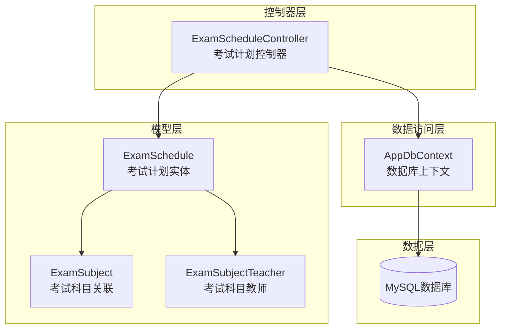
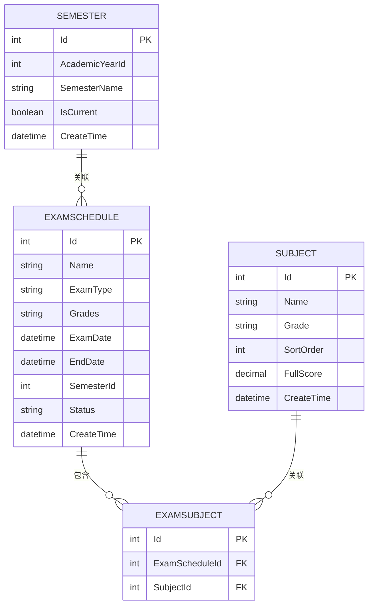
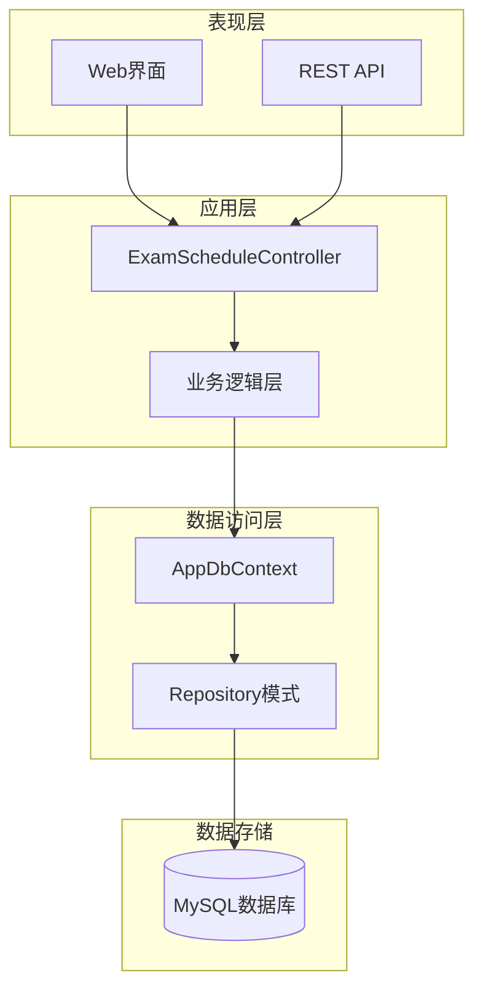
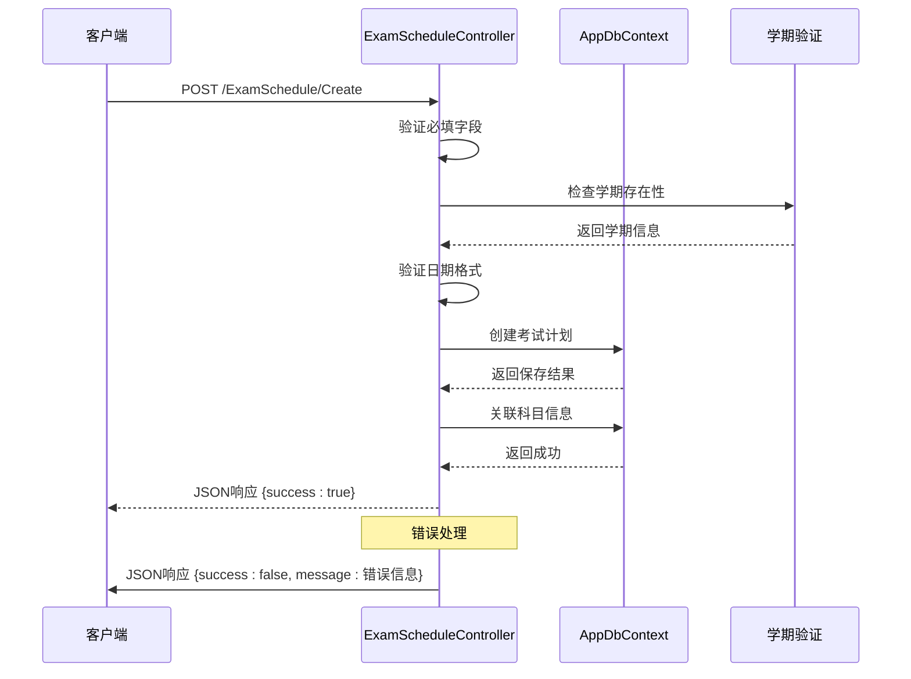
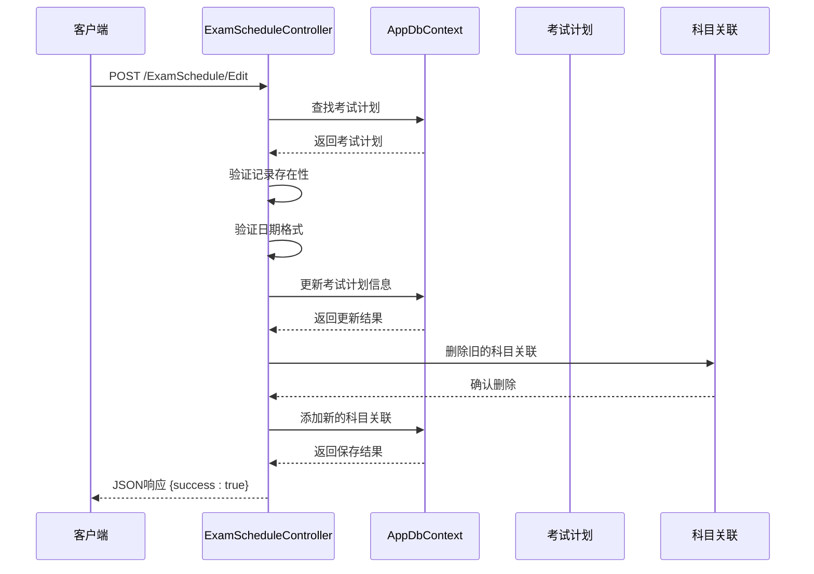
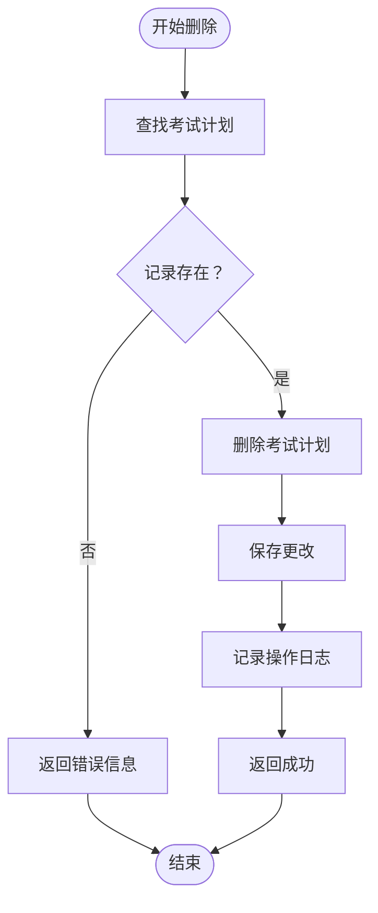
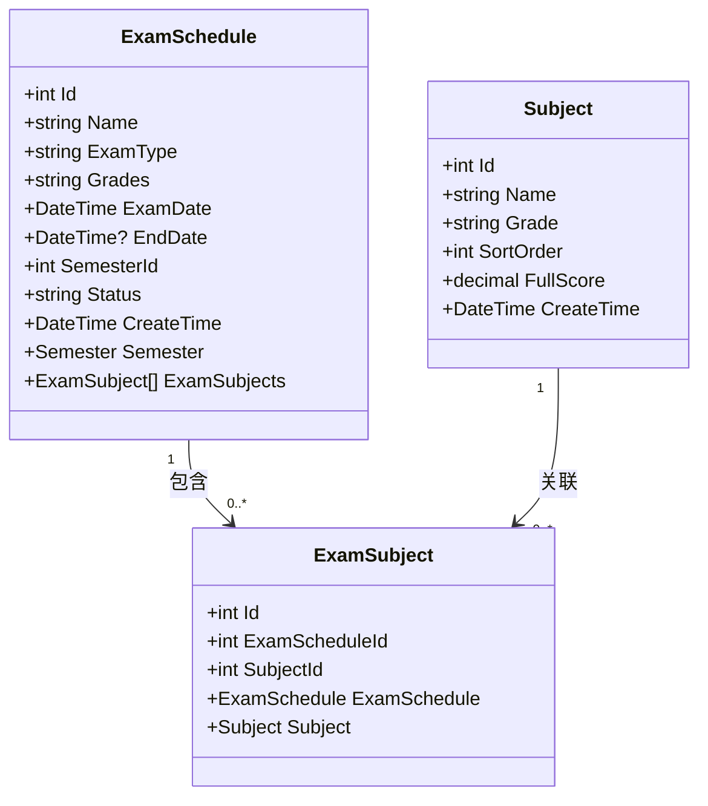
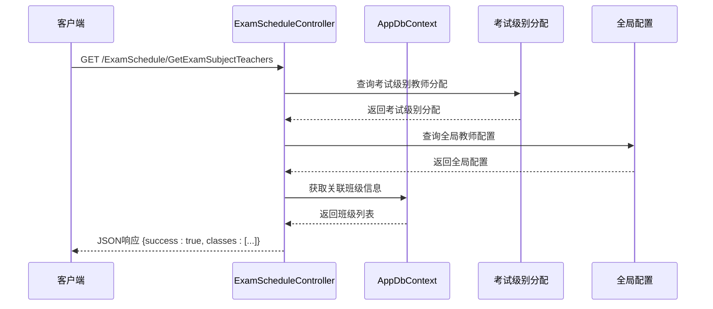
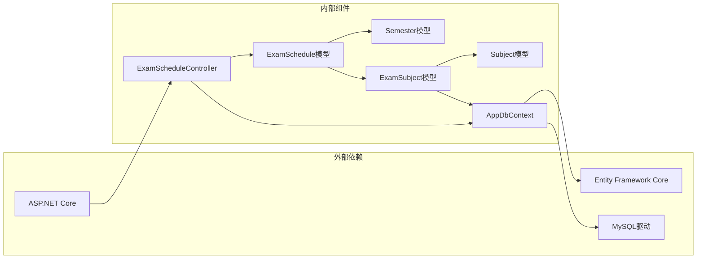
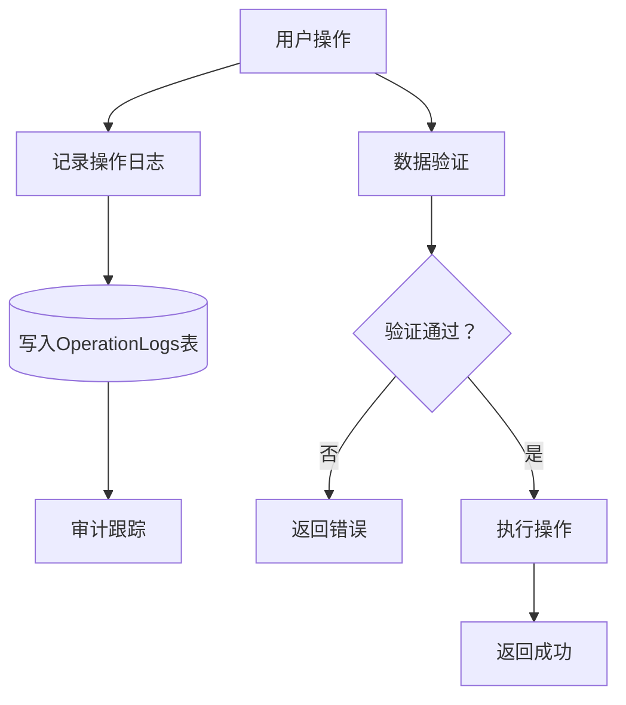

# 考试计划管理

<cite>
**本文档引用的文件**
- [ExamScheduleController.cs](file://Controllers/ExamScheduleController.cs)
- [ExamSchedule.cs](file://Models/ExamSchedule.cs)
- [AppDbContext.cs](file://Data/AppDbContext.cs)
- [20260611001601_AddExamEndDate.cs](file://Migrations/20260611001601_AddExamEndDate.cs)
- [20260609075559_InitialCreate.cs](file://Migrations/20260609075559_InitialCreate.cs)
</cite>

## 目录
1. [简介](#简介)
2. [项目结构](#项目结构)
3. [核心组件](#核心组件)
4. [架构概览](#架构概览)
5. [详细组件分析](#详细组件分析)
6. [依赖关系分析](#依赖关系分析)
7. [性能考虑](#性能考虑)
8. [故障排除指南](#故障排除指南)
9. [结论](#结论)

## 简介

考试计划管理是学生管理系统中的重要模块，负责维护学校的考试安排信息。本系统提供了完整的考试计划CRUD（创建、读取、更新、删除）接口，支持多条件搜索筛选、科目关联管理和教师分配功能。

该系统采用ASP.NET Core MVC架构，使用Entity Framework Core进行数据持久化，支持MySQL数据库。系统通过严格的业务规则验证确保数据完整性和一致性。

## 项目结构

考试计划管理模块主要包含以下核心组件：



**图表来源**
- [ExamScheduleController.cs:1-361](file://Controllers/ExamScheduleController.cs#L1-L361)
- [ExamSchedule.cs:1-47](file://Models/ExamSchedule.cs#L1-L47)
- [AppDbContext.cs:1-312](file://Data/AppDbContext.cs#L1-L312)

**章节来源**
- [ExamScheduleController.cs:1-361](file://Controllers/ExamScheduleController.cs#L1-L361)
- [AppDbContext.cs:1-312](file://Data/AppDbContext.cs#L1-L312)

## 核心组件

### 考试计划实体模型

考试计划实体是系统的核心数据模型，定义了考试安排的所有关键属性：

| 字段名 | 数据类型 | 必填 | 长度限制 | 描述 |
|--------|----------|------|----------|------|
| Id | int | 是 | - | 主键标识符 |
| Name | string | 是 | 100字符 | 考试名称，如"2024学年第一学期期中考试" |
| ExamType | string | 是 | 30字符 | 考试类型：期中/期末/月考/单元测试/模拟考 |
| Grades | string | 否 | 500字符 | 适用年级（逗号分隔） |
| ExamDate | datetime | 是 | - | 考试开始日期 |
| EndDate | datetime? | 否 | - | 考试结束日期，默认为当天 |
| SemesterId | int | 是 | - | 关联学期ID |
| Status | string | 否 | 20字符 | 状态：未开始/进行中/已结束 |
| CreateTime | datetime | 否 | - | 创建时间 |

### 数据库关系映射



**图表来源**
- [AppDbContext.cs:227-253](file://Data/AppDbContext.cs#L227-L253)
- [ExamSchedule.cs:40-46](file://Models/ExamSchedule.cs#L40-L46)

**章节来源**
- [ExamSchedule.cs:1-47](file://Models/ExamSchedule.cs#L1-L47)
- [AppDbContext.cs:227-253](file://Data/AppDbContext.cs#L227-L253)

## 架构概览

系统采用经典的三层架构设计，实现了清晰的职责分离：



**图表来源**
- [ExamScheduleController.cs:10-18](file://Controllers/ExamScheduleController.cs#L10-L18)
- [AppDbContext.cs:6-29](file://Data/AppDbContext.cs#L6-L29)

系统架构特点：
- **权限控制**：仅管理员角色可访问
- **数据验证**：前后端双重验证机制
- **事务管理**：自动事务处理
- **异常处理**：统一的异常捕获和处理

## 详细组件分析

### CRUD接口实现

#### 创建考试计划 (Create)

创建接口提供了完整的数据验证和业务规则检查：



**图表来源**
- [ExamScheduleController.cs:95-155](file://Controllers/ExamScheduleController.cs#L95-L155)

**请求参数**：
- name: string - 考试名称（必填）
- examType: string - 考试类型（必填）
- grades: string - 适用年级（可选）
- examDate: string - 考试日期（必填，YYYY-MM-DD格式）
- endDate: string - 结束日期（可选）
- semesterId: string - 学期ID（必填）
- status: string - 状态（必填）
- subjectIds: string - 科目ID列表（可选）

**响应示例**：
```json
{
  "success": true
}

{
  "success": false,
  "message": "请选择学期"
}
```

#### 编辑考试计划 (Edit)

编辑接口支持完整的更新操作，包括科目关联的重新配置：



**图表来源**
- [ExamScheduleController.cs:157-217](file://Controllers/ExamScheduleController.cs#L157-L217)

**请求参数**：
- id: int - 考试计划ID（必填）
- 其他参数与创建接口相同

#### 删除考试计划 (Delete)

删除接口提供安全的删除机制：



**图表来源**
- [ExamScheduleController.cs:321-335](file://Controllers/ExamScheduleController.cs#L321-L335)

**请求参数**：
- id: int - 考试计划ID（必填）

**响应示例**：
```json
{
  "success": true
}
```

#### 列表查询 (Index)

列表查询接口支持多维度的搜索和筛选：

**请求参数**：
- keyword: string - 关键字搜索（可选）
- examType: string - 考试类型（可选）
- status: string - 状态（可选）

**筛选规则**：
- keyword: 按考试名称模糊匹配
- examType: 精确匹配（排除"全部"选项）
- status: 精确匹配（排除"全部"选项）

**响应数据结构**：
```json
{
  "schedules": [
    {
      "id": 1,
      "name": "2024学年第一学期期中考试",
      "examType": "期中",
      "grades": "小学2024级,小学2023级",
      "examDate": "2024-01-15T00:00:00",
      "endDate": "2024-01-15T00:00:00",
      "semesterId": 1,
      "status": "未开始",
      "createTime": "2024-01-01T00:00:00",
      "semester": {
        "id": 1,
        "academicYearId": 1,
        "semesterName": "第一学期",
        "isCurrent": true,
        "createTime": "2024-01-01T00:00:00"
      },
      "examSubjects": [
        {
          "id": 1,
          "examScheduleId": 1,
          "subjectId": 1,
          "subject": {
            "id": 1,
            "name": "数学",
            "grade": "小学",
            "sortOrder": 1,
            "fullScore": 100.0,
            "createTime": "2024-01-01T00:00:00"
          }
        }
      ]
    }
  ]
}
```

**章节来源**
- [ExamScheduleController.cs:20-93](file://Controllers/ExamScheduleController.cs#L20-L93)

### 科目关联机制

系统支持灵活的科目关联管理，通过ExamSubject实体实现多对多关系：



**图表来源**
- [ExamSchedule.cs:43-46](file://Models/ExamSchedule.cs#L43-L46)
- [AppDbContext.cs:243-253](file://Data/AppDbContext.cs#L243-L253)

**章节来源**
- [ExamScheduleController.cs:132-145](file://Controllers/ExamScheduleController.cs#L132-L145)
- [ExamScheduleController.cs:188-206](file://Controllers/ExamScheduleController.cs#L188-L206)

### 教师分配功能

系统提供两级教师分配机制：

1. **全局教师配置**：基于SubjectTeacher实体
2. **考试级别教师分配**：基于ExamSubjectTeacher实体



**图表来源**
- [ExamScheduleController.cs:239-284](file://Controllers/ExamScheduleController.cs#L239-L284)

**教师分配DTO结构**：
```csharp
public class ExamSubjectTeacherDto
{
    public int AdminId { get; set; }
    public int ClassId { get; set; }
}
```

**章节来源**
- [ExamScheduleController.cs:286-319](file://Controllers/ExamScheduleController.cs#L286-L319)
- [ExamScheduleController.cs:356-361](file://Controllers/ExamScheduleController.cs#L356-L361)

## 依赖关系分析

系统各组件之间的依赖关系如下：



**图表来源**
- [AppDbContext.cs:1-312](file://Data/AppDbContext.cs#L1-L312)
- [ExamScheduleController.cs:1-361](file://Controllers/ExamScheduleController.cs#L1-L361)

**章节来源**
- [AppDbContext.cs:1-312](file://Data/AppDbContext.cs#L1-L312)
- [ExamScheduleController.cs:1-361](file://Controllers/ExamScheduleController.cs#L1-L361)

## 性能考虑

### 数据库优化策略

1. **索引优化**：在ExamSchedule表上建立了SemesterId索引，提高查询性能
2. **连接优化**：使用Include和ThenInclude进行高效的预加载
3. **查询优化**：实现延迟加载和异步查询模式

### 缓存策略

系统建议实现以下缓存机制：
- 学期信息缓存（AcademicYear和Semester）
- 科目列表缓存
- 年级信息缓存

### 并发控制

系统采用以下并发控制措施：
- 使用事务确保数据一致性
- 实现乐观锁防止并发修改冲突
- 提供防重复提交机制

## 故障排除指南

### 常见错误及解决方案

| 错误类型 | 错误代码 | 可能原因 | 解决方案 |
|----------|----------|----------|----------|
| 参数验证错误 | 400 | 必填字段为空 | 检查前端表单验证 |
| 日期格式错误 | 400 | 日期格式不正确 | 确保使用YYYY-MM-DD格式 |
| 学期不存在 | 404 | 学期ID无效 | 验证学期选择 |
| 记录不存在 | 404 | 考试计划ID无效 | 检查URL参数 |
| 权限不足 | 403 | 用户无管理员权限 | 检查用户角色 |

### 日志记录

系统提供完整的操作日志记录功能：



**图表来源**
- [ExamScheduleController.cs:337-353](file://Controllers/ExamScheduleController.cs#L337-L353)

**章节来源**
- [ExamScheduleController.cs:337-353](file://Controllers/ExamScheduleController.cs#L337-L353)

## 结论

考试计划管理模块提供了完整、健壮的考试安排管理功能。系统通过清晰的架构设计、严格的数据验证和完善的错误处理机制，确保了系统的稳定性和可靠性。

主要优势包括：
- **完整的CRUD功能**：支持所有基本的数据操作
- **灵活的搜索筛选**：多维度的查询能力
- **强大的关联管理**：支持复杂的科目和教师关系
- **完善的安全控制**：基于角色的权限管理
- **详细的日志记录**：完整的操作审计功能

该系统为学校考试管理工作提供了强有力的技术支撑，能够满足现代教育管理的需求。