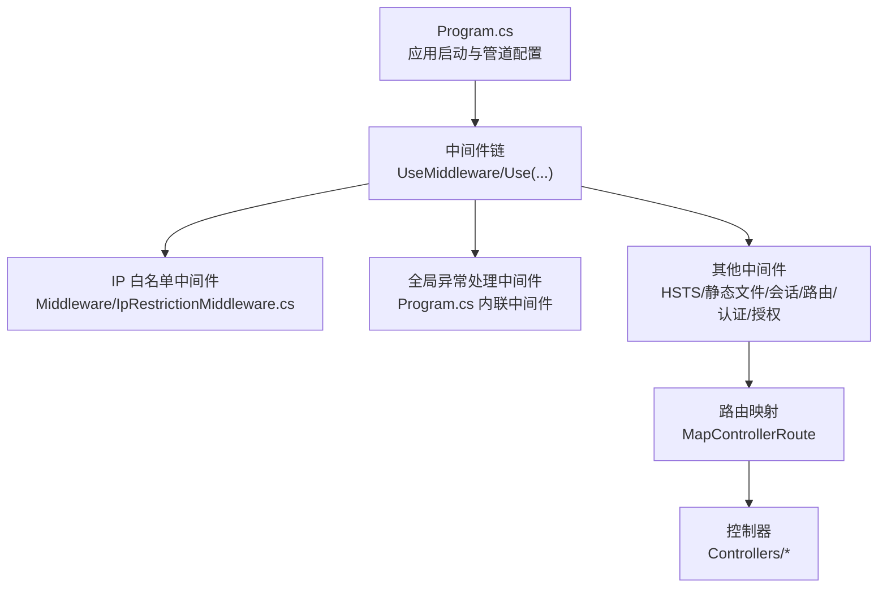
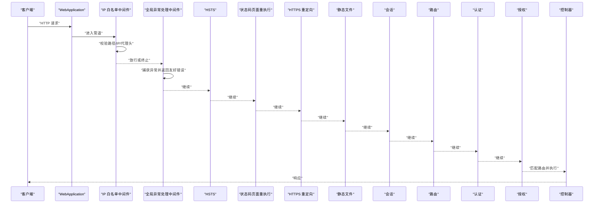
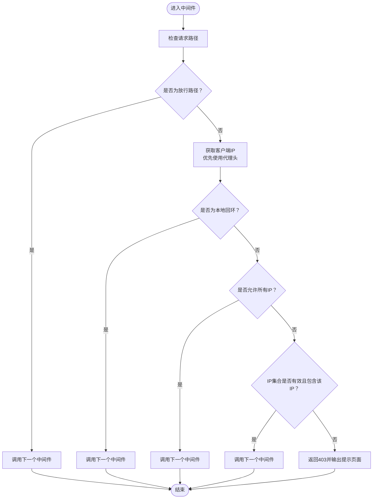
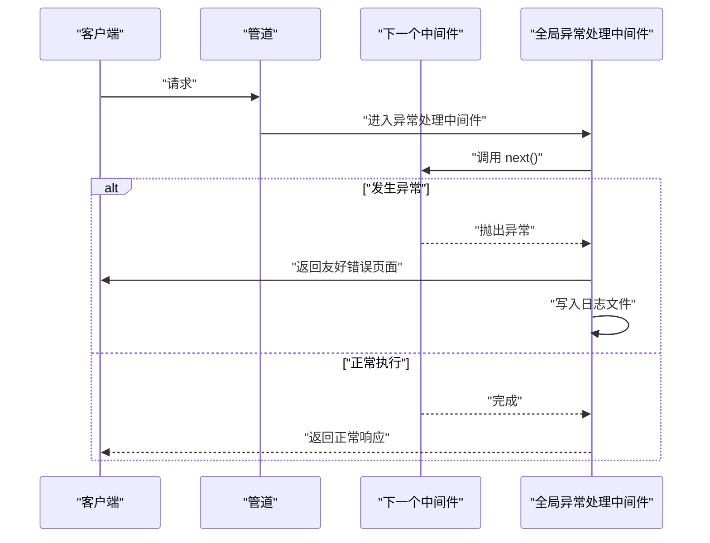
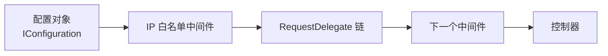

# 中间件与扩展

<cite>
**本文引用的文件列表**
- [Program.cs](file://Program.cs)
- [IpRestrictionMiddleware.cs](file://Middleware/IpRestrictionMiddleware.cs)
- [appsettings.json](file://appsettings.json)
- [SiteSettingsController.cs](file://Controllers/SiteSettingsController.cs)
</cite>

## 目录
1. [简介](#简介)
2. [项目结构](#项目结构)
3. [核心组件](#核心组件)
4. [架构总览](#架构总览)
5. [详细组件分析](#详细组件分析)
6. [依赖关系分析](#依赖关系分析)
7. [性能考量](#性能考量)
8. [故障排查指南](#故障排查指南)
9. [结论](#结论)
10. [附录](#附录)

## 简介
本文件系统性阐述该 ASP.NET Core 应用的中间件体系与扩展机制，重点围绕请求/响应在管道中的流转、自定义中间件（以 IP 限制中间件为例）的实现与注册、全局与局部中间件的差异、配置参数传递、扩展点（服务注册、中间件链配置、管道定制）、性能与最佳实践（异步处理、异常处理、资源管理），以及测试与调试策略。内容基于仓库中实际代码进行分析与总结，帮助读者快速掌握中间件的编写、部署与维护。

## 项目结构
该项目采用典型的 ASP.NET Core MVC 结构，关键与中间件相关的部分如下：
- 程序入口与管道配置位于程序入口文件中，负责注册中间件、认证授权、静态文件、路由等。
- 自定义中间件集中于 Middleware 目录，当前包含一个 IP 白名单中间件。
- 配置信息通过配置文件提供，供中间件读取运行时参数。
- 控制器用于业务逻辑与数据访问，可配合中间件实现安全与治理策略。

图表来源
- [Program.cs:45-100](file://Program.cs#L45-L100)
- [IpRestrictionMiddleware.cs:10-32](file://Middleware/IpRestrictionMiddleware.cs#L10-L32)

章节来源
- [Program.cs:1-123](file://Program.cs#L1-L123)
- [appsettings.json:1-16](file://appsettings.json#L1-L16)

## 核心组件
- 中间件管道与注册
  - 在应用启动阶段，通过调用中间件扩展方法将中间件加入管道，并按注册顺序决定执行顺序。
  - 当前已注册的中间件包括：IP 白名单中间件、全局异常处理中间件、HSTS、状态码页面重执行、HTTPS 重定向、静态文件、会话、路由、认证、授权、控制器路由映射。
- 自定义中间件
  - IP 白名单中间件实现了基于配置的访问控制，支持通配符与多 IP 列表，同时对特定路径放行，适配反向代理场景与本地调试。
- 配置与参数传递
  - 中间件通过依赖注入获取配置对象，从配置文件中读取运行参数，实现零硬编码、可运维的参数化。

章节来源
- [Program.cs:45-100](file://Program.cs#L45-L100)
- [IpRestrictionMiddleware.cs:16-32](file://Middleware/IpRestrictionMiddleware.cs#L16-L32)
- [appsettings.json:9-11](file://appsettings.json#L9-L11)

## 架构总览
下图展示了请求进入应用后的典型处理流程，以及中间件在管道中的位置与职责分工。

图表来源
- [Program.cs:45-100](file://Program.cs#L45-L100)
- [IpRestrictionMiddleware.cs:34-96](file://Middleware/IpRestrictionMiddleware.cs#L34-L96)

## 详细组件分析

### IP 白名单中间件
- 设计目标
  - 基于配置的访问控制，支持“放行所有”“精确 IP 列表”两种模式；对登录页与静态资源放行，适配反向代理与本地调试。
- 关键实现要点
  - 依赖注入：构造函数接收下一个委托与配置对象，便于读取配置。
  - 配置解析：从配置中读取允许的 IP 列表，支持逗号分隔与空白裁剪；为空或星号表示放行所有。
  - 路径放行：对登录页与静态资源路径直接放行，避免阻断用户体验。
  - 代理与回环：优先从代理头提取真实客户端 IP；本地回环地址始终放行。
  - 拒绝响应：对未放行的请求返回 403 并输出简洁的 HTML 页面。
- 执行顺序
  - 注册在管道靠前位置，确保尽早拦截不符合条件的请求，减少后续处理开销。

图表来源
- [IpRestrictionMiddleware.cs:34-96](file://Middleware/IpRestrictionMiddleware.cs#L34-L96)

章节来源
- [IpRestrictionMiddleware.cs:10-98](file://Middleware/IpRestrictionMiddleware.cs#L10-L98)
- [appsettings.json:9-11](file://appsettings.json#L9-L11)

### 全局异常处理中间件
- 设计目标
  - 统一捕获未处理异常，返回用户友好的错误页面，避免泄露堆栈信息；同时记录异常到文件以便排查。
- 关键实现要点
  - 使用内联中间件包装后续中间件链，确保所有异常被捕获。
  - 对异常进行统一格式化输出，设置合适的响应头与状态码。
  - 异常日志落盘，便于运维定位问题。

图表来源
- [Program.cs:49-81](file://Program.cs#L49-L81)

章节来源
- [Program.cs:49-81](file://Program.cs#L49-L81)

### 管道注册与执行顺序
- 注册顺序即执行顺序
  - 中间件在管道中的注册顺序决定了其执行顺序。例如，IP 白名单中间件先于全局异常处理中间件执行，从而尽早拦截非法请求。
- 全局 vs 局部中间件
  - 全局中间件：通过在应用启动时注册，作用于整个应用的所有请求。
  - 局部中间件：可通过分支中间件或路由组等方式仅对特定路径或区域生效（本项目当前未展示局部中间件示例，但注册方式与全局一致）。
- 顺序建议
  - 安全类中间件（如 IP 白名单、认证/授权）通常置于管道靠前位置。
  - 诊断与错误处理中间件（如全局异常处理、状态码页面重执行）置于靠后位置，确保能覆盖所有请求路径。

章节来源
- [Program.cs:45-100](file://Program.cs#L45-L100)

### 配置选项与参数传递
- 配置来源
  - 中间件通过依赖注入获取配置对象，从配置文件中读取运行参数。
- 示例：IP 白名单配置
  - 配置键：IpRestriction:AllowedIPs
  - 支持值：空/星号表示放行所有；逗号分隔的多个 IP 地址。
- 参数传递机制
  - 中间件构造函数接收配置对象，解析后缓存为集合或布尔标志，供每次请求判断使用，避免重复解析带来的性能损耗。

章节来源
- [appsettings.json:9-11](file://appsettings.json#L9-L11)
- [IpRestrictionMiddleware.cs:16-32](file://Middleware/IpRestrictionMiddleware.cs#L16-L32)

### 扩展点与管道定制
- 自定义服务注册
  - 在服务容器中注册中间件所需的依赖（如配置、数据库上下文等），并在中间件构造函数中注入使用。
- 中间件链配置
  - 通过扩展方法串联中间件，形成完整的处理链；可按需调整顺序与组合。
- 管道定制
  - 可根据业务需求引入新的中间件（如审计、限流、缓存、压缩等），并将其放置在合适的位置以满足性能与安全要求。

章节来源
- [Program.cs:10-43](file://Program.cs#L10-L43)
- [IpRestrictionMiddleware.cs:16-32](file://Middleware/IpRestrictionMiddleware.cs#L16-L32)

## 依赖关系分析
- 中间件与配置
  - IP 白名单中间件依赖配置对象，从配置中读取允许的 IP 列表。
- 中间件与管道
  - 中间件通过 RequestDelegate 形成链式调用，每个中间件决定是否继续调用下一个或提前返回响应。
- 中间件与应用启动
  - 管道在应用启动阶段一次性构建，随后对每个请求复用该链。

图表来源
- [IpRestrictionMiddleware.cs:16-32](file://Middleware/IpRestrictionMiddleware.cs#L16-L32)
- [Program.cs:45-100](file://Program.cs#L45-L100)

章节来源
- [IpRestrictionMiddleware.cs:16-32](file://Middleware/IpRestrictionMiddleware.cs#L16-L32)
- [Program.cs:45-100](file://Program.cs#L45-L100)

## 性能考量
- 异步处理
  - 中间件应使用异步方法（如异步读取配置、异步写入日志）以避免阻塞线程，提升吞吐量。
- 异常处理
  - 使用全局异常中间件统一捕获异常，避免异常在管道中层层传播导致的额外开销。
- 资源管理
  - 中间件内部避免频繁分配临时对象；对配置解析结果进行缓存（如 IP 集合），减少重复计算。
- 执行顺序优化
  - 将高成本或高失败率的中间件置于靠前位置，尽早短路无效请求，降低后续处理负担。
- 日志与监控
  - 将异常写入文件或外部日志系统，避免在热路径上进行昂贵的 I/O 操作。

章节来源
- [Program.cs:49-81](file://Program.cs#L49-L81)
- [IpRestrictionMiddleware.cs:16-32](file://Middleware/IpRestrictionMiddleware.cs#L16-L32)

## 故障排查指南
- IP 白名单不生效
  - 检查配置键是否正确，确认配置值是否为空或星号；核对请求是否经过代理，代理头是否正确传递。
- 登录页无法访问
  - 确认中间件对登录页与静态资源路径的放行逻辑是否生效。
- 异常未被全局处理
  - 检查全局异常中间件是否在管道中注册且顺序正确；确认异常是否被下游中间件吞掉。
- 日志未生成
  - 检查日志写入权限与路径；确认异常中间件的异常日志写入逻辑是否触发。

章节来源
- [appsettings.json:9-11](file://appsettings.json#L9-L11)
- [Program.cs:49-81](file://Program.cs#L49-L81)
- [IpRestrictionMiddleware.cs:34-96](file://Middleware/IpRestrictionMiddleware.cs#L34-L96)

## 结论
该应用通过清晰的中间件管道设计与可配置的参数机制，实现了基础的安全控制与统一的异常处理。IP 白名单中间件作为示例展示了如何以最小侵入的方式扩展管道，同时兼顾了代理场景与本地调试的需求。结合全局异常处理与合理的中间件顺序，系统在安全性与可维护性方面具备良好基础。后续可根据业务需要引入更多中间件与治理能力，持续优化性能与可观测性。

## 附录
- 中间件编写规范
  - 构造函数注入必要的依赖（如配置、日志、数据库上下文等）。
  - 实现异步处理方法，避免阻塞。
  - 明确放行规则与拒绝响应，保持一致的错误输出风格。
  - 将高成本操作（如配置解析、网络请求）缓存或延迟到初始化阶段。
- 注册方式
  - 全局中间件：在应用启动时通过扩展方法注册，作用于所有请求。
  - 局部中间件：通过分支中间件或路由组实现对特定路径或区域的控制。
- 测试与调试
  - 单元测试：针对中间件的决策逻辑（如 IP 校验、路径放行）编写测试用例。
  - 集成测试：模拟不同代理头、不同路径与不同 IP 的请求，验证中间件行为。
  - 调试技巧：在开发环境中开启详细日志，逐步缩小问题范围；使用断点观察中间件链的执行路径。

章节来源
- [Program.cs:45-100](file://Program.cs#L45-L100)
- [IpRestrictionMiddleware.cs:10-98](file://Middleware/IpRestrictionMiddleware.cs#L10-L98)
- [SiteSettingsController.cs:15-47](file://Controllers/SiteSettingsController.cs#L15-L47)