# JavaScript交互逻辑

<cite>
**本文引用的文件**
- [site.js](file://wwwroot/js/site.js)
- [_Layout.cshtml](file://Views/Shared/_Layout.cshtml)
- [AdminCenter/Index.cshtml](file://Views/AdminCenter/Index.cshtml)
- [Student/Add.cshtml](file://Views/Student/Add.cshtml)
- [Score/Entry.cshtml](file://Views/Score/Entry.cshtml)
- [Score/ScoreView.cshtml](file://Views/Score/ScoreView.cshtml)
- [Semester/Promote.cshtml](file://Views/Semester/Promote.cshtml)
- [_ValidationScriptsPartial.cshtml](file://Views/Shared/_ValidationScriptsPartial.cshtml)
</cite>

## 目录
1. [简介](#简介)
2. [项目结构](#项目结构)
3. [核心组件](#核心组件)
4. [架构总览](#架构总览)
5. [详细组件分析](#详细组件分析)
6. [依赖关系分析](#依赖关系分析)
7. [性能考虑](#性能考虑)
8. [故障排查指南](#故障排查指南)
9. [结论](#结论)
10. [附录](#附录)

## 简介
本文件系统性梳理了学生管理系统的JavaScript交互逻辑，重点围绕全局脚本site.js与各页面脚本的协作方式，涵盖以下主题：
- 全局JavaScript函数与工具：Toast通知、全局确认弹窗、全局AJAX加载遮罩
- AJAX请求实现：基于fetch与jQuery的混合方案、CSRF令牌传递、异步数据加载
- 事件监听：页面加载、用户交互、窗口事件
- 模态框控制：Bootstrap模态框与动态内容加载
- 表单验证：客户端实时校验与错误提示
- 空闲超时自动退出：定时器与用户活动检测
- jQuery使用指南：DOM操作、事件处理、Ajax封装
- 性能优化与错误处理：节流、防抖、错误降级与可访问性

## 项目结构
系统采用ASP.NET Core服务端渲染+前端静态资源的架构。全局脚本site.js通过布局页统一引入，并与各页面脚本协同工作。

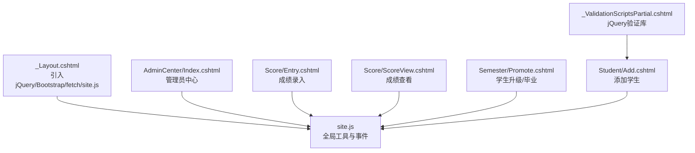

图表来源
- [_Layout.cshtml:200-203](file://Views/Shared/_Layout.cshtml#L200-L203)
- [site.js:1-67](file://wwwroot/js/site.js#L1-L67)

章节来源
- [_Layout.cshtml:1-298](file://Views/Shared/_Layout.cshtml#L1-L298)
- [site.js:1-67](file://wwwroot/js/site.js#L1-L67)

## 核心组件
- 全局Toast通知：支持多种类型（成功/危险/警告/信息），自动淡出，避免阻塞用户。
- 全局确认弹窗：统一的二次确认对话框，兼容无模态页场景。
- 全局AJAX加载遮罩：在ajaxStart/ajaxStop阶段显示/隐藏全局加载层。
- 空闲超时自动退出：10分钟无操作自动登出，含提示与跳转。
- 个人信息模态框：动态加载个人资料，支持表单提交与结果反馈。
- 页面内交互脚本：各业务页面独立脚本负责具体交互逻辑（如成绩录入、成绩查看、升级/毕业等）。

章节来源
- [site.js:11-28](file://wwwroot/js/site.js#L11-L28)
- [site.js:30-49](file://wwwroot/js/site.js#L30-L49)
- [site.js:51-66](file://wwwroot/js/site.js#L51-L66)
- [_Layout.cshtml:205-241](file://Views/Shared/_Layout.cshtml#L205-L241)
- [_Layout.cshtml:244-294](file://Views/Shared/_Layout.cshtml#L244-L294)

## 架构总览
整体交互流程由“布局页引入全局脚本”和“页面脚本按需扩展”构成。全局脚本提供通用能力，页面脚本聚焦业务细节。

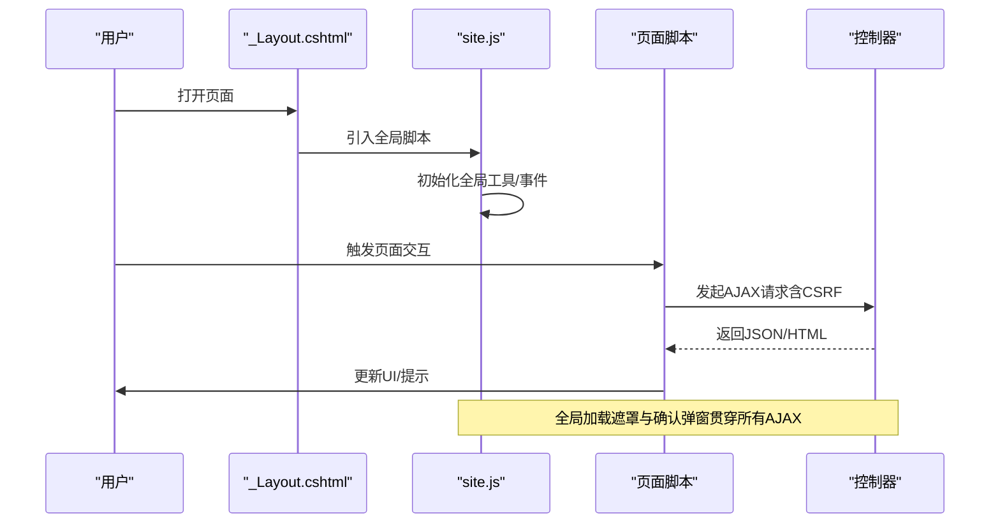

图表来源
- [_Layout.cshtml:200-203](file://Views/Shared/_Layout.cshtml#L200-L203)
- [site.js:51-66](file://wwwroot/js/site.js#L51-L66)
- [Score/Entry.cshtml:197-219](file://Views/Score/Entry.cshtml#L197-L219)

## 详细组件分析

### 全局JavaScript工具与事件
- Toast通知：根据类型映射背景色、边框色、图标与文本色，插入到body并定时淡出。
- 全局确认弹窗：若页面存在确认模态框则使用；否则回退至浏览器原生confirm。
- 全局AJAX加载遮罩：通过ajaxStart/ajaxStop事件统一显示/隐藏，避免重复DOM操作。

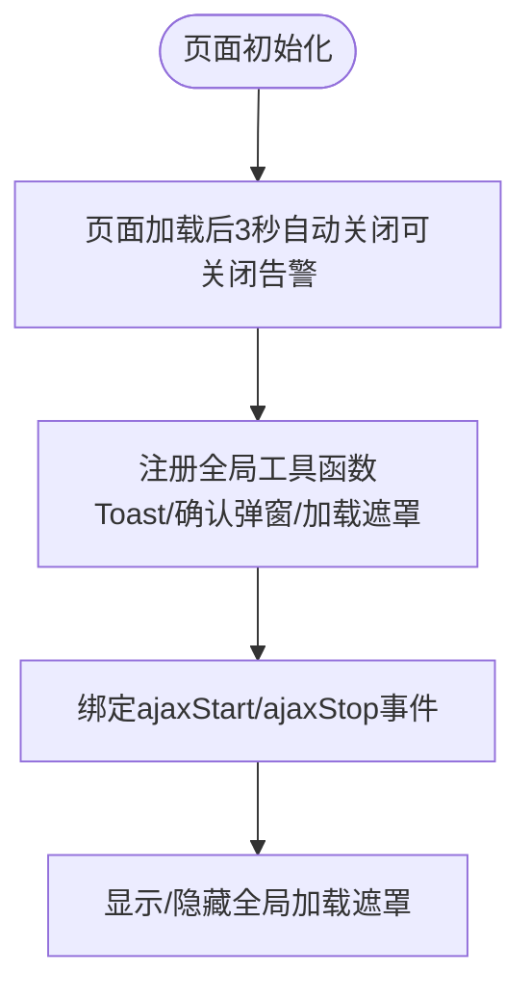

图表来源
- [site.js:4-9](file://wwwroot/js/site.js#L4-L9)
- [site.js:11-28](file://wwwroot/js/site.js#L11-L28)
- [site.js:30-49](file://wwwroot/js/site.js#L30-L49)
- [site.js:51-66](file://wwwroot/js/site.js#L51-L66)

章节来源
- [site.js:1-67](file://wwwroot/js/site.js#L1-L67)

### 空闲超时自动退出
- 计时器：10分钟无活动触发自动登出。
- 用户活动监听：对鼠标、键盘、触摸、滚轮等事件重置计时器。
- 登出流程：显示提示toast，延时跳转到登出动作。

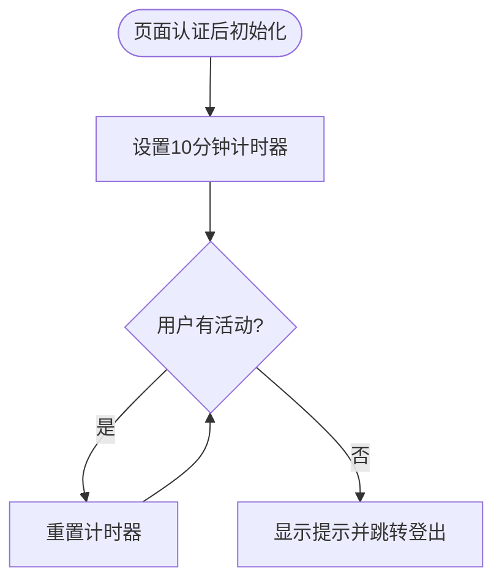

图表来源
- [_Layout.cshtml:205-241](file://Views/Shared/_Layout.cshtml#L205-L241)

章节来源
- [_Layout.cshtml:205-241](file://Views/Shared/_Layout.cshtml#L205-L241)

### 个人信息模态框（动态加载与提交）
- 打开：点击菜单项后显示模态框并加载个人资料页面片段。
- 数据加载：使用fetch请求，设置X-Requested-With头以标识AJAX。
- 表单提交：序列化FormData并通过fetch提交，解析JSON响应，更新按钮状态与提示。
- 错误处理：加载失败与提交异常均给出友好提示。

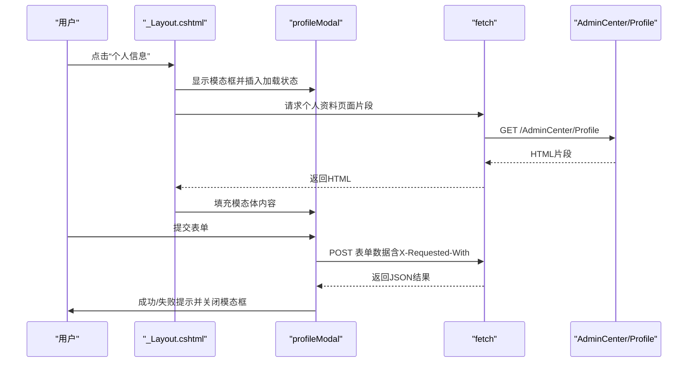

图表来源
- [_Layout.cshtml:244-294](file://Views/Shared/_Layout.cshtml#L244-L294)

章节来源
- [_Layout.cshtml:244-294](file://Views/Shared/_Layout.cshtml#L244-L294)

### AJAX请求实现与CSRF处理
- CSRF令牌：布局页注入隐藏表单，页面脚本通过jQuery选择器读取并附加到请求头或表单数据。
- 请求方式：
  - jQuery：$.post/$.ajax用于传统表单提交与批量操作。
  - Fetch：用于个人信息模态框的动态加载与提交。
- 请求头：统一设置X-Requested-With标识，便于服务端识别AJAX请求。

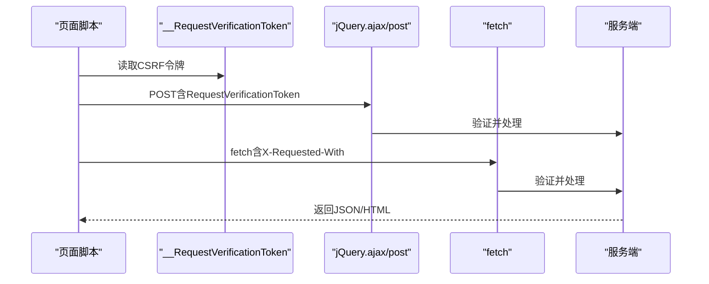

图表来源
- [_Layout.cshtml:161-164](file://Views/Shared/_Layout.cshtml#L161-L164)
- [AdminCenter/Index.cshtml:160-249](file://Views/AdminCenter/Index.cshtml#L160-L249)
- [Score/Entry.cshtml:197-219](file://Views/Score/Entry.cshtml#L197-L219)
- [_Layout.cshtml:253-291](file://Views/Shared/_Layout.cshtml#L253-L291)

章节来源
- [_Layout.cshtml:161-164](file://Views/Shared/_Layout.cshtml#L161-L164)
- [AdminCenter/Index.cshtml:160-249](file://Views/AdminCenter/Index.cshtml#L160-L249)
- [Score/Entry.cshtml:197-219](file://Views/Score/Entry.cshtml#L197-L219)
- [_Layout.cshtml:253-291](file://Views/Shared/_Layout.cshtml#L253-L291)

### 事件监听器绑定
- 页面加载：jQuery ready初始化，如学生添加页的联动选择。
- 用户操作：按钮点击、下拉选择、输入框变更等。
- 窗口事件：空闲超时监听用户活动事件（鼠标移动、键盘、滚动等）。

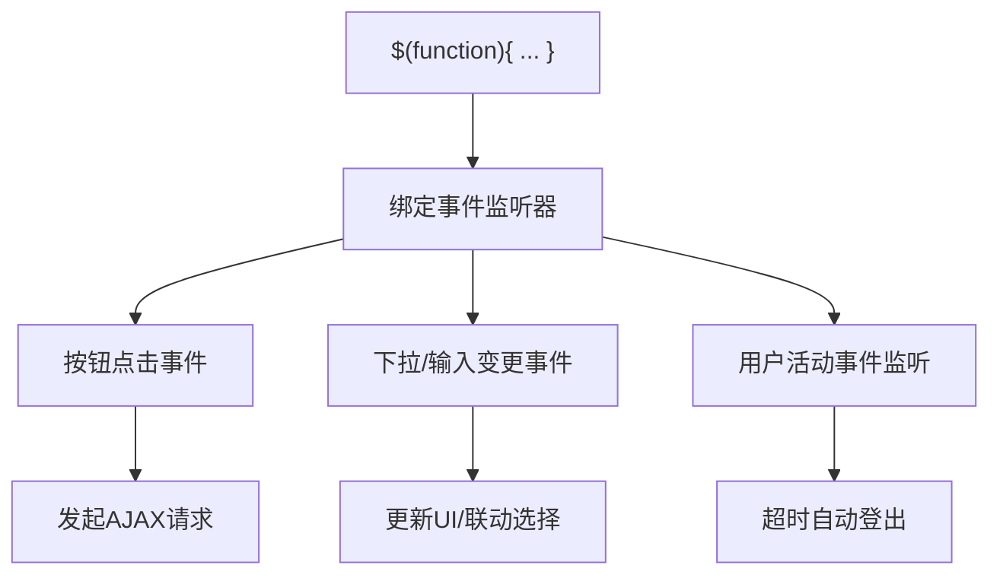

图表来源
- [Student/Add.cshtml:188-208](file://Views/Student/Add.cshtml#L188-L208)
- [_Layout.cshtml:234-239](file://Views/Shared/_Layout.cshtml#L234-L239)

章节来源
- [Student/Add.cshtml:188-208](file://Views/Student/Add.cshtml#L188-L208)
- [_Layout.cshtml:234-239](file://Views/Shared/_Layout.cshtml#L234-L239)

### 模态框的JavaScript控制
- Bootstrap模态框：通过new bootstrap.Modal初始化，show/hide控制显示与隐藏。
- 动态内容：模态框打开后通过fetch加载页面片段，填充模态体。
- 表单提交：在模态体内绑定表单提交事件，防止默认提交，使用fetch进行异步提交。

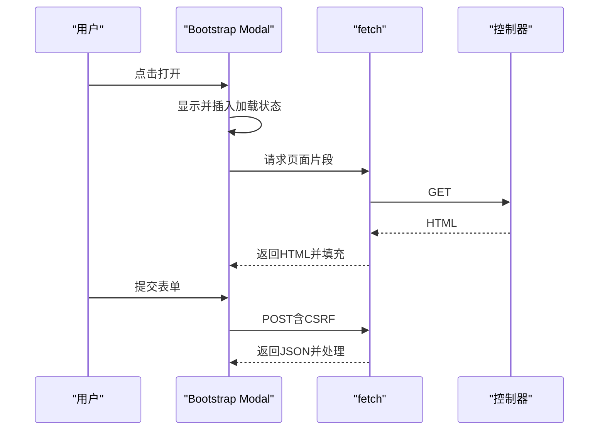

图表来源
- [_Layout.cshtml:182-198](file://Views/Shared/_Layout.cshtml#L182-L198)
- [_Layout.cshtml:244-294](file://Views/Shared/_Layout.cshtml#L244-L294)

章节来源
- [_Layout.cshtml:182-198](file://Views/Shared/_Layout.cshtml#L182-L198)
- [_Layout.cshtml:244-294](file://Views/Shared/_Layout.cshtml#L244-L294)

### 表单验证的客户端实现
- 验证库：页面局部引入jQuery Validation与Unobtrusive验证脚本。
- 实时验证：服务端模型注解配合客户端脚本，即时显示错误提示。
- 添加学生页：通过联动选择（年级→班级）提升用户体验，减少无效提交。

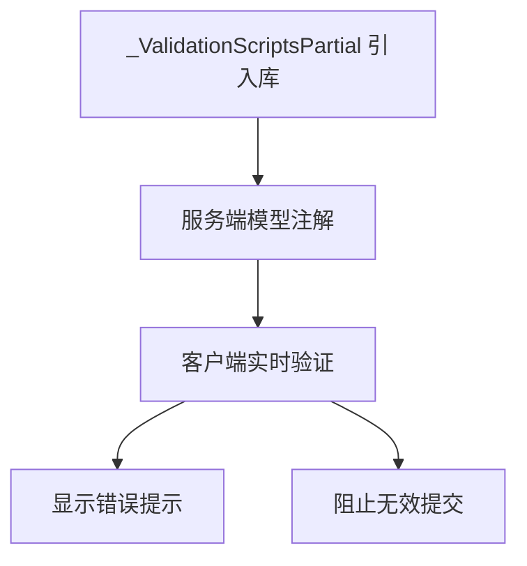

图表来源
- [_ValidationScriptsPartial.cshtml:1-4](file://Views/Shared/_ValidationScriptsPartial.cshtml#L1-L4)
- [Student/Add.cshtml:18-182](file://Views/Student/Add.cshtml#L18-L182)

章节来源
- [_ValidationScriptsPartial.cshtml:1-4](file://Views/Shared/_ValidationScriptsPartial.cshtml#L1-L4)
- [Student/Add.cshtml:18-182](file://Views/Student/Add.cshtml#L18-L182)

### 成绩录入页面交互
- 数据加载：选择考试后通过$.post获取学生与科目数据，构建录入表格。
- 实时变更：输入框oninput/onkeydown实现分数变更缓存与快捷键导航。
- 批量保存：收集变更项，使用$.ajax发送JSON数据，携带CSRF令牌，完成后刷新数据。

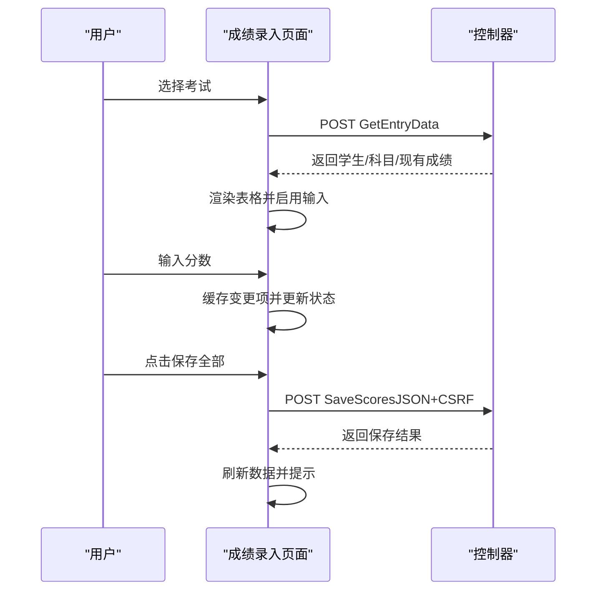

图表来源
- [Score/Entry.cshtml:69-105](file://Views/Score/Entry.cshtml#L69-L105)
- [Score/Entry.cshtml:107-147](file://Views/Score/Entry.cshtml#L107-L147)
- [Score/Entry.cshtml:178-219](file://Views/Score/Entry.cshtml#L178-L219)

章节来源
- [Score/Entry.cshtml:69-105](file://Views/Score/Entry.cshtml#L69-L105)
- [Score/Entry.cshtml:107-147](file://Views/Score/Entry.cshtml#L107-L147)
- [Score/Entry.cshtml:178-219](file://Views/Score/Entry.cshtml#L178-L219)

### 成绩查看页面交互
- 考试选择：选择考试后加载班级列表，再加载成绩数据并渲染表格。
- 导出Excel：构造URL参数后直接跳转下载。

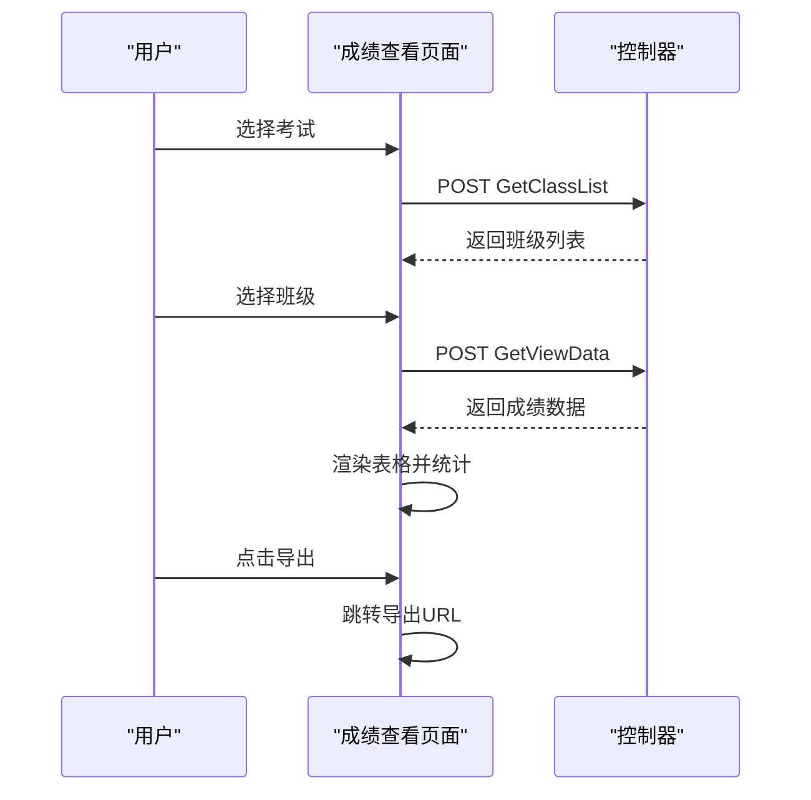

图表来源
- [Score/ScoreView.cshtml:63-87](file://Views/Score/ScoreView.cshtml#L63-L87)
- [Score/ScoreView.cshtml:89-112](file://Views/Score/ScoreView.cshtml#L89-L112)
- [Score/ScoreView.cshtml:151-159](file://Views/Score/ScoreView.cshtml#L151-L159)

章节来源
- [Score/ScoreView.cshtml:63-87](file://Views/Score/ScoreView.cshtml#L63-L87)
- [Score/ScoreView.cshtml:89-112](file://Views/Score/ScoreView.cshtml#L89-L112)
- [Score/ScoreView.cshtml:151-159](file://Views/Score/ScoreView.cshtml#L151-L159)

### 学生升级/毕业页面交互
- 选择年级后弹出确认，确认后禁用按钮并显示加载状态，提交后根据结果更新提示并延迟刷新。

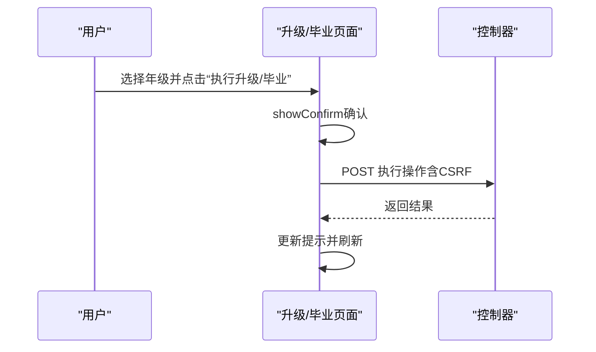

图表来源
- [Semester/Promote.cshtml:82-136](file://Views/Semester/Promote.cshtml#L82-L136)

章节来源
- [Semester/Promote.cshtml:82-136](file://Views/Semester/Promote.cshtml#L82-L136)

### 管理员中心页面交互
- 新增/编辑/删除：通过showConfirm确认，使用$.post提交，成功后刷新页面。
- 安全码：支持明文/密文切换与保存。

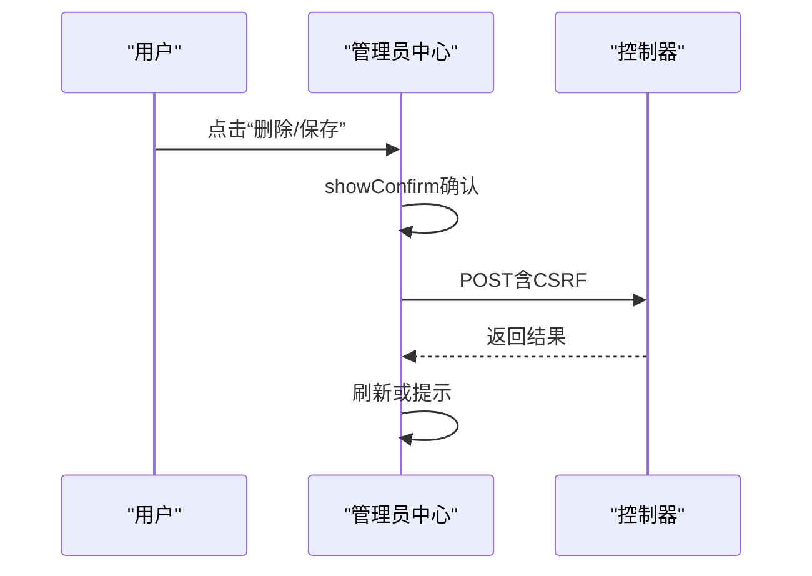

图表来源
- [AdminCenter/Index.cshtml:160-249](file://Views/AdminCenter/Index.cshtml#L160-L249)

章节来源
- [AdminCenter/Index.cshtml:160-249](file://Views/AdminCenter/Index.cshtml#L160-L249)

## 依赖关系分析
- jQuery：用于DOM选择、事件绑定、Ajax请求封装。
- Bootstrap：提供UI组件与模态框行为。
- fetch：用于动态加载与提交，配合X-Requested-With头。
- CSRF令牌：通过隐藏表单注入，页面脚本统一读取并附加到请求。

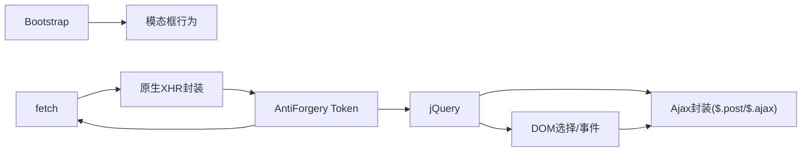

图表来源
- [_Layout.cshtml:200-203](file://Views/Shared/_Layout.cshtml#L200-L203)
- [_Layout.cshtml:161-164](file://Views/Shared/_Layout.cshtml#L161-L164)

章节来源
- [_Layout.cshtml:200-203](file://Views/Shared/_Layout.cshtml#L200-L203)
- [_Layout.cshtml:161-164](file://Views/Shared/_Layout.cshtml#L161-L164)

## 性能考虑
- 减少DOM查询：复用jQuery对象，避免重复选择器。
- 事件委托：优先使用$(document).on(...)绑定动态元素事件。
- 防抖/节流：对频繁触发事件（如输入、滚动）应用节流/防抖。
- 按需加载：仅在需要时发起AJAX请求，避免不必要的网络往返。
- 图标与样式：使用CSS类控制样式，减少内联样式的计算成本。
- 错误降级：在网络异常时提供明确提示并允许重试。

## 故障排查指南
- CSRF验证失败：检查隐藏表单是否存在，确认请求头或表单数据中是否包含令牌。
- 模态框无法显示：确认Bootstrap JS已正确引入，且模态框ID与调用一致。
- AJAX无响应：检查X-Requested-With头是否设置，服务端是否正确识别AJAX请求。
- 空闲超时未触发：确认用户活动事件监听是否生效，计时器是否被重置。
- 表单验证不生效：确认验证库已引入，服务端模型注解与客户端脚本匹配。

章节来源
- [_Layout.cshtml:161-164](file://Views/Shared/_Layout.cshtml#L161-L164)
- [_Layout.cshtml:200-203](file://Views/Shared/_Layout.cshtml#L200-L203)
- [_ValidationScriptsPartial.cshtml:1-4](file://Views/Shared/_ValidationScriptsPartial.cshtml#L1-L4)

## 结论
本系统通过site.js提供统一的全局交互能力，结合各页面脚本实现精细化业务交互。借助jQuery与fetch的混合使用、完善的CSRF防护、模态框动态加载与全局加载遮罩，系统在可用性与安全性方面达到良好平衡。建议在后续迭代中进一步引入事件委托、防抖/节流与更细粒度的错误处理，持续优化用户体验与性能表现。

## 附录
- jQuery使用要点
  - DOM选择：使用$()包裹选择器，尽量缩小作用域。
  - 事件绑定：优先使用$(document).on(...)处理动态元素。
  - Ajax封装：$.post用于简单POST请求，$.ajax用于复杂场景（JSON、CSRF、进度控制）。
  - 表单序列化：使用FormData与JSON.stringify配合fetch提交。
- fetch最佳实践
  - 设置X-Requested-With头以标识AJAX请求。
  - 使用Promise链式处理成功/失败分支。
  - 对网络异常进行捕获并提供用户提示。
- CSRF配置
  - 在布局页注入隐藏表单，读取令牌并附加到请求头或表单数据。
  - 控制器端启用Antiforgery验证中间件或特性。