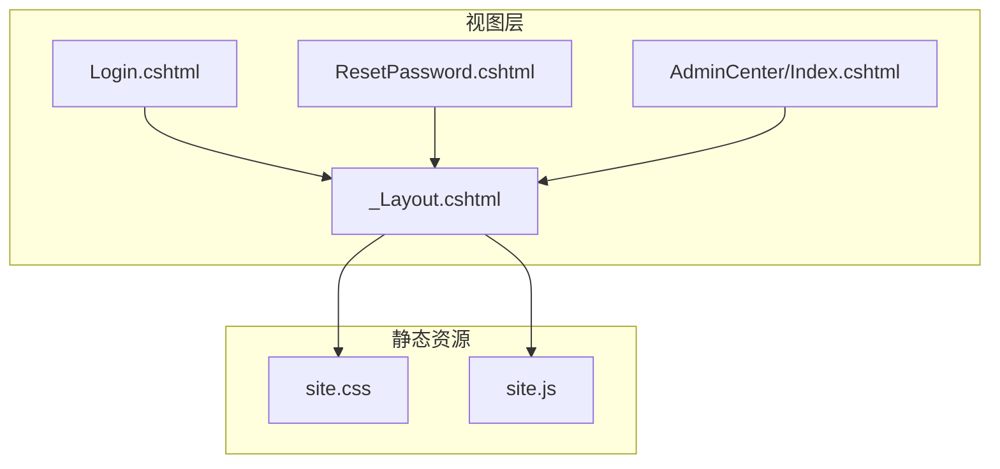
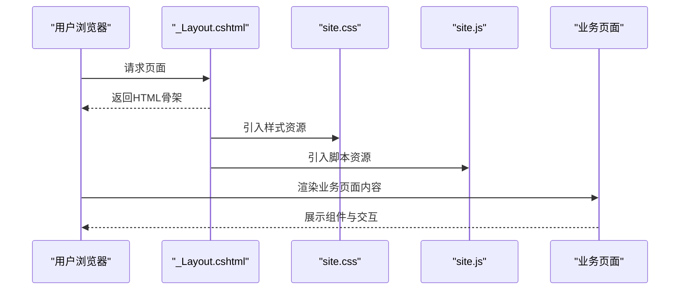
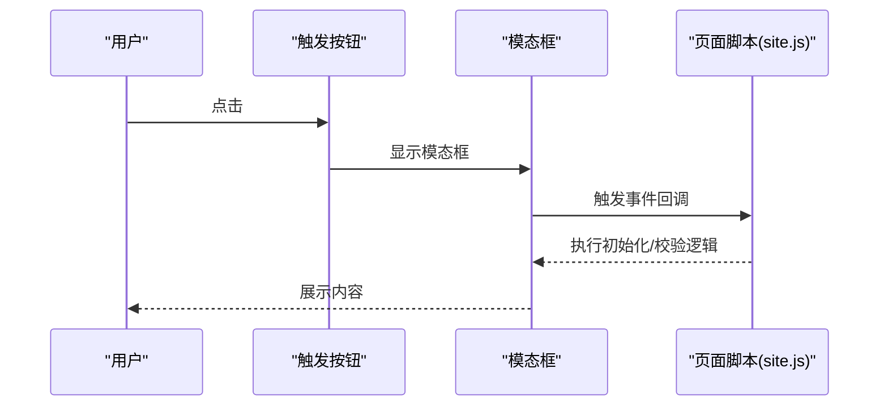
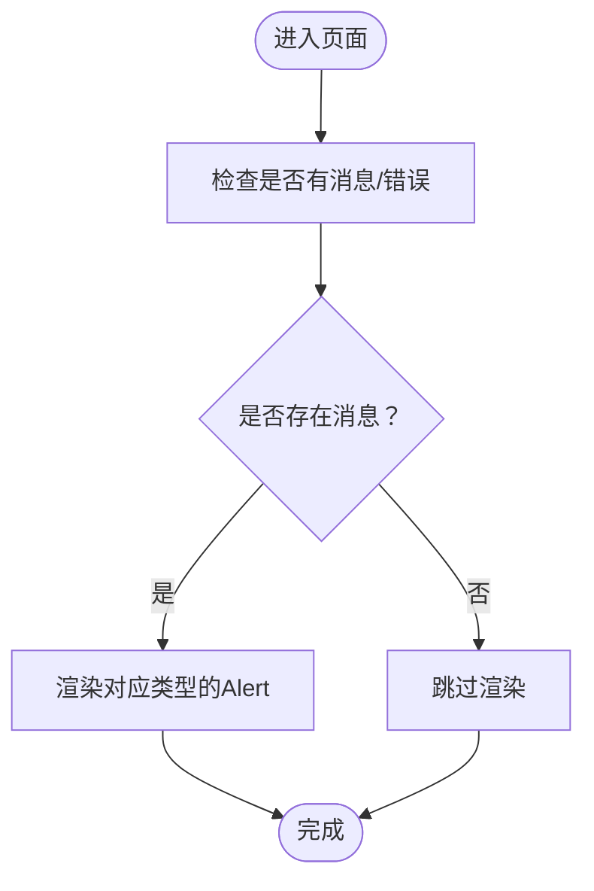
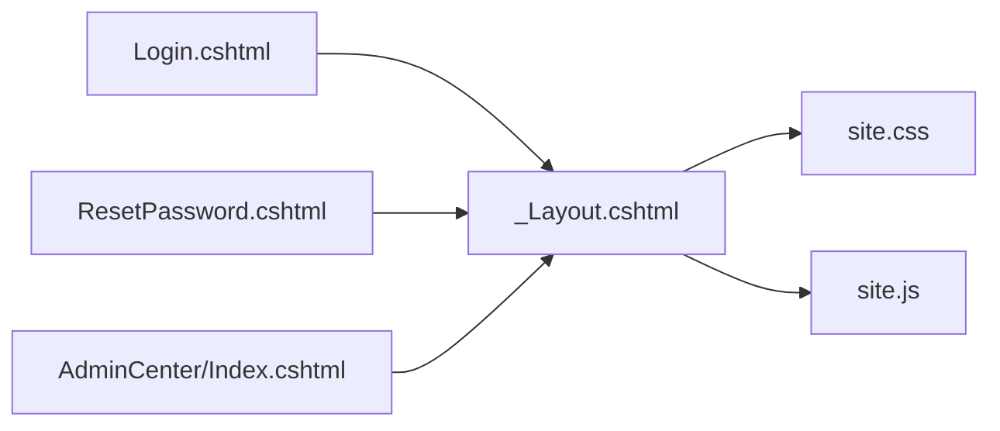

# UI组件使用

<cite>
**本文引用的文件**
- [_Layout.cshtml](file://Views/Shared/_Layout.cshtml)
- [Login.cshtml](file://Views/Account/Login.cshtml)
- [ResetPassword.cshtml](file://Views/Account/ResetPassword.cshtml)
- [Index.cshtml（AdminCenter）](file://Views/AdminCenter/Index.cshtml)
- [site.css](file://wwwroot/css/site.css)
- [site.js](file://wwwroot/js/site.js)
</cite>

## 目录
1. [简介](#简介)
2. [项目结构](#项目结构)
3. [核心组件](#核心组件)
4. [架构总览](#架构总览)
5. [详细组件分析](#详细组件分析)
6. [依赖关系分析](#依赖关系分析)
7. [性能考虑](#性能考虑)
8. [故障排除指南](#故障排除指南)
9. [结论](#结论)
10. [附录](#附录)

## 简介
本指南围绕学生管理系统的UI组件使用展开，重点基于Bootstrap 5.3.2与Bootstrap Icons在项目中的实际应用，系统梳理以下内容：
- 导航栏（Navbar）、下拉菜单（Dropdown）、模态框（Modal）、警告框（Alert）、按钮组（Button Group）等常用组件的使用方式与最佳实践
- 自定义组件：全局确认弹窗、个人信息模态框的设计思路与实现要点
- 表单组件：输入框、选择框、文件上传等控件的样式与验证策略
- 图标系统：Bootstrap Icons的引入与应用规范
- 响应式组件：移动端适配与交互优化
- 组件定制化：CSS覆盖与JavaScript增强方法
- 实际示例与参考路径：通过具体页面文件定位相关实现位置

## 项目结构
系统采用ASP.NET Core Razor Pages视图模型，前端资源位于wwwroot目录，布局文件统一在共享视图中管理。整体结构如下：

图表来源
- [_Layout.cshtml:1-250](file://Views/Shared/_Layout.cshtml#L1-L250)
- [site.css](file://wwwroot/css/site.css)
- [site.js](file://wwwroot/js/site.js)

章节来源
- [_Layout.cshtml:1-250](file://Views/Shared/_Layout.cshtml#L1-L250)

## 核心组件
本节从Bootstrap 5.3.2的实际使用出发，总结各组件在项目中的应用模式与注意事项。

- 导航栏（Navbar）
  - 在登录页中引入Bootstrap样式与Bootstrap Icons，并在页面中使用了导航栏容器与品牌元素，便于后续扩展导航项与下拉菜单。
  - 参考路径：[Login.cshtml:15-20](file://Views/Account/Login.cshtml#L15-L20)

- 下拉菜单（Dropdown）
  - 登录页中存在下拉菜单的HTML结构与触发器，结合Bootstrap JavaScript可实现点击切换与选项选择。
  - 参考路径：[Login.cshtml:15-20](file://Views/Account/Login.cshtml#L15-L20)

- 模态框（Modal）
  - 管理中心首页使用了Bootstrap模态框组件，通过data-bs-toggle与data-bs-target属性触发显示；同时包含模态框头部、主体与底部的标准结构。
  - 参考路径：[Index.cshtml（AdminCenter）:11-13](file://Views/AdminCenter/Index.cshtml#L11-L13)，[Index.cshtml（AdminCenter）:84-100](file://Views/AdminCenter/Index.cshtml#L84-L100)

- 警告框（Alert）
  - 登录页与重置密码页均使用了Alert组件，用于展示提示信息、错误信息与警告信息，并配合自定义样式类进行视觉强化。
  - 登录页示例：[Login.cshtml:384-402](file://Views/Account/Login.cshtml#L384-L402)
  - 重置密码页示例：[ResetPassword.cshtml:15-18](file://Views/Account/ResetPassword.cshtml#L15-L18)

- 按钮组（Button Group）
  - 管理中心首页对按钮进行了尺寸与样式的统一设置，体现按钮组的组合使用方式。
  - 参考路径：[Index.cshtml（AdminCenter）:11-13](file://Views/AdminCenter/Index.cshtml#L11-L13)

章节来源
- [Login.cshtml:15-20](file://Views/Account/Login.cshtml#L15-L20)
- [Login.cshtml:384-402](file://Views/Account/Login.cshtml#L384-L402)
- [ResetPassword.cshtml:15-18](file://Views/Account/ResetPassword.cshtml#L15-L18)
- [Index.cshtml（AdminCenter）:11-13](file://Views/AdminCenter/Index.cshtml#L11-L13)
- [Index.cshtml（AdminCenter）:84-100](file://Views/AdminCenter/Index.cshtml#L84-L100)

## 架构总览
前端资源加载与页面渲染的整体流程如下：

图表来源
- [_Layout.cshtml:1-250](file://Views/Shared/_Layout.cshtml#L1-L250)
- [site.css](file://wwwroot/css/site.css)
- [site.js](file://wwwroot/js/site.js)

章节来源
- [_Layout.cshtml:1-250](file://Views/Shared/_Layout.cshtml#L1-L250)

## 详细组件分析

### 导航栏（Navbar）与下拉菜单（Dropdown）
- 使用要点
  - 在页面头部引入Bootstrap样式后，使用容器与品牌元素构建导航基础结构。
  - 下拉菜单通过触发器与数据属性控制显示/隐藏，建议配合Bootstrap JavaScript以获得完整交互体验。
- 实践建议
  - 将导航项按功能模块分组，使用下拉菜单承载子菜单，保持顶部空间整洁。
  - 对于登录状态下的用户头像或快捷入口，可放置在导航右侧区域并使用下拉菜单承载操作项。

章节来源
- [Login.cshtml:15-20](file://Views/Account/Login.cshtml#L15-L20)

### 模态框（Modal）
- 结构与触发
  - 使用data-bs-toggle与data-bs-target属性绑定触发按钮与目标模态框。
  - 模态框包含标准头部、主体与底部，便于承载表单、确认对话或详情展示。
- 示例参考
  - 新增管理员模态框：[Index.cshtml（AdminCenter）:84-100](file://Views/AdminCenter/Index.cshtml#L84-L100)
  - 触发按钮：[Index.cshtml（AdminCenter）:11-13](file://Views/AdminCenter/Index.cshtml#L11-L13)

图表来源
- [Index.cshtml（AdminCenter）:11-13](file://Views/AdminCenter/Index.cshtml#L11-L13)
- [Index.cshtml（AdminCenter）:84-100](file://Views/AdminCenter/Index.cshtml#L84-L100)
- [site.js](file://wwwroot/js/site.js)

章节来源
- [Index.cshtml（AdminCenter）:11-13](file://Views/AdminCenter/Index.cshtml#L11-L13)
- [Index.cshtml（AdminCenter）:84-100](file://Views/AdminCenter/Index.cshtml#L84-L100)
- [site.js](file://wwwroot/js/site.js)

### 警告框（Alert）
- 使用场景
  - 登录页用于展示环境提示、权限警告与输入错误等信息。
  - 重置密码页用于反馈提交结果与操作指引。
- 样式与行为
  - 通过不同变体类区分信息类型（成功、警告、错误），并结合自定义样式类提升可读性与一致性。
- 示例参考
  - 登录页警告框：[Login.cshtml:384-402](file://Views/Account/Login.cshtml#L384-L402)
  - 重置密码页警告框：[ResetPassword.cshtml:15-18](file://Views/Account/ResetPassword.cshtml#L15-L18)

图表来源
- [Login.cshtml:384-402](file://Views/Account/Login.cshtml#L384-L402)
- [ResetPassword.cshtml:15-18](file://Views/Account/ResetPassword.cshtml#L15-L18)

章节来源
- [Login.cshtml:384-402](file://Views/Account/Login.cshtml#L384-L402)
- [ResetPassword.cshtml:15-18](file://Views/Account/ResetPassword.cshtml#L15-L18)

### 按钮组（Button Group）
- 使用场景
  - 在列表页对行内操作（编辑、删除、查看详情）进行分组排列，提升操作密度与一致性。
- 示例参考
  - 管理中心首页按钮组：[Index.cshtml（AdminCenter）:43-50](file://Views/AdminCenter/Index.cshtml#L43-L50)

章节来源
- [Index.cshtml（AdminCenter）:43-50](file://Views/AdminCenter/Index.cshtml#L43-L50)

### 自定义组件设计与实现

#### 全局确认弹窗
- 设计思路
  - 基于Bootstrap Modal封装通用确认对话框，支持标题、描述、确认/取消文案配置。
  - 通过JavaScript监听按钮点击事件，动态注入内容并显示模态框。
  - 提供回调函数参数，分别处理确认与取消逻辑。
- 实施建议
  - 在site.js中集中管理确认弹窗的初始化与事件绑定，避免重复代码。
  - 为每次调用生成唯一标识符，确保多实例并存时互不干扰。
  - 在确认前执行必要的前置校验，减少无效请求。
- 参考路径
  - 模态框结构与触发方式：[Index.cshtml（AdminCenter）:11-13](file://Views/AdminCenter/Index.cshtml#L11-L13)，[Index.cshtml（AdminCenter）:84-100](file://Views/AdminCenter/Index.cshtml#L84-L100)

章节来源
- [Index.cshtml（AdminCenter）:11-13](file://Views/AdminCenter/Index.cshtml#L11-L13)
- [Index.cshtml（AdminCenter）:84-100](file://Views/AdminCenter/Index.cshtml#L84-L100)
- [site.js](file://wwwroot/js/site.js)

#### 个人信息模态框
- 设计思路
  - 用于展示与编辑用户基本信息，包含只读与可编辑两种状态。
  - 通过按钮组组织“查看”“编辑”“保存”“取消”等操作。
  - 配合图标（如眼睛、勾选）提升可读性与交互反馈。
- 实施建议
  - 使用Bootstrap Grid与表单控件组合布局，保证字段对齐与间距一致。
  - 在编辑状态下启用表单验证，失败时以Alert提示具体问题。
  - 保存成功后关闭模态框并刷新列表或当前页数据。
- 参考路径
  - 图标与按钮组合：[Index.cshtml（AdminCenter）:72-77](file://Views/AdminCenter/Index.cshtml#L72-L77)

章节来源
- [Index.cshtml（AdminCenter）:72-77](file://Views/AdminCenter/Index.cshtml#L72-L77)

### 表单组件使用
- 输入框与选择框
  - 使用Bootstrap提供的表单控件类，结合栅格系统实现响应式布局。
  - 对必填字段添加验证提示，错误时使用Alert或边框高亮提示。
- 文件上传
  - 使用原生input[type=file]并配合Bootstrap按钮样式，注意服务端接收与安全校验。
- 验证策略
  - 客户端：利用HTML5验证属性与Bootstrap内置样式反馈。
  - 服务端：返回ModelState错误并映射到Alert组件展示。
- 参考路径
  - 表单与按钮在管理中心首页的组合使用：[Index.cshtml（AdminCenter）:72-77](file://Views/AdminCenter/Index.cshtml#L72-L77)

章节来源
- [Index.cshtml（AdminCenter）:72-77](file://Views/AdminCenter/Index.cshtml#L72-L77)

### 图标系统（Bootstrap Icons）
- 引入方式
  - 在页面中引入Bootstrap Icons CDN，即可使用各类图标类名。
- 应用规范
  - 图标与文字组合时保持垂直居中与间距一致。
  - 不同语义使用不同图标，避免歧义。
- 参考路径
  - 登录页引入与使用：[Login.cshtml:15-20](file://Views/Account/Login.cshtml#L15-L20)，[Index.cshtml（AdminCenter）:72-77](file://Views/AdminCenter/Index.cshtml#L72-L77)

章节来源
- [Login.cshtml:15-20](file://Views/Account/Login.cshtml#L15-L20)
- [Index.cshtml（AdminCenter）:72-77](file://Views/AdminCenter/Index.cshtml#L72-L77)

### 响应式组件
- 移动端适配
  - 使用Bootstrap栅格系统与工具类，确保在小屏设备上内容不拥挤、操作易触达。
  - 对按钮组与表单控件设置合适的断点与间距，避免横向滚动。
- 交互优化
  - 在窄屏设备上优先展示关键操作，次要功能放入下拉菜单或折叠面板。
- 参考路径
  - 页面整体结构与样式加载：[_Layout.cshtml:1-250](file://Views/Shared/_Layout.cshtml#L1-L250)

章节来源
- [_Layout.cshtml:1-250](file://Views/Shared/_Layout.cshtml#L1-L250)

### 组件定制化
- CSS覆盖
  - 在site.css中新增或覆盖Bootstrap默认样式，统一颜色、字体与间距。
  - 对Alert组件增加自定义类以满足特定业务需求。
- JavaScript增强
  - 在site.js中封装通用交互逻辑（如确认弹窗、表单提交、数据刷新）。
  - 为模态框与表单绑定生命周期事件，确保初始化与清理工作正确执行。
- 参考路径
  - 自定义Alert样式：[Login.cshtml:310-315](file://Views/Account/Login.cshtml#L310-L315)
  - 资源加载与脚本挂载：[_Layout.cshtml:21-201](file://Views/Shared/_Layout.cshtml#L21-L201)

章节来源
- [Login.cshtml:310-315](file://Views/Account/Login.cshtml#L310-L315)
- [_Layout.cshtml:21-201](file://Views/Shared/_Layout.cshtml#L21-L201)
- [site.css](file://wwwroot/css/site.css)
- [site.js](file://wwwroot/js/site.js)

## 依赖关系分析
前端依赖关系如下：

图表来源
- [_Layout.cshtml:1-250](file://Views/Shared/_Layout.cshtml#L1-L250)
- [site.css](file://wwwroot/css/site.css)
- [site.js](file://wwwroot/js/site.js)
- [Login.cshtml](file://Views/Account/Login.cshtml)
- [ResetPassword.cshtml](file://Views/Account/ResetPassword.cshtml)
- [Index.cshtml（AdminCenter）](file://Views/AdminCenter/Index.cshtml)

章节来源
- [_Layout.cshtml:1-250](file://Views/Shared/_Layout.cshtml#L1-L250)

## 性能考虑
- 资源加载
  - 合理合并与压缩CSS/JS，减少请求数量与体积。
  - 将第三方库（如Bootstrap、Icons）置于CDN，利用缓存与并行下载。
- 交互性能
  - 模态框与表单提交尽量异步化，避免整页刷新。
  - 对高频DOM操作进行节流或防抖处理。
- 可访问性
  - 为交互元素提供键盘可达性与屏幕阅读器友好标签。
- 参考路径
  - 资源引入与版本控制：[_Layout.cshtml:21-201](file://Views/Shared/_Layout.cshtml#L21-L201)

章节来源
- [_Layout.cshtml:21-201](file://Views/Shared/_Layout.cshtml#L21-L201)

## 故障排除指南
- 模态框无法显示
  - 检查是否正确引入Bootstrap JavaScript与CSS。
  - 确认data-bs-toggle与data-bs-target指向一致且元素存在。
  - 参考路径：[Index.cshtml（AdminCenter）:11-13](file://Views/AdminCenter/Index.cshtml#L11-L13)，[Index.cshtml（AdminCenter）:84-100](file://Views/AdminCenter/Index.cshtml#L84-L100)
- 图标不显示
  - 确认Bootstrap Icons CDN已正确引入。
  - 参考路径：[Login.cshtml:15-20](file://Views/Account/Login.cshtml#L15-L20)
- 表单验证未生效
  - 检查客户端验证属性与服务端ModelState映射。
  - 使用Alert组件反馈错误信息，便于用户修正。
  - 参考路径：[ResetPassword.cshtml:15-18](file://Views/Account/ResetPassword.cshtml#L15-L18)
- 样式冲突
  - 在site.css中逐步排查自定义样式覆盖范围，避免影响其他组件。
  - 参考路径：[Login.cshtml:310-315](file://Views/Account/Login.cshtml#L310-L315)，[site.css](file://wwwroot/css/site.css)

章节来源
- [Index.cshtml（AdminCenter）:11-13](file://Views/AdminCenter/Index.cshtml#L11-L13)
- [Index.cshtml（AdminCenter）:84-100](file://Views/AdminCenter/Index.cshtml#L84-L100)
- [Login.cshtml:15-20](file://Views/Account/Login.cshtml#L15-L20)
- [ResetPassword.cshtml:15-18](file://Views/Account/ResetPassword.cshtml#L15-L18)
- [Login.cshtml:310-315](file://Views/Account/Login.cshtml#L310-L315)
- [site.css](file://wwwroot/css/site.css)

## 结论
本指南基于项目现有实现，总结了Bootstrap 5.3.2在系统中的使用方式与最佳实践。通过统一的布局与资源管理、规范化的组件结构与样式覆盖、以及可复用的JavaScript增强，能够有效提升界面一致性与用户体验。建议在后续迭代中持续完善可访问性、性能与跨设备兼容性，并将通用交互抽象为可维护的组件库。

## 附录
- 快速参考
  - Bootstrap引入与版本：[Login.cshtml:15-20](file://Views/Account/Login.cshtml#L15-L20)
  - 警告框示例：[Login.cshtml:384-402](file://Views/Account/Login.cshtml#L384-L402)，[ResetPassword.cshtml:15-18](file://Views/Account/ResetPassword.cshtml#L15-L18)
  - 模态框示例：[Index.cshtml（AdminCenter）:84-100](file://Views/AdminCenter/Index.cshtml#L84-L100)
  - 触发器示例：[Index.cshtml（AdminCenter）:11-13](file://Views/AdminCenter/Index.cshtml#L11-L13)
  - 图标使用示例：[Index.cshtml（AdminCenter）:72-77](file://Views/AdminCenter/Index.cshtml#L72-L77)
  - 自定义样式示例：[Login.cshtml:310-315](file://Views/Account/Login.cshtml#L310-L315)
  - 资源加载与脚本挂载：[_Layout.cshtml:21-201](file://Views/Shared/_Layout.cshtml#L21-L201)