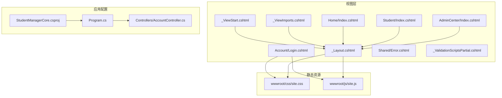
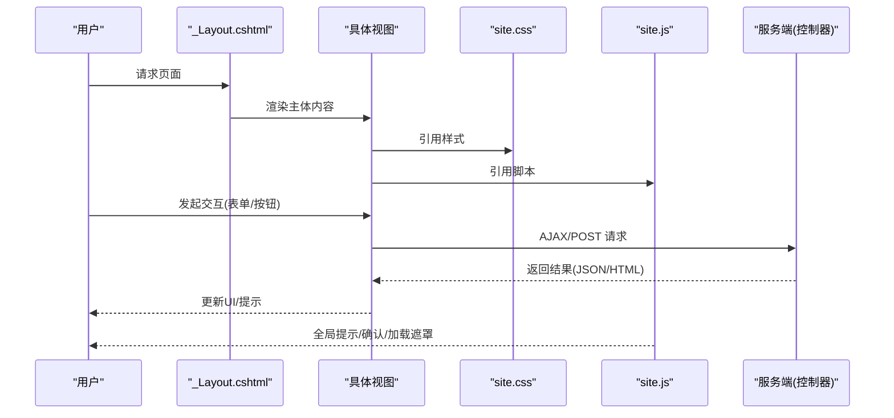
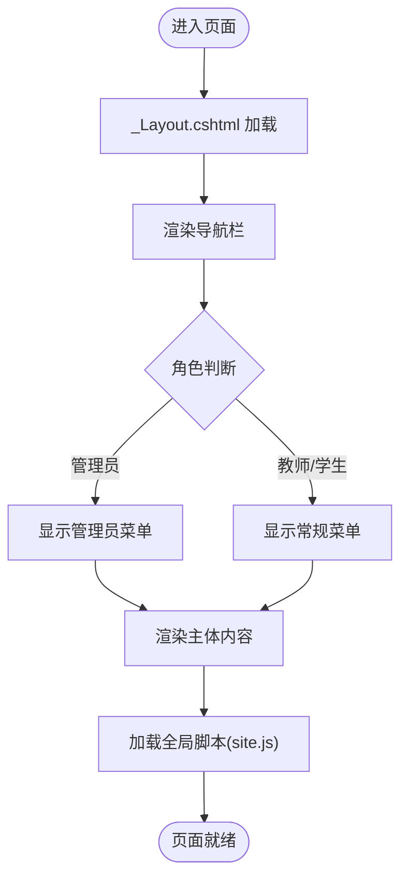
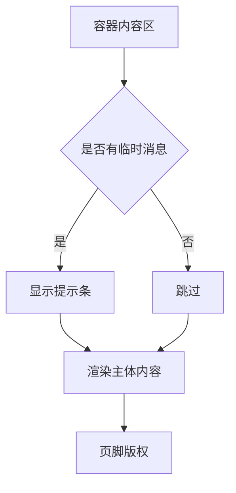
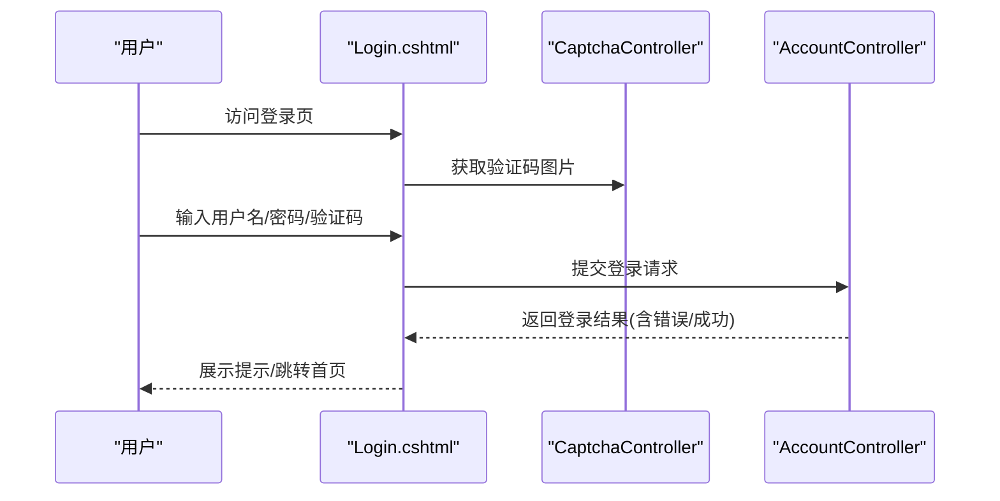
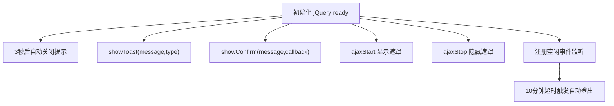
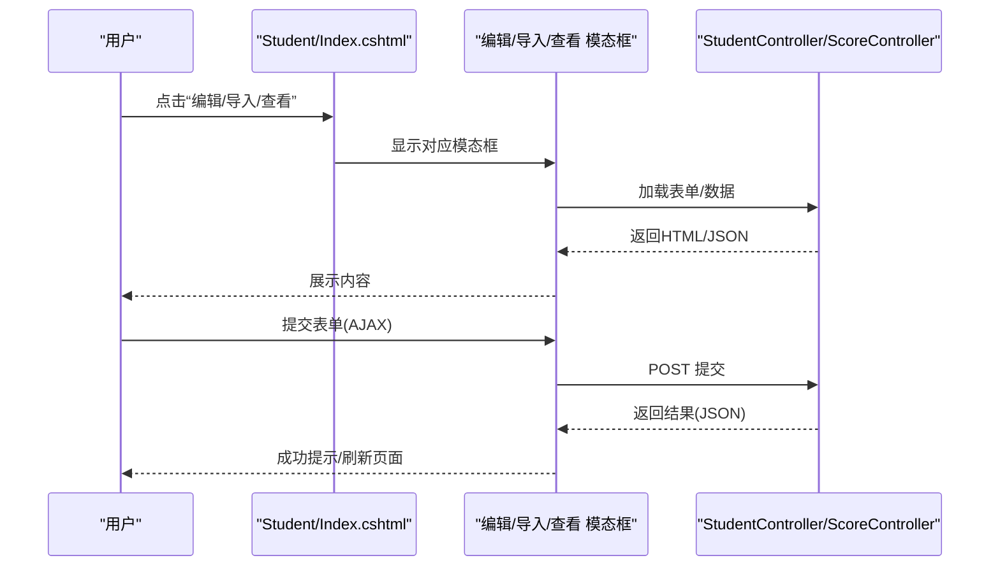
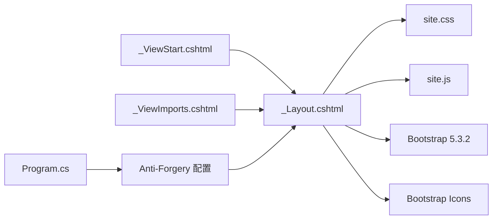

# 前端界面设计

<cite>
**本文引用的文件**
- [_Layout.cshtml](file://Views/Shared/_Layout.cshtml)
- [_ViewImports.cshtml](file://Views/_ViewImports.cshtml)
- [_ViewStart.cshtml](file://Views/_ViewStart.cshtml)
- [site.css](file://wwwroot/css/site.css)
- [site.js](file://wwwroot/js/site.js)
- [Index.cshtml（首页）](file://Views/Home/Index.cshtml)
- [Index.cshtml（学生管理）](file://Views/Student/Index.cshtml)
- [Index.cshtml（管理员中心）](file://Views/AdminCenter/Index.cshtml)
- [Login.cshtml（登录页）](file://Views/Account/Login.cshtml)
- [Error.cshtml（错误页）](file://Views/Shared/Error.cshtml)
- [_ValidationScriptsPartial.cshtml](file://Views/Shared/_ValidationScriptsPartial.cshtml)
- [StudentManagerCore.csproj](file://StudentManagerCore.csproj)
- [Program.cs](file://Program.cs)
- [AccountController.cs](file://Controllers/AccountController.cs)
</cite>

## 目录
1. [简介](#简介)
2. [项目结构](#项目结构)
3. [核心组件](#核心组件)
4. [架构总览](#架构总览)
5. [详细组件分析](#详细组件分析)
6. [依赖关系分析](#依赖关系分析)
7. [性能考虑](#性能考虑)
8. [故障排查指南](#故障排查指南)
9. [结论](#结论)
10. [附录](#附录)

## 简介
本文件面向学生管理系统的前端界面设计，围绕基于 Bootstrap 5.3.2 的响应式布局、Razor 视图引擎的使用、CSS 样式定制、JavaScript 交互逻辑、组件使用规范、响应式最佳实践以及前端安全措施进行系统化说明。文档同时提供可视化图表帮助理解页面结构与交互流程，并给出可操作的优化建议与故障排查要点。

## 项目结构
系统采用 ASP.NET Core MVC 架构，前端资源位于 wwwroot 目录，视图文件位于 Views 目录，控制器位于 Controllers 目录。布局模板统一由共享布局文件控制，页面通过 Razor 视图渲染，静态资源通过版本化链接引入，确保缓存可控与更新及时。

**图表来源**
- [_Layout.cshtml:1-298](file://Views/Shared/_Layout.cshtml#L1-L298)
- [_ViewStart.cshtml:1-4](file://Views/_ViewStart.cshtml#L1-L4)
- [_ViewImports.cshtml:1-4](file://Views/_ViewImports.cshtml#L1-L4)
- [site.css:1-86](file://wwwroot/css/site.css#L1-L86)
- [site.js:1-67](file://wwwroot/js/site.js#L1-L67)
- [StudentManagerCore.csproj:1-21](file://StudentManagerCore.csproj#L1-L21)
- [Program.cs:1-43](file://Program.cs#L1-L43)
- [AccountController.cs:44-81](file://Controllers/AccountController.cs#L44-L81)

**章节来源**
- [_Layout.cshtml:1-298](file://Views/Shared/_Layout.cshtml#L1-L298)
- [_ViewStart.cshtml:1-4](file://Views/_ViewStart.cshtml#L1-L4)
- [_ViewImports.cshtml:1-4](file://Views/_ViewImports.cshtml#L1-L4)
- [site.css:1-86](file://wwwroot/css/site.css#L1-L86)
- [site.js:1-67](file://wwwroot/js/site.js#L1-L67)
- [StudentManagerCore.csproj:1-21](file://StudentManagerCore.csproj#L1-L21)
- [Program.cs:1-43](file://Program.cs#L1-L43)

## 核心组件
- 布局模板：统一的头部导航、主内容区、页脚与全局脚本注入，支持条件渲染与权限控制。
- 响应式导航：基于 Bootstrap 的折叠式导航，支持下拉菜单与图标增强。
- 主内容区：容器化布局，支持临时消息提示与主体内容渲染。
- 全局脚本：Toast 提示、确认弹窗、全局 AJAX 加载遮罩与空闲自动登出。
- 登录页：独立布局，自定义背景与动画，集成验证码刷新与表单验证。
- 错误页：统一错误状态展示与返回入口。
- 验证脚本：jQuery Validation 与 Unobtrusive 集成，支持 Razor 标签助手。

**章节来源**
- [_Layout.cshtml:25-154](file://Views/Shared/_Layout.cshtml#L25-L154)
- [site.js:11-67](file://wwwroot/js/site.js#L11-L67)
- [Login.cshtml:10-463](file://Views/Account/Login.cshtml#L10-L463)
- [Error.cshtml:1-38](file://Views/Shared/Error.cshtml#L1-L38)
- [_ValidationScriptsPartial.cshtml:1-4](file://Views/Shared/_ValidationScriptsPartial.cshtml#L1-L4)

## 架构总览
前端整体采用“布局模板 + 页面视图”的模式，布局负责全局结构与脚本注入，页面视图负责业务内容与局部交互；静态资源通过版本化链接避免缓存问题；全局脚本提供跨页面一致的用户体验与安全机制。

**图表来源**
- [_Layout.cshtml:200-298](file://Views/Shared/_Layout.cshtml#L200-L298)
- [site.js:11-67](file://wwwroot/js/site.js#L11-L67)
- [Index.cshtml（学生管理）:597-800](file://Views/Student/Index.cshtml#L597-L800)

## 详细组件分析

### 布局模板与导航栏
- 头部导航：品牌名、主导航菜单、用户信息与退出入口，支持响应式折叠与下拉菜单。
- 权限控制：根据角色显示不同菜单项（如管理员中心、学期管理等）。
- 临时消息：支持成功与错误提示的自动消失。
- 全局脚本：Bootstrap、jQuery、自定义脚本按需加载。
- 安全机制：内置隐藏的 Anti-Forgery 表单，配合服务端配置启用请求头令牌。

**图表来源**
- [_Layout.cshtml:25-134](file://Views/Shared/_Layout.cshtml#L25-L134)
- [_Layout.cshtml:161-164](file://Views/Shared/_Layout.cshtml#L161-L164)
- [_Layout.cshtml:200-203](file://Views/Shared/_Layout.cshtml#L200-L203)

**章节来源**
- [_Layout.cshtml:25-134](file://Views/Shared/_Layout.cshtml#L25-L134)
- [_Layout.cshtml:161-164](file://Views/Shared/_Layout.cshtml#L161-L164)
- [_Layout.cshtml:200-203](file://Views/Shared/_Layout.cshtml#L200-L203)

### 主内容区与页脚
- 容器化布局：使用容器流式布局，适配不同屏幕尺寸。
- 临时消息：成功/错误提示条，支持自动关闭。
- 页脚版权信息：来自数据库配置或默认值。

**图表来源**
- [_Layout.cshtml:137-159](file://Views/Shared/_Layout.cshtml#L137-L159)

**章节来源**
- [_Layout.cshtml:137-159](file://Views/Shared/_Layout.cshtml#L137-L159)

### 登录页设计
- 独立布局：无共享布局，自定义背景与动画效果。
- 表单结构：用户名、密码、记住我、验证码与刷新。
- 响应式适配：移动端横向分割布局。
- 安全与体验：验证码图片点击刷新、输入框聚焦高亮、按钮渐变阴影。

**图表来源**
- [Login.cshtml:408-446](file://Views/Account/Login.cshtml#L408-L446)
- [AccountController.cs:50-81](file://Controllers/AccountController.cs#L50-L81)

**章节来源**
- [Login.cshtml:10-463](file://Views/Account/Login.cshtml#L10-L463)
- [AccountController.cs:50-81](file://Controllers/AccountController.cs#L50-L81)

### 全局脚本与交互
- Toast 提示：支持多种类型（成功/危险/警告/信息），自动消失。
- 全局确认弹窗：替代浏览器原生 confirm，统一风格。
- 全局 AJAX 加载遮罩：在 AJAX 开始/结束时显示/隐藏。
- 空闲自动登出：10 分钟无操作自动退出并提示。

**图表来源**
- [site.js:4-67](file://wwwroot/js/site.js#L4-L67)

**章节来源**
- [site.js:11-67](file://wwwroot/js/site.js#L11-L67)
- [_Layout.cshtml:205-241](file://Views/Shared/_Layout.cshtml#L205-L241)

### 学生管理页面
- 角色与权限：根据角色与权限显示不同按钮与功能。
- 搜索与筛选：关键词、性别、年级、班级、是否非本地户籍等多维筛选。
- 表格与分页：支持批量操作工具栏、分页导航。
- 模态框：导入、批量转班、编辑、查看等弹窗。
- 右键菜单：上下文菜单，支持编辑、查看、删除、恢复等操作。
- AJAX 交互：表单提交、模态框内容加载、确认弹窗回调。

**图表来源**
- [Index.cshtml（学生管理）:597-800](file://Views/Student/Index.cshtml#L597-L800)
- [Index.cshtml（学生管理）:675-783](file://Views/Student/Index.cshtml#L675-L783)

**章节来源**
- [Index.cshtml（学生管理）:1-1030](file://Views/Student/Index.cshtml#L1-L1030)

### 管理员中心页面
- 管理员列表：用户名、姓名、角色、电话、年级、班级。
- 安全码设置：用于敏感操作确认。
- 模态框：新增/编辑管理员。
- AJAX 交互：删除、保存、提交表单。

**章节来源**
- [Index.cshtml（管理员中心）:1-252](file://Views/AdminCenter/Index.cshtml#L1-L252)

### 首页仪表盘
- 统计卡片：学生总数、在读学生、班主任、管理员等。
- 图表：各年级人数分布、性别比例、学生状态分布。
- 最近操作：操作日志列表。
- 快捷导航：快速跳转常用模块。
- 公告弹窗：轮播展示未读公告。

**章节来源**
- [Index.cshtml（首页）:1-382](file://Views/Home/Index.cshtml#L1-L382)

## 依赖关系分析
- 视图层依赖：_ViewStart.cshtml 指定布局，_ViewImports.cshtml 注入命名空间与标签助手。
- 布局依赖：_Layout.cshtml 引入 Bootstrap、Bootstrap Icons、site.css、site.js，并内置全局确认弹窗与个人信息模态框。
- 静态资源：site.css 与 site.js 通过 asp-append-version 控制缓存。
- 安全配置：Program.cs 中启用 Anti-Forgery 并允许请求头令牌，控制器中使用 AntiForgeryToken 生成隐藏表单。

**图表来源**
- [_ViewStart.cshtml:1-4](file://Views/_ViewStart.cshtml#L1-L4)
- [_ViewImports.cshtml:1-4](file://Views/_ViewImports.cshtml#L1-L4)
- [_Layout.cshtml:20-203](file://Views/Shared/_Layout.cshtml#L20-L203)
- [Program.cs:15-16](file://Program.cs#L15-L16)

**章节来源**
- [_ViewStart.cshtml:1-4](file://Views/_ViewStart.cshtml#L1-L4)
- [_ViewImports.cshtml:1-4](file://Views/_ViewImports.cshtml#L1-L4)
- [_Layout.cshtml:20-203](file://Views/Shared/_Layout.cshtml#L20-L203)
- [Program.cs:15-16](file://Program.cs#L15-L16)

## 性能考虑
- 资源版本化：通过 asp-append-version 避免浏览器缓存旧版本。
- 按需加载：全局脚本集中管理，页面脚本通过节注入，减少不必要的加载。
- 响应式优化：使用 Bootstrap 响应类，避免过度复杂的自定义样式导致重排。
- 图表与大表格：首页图表按需初始化，表格滚动容器提升小屏可读性。
- AJAX 优化：全局加载遮罩与自动关闭提示，改善交互反馈。

[本节为通用指导，无需特定文件引用]

## 故障排查指南
- 登录失败/验证码错误：检查验证码控制器与会话配置，确认验证码图片刷新逻辑。
- CSRF/反伪造错误：确认页面包含 AntiForgeryToken，且服务端启用了请求头令牌。
- AJAX 请求失败：检查全局脚本中的 AJAX 事件绑定与错误处理，确认请求头包含令牌。
- 权限不足：检查 Cookie 过期与滑动过期配置，确认角色声明与权限位。
- 页面空白或样式缺失：检查 site.css 与 site.js 是否正确加载，确认 asp-append-version 生效。

**章节来源**
- [Login.cshtml:408-446](file://Views/Account/Login.cshtml#L408-L446)
- [_Layout.cshtml:161-164](file://Views/Shared/_Layout.cshtml#L161-L164)
- [Program.cs:15-32](file://Program.cs#L15-L32)
- [site.js:51-67](file://wwwroot/js/site.js#L51-L67)

## 结论
该前端设计以 Bootstrap 5.3.2 为基础，结合 Razor 视图引擎与全局脚本，实现了统一的布局、丰富的交互与良好的响应式体验。通过合理的资源组织、安全配置与组件化设计，系统在易用性、可维护性与安全性方面均达到较高水平。后续可在性能监控、国际化与无障碍方面进一步完善。

[本节为总结性内容，无需特定文件引用]

## 附录

### 响应式设计最佳实践
- 使用 Bootstrap 响应类（如 d-flex、justify-content-between、col-md-*、col-*）构建弹性布局。
- 在小屏设备上优先使用折叠导航与滚动表格容器，避免横向滚动。
- 图标与文字间距保持一致，避免在窄屏上出现拥挤。
- 表单控件使用合适的尺寸类（form-control-sm/form-select-sm）以适应小屏。

[本节为通用指导，无需特定文件引用]

### 前端安全措施
- CSRF 防护：页面包含 AntiForgeryToken，服务端启用请求头令牌，AJAX 请求携带令牌。
- XSS 防护：服务端输出编码策略（Razor 默认对 HTML 输出进行转义），避免直接拼接不受信任的数据。
- Cookie 安全：登录路径、过期时间与滑动过期合理配置，防止长时间有效会话被滥用。
- 时间同步：登录前检查服务器时间与客户端时间偏差，避免时钟漂移导致的安全问题。

**章节来源**
- [_Layout.cshtml:161-164](file://Views/Shared/_Layout.cshtml#L161-L164)
- [Program.cs:15-32](file://Program.cs#L15-L32)
- [AccountController.cs:72-78](file://Controllers/AccountController.cs#L72-L78)

### 组件使用说明
- 表格组件：使用 Bootstrap 表格类（table、table-bordered、table-hover、table-striped），配合滚动容器提升小屏可读性。
- 模态框：使用 Bootstrap Modal，配合全局脚本实现统一的加载与提交流程。
- 下拉菜单：使用 Bootstrap 下拉类（dropdown、dropdown-menu、dropdown-item），注意权限控制与图标一致性。
- 按钮组：使用 Bootstrap 按钮类（btn、btn-*），图标与文字间距通过 CSS 统一处理。

**章节来源**
- [Index.cshtml（学生管理）:371-512](file://Views/Student/Index.cshtml#L371-L512)
- [Index.cshtml（管理员中心）:18-60](file://Views/AdminCenter/Index.cshtml#L18-L60)
- [site.css:60-63](file://wwwroot/css/site.css#L60-L63)

### CSS 样式定制指南
- 主题颜色：通过 Bootstrap 背景/文本颜色类快速切换，避免硬编码颜色。
- 字体排版：统一使用系统字体栈，标题与正文字号、字重保持一致。
- 组件样式：卡片悬停、表格条纹、徽章、分页、模态框头部等通过 site.css 统一定制。
- 登录页：独立样式文件，注意背景与动画的性能影响。

**章节来源**
- [site.css:1-86](file://wwwroot/css/site.css#L1-L86)
- [Login.cshtml:18-324](file://Views/Account/Login.cshtml#L18-L324)

### JavaScript 交互逻辑
- 表单验证：通过 jQuery Validation 与 Unobtrusive 实现前后端一致的验证体验。
- AJAX 请求：统一通过 fetch 或 jQuery AJAX，携带 Anti-Forgery 令牌，处理成功/失败回调。
- 动态内容更新：通过模态框加载、局部刷新与全局提示，提升交互效率。
- 全局行为：Toast、确认弹窗、加载遮罩与空闲登出，提供一致的用户体验。

**章节来源**
- [_ValidationScriptsPartial.cshtml:1-4](file://Views/Shared/_ValidationScriptsPartial.cshtml#L1-L4)
- [site.js:11-67](file://wwwroot/js/site.js#L11-L67)
- [Index.cshtml（学生管理）:597-800](file://Views/Student/Index.cshtml#L597-L800)