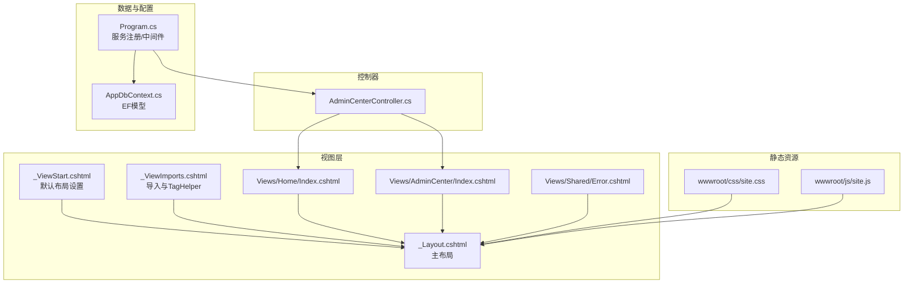
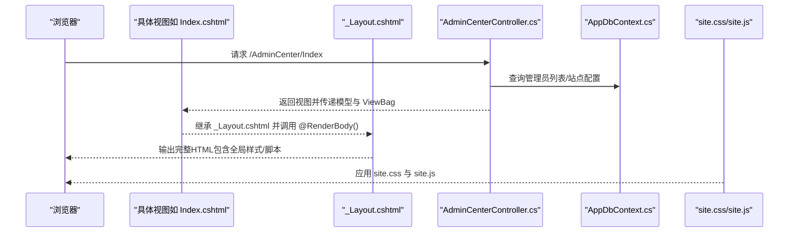
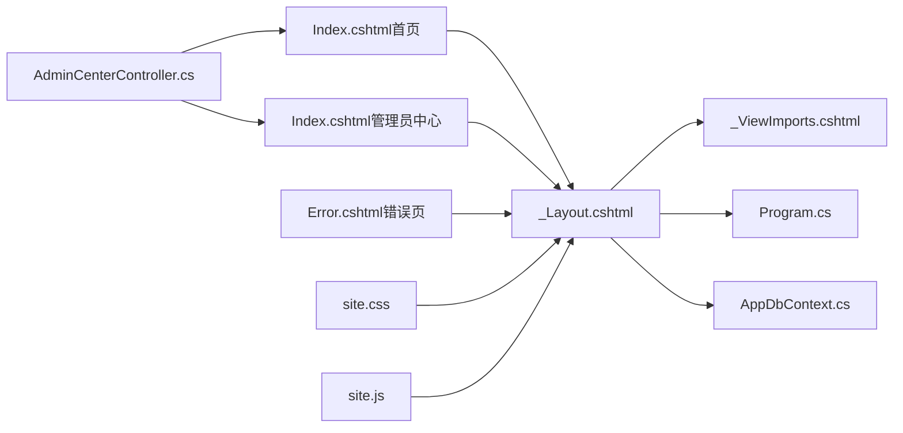
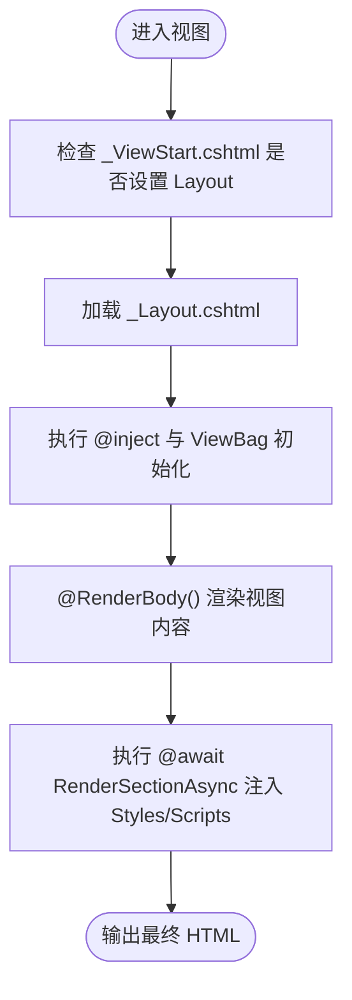

# 布局与模板

<cite>
**本文引用的文件**
- [_Layout.cshtml](file://Views/Shared/_Layout.cshtml)
- [_ViewImports.cshtml](file://Views/_ViewImports.cshtml)
- [_ViewStart.cshtml](file://Views/_ViewStart.cshtml)
- [Index.cshtml（首页）](file://Views/Home/Index.cshtml)
- [Index.cshtml（管理员中心）](file://Views/AdminCenter/Index.cshtml)
- [Error.cshtml（错误页）](file://Views/Shared/Error.cshtml)
- [AdminCenterController.cs](file://Controllers/AdminCenterController.cs)
- [Program.cs](file://Program.cs)
- [AppDbContext.cs](file://Data/AppDbContext.cs)
- [site.css](file://wwwroot/css/site.css)
- [site.js](file://wwwroot/js/site.js)
</cite>

## 目录
1. [简介](#简介)
2. [项目结构](#项目结构)
3. [核心组件](#核心组件)
4. [架构总览](#架构总览)
5. [详细组件分析](#详细组件分析)
6. [依赖关系分析](#依赖关系分析)
7. [性能考量](#性能考量)
8. [故障排查指南](#故障排查指南)
9. [结论](#结论)
10. [附录](#附录)

## 简介
本文件系统性解析本项目的布局与模板体系，重点围绕主布局文件 _Layout.cshtml 的设计架构展开，涵盖：
- 导航栏、侧边栏、主内容区、页脚的结构设计与交互细节
- Razor 视图引擎的使用方法：@model、@inject、@section
- 布局继承机制与 RenderBody 动态渲染
- 条件渲染与角色权限控制（如 @if (isAdmin)）
- 全局样式与脚本的引用（含 Bootstrap 5.3.2 集成）
- 临时消息系统（TempData）的成功/错误提示机制
- 布局自定义的最佳实践与扩展建议

## 项目结构
本项目采用经典的 ASP.NET Core MVC 结构，模板与布局集中在 Views 目录下，公共资源位于 wwwroot 目录，控制器位于 Controllers 目录，数据上下文位于 Data 目录。

图表来源
- [_Layout.cshtml:1-298](file://Views/Shared/_Layout.cshtml#L1-L298)
- [_ViewImports.cshtml:1-4](file://Views/_ViewImports.cshtml#L1-L4)
- [_ViewStart.cshtml:1-4](file://Views/_ViewStart.cshtml#L1-L4)
- [Index.cshtml（首页）:1-382](file://Views/Home/Index.cshtml#L1-L382)
- [Index.cshtml（管理员中心）:1-252](file://Views/AdminCenter/Index.cshtml#L1-L252)
- [Error.cshtml（错误页）:1-38](file://Views/Shared/Error.cshtml#L1-L38)
- [AdminCenterController.cs:1-491](file://Controllers/AdminCenterController.cs#L1-L491)
- [Program.cs:1-123](file://Program.cs#L1-L123)
- [AppDbContext.cs:1-295](file://Data/AppDbContext.cs#L1-L295)
- [site.css:1-86](file://wwwroot/css/site.css#L1-L86)
- [site.js:1-67](file://wwwroot/js/site.js#L1-L67)

章节来源
- [_Layout.cshtml:1-298](file://Views/Shared/_Layout.cshtml#L1-L298)
- [_ViewStart.cshtml:1-4](file://Views/_ViewStart.cshtml#L1-L4)
- [_ViewImports.cshtml:1-4](file://Views/_ViewImports.cshtml#L1-L4)
- [Program.cs:1-123](file://Program.cs#L1-L123)

## 核心组件
- 主布局文件 _Layout.cshtml：统一的页面骨架，负责全局样式、脚本、导航、内容区、页脚与通用交互（如确认弹窗、个人信息模态框、空闲自动登出）。
- 视图导入 _ViewImports.cshtml：统一命名空间与 TagHelper 注册，简化视图书写。
- 视图启动 _ViewStart.cshtml：统一设置 Layout 为 _Layout.cshtml。
- 控制器 AdminCenterController：演示 @model、@inject、TempData 的典型用法，以及权限控制与 AJAX 行为。
- 静态资源 site.css/site.js：全局样式与通用脚本（Toast、确认弹窗、AJAX 加载遮罩）。

章节来源
- [_Layout.cshtml:1-298](file://Views/Shared/_Layout.cshtml#L1-L298)
- [_ViewImports.cshtml:1-4](file://Views/_ViewImports.cshtml#L1-L4)
- [_ViewStart.cshtml:1-4](file://Views/_ViewStart.cshtml#L1-L4)
- [AdminCenterController.cs:1-491](file://Controllers/AdminCenterController.cs#L1-L491)
- [site.css:1-86](file://wwwroot/css/site.css#L1-L86)
- [site.js:1-67](file://wwwroot/js/site.js#L1-L67)

## 架构总览
布局与模板系统遵循“布局继承 + 视图片段”的模式：
- 所有页面通过 _ViewStart.cshtml 默认继承 _Layout.cshtml
- 视图通过 @model 指定强类型模型，@inject 注入服务（如数据库上下文），@section 定义可选样式与脚本
- 布局通过 @RenderBody() 渲染具体页面内容
- 布局内嵌入全局样式与脚本，并提供条件渲染与临时消息展示

图表来源
- [_Layout.cshtml:1-298](file://Views/Shared/_Layout.cshtml#L1-L298)
- [Index.cshtml（管理员中心）:1-252](file://Views/AdminCenter/Index.cshtml#L1-L252)
- [AdminCenterController.cs:1-491](file://Controllers/AdminCenterController.cs#L1-L491)
- [AppDbContext.cs:1-295](file://Data/AppDbContext.cs#L1-L295)
- [site.css:1-86](file://wwwroot/css/site.css#L1-L86)
- [site.js:1-67](file://wwwroot/js/site.js#L1-L67)

## 详细组件分析

### 主布局文件 _Layout.cshtml 设计架构
- 全局变量与数据源
  - 通过 ViewBag 与注入的 AppDbContext 动态读取站点名称、版权信息等，确保布局内容可配置化。
  - 通过 Claims 读取当前用户的真实姓名与角色，计算 isAdmin 以驱动导航与功能的条件渲染。
- 导航栏
  - 使用 Bootstrap 导航组件，包含系统首页、学生管理、教职工管理、成绩管理、后勤管理、个人中心等菜单项。
  - 子菜单根据 isAdmin 进行权限控制；个人中心菜单对管理员开放更多入口。
- 主内容区域
  - 在容器内优先展示 TempData["Success"] 与 TempData["Error"] 的提示，随后通过 @RenderBody() 渲染具体页面内容。
  - 内置 Anti-Forgery 表单与全局确认弹窗、个人信息模态框，提升交互体验。
- 页脚
  - 展示版权信息，支持从数据库配置读取。
- 全局样式与脚本
  - 引入 Bootstrap 5.3.2 CSS/JS 与图标库，本地 site.css 与 site.js。
  - 支持视图通过 @section Styles/Scripts 注入自定义样式与脚本。
- 条件渲染与权限控制
  - 使用 @if (isAdmin) 实现管理员专属菜单与功能。
  - 用户身份验证后启用空闲自动登出逻辑。
- 临时消息系统
  - 通过 @if (TempData["Success"]) 与 @if (TempData["Error"]) 条件渲染成功/错误提示，结合 Bootstrap Alert 组件与自动关闭行为。

章节来源
- [_Layout.cshtml:1-298](file://Views/Shared/_Layout.cshtml#L1-L298)

### Razor 视图引擎使用方法
- @model 指令
  - 在视图顶部声明强类型模型，便于在视图中直接访问模型属性，提高类型安全与开发效率。
  - 示例：管理员中心视图通过 @model IEnumerable<StudentManagerCore.Models.Admin> 接收模型集合。
- @inject 依赖注入
  - 在布局中通过 @inject AppDbContext _db 注入数据库上下文，用于读取站点配置等数据。
  - 控制器中通过构造函数注入 AppDbContext，用于业务查询与持久化。
- @section 内容块
  - 视图通过 @section Scripts 或 @section Styles 注入特定脚本或样式，避免污染全局样式。
  - 示例：首页视图在 @section Scripts 中引入 Chart.js 并初始化多个图表。

章节来源
- [_Layout.cshtml:1-298](file://Views/Shared/_Layout.cshtml#L1-L298)
- [Index.cshtml（管理员中心）:1-252](file://Views/AdminCenter/Index.cshtml#L1-L252)
- [Index.cshtml（首页）:1-382](file://Views/Home/Index.cshtml#L1-L382)
- [AdminCenterController.cs:1-491](file://Controllers/AdminCenterController.cs#L1-L491)

### 布局继承机制与动态渲染
- 布局继承
  - _ViewStart.cshtml 设置 Layout = "_Layout"，使所有视图默认继承主布局。
- 动态渲染
  - @RenderBody() 是内容区的占位符，具体视图内容在此处渲染。
  - @await RenderSectionAsync("Styles", required: false) 与 @await RenderSectionAsync("Scripts", required: false) 为视图提供可选注入点，增强布局与视图的解耦。

章节来源
- [_ViewStart.cshtml:1-4](file://Views/_ViewStart.cshtml#L1-L4)
- [_Layout.cshtml:1-298](file://Views/Shared/_Layout.cshtml#L1-L298)

### 条件渲染与角色权限控制
- 角色判断
  - 通过 User.FindFirst(System.Security.Claims.ClaimTypes.Role) 获取角色，计算 isAdmin。
- 权限控制
  - 导航菜单与功能按钮根据 isAdmin 进行条件渲染，仅管理员可见的功能不会对普通用户暴露。
- 控制器层面的授权
  - 控制器使用 [Authorize] 特性限制访问；部分操作进一步校验角色或权限，确保安全边界。

章节来源
- [_Layout.cshtml:1-298](file://Views/Shared/_Layout.cshtml#L1-L298)
- [AdminCenterController.cs:1-491](file://Controllers/AdminCenterController.cs#L1-L491)

### 全局样式与脚本集成（Bootstrap 5.3.2）
- 样式
  - 布局引入 Bootstrap 5.3.2 CSS 与图标库，配合本地 site.css 实现统一风格与微调。
- 脚本
  - 布局引入 Bootstrap 5.3.2 JS 与 jQuery，本地 site.js 提供 Toast、确认弹窗、AJAX 加载遮罩等通用能力。
- 视图脚本
  - 视图通过 @section Scripts 注入图表、表单校验等局部脚本，避免全局污染。

章节来源
- [_Layout.cshtml:1-298](file://Views/Shared/_Layout.cshtml#L1-L298)
- [site.css:1-86](file://wwwroot/css/site.css#L1-L86)
- [site.js:1-67](file://wwwroot/js/site.js#L1-L67)

### 临时消息系统（TempData）使用
- 布局中的展示
  - 通过 @if (TempData["Success"]) 与 @if (TempData["Error"]) 条件渲染成功/错误提示，结合 Bootstrap Alert 组件与自动关闭。
- 控制器中的设置
  - 控制器在业务成功后设置 TempData["Success"]，在失败时设置 TempData["Error"]，并在重定向后生效。
- AJAX 场景
  - 通过 JSON 返回结果并在前端统一处理，结合 site.js 的 Toast 与确认弹窗，提供一致的用户体验。

章节来源
- [_Layout.cshtml:138-151](file://Views/Shared/_Layout.cshtml#L138-L151)
- [AdminCenterController.cs:149-150](file://Controllers/AdminCenterController.cs#L149-L150)

### 布局自定义最佳实践与扩展
- 布局拆分
  - 将导航、侧边栏、页脚等模块拆分为独立的局部视图（如 _Header.cshtml、_Sidebar.cshtml、_Footer.cshtml），在 _Layout.cshtml 中组合，提升复用性与维护性。
- 条件化资源
  - 对于仅特定页面使用的脚本与样式，使用 @section 与条件判断按需加载，减少不必要的资源消耗。
- 权限与主题
  - 通过角色与配置项（如站点名称、版权）驱动布局外观与功能开关，实现“同一套布局，多套表现”。
- 无障碍与 SEO
  - 为导航与按钮添加合适的 aria 属性与语义标签，优化可访问性与搜索引擎友好度。
- 性能优化
  - 合理合并与压缩 CSS/JS，延迟加载非关键脚本（如图表库），利用浏览器缓存策略提升首屏性能。

## 依赖关系分析
- 布局依赖
  - _Layout.cshtml 依赖 _ViewImports.cshtml 提供的命名空间与 TagHelper，依赖 Program.cs 中的服务注册与静态文件中间件，依赖 AppDbContext.cs 提供的数据库上下文。
- 视图依赖
  - 视图通过 @model 与 @inject 依赖控制器提供的模型与服务；通过 @section 与布局形成松耦合。
- 资源依赖
  - 布局与视图共同依赖 Bootstrap 与本地 site.css/site.js；部分视图额外依赖第三方图表库。

图表来源
- [_Layout.cshtml:1-298](file://Views/Shared/_Layout.cshtml#L1-L298)
- [_ViewImports.cshtml:1-4](file://Views/_ViewImports.cshtml#L1-L4)
- [Program.cs:1-123](file://Program.cs#L1-L123)
- [AppDbContext.cs:1-295](file://Data/AppDbContext.cs#L1-L295)
- [Index.cshtml（首页）:1-382](file://Views/Home/Index.cshtml#L1-L382)
- [Index.cshtml（管理员中心）:1-252](file://Views/AdminCenter/Index.cshtml#L1-L252)
- [Error.cshtml（错误页）:1-38](file://Views/Shared/Error.cshtml#L1-L38)
- [AdminCenterController.cs:1-491](file://Controllers/AdminCenterController.cs#L1-L491)
- [site.css:1-86](file://wwwroot/css/site.css#L1-L86)
- [site.js:1-67](file://wwwroot/js/site.js#L1-L67)

章节来源
- [_Layout.cshtml:1-298](file://Views/Shared/_Layout.cshtml#L1-L298)
- [Program.cs:1-123](file://Program.cs#L1-L123)
- [AppDbContext.cs:1-295](file://Data/AppDbContext.cs#L1-L295)

## 性能考量
- 资源加载
  - 优先使用 CDN 加速公共库（如 Bootstrap、jQuery、Chart.js），本地资源开启版本号附加（asp-append-version）以避免缓存问题。
- 按需加载
  - 将图表、复杂交互等脚本放入 @section Scripts，仅在需要的页面加载，减少首屏负担。
- 自动关闭与轻量提示
  - 通过 site.js 的自动关闭与 Toast 组件，降低 DOM 节点数量与重绘开销。
- 数据访问
  - 在布局中尽量避免频繁的数据库查询；可通过 ViewBag 或缓存策略减少重复读取。

## 故障排查指南
- 页面未应用布局
  - 检查 _ViewStart.cshtml 是否设置 Layout = "_Layout"，以及视图是否显式覆盖了 Layout。
- 导航菜单不显示或显示异常
  - 检查角色 Claims 是否正确设置；确认 isAdmin 计算逻辑与菜单项的 @if 条件匹配。
- 临时消息不显示
  - 确认控制器在操作后设置了 TempData["Success"] 或 TempData["Error"]，并在重定向后访问。
- AJAX 请求失败
  - 确认 Anti-Forgery Token 已正确注入与提交；检查 site.js 的全局 AJAX 处理与回调逻辑。
- 样式或脚本冲突
  - 检查 @section Scripts/Styles 的顺序与命名空间冲突；确认 Bootstrap 版本与图标库版本兼容。

章节来源
- [_Layout.cshtml:1-298](file://Views/Shared/_Layout.cshtml#L1-L298)
- [AdminCenterController.cs:1-491](file://Controllers/AdminCenterController.cs#L1-L491)
- [site.js:1-67](file://wwwroot/js/site.js#L1-L67)

## 结论
本项目的布局与模板系统以 _Layout.cshtml 为核心，结合 _ViewStart.cshtml 与 _ViewImports.cshtml 实现了统一的页面骨架与强大的可扩展性。通过 Razor 的 @model、@inject、@section 等特性，配合 Bootstrap 5.3.2 与本地 site.css/site.js，既保证了良好的用户体验，又实现了清晰的职责分离与权限控制。建议在后续迭代中进一步模块化布局组件、优化资源加载策略，并完善无障碍与 SEO 支持，持续提升系统的可维护性与性能表现。

## 附录
- 关键流程图：布局渲染与视图注入

图表来源
- [_ViewStart.cshtml:1-4](file://Views/_ViewStart.cshtml#L1-L4)
- [_Layout.cshtml:1-298](file://Views/Shared/_Layout.cshtml#L1-L298)