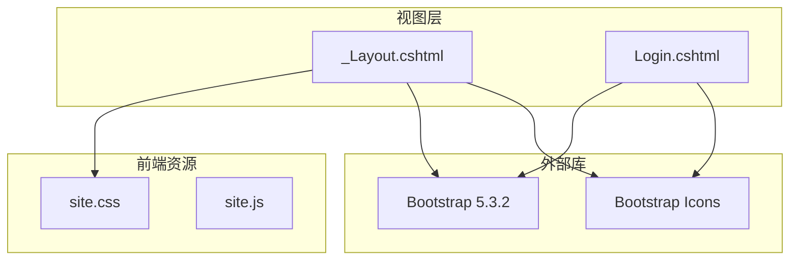
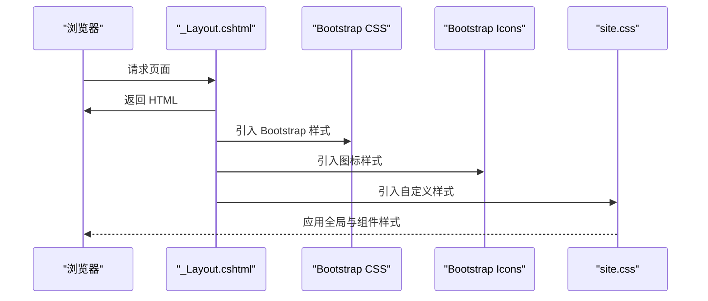
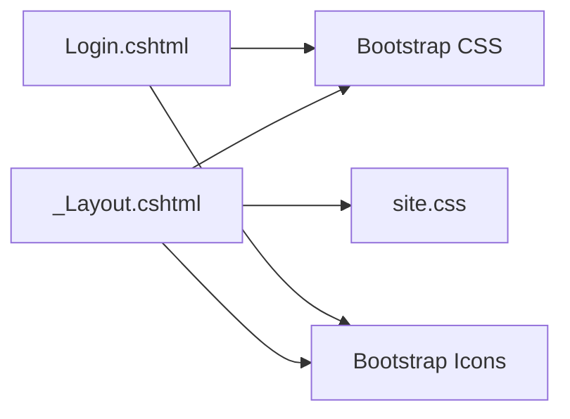

# 样式定制指南

<cite>
**本文引用的文件**
- [site.css](file://wwwroot/css/site.css)
- [_Layout.cshtml](file://Views/Shared/_Layout.cshtml)
- [Login.cshtml](file://Views/Account/Login.cshtml)
- [appsettings.json](file://appsettings.json)
</cite>

## 目录
1. [简介](#简介)
2. [项目结构](#项目结构)
3. [核心组件](#核心组件)
4. [架构总览](#架构总览)
5. [详细组件分析](#详细组件分析)
6. [依赖关系分析](#依赖关系分析)
7. [性能考虑](#性能考虑)
8. [故障排查指南](#故障排查指南)
9. [结论](#结论)
10. [附录](#附录)

## 简介
本指南面向需要对“学生管理系统”进行样式定制的开发者与设计师，围绕站点样式文件 site.css 的结构与组织方式进行深入解析，涵盖以下主题：
- 全局样式、组件样式与响应式样式的定义与组织
- 主题颜色系统与字体排版系统的定制方法
- 组件样式的覆盖策略与 CSS 选择器应用
- 响应式设计的断点与媒体查询实践
- CSS 变量的使用以实现动态样式调整
- 样式调试技巧与浏览器兼容性处理
- 实际定制案例与效果对比思路

## 项目结构
该项目采用 ASP.NET Core 视图渲染模式，样式资源位于 wwwroot/css 下，页面通过布局页统一引入 Bootstrap 与自定义样式。登录页采用独立样式以实现特定视觉风格。

图表来源
- [_Layout.cshtml:20-23](file://Views/Shared/_Layout.cshtml#L20-L23)
- [site.css:1-86](file://wwwroot/css/site.css#L1-L86)
- [Login.cshtml:15-17](file://Views/Account/Login.cshtml#L15-L17)

章节来源
- [_Layout.cshtml:14-24](file://Views/Shared/_Layout.cshtml#L14-L24)
- [site.css:1-86](file://wwwroot/css/site.css#L1-L86)
- [Login.cshtml:10-325](file://Views/Account/Login.cshtml#L10-L325)

## 核心组件
- 全局样式区：定义基础排版、背景与通用组件的基础样式，如字体族、背景色、卡片悬停效果等。
- 组件样式区：针对表格、徽章、导航栏、页脚、表单标签、分页、模态框等组件进行细化。
- 登录页样式区：在 Login.cshtml 中内联了完整的登录界面样式，包含动画、布局与响应式规则。

章节来源
- [site.css:3-86](file://wwwroot/css/site.css#L3-L86)
- [Login.cshtml:18-324](file://Views/Account/Login.cshtml#L18-L324)

## 架构总览
下图展示了页面加载时样式资源的引入顺序与作用范围：

图表来源
- [_Layout.cshtml:20-23](file://Views/Shared/_Layout.cshtml#L20-L23)
- [site.css:1-86](file://wwwroot/css/site.css#L1-L86)

## 详细组件分析

### 全局样式与基础排版
- 字体与背景：为 body 设置中文字体栈与浅色背景，确保中文显示与阅读体验。
- 卡片交互：为 .card 添加平滑过渡与阴影，悬停时轻微上浮并增强阴影，提升交互反馈。
- 表格与条纹：对表格标题与条纹行进行微调，保证数据可读性。
- 徽章与表单标签：统一徽章字重与内边距；表单标签字重与颜色统一。
- 导航栏与页脚：为导航栏添加阴影，页脚背景设为白色，形成清晰的层次感。
- 警告与按钮图标间距：为 .alert 统一圆角；为 .btn 内图标设置右间距，保持一致的图标-文本间距。
- 页面标题与分页：对 h4 标题颜色与字重进行强调；对 .pagination 做底部边距归零处理。
- 模态框头部：为 .modal-header 设置浅色背景与分隔线，明确区域边界。

章节来源
- [site.css:3-86](file://wwwroot/css/site.css#L3-L86)

### 组件样式覆盖策略
- 使用语义化类名：优先复用 Bootstrap 的 .card、.table、.btn、.modal 等类，再通过 site.css 进行差异化覆盖。
- 层级与特异性：在 site.css 中使用更具体的选择器或组合选择器，确保覆盖默认样式且不破坏 Bootstrap 原有行为。
- 组件局部样式：登录页 Login.cshtml 内联样式用于实现特定视觉（如玻璃拟态、动画粒子），避免污染全局样式。

章节来源
- [site.css:9-17](file://wwwroot/css/site.css#L9-L17)
- [site.css:19-26](file://wwwroot/css/site.css#L19-L26)
- [site.css:28-32](file://wwwroot/css/site.css#L28-L32)
- [site.css:34-42](file://wwwroot/css/site.css#L34-L42)
- [site.css:44-47](file://wwwroot/css/site.css#L44-L47)
- [site.css:50-58](file://wwwroot/css/site.css#L50-L58)
- [site.css:60-74](file://wwwroot/css/site.css#L60-L74)
- [site.css:76-86](file://wwwroot/css/site.css#L76-L86)
- [Login.cshtml:18-324](file://Views/Account/Login.cshtml#L18-L324)

### 响应式设计实现
- 视口设置：所有页面均设置 viewport，确保移动端缩放正确。
- Bootstrap 响应网格：通过 container-fluid 与 Bootstrap 的栅格系统实现流式布局。
- 登录页响应式：在 Login.cshtml 中使用媒体查询，在小屏设备上将左右布局改为上下堆叠，并调整内边距与装饰元素方向。

章节来源
- [_Layout.cshtml:18](file://Views/Shared/_Layout.cshtml#L18)
- [Login.cshtml:300-308](file://Views/Account/Login.cshtml#L300-L308)

### 主题颜色系统定制
- 颜色使用现状：项目中使用了若干颜色值（如浅灰背景、深色导航、卡片阴影、模态头部浅灰等），但未集中定义颜色变量。
- 定制建议：
  - 在 site.css 中引入 CSS 自定义属性（CSS 变量）以集中管理主色、辅色与强调色。
  - 将导航栏、按钮、徽章、警告等组件的颜色替换为变量引用，便于统一切换主题。
  - 为深色/浅色主题分别定义变量集，结合媒体查询或用户偏好自动切换。

章节来源
- [site.css:3-86](file://wwwroot/css/site.css#L3-L86)

### 字体排版系统定制
- 字体族：body 使用中文字体栈，确保在不同操作系统下的中文显示一致性。
- 字重与字号：对标题、表单标签、卡片头部等元素设置统一字重与字号，提升层级感。
- 建议：引入 CSS 变量集中管理字号、行高与字重，配合媒体查询在移动端微调排版参数。

章节来源
- [site.css:3-69](file://wwwroot/css/site.css#L3-L69)

### CSS 变量的使用方法
- 变量命名：采用语义化命名，如 --primary-color、--secondary-color、--surface-bg、--text-primary 等。
- 变量应用：将颜色、字号、圆角半径、阴影等常用值抽离为变量，集中维护。
- 动态切换：通过为根元素或特定容器设置不同的变量集，实现主题切换与动态调整。

章节来源
- [site.css:1-86](file://wwwroot/css/site.css#L1-L86)

### 实际定制案例与效果对比
- 案例一：为导航栏与按钮引入统一的主色变量，使整体视觉风格一致。
- 案例二：在登录页保留现有内联样式的基础上，将其迁移至 site.css 并通过变量控制颜色与尺寸，减少重复代码。
- 案例三：为表格与卡片增加统一的圆角与阴影变量，便于在不同主题间快速切换。

章节来源
- [site.css:34-42](file://wwwroot/css/site.css#L34-L42)
- [site.css:9-17](file://wwwroot/css/site.css#L9-L17)
- [Login.cshtml:98-113](file://Views/Account/Login.cshtml#L98-L113)

## 依赖关系分析
- 样式依赖：_Layout.cshtml 引入 Bootstrap 与 Bootstrap Icons，随后加载 site.css，确保自定义样式能覆盖默认样式。
- 登录页样式：Login.cshtml 内联样式独立于 site.css，适合特殊场景的定制，但需注意与全局样式的协调。

图表来源
- [_Layout.cshtml:20-23](file://Views/Shared/_Layout.cshtml#L20-L23)
- [Login.cshtml:15-17](file://Views/Account/Login.cshtml#L15-L17)

章节来源
- [_Layout.cshtml:20-23](file://Views/Shared/_Layout.cshtml#L20-L23)
- [Login.cshtml:15-17](file://Views/Account/Login.cshtml#L15-L17)

## 性能考虑
- 样式合并与压缩：将多处样式整合到 site.css，减少 HTTP 请求与解析开销。
- 选择器优化：避免过度使用后代选择器与通配符，降低样式计算成本。
- 动画与阴影：合理使用 transform 与 box-shadow，确保在低端设备上的流畅度。
- 响应式媒体查询：尽量使用 min-width 或 max-width 的单一条件，减少复杂查询带来的重排。

## 故障排查指南
- 样式未生效
  - 检查 site.css 是否被正确引入（_Layout.cshtml 中的链接）。
  - 确认浏览器缓存是否更新，必要时启用禁用缓存模式。
- 组件样式冲突
  - 使用浏览器开发者工具检查最终渲染的样式来源与特异性，定位冲突选择器。
  - 将覆盖规则移动到 site.css 末尾，或提高选择器特异性。
- 响应式异常
  - 确认 viewport 设置正确，检查媒体查询断点是否与设备宽度匹配。
  - 对登录页等特殊页面，单独验证其媒体查询逻辑。
- 字体显示问题
  - 确保字体栈中的字体在目标系统可用，必要时引入 Web 字体资源。

章节来源
- [_Layout.cshtml:20-23](file://Views/Shared/_Layout.cshtml#L20-L23)
- [Login.cshtml:300-308](file://Views/Account/Login.cshtml#L300-L308)

## 结论
通过对 site.css 的结构化梳理与组件化覆盖策略，可以高效地完成主题颜色、字体排版与响应式设计的定制。建议引入 CSS 变量集中管理关键视觉参数，并在登录页等特殊页面维持内联样式的同时逐步迁移到全局样式体系，以获得更好的可维护性与一致性。

## 附录
- 配置参考：项目使用 ASP.NET Core，默认配置文件为 appsettings.json，可用于注入站点名称、版权等信息，间接影响样式呈现（例如页脚文案）。

章节来源
- [appsettings.json](file://appsettings.json)