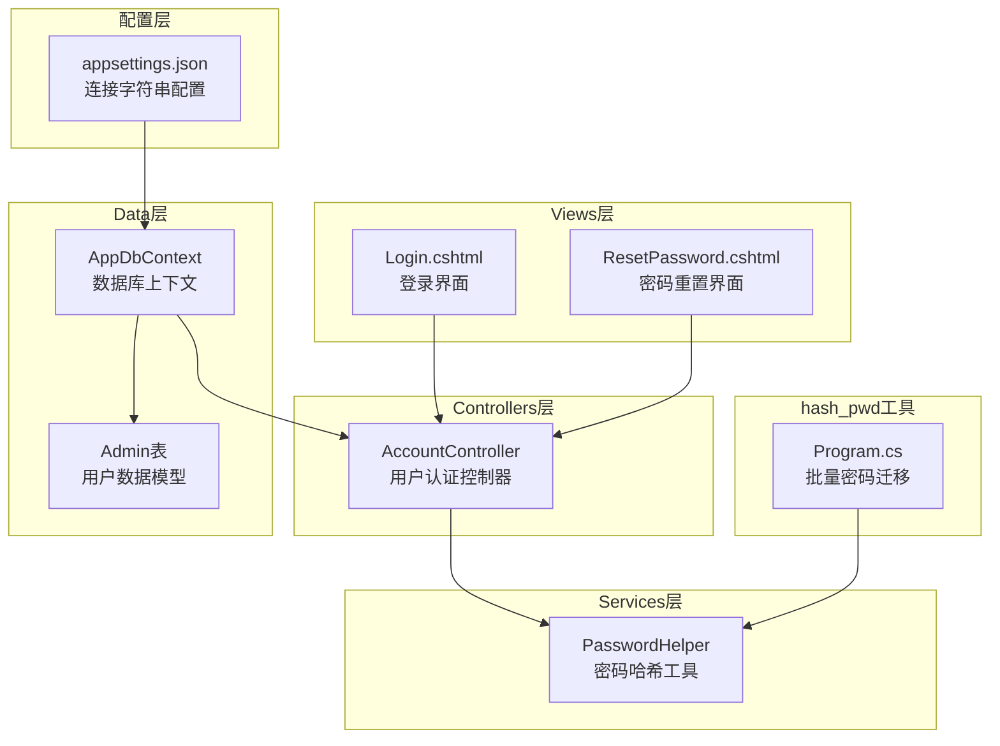
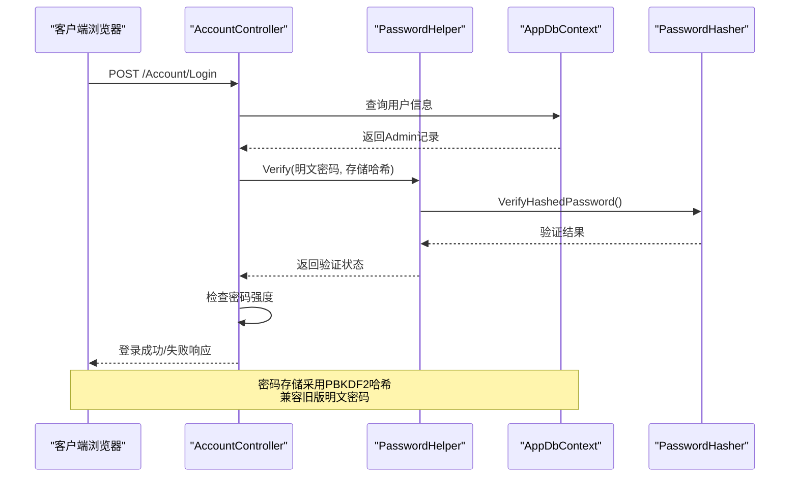
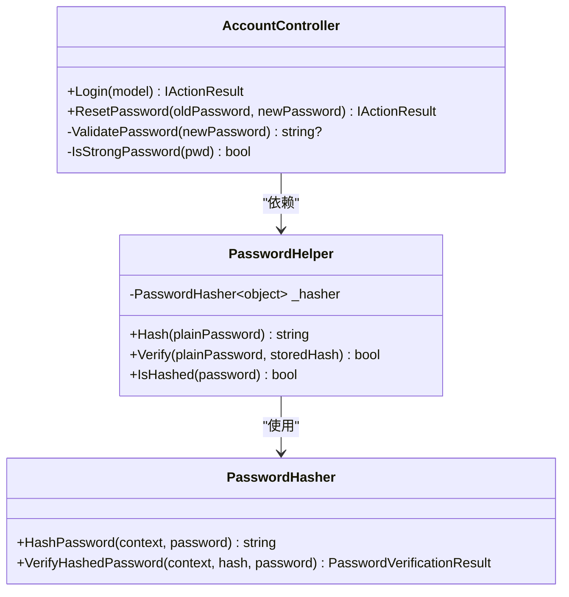
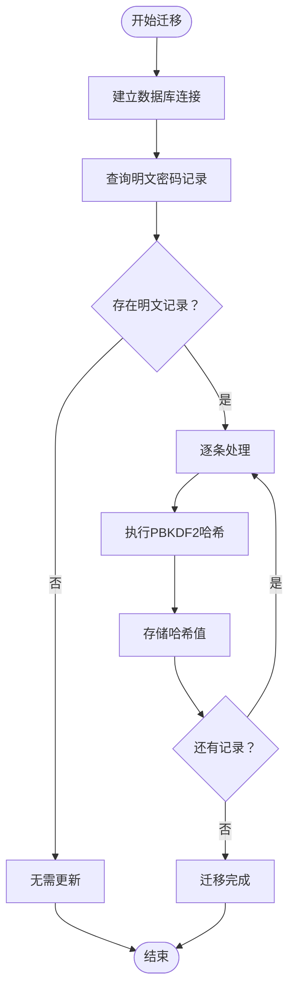
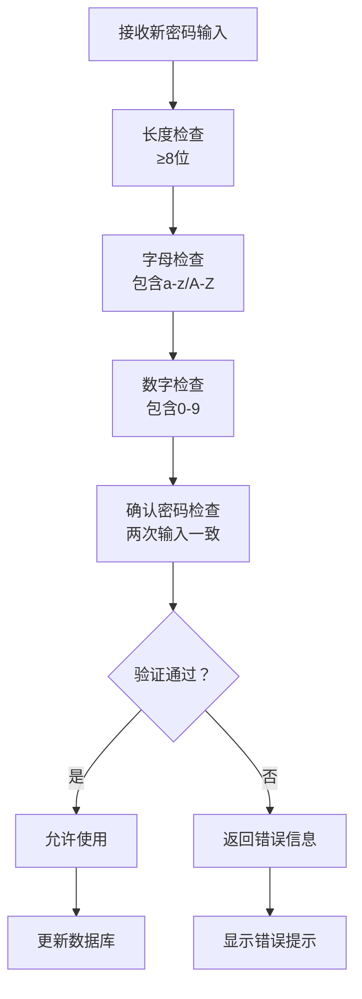
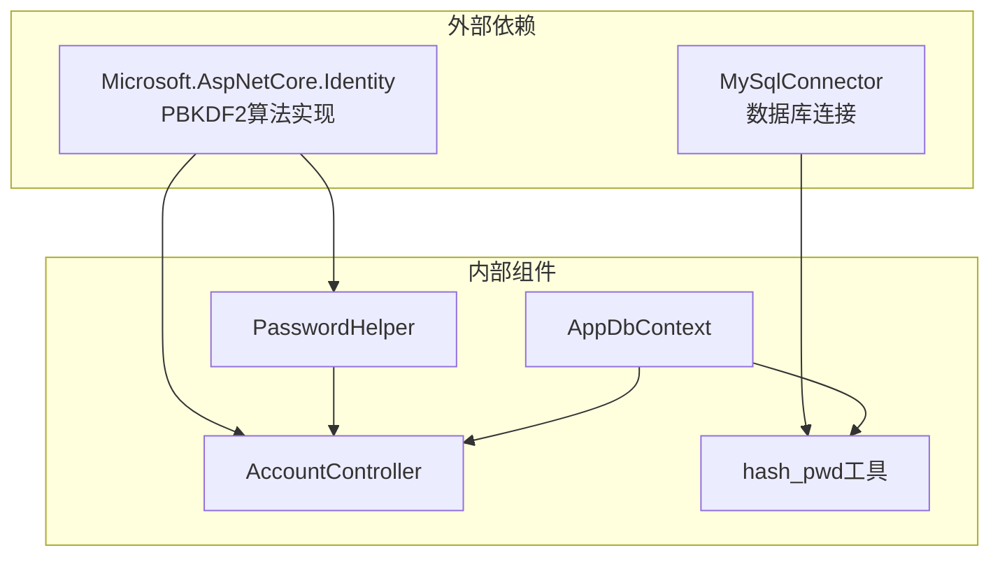

# 密码安全工具

<cite>
**本文档引用的文件**
- [PasswordHelper.cs](file://Services/PasswordHelper.cs)
- [Program.cs](file://hash_pwd/Program.cs)
- [AccountController.cs](file://Controllers/AccountController.cs)
- [Login.cshtml](file://Views/Account/Login.cshtml)
- [ResetPassword.cshtml](file://Views/Account/ResetPassword.cshtml)
- [AppDbContext.cs](file://Data/AppDbContext.cs)
- [appsettings.json](file://appsettings.json)
</cite>

## 目录
1. [简介](#简介)
2. [项目结构](#项目结构)
3. [核心组件](#核心组件)
4. [架构概览](#架构概览)
5. [详细组件分析](#详细组件分析)
6. [依赖关系分析](#依赖关系分析)
7. [性能考量](#性能考量)
8. [故障排除指南](#故障排除指南)
9. [结论](#结论)
10. [附录](#附录)

## 简介
本文件面向学生管理系统中的密码安全工具，系统性阐述hash_pwd工具的功能特性、PasswordHelper服务类的实现原理、密码哈希的安全性考量以及完整的使用示例。该系统采用ASP.NET Core Identity的PBKDF2算法进行密码哈希，具备向后兼容旧版明文密码的能力，并通过严格的密码强度验证规则确保账户安全。

## 项目结构
密码安全相关的核心文件分布于以下模块：
- Services层：PasswordHelper提供密码哈希与验证功能
- hash_pwd工具：批量迁移旧版明文密码到PBKDF2格式
- Controllers层：AccountController集成密码验证与强度检查
- Views层：登录与密码重置界面展示密码规则
- Data层：AppDbContext定义Admin表结构
- 配置层：appsettings.json提供数据库连接字符串

**图表来源**
- [PasswordHelper.cs:1-42](file://Services/PasswordHelper.cs#L1-L42)
- [AccountController.cs:1-261](file://Controllers/AccountController.cs#L1-L261)
- [Program.cs:1-43](file://hash_pwd/Program.cs#L1-L43)
- [Login.cshtml:1-463](file://Views/Account/Login.cshtml#L1-L463)
- [ResetPassword.cshtml:1-83](file://Views/Account/ResetPassword.cshtml#L1-L83)
- [AppDbContext.cs:1-295](file://Data/AppDbContext.cs#L1-L295)
- [appsettings.json:1-16](file://appsettings.json#L1-L16)

**章节来源**
- [PasswordHelper.cs:1-42](file://Services/PasswordHelper.cs#L1-L42)
- [AccountController.cs:1-261](file://Controllers/AccountController.cs#L1-L261)
- [Program.cs:1-43](file://hash_pwd/Program.cs#L1-L43)
- [Login.cshtml:1-463](file://Views/Account/Login.cshtml#L1-L463)
- [ResetPassword.cshtml:1-83](file://Views/Account/ResetPassword.cshtml#L1-L83)
- [AppDbContext.cs:1-295](file://Data/AppDbContext.cs#L1-L295)
- [appsettings.json:1-16](file://appsettings.json#L1-L16)

## 核心组件
本节深入解析密码安全工具的核心组件及其职责分工。

### PasswordHelper服务类
PasswordHelper是密码安全工具的核心，封装了PBKDF2哈希算法与兼容性验证逻辑：
- 单例PasswordHasher实例：确保算法参数一致性
- Hash方法：对明文密码进行PBKDF2哈希，返回Identity v3格式
- Verify方法：支持PBKDF2哈希与旧版明文密码双重验证
- IsHashed方法：快速识别密码是否已哈希

### hash_pwd批量迁移工具
该工具专门用于将数据库中存储的明文密码批量转换为PBKDF2格式：
- 连接MySQL数据库，查询未哈希的密码记录
- 使用PasswordHasher进行逐条哈希处理
- 批量更新Admin表的Password字段
- 提供详细的进度输出与结果统计

### AccountController集成点
AccountController在用户认证流程中深度集成了密码安全功能：
- 登录验证：调用PasswordHelper.Verify进行密码匹配
- 密码强度检查：强制非管理员用户修改弱密码
- 密码修改：前端实时验证与后端规则校验双重保障
- 安全增强：时间同步检测防止时钟偏差攻击

**章节来源**
- [PasswordHelper.cs:8-41](file://Services/PasswordHelper.cs#L8-L41)
- [Program.cs:8-42](file://hash_pwd/Program.cs#L8-L42)
- [AccountController.cs:84-124](file://Controllers/AccountController.cs#L84-L124)

## 架构概览
密码安全系统的整体架构体现了分层设计与职责分离：

**图表来源**
- [AccountController.cs:80-88](file://Controllers/AccountController.cs#L80-L88)
- [PasswordHelper.cs:19-34](file://Services/PasswordHelper.cs#L19-L34)
- [AppDbContext.cs:10-48](file://Data/AppDbContext.cs#L10-L48)

系统采用以下安全策略：
- PBKDF2算法：基于ASP.NET Core Identity的默认哈希算法
- 向后兼容：自动识别并兼容旧版明文密码
- 强密码规则：强制非管理员用户使用高强度密码
- 多重验证：前端实时验证+后端严格校验
- 安全传输：HTTPS环境下的密码传输保护

## 详细组件分析

### PasswordHelper类实现详解
PasswordHelper采用静态类设计，提供线程安全的密码处理能力：

**图表来源**
- [PasswordHelper.cs:8-41](file://Services/PasswordHelper.cs#L8-L41)
- [AccountController.cs:138-173](file://Controllers/AccountController.cs#L138-L173)

#### 核心算法特性
- PBKDF2参数：由ASP.NET Core Identity默认配置，无需手动调整
- 自适应哈希：支持Identity v3格式的哈希值
- 性能优化：单例模式避免重复初始化开销
- 内存安全：哈希过程中的敏感数据及时清理

**章节来源**
- [PasswordHelper.cs:10-16](file://Services/PasswordHelper.cs#L10-L16)
- [PasswordHelper.cs:27-30](file://Services/PasswordHelper.cs#L27-L30)

### hash_pwd批量迁移流程
批量迁移工具提供了安全可靠的密码升级方案：

**图表来源**
- [Program.cs:11-23](file://hash_pwd/Program.cs#L11-L23)
- [Program.cs:34-41](file://hash_pwd/Program.cs#L34-L41)

#### 迁移安全保障
- 原始密码零泄露：仅在内存中临时处理，不写入日志
- 事务性更新：逐条更新确保原子性
- 进度监控：实时输出处理进度与结果
- 错误处理：异常情况下的安全回滚机制

**章节来源**
- [Program.cs:14-23](file://hash_pwd/Program.cs#L14-L23)
- [Program.cs:34-41](file://hash_pwd/Program.cs#L34-L41)

### 密码强度验证体系
系统实现了多层次的密码强度验证机制：

**图表来源**
- [AccountController.cs:206-211](file://Controllers/AccountController.cs#L206-L211)
- [AccountController.cs:214-225](file://Controllers/AccountController.cs#L214-L225)

#### 验证规则细节
- 最小长度：8位字符限制
- 字符类型：必须同时包含字母和数字
- 确认机制：新密码与确认密码必须完全一致
- 实时反馈：前端JavaScript提供即时验证提示
- 后端复核：服务器端再次验证确保安全

**章节来源**
- [AccountController.cs:206-225](file://Controllers/AccountController.cs#L206-L225)
- [ResetPassword.cshtml:19-26](file://Views/Account/ResetPassword.cshtml#L19-L26)

## 依赖关系分析
密码安全工具的依赖关系体现了清晰的分层架构：

**图表来源**
- [PasswordHelper.cs](file://Services/PasswordHelper.cs#L1)
- [AccountController.cs](file://Controllers/AccountController.cs#L1)
- [Program.cs:1-2](file://hash_pwd/Program.cs#L1-L2)

### 关键依赖特性
- Identity集成：无缝使用ASP.NET Core Identity的成熟安全实现
- 数据库抽象：通过Entity Framework Core实现数据访问
- 算法标准化：采用业界标准PBKDF2算法，无需自定义实现
- 配置驱动：通过appsettings.json集中管理数据库连接

**章节来源**
- [PasswordHelper.cs](file://Services/PasswordHelper.cs#L1)
- [AccountController.cs](file://Controllers/AccountController.cs#L1)
- [Program.cs:1-2](file://hash_pwd/Program.cs#L1-L2)
- [appsettings.json:12-14](file://appsettings.json#L12-L14)

## 性能考量
密码安全工具在保证安全性的同时，充分考虑了性能优化：

### 算法性能特征
- PBKDF2成本：默认迭代次数经过精心调优，在安全性和性能间取得平衡
- 内存效率：哈希过程中的内存占用最小化
- 缓存策略：PasswordHasher单例避免重复初始化开销
- 并发安全：线程安全的静态实例设计

### 系统性能优化
- 数据库查询：Login操作通过EF Core分步执行，避免复杂查询翻译
- 前端验证：JavaScript实时验证减少无效请求
- 连接池：MySQL连接使用异步模式提高并发处理能力
- 日志控制：最小化密码相关日志输出，降低I/O开销

## 故障排除指南
针对密码安全工具可能出现的问题提供系统性解决方案：

### 常见问题诊断
- **密码验证失败**：检查存储的哈希格式是否正确，确认PBKDF2参数一致性
- **迁移工具异常**：验证数据库连接字符串，检查网络连通性
- **前端验证失效**：确认JavaScript启用，检查浏览器兼容性
- **登录超时**：检查Cookie配置和会话超时设置

### 安全事件响应
- **密码泄露风险**：立即启用应急措施，强制用户修改密码
- **暴力破解尝试**：实施账户锁定策略，增加验证码难度
- **系统时间偏差**：检查NTP同步配置，确保时间准确性
- **数据库安全**：定期备份，实施访问控制和审计日志

**章节来源**
- [AccountController.cs:234-259](file://Controllers/AccountController.cs#L234-L259)
- [Program.cs:4-6](file://hash_pwd/Program.cs#L4-L6)

## 结论
本密码安全工具通过标准化的PBKDF2算法、完善的兼容性设计和严格的验证机制，为学生管理系统提供了可靠的身份认证保障。系统不仅满足当前的安全需求，还具备良好的扩展性和维护性，能够适应未来安全标准的变化。

## 附录

### 使用示例与最佳实践

#### 用户密码存储流程
1. 用户注册或密码创建时调用PasswordHelper.Hash
2. 将返回的PBKDF2哈希值存储到数据库
3. 确保数据库字段足够容纳哈希值长度
4. 实施定期备份和访问控制

#### 密码验证工作流
1. 用户登录时收集明文密码
2. 调用PasswordHelper.Verify进行验证
3. 对于旧版明文密码自动升级为PBKDF2格式
4. 记录验证日志但避免敏感信息泄露

#### 批量密码更新操作
1. 运行hash_pwd工具扫描数据库
2. 识别未哈希的明文密码记录
3. 逐条执行PBKDF2哈希并更新
4. 监控迁移进度，处理异常情况

### 安全配置建议

#### PBKDF2参数配置
- 迭代次数：根据硬件性能调整，建议每验证操作不超过100ms
- 盐值长度：使用算法默认长度，无需手动配置
- 哈希长度：保持Identity v3格式兼容性

#### 密码策略配置
- 最小长度：8位字符，建议12位以上
- 字符复杂度：强制包含字母和数字，建议加入特殊字符
- 更新频率：建议定期更换密码，实施密码历史检查
- 失败锁定：连续失败5次后锁定账户，15分钟后自动解锁

#### 系统安全加固
- HTTPS部署：确保所有密码传输使用SSL/TLS加密
- CSRF防护：启用Anti-Forgery Token防止跨站请求伪造
- XSS防护：对用户输入进行严格过滤和转义
- 审计日志：记录所有密码相关操作，便于安全审计

### 合规性检查清单
- [ ] 符合《网络安全法》关于个人信息保护的要求
- [ ] 满足《密码法》对商用密码应用的规范
- [ ] 达到GB/T 22239-2019网络安全等级保护三级要求
- [ ] 通过ISO 27001信息安全管理体系认证
- [ ] 实施定期渗透测试和安全评估