# 工具与脚本

<cite>
**本文引用的文件**
- [DataMigrator/Program.cs](file://DataMigrator/Program.cs)
- [check_data/Program.cs](file://check_data/Program.cs)
- [check_db/Program.cs](file://check_db/Program.cs)
- [check_exam_subject/Program.cs](file://check_exam_subject/Program.cs)
- [check_user/Program.cs](file://check_user/Program.cs)
- [fix_enc/Program.cs](file://fix_enc/Program.cs)
- [hash_pwd/Program.cs](file://hash_pwd/Program.cs)
- [Services/PasswordHelper.cs](file://Services/PasswordHelper.cs)
- [appsettings.json](file://appsettings.json)
- [check_data.csx](file://check_data.csx)
- [check_user.csx](file://check_user.csx)
- [fix_encoding.ps1](file://fix_encoding.ps1)
- [read_score.ps1](file://read_score.ps1)
- [deploy.bat](file://deploy.bat)
- [Database/Add_GradeManagement_Tables.sql](file://Database/Add_GradeManagement_Tables.sql)
- [Database/Create_Announcement_Tables.sql](file://Database/Create_Announcement_Tables.sql)
- [Database/Update_Permission_Keys.sql](file://Database/Update_Permission_Keys.sql)
- [Database/Update_Student_Fields.sql](file://Database/Update_Student_Fields.sql)
</cite>

## 目录
1. 引言
2. 项目结构
3. 核心组件
4. 架构总览
5. 详细组件分析
6. 依赖关系分析
7. 性能考量
8. 故障排除指南
9. 结论
10. 附录

## 引言
本文件系统性梳理项目中的各类工具与脚本，覆盖数据迁移、数据检查、编码修复、密码哈希等场景，提供命令行参数、配置选项、执行流程、使用示例与最佳实践，并给出故障排除与扩展开发建议。读者可据此快速上手并安全地维护系统。

## 项目结构
项目包含多个独立的控制台与脚本工具，分别用于不同运维与维护任务；同时提供数据库脚本支持表结构演进与权限键迁移。

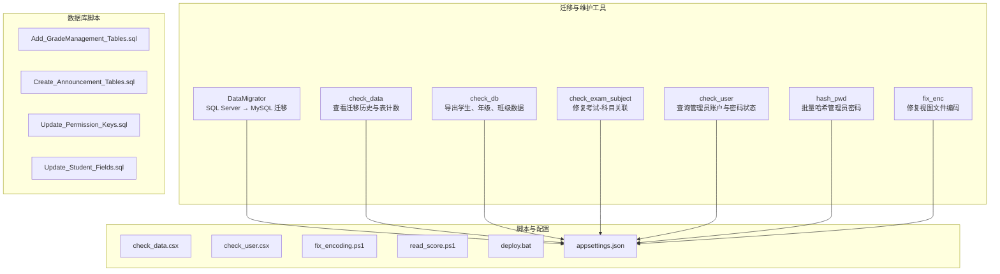

图表来源
- [DataMigrator/Program.cs:1-400](file://DataMigrator/Program.cs#L1-L400)
- [check_data/Program.cs:1-27](file://check_data/Program.cs#L1-L27)
- [check_db/Program.cs:1-35](file://check_db/Program.cs#L1-L35)
- [check_exam_subject/Program.cs:1-32](file://check_exam_subject/Program.cs#L1-L32)
- [check_user/Program.cs:1-43](file://check_user/Program.cs#L1-L43)
- [fix_enc/Program.cs:1-40](file://fix_enc/Program.cs#L1-L40)
- [hash_pwd/Program.cs:1-43](file://hash_pwd/Program.cs#L1-L43)
- [appsettings.json:1-16](file://appsettings.json#L1-L16)
- [check_data.csx:1-28](file://check_data.csx#L1-L28)
- [check_user.csx:1-43](file://check_user.csx#L1-L43)
- [fix_encoding.ps1:1-8](file://fix_encoding.ps1#L1-L8)
- [read_score.ps1:1-6](file://read_score.ps1#L1-L6)
- [deploy.bat:1-43](file://deploy.bat#L1-L43)
- [Database/Add_GradeManagement_Tables.sql:1-20](file://Database/Add_GradeManagement_Tables.sql#L1-L20)
- [Database/Create_Announcement_Tables.sql:1-31](file://Database/Create_Announcement_Tables.sql#L1-L31)
- [Database/Update_Permission_Keys.sql:1-36](file://Database/Update_Permission_Keys.sql#L1-L36)
- [Database/Update_Student_Fields.sql:1-51](file://Database/Update_Student_Fields.sql#L1-L51)

章节来源
- [DataMigrator/Program.cs:1-400](file://DataMigrator/Program.cs#L1-L400)
- [appsettings.json:1-16](file://appsettings.json#L1-L16)

## 核心组件
- 数据迁移工具：从 SQL Server 迁移到 MySQL，含连接校验、目标表清空、字段长度修复、外键开关、批量插入与回滚策略。
- 数据检查工具：查看迁移历史、统计表数量、导出关键业务表数据、修复考试-科目关联、查询管理员账户与密码状态。
- 编码修复工具：将视图文件从系统代码页读取后统一写回 UTF-8，避免乱码。
- 密码哈希工具：扫描明文密码并使用 ASP.NET Core Identity 的 PBKDF2 算法进行哈希更新。
- 脚本与配置：PowerShell 脚本用于编码修复与内容提取；批处理脚本用于部署；配置文件集中存放连接串与日志设置。
- 数据库脚本：支持新增班级管理表、公告表、权限键迁移、学生表字段完善等。

章节来源
- [DataMigrator/Program.cs:1-400](file://DataMigrator/Program.cs#L1-L400)
- [check_data/Program.cs:1-27](file://check_data/Program.cs#L1-L27)
- [check_db/Program.cs:1-35](file://check_db/Program.cs#L1-L35)
- [check_exam_subject/Program.cs:1-32](file://check_exam_subject/Program.cs#L1-L32)
- [check_user/Program.cs:1-43](file://check_user/Program.cs#L1-L43)
- [fix_enc/Program.cs:1-40](file://fix_enc/Program.cs#L1-L40)
- [hash_pwd/Program.cs:1-43](file://hash_pwd/Program.cs#L1-L43)
- [Services/PasswordHelper.cs:1-42](file://Services/PasswordHelper.cs#L1-L42)
- [appsettings.json:1-16](file://appsettings.json#L1-L16)
- [check_data.csx:1-28](file://check_data.csx#L1-L28)
- [check_user.csx:1-43](file://check_user.csx#L1-L43)
- [fix_encoding.ps1:1-8](file://fix_encoding.ps1#L1-L8)
- [read_score.ps1:1-6](file://read_score.ps1#L1-L6)
- [deploy.bat:1-43](file://deploy.bat#L1-L43)
- [Database/Add_GradeManagement_Tables.sql:1-20](file://Database/Add_GradeManagement_Tables.sql#L1-L20)
- [Database/Create_Announcement_Tables.sql:1-31](file://Database/Create_Announcement_Tables.sql#L1-L31)
- [Database/Update_Permission_Keys.sql:1-36](file://Database/Update_Permission_Keys.sql#L1-L36)
- [Database/Update_Student_Fields.sql:1-51](file://Database/Update_Student_Fields.sql#L1-L51)

## 架构总览
下图展示各工具与数据库、配置之间的交互关系：

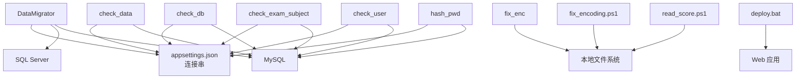

图表来源
- [DataMigrator/Program.cs:1-400](file://DataMigrator/Program.cs#L1-L400)
- [check_data/Program.cs:1-27](file://check_data/Program.cs#L1-L27)
- [check_db/Program.cs:1-35](file://check_db/Program.cs#L1-L35)
- [check_exam_subject/Program.cs:1-32](file://check_exam_subject/Program.cs#L1-L32)
- [check_user/Program.cs:1-43](file://check_user/Program.cs#L1-L43)
- [hash_pwd/Program.cs:1-43](file://hash_pwd/Program.cs#L1-L43)
- [fix_enc/Program.cs:1-40](file://fix_enc/Program.cs#L1-L40)
- [fix_encoding.ps1:1-8](file://fix_encoding.ps1#L1-L8)
- [read_score.ps1:1-6](file://read_score.ps1#L1-L6)
- [deploy.bat:1-43](file://deploy.bat#L1-L43)
- [appsettings.json:1-16](file://appsettings.json#L1-L16)

## 详细组件分析

### 数据迁移工具（SQL Server → MySQL）
- 功能概述
  - 校验 SQL Server 与 MySQL 连接
  - 修复目标表字段长度（如 Admin.Password、Admin.Username）
  - 清空目标 MySQL 表（先关闭外键检查，再恢复）
  - 按表清单批量迁移，支持分批事务提交与逐行回退
  - 输出总计迁移行数
- 命令行参数与配置
  - 默认通过常量连接字符串直接配置（SQL Server 与 MySQL），无需命令行参数
  - 可在源码中修改连接串以适配不同环境
- 执行流程
  - 连接校验 → 修复字段长度 → 清空目标表 → 关闭外键检查 → 分批迁移 → 提交事务 → 恢复外键检查 → 统计输出
- 处理逻辑要点
  - 使用 Reader 扩展方法处理空值
  - 批量插入失败时逐行重试并跳过异常行
  - 严格区分主键与非主键表的清空策略（TRUNCATE 优先，失败回退到 DELETE）

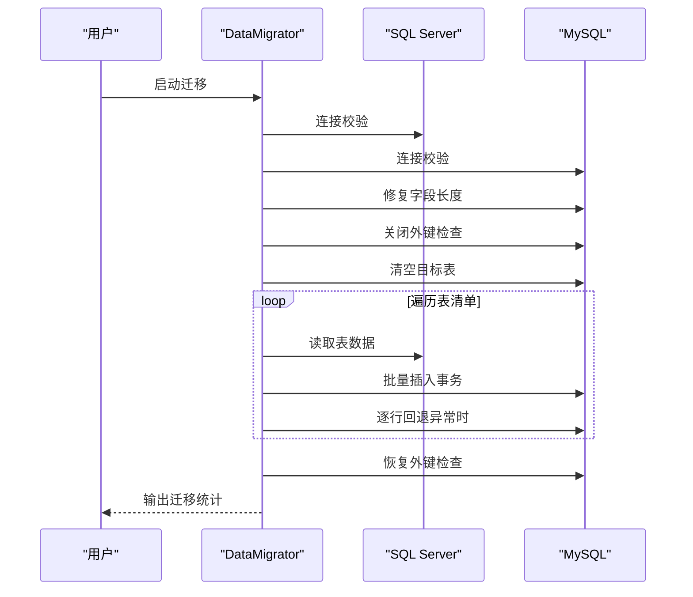

图表来源
- [DataMigrator/Program.cs:1-400](file://DataMigrator/Program.cs#L1-L400)

章节来源
- [DataMigrator/Program.cs:1-400](file://DataMigrator/Program.cs#L1-L400)

### 数据检查工具（check_data）
- 功能概述
  - 输出 EF Core 迁移历史（MigrationId 与 ProductVersion）
  - 统计指定表的数据量（如 Student、Admin、Score、ClassInfo、GradeLevel、Subject、AcademicYear、Semester）
- 命令行参数与配置
  - 无命令行参数；连接串硬编码于程序内
- 执行流程
  - 建立连接 → 查询迁移历史 → 遍历表清单 → 查询 COUNT(*) → 输出统计

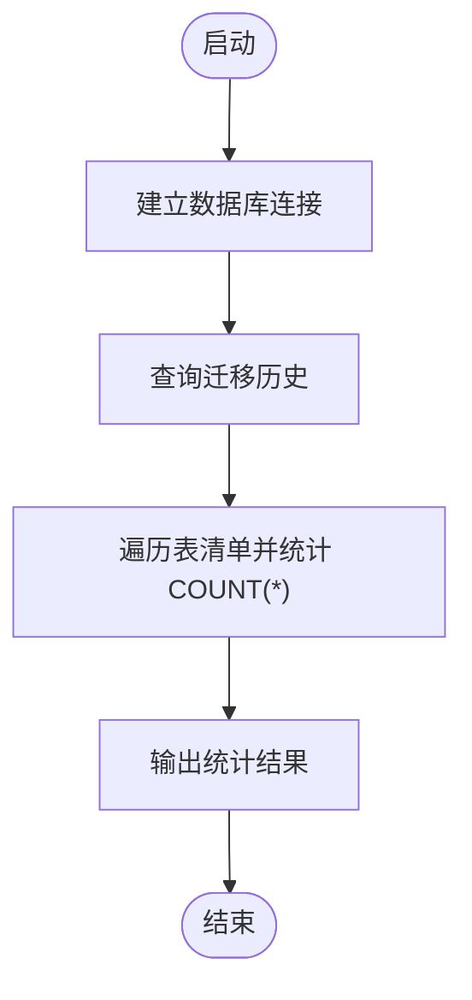

图表来源
- [check_data/Program.cs:1-27](file://check_data/Program.cs#L1-L27)

章节来源
- [check_data/Program.cs:1-27](file://check_data/Program.cs#L1-L27)
- [check_data.csx:1-28](file://check_data.csx#L1-L28)

### 数据检查工具（check_db）
- 功能概述
  - 导出学生表（含学号、姓名、年级、班级、状态）
  - 导出年级级别表（EntryYear、SchoolType）
  - 导出班级表（关联年级级别，显示 EntryYear 与 SchoolType）
- 命令行参数与配置
  - 无命令行参数；连接串硬编码于程序内
- 执行流程
  - 建立连接 → 查询学生表 → 查询年级级别表 → 查询班级表（LEFT JOIN）→ 输出结果

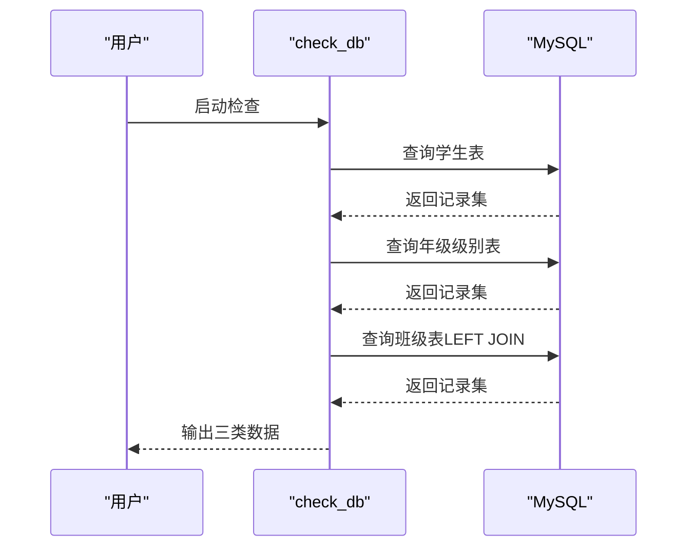

图表来源
- [check_db/Program.cs:1-35](file://check_db/Program.cs#L1-L35)

章节来源
- [check_db/Program.cs:1-35](file://check_db/Program.cs#L1-L35)

### 考试-科目关联修复工具（check_exam_subject）
- 功能概述
  - 清空 ExamSubject 表
  - 插入预设的考试-科目关联（示例：(1,1), (1,2)）
  - 验证修复后的记录数
- 命令行参数与配置
  - 无命令行参数；连接串硬编码于程序内
- 执行流程
  - 建立连接 → DELETE 清空 → INSERT 批量插入 → COUNT 验证 → 输出完成提示

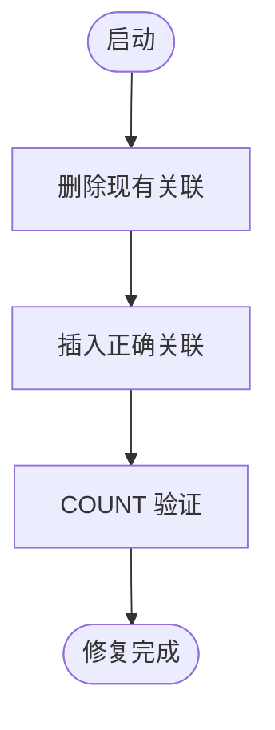

图表来源
- [check_exam_subject/Program.cs:1-32](file://check_exam_subject/Program.cs#L1-L32)

章节来源
- [check_exam_subject/Program.cs:1-32](file://check_exam_subject/Program.cs#L1-L32)

### 用户与密码检查工具（check_user）
- 功能概述
  - 支持按手机号或用户名查询管理员账户
  - 输出账户基本信息与密码字段（明文或哈希）
  - 判断密码是否为 Identity v3 哈希格式（以特定前缀开头）
  - 列出所有管理员账户
- 命令行参数与配置
  - 无命令行参数；连接串硬编码于程序内
- 执行流程
  - 建立连接 → 参数化查询 → 输出详情 → 列出所有账户

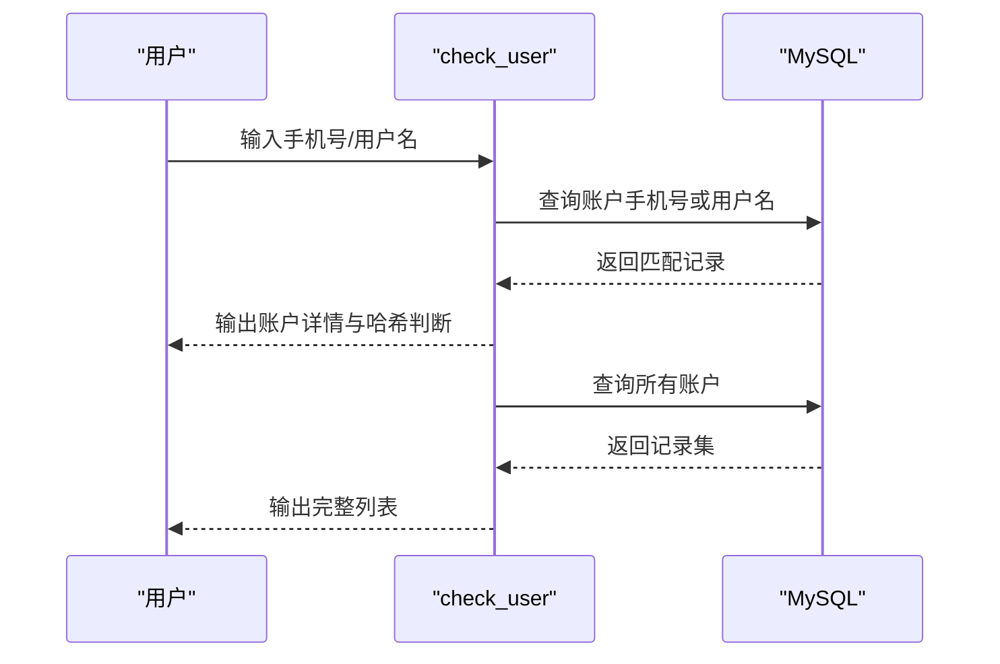

图表来源
- [check_user/Program.cs:1-43](file://check_user/Program.cs#L1-L43)

章节来源
- [check_user/Program.cs:1-43](file://check_user/Program.cs#L1-L43)
- [check_user.csx:1-43](file://check_user.csx#L1-L43)

### 编码修复工具（fix_enc）
- 功能概述
  - 读取指定视图文件字节流
  - 尝试以系统代码页（如 GBK/936）解码文本
  - 写回 UTF-8 编码，避免乱码
- 命令行参数与配置
  - 无命令行参数；文件路径硬编码于程序内
- 执行流程
  - 读取字节 → 获取系统代码页 → 解码文本 → 写回 UTF-8 → 校验首行

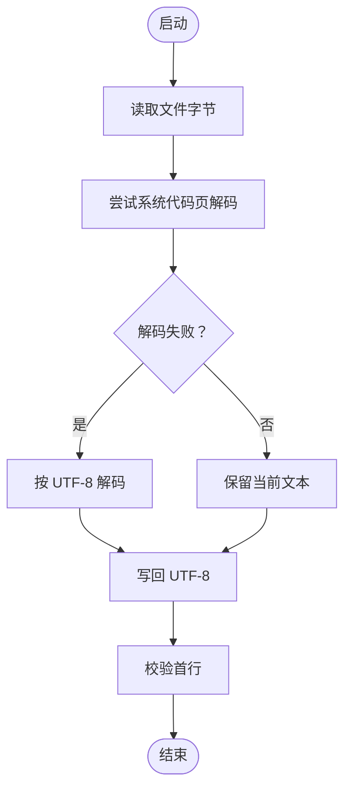

图表来源
- [fix_enc/Program.cs:1-40](file://fix_enc/Program.cs#L1-L40)

章节来源
- [fix_enc/Program.cs:1-40](file://fix_enc/Program.cs#L1-L40)
- [fix_encoding.ps1:1-8](file://fix_encoding.ps1#L1-L8)

### 密码哈希工具（hash_pwd）
- 功能概述
  - 扫描 Admin 表中非哈希格式的明文密码
  - 使用 ASP.NET Core Identity 的 PBKDF2 算法生成哈希
  - 逐条更新密码字段
- 命令行参数与配置
  - 无命令行参数；连接串硬编码于程序内
- 执行流程
  - 建立连接 → 查询明文密码 → 逐条哈希 → 更新数据库 → 输出统计

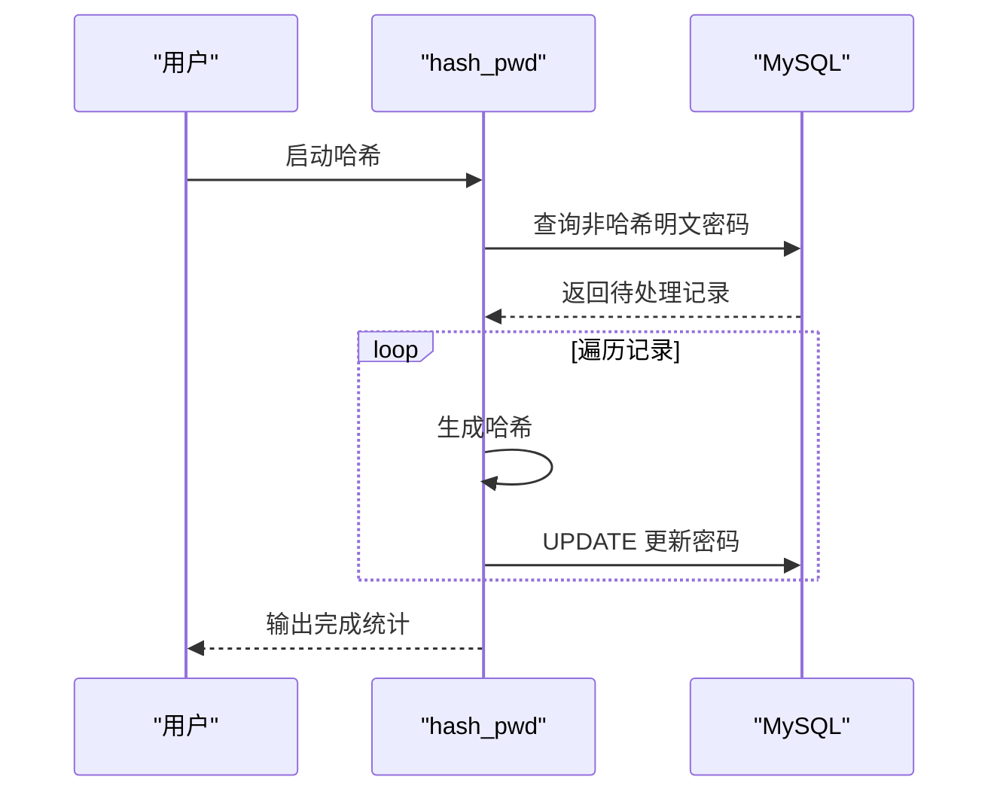

图表来源
- [hash_pwd/Program.cs:1-43](file://hash_pwd/Program.cs#L1-L43)

章节来源
- [hash_pwd/Program.cs:1-43](file://hash_pwd/Program.cs#L1-L43)
- [Services/PasswordHelper.cs:1-42](file://Services/PasswordHelper.cs#L1-L42)

### 密码哈希辅助工具（服务层）
- 功能概述
  - 对外暴露静态方法：Hash（哈希）、Verify（验证，兼容明文与哈希）、IsHashed（判断）
  - 内部使用 ASP.NET Core Identity 的 PasswordHasher
- 适用场景
  - 在业务代码中进行密码校验与兼容旧版明文存储

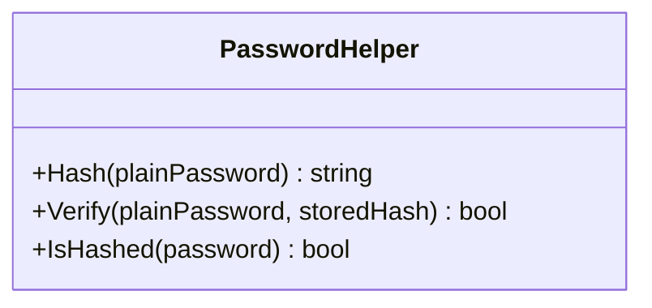

图表来源
- [Services/PasswordHelper.cs:1-42](file://Services/PasswordHelper.cs#L1-L42)

章节来源
- [Services/PasswordHelper.cs:1-42](file://Services/PasswordHelper.cs#L1-L42)

### 脚本与配置
- PowerShell 脚本
  - 编码修复脚本：注册 CodePages，按 936 解码并写回 UTF-8
  - 内容提取脚本：读取控制器文件内容并以 UTF-8 写出
- 批处理脚本
  - 部署脚本：切换控制台代码页、停止应用池、dotnet 发布、启动应用池、输出结果
- 配置文件
  - appsettings.json：日志级别、允许主机、IP 限制、默认连接串（MySQL）

章节来源
- [fix_encoding.ps1:1-8](file://fix_encoding.ps1#L1-L8)
- [read_score.ps1:1-6](file://read_score.ps1#L1-L6)
- [deploy.bat:1-43](file://deploy.bat#L1-L43)
- [appsettings.json:1-16](file://appsettings.json#L1-L16)

### 数据库脚本
- 新增班级管理表
  - 创建 GradeLevel 与 ClassInfo 表，并建立外键约束
- 新增公告表
  - 创建 Announcement 与 AnnouncementRead 表
- 权限键迁移
  - 将旧权限键替换为新键（如 edit_student → student_edit 等）
- 学生表字段完善
  - 删除冗余字段、重命名字段、新增必要字段并验证

章节来源
- [Database/Add_GradeManagement_Tables.sql:1-20](file://Database/Add_GradeManagement_Tables.sql#L1-L20)
- [Database/Create_Announcement_Tables.sql:1-31](file://Database/Create_Announcement_Tables.sql#L1-L31)
- [Database/Update_Permission_Keys.sql:1-36](file://Database/Update_Permission_Keys.sql#L1-L36)
- [Database/Update_Student_Fields.sql:1-51](file://Database/Update_Student_Fields.sql#L1-L51)

## 依赖关系分析
- 工具与数据库
  - 所有 C# 控制台工具均依赖 MySQLConnector 进行数据库访问
  - DataMigrator 同时依赖 Microsoft.Data.SqlClient 与 MySqlConnector
- 工具与文件系统
  - fix_enc 与 fix_encoding.ps1 直接操作本地文件
- 工具与配置
  - appsettings.json 提供默认连接串，便于在运行时读取（可在应用代码中使用）
- 工具与第三方库
  - hash_pwd 与 PasswordHelper 依赖 ASP.NET Core Identity 的 PasswordHasher

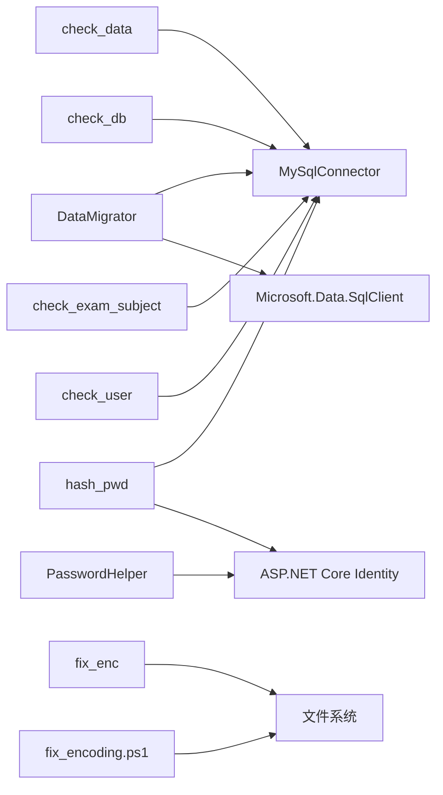

图表来源
- [DataMigrator/Program.cs:1-400](file://DataMigrator/Program.cs#L1-L400)
- [check_data/Program.cs:1-27](file://check_data/Program.cs#L1-L27)
- [check_db/Program.cs:1-35](file://check_db/Program.cs#L1-L35)
- [check_exam_subject/Program.cs:1-32](file://check_exam_subject/Program.cs#L1-L32)
- [check_user/Program.cs:1-43](file://check_user/Program.cs#L1-L43)
- [hash_pwd/Program.cs:1-43](file://hash_pwd/Program.cs#L1-L43)
- [Services/PasswordHelper.cs:1-42](file://Services/PasswordHelper.cs#L1-L42)
- [fix_enc/Program.cs:1-40](file://fix_enc/Program.cs#L1-L40)
- [fix_encoding.ps1:1-8](file://fix_encoding.ps1#L1-L8)

章节来源
- [DataMigrator/Program.cs:1-400](file://DataMigrator/Program.cs#L1-L400)
- [hash_pwd/Program.cs:1-43](file://hash_pwd/Program.cs#L1-L43)
- [Services/PasswordHelper.cs:1-42](file://Services/PasswordHelper.cs#L1-L42)

## 性能考量
- 批量迁移
  - DataMigrator 使用 500 行批次插入并启用事务，减少往返次数；失败时逐行回退，兼顾稳定性
- 外键控制
  - 迁移前关闭外键检查，迁移后恢复，避免约束导致的性能与失败问题
- 空值处理
  - 使用 Reader 扩展方法统一处理空值，避免显式判断带来的分支复杂度
- I/O 优化
  - 编码修复工具一次性读取字节，按需解码并写回，避免多次磁盘访问

章节来源
- [DataMigrator/Program.cs:307-386](file://DataMigrator/Program.cs#L307-L386)
- [DataMigrator/Program.cs:389-399](file://DataMigrator/Program.cs#L389-L399)
- [fix_enc/Program.cs:1-40](file://fix_enc/Program.cs#L1-L40)

## 故障排除指南
- 连接失败
  - 检查 appsettings.json 中的连接串或工具源码中的连接常量
  - 确认数据库服务可用、凭据正确、网络可达
- 迁移中断或卡顿
  - 查看批处理日志，确认是否触发逐行回退
  - 检查目标表是否存在约束冲突，必要时重新执行外键开关步骤
- 编码乱码
  - 使用 fix_encoding.ps1 或 fix_enc 修复文件编码
  - 确保系统已注册 CodePages 提供程序
- 密码哈希不生效
  - 确认数据库中密码字段已更新为哈希格式
  - 在业务层调用 PasswordHelper.Verify 以兼容旧版明文
- 部署失败
  - 检查 deploy.bat 的返回码与输出
  - 确认 appcmd 可用、应用池名称正确、发布目录可写

章节来源
- [appsettings.json:1-16](file://appsettings.json#L1-L16)
- [DataMigrator/Program.cs:13-22](file://DataMigrator/Program.cs#L13-L22)
- [DataMigrator/Program.cs:347-386](file://DataMigrator/Program.cs#L347-L386)
- [fix_encoding.ps1:1-8](file://fix_encoding.ps1#L1-L8)
- [fix_enc/Program.cs:1-40](file://fix_enc/Program.cs#L1-L40)
- [Services/PasswordHelper.cs:18-34](file://Services/PasswordHelper.cs#L18-L34)
- [deploy.bat:1-43](file://deploy.bat#L1-L43)

## 结论
本项目提供了完善的工具链：从数据迁移、完整性检查、编码修复到密码哈希与部署脚本，覆盖了日常运维与维护的关键环节。通过统一的连接配置与模块化的实现，这些工具既易于使用又便于扩展与定制。

## 附录

### 使用示例与最佳实践
- 数据迁移
  - 修改 DataMigrator 中的连接串以匹配生产环境
  - 建议在迁移前备份目标数据库
  - 执行前先运行 check_data 与 check_db 核对表结构与数据
- 数据检查
  - 使用 check_data 与 check_db 定期巡检关键表
  - 使用 check_user 验证管理员账户状态与密码格式
- 编码修复
  - 在多语言环境下统一使用 UTF-8
  - 优先使用 fix_encoding.ps1，必要时使用 fix_enc
- 密码哈希
  - 先运行 hash_pwd 批量哈希，再在业务层使用 PasswordHelper.Verify
  - 逐步淘汰明文存储
- 自动化与定时任务
  - 将脚本整合到 CI/CD 流水线
  - 使用计划任务定期执行 check_* 与修复脚本
- 扩展与定制
  - 新增检查项：在对应 Program.cs 中添加查询与输出
  - 新增迁移表：在 DataMigrator 的表清单与映射函数中补充
  - 新增数据库脚本：在 Database 目录下编写 T-SQL 并按需执行

### 配置方法与环境要求
- 运行环境
  - .NET 运行时（用于 C# 工具）
  - PowerShell（用于 .ps1 脚本）
  - MySQL 与 SQL Server（取决于工具用途）
- 配置要点
  - appsettings.json 提供默认连接串，可在应用代码中读取
  - 工具源码中的连接常量可直接修改以适配不同环境

章节来源
- [appsettings.json:1-16](file://appsettings.json#L1-L16)
- [DataMigrator/Program.cs:5-8](file://DataMigrator/Program.cs#L5-L8)
- [fix_encoding.ps1:1-8](file://fix_encoding.ps1#L1-L8)
- [deploy.bat:1-43](file://deploy.bat#L1-L43)