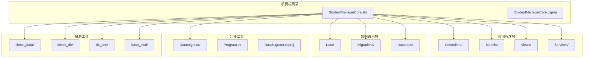
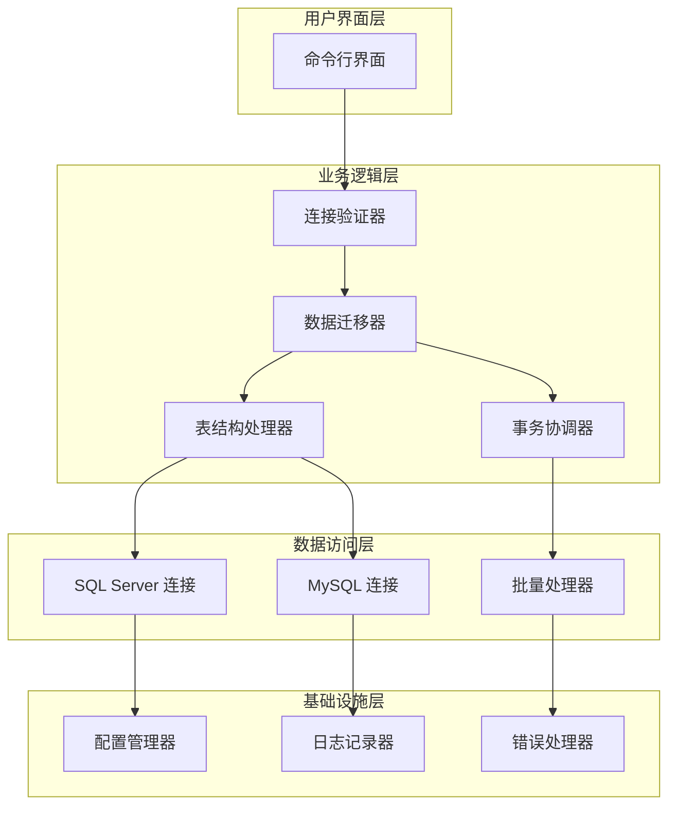
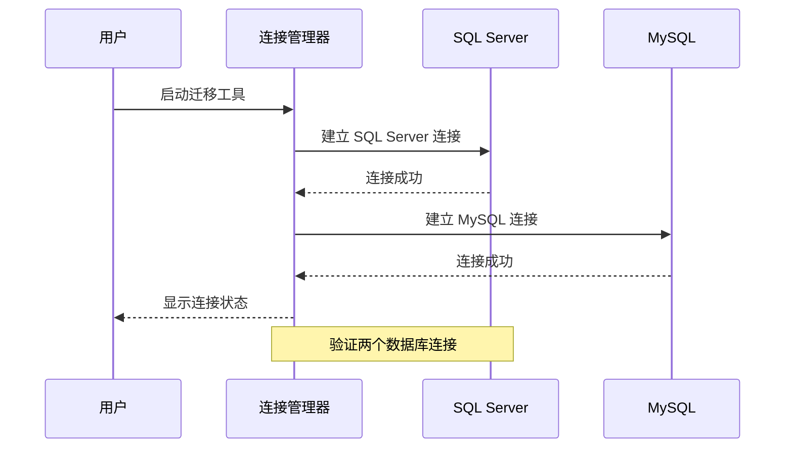
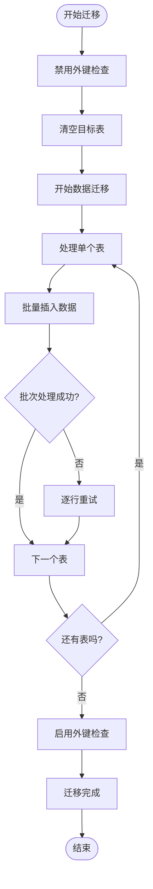
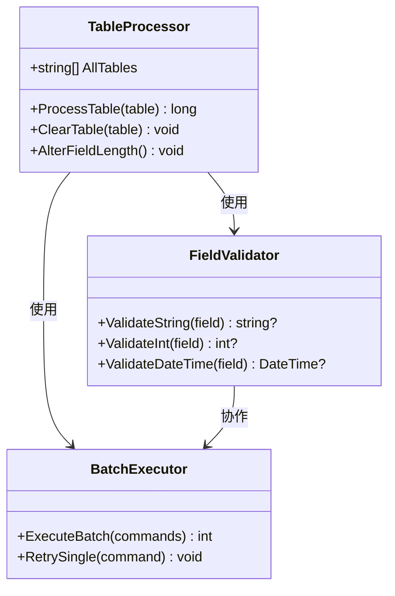
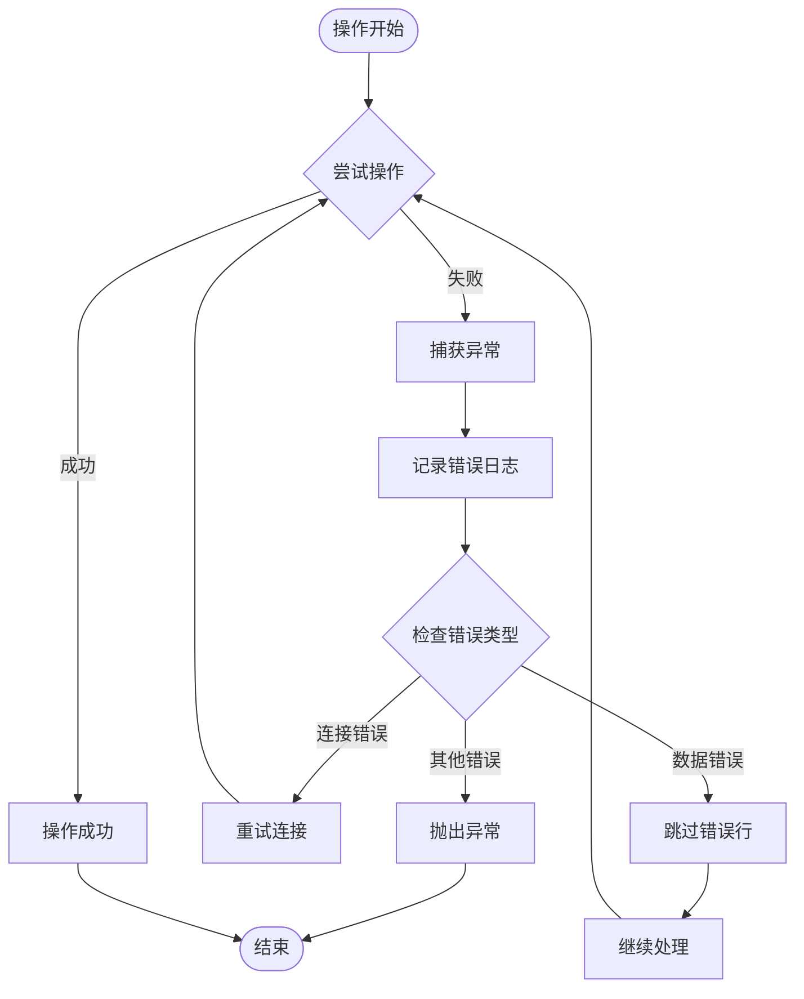
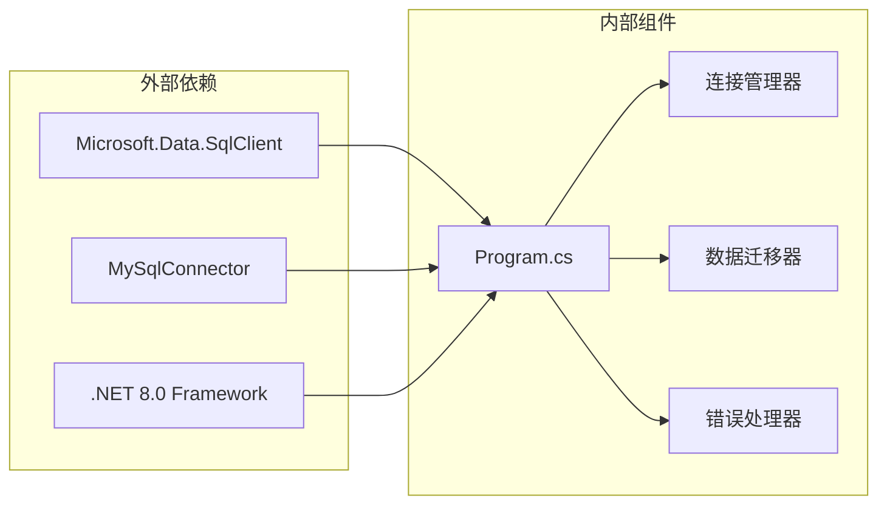

# 数据迁移工具

<cite>
**本文档引用的文件**
- [Program.cs](file://DataMigrator/Program.cs)
- [DataMigrator.csproj](file://DataMigrator/DataMigrator.csproj)
- [AppDbContext.cs](file://Data/AppDbContext.cs)
- [appsettings.json](file://appsettings.json)
- [20260609075559_InitialCreate.cs](file://Migrations/20260609075559_InitialCreate.cs)
- [Add_GradeManagement_Tables.sql](file://Database/Add_GradeManagement_Tables.sql)
- [Create_Announcement_Tables.sql](file://Database/Create_Announcement_Tables.sql)
- [deploy.bat](file://deploy.bat)
- [SubjectController.cs](file://Controllers/SubjectController.cs)
</cite>

## 目录
1. [简介](#简介)
2. [项目结构](#项目结构)
3. [核心组件](#核心组件)
4. [架构概览](#架构概览)
5. [详细组件分析](#详细组件分析)
6. [依赖关系分析](#依赖关系分析)
7. [性能考虑](#性能考虑)
8. [故障排除指南](#故障排除指南)
9. [结论](#结论)
10. [附录](#附录)

## 简介

数据迁移工具是学生管理系统中的一个专用工具，用于在不同数据库之间进行数据迁移和结构转换。该工具主要负责将 SQL Server 数据库中的数据迁移到 MySQL 数据库中，支持完整的数据库结构迁移、数据同步和版本升级功能。

该工具采用 C# 编写，基于 .NET 8.0 框架，使用 Microsoft.Data.SqlClient 和 MySqlConnector 库来处理数据库连接。工具提供了完整的数据迁移流程，包括连接验证、表结构清理、数据迁移和完整性检查等步骤。

## 项目结构

学生管理系统采用典型的三层架构设计，数据迁移工具位于独立的 DataMigrator 目录中，与主应用程序分离，确保迁移操作不会影响生产环境的正常运行。



**图表来源**
- [Program.cs:1-400](file://DataMigrator/Program.cs#L1-L400)
- [DataMigrator.csproj:1-16](file://DataMigrator/DataMigrator.csproj#L1-L16)

**章节来源**
- [Program.cs:1-400](file://DataMigrator/Program.cs#L1-L400)
- [DataMigrator.csproj:1-16](file://DataMigrator/DataMigrator.csproj#L1-L16)

## 核心组件

数据迁移工具由以下核心组件构成：

### 主要功能模块

1. **连接管理器** - 负责建立和维护 SQL Server 和 MySQL 数据库连接
2. **数据迁移引擎** - 实现跨数据库的数据传输和转换
3. **表结构管理器** - 处理数据库表的创建、删除和结构变更
4. **事务处理器** - 确保数据迁移的完整性和一致性
5. **错误处理系统** - 提供完善的异常捕获和恢复机制

### 支持的数据库对象

工具支持以下数据库表的迁移：
- AcademicYear（学年表）
- Admin（管理员表）
- Student（学生表）
- GradeLevel（年级表）
- Subject（科目表）
- SiteConfig（站点配置表）
- Announcement（公告表）
- OperationLog（操作日志表）
- Semester（学期表）
- ClassInfo（班级表）
- SubjectTeacher（教师科目表）
- SubjectClass（科目班级表）
- AnnouncementRead（公告阅读记录表）
- ExamSchedule（考试安排表）
- ExamSubject（考试科目表）
- Score（成绩表）

**章节来源**
- [Program.cs:36-55](file://DataMigrator/Program.cs#L36-L55)
- [Program.cs:66-290](file://DataMigrator/Program.cs#L66-L290)

## 架构概览

数据迁移工具采用分层架构设计，确保了良好的可维护性和扩展性。



**图表来源**
- [Program.cs:13-55](file://DataMigrator/Program.cs#L13-L55)
- [Program.cs:307-345](file://DataMigrator/Program.cs#L307-L345)

## 详细组件分析

### 连接管理器

连接管理器负责建立和验证与源数据库和目标数据库的连接。



**图表来源**
- [Program.cs:14-22](file://DataMigrator/Program.cs#L14-L22)

连接管理器的主要特性：
- 支持 SQL Server 和 MySQL 双数据库连接
- 自动连接验证和错误报告
- 使用常量字符串存储连接信息
- 支持信任服务器证书和加密配置

**章节来源**
- [Program.cs:5-22](file://DataMigrator/Program.cs#L5-L22)

### 数据迁移引擎

数据迁移引擎是工具的核心组件，负责将数据从源数据库迁移到目标数据库。



**图表来源**
- [Program.cs:57-297](file://DataMigrator/Program.cs#L57-L297)

数据迁移引擎的关键特性：
- 支持 500 行批量处理，提高迁移效率
- 自动禁用和启用外键约束
- 完善的错误处理和重试机制
- 实时进度显示和统计

**章节来源**
- [Program.cs:307-386](file://DataMigrator/Program.cs#L307-L386)

### 表结构处理器

表结构处理器负责管理数据库表的创建、删除和结构变更。



**图表来源**
- [Program.cs:36-55](file://DataMigrator/Program.cs#L36-L55)
- [Program.cs:389-399](file://DataMigrator/Program.cs#L389-L399)

**章节来源**
- [Program.cs:36-55](file://DataMigrator/Program.cs#L36-L55)
- [Program.cs:389-399](file://DataMigrator/Program.cs#L389-L399)

### 错误处理系统

错误处理系统提供了多层次的异常捕获和恢复机制。



**图表来源**
- [Program.cs:327-384](file://DataMigrator/Program.cs#L327-L384)

**章节来源**
- [Program.cs:327-384](file://DataMigrator/Program.cs#L327-L384)

## 依赖关系分析

数据迁移工具的依赖关系相对简单，主要依赖于数据库连接库和 .NET 框架。



**图表来源**
- [DataMigrator.csproj:10-13](file://DataMigrator/DataMigrator.csproj#L10-L13)

**章节来源**
- [DataMigrator.csproj:10-13](file://DataMigrator/DataMigrator.csproj#L10-L13)

### 数据库连接配置

工具支持多种数据库连接方式：

| 连接类型 | 连接字符串示例 | 特殊配置 |
|---------|---------------|----------|
| SQL Server | `Server=localhost;Database=StudentManagerDB;User Id=sa;Password=***;TrustServerCertificate=True;Encrypt=False;` | 支持信任证书，禁用加密 |
| MySQL | `Server=localhost;Database=StudentManagerDB;User Id=root;Password=***;` | 标准 MySQL 连接 |

**章节来源**
- [Program.cs:6-7](file://DataMigrator/Program.cs#L6-L7)
- [appsettings.json:12-14](file://appsettings.json#L12-L14)

## 性能考虑

数据迁移工具在设计时充分考虑了性能优化：

### 批量处理优化
- 默认批量大小为 500 行，平衡内存使用和处理效率
- 使用事务批量提交，减少数据库往返次数
- 支持逐行重试机制，确保数据完整性

### 内存管理
- 使用 `await using` 语句确保资源及时释放
- 分批处理避免大量数据同时驻留内存
- 异步操作提升整体响应性能

### 数据库优化
- 迁移前禁用外键检查，迁移后重新启用
- 使用参数化查询防止 SQL 注入
- 优化字段映射减少数据转换开销

## 故障排除指南

### 常见问题及解决方案

#### 连接问题
**问题**: 无法连接到数据库
**原因**: 
- 连接字符串配置错误
- 数据库服务未启动
- 网络连接问题

**解决方案**:
1. 检查连接字符串格式和参数
2. 验证数据库服务状态
3. 测试网络连通性

#### 权限问题
**问题**: 迁移过程中出现权限错误
**原因**:
- 目标数据库用户权限不足
- 外键约束冲突

**解决方案**:
1. 确认目标数据库用户具有足够的权限
2. 检查并调整外键约束设置
3. 以管理员身份运行迁移工具

#### 数据类型不匹配
**问题**: 字段映射失败或数据截断
**原因**:
- 源数据库和目标数据库字段类型不兼容
- 字符串长度超出限制

**解决方案**:
1. 检查字段定义和长度限制
2. 调整字段映射规则
3. 手动修正数据类型

### 日志记录和监控

工具提供了详细的日志输出，包括：
- 连接状态信息
- 迁移进度统计
- 错误详情和警告
- 性能指标

**章节来源**
- [Program.cs:14-22](file://DataMigrator/Program.cs#L14-L22)
- [Program.cs:327-384](file://DataMigrator/Program.cs#L327-L384)

## 结论

数据迁移工具是一个功能完善、设计合理的数据库迁移解决方案。它具备以下优势：

1. **可靠性**: 完善的错误处理和重试机制确保迁移过程的稳定性
2. **效率**: 批量处理和异步操作提升了迁移速度
3. **安全性**: 参数化查询和权限控制保障了数据安全
4. **易用性**: 简洁的命令行界面和清晰的日志输出便于使用

该工具特别适用于需要在 SQL Server 和 MySQL 之间进行数据迁移的场景，为学生管理系统的数据库升级和迁移提供了可靠的解决方案。

## 附录

### 使用示例

#### 基本迁移命令
```bash
# 启动数据迁移工具
cd DataMigrator
dotnet run
```

#### 批量迁移操作
工具自动处理批量迁移，无需额外配置。默认每批处理 500 行数据。

#### 回滚机制
当前版本不支持自动回滚功能。如需回滚，建议：
1. 在迁移前备份目标数据库
2. 使用数据库的事务功能
3. 手动执行反向迁移操作

### 最佳实践

1. **迁移前准备**
   - 备份源数据库和目标数据库
   - 确保有足够的磁盘空间
   - 关闭相关的应用程序和服务

2. **迁移过程监控**
   - 密切关注迁移进度和错误日志
   - 监控数据库性能指标
   - 准备应急回退方案

3. **迁移后验证**
   - 验证数据完整性
   - 检查索引和约束
   - 测试应用程序功能

### 环境要求

- **操作系统**: Windows/Linux/macOS
- **.NET 版本**: .NET 8.0 或更高版本
- **数据库**: SQL Server 和 MySQL
- **内存**: 至少 4GB RAM
- **存储**: 根据数据量需求预留足够空间