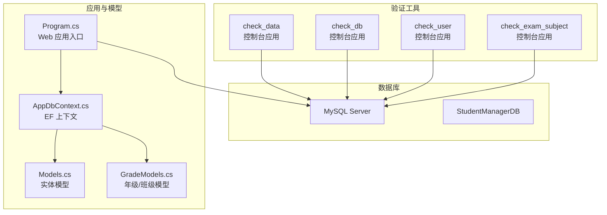
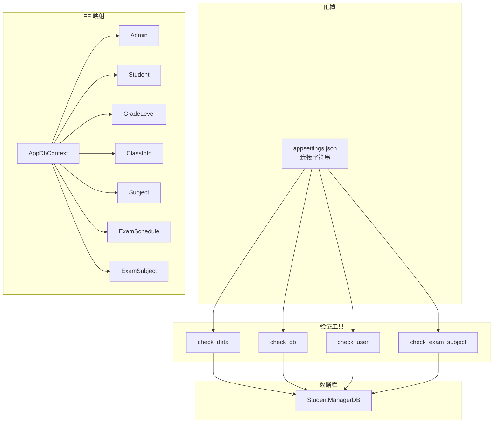
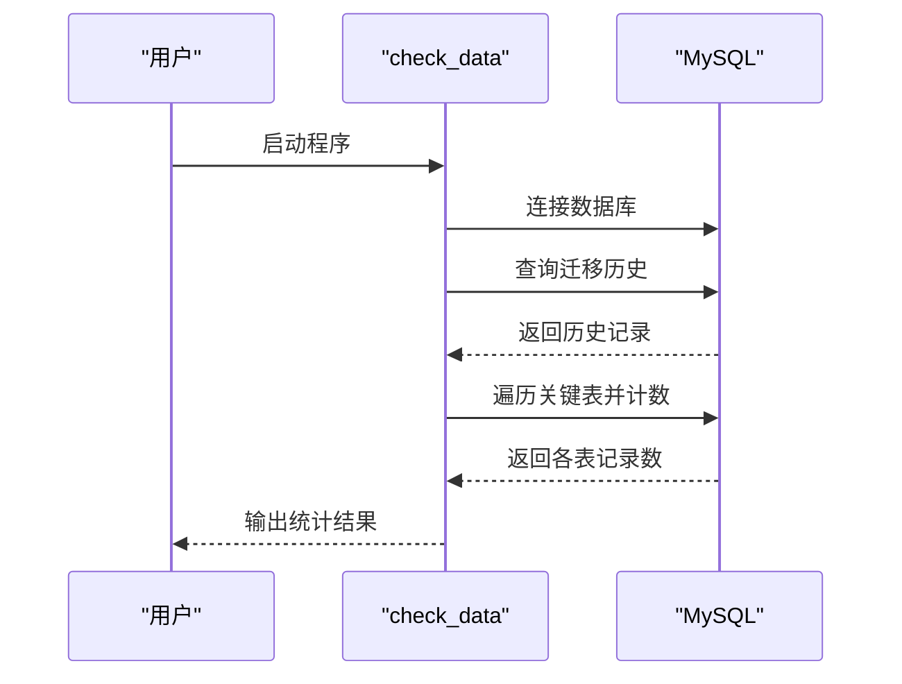
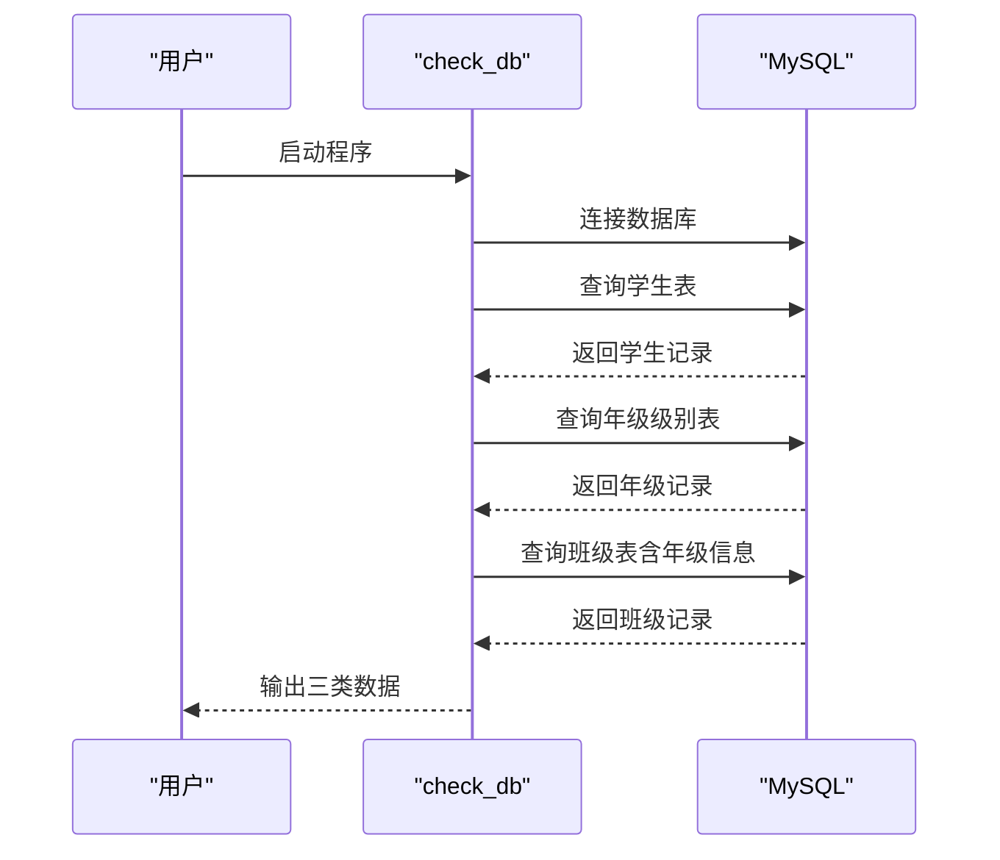
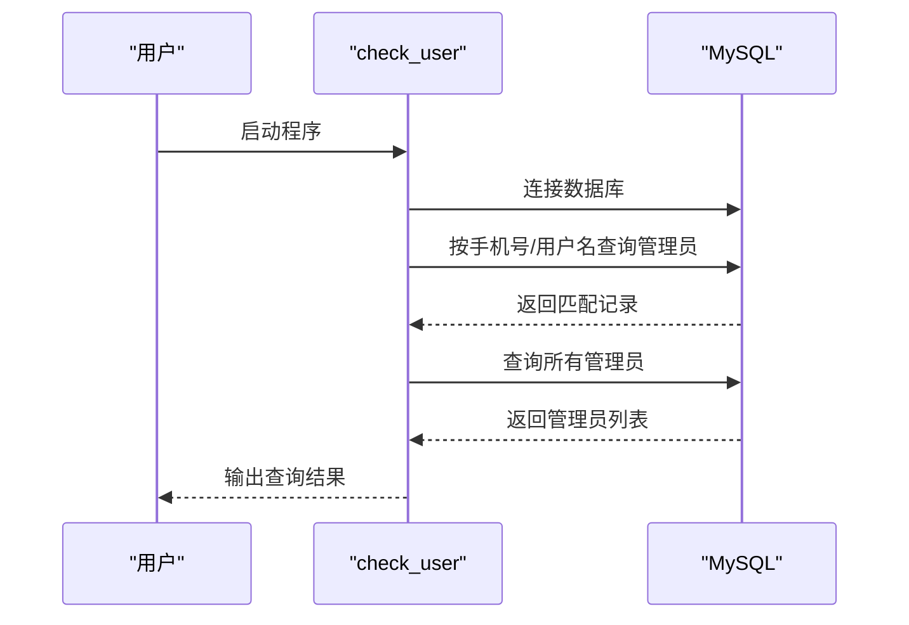
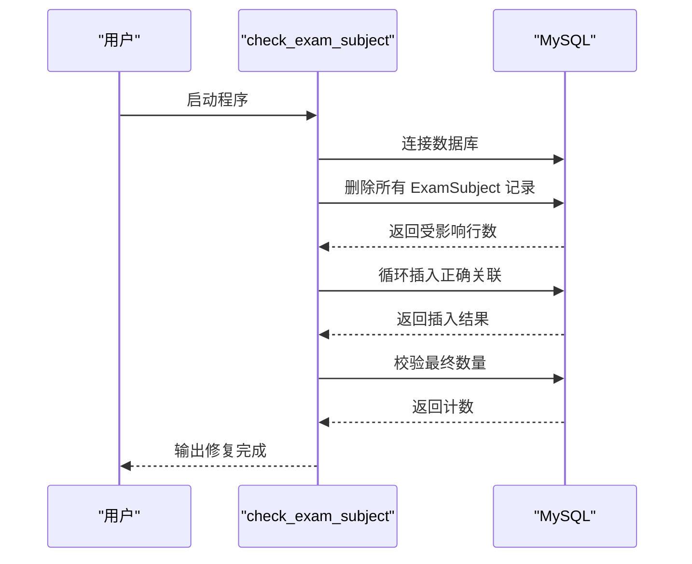
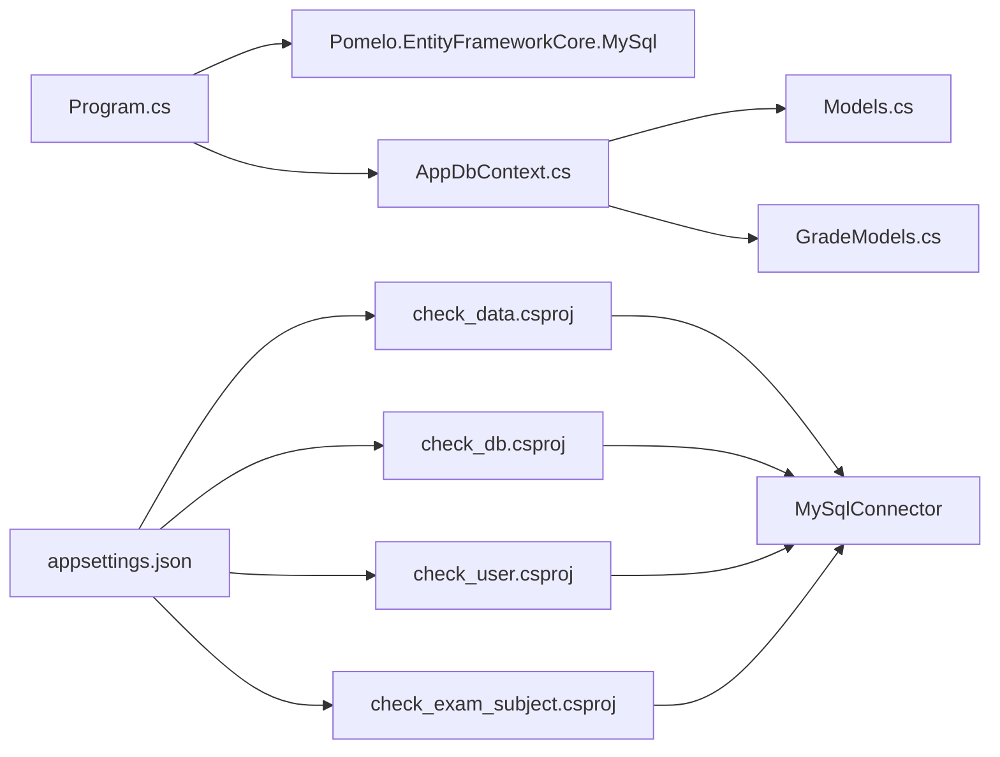

# 数据验证工具

<cite>
**本文引用的文件**
- [check_data/Program.cs](file://check_data/Program.cs)
- [check_db/Program.cs](file://check_db/Program.cs)
- [check_user/Program.cs](file://check_user/Program.cs)
- [check_exam_subject/Program.cs](file://check_exam_subject/Program.cs)
- [check_data.csx](file://check_data.csx)
- [check_user.csx](file://check_user.csx)
- [check_data.csproj](file://check_data/check_data.csproj)
- [check_db.csproj](file://check_db/check_db.csproj)
- [check_user.csproj](file://check_user/check_user.csproj)
- [check_exam_subject.csproj](file://check_exam_subject/check_exam_subject.csproj)
- [Program.cs](file://Program.cs)
- [AppDbContext.cs](file://Data/AppDbContext.cs)
- [Models.cs](file://Models/Models.cs)
- [GradeModels.cs](file://Models/GradeModels.cs)
- [appsettings.json](file://appsettings.json)
</cite>

## 目录
1. [简介](#简介)
2. [项目结构](#项目结构)
3. [核心组件](#核心组件)
4. [架构总览](#架构总览)
5. [详细组件分析](#详细组件分析)
6. [依赖关系分析](#依赖关系分析)
7. [性能考虑](#性能考虑)
8. [故障排除指南](#故障排除指南)
9. [结论](#结论)
10. [附录](#附录)

## 简介
本文件面向“数据验证工具系列”的使用与维护，系统性说明以下四个独立控制台工具的功能定位、命令行参数、输出格式、过滤选项、批量验证脚本与自动化检查流程，并给出验证结果的解读方法与修复建议：
- check_data：验证数据完整性，包括重复数据检测、空值检查、格式验证与基础统计。
- check_db：数据库健康检查，包括表结构验证、索引完整性检查、约束冲突检测与数据一致性核验。
- check_user：用户数据验证，包括用户信息一致性检查与权限状态验证。
- check_exam_subject：考试科目数据检查，包括科目分配验证与时间冲突检测。

同时，文档结合实体框架映射与数据库模型，帮助读者理解各工具的检查依据与修复策略。

## 项目结构
四个验证工具均为独立的 .NET 控制台应用，位于仓库根目录下的对应子目录中，均使用 MySQL Connector 作为数据库访问层。主应用通过 Entity Framework 连接数据库并在启动时自动迁移。

图表来源
- [check_data/Program.cs:1-27](file://check_data/Program.cs#L1-L27)
- [check_db/Program.cs:1-35](file://check_db/Program.cs#L1-L35)
- [check_user/Program.cs:1-43](file://check_user/Program.cs#L1-L43)
- [check_exam_subject/Program.cs:1-32](file://check_exam_subject/Program.cs#L1-L32)
- [Program.cs:18-21](file://Program.cs#L18-L21)
- [AppDbContext.cs:1-295](file://Data/AppDbContext.cs#L1-L295)
- [Models.cs:1-463](file://Models/Models.cs#L1-L463)
- [GradeModels.cs:1-100](file://Models/GradeModels.cs#L1-L100)

章节来源
- [check_data/Program.cs:1-27](file://check_data/Program.cs#L1-L27)
- [check_db/Program.cs:1-35](file://check_db/Program.cs#L1-L35)
- [check_user/Program.cs:1-43](file://check_user/Program.cs#L1-L43)
- [check_exam_subject/Program.cs:1-32](file://check_exam_subject/Program.cs#L1-L32)
- [Program.cs:18-21](file://Program.cs#L18-L21)
- [AppDbContext.cs:1-295](file://Data/AppDbContext.cs#L1-L295)
- [Models.cs:1-463](file://Models/Models.cs#L1-L463)
- [GradeModels.cs:1-100](file://Models/GradeModels.cs#L1-L100)

## 核心组件
- check_data：列出迁移历史、统计关键表数据量，辅助进行基础完整性检查。
- check_db：展示学生、年级级别、班级等核心数据，便于人工核对与发现异常。
- check_user：按手机号或用户名查询管理员账户，输出基本信息与密码哈希状态，支持权限一致性检查。
- check_exam_subject：清理并重建考试-科目关联，校验数量与唯一性索引，确保考试科目配置正确。

章节来源
- [check_data/Program.cs:1-27](file://check_data/Program.cs#L1-L27)
- [check_db/Program.cs:1-35](file://check_db/Program.cs#L1-L35)
- [check_user/Program.cs:1-43](file://check_user/Program.cs#L1-L43)
- [check_exam_subject/Program.cs:1-32](file://check_exam_subject/Program.cs#L1-L32)

## 架构总览
四个验证工具共享相同的数据库连接字符串配置方式，直接通过 MySQL Connector 访问 StudentManagerDB；主应用通过 Entity Framework 的 AppDbContext 映射实体与约束，为验证工具提供一致的数据模型参考。

图表来源
- [appsettings.json:12-14](file://appsettings.json#L12-L14)
- [Program.cs:18-21](file://Program.cs#L18-L21)
- [AppDbContext.cs:10-28](file://Data/AppDbContext.cs#L10-L28)
- [Models.cs:6-165](file://Models/Models.cs#L6-L165)
- [GradeModels.cs:6-74](file://Models/GradeModels.cs#L6-L74)
- [check_data/Program.cs](file://check_data/Program.cs#L3)
- [check_db/Program.cs](file://check_db/Program.cs#L2)
- [check_user/Program.cs](file://check_user/Program.cs#L3)
- [check_exam_subject/Program.cs](file://check_exam_subject/Program.cs#L3)

## 详细组件分析

### check_data 组件分析
- 功能概述
  - 输出 EF Core 迁移历史，确认数据库版本演进路径。
  - 统计关键业务表（学生、管理员、成绩、班级、年级、科目、学年、学期）的数据量，辅助判断是否存在异常波动或缺失。
- 命令行参数
  - 无命令行参数；连接字符串硬编码于程序内。
- 输出格式
  - 控制台文本输出，包含标题行与逐条记录。
- 过滤选项
  - 无内置过滤；可通过外部脚本筛选输出。
- 复杂度与性能
  - 查询为常量数量的单表计数，时间复杂度 O(k)，空间复杂度 O(1)。
- 错误处理
  - 未显式捕获异常；建议在生产环境中增加 try/catch 包裹与日志记录。
- 使用建议
  - 结合数据库备份与版本控制，定期运行以监控数据规模变化。

图表来源
- [check_data/Program.cs:3-27](file://check_data/Program.cs#L3-L27)

章节来源
- [check_data/Program.cs:1-27](file://check_data/Program.cs#L1-L27)
- [check_data.csproj:1-13](file://check_data/check_data.csproj#L1-L13)

### check_db 组件分析
- 功能概述
  - 展示学生完整字段列表，便于核对必填项与格式。
  - 展示年级级别与班级表，核对外键关系与命名规范。
- 命令行参数
  - 无命令行参数；连接字符串硬编码于程序内。
- 输出格式
  - 控制台文本输出，包含标题行与逐条记录。
- 过滤选项
  - 无内置过滤；可在 SQL 中增加 WHERE 条件扩展。
- 复杂度与性能
  - 读取全表或少量联结查询，时间复杂度 O(n+m)，空间复杂度 O(1)。
- 错误处理
  - 未显式捕获异常；建议增加异常处理与日志记录。
- 使用建议
  - 与 AppDbContext 映射规则对照，检查字段长度、类型与索引设置。

图表来源
- [check_db/Program.cs:1-35](file://check_db/Program.cs#L1-L35)

章节来源
- [check_db/Program.cs:1-35](file://check_db/Program.cs#L1-L35)
- [check_db.csproj:1-12](file://check_db/check_db.csproj#L1-L12)

### check_user 组件分析
- 功能概述
  - 支持按手机号或用户名查询管理员账户，输出基本信息与密码哈希状态。
  - 列出所有管理员账号，便于权限与角色一致性检查。
- 命令行参数
  - 无命令行参数；查询关键字硬编码于程序内。
- 输出格式
  - 控制台文本输出，包含标题行与逐条记录。
- 过滤选项
  - 无内置过滤；可通过外部脚本筛选输出。
- 复杂度与性能
  - 单表查询与简单条件匹配，时间复杂度 O(n)。
- 错误处理
  - 未显式捕获异常；建议增加异常处理与日志记录。
- 使用建议
  - 结合密码哈希前缀判断，识别未迁移或异常状态的账户。

图表来源
- [check_user/Program.cs:1-43](file://check_user/Program.cs#L1-L43)

章节来源
- [check_user/Program.cs:1-43](file://check_user/Program.cs#L1-L43)
- [check_user.csproj:1-12](file://check_user/check_user.csproj#L1-L12)

### check_exam_subject 组件分析
- 功能概述
  - 清理现有考试-科目关联，插入预设正确组合，验证最终数量。
  - 通过唯一索引与外键约束保障数据一致性。
- 命令行参数
  - 无命令行参数；插入集合硬编码于程序内。
- 输出格式
  - 控制台文本输出，包含清理与插入过程提示。
- 过滤选项
  - 无内置过滤；可通过外部脚本筛选输出。
- 复杂度与性能
  - 删除与插入为常量次数操作，时间复杂度 O(k)。
- 错误处理
  - 未显式捕获异常；建议增加事务与回滚逻辑。
- 使用建议
  - 在执行修复前备份相关表，避免影响线上数据。

图表来源
- [check_exam_subject/Program.cs:1-32](file://check_exam_subject/Program.cs#L1-L32)

章节来源
- [check_exam_subject/Program.cs:1-32](file://check_exam_subject/Program.cs#L1-L32)
- [check_exam_subject.csproj:1-12](file://check_exam_subject/check_exam_subject.csproj#L1-L12)

### 脚本化与自动化检查流程
- 批量验证脚本
  - 可基于 PowerShell 或 Bash 编写批处理脚本，依次调用四个工具并汇总输出。
  - 建议在脚本中加入日志文件记录与错误码返回，便于 CI/CD 集成。
- 自动化检查流程
  - 定期任务（计划任务/定时器）触发脚本，生成报告并邮件通知。
  - 与数据库备份策略配合，确保修复失败时可快速回滚。

[本节为通用实践建议，不直接分析具体文件，故无章节来源]

## 依赖关系分析
- 数据库连接
  - 四个工具均使用 MySQL Connector；主应用使用 Pomelo.EntityFrameworkCore.MySql。
- 实体映射与约束
  - AppDbContext 定义了 Admin、Student、GradeLevel、ClassInfo、Subject、ExamSchedule、ExamSubject 等实体的表映射与唯一索引，验证工具可据此核对数据一致性。
- 配置来源
  - appsettings.json 提供连接字符串，验证工具亦可采用相同配置方式。

图表来源
- [check_data.csproj:8-11](file://check_data/check_data.csproj#L8-L11)
- [check_db.csproj:8-10](file://check_db/check_db.csproj#L8-L10)
- [check_user.csproj:8-10](file://check_user/check_user.csproj#L8-L10)
- [check_exam_subject.csproj:8-10](file://check_exam_subject/check_exam_subject.csproj#L8-L10)
- [Program.cs:19-21](file://Program.cs#L19-L21)
- [AppDbContext.cs:10-28](file://Data/AppDbContext.cs#L10-L28)
- [Models.cs:6-165](file://Models/Models.cs#L6-L165)
- [GradeModels.cs:6-74](file://Models/GradeModels.cs#L6-L74)
- [appsettings.json:12-14](file://appsettings.json#L12-L14)

章节来源
- [check_data.csproj:1-13](file://check_data/check_data.csproj#L1-L13)
- [check_db.csproj:1-12](file://check_db/check_db.csproj#L1-L12)
- [check_user.csproj:1-12](file://check_user/check_user.csproj#L1-L12)
- [check_exam_subject.csproj:1-12](file://check_exam_subject/check_exam_subject.csproj#L1-L12)
- [Program.cs:19-21](file://Program.cs#L19-L21)
- [AppDbContext.cs:10-28](file://Data/AppDbContext.cs#L10-L28)
- [Models.cs:6-165](file://Models/Models.cs#L6-L165)
- [GradeModels.cs:6-74](file://Models/GradeModels.cs#L6-L74)
- [appsettings.json:12-14](file://appsettings.json#L12-L14)

## 性能考虑
- 连接复用：验证工具应复用连接对象，减少连接开销。
- 查询优化：优先使用索引列进行过滤，避免全表扫描。
- 批量操作：对于修复类工具，建议使用事务包裹多次 DML，提升一致性与性能。
- 日志与监控：在生产环境中增加日志记录与超时控制，避免长时间阻塞。

[本节为通用指导，不直接分析具体文件，故无章节来源]

## 故障排除指南
- 连接失败
  - 检查 appsettings.json 中的连接字符串是否正确。
  - 确认数据库服务运行正常且网络可达。
- 权限不足
  - 确认数据库用户具备相应表的 SELECT/DELETE/INSERT 权限。
- 数据不一致
  - 对照 AppDbContext 的唯一索引与外键约束，逐一排查冲突项。
- 修复失败
  - 在修复前备份相关表，必要时回滚到备份。
- 输出解读
  - check_data：关注关键表数据量突变；异常波动可能指示数据丢失或重复。
  - check_db：关注学生字段为空或格式不符；核对年级/班级命名与外键关系。
  - check_user：关注密码哈希状态与角色一致性；异常状态需进一步核查。
  - check_exam_subject：关注唯一索引冲突与外键约束；修复后重新校验数量。

章节来源
- [appsettings.json:12-14](file://appsettings.json#L12-L14)
- [AppDbContext.cs:193-194](file://Data/AppDbContext.cs#L193-L194)
- [AppDbContext.cs](file://Data/AppDbContext.cs#L201)
- [AppDbContext.cs:249-252](file://Data/AppDbContext.cs#L249-L252)

## 结论
本系列验证工具提供了针对数据完整性、数据库健康、用户信息与考试科目配置的多维度检查能力。结合 Entity Framework 的实体映射与约束定义，可有效识别并修复潜在问题。建议在生产环境中完善异常处理、日志记录与自动化流程，确保检查与修复的稳定性与可追溯性。

[本节为总结性内容，不直接分析具体文件，故无章节来源]

## 附录

### 命令行参数与输出格式对照
- check_data
  - 参数：无
  - 输出：迁移历史与关键表计数
- check_db
  - 参数：无
  - 输出：学生、年级级别、班级数据
- check_user
  - 参数：无
  - 输出：按手机号/用户名查询结果与管理员列表
- check_exam_subject
  - 参数：无
  - 输出：清理与插入过程提示及最终计数

章节来源
- [check_data/Program.cs:1-27](file://check_data/Program.cs#L1-L27)
- [check_db/Program.cs:1-35](file://check_db/Program.cs#L1-L35)
- [check_user/Program.cs:1-43](file://check_user/Program.cs#L1-L43)
- [check_exam_subject/Program.cs:1-32](file://check_exam_subject/Program.cs#L1-L32)

### 与实体映射的关系
- 唯一索引与外键
  - SubjectTeacher：唯一索引 (SubjectId, AdminId, ClassId)
  - SubjectClass：唯一索引 (SubjectId, ClassId)
  - Score：唯一索引 (StudentId, SubjectId, ExamScheduleId)
  - ExamSubject：唯一索引 (ExamScheduleId, SubjectId)
  - GradeSubject：唯一索引 (GradeLevelId, SubjectId)
- 外键关系
  - ClassInfo.GradeLevelID → GradeLevel.GradeLevelID
  - ExamSubject.ExamScheduleId → ExamSchedule.Id
  - ExamSubject.SubjectId → Subject.Id
  - Score.ExamScheduleId → ExamSchedule.Id
  - GradeSubject.GradeLevelId → GradeLevel.Id
  - GradeSubject.SubjectId → Subject.Id

章节来源
- [AppDbContext.cs:193-194](file://Data/AppDbContext.cs#L193-L194)
- [AppDbContext.cs](file://Data/AppDbContext.cs#L201)
- [AppDbContext.cs](file://Data/AppDbContext.cs#L223)
- [AppDbContext.cs:249-252](file://Data/AppDbContext.cs#L249-L252)
- [AppDbContext.cs:289-292](file://Data/AppDbContext.cs#L289-L292)
- [Models.cs:361-381](file://Models/Models.cs#L361-L381)
- [Models.cs:384-395](file://Models/Models.cs#L384-L395)
- [Models.cs:398-412](file://Models/Models.cs#L398-L412)
- [Models.cs:76-99](file://Models/Models.cs#L76-L99)