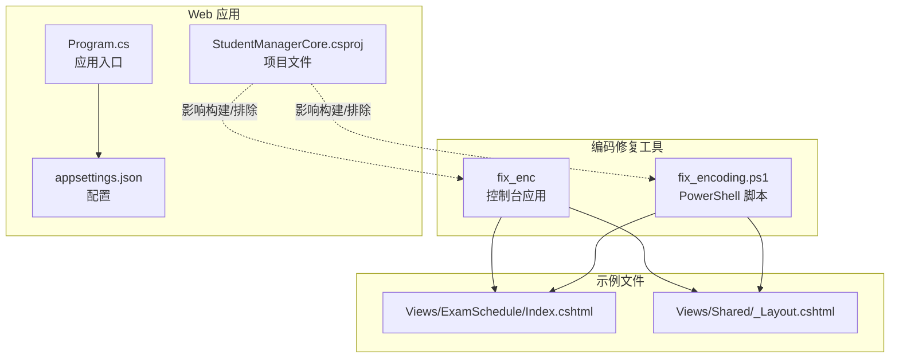
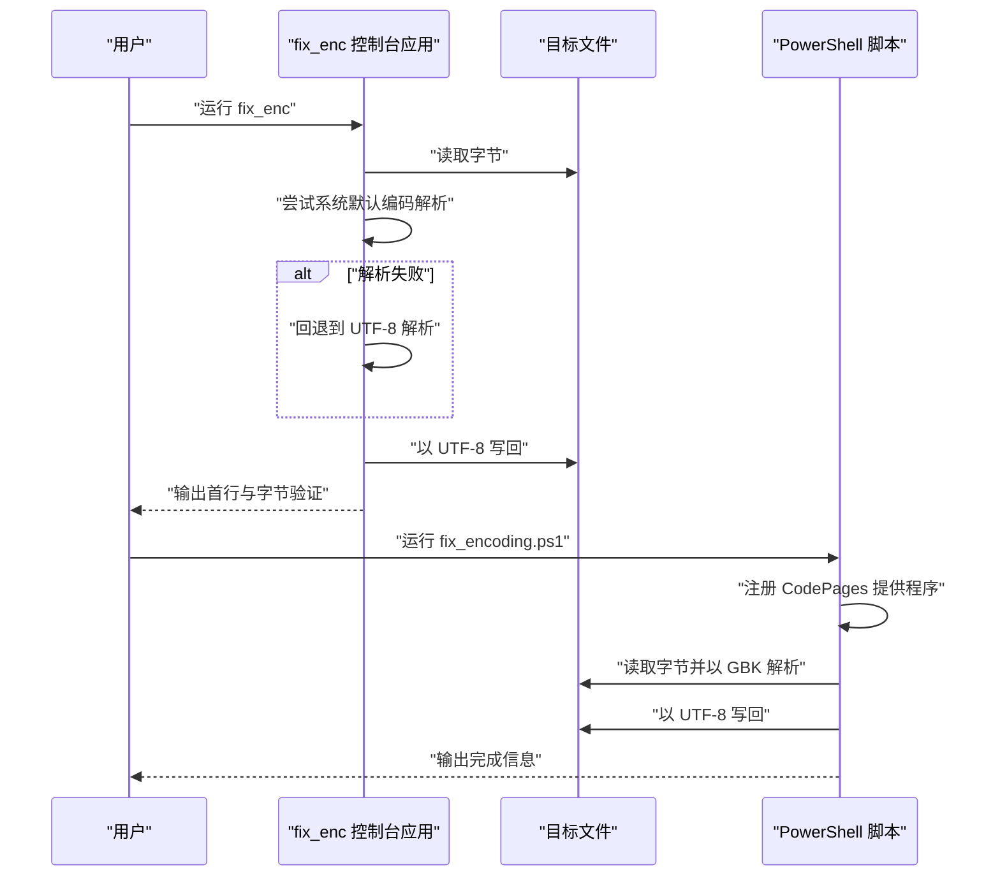
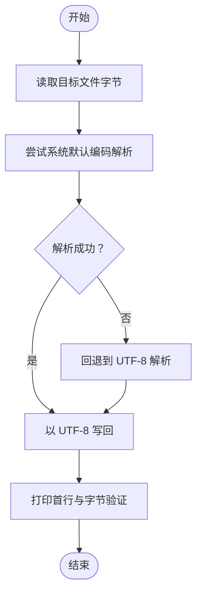
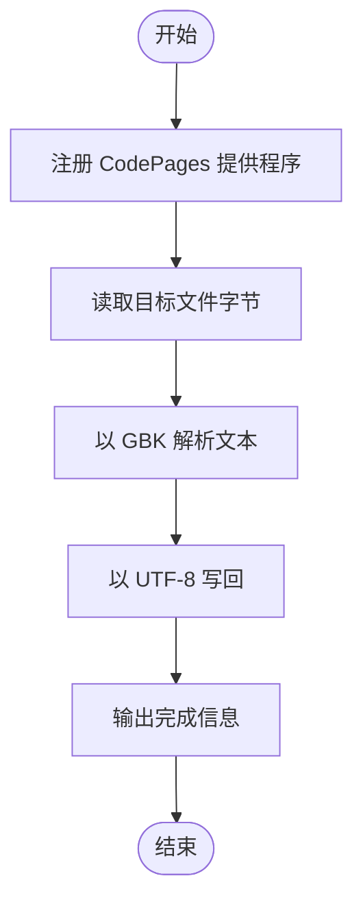
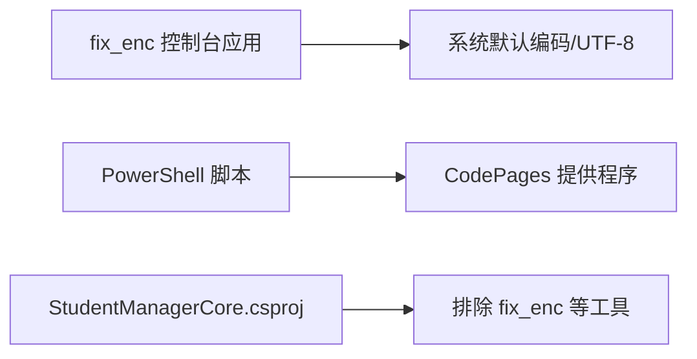

# 编码修复工具

<cite>
**本文引用的文件**
- [Program.cs](file://fix_enc/Program.cs)
- [fix_enc.csproj](file://fix_enc/fix_enc.csproj)
- [fix_encoding.ps1](file://fix_encoding.ps1)
- [Index.cshtml](file://Views/ExamSchedule/Index.cshtml)
- [_Layout.cshtml](file://Views/Shared/_Layout.cshtml)
- [Program.cs](file://Program.cs)
- [appsettings.json](file://appsettings.json)
- [StudentManagerCore.csproj](file://StudentManagerCore.csproj)
</cite>

## 目录
1. [简介](#简介)
2. [项目结构](#项目结构)
3. [核心组件](#核心组件)
4. [架构总览](#架构总览)
5. [详细组件分析](#详细组件分析)
6. [依赖关系分析](#依赖关系分析)
7. [性能考虑](#性能考虑)
8. [故障排除指南](#故障排除指南)
9. [结论](#结论)
10. [附录](#附录)

## 简介
本文件为“编码修复工具”的详细使用文档，面向需要处理文本文件乱码、字符集转换与数据清理的用户。工具涵盖以下能力：
- 字符集转换：将文件从系统默认编码（例如 GBK/GB2312）转换为 UTF-8。
- 乱码修复：通过探测与回退策略，修正因编码不一致导致的乱码。
- 数据清理：统一输出为 UTF-8，确保跨平台与跨语言兼容性。

工具由两部分组成：
- fix_enc：C# 控制台程序，用于单文件编码转换与验证。
- fix_encoding.ps1：PowerShell 脚本，用于注册编码提供程序、批量读取与转换指定文件为 UTF-8。

## 项目结构
该仓库包含一个 ASP.NET Core Web 应用与若干辅助工具。与编码修复直接相关的文件如下：
- fix_enc：C# 控制台应用，负责读取字节、尝试系统默认编码解析、回退到 UTF-8，并以 UTF-8 写回。
- fix_encoding.ps1：PowerShell 脚本，注册 CodePages 提供程序，读取指定文件，按 GBK 解析并以 UTF-8 写回。
- 示例视图文件：Index.cshtml 与 _Layout.cshtml 展示了中文界面与本地化内容，便于验证转换效果。
- Web 应用入口：Program.cs 与 appsettings.json 展示了应用的运行与数据库连接配置。

图表来源
- [Program.cs:1-40](file://fix_enc/Program.cs#L1-L40)
- [fix_encoding.ps1:1-8](file://fix_encoding.ps1#L1-L8)
- [Index.cshtml:1-525](file://Views/ExamSchedule/Index.cshtml#L1-L525)
- [_Layout.cshtml:1-298](file://Views/Shared/_Layout.cshtml#L1-L298)
- [Program.cs:1-123](file://Program.cs#L1-L123)
- [appsettings.json:1-16](file://appsettings.json#L1-L16)
- [StudentManagerCore.csproj:1-21](file://StudentManagerCore.csproj#L1-L21)

章节来源
- [Program.cs:1-40](file://fix_enc/Program.cs#L1-L40)
- [fix_encoding.ps1:1-8](file://fix_encoding.ps1#L1-L8)
- [Index.cshtml:1-525](file://Views/ExamSchedule/Index.cshtml#L1-L525)
- [_Layout.cshtml:1-298](file://Views/Shared/_Layout.cshtml#L1-L298)
- [Program.cs:1-123](file://Program.cs#L1-L123)
- [appsettings.json:1-16](file://appsettings.json#L1-L16)
- [StudentManagerCore.csproj:1-21](file://StudentManagerCore.csproj#L1-L21)

## 核心组件
- fix_enc 控制台应用
  - 功能：读取目标文件的原始字节；尝试以系统默认编码解析；若失败则回退至 UTF-8；最终以 UTF-8 写回；打印首行与字节验证结果。
  - 关键行为：使用系统默认编码（通常为 GBK/GB2312）解析；若解析失败则以 UTF-8 解析；统一以 UTF-8 写回。
- fix_encoding.ps1 PowerShell 脚本
  - 功能：注册 CodePages 编码提供程序；读取指定路径文件；以 GBK 解析；以 UTF-8 写回；输出完成信息。
  - 关键行为：显式注册 CodePages 支持；强制以 GBK 解析；统一以 UTF-8 写回。

章节来源
- [Program.cs:1-40](file://fix_enc/Program.cs#L1-L40)
- [fix_encoding.ps1:1-8](file://fix_encoding.ps1#L1-L8)

## 架构总览
下图展示了两种编码修复方案的工作流：C# 控制台应用与 PowerShell 脚本分别执行读取、解析与写回操作。

图表来源
- [Program.cs:1-40](file://fix_enc/Program.cs#L1-L40)
- [fix_encoding.ps1:1-8](file://fix_encoding.ps1#L1-L8)

## 详细组件分析

### fix_enc 控制台应用
- 输入与处理
  - 读取目标文件的原始字节。
  - 尝试以系统默认编码（通常为 GBK/GB2312）解析。
  - 若解析失败，则回退到 UTF-8 解析。
  - 最终以 UTF-8 写回目标文件。
- 输出与验证
  - 打印前若干字节的十六进制表示。
  - 打印系统默认编码名称与代码页。
  - 打印解析所用的代码页或回退使用的 UTF-8。
  - 验证首行内容与 UTF-8 字节表示。

图表来源
- [Program.cs:1-40](file://fix_enc/Program.cs#L1-L40)

章节来源
- [Program.cs:1-40](file://fix_enc/Program.cs#L1-L40)
- [fix_enc.csproj:1-7](file://fix_enc/fix_enc.csproj#L1-L7)

### PowerShell 脚本 fix_encoding.ps1
- 注册编码提供程序
  - 尝试加载 System.Text.Encoding.CodePages 并注册 CodePages 提供程序。
- 文件处理
  - 读取指定路径文件的字节。
  - 以 GBK 编码解析文本。
  - 以 UTF-8 写回目标文件。
- 输出
  - 输出完成信息。

图表来源
- [fix_encoding.ps1:1-8](file://fix_encoding.ps1#L1-L8)

章节来源
- [fix_encoding.ps1:1-8](file://fix_encoding.ps1#L1-L8)

### 示例视图文件与编码一致性
- Index.cshtml 与 _Layout.cshtml 包含大量中文内容与本地化标签，适合用于验证转换后的显示是否正确。
- 建议在转换前后对比首行与关键中文字段，确保无乱码。

章节来源
- [Index.cshtml:1-525](file://Views/ExamSchedule/Index.cshtml#L1-L525)
- [_Layout.cshtml:1-298](file://Views/Shared/_Layout.cshtml#L1-L298)

### Web 应用入口与配置
- 应用入口 Program.cs 设置了全局异常处理与 UTF-8 响应内容类型，有助于在浏览器端正确渲染 UTF-8 文本。
- appsettings.json 提供数据库连接字符串，便于后续数据层的编码一致性检查。

章节来源
- [Program.cs:1-123](file://Program.cs#L1-L123)
- [appsettings.json:1-16](file://appsettings.json#L1-L16)

## 依赖关系分析
- fix_enc 控制台应用
  - 依赖 .NET SDK（控制台应用）。
  - 依赖系统默认编码与 UTF-8 编码解析。
- PowerShell 脚本
  - 依赖 .NET System.Text.Encoding.CodePages 提供程序。
  - 依赖目标文件路径可访问。
- 项目排除规则
  - StudentManagerCore.csproj 中将 fix_enc 与相关工具排除在默认构建之外，避免影响主 Web 应用构建流程。

图表来源
- [fix_enc.csproj:1-7](file://fix_enc/fix_enc.csproj#L1-L7)
- [StudentManagerCore.csproj:1-21](file://StudentManagerCore.csproj#L1-L21)

章节来源
- [fix_enc.csproj:1-7](file://fix_enc/fix_enc.csproj#L1-L7)
- [StudentManagerCore.csproj:1-21](file://StudentManagerCore.csproj#L1-L21)

## 性能考虑
- 字节读取与写回均为一次性操作，适用于中小型文本文件。
- 对于大型文件，建议分块读取与写回，避免内存峰值过高。
- 批量处理时，建议串行逐个处理并记录日志，便于定位问题文件。

## 故障排除指南
- 症状：转换后仍出现乱码
  - 排查步骤：
    - 确认目标文件实际编码是否为 GBK/GB2312 或 UTF-8。
    - 在 PowerShell 脚本中显式指定 GBK 解析；在 C# 应用中保留回退到 UTF-8 的逻辑。
    - 对比转换前后的首行与关键中文字段，确认显示正常。
- 症状：PowerShell 报告编码不可用
  - 排查步骤：
    - 确认已注册 CodePages 提供程序。
    - 检查目标文件路径是否正确且可访问。
- 症状：Web 页面显示乱码
  - 排查步骤：
    - 确认 HTML 头部声明 UTF-8。
    - 确认数据库返回内容与响应头编码一致。
    - 参考应用入口中的 UTF-8 响应设置。

章节来源
- [fix_encoding.ps1:1-8](file://fix_encoding.ps1#L1-L8)
- [Program.cs:1-40](file://fix_enc/Program.cs#L1-L40)
- [Program.cs:1-123](file://Program.cs#L1-L123)
- [_Layout.cshtml:1-298](file://Views/Shared/_Layout.cshtml#L1-L298)

## 结论
本编码修复工具提供了两种稳健的编码转换方案：C# 控制台应用与 PowerShell 脚本。前者具备自动回退机制，后者明确指定 GBK 解析。结合示例视图文件与 Web 应用的 UTF-8 设置，可有效解决中文乱码问题并提升跨平台兼容性。

## 附录

### 使用方法与示例

- 使用 fix_enc 控制台应用
  - 指定目标文件路径（示例路径见源码注释）。
  - 运行程序，观察控制台输出的解析编码与首行验证。
  - 确认文件以 UTF-8 写回。
- 使用 fix_encoding.ps1 脚本
  - 在 PowerShell 中运行脚本。
  - 脚本会注册 CodePages 提供程序并以 GBK 解析，再以 UTF-8 写回。
  - 输出完成信息作为执行结果。

章节来源
- [Program.cs:1-40](file://fix_enc/Program.cs#L1-L40)
- [fix_encoding.ps1:1-8](file://fix_encoding.ps1#L1-L8)

### 支持的编码格式与转换限制
- 支持的编码
  - 系统默认编码（通常为 GBK/GB2312）。
  - UTF-8。
  - 通过 CodePages 提供程序支持的其他编码（如 GBK）。
- 转换限制
  - 仅针对文本文件进行编码转换。
  - 不涉及二进制文件的解析与转换。
  - 脚本与应用均以 UTF-8 写回，不改变文件扩展名或元数据。

### 批量处理与定时任务配置
- 批量处理
  - PowerShell：可将脚本封装为循环，遍历目录中的多个文件并逐个转换。
  - C#：可在控制台应用中添加命令行参数与目录扫描逻辑，实现批量转换。
- 定时任务
  - Windows 任务计划程序：可配置每日/每周定时运行 PowerShell 脚本或 C# 应用，扫描项目目录并修复编码问题。

### 编码问题诊断与预防
- 诊断
  - 对比转换前后首行与关键中文字段。
  - 检查浏览器响应头与 HTML 头部编码声明。
  - 核对数据库返回内容的编码一致性。
- 预防
  - 统一使用 UTF-8 作为项目默认编码。
  - 在版本控制系统中启用正确的文件属性与换行符规范。
  - 在 CI/CD 流程中加入编码一致性检查步骤。