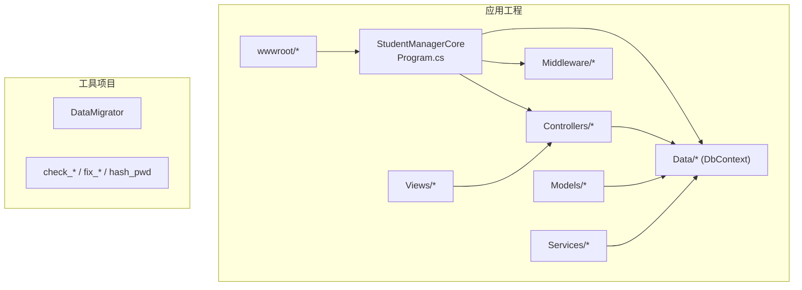
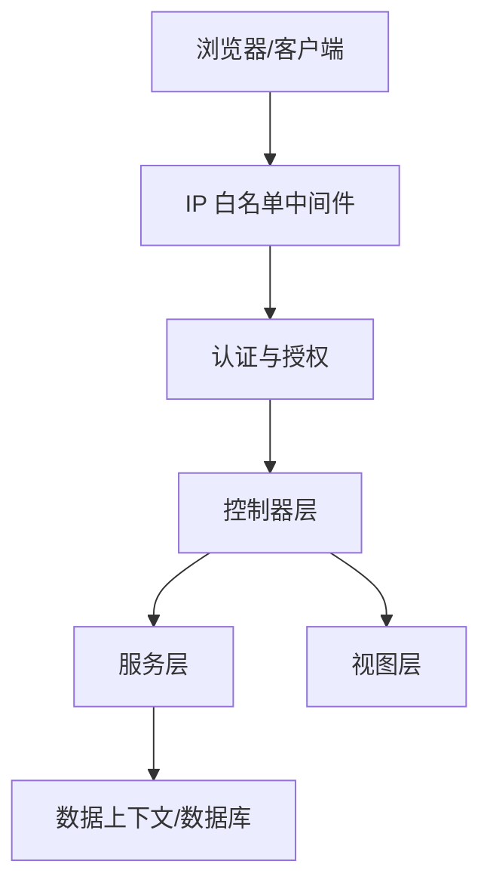
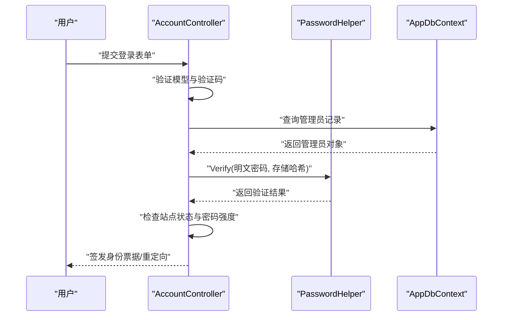
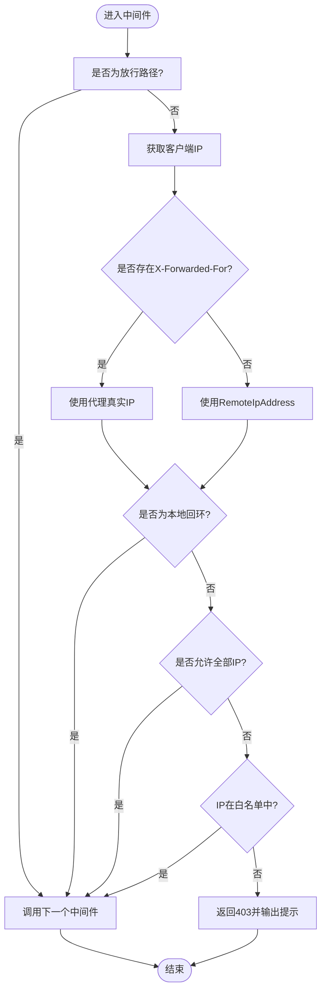
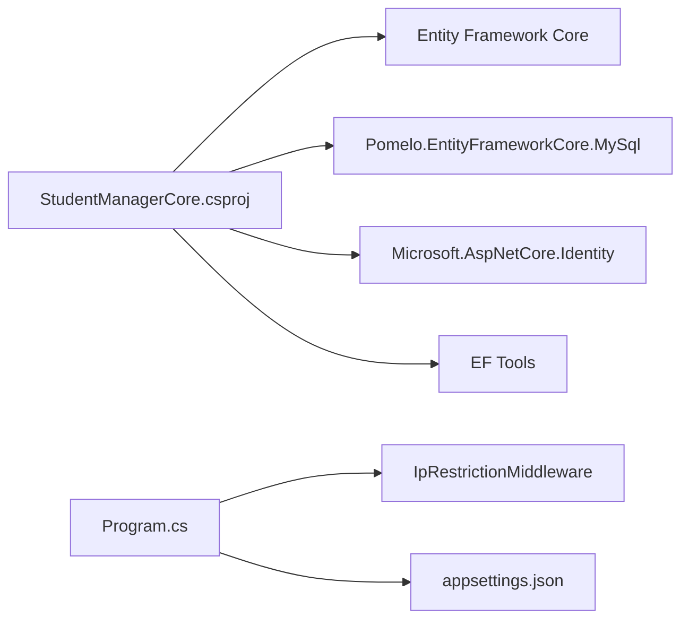

# 代码规范与标准

<cite>
**本文引用的文件**
- [StudentManagerCore.csproj](file://StudentManagerCore.csproj)
- [Program.cs](file://Program.cs)
- [appsettings.json](file://appsettings.json)
- [AppDbContext.cs](file://Data/AppDbContext.cs)
- [AccountController.cs](file://Controllers/AccountController.cs)
- [PasswordHelper.cs](file://Services/PasswordHelper.cs)
- [IpRestrictionMiddleware.cs](file://Middleware/IpRestrictionMiddleware.cs)
- [_Layout.cshtml](file://Views/Shared/_Layout.cshtml)
- [Index.cshtml](file://Views/Home/Index.cshtml)
</cite>

## 目录
1. [简介](#简介)
2. [项目结构](#项目结构)
3. [核心组件](#核心组件)
4. [架构总览](#架构总览)
5. [详细组件分析](#详细组件分析)
6. [依赖关系分析](#依赖关系分析)
7. [性能考量](#性能考量)
8. [故障排除指南](#故障排除指南)
9. [结论](#结论)
10. [附录](#附录)

## 简介
本文件旨在为 C# 项目建立统一的代码规范与最佳实践，覆盖命名约定、代码格式化、注释规范、文件组织与命名、代码质量标准，并结合本仓库现有实现给出“正确”与“错误”的对比示例与改进建议。同时提供 Visual Studio 与 VS Code 的配置建议（EditorConfig 与扩展推荐），帮助团队保持一致性与可维护性。

## 项目结构
该项目采用典型的 ASP.NET Core MVC 结构，按功能域划分控制器、模型、数据访问层、中间件与视图等。项目根目录包含主应用工程与若干独立工具项目（如数据校验、修复等），便于在不同场景下执行特定任务。

图表来源
- [Program.cs:1-123](file://Program.cs#L1-L123)
- [StudentManagerCore.csproj:1-21](file://StudentManagerCore.csproj#L1-L21)

章节来源
- [StudentManagerCore.csproj:1-21](file://StudentManagerCore.csproj#L1-L21)
- [Program.cs:1-123](file://Program.cs#L1-L123)

## 核心组件
- 应用入口与管线：在应用启动时注册服务、配置认证与会话、启用中间件、映射路由，并执行数据库迁移。
- 数据上下文：集中定义实体集合与 Fluent API 映射，确保实体属性与数据库字段一致。
- 控制器：处理登录、密码变更、登出等业务流程，遵循最小暴露面与单一职责。
- 中间件：实现 IP 白名单控制，支持反向代理场景与本地回环放行。
- 视图：采用 Razor 语法，配合 Bootstrap 与 Chart.js 实现可视化界面。

章节来源
- [Program.cs:1-123](file://Program.cs#L1-L123)
- [AppDbContext.cs:1-295](file://Data/AppDbContext.cs#L1-L295)
- [AccountController.cs:1-261](file://Controllers/AccountController.cs#L1-L261)
- [IpRestrictionMiddleware.cs:1-98](file://Middleware/IpRestrictionMiddleware.cs#L1-L98)
- [_Layout.cshtml:1-298](file://Views/Shared/_Layout.cshtml#L1-L298)

## 架构总览
应用采用经典的三层架构思想：表示层（Views）、业务层（Controllers）、数据访问层（DbContext + Services）。通过中间件实现横切关注点（如认证、IP 限制、异常处理）。

图表来源
- [Program.cs:45-96](file://Program.cs#L45-L96)
- [IpRestrictionMiddleware.cs:34-96](file://Middleware/IpRestrictionMiddleware.cs#L34-L96)
- [AccountController.cs:15-261](file://Controllers/AccountController.cs#L15-L261)
- [AppDbContext.cs:6-295](file://Data/AppDbContext.cs#L6-L295)

## 详细组件分析

### 命名约定
- 类名与控制器：使用 PascalCase，例如 AppDbContext、AccountController、IpRestrictionMiddleware。
- 方法名：使用 PascalCase，例如 Login、ResetPassword、InvokeAsync。
- 局部变量与参数：使用 camelCase，例如 connectionString、dbContext、model。
- 字段：私有字段使用下划线前缀并在构造函数中赋值，例如 _db、_httpClient。
- 命名空间：与项目结构一致，例如 StudentManagerCore.Data、StudentManagerCore.Controllers。

章节来源
- [AppDbContext.cs:4-8](file://Data/AppDbContext.cs#L4-L8)
- [AccountController.cs:13-26](file://Controllers/AccountController.cs#L13-L26)
- [IpRestrictionMiddleware.cs:10-32](file://Middleware/IpRestrictionMiddleware.cs#L10-L32)
- [PasswordHelper.cs:8-41](file://Services/PasswordHelper.cs#L8-L41)

### 代码格式化规则
- 缩进：统一使用 4 个空格。
- 空行：方法之间保留一个空行；逻辑块内适当空行分隔。
- 括号：控制块与方法体采用独占一行风格；Lambda 表达式与简单表达式可内联。
- 行长度：建议不超过 120 列，超出时分行并对齐。
- 引号：字符串统一使用双引号；HTML 片段中属性使用双引号。
- using 语句：按命名空间分组，将项目内 using 放在最前，再是框架，最后第三方库。

章节来源
- [Program.cs:1-123](file://Program.cs#L1-L123)
- [AccountController.cs:1-261](file://Controllers/AccountController.cs#L1-L261)
- [_Layout.cshtml:1-298](file://Views/Shared/_Layout.cshtml#L1-L298)

### 注释规范
- XML 文档注释：为公共类型与成员提供摘要说明，描述用途、参数、返回值与异常。
- 行内注释：用于解释复杂逻辑、边界条件或历史原因，避免显而易见的注释。
- TODO/NOTE：使用 TODO/NOTE 标记待办事项与注意事项，便于后续跟踪。

章节来源
- [PasswordHelper.cs:5-41](file://Services/PasswordHelper.cs#L5-L41)
- [IpRestrictionMiddleware.cs:5-9](file://Middleware/IpRestrictionMiddleware.cs#L5-L9)
- [AccountController.cs:127-135](file://Controllers/AccountController.cs#L127-L135)

### 文件组织与命名规则
- 文件夹分类：Controllers、Models、Data、Services、Middleware、Views、wwwroot。
- 命名空间：与文件夹结构一致，避免跨模块命名冲突。
- 视图命名：按控制器名分组，共享布局文件位于 Shared 下。
- 工具项目：独立的命令行工具置于根目录，避免污染主工程。

章节来源
- [StudentManagerCore.csproj:7-7](file://StudentManagerCore.csproj#L7-L7)
- [Program.cs:1-123](file://Program.cs#L1-L123)
- [_Layout.cshtml:1-298](file://Views/Shared/_Layout.cshtml#L1-L298)

### 代码质量标准
- 复杂度限制：单方法行数建议不超过 100 行；分支嵌套不超过 4 层；方法参数不超过 7 个。
- 单一职责：控制器仅负责请求处理与视图选择；业务逻辑放入服务层；数据访问由 DbContext 承担。
- 重复代码：提取公共逻辑为服务或静态工具类（如 PasswordHelper）。
- 可测试性：依赖注入设计，便于替换依赖与单元测试。

章节来源
- [AccountController.cs:15-261](file://Controllers/AccountController.cs#L15-L261)
- [PasswordHelper.cs:8-41](file://Services/PasswordHelper.cs#L8-L41)
- [AppDbContext.cs:30-293](file://Data/AppDbContext.cs#L30-L293)

### 具体示例：正确与错误写法对照
- 错误：在控制器中直接拼接 HTML 字符串并写入响应。
  - 示例参考：全局异常中间件中的 HTML 写入方式，虽有效但不利于维护。
  - 建议：改为专用错误视图或统一的错误处理服务，减少字符串拼接。
- 错误：在控制器中直接进行密码哈希与验证。
  - 示例参考：AccountController 中对密码的验证与存储调用 PasswordHelper。
  - 建议：继续沿用服务封装，保持控制器薄化。
- 正确：使用依赖注入与中间件实现横切关注点。
  - 示例参考：Program.cs 中注册中间件与认证服务。
  - 建议：保持中间件职责单一，避免在中间件中做过多业务判断。

章节来源
- [Program.cs:45-96](file://Program.cs#L45-L96)
- [AccountController.cs:80-125](file://Controllers/AccountController.cs#L80-L125)
- [PasswordHelper.cs:12-40](file://Services/PasswordHelper.cs#L12-L40)

### API/服务组件调用序列（示例：登录流程）

图表来源
- [AccountController.cs:50-125](file://Controllers/AccountController.cs#L50-L125)
- [PasswordHelper.cs:18-34](file://Services/PasswordHelper.cs#L18-L34)
- [AppDbContext.cs:10-295](file://Data/AppDbContext.cs#L10-L295)

### 复杂逻辑组件流程（示例：IP 白名单校验）

图表来源
- [IpRestrictionMiddleware.cs:34-96](file://Middleware/IpRestrictionMiddleware.cs#L34-L96)

## 依赖关系分析
- 程序集引用：项目使用 Entity Framework Core、MySQL 提供程序、ASP.NET Core Identity 等。
- 运行时排除：通过 MSBuild 排除工具项目参与主工程编译，避免混淆。
- 配置依赖：连接字符串与中间件配置来自 appsettings.json。

图表来源
- [StudentManagerCore.csproj:10-18](file://StudentManagerCore.csproj#L10-L18)
- [Program.cs:1-123](file://Program.cs#L1-L123)
- [appsettings.json:1-16](file://appsettings.json#L1-L16)

章节来源
- [StudentManagerCore.csproj:1-21](file://StudentManagerCore.csproj#L1-L21)
- [Program.cs:1-123](file://Program.cs#L1-L123)
- [appsettings.json:1-16](file://appsettings.json#L1-L16)

## 性能考量
- 数据库访问：尽量使用异步 API（如 FindAsync、SaveChangesAsync），避免阻塞 UI 线程。
- 中间件顺序：将高频短路中间件（如静态文件、IP 白名单）置于前部，减少后续处理开销。
- 认证与会话：合理设置过期时间与滑动过期，平衡安全性与用户体验。
- 视图渲染：避免在视图中执行复杂查询，将数据准备移至控制器或服务层。

## 故障排除指南
- 登录失败：检查验证码、时间同步检测、密码强度与站点状态。
- 认证异常：确认 Cookie 认证配置与滑动过期设置。
- 数据库迁移：捕获迁移异常并记录到文件，便于定位问题。
- IP 白名单：确认 AllowedIPs 配置、反向代理头与本地回环放行逻辑。

章节来源
- [AccountController.cs:50-125](file://Controllers/AccountController.cs#L50-L125)
- [Program.cs:45-121](file://Program.cs#L45-L121)
- [IpRestrictionMiddleware.cs:16-32](file://Middleware/IpRestrictionMiddleware.cs#L16-L32)

## 结论
本规范基于项目现有实现提炼而来，强调命名一致性、格式标准化、注释规范化与质量约束。通过 EditorConfig 与 IDE 扩展，可在团队内快速落地统一风格；借助依赖注入与中间件模式，实现横切关注点的清晰分离。建议持续引入静态分析工具与自动化检查，进一步提升代码质量与可维护性。

## 附录

### Visual Studio 配置建议
- EditorConfig：在项目根目录添加 editorconfig 文件，统一缩进、行尾、最大行长等规则。
- 扩展推荐：使用 EditorConfig for Visual Studio、SonarLint、Roslynator、.NET Analyzers。
- 代码生成：启用“插入文档字符串”与“生成属性”等选项，减少手写样板代码。

### VS Code 配置建议
- EditorConfig：安装 EditorConfig 扩展，确保与项目规则一致。
- 扩展推荐：C#、EditorConfig、.NET Install Tool、C# Extensions、Bracket Pair Colorizer。
- 设置：将 insertSpaces 设为 true，tabSize 设为 4，将 editor.rulers 设为 120。

### 代码片段路径参考（用于规范核对）
- [命名约定：类与方法:13-26](file://Controllers/AccountController.cs#L13-L26)
- [命名约定：命名空间与字段:4-8](file://Data/AppDbContext.cs#L4-L8)
- [格式化：缩进与空行:1-123](file://Program.cs#L1-L123)
- [注释：XML 文档与行内注释:5-41](file://Services/PasswordHelper.cs#L5-L41)
- [文件组织：视图与布局:1-298](file://Views/Shared/_Layout.cshtml#L1-L298)
- [质量标准：单一职责与依赖注入:15-261](file://Controllers/AccountController.cs#L15-L261)