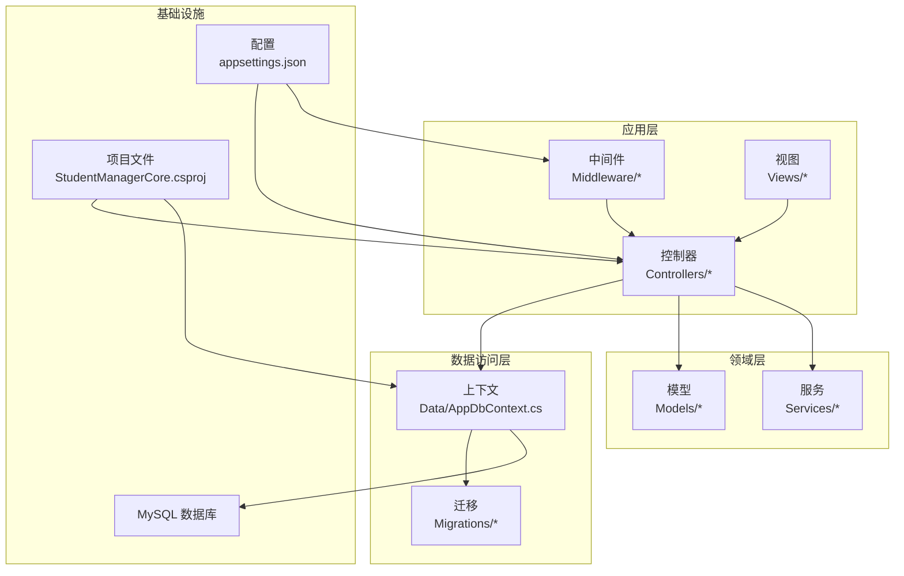
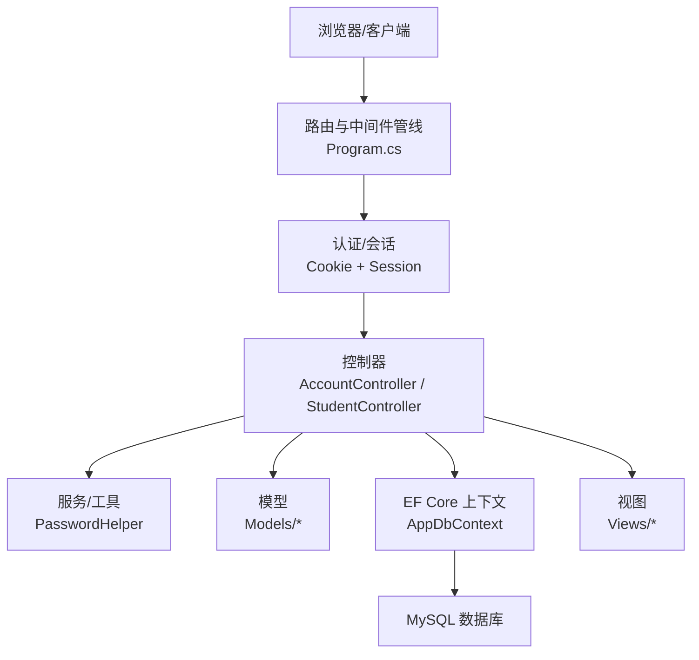
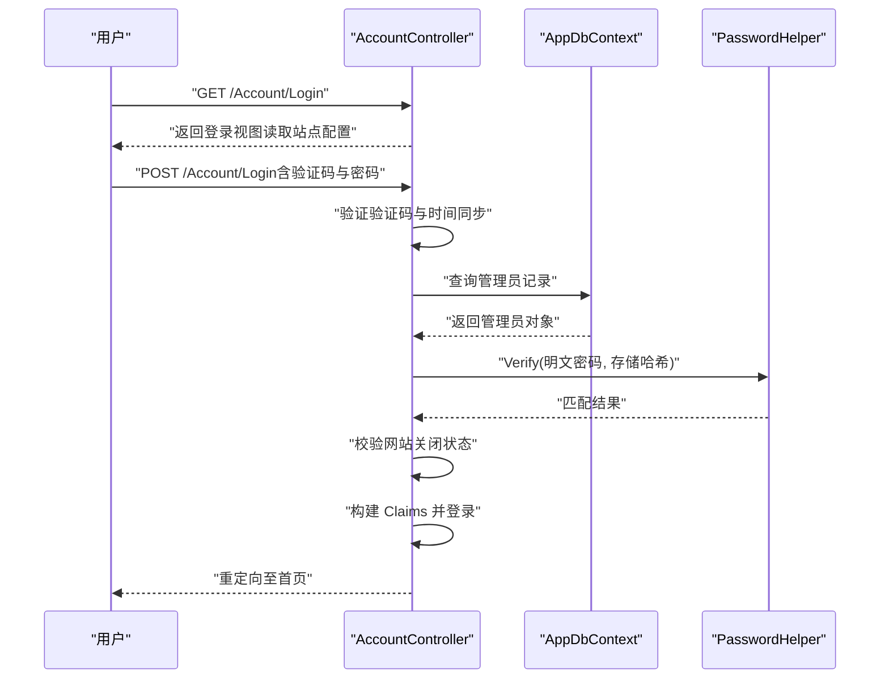
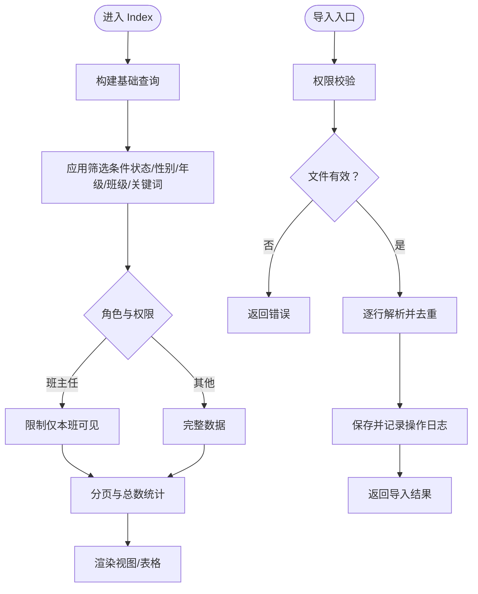
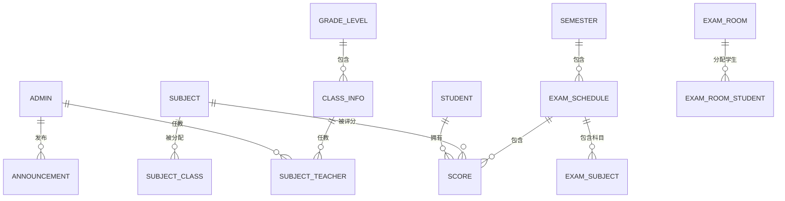
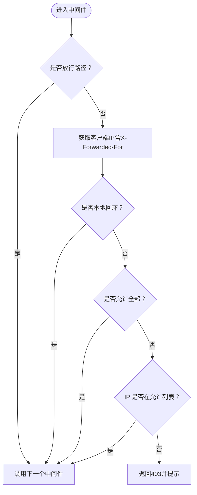
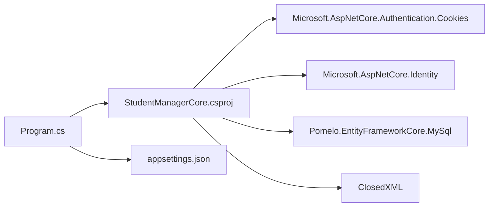

# 开发指南

<cite>
**本文引用的文件**
- [StudentManagerCore.csproj](file://StudentManagerCore.csproj)
- [Program.cs](file://Program.cs)
- [appsettings.json](file://appsettings.json)
- [AppDbContext.cs](file://Data/AppDbContext.cs)
- [PasswordHelper.cs](file://Services/PasswordHelper.cs)
- [IpRestrictionMiddleware.cs](file://Middleware/IpRestrictionMiddleware.cs)
- [Models.cs](file://Models/Models.cs)
- [GradeModels.cs](file://Models/GradeModels.cs)
- [StudentController.cs](file://Controllers/StudentController.cs)
- [AccountController.cs](file://Controllers/AccountController.cs)
- [InitialCreate.cs](file://Migrations/20260609075559_InitialCreate.cs)
- [Create_Announcement_Tables.sql](file://Database/Create_Announcement_Tables.sql)
- [deploy.bat](file://deploy.bat)
</cite>

## 目录
1. [简介](#简介)
2. [项目结构](#项目结构)
3. [核心组件](#核心组件)
4. [架构总览](#架构总览)
5. [详细组件分析](#详细组件分析)
6. [依赖关系分析](#依赖关系分析)
7. [性能考虑](#性能考虑)
8. [故障排查指南](#故障排查指南)
9. [结论](#结论)
10. [附录](#附录)

## 简介
本开发指南面向参与“学生管理系统”的开发者，旨在提供一套统一的开发规范、最佳实践与实施建议，涵盖代码组织、命名约定、开发环境搭建、测试策略、代码审查流程、性能优化、版本控制与文档规范等。项目基于 .NET 8、ASP.NET Core MVC、Entity Framework Core 与 MySQL，采用控制器-视图模型模式与数据库优先的迁移策略。

## 项目结构
项目采用按职责分层与功能模块化相结合的组织方式：
- Controllers：MVC 控制器，负责请求入口与业务流程编排
- Data：EF Core 上下文与数据库迁移
- Models：实体模型与视图模型
- Services：领域服务与工具类（如密码哈希）
- Middleware：自定义中间件（如 IP 白名单）
- Views：Razor 视图与共享布局
- Database：SQL 初始化与增量脚本
- Migrations：EF Core 迁移历史
- 工具程序：独立命令行工具（如数据校验、修复等）

图表来源
- [Program.cs:1-123](file://Program.cs#L1-L123)
- [StudentManagerCore.csproj:1-21](file://StudentManagerCore.csproj#L1-L21)
- [AppDbContext.cs:1-295](file://Data/AppDbContext.cs#L1-L295)

章节来源
- [StudentManagerCore.csproj:1-21](file://StudentManagerCore.csproj#L1-L21)
- [Program.cs:1-123](file://Program.cs#L1-L123)

## 核心组件
- 应用启动与管线
  - 在 Program.cs 中注册服务、配置认证与会话、启用自动迁移与全局异常处理、映射路由与静态资源
- 数据库上下文
  - AppDbContext 定义 DbSet 集合与 Fluent API 映射，包含多表关系与唯一索引
- 中间件
  - IpRestrictionMiddleware 实现 IP 白名单与反向代理场景下的真实 IP 解析
- 密码服务
  - PasswordHelper 使用 ASP.NET Core Identity 的 PBKDF2 算法进行哈希与兼容旧版明文校验
- 控制器
  - AccountController：登录、登出、密码修改与时间同步校验
  - StudentController：学生增删改查、导入导出、分页与权限控制

章节来源
- [Program.cs:1-123](file://Program.cs#L1-L123)
- [AppDbContext.cs:1-295](file://Data/AppDbContext.cs#L1-L295)
- [IpRestrictionMiddleware.cs:1-98](file://Middleware/IpRestrictionMiddleware.cs#L1-L98)
- [PasswordHelper.cs:1-42](file://Services/PasswordHelper.cs#L1-L42)
- [AccountController.cs:1-261](file://Controllers/AccountController.cs#L1-L261)
- [StudentController.cs:1-800](file://Controllers/StudentController.cs#L1-L800)

## 架构总览
系统采用经典的三层架构与 Clean Architecture 的分层思想：
- 表现层：MVC 控制器与 Razor 视图
- 领域层：模型与业务规则（权限、年级/班级映射、密码规则）
- 数据访问层：EF Core 上下文与迁移
- 基础设施：MySQL、配置、中间件、部署脚本

图表来源
- [Program.cs:1-123](file://Program.cs#L1-L123)
- [AccountController.cs:1-261](file://Controllers/AccountController.cs#L1-L261)
- [StudentController.cs:1-800](file://Controllers/StudentController.cs#L1-L800)
- [AppDbContext.cs:1-295](file://Data/AppDbContext.cs#L1-L295)

## 详细组件分析

### 组件A：登录与认证流程
- 登录页面加载与站点配置读取
- 验证验证码与服务器时间同步
- 用户名/密码校验（兼容旧版明文与新哈希）
- 网站关闭状态限制
- Claims 身份构建与持久化登录

图表来源
- [AccountController.cs:28-125](file://Controllers/AccountController.cs#L28-L125)
- [PasswordHelper.cs:12-34](file://Services/PasswordHelper.cs#L12-L34)
- [AppDbContext.cs:10-18](file://Data/AppDbContext.cs#L10-L18)

章节来源
- [AccountController.cs:1-261](file://Controllers/AccountController.cs#L1-L261)
- [PasswordHelper.cs:1-42](file://Services/PasswordHelper.cs#L1-L42)

### 组件B：学生管理与导入导出
- 多维筛选与分页
- 班主任权限限制与年级/班级映射
- Excel 导入（ClosedXML）、去重与错误收集
- 导出与模板下载

图表来源
- [StudentController.cs:22-264](file://Controllers/StudentController.cs#L22-L264)
- [StudentController.cs:575-701](file://Controllers/StudentController.cs#L575-L701)

章节来源
- [StudentController.cs:1-800](file://Controllers/StudentController.cs#L1-L800)

### 组件C：EF Core 数据模型与迁移
- 实体映射与外键约束
- 唯一索引与级联删除
- 初始迁移与后续增量脚本

图表来源
- [AppDbContext.cs:30-293](file://Data/AppDbContext.cs#L30-L293)
- [InitialCreate.cs:13-508](file://Migrations/20260609075559_InitialCreate.cs#L13-L508)

章节来源
- [AppDbContext.cs:1-295](file://Data/AppDbContext.cs#L1-L295)
- [InitialCreate.cs:1-563](file://Migrations/20260609075559_InitialCreate.cs#L1-L563)

### 组件D：IP 白名单中间件
- 从配置读取允许 IP 列表
- 支持反向代理 X-Forwarded-For
- 放行静态资源与登录路径
- 本地回环地址放行

图表来源
- [IpRestrictionMiddleware.cs:34-96](file://Middleware/IpRestrictionMiddleware.cs#L34-L96)
- [appsettings.json:9-11](file://appsettings.json#L9-L11)

章节来源
- [IpRestrictionMiddleware.cs:1-98](file://Middleware/IpRestrictionMiddleware.cs#L1-L98)
- [appsettings.json:1-16](file://appsettings.json#L1-L16)

## 依赖关系分析
- 项目依赖
  - Microsoft.AspNetCore.Authentication.Cookies、Microsoft.AspNetCore.Identity、Pomelo.EntityFrameworkCore.MySql、ClosedXML
- 运行时依赖
  - MySQL 8.0，.NET 8
- 配置依赖
  - appsettings.json 中的连接字符串与 IP 白名单配置

图表来源
- [StudentManagerCore.csproj:10-18](file://StudentManagerCore.csproj#L10-L18)
- [Program.cs:19-21](file://Program.cs#L19-L21)
- [appsettings.json:12-14](file://appsettings.json#L12-L14)

章节来源
- [StudentManagerCore.csproj:1-21](file://StudentManagerCore.csproj#L1-L21)
- [Program.cs:1-123](file://Program.cs#L1-L123)
- [appsettings.json:1-16](file://appsettings.json#L1-L16)

## 性能考虑
- 数据库查询优化
  - 使用分页（每页固定条数）避免一次性加载大量数据
  - 对高频查询字段建立索引（如唯一索引与外键索引）
  - 避免 N+1 查询，必要时使用 Include 预加载关联
- 缓存策略
  - 使用分布式内存缓存（Session）存放验证码与临时状态
  - 对静态资源启用 CDN 与压缩
- 密码与安全
  - 使用 PBKDF2 哈希算法，避免明文存储
  - 登录时间同步检测，防止时钟偏差导致的安全问题
- 部署与热更新
  - 使用发布脚本进行应用池停启与替换，减少停机时间

章节来源
- [StudentController.cs:22-264](file://Controllers/StudentController.cs#L22-L264)
- [AppDbContext.cs:193-194](file://Data/AppDbContext.cs#L193-L194)
- [PasswordHelper.cs:12-40](file://Services/PasswordHelper.cs#L12-L40)
- [Program.cs:34-41](file://Program.cs#L34-L41)
- [deploy.bat:19](file://deploy.bat#L19)

## 故障排查指南
- 登录失败
  - 检查验证码、服务器时间同步、用户名/密码匹配与网站关闭状态
- 数据库迁移失败
  - 查看迁移错误日志文件，确认连接字符串与数据库权限
- IP 访问被拒
  - 核对 appsettings.json 中的允许 IP 列表与反向代理头 X-Forwarded-For
- Excel 导入异常
  - 检查文件格式、标题行与重复学号，关注错误集合返回

章节来源
- [AccountController.cs:50-125](file://Controllers/AccountController.cs#L50-L125)
- [Program.cs:108-120](file://Program.cs#L108-L120)
- [IpRestrictionMiddleware.cs:34-96](file://Middleware/IpRestrictionMiddleware.cs#L34-L96)
- [StudentController.cs:575-701](file://Controllers/StudentController.cs#L575-L701)

## 结论
本指南提供了从项目结构、核心组件到部署运维的全链路开发规范。建议团队在日常开发中严格遵循命名约定、测试策略与代码审查流程，持续优化数据库查询与缓存策略，确保系统的安全性、稳定性与可维护性。

## 附录

### A. 代码组织与命名约定
- 文件夹结构
  - Controllers：按功能模块划分控制器
  - Data：EF Core 上下文与迁移
  - Models：实体与视图模型
  - Services：通用服务与工具
  - Middleware：自定义中间件
  - Views：Razor 视图与共享布局
- 类与方法命名
  - 类名使用帕斯卡命名（如 AppDbContext、PasswordHelper）
  - 方法名使用动宾短语（如 Hash、Verify、Import、Export）
  - 常量与配置键使用大写下划线（如 DefaultConnection）
- 路由与动作
  - 控制器动作遵循 REST 风格，GET/POST 区分读写
  - 局部视图与 AJAX 请求使用 X-Requested-With 标识

章节来源
- [StudentController.cs:1-800](file://Controllers/StudentController.cs#L1-L800)
- [AccountController.cs:1-261](file://Controllers/AccountController.cs#L1-L261)
- [Program.cs:98-100](file://Program.cs#L98-L100)

### B. 开发环境搭建
- IDE 与工具
  - Visual Studio 或 VS Code，安装 C# 扩展与 .NET 8 SDK
- 数据库
  - 准备 MySQL 8.0，确保连接字符串正确
- 运行与调试
  - 使用 dotnet run 启动，或在 IDE 中直接调试
  - 配置 appsettings.Development.json 进行本地开发配置

章节来源
- [StudentManagerCore.csproj:1-21](file://StudentManagerCore.csproj#L1-L21)
- [appsettings.json:12-14](file://appsettings.json#L12-L14)

### C. 单元测试与集成测试
- 测试框架
  - 建议使用 MSTest 或 xUnit 进行单元测试
- 测试策略
  - 对密码哈希、权限判断、Excel 导入逻辑编写单元测试
  - 对控制器动作进行集成测试，模拟登录与权限场景
- 测试数据
  - 使用内存数据库或测试专用数据库，确保隔离性

章节来源
- [PasswordHelper.cs:12-40](file://Services/PasswordHelper.cs#L12-L40)
- [StudentController.cs:575-701](file://Controllers/StudentController.cs#L575-L701)

### D. 代码审查标准与流程
- Pull Request 规范
  - 提交前运行单元测试与静态分析
  - PR 描述清晰，包含变更内容、影响范围与测试结果
- 审查要点
  - 安全性（密码处理、输入校验、权限控制）
  - 性能（查询优化、缓存策略）
  - 可维护性（命名一致性、注释与异常处理）

章节来源
- [AccountController.cs:50-125](file://Controllers/AccountController.cs#L50-L125)
- [StudentController.cs:22-264](file://Controllers/StudentController.cs#L22-L264)

### E. 版本控制最佳实践
- 分支管理
  - develop/main 主干，feature/bugfix 前缀分支
- 提交信息
  - 格式：类型(作用域): 概述；正文说明变更动机与影响
- 标签管理
  - 使用语义化版本标签，配合发布说明

[本节为通用实践说明，无需列出具体文件来源]

### F. 文档编写规范
- 代码注释
  - 公开 API 与复杂逻辑需提供中文注释
- 文档同步
  - 新增功能同步更新 README 与接口文档
- 示例与变更日志
  - 记录重大变更与迁移步骤，便于回溯

[本节为通用实践说明，无需列出具体文件来源]