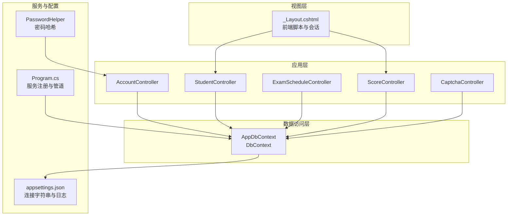
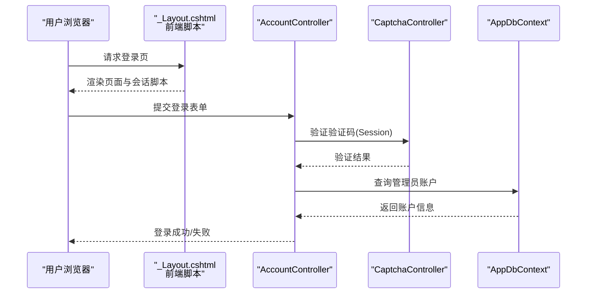
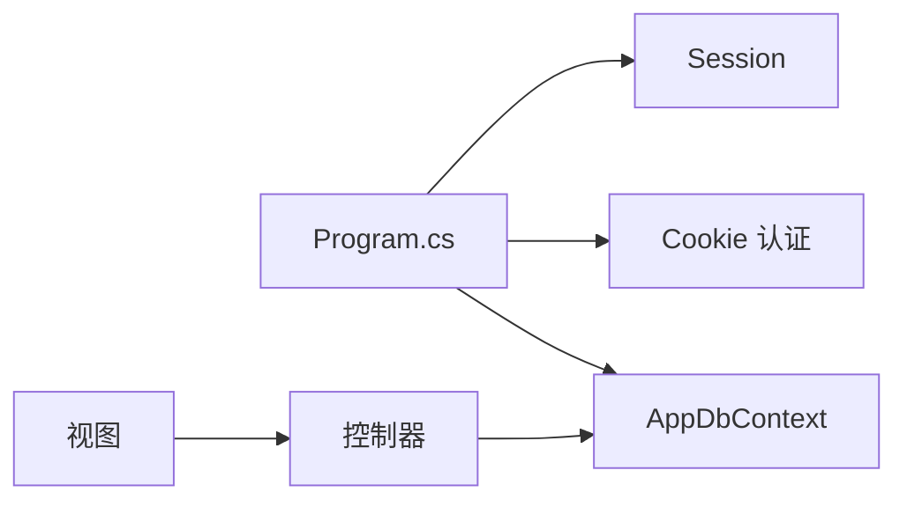

# 性能优化

<cite>
**本文引用的文件**
- [Program.cs](file://Program.cs)
- [appsettings.json](file://appsettings.json)
- [AppDbContext.cs](file://Data/AppDbContext.cs)
- [StudentController.cs](file://Controllers/StudentController.cs)
- [ScoreController.cs](file://Controllers/ScoreController.cs)
- [ExamScheduleController.cs](file://Controllers/ExamScheduleController.cs)
- [CaptchaController.cs](file://Controllers/CaptchaController.cs)
- [AccountController.cs](file://Controllers/AccountController.cs)
- [PasswordHelper.cs](file://Services/PasswordHelper.cs)
- [_Layout.cshtml](file://Views/Shared/_Layout.cshtml)
</cite>

## 目录
1. [简介](#简介)
2. [项目结构](#项目结构)
3. [核心组件](#核心组件)
4. [架构总览](#架构总览)
5. [详细组件分析](#详细组件分析)
6. [依赖分析](#依赖分析)
7. [性能考虑](#性能考虑)
8. [故障排查指南](#故障排查指南)
9. [结论](#结论)
10. [附录](#附录)

## 简介
本指南面向“学生管理系统”项目，聚焦于系统整体性能优化，涵盖数据库查询优化、EF Core 查询模式优化、内存与会话管理、缓存策略（含 Redis）、前端性能优化以及性能监控与分析工具的使用建议。文档结合现有代码结构与实现，给出可落地的最佳实践与改进建议。

## 项目结构
项目采用经典的 ASP.NET Core MVC 架构，包含控制器层、数据访问层（EF Core）、服务层与视图层；数据库连接通过 MySQL 提供程序配置；应用启动流程在 Program 中集中初始化。

**图表来源**
- [Program.cs:1-123](file://Program.cs#L1-L123)
- [appsettings.json:1-16](file://appsettings.json#L1-L16)
- [AppDbContext.cs:1-295](file://Data/AppDbContext.cs#L1-L295)
- [StudentController.cs:1-800](file://Controllers/StudentController.cs#L1-L800)
- [ScoreController.cs:1-620](file://Controllers/ScoreController.cs#L1-L620)
- [ExamScheduleController.cs:1-250](file://Controllers/ExamScheduleController.cs#L1-L250)
- [AccountController.cs:44-243](file://Controllers/AccountController.cs#L44-L243)
- [CaptchaController.cs:1-95](file://Controllers/CaptchaController.cs#L1-L95)
- [PasswordHelper.cs:1-42](file://Services/PasswordHelper.cs#L1-L42)
- [_Layout.cshtml:213-241](file://Views/Shared/_Layout.cshtml#L213-L241)

**章节来源**
- [Program.cs:1-123](file://Program.cs#L1-L123)
- [appsettings.json:1-16](file://appsettings.json#L1-L16)

## 核心组件
- 应用启动与服务注册：在 Program 中注册 MVC、EF Core、认证、会话等服务，并配置 HTTPS、静态文件、路由与自动迁移。
- 数据上下文：AppDbContext 定义了完整的领域模型映射与索引约束，是查询优化的关键基础。
- 控制器层：各业务控制器承担查询、导入导出、批量保存等高负载操作，直接影响性能表现。
- 会话与验证码：基于分布式内存缓存的 Session 用于验证码校验，需关注其对内存与并发的影响。
- 密码服务：使用 ASP.NET Core Identity 的 PBKDF2 实现密码哈希与兼容旧版明文校验。

**章节来源**
- [Program.cs:18-41](file://Program.cs#L18-L41)
- [AppDbContext.cs:30-293](file://Data/AppDbContext.cs#L30-L293)
- [CaptchaController.cs:12-24](file://Controllers/CaptchaController.cs#L12-L24)
- [PasswordHelper.cs:8-41](file://Services/PasswordHelper.cs#L8-L41)

## 架构总览
应用采用请求-响应模式，控制器接收请求后调用数据上下文执行查询或变更，再返回视图或 JSON 结果。EF Core 通过 Pomelo MySQL Provider 连接数据库，生产环境启用 HTTPS 与静态文件缓存。

**图表来源**
- [AccountController.cs:50-81](file://Controllers/AccountController.cs#L50-L81)
- [CaptchaController.cs:82-94](file://Controllers/CaptchaController.cs#L82-L94)
- [AppDbContext.cs:10-28](file://Data/AppDbContext.cs#L10-L28)

## 详细组件分析

### 数据库查询优化与索引策略
- 当前索引与唯一约束
  - 复合唯一索引：SubjectTeacher(SubjectId, AdminId, ClassId)、SubjectClass(SubjectId, ClassId)、Score(StudentId, SubjectId, ExamScheduleId)、GradeSubject(GradeLevelId, SubjectId)。
  - 外键索引：Score.StudentId/SubjectId/ExamScheduleId/GradeLevelId/ClassInfoId。
- 建议的补充索引
  - 学生表：按状态、年级、班级、学号、姓名等高频过滤字段建立复合索引，避免全表扫描。
  - 成绩表：按 ExamScheduleId、SubjectId、StudentId 组合查询频繁，建议在这些字段上建立覆盖索引或复合索引。
  - 考试安排：ExamDate、SemesterId、Grades 字段常用于筛选，建议建立相应索引。
  - 班级与年级：ClassInfo.GradeLevelID、GradeLevel.EntryYear 等关联字段需保证外键索引有效。
- 查询计划分析
  - 使用 EXPLAIN 分析关键查询（如学生成绩汇总、按班级/年级筛选），确认是否命中索引、避免回表与临时表排序。
  - 对复杂联表查询，优先减少投影字段数量，避免 SELECT *。
- 批量操作优化
  - 导入/保存大量成绩时，采用批量插入与去重合并策略，减少往返次数与重复查询。
  - 使用 EF Core 批处理或原生 SQL 批量插入，降低 ORM 开销。

**章节来源**
- [AppDbContext.cs:193-194](file://Data/AppDbContext.cs#L193-L194)
- [AppDbContext.cs:201-202](file://Data/AppDbContext.cs#L201-L202)
- [AppDbContext.cs:223-224](file://Data/AppDbContext.cs#L223-L224)
- [AppDbContext.cs:251-252](file://Data/AppDbContext.cs#L251-L252)
- [AppDbContext.cs:291-292](file://Data/AppDbContext.cs#L291-L292)

### EF Core 查询模式优化
- 延迟加载 vs 贪婪加载
  - 在需要一次性获取导航属性时使用 Include/ThenInclude，避免 N+1 查询；在仅需主实体时避免不必要的 Include。
  - 示例：ExamScheduleController 中对 Semester 与 AcademicYear 的 Include/ThenInclude 是合理的。
- NoTracking 查询
  - 对只读查询（如列表展示、统计）使用 AsNoTracking，减少跟踪开销。
  - 示例：ScoreController 的部分查询可改为 NoTracking。
- 分页与投影
  - 使用 Skip/Take 实现分页，配合 CountAsync 获取总数；仅投影必要字段，减少网络与序列化开销。
  - 示例：StudentController.Index 的分页与投影逻辑已较为合理。
- 批量读取与去重
  - 使用 Distinct/HashSet 减少重复查询与内存占用。
  - 示例：StudentController 中对 SubjectTeacher 的 Distinct 查询与 HashSet 去重。

**章节来源**
- [ExamScheduleController.cs:20-69](file://Controllers/ExamScheduleController.cs#L20-L69)
- [StudentController.cs:22-264](file://Controllers/StudentController.cs#L22-L264)
- [ScoreController.cs:160-229](file://Controllers/ScoreController.cs#L160-L229)

### 内存管理最佳实践
- 会话与验证码
  - 使用分布式内存缓存存储验证码，注意会话超时与内存占用；验证码验证后及时清理，避免重复使用。
  - 建议：将验证码存储替换为更轻量的缓存方案（如内存池或短生命周期键值存储）。
- 密码哈希
  - 使用 PasswordHelper 的 PBKDF2 哈希，兼容旧版明文；避免在内存中保留明文密码。
- 对象池与大对象
  - Excel 导入/导出使用 ClosedXML，注意流与工作簿对象的释放；在批量处理时控制内存峰值。
- 垃圾回收优化
  - 避免在循环中创建大对象；尽量复用集合与字典；及时释放 IDisposable 对象。

**章节来源**
- [CaptchaController.cs:12-24](file://Controllers/CaptchaController.cs#L12-L24)
- [CaptchaController.cs:82-94](file://Controllers/CaptchaController.cs#L82-L94)
- [PasswordHelper.cs:10-40](file://Services/PasswordHelper.cs#L10-L40)
- [StudentController.cs:575-701](file://Controllers/StudentController.cs#L575-L701)
- [ScoreController.cs:277-348](file://Controllers/ScoreController.cs#L277-L348)

### 缓存策略指导
- Redis 集成（建议）
  - 使用 StackExchange.Redis 或 Microsoft.Extensions.Caching.StackExchangeRedis，将验证码、登录态、热点查询结果缓存至 Redis。
  - 配置键空间过期策略，避免内存膨胀；对热点数据设置合理 TTL。
- 分布式缓存配置（建议）
  - 在 Program 中替换分布式内存缓存为 Redis，统一管理缓存生命周期。
- 缓存失效策略（建议）
  - 写操作后主动失效相关缓存键；对只读数据采用 LRU 或 LFU 策略；对时效性数据采用 TLL + 异步刷新。

[本节为通用建议，不直接分析具体文件，故无“章节来源”]

### 前端性能优化
- 静态资源压缩与版本控制
  - 启用静态文件压缩与缓存头；为 CSS/JS 设置长期缓存并加入内容指纹。
- CDN 使用
  - 将静态资源托管至 CDN，降低首屏加载时间。
- 异步加载与懒加载
  - 对非关键路径的脚本采用 defer/async；表格数据采用虚拟滚动或分页加载。
- 会话空闲检测
  - 前端定时器检测用户空闲并触发自动登出，减少无效会话占用。

**章节来源**
- [_Layout.cshtml:213-241](file://Views/Shared/_Layout.cshtml#L213-L241)

### 性能监控与分析
- Application Insights（建议）
  - 集成 ASP.NET Core Application Insights，采集请求、依赖、异常与自定义指标。
- 性能计数器（建议）
  - 监控 CPU、内存、线程数、GC 次数与队列长度；结合日志定位瓶颈。
- 慢查询日志分析（建议）
  - 启用 MySQL 慢查询日志，定期分析耗时 SQL，结合 EXPLAIN 优化索引与查询计划。

[本节为通用建议，不直接分析具体文件，故无“章节来源”]

## 依赖分析
EF Core 与 MySQL 连接、认证与会话、静态文件与路由构成了主要依赖链。控制器通过 AppDbContext 访问数据，视图层依赖前端脚本与静态资源。

**图表来源**
- [Program.cs:18-41](file://Program.cs#L18-L41)
- [AppDbContext.cs:6-8](file://Data/AppDbContext.cs#L6-L8)

**章节来源**
- [Program.cs:18-41](file://Program.cs#L18-L41)
- [AppDbContext.cs:6-8](file://Data/AppDbContext.cs#L6-L8)

## 性能考虑
- 数据库层面
  - 为高频过滤字段建立索引；避免 SELECT *；使用 EXPLAIN 分析查询计划；对批量写入采用批处理。
- EF Core 层面
  - 合理使用 Include/ThenInclude；对只读查询使用 AsNoTracking；分页与投影最小化；批量读取与去重。
- 应用层面
  - 会话与验证码使用分布式缓存；密码哈希采用 PBKDF2；Excel 导入/导出注意内存与流释放。
- 前端层面
  - 静态资源压缩与 CDN；异步加载与懒加载；空闲登出减少无效会话。
- 监控层面
  - 集成 Application Insights；启用慢查询日志；定期分析性能计数器。

[本节为综合建议，不直接分析具体文件，故无“章节来源”]

## 故障排查指南
- 登录异常与验证码问题
  - 验证码未生成或过期：检查 Session 存储与超时设置；确认 CaptchaController 的 Index 与 Validate 流程。
  - 密码校验失败：确认 PasswordHelper 的哈希格式与兼容逻辑。
- 查询缓慢
  - 使用 EXPLAIN 分析关键查询；确认索引是否被使用；避免 N+1 查询；对只读查询使用 AsNoTracking。
- 导入/导出失败
  - Excel 解析异常：检查文件格式与列数；捕获异常并返回详细错误信息；对大批量数据分批处理。
- 会话与超时
  - 前端空闲登出：确认 _Layout.cshtml 中的空闲检测脚本；调整超时阈值与提示文案。

**章节来源**
- [CaptchaController.cs:12-24](file://Controllers/CaptchaController.cs#L12-L24)
- [CaptchaController.cs:82-94](file://Controllers/CaptchaController.cs#L82-L94)
- [PasswordHelper.cs:18-40](file://Services/PasswordHelper.cs#L18-L40)
- [StudentController.cs:575-701](file://Controllers/StudentController.cs#L575-L701)
- [_Layout.cshtml:213-241](file://Views/Shared/_Layout.cshtml#L213-L241)

## 结论
通过在数据库索引、EF Core 查询模式、内存与会话管理、缓存策略、前端优化与监控分析等方面的系统性改进，可以显著提升系统的吞吐能力与用户体验。建议优先实施索引优化与只读查询的 AsNoTracking 化，配合缓存与前端优化，形成端到端的性能提升闭环。

## 附录
- 配置参考
  - 连接字符串与日志级别位于 appsettings.json，可据此调整性能相关参数。
- 快速检查清单
  - 是否为高频字段建立索引？
  - 是否对只读查询使用 AsNoTracking？
  - 是否使用 Include/ThenInclude 合理加载导航属性？
  - 是否启用静态资源压缩与 CDN？
  - 是否集成 Application Insights 与慢查询日志？

**章节来源**
- [appsettings.json:12-14](file://appsettings.json#L12-L14)