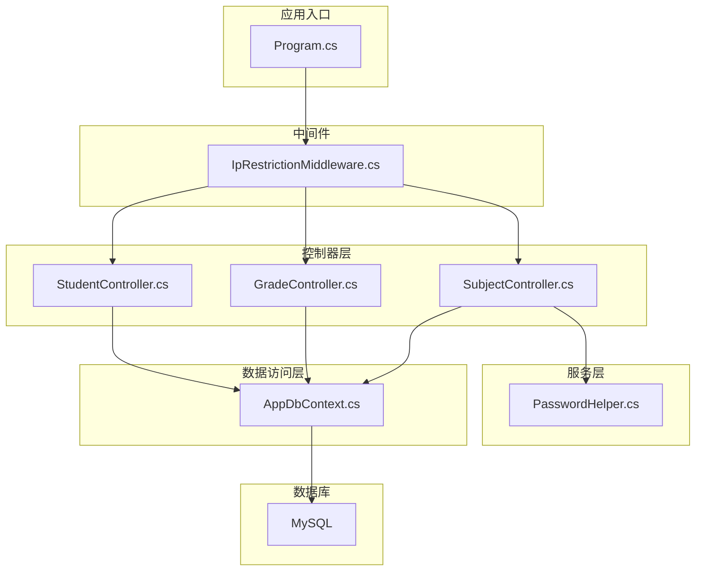
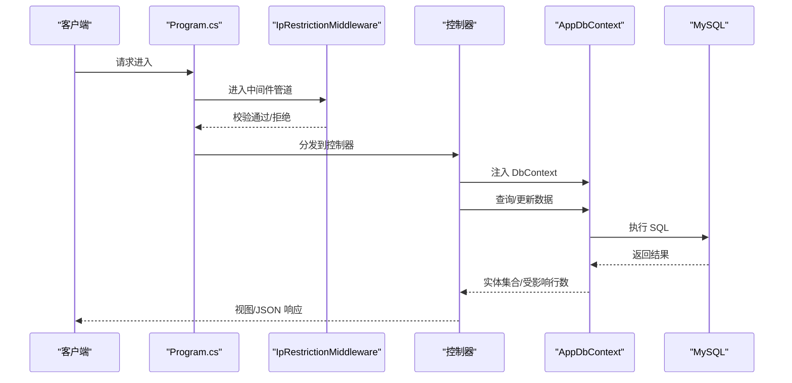
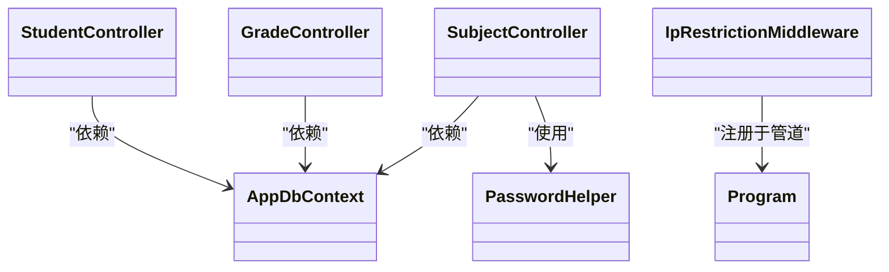

# 测试策略

<cite>
**本文引用的文件**   
- [StudentManagerCore.csproj](file://StudentManagerCore.csproj)
- [Program.cs](file://Program.cs)
- [appsettings.json](file://appsettings.json)
- [Controllers/StudentController.cs](file://Controllers/StudentController.cs)
- [Controllers/GradeController.cs](file://Controllers/GradeController.cs)
- [Controllers/SubjectController.cs](file://Controllers/SubjectController.cs)
- [Data/AppDbContext.cs](file://Data/AppDbContext.cs)
- [Services/PasswordHelper.cs](file://Services/PasswordHelper.cs)
- [Middleware/IpRestrictionMiddleware.cs](file://Middleware/IpRestrictionMiddleware.cs)
</cite>

## 目录
1. [引言](#引言)
2. [项目结构](#项目结构)
3. [核心组件](#核心组件)
4. [架构总览](#架构总览)
5. [详细组件分析](#详细组件分析)
6. [依赖分析](#依赖分析)
7. [性能考虑](#性能考虑)
8. [故障排查指南](#故障排查指南)
9. [结论](#结论)
10. [附录](#附录)

## 引言
本测试策略文档面向学生管理系统（ASP.NET Core 8 + MySQL）项目，旨在建立系统化的测试方法与实施计划。内容覆盖单元测试、集成测试、Mock 对象与依赖注入测试、数据库与 API 端点测试、UI 测试建议、测试覆盖率要求与测量方法、以及持续集成中的测试自动化配置思路。文档同时给出边界条件与异常处理测试示例，帮助团队在不同阶段高效落地质量保障。

## 项目结构
项目采用经典的分层架构：
- 控制器层（Controllers）：负责接收请求、组装视图模型、调用业务逻辑与数据访问。
- 数据访问层（Data）：基于 Entity Framework Core 的上下文与实体映射。
- 服务层（Services）：封装业务与算法（如密码哈希）。
- 中间件（Middleware）：全局 IP 白名单限制等横切关注点。
- 视图层（Views）：Razor 页面，配合控制器渲染。
- 应用入口（Program.cs）：注册服务、配置管道、EF 自动迁移。

图表来源
- [Program.cs:1-123](file://Program.cs#L1-L123)
- [Middleware/IpRestrictionMiddleware.cs:1-98](file://Middleware/IpRestrictionMiddleware.cs#L1-L98)
- [Controllers/StudentController.cs:1-997](file://Controllers/StudentController.cs#L1-L997)
- [Controllers/GradeController.cs:1-401](file://Controllers/GradeController.cs#L1-L401)
- [Controllers/SubjectController.cs:1-351](file://Controllers/SubjectController.cs#L1-L351)
- [Data/AppDbContext.cs:1-295](file://Data/AppDbContext.cs#L1-L295)
- [Services/PasswordHelper.cs:1-42](file://Services/PasswordHelper.cs#L1-L42)

章节来源
- [Program.cs:1-123](file://Program.cs#L1-L123)
- [StudentManagerCore.csproj:1-21](file://StudentManagerCore.csproj#L1-L21)

## 核心组件
- 控制器：承担路由、鉴权、参数校验、视图数据装配、异步数据访问与响应生成职责。
- 数据上下文：集中管理实体映射与关系约束，支持 EF Core 迁移。
- 密码服务：基于 ASP.NET Core Identity 的 PBKDF2 哈希与兼容性校验。
- 中间件：全局 IP 白名单控制，避免未授权访问。

章节来源
- [Controllers/StudentController.cs:1-997](file://Controllers/StudentController.cs#L1-L997)
- [Controllers/GradeController.cs:1-401](file://Controllers/GradeController.cs#L1-L401)
- [Controllers/SubjectController.cs:1-351](file://Controllers/SubjectController.cs#L1-L351)
- [Data/AppDbContext.cs:1-295](file://Data/AppDbContext.cs#L1-L295)
- [Services/PasswordHelper.cs:1-42](file://Services/PasswordHelper.cs#L1-L42)
- [Middleware/IpRestrictionMiddleware.cs:1-98](file://Middleware/IpRestrictionMiddleware.cs#L1-L98)

## 架构总览
系统通过依赖注入在 Program.cs 中注册服务，并在控制器构造函数中注入 AppDbContext 实例，实现数据访问解耦。EF Core 在启动时执行数据库迁移，确保结构一致性。

图表来源
- [Program.cs:1-123](file://Program.cs#L1-L123)
- [Middleware/IpRestrictionMiddleware.cs:1-98](file://Middleware/IpRestrictionMiddleware.cs#L1-L98)
- [Controllers/StudentController.cs:1-997](file://Controllers/StudentController.cs#L1-L997)
- [Data/AppDbContext.cs:1-295](file://Data/AppDbContext.cs#L1-L295)

## 详细组件分析

### 单元测试策略与实施
- 测试框架选择
  - 推荐使用 MSTest（与 .NET 生态契合度高，适合 ASP.NET Core 项目）。
  - 若偏好 xUnit/MSTest，亦可满足需求；关键在于统一团队约定与 CI 工具链。
- 测试类组织结构
  - 按功能域分层：Controllers、Services、Data（上下文）、Utilities。
  - 每个控制器对应一个测试类，按动作方法拆分子测试集。
- 测试方法命名规范
  - 动作_条件_期望，例如：Index_带筛选参数_返回分页数据。
  - 异常场景：Index_参数为空_抛出异常。
- Mock 对象与依赖注入
  - 使用 Moq 模拟 DbContext/Repository 接口，避免真实数据库依赖。
  - 使用 TestServer/Custom WebApplicationFactory 注入内存数据库或测试容器。
- 示例测试用例（路径参考）
  - 学生控制器：Index_带关键词筛选_返回匹配集合
  - 学生控制器：Import_文件类型非法_返回错误消息
  - 年级控制器：AddGrade_学段与年级不匹配_返回错误提示
  - 科目控制器：SaveSubjectTeachers_传入空教师列表_清理旧关联并保存新关联
  - 密码服务：Verify_明文密码匹配_返回真值
  - 密码服务：IsHashed_哈希字符串_返回真值

章节来源
- [Controllers/StudentController.cs:1-997](file://Controllers/StudentController.cs#L1-L997)
- [Controllers/GradeController.cs:1-401](file://Controllers/GradeController.cs#L1-L401)
- [Controllers/SubjectController.cs:1-351](file://Controllers/SubjectController.cs#L1-L351)
- [Services/PasswordHelper.cs:1-42](file://Services/PasswordHelper.cs#L1-L42)

### 集成测试策略
- 数据库测试
  - 使用 TestContainers 或内存数据库（如 SQLite InMemory）隔离测试环境。
  - 在测试前构建最小化数据库快照，测试后回滚或重建。
- API 端点测试
  - 使用 WebApplicationFactory 创建测试主机，发送 HTTP 请求，断言状态码、响应体结构与模型。
  - 针对受保护端点，模拟 Cookie/身份声明，验证权限控制。
- 用户界面测试（建议）
  - 使用 Playwright/Selenium 验证关键流程（登录、导入、导出、增删改查）。
  - 优先覆盖高风险路径与高频操作。

章节来源
- [Program.cs:1-123](file://Program.cs#L1-L123)
- [Data/AppDbContext.cs:1-295](file://Data/AppDbContext.cs#L1-L295)

### Mock 对象与依赖注入测试
- 依赖注入测试
  - 在测试中替换 DbContext 为内存实现，注入到控制器构造函数。
  - 使用 InMemoryDb 或 Mock<IDisposable> 替代真实连接。
- 外部服务模拟
  - 对密码哈希、第三方认证等外部依赖，使用 Fake/Stub 实现。
- 示例（路径参考）
  - 模拟 DbContext 查询返回固定集合，验证控制器返回正确视图模型。
  - 模拟 PasswordHelper.Verify 返回特定布尔值，验证登录流程分支。

章节来源
- [Data/AppDbContext.cs:1-295](file://Data/AppDbContext.cs#L1-L295)
- [Services/PasswordHelper.cs:1-42](file://Services/PasswordHelper.cs#L1-L42)

### 测试覆盖率要求与测量
- 覆盖率目标
  - 语句覆盖率：≥80%
  - 分支覆盖率：≥70%
  - 圈复杂度：优先降低热点模块复杂度
- 测量方法
  - 使用 Coverlet 采集覆盖率，结合 GitHub Actions/Azure DevOps 发布报告。
  - 对关键业务路径（导入/导出、权限控制、数据校验）进行重点监控。

章节来源
- [Controllers/StudentController.cs:1-997](file://Controllers/StudentController.cs#L1-L997)
- [Controllers/GradeController.cs:1-401](file://Controllers/GradeController.cs#L1-L401)
- [Controllers/SubjectController.cs:1-351](file://Controllers/SubjectController.cs#L1-L351)

### 持续集成中的测试自动化
- GitHub Actions（建议步骤）
  - 拉取代码 → 还原包 → 编译 → 单元测试（带 Coverlet）→ 集成测试（TestContainers/内存数据库）→ 发布覆盖率报告
- Azure DevOps（建议步骤）
  - 拉取代码 → 还原包 → 编译 → 单元测试（Coverlet）→ 集成测试 → 发布测试结果与覆盖率
- 关键配置要点
  - 使用 MySQL 容器作为集成测试数据库
  - 将 appsettings.Development.json 替换为测试配置，确保连接字符串指向测试数据库
  - 将覆盖率报告发布到制品库或第三方平台（如 Codecov）

章节来源
- [StudentManagerCore.csproj:1-21](file://StudentManagerCore.csproj#L1-L21)
- [appsettings.json:1-16](file://appsettings.json#L1-L16)

### 具体测试用例示例（路径参考）
- 边界条件
  - 学生控制器：Import_空文件流_返回“请选择文件”
  - 学生控制器：Export_关键词为空_返回全量数据
  - 年级控制器：AddClass_count>1_批量创建班级
- 异常情况
  - 学生控制器：Edit_参数不匹配_返回 404
  - 主题控制器：Delete_存在成绩记录_返回“无法删除”
  - 中间件：访问受限路径_不在白名单_返回 403
- 权限与鉴权
  - SubjectController_非管理员访问_返回 403
  - StudentController_班主任仅能查看本班_返回受限视图

章节来源
- [Controllers/StudentController.cs:1-997](file://Controllers/StudentController.cs#L1-L997)
- [Controllers/SubjectController.cs:1-351](file://Controllers/SubjectController.cs#L1-L351)
- [Middleware/IpRestrictionMiddleware.cs:1-98](file://Middleware/IpRestrictionMiddleware.cs#L1-L98)

## 依赖分析
- 控制器依赖 AppDbContext，后者依赖 MySQL 提供程序。
- 密码服务依赖 ASP.NET Core Identity 的 PasswordHasher。
- 中间件依赖配置中心（appsettings.json）中的 IP 白名单。

图表来源
- [Controllers/StudentController.cs:1-997](file://Controllers/StudentController.cs#L1-L997)
- [Controllers/GradeController.cs:1-401](file://Controllers/GradeController.cs#L1-L401)
- [Controllers/SubjectController.cs:1-351](file://Controllers/SubjectController.cs#L1-L351)
- [Data/AppDbContext.cs:1-295](file://Data/AppDbContext.cs#L1-L295)
- [Services/PasswordHelper.cs:1-42](file://Services/PasswordHelper.cs#L1-L42)
- [Middleware/IpRestrictionMiddleware.cs:1-98](file://Middleware/IpRestrictionMiddleware.cs#L1-L98)

章节来源
- [Data/AppDbContext.cs:1-295](file://Data/AppDbContext.cs#L1-L295)
- [Services/PasswordHelper.cs:1-42](file://Services/PasswordHelper.cs#L1-L42)
- [Program.cs:1-123](file://Program.cs#L1-L123)

## 性能考虑
- 单元测试应避免真实数据库 IO，优先使用内存集合与 Mock。
- 集成测试尽量缩短生命周期，使用事务回滚或数据库快照。
- 覆盖率采集仅在 CI 环境启用，减少本地开发负担。

## 故障排查指南
- 数据库迁移失败
  - 检查连接字符串与 MySQL 可达性；确认 EF Core 版本与驱动兼容。
- 中间件拦截登录页
  - 确认白名单配置包含测试环境 IP；或临时关闭中间件进行调试。
- 密码校验异常
  - 确认存储的密码格式（Identity v3 哈希或明文）；必要时触发迁移脚本。

章节来源
- [Program.cs:107-120](file://Program.cs#L107-L120)
- [Middleware/IpRestrictionMiddleware.cs:16-32](file://Middleware/IpRestrictionMiddleware.cs#L16-L32)
- [Controllers/SubjectController.cs:216-238](file://Controllers/SubjectController.cs#L216-L238)

## 结论
通过明确的测试框架选择、严格的命名与组织规范、完善的 Mock 与 DI 测试方案、数据库与 API 集成测试策略、覆盖率目标与 CI 自动化配置，本项目可在不同阶段稳定提升质量与交付效率。建议优先实现控制器与服务层的单元测试，再逐步扩展到 UI 与端到端测试。

## 附录
- 测试清单（示例）
  - 控制器动作：参数校验、鉴权、异常分支、分页与筛选
  - 数据访问：查询、插入、更新、删除、级联约束
  - 密码服务：哈希、校验、兼容性
  - 中间件：白名单、放行路径、代理场景