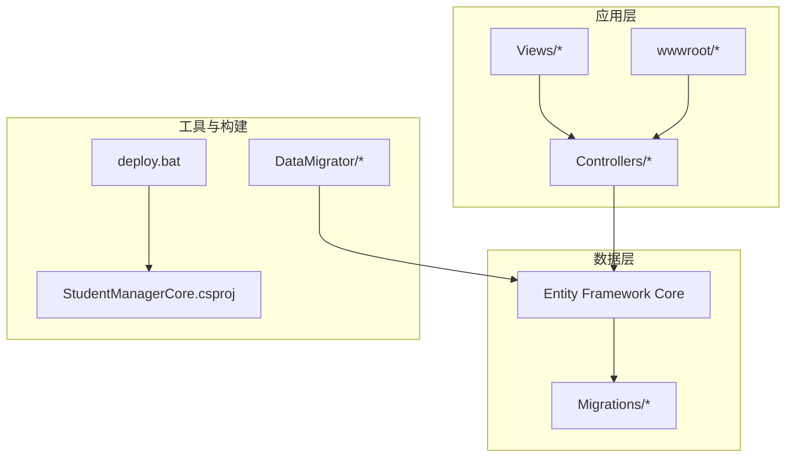
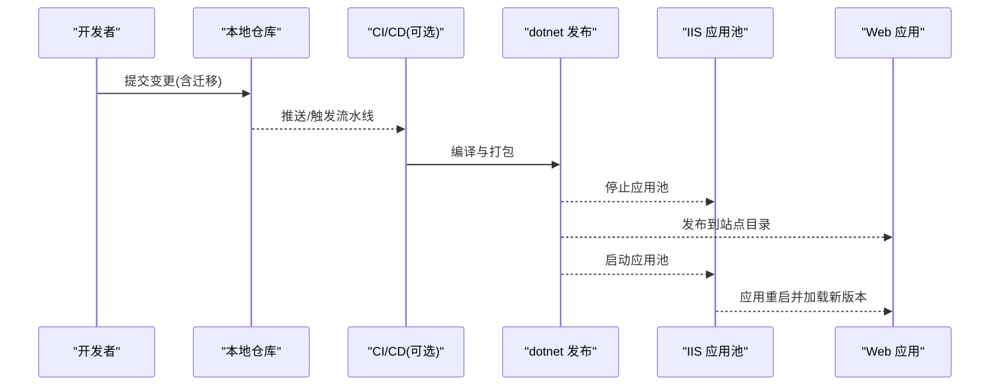
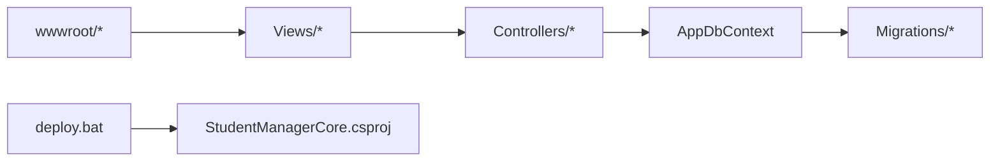

# 版本控制与协作

<cite>
**本文引用的文件**
- [Program.cs](file://Program.cs)
- [StudentManagerCore.csproj](file://StudentManagerCore.csproj)
- [deploy.bat](file://deploy.bat)
- [20260609075559_InitialCreate.cs](file://Migrations/20260609075559_InitialCreate.cs)
- [20260609075559_InitialCreate.Designer.cs](file://Migrations/20260609075559_InitialCreate.Designer.cs)
- [AppDbContextModelSnapshot.cs](file://Migrations/AppDbContextModelSnapshot.cs)
- [Program.cs](file://DataMigrator/Program.cs)
- [Program.cs](file://Controllers/GradeController.cs)
- [_Layout.cshtml](file://Views/Shared/_Layout.cshtml)
</cite>

## 目录
1. [引言](#引言)
2. [项目结构](#项目结构)
3. [核心组件](#核心组件)
4. [架构总览](#架构总览)
5. [详细组件分析](#详细组件分析)
6. [依赖关系分析](#依赖关系分析)
7. [性能考虑](#性能考虑)
8. [故障排查指南](#故障排查指南)
9. [结论](#结论)
10. [附录](#附录)

## 引言
本指南面向使用 Git 的团队，结合本项目的实际代码与构建部署脚本，系统化地给出版本控制与协作规范，涵盖分支管理策略、提交消息规范、PR/MR 流程、冲突解决、远程仓库管理、发布流程以及高级 Git 工具用法。目标是帮助团队建立一致、可追溯、可回滚且高效的合作方式。

## 项目结构
本项目为 ASP.NET Core Web 应用，采用传统的分层结构：
- 控制器层：位于 Controllers 目录，负责请求入口与业务编排
- 数据访问层：基于 Entity Framework Core，迁移文件位于 Migrations 目录
- 视图层：位于 Views 目录，前端静态资源位于 wwwroot
- 构建与部署：通过 .NET CLI 与批处理脚本进行发布与部署
- 工具集：多个独立的命令行工具项目用于特定任务（如数据迁移）

**图表来源**
- [StudentManagerCore.csproj](file://StudentManagerCore.csproj)
- [deploy.bat](file://deploy.bat)
- [20260609075559_InitialCreate.cs](file://Migrations/20260609075559_InitialCreate.cs)

**章节来源**
- [StudentManagerCore.csproj](file://StudentManagerCore.csproj)
- [deploy.bat](file://deploy.bat)

## 核心组件
- 程序入口与运行时配置：Program.cs 提供应用启动逻辑与服务注册
- 数据上下文与迁移：AppDbContext 及其迁移文件定义数据库模型演进
- 控制器与视图：控制器处理业务请求，视图渲染页面并与静态资源交互
- 部署脚本：deploy.bat 封装了停止应用池、发布与启动应用池的流程

**章节来源**
- [Program.cs](file://Program.cs)
- [AppDbContextModelSnapshot.cs](file://Migrations/AppDbContextModelSnapshot.cs)
- [_Layout.cshtml](file://Views/Shared/_Layout.cshtml)

## 架构总览
下图展示了从代码变更到部署上线的关键路径，强调了迁移、构建与部署之间的耦合关系。

**图表来源**
- [deploy.bat](file://deploy.bat)
- [20260609075559_InitialCreate.cs](file://Migrations/20260609075559_InitialCreate.cs)

## 详细组件分析

### 分支管理策略
- 适用场景
  - Git Flow：适合需要长期维护主分支稳定、严格发布周期的项目；适合本项目在引入数据库迁移后，对“稳定基线”与“功能并行”的需求
  - GitHub Flow：适合持续交付、频繁发布的项目；若团队追求快速迭代，可采用以 main 为主分支、feature/* 为功能分支的轻量策略
- 实施要点
  - 主分支保护：禁止直接推送至 main，必须通过 PR/MR 审查与测试
  - 功能分支：feature/前缀，建议与任务编号关联，便于追踪
  - 发布分支：release/* 用于预发布校验与小修
  - 热修复分支：hotfix/* 用于紧急修复，完成后需回并到 main 与 develop
- 与本项目的契合点
  - 数据库迁移与代码变更需同源管理，建议在 feature 分支内同时产出迁移与代码，避免发布时出现“迁移缺失”
  - 对于涉及 EF 模型快照的变更，应确保迁移文件与快照保持一致，减少部署风险

**章节来源**
- [20260609075559_InitialCreate.cs](file://Migrations/20260609075559_InitialCreate.cs)
- [AppDbContextModelSnapshot.cs](file://Migrations/AppDbContextModelSnapshot.cs)

### 提交消息规范
- 格式建议
  - 类型: 简短主题
  - 说明: 详细描述变更动机与影响范围
  - 关联: 任务编号/问题链接
- 类型分类
  - feat：新功能
  - fix：缺陷修复
  - docs：文档更新
  - style：不影响逻辑的格式调整
  - refactor：重构但不修复问题或增加功能
  - perf：性能优化
  - test：新增或调整测试
  - build：构建相关或外部依赖变更
  - ci：CI 配置变更
  - chore：日常维护任务
- 描述编写技巧
  - 使用祈使句，简明扼要
  - 如涉及数据库迁移，明确指出迁移文件名与目的
  - 若存在破坏性变更，需在描述中强调升级注意事项

**章节来源**
- [20260609075559_InitialCreate.cs](file://Migrations/20260609075559_InitialCreate.cs)

### Pull Request/merge request 流程
- 代码审查标准
  - 代码风格统一、命名规范一致
  - 业务逻辑清晰，边界条件覆盖充分
  - 数据库迁移完整、可重复、无破坏性变更
  - 单元测试/集成测试通过
- 审查清单
  - 是否有必要的日志或审计记录生成？
  - 是否存在潜在的并发问题或竞态条件？
  - 是否遵循最小权限原则与安全最佳实践？
  - 是否更新了相关文档或注释？
- 合并条件
  - 至少一名审查者批准
  - CI 通过
  - 无未解决的审查意见
  - 合并后清理分支

**章节来源**
- [Program.cs](file://Program.cs)
- [Controllers/GradeController.cs](file://Controllers/GradeController.cs)

### 冲突解决最佳实践
- rebase vs merge
  - 优先使用 rebase：保持线性历史，便于 bisect 与回溯
  - 在共享分支上谨慎使用 merge：保留合并节点，便于追踪分支合并
- 冲突标记处理
  - 明确冲突范围，逐段审阅
  - 优先保留业务正确性与数据一致性
  - 对数据库迁移冲突，优先以“最终迁移文件为准”，必要时重新生成迁移
- 与本项目的契合点
  - 当多人并行修改 EF 模型时，建议先同步上游再 rebase，减少迁移冲突
  - 对视图与静态资源的冲突，优先以最新设计稿为准，并在 PR 中标注变更范围

**章节来源**
- [AppDbContextModelSnapshot.cs](file://Migrations/AppDbContextModelSnapshot.cs)
- [_Layout.cshtml](file://Views/Shared/_Layout.cshtml)

### 远程仓库管理
- fork 工作流
  - 团队成员通过 fork 自己的副本，提交 PR 到主仓库
  - 适用于开源协作或外部贡献者参与
- 上游同步
  - 定期 fetch 并 rebase 主仓库分支，保持本地分支与上游一致
- 标签管理
  - 重要里程碑打 tag，配合 release notes
  - 与数据库迁移配套，便于回滚与审计

**章节来源**
- [StudentManagerCore.csproj](file://StudentManagerCore.csproj)

### 发布管理流程
- 版本号规则
  - 语义化版本：主版本.次版本.修订号(+构建元数据)
  - 数据库迁移视为“次版本”或“修订号”级别变更，依据是否破坏兼容性决定
- 发布分支与 hotfix
  - release/* 用于预发布校验与小修
  - hotfix/* 用于紧急修复，完成后回并 main 与 develop
- 与本项目的契合点
  - 发布前确保所有迁移已生成且可应用
  - 部署脚本需保证应用池的平滑切换，避免长时间停机

**章节来源**
- [deploy.bat](file://deploy.bat)
- [20260609075559_InitialCreate.cs](file://Migrations/20260609075559_InitialCreate.cs)

### 高级 Git 工具与命令
- bisect 调试
  - 用于定位引入回归的提交，结合单元测试或端到端验证
- cherry-pick
  - 将特定提交应用到当前分支，常用于 hotfix 或向后移植
- interactive rebase
  - 整理提交历史，合并、改写或删除不必要的提交
- 与本项目的契合点
  - 在 feature 分支中使用交互式 rebase 整理提交，提升可读性
  - 使用 cherry-pick 将已验证的迁移或修复应用到其他分支

**章节来源**
- [Program.cs](file://Program.cs)
- [20260609075559_InitialCreate.cs](file://Migrations/20260609075559_InitialCreate.cs)

## 依赖关系分析
- 组件耦合
  - 控制器依赖数据上下文与迁移定义
  - 视图依赖控制器输出与静态资源
  - 部署脚本依赖项目构建产物与 IIS 应用池
- 外部依赖
  - .NET 运行时与 EF Core
  - MySQL/SQL Server 提供程序（由迁移文件推断）
- 潜在循环依赖
  - 项目采用分层结构，未见循环依赖迹象
- 集成点
  - 迁移文件与模型快照需保持一致，避免部署阶段异常

**图表来源**
- [StudentManagerCore.csproj](file://StudentManagerCore.csproj)
- [20260609075559_InitialCreate.cs](file://Migrations/20260609075559_InitialCreate.cs)

**章节来源**
- [StudentManagerCore.csproj](file://StudentManagerCore.csproj)
- [20260609075559_InitialCreate.cs](file://Migrations/20260609075559_InitialCreate.cs)

## 性能考虑
- 提交粒度
  - 小步提交，聚焦单一变更，便于审查与回滚
- 迁移性能
  - 大批量数据迁移时，采用事务与批处理，减少锁竞争
- 部署性能
  - 发布前进行缓存与静态资源版本化，缩短重启时间

**章节来源**
- [Program.cs](file://Program.cs)
- [Program.cs](file://DataMigrator/Program.cs)

## 故障排查指南
- 迁移失败
  - 确认迁移文件与模型快照一致
  - 检查数据库连接字符串与权限
- 部署失败
  - 查看应用池状态与站点目录权限
  - 使用发布输出清单核对文件完整性
- 审查阻塞
  - 优先解决冲突与测试失败
  - 保持提交信息清晰，便于审查者理解变更意图

**章节来源**
- [deploy.bat](file://deploy.bat)
- [20260609075559_InitialCreate.Designer.cs](file://Migrations/20260609075559_InitialCreate.Designer.cs)

## 结论
通过统一的分支策略、严格的提交规范与 PR 流程、完善的冲突解决机制与发布管理，团队可以显著提升协作效率与发布质量。结合本项目的 EF 迁移与部署脚本特性，建议在功能分支内同步产出迁移与代码，并在发布前进行充分验证与演练。

## 附录
- 快速检查清单
  - 所有迁移已生成并可应用
  - 控制器与视图变更通过审查
  - 部署脚本可正常执行
  - 标签与发布说明已更新