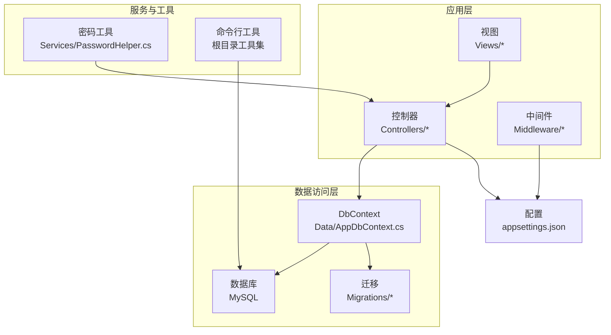
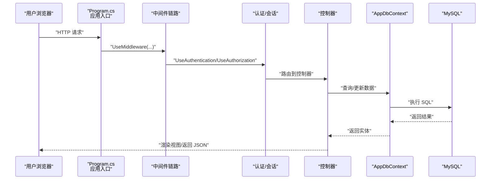
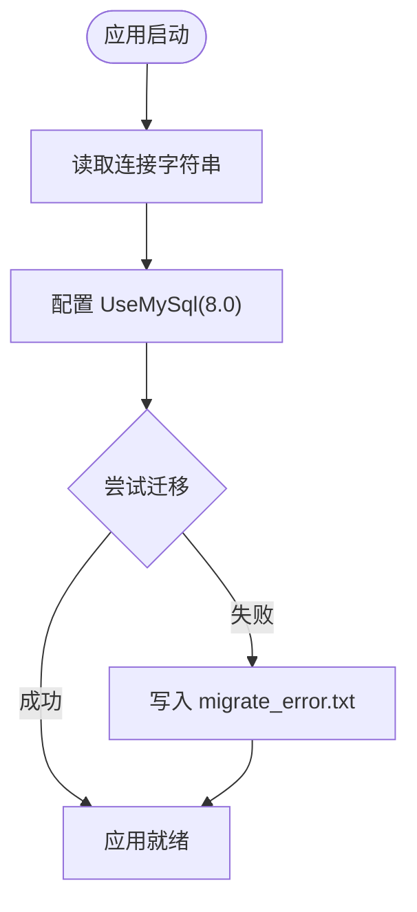
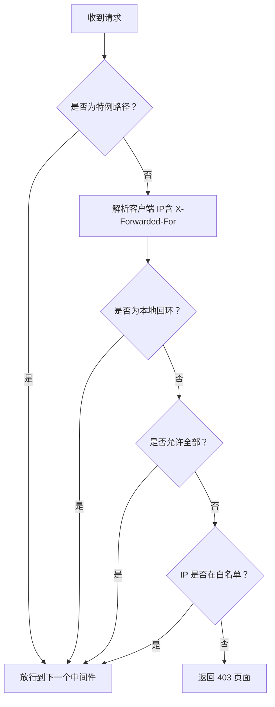
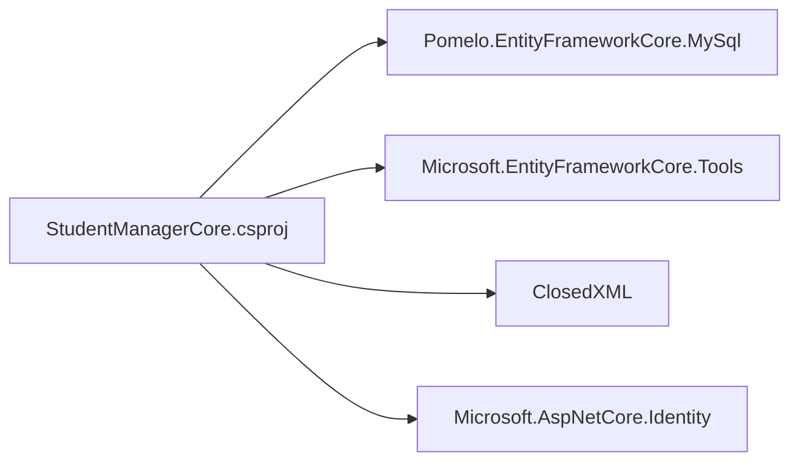

# 快速开始

<cite>
**本文引用的文件**
- [StudentManagerCore.csproj](file://StudentManagerCore.csproj)
- [appsettings.json](file://appsettings.json)
- [Program.cs](file://Program.cs)
- [AppDbContext.cs](file://Data/AppDbContext.cs)
- [deploy.bat](file://deploy.bat)
- [IpRestrictionMiddleware.cs](file://Middleware/IpRestrictionMiddleware.cs)
- [PasswordHelper.cs](file://Services/PasswordHelper.cs)
- [20260609075559_InitialCreate.cs](file://Migrations/20260609075559_InitialCreate.cs)
- [Create_Announcement_Tables.sql](file://Database/Create_Announcement_Tables.sql)
- [Add_GradeManagement_Tables.sql](file://Database/Add_GradeManagement_Tables.sql)
</cite>

## 目录
1. [简介](#简介)
2. [项目结构](#项目结构)
3. [核心组件](#核心组件)
4. [架构总览](#架构总览)
5. [详细组件分析](#详细组件分析)
6. [依赖关系分析](#依赖关系分析)
7. [性能与运行建议](#性能与运行建议)
8. [故障排查指南](#故障排查指南)
9. [结论](#结论)
10. [附录](#附录)

## 简介
本指南面向新手开发者，帮助你在最短时间内完成学生管理系统的本地开发与首次运行。内容涵盖开发环境准备（Visual Studio 或 VS Code、.NET 8.0 SDK）、MySQL 数据库部署与配置、项目克隆与依赖安装、数据库连接字符串配置、自动迁移与启动流程、常见问题排查以及一键部署脚本的使用说明。

## 项目结构
该仓库采用典型的 ASP.NET Core MVC + Entity Framework Core + MySQL 的分层组织方式：
- 控制器与视图：Controllers 与 Views
- 数据访问：Data（DbContext 定义）、Migrations（EF Core 迁移）
- 中间件：Middleware（如 IP 白名单）
- 服务工具：Services（如密码哈希）
- 数据库脚本：Database（SQL 初始化与扩展脚本）
- 工具程序：根目录下若干独立可执行工具（如数据校验、编码修复等）

图表来源
- [Program.cs:108-120](file://Program.cs#L108-L120)
- [AppDbContext.cs:6-294](file://Data/AppDbContext.cs#L6-L294)

章节来源
- [StudentManagerCore.csproj:1-21](file://StudentManagerCore.csproj#L1-L21)
- [Program.cs:108-120](file://Program.cs#L108-L120)

## 核心组件
- 应用入口与管线：Program.cs 负责构建服务容器、注册认证与会话、配置路由与中间件、执行数据库自动迁移并启动应用。
- 数据上下文：AppDbContext.cs 定义了多张业务实体表的映射与约束，用于 EF Core 模型化。
- 配置中心：appsettings.json 提供日志级别、允许主机、IP 白名单与默认数据库连接串。
- 中间件：IpRestrictionMiddleware 实现基于 IP 白名单的访问控制。
- 密码工具：PasswordHelper 使用 ASP.NET Core Identity 的 PBKDF2 算法进行密码哈希与验证。
- 迁移与脚本：Migrations/* 为 EF Core 迁移；Database/* 为 SQL 初始化与扩展脚本。

章节来源
- [Program.cs:1-123](file://Program.cs#L1-L123)
- [AppDbContext.cs:6-294](file://Data/AppDbContext.cs#L6-L294)
- [appsettings.json:1-16](file://appsettings.json#L1-L16)
- [IpRestrictionMiddleware.cs:1-98](file://Middleware/IpRestrictionMiddleware.cs#L1-L98)
- [PasswordHelper.cs:1-42](file://Services/PasswordHelper.cs#L1-L42)
- [20260609075559_InitialCreate.cs:13-508](file://Migrations/20260609075559_InitialCreate.cs#L13-L508)

## 架构总览
系统采用“请求进入 -> 中间件链路 -> 认证/授权 -> 控制器 -> 数据库”的标准 ASP.NET Core 流程。自动迁移在应用启动时按需执行，确保数据库结构与模型一致。

图表来源
- [Program.cs:46-100](file://Program.cs#L46-L100)
- [AppDbContext.cs:6-294](file://Data/AppDbContext.cs#L6-L294)

## 详细组件分析

### 数据库连接与自动迁移
- 连接字符串：位于 appsettings.json 的 ConnectionStrings.DefaultConnection，驱动为 Pomelo.EntityFrameworkCore.MySql。
- 版本选择：UseMySql 指定版本为 8.0，确保与 MySQL 兼容。
- 自动迁移：应用启动时通过 AppDbContext 执行迁移，若失败会写入 migrate_error.txt 便于定位。

图表来源
- [Program.cs:18-21](file://Program.cs#L18-L21)
- [Program.cs:108-120](file://Program.cs#L108-L120)
- [appsettings.json:12-14](file://appsettings.json#L12-L14)

章节来源
- [Program.cs:18-21](file://Program.cs#L18-L21)
- [Program.cs:108-120](file://Program.cs#L108-L120)
- [appsettings.json:12-14](file://appsettings.json#L12-L14)

### IP 白名单中间件
- 功能：根据 appsettings.json 中的 IpRestriction.AllowedIPs 决定是否放行请求；支持通配符 "*" 全部放行、本地回环放行、反向代理场景下的 X-Forwarded-For 解析。
- 特例：登录页与静态资源路径始终放行，避免无法访问。

图表来源
- [IpRestrictionMiddleware.cs:34-96](file://Middleware/IpRestrictionMiddleware.cs#L34-L96)
- [appsettings.json:9-11](file://appsettings.json#L9-L11)

章节来源
- [IpRestrictionMiddleware.cs:1-98](file://Middleware/IpRestrictionMiddleware.cs#L1-L98)
- [appsettings.json:9-11](file://appsettings.json#L9-L11)

### 密码哈希与兼容性
- 使用 ASP.NET Core Identity 的 PBKDF2 算法进行哈希。
- 支持旧版明文密码兼容验证，便于平滑过渡。
- 提供 IsHashed 判断是否已哈希，便于迁移与安全策略统一。

章节来源
- [PasswordHelper.cs:1-42](file://Services/PasswordHelper.cs#L1-L42)

### EF Core 迁移与数据库初始化
- 迁移文件：Migrations/20260609075559_InitialCreate.cs 定义了初始表结构与索引。
- SQL 脚本：Database/*.sql 提供 T-SQL 初始化脚本（用于非 EF 场景或手动部署）。

章节来源
- [20260609075559_InitialCreate.cs:13-508](file://Migrations/20260609075559_InitialCreate.cs#L13-L508)
- [Create_Announcement_Tables.sql:1-31](file://Database/Create_Announcement_Tables.sql#L1-L31)
- [Add_GradeManagement_Tables.sql:1-20](file://Database/Add_GradeManagement_Tables.sql#L1-L20)

## 依赖关系分析
- 项目目标框架：net8.0。
- 关键包：
  - Pomelo.EntityFrameworkCore.MySql：MySQL EF Core 提供程序。
  - Microsoft.EntityFrameworkCore.Tools：迁移与设计时工具。
  - ClosedXML：Excel 导出能力。
  - Microsoft.AspNetCore.Identity：密码哈希与验证基础。

图表来源
- [StudentManagerCore.csproj:10-18](file://StudentManagerCore.csproj#L10-L18)

章节来源
- [StudentManagerCore.csproj:1-21](file://StudentManagerCore.csproj#L1-L21)

## 性能与运行建议
- 首次启动时自动迁移可能耗时较长，取决于数据库规模与网络延迟。
- 生产环境建议启用 HTTPS、合理设置会话超时与认证过期时间。
- 静态资源与图片目录会在启动时自动创建，确保 wwwroot/imge 存在。

章节来源
- [Program.cs:102-105](file://Program.cs#L102-L105)
- [Program.cs:23-41](file://Program.cs#L23-L41)

## 故障排查指南

### 环境准备
- 开发工具
  - Visual Studio：安装 .NET 8 桌面开发与 ASP.NET 工作负载。
  - VS Code：安装 C#、ASP.NET 扩展，确保 .NET 8 SDK 可用。
- .NET 8.0 SDK：从官网下载并安装，重启终端验证 dotnet --version。
- MySQL：安装 MySQL 8.0+，确保可正常登录并具备创建数据库与表的权限。

### 数据库连接失败
- 检查 appsettings.json 中的连接字符串是否正确（服务器、数据库名、用户名、密码）。
- 确认 MySQL 服务已启动，防火墙未阻断端口。
- 若使用远程数据库，确认用户权限与主机白名单设置。

章节来源
- [appsettings.json:12-14](file://appsettings.json#L12-L14)

### 端口冲突
- 默认开发服务器端口由 .NET 自动分配，若冲突可在 launchSettings.json 或命令行参数中调整。
- 生产部署使用 IIS/Nginx 时，注意反向代理与端口转发配置。

### 权限不足
- 确保数据库用户具备 CREATE、ALTER、INSERT、UPDATE、DELETE、SELECT 权限。
- 若使用 Windows 认证或特定角色，确认登录凭据与角色映射正确。

### 自动迁移失败
- 查看 migrate_error.txt 获取具体错误信息与堆栈。
- 确认连接字符串、MySQL 版本与 EF Core 包版本匹配。

章节来源
- [Program.cs:116-120](file://Program.cs#L116-L120)

### IP 白名单导致无法访问
- 登录页与静态资源路径不受限制，若仍被拦截，检查 appsettings.json 中 IpRestriction.AllowedIPs 设置。
- 反向代理场景请确保 X-Forwarded-For 头正确传递。

章节来源
- [IpRestrictionMiddleware.cs:34-96](file://Middleware/IpRestrictionMiddleware.cs#L34-L96)
- [appsettings.json:9-11](file://appsettings.json#L9-L11)

## 结论
按照本指南完成环境准备、数据库部署与配置、项目启动与迁移后，你即可在本地顺利运行学生管理系统。遇到问题时，优先检查连接字符串、权限与迁移日志，并结合 IP 白名单与中间件行为进行定位。生产部署可参考一键脚本与中间件策略，确保安全与稳定。

## 附录

### 一键部署脚本使用说明
- 脚本位置：deploy.bat
- 功能：停止 IIS 应用池 -> dotnet publish -> 启动 IIS 应用池
- 注意事项：
  - 确保 IIS 管理命令 appcmd 可用。
  - 发布输出目录需有写权限。
  - 如使用其他托管平台（如 Kestrel/Linux），请按平台要求调整。

章节来源
- [deploy.bat:1-43](file://deploy.bat#L1-L43)

### 首次运行步骤清单
- 安装 .NET 8.0 SDK 与 MySQL 8.0+
- 在 MySQL 中创建数据库（名称与连接字符串一致）
- 克隆仓库并还原 NuGet 包
- 配置 appsettings.json 的连接字符串
- 运行应用，等待自动迁移完成
- 访问登录页，使用管理员账户登录

章节来源
- [appsettings.json:12-14](file://appsettings.json#L12-L14)
- [Program.cs:108-120](file://Program.cs#L108-L120)