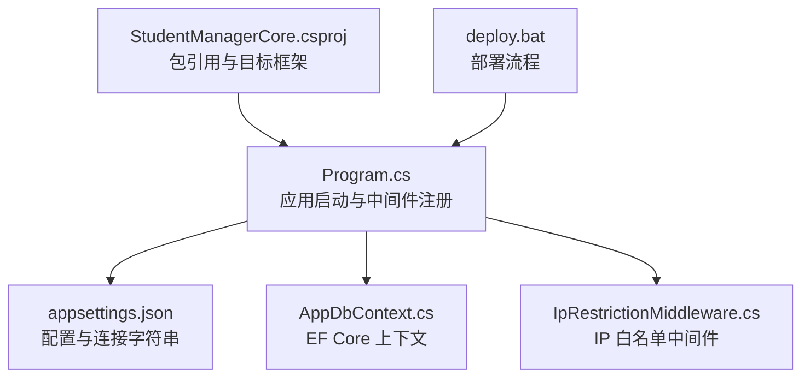
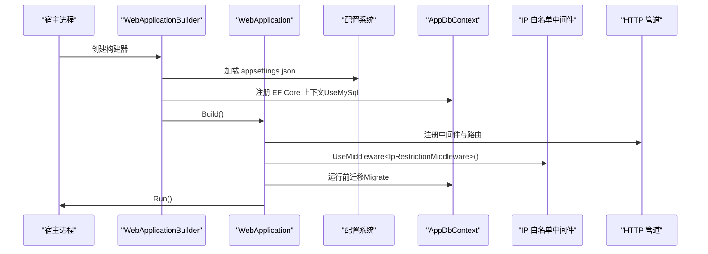
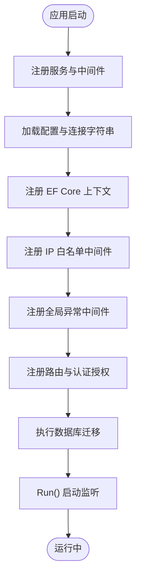
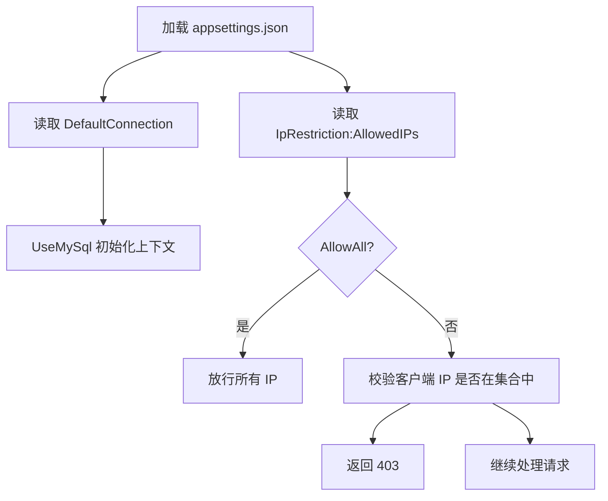
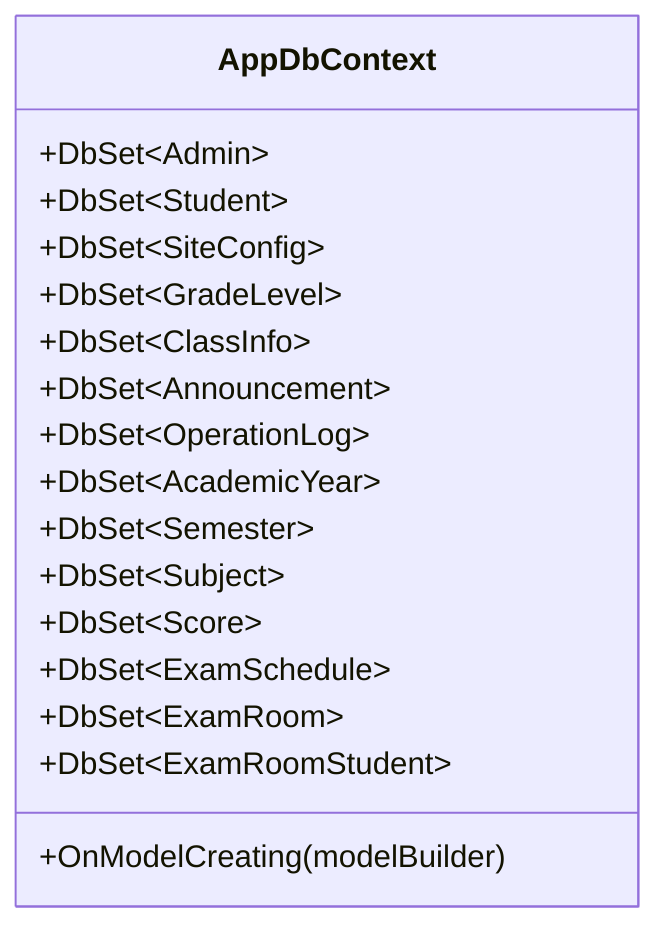
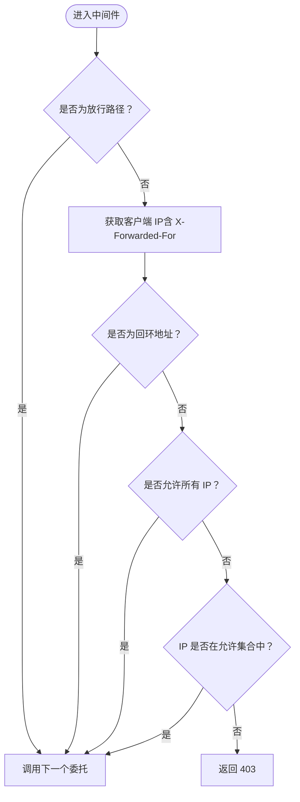
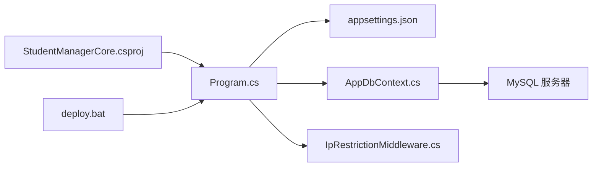
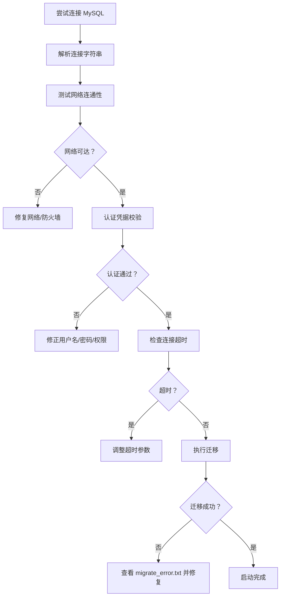

# 启动与配置问题

<cite>
**本文引用的文件**   
- [Program.cs](file://Program.cs)
- [appsettings.json](file://appsettings.json)
- [StudentManagerCore.csproj](file://StudentManagerCore.csproj)
- [AppDbContext.cs](file://Data/AppDbContext.cs)
- [IpRestrictionMiddleware.cs](file://Middleware/IpRestrictionMiddleware.cs)
- [deploy.bat](file://deploy.bat)
</cite>

## 目录
1. [简介](#简介)
2. [项目结构](#项目结构)
3. [核心组件](#核心组件)
4. [架构总览](#架构总览)
5. [详细组件分析](#详细组件分析)
6. [依赖关系分析](#依赖关系分析)
7. [性能考虑](#性能考虑)
8. [故障排除指南](#故障排除指南)
9. [结论](#结论)
10. [附录](#附录)

## 简介
本指南聚焦于学生管理系统的启动与配置问题，覆盖依赖项缺失、配置文件格式错误、端口占用、权限不足、数据库连接字符串错误、环境变量差异、NuGet 包依赖冲突与下载失败、配置文件验证工具使用以及启动日志分析等常见问题。文档以代码库中的实际实现为依据，提供可操作的排查步骤与可视化图示，帮助快速定位并解决问题。

## 项目结构
该应用采用 ASP.NET Core 默认项目布局，关键启动与配置相关文件如下：
- 启动入口与管道配置：Program.cs
- 应用配置与连接字符串：appsettings.json
- 依赖与包引用：StudentManagerCore.csproj
- 数据上下文与实体映射：Data/AppDbContext.cs
- IP 白名单中间件：Middleware/IpRestrictionMiddleware.cs
- 部署脚本：deploy.bat

图表来源
- [Program.cs:1-123](file://Program.cs#L1-L123)
- [appsettings.json:1-16](file://appsettings.json#L1-L16)
- [StudentManagerCore.csproj:1-21](file://StudentManagerCore.csproj#L1-L21)
- [AppDbContext.cs:1-295](file://Data/AppDbContext.cs#L1-L295)
- [IpRestrictionMiddleware.cs:1-98](file://Middleware/IpRestrictionMiddleware.cs#L1-L98)
- [deploy.bat:1-43](file://deploy.bat#L1-L43)

章节来源
- [Program.cs:1-123](file://Program.cs#L1-L123)
- [appsettings.json:1-16](file://appsettings.json#L1-L16)
- [StudentManagerCore.csproj:1-21](file://StudentManagerCore.csproj#L1-L21)

## 核心组件
- 启动与服务注册：Program.cs 负责构建 WebApplicationBuilder、注册 MVC 控制器、Anti-Forgery、EF Core 上下文、Cookie 认证、会话缓存与路由，并在运行前执行数据库自动迁移。
- 配置与连接字符串：appsettings.json 提供日志级别、允许主机、IP 白名单与默认连接字符串。
- 数据上下文：AppDbContext.cs 定义了多表实体映射与级联删除规则，用于 EF Core 迁移与查询。
- IP 白名单中间件：IpRestrictionMiddleware.cs 从配置读取允许的 IP 列表，支持反向代理场景下的 X-Forwarded-For 解析。
- 项目依赖：StudentManagerCore.csproj 指定 .NET 8、包引用（ClosedXML、Identity、Pomelo.EntityFrameworkCore.MySql、EF Core Tools）及默认排除项。
- 部署流程：deploy.bat 执行停止应用池、发布与启动应用池的操作。

章节来源
- [Program.cs:1-123](file://Program.cs#L1-L123)
- [appsettings.json:1-16](file://appsettings.json#L1-L16)
- [AppDbContext.cs:1-295](file://Data/AppDbContext.cs#L1-L295)
- [IpRestrictionMiddleware.cs:1-98](file://Middleware/IpRestrictionMiddleware.cs#L1-L98)
- [StudentManagerCore.csproj:1-21](file://StudentManagerCore.csproj#L1-L21)
- [deploy.bat:1-43](file://deploy.bat#L1-L43)

## 架构总览
应用启动流程的关键节点包括：构建服务容器、注册中间件与路由、加载配置、建立数据库连接、执行迁移、运行应用。IP 白名单中间件在请求进入路由之前进行访问控制。

图表来源
- [Program.cs:7-123](file://Program.cs#L7-L123)
- [appsettings.json:1-16](file://appsettings.json#L1-L16)
- [AppDbContext.cs:1-295](file://Data/AppDbContext.cs#L1-L295)
- [IpRestrictionMiddleware.cs:10-98](file://Middleware/IpRestrictionMiddleware.cs#L10-L98)

## 详细组件分析

### 组件一：启动与中间件注册（Program.cs）
- 关键职责
  - 注册 MVC、Anti-Forgery、HttpContextAccessor、Cookie 认证、分布式缓存与会话。
  - 通过配置读取连接字符串并注册 EF Core 上下文。
  - 注册自定义全局异常中间件与状态码页面重定向。
  - 注册 IP 白名单中间件、HTTPS、静态文件、路由与认证授权。
  - 在应用启动前执行数据库自动迁移，失败时写入迁移错误文件。
  - 确保 wwwroot/imge 目录存在。
- 启动顺序与依赖
  - 中间件注册顺序决定请求处理链，异常中间件应置于靠前位置以捕获后续阶段异常。
  - IP 白名单中间件在路由之前生效，需放行登录与静态资源路径。
  - EF Core 迁移在 Run() 之前执行，确保数据库结构就绪。
- 错误处理
  - 异常中间件将异常写入 error.log 文件，便于排查。
  - 迁移失败写入 migrate_error.txt，包含时间、消息与堆栈。

图表来源
- [Program.cs:10-123](file://Program.cs#L10-L123)

章节来源
- [Program.cs:1-123](file://Program.cs#L1-L123)

### 组件二：配置与连接字符串（appsettings.json）
- 关键字段
  - Logging：默认日志级别与 ASP.NET Core 日志级别。
  - AllowedHosts：允许的主机名通配符。
  - IpRestriction：AllowedIPs 支持“*”或逗号分隔的 IP 列表。
  - ConnectionStrings.DefaultConnection：MySQL 连接字符串模板。
- 配置加载
  - Program.cs 通过 builder.Configuration.GetConnectionString("DefaultConnection") 获取连接字符串。
  - IP 白名单中间件通过 IConfiguration.GetValue 读取 IpRestriction:AllowedIPs。
- 常见问题
  - 连接字符串格式错误会导致 EF Core 初始化失败。
  - IP 白名单配置不当导致登录页或静态资源无法访问。
  - AllowedHosts 未正确设置可能导致 HTTPS 重定向或反向代理场景下的访问异常。

图表来源
- [appsettings.json:1-16](file://appsettings.json#L1-L16)
- [Program.cs:19-21](file://Program.cs#L19-L21)
- [IpRestrictionMiddleware.cs:16-32](file://Middleware/IpRestrictionMiddleware.cs#L16-L32)

章节来源
- [appsettings.json:1-16](file://appsettings.json#L1-L16)
- [Program.cs:19-21](file://Program.cs#L19-L21)
- [IpRestrictionMiddleware.cs:16-32](file://Middleware/IpRestrictionMiddleware.cs#L16-L32)

### 组件三：数据上下文与实体映射（AppDbContext.cs）
- 关键职责
  - 定义多个 DbSet 实体（如 Admin、Student、SiteConfig、ExamSchedule 等）。
  - 在 OnModelCreating 中配置表名、列名、主键、索引与外键级联行为。
- 影响范围
  - EF Core 迁移依赖此模型生成与执行。
  - 查询与更新均基于这些实体映射。
- 故障影响
  - 映射配置错误会导致迁移失败或查询异常。
  - 级联删除策略不当可能引发约束冲突。

图表来源
- [AppDbContext.cs:6-294](file://Data/AppDbContext.cs#L6-L294)

章节来源
- [AppDbContext.cs:1-295](file://Data/AppDbContext.cs#L1-L295)

### 组件四：IP 白名单中间件（IpRestrictionMiddleware.cs）
- 关键职责
  - 从配置读取允许的 IP 列表，支持“*”放行与逗号分隔列表。
  - 放行登录页与静态资源路径，避免阻断正常访问。
  - 支持反向代理场景解析 X-Forwarded-For 获取真实客户端 IP。
  - 本地回环地址始终放行，便于本机调试。
- 常见问题
  - AllowedIPs 为空或“*”时仍被 403 拒绝，检查是否命中放行路径逻辑。
  - 反向代理未正确传递 X-Forwarded-For 导致 IP 解析失败。
  - 未放行登录与静态资源路径导致登录页不可访问。

图表来源
- [IpRestrictionMiddleware.cs:34-96](file://Middleware/IpRestrictionMiddleware.cs#L34-L96)

章节来源
- [IpRestrictionMiddleware.cs:1-98](file://Middleware/IpRestrictionMiddleware.cs#L1-L98)

### 组件五：项目依赖与包引用（StudentManagerCore.csproj）
- 关键点
  - 目标框架：net8.0。
  - 包引用：ClosedXML、Microsoft.AspNetCore.Identity、Pomelo.EntityFrameworkCore.MySql、Microsoft.EntityFrameworkCore.Tools。
  - 默认排除项：排除多个工具项目（DataMigrator、check_*、hash_pwd 等）参与主项目编译。
- 影响范围
  - 缺少 Pomelo.EntityFrameworkCore.MySql 将导致 EF Core 无法连接 MySQL。
  - 缺少 Microsoft.EntityFrameworkCore.Tools 将影响迁移命令可用性。
  - Identity 包用于身份认证相关功能。

章节来源
- [StudentManagerCore.csproj:1-21](file://StudentManagerCore.csproj#L1-L21)

### 组件六：部署流程（deploy.bat）
- 关键步骤
  - 停止 IIS 应用池（appcmd stop apppool）。
  - dotnet publish 发布到目标目录。
  - 启动 IIS 应用池（appcmd start apppool）。
- 常见问题
  - appcmd 命令不存在或无权限导致停止/启动失败。
  - 发布失败时检查 .NET SDK、项目文件与包还原状态。
  - 应用池启动后未监听预期端口，检查防火墙与站点绑定。

章节来源
- [deploy.bat:1-43](file://deploy.bat#L1-L43)

## 依赖关系分析
- 组件耦合
  - Program.cs 依赖 appsettings.json 的连接字符串与 IP 白名单配置。
  - AppDbContext 作为 EF Core 核心，被迁移与业务层共同依赖。
  - IpRestrictionMiddleware 依赖 IConfiguration，与 Program.cs 的配置加载强关联。
- 外部依赖
  - MySQL：由 Pomelo.EntityFrameworkCore.MySql 提供驱动支持。
  - IIS/Windows：部署脚本依赖 appcmd 与应用池。
- 潜在风险
  - 配置文件缺失或格式错误会导致启动失败。
  - 包版本不匹配可能导致运行时异常。
  - 反向代理未正确透传头部导致 IP 白名单误判。

图表来源
- [Program.cs:19-21](file://Program.cs#L19-L21)
- [appsettings.json:12-14](file://appsettings.json#L12-L14)
- [StudentManagerCore.csproj:10-18](file://StudentManagerCore.csproj#L10-L18)
- [deploy.bat:19](file://deploy.bat#L19)

章节来源
- [Program.cs:19-21](file://Program.cs#L19-L21)
- [appsettings.json:12-14](file://appsettings.json#L12-L14)
- [StudentManagerCore.csproj:10-18](file://StudentManagerCore.csproj#L10-L18)
- [deploy.bat:19](file://deploy.bat#L19)

## 性能考虑
- 中间件顺序对性能有直接影响：将高频放行路径（登录、静态资源）置于前面，减少不必要的 IP 校验。
- EF Core 迁移在启动时执行，建议在生产环境通过独立迁移工具或 CI/CD 流水线提前完成，避免启动延迟。
- 日志级别与 IP 白名单规则应按环境调整，避免过度日志与频繁拒绝导致的性能损耗。

## 故障排除指南

### 一、启动失败的常见原因与排查
- 依赖项缺失
  - 现象：启动时报缺少包或类型解析失败。
  - 排查：确认 StudentManagerCore.csproj 中包引用完整，特别是 Pomelo.EntityFrameworkCore.MySql、Microsoft.EntityFrameworkCore.Tools、Microsoft.AspNetCore.Identity。
  - 处理：执行包还原与重新生成，确保包缓存可用。
- 配置文件格式错误
  - 现象：启动时抛出配置读取异常或连接字符串无效。
  - 排查：检查 appsettings.json 的 JSON 格式、键名拼写与值编码。
  - 处理：使用 JSON 验证工具或在线校验器修复语法错误。
- 端口占用
  - 现象：应用无法启动监听端口，出现地址已在使用。
  - 排查：使用 netstat 或 PowerShell 查看端口占用情况。
  - 处理：释放占用端口或修改应用监听端口。
- 权限不足
  - 现象：无法写入日志文件、迁移错误文件或创建 wwwroot/imge 目录。
  - 排查：检查运行账户对应用目录的读写权限。
  - 处理：提升权限或更换应用池身份。

章节来源
- [StudentManagerCore.csproj:10-18](file://StudentManagerCore.csproj#L10-L18)
- [appsettings.json:1-16](file://appsettings.json#L1-16)
- [Program.cs:102-120](file://Program.cs#L102-L120)

### 二、数据库连接字符串配置错误的诊断
- 连接超时
  - 现象：EF Core 初始化缓慢或超时。
  - 排查：检查连接字符串中的服务器地址、端口、数据库名与连接超时参数。
  - 处理：缩短超时时间、优化网络路径或切换到本地回环地址测试。
- 认证失败
  - 现象：登录 MySQL 报用户名或密码错误。
  - 排查：核对 appsettings.json 中的 User Id 与 Password，确认 MySQL 用户存在且具备访问权限。
  - 处理：重置密码或授予相应权限。
- 网络问题
  - 现象：无法连通 MySQL 服务器。
  - 排查：使用 telnet 或 PowerShell Test-NetConnection 检查端口连通性。
  - 处理：修复防火墙、路由或服务器配置。
- 迁移失败
  - 现象：启动时报迁移异常。
  - 排查：查看 migrate_error.txt 中的时间、错误消息与堆栈。
  - 处理：根据错误类型修正模型映射或数据库结构。

图表来源
- [Program.cs:18-21](file://Program.cs#L18-L21)
- [Program.cs:108-120](file://Program.cs#L108-L120)
- [appsettings.json:12-14](file://appsettings.json#L12-L14)

章节来源
- [Program.cs:18-21](file://Program.cs#L18-L21)
- [Program.cs:108-120](file://Program.cs#L108-L120)
- [appsettings.json:12-14](file://appsettings.json#L12-L14)

### 三、环境变量配置问题的排查
- 开发环境 vs 生产环境
  - 开发环境常用 localhost 与明文密码，生产环境应使用专用用户、安全密码与只读权限。
  - AllowedHosts 在开发可设为“*”，生产应限定为具体域名。
  - IP 白名单在开发可设为“*”，生产应严格限制。
- 差异处理建议
  - 使用 appsettings.{Environment}.json 分离不同环境配置。
  - 通过环境变量覆盖敏感配置（如连接字符串），避免硬编码。
  - 在 CI/CD 中注入环境变量并验证其生效。

章节来源
- [appsettings.json:8-14](file://appsettings.json#L8-L14)
- [Program.cs:49-81](file://Program.cs#L49-L81)

### 四、NuGet 包依赖问题
- 版本冲突
  - 现象：运行时报类型找不到或程序集绑定失败。
  - 排查：检查包版本与 .NET 目标框架兼容性（如 Pomelo 与 EF Core 8）。
  - 处理：统一包版本，清理 bin/obj 与 NuGet 缓存后重新生成。
- 包下载失败
  - 现象：还原包时网络超时或 404。
  - 排查：检查 NuGet 源、代理与防火墙设置。
  - 处理：切换到稳定源、配置代理或使用本地缓存镜像。

章节来源
- [StudentManagerCore.csproj:10-18](file://StudentManagerCore.csproj#L10-L18)

### 五、配置文件验证工具使用
- JSON 校验
  - 使用在线 JSON 校验器或编辑器插件检查 appsettings.json 的语法与键名。
- 连接字符串验证
  - 使用最小化连接字符串进行测试（仅包含服务器、数据库、凭据），逐步添加选项定位问题。
- 配置加载验证
  - 在 Program.cs 中临时输出 Configuration.GetChildren() 的键值，确认配置已正确加载。

章节来源
- [appsettings.json:1-16](file://appsettings.json#L1-16)
- [Program.cs:19-21](file://Program.cs#L19-L21)

### 六、启动日志分析技巧
- 错误日志文件
  - error.log：记录全局异常详情，包含时间戳与异常对象，用于定位异常根因。
  - migrate_error.txt：记录迁移失败的详细信息，包含时间、消息与堆栈。
- 日志级别
  - 适当提高 Logging.Default 级别以获取更详细的启动信息，但注意生产环境的性能影响。
- 结合中间件
  - 若 IP 白名单导致访问被拒，检查中间件放行路径与 X-Forwarded-For 设置。

章节来源
- [Program.cs:78-81](file://Program.cs#L78-L81)
- [Program.cs:117-120](file://Program.cs#L117-L120)
- [appsettings.json:2-7](file://appsettings.json#L2-L7)

## 结论
本指南基于代码库的实际实现，系统梳理了启动与配置问题的排查路径：从依赖与配置文件入手，结合数据库连接、IP 白名单、环境变量与包依赖等维度，辅以日志分析与部署流程检查，形成闭环的问题定位与解决方法。建议在开发与生产环境中分别制定标准化的配置模板与验证流程，以降低启动失败的风险。

## 附录
- 快速检查清单
  - appsettings.json 语法与键名正确，连接字符串有效。
  - Pomelo.EntityFrameworkCore.MySql 与 EF Core Tools 版本匹配。
  - IIS 应用池可正常启停，dotnet publish 成功。
  - IP 白名单放行登录与静态资源路径，反向代理正确透传 X-Forwarded-For。
  - error.log 与 migrate_error.txt 无异常或已修复。
- 参考文件
  - [Program.cs](file://Program.cs)
  - [appsettings.json](file://appsettings.json)
  - [StudentManagerCore.csproj](file://StudentManagerCore.csproj)
  - [AppDbContext.cs](file://Data/AppDbContext.cs)
  - [IpRestrictionMiddleware.cs](file://Middleware/IpRestrictionMiddleware.cs)
  - [deploy.bat](file://deploy.bat)