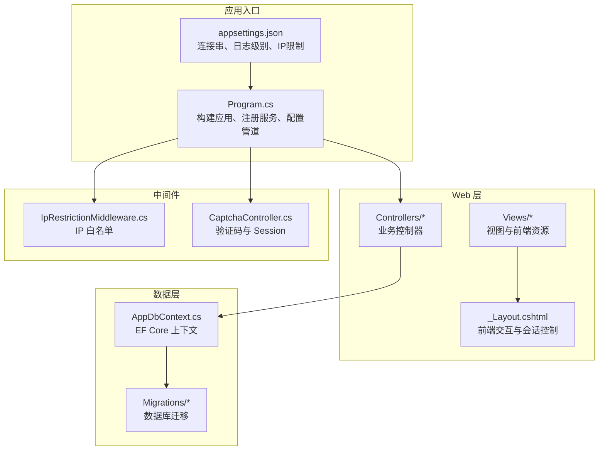
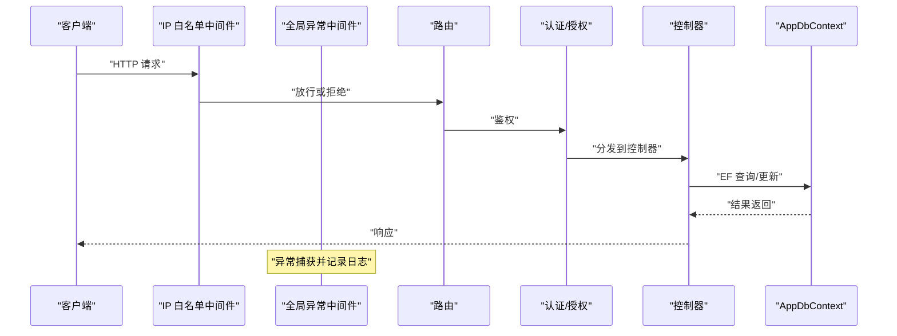
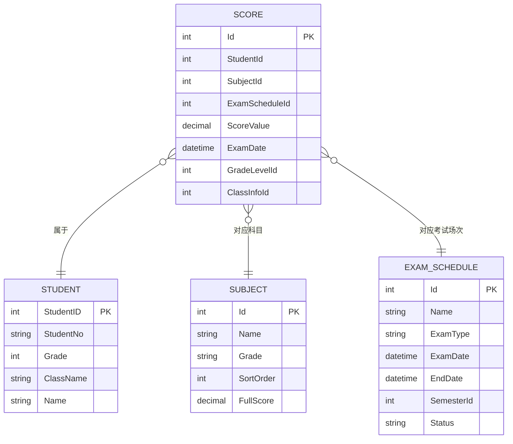
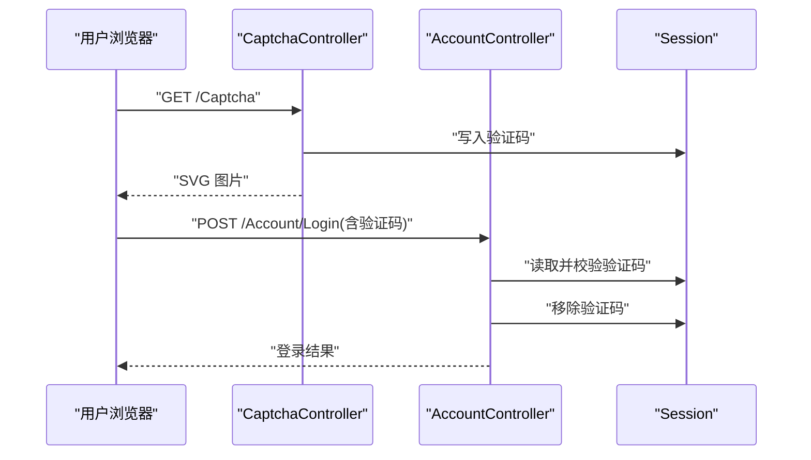
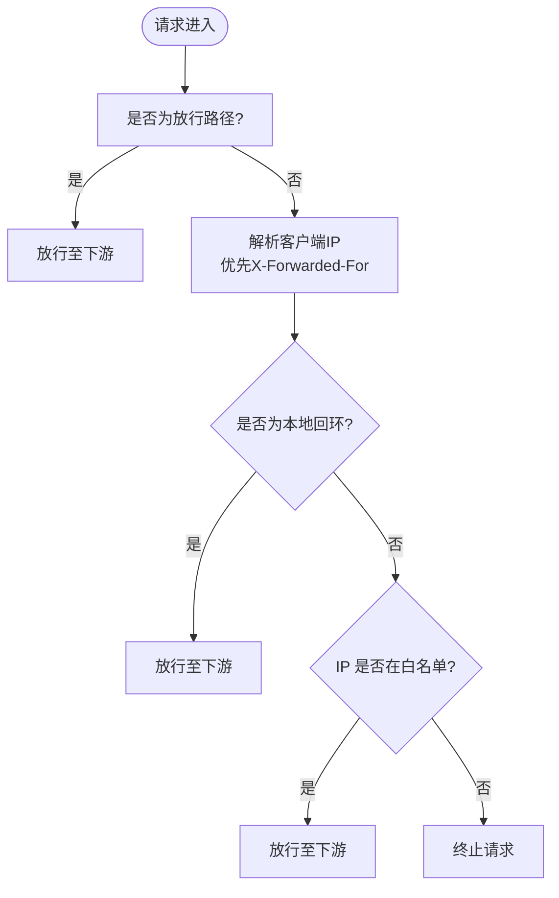
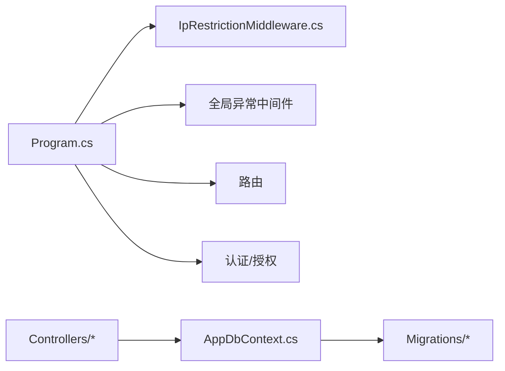

# 性能问题

<cite>
**本文引用的文件**
- [Program.cs](file://Program.cs)
- [appsettings.json](file://appsettings.json)
- [AppDbContext.cs](file://Data/AppDbContext.cs)
- [IpRestrictionMiddleware.cs](file://Middleware/IpRestrictionMiddleware.cs)
- [CaptchaController.cs](file://Controllers/CaptchaController.cs)
- [AccountController.cs](file://Controllers/AccountController.cs)
- [20260609075559_InitialCreate.cs](file://Migrations/20260609075559_InitialCreate.cs)
- [AppDbContextModelSnapshot.cs](file://Migrations/AppDbContextModelSnapshot.cs)
- [20260611075107_RefactorScoreModel.Designer.cs](file://Migrations/20260611075107_RefactorScoreModel.Designer.cs)
- [Program.cs(DataMigrator)](file://DataMigrator/Program.cs)
- [_Layout.cshtml](file://Views/Shared/_Layout.cshtml)
</cite>

## 目录
1. [简介](#简介)
2. [项目结构](#项目结构)
3. [核心组件](#核心组件)
4. [架构总览](#架构总览)
5. [详细组件分析](#详细组件分析)
6. [依赖关系分析](#依赖关系分析)
7. [性能考量](#性能考量)
8. [故障排查指南](#故障排查指南)
9. [结论](#结论)
10. [附录](#附录)

## 简介
本指南面向学生信息管理系统的性能问题诊断与优化，聚焦以下方面：
- 应用响应缓慢的排查：CPU 使用率过高、内存泄漏、线程阻塞
- 数据库查询性能优化：慢查询分析、索引优化、查询重写
- 缓存机制问题排查：缓存失效、缓存穿透、缓存雪崩
- 并发访问问题：死锁、资源竞争、负载均衡
- 性能监控与日志：性能计数器、APM 工具、日志分析
- 基准测试：建立性能基线与识别回归

## 项目结构
该系统采用 ASP.NET Core MVC 架构，数据访问基于 Entity Framework Core 连接 MySQL。核心启动流程在 Program.cs 中配置服务与中间件；数据库上下文在 Data/AppDbContext.cs 定义；控制器位于 Controllers 目录；迁移脚本位于 Migrations；会话与验证码通过 Session 和 CaptchaController 实现；IP 白名单由自定义中间件 IpRestrictionMiddleware 控制。

图表来源
- [Program.cs:1-123](file://Program.cs#L1-L123)
- [appsettings.json:1-16](file://appsettings.json#L1-L16)
- [AppDbContext.cs:1-295](file://Data/AppDbContext.cs#L1-L295)
- [IpRestrictionMiddleware.cs:34-63](file://Middleware/IpRestrictionMiddleware.cs#L34-L63)
- [CaptchaController.cs:1-95](file://Controllers/CaptchaController.cs#L1-L95)
- [_Layout.cshtml:213-241](file://Views/Shared/_Layout.cshtml#L213-L241)

章节来源
- [Program.cs:1-123](file://Program.cs#L1-L123)
- [appsettings.json:1-16](file://appsettings.json#L1-L16)

## 核心组件
- 启动与服务注册：Program.cs 注册 MVC、EF Core、认证与会话等服务，并配置全局异常处理、静态文件、HTTPS、路由与自动迁移。
- 数据库上下文：AppDbContext.cs 定义实体集与模型映射，包含大量唯一索引与外键约束，直接影响查询与写入性能。
- 中间件链：IP 白名单中间件在请求进入路由前进行过滤；全局异常中间件统一捕获异常并记录日志。
- 验证码与会话：CaptchaController 生成验证码并存储于 Session；AccountController 在登录时校验验证码与时间同步。
- 视图与前端：_Layout.cshtml 包含前端交互逻辑，例如空闲自动登出，减少无效会话占用。

章节来源
- [Program.cs:1-123](file://Program.cs#L1-L123)
- [AppDbContext.cs:30-292](file://Data/AppDbContext.cs#L30-L292)
- [IpRestrictionMiddleware.cs:34-63](file://Middleware/IpRestrictionMiddleware.cs#L34-L63)
- [CaptchaController.cs:1-95](file://Controllers/CaptchaController.cs#L1-L95)
- [AccountController.cs:50-81](file://Controllers/AccountController.cs#L50-L81)
- [_Layout.cshtml:213-241](file://Views/Shared/_Layout.cshtml#L213-L241)

## 架构总览
系统请求处理链路如下：客户端请求经 IP 白名单中间件过滤，进入全局异常处理与路由，随后执行认证授权，最终由控制器处理业务逻辑并访问数据库上下文。

图表来源
- [Program.cs:45-100](file://Program.cs#L45-L100)
- [IpRestrictionMiddleware.cs:34-63](file://Middleware/IpRestrictionMiddleware.cs#L34-L63)
- [AppDbContext.cs:1-295](file://Data/AppDbContext.cs#L1-L295)

## 详细组件分析

### 数据库上下文与索引设计
- 实体与索引：AppDbContext 对 Score、ExamSubject、GradeSubject、SubjectTeacher、SubjectClass 等表建立了复合唯一索引，有助于去重与快速查找，但也可能影响写入性能。
- 外键关系：多处级联删除与外键约束提升了数据一致性，但需注意删除与更新的代价。
- 迁移脚本：InitialCreate 与后续迁移定义了表结构与列类型，应结合实际查询模式评估索引覆盖度。

图表来源
- [AppDbContext.cs:204-240](file://Data/AppDbContext.cs#L204-L240)
- [20260609075559_InitialCreate.cs:150-172](file://Migrations/20260609075559_InitialCreate.cs#L150-L172)
- [AppDbContextModelSnapshot.cs:468-500](file://Migrations/AppDbContextModelSnapshot.cs#L468-L500)
- [20260611075107_RefactorScoreModel.Designer.cs:471-503](file://Migrations/20260611075107_RefactorScoreModel.Designer.cs#L471-L503)

章节来源
- [AppDbContext.cs:204-240](file://Data/AppDbContext.cs#L204-L240)
- [20260609075559_InitialCreate.cs:150-172](file://Migrations/20260609075559_InitialCreate.cs#L150-L172)
- [AppDbContextModelSnapshot.cs:468-500](file://Migrations/AppDbContextModelSnapshot.cs#L468-L500)
- [20260611075107_RefactorScoreModel.Designer.cs:471-503](file://Migrations/20260611075107_RefactorScoreModel.Designer.cs#L471-L503)

### 验证码与会话机制
- 验证码生成：CaptchaController 生成 4 位数字验证码并以 SVG 形式返回，同时将验证码字符串存入 Session。
- 登录校验：AccountController 在登录时调用 CaptchaController.Validate，验证通过后清除 Session 中的验证码，防止复用。
- 会话配置：Program.cs 启用了分布式内存缓存与 Session，IdleTimeout 为 15 分钟，避免长时间占用内存。

图表来源
- [CaptchaController.cs:13-24](file://Controllers/CaptchaController.cs#L13-L24)
- [CaptchaController.cs:85-95](file://Controllers/CaptchaController.cs#L85-L95)
- [AccountController.cs:66-70](file://Controllers/AccountController.cs#L66-L70)
- [Program.cs:35-41](file://Program.cs#L35-L41)

章节来源
- [CaptchaController.cs:1-95](file://Controllers/CaptchaController.cs#L1-L95)
- [AccountController.cs:50-81](file://Controllers/AccountController.cs#L50-L81)
- [Program.cs:35-41](file://Program.cs#L35-L41)

### IP 白名单中间件
- 放行路径：登录页、静态资源路径无需 IP 校验，便于运维与用户体验。
- IP 获取：优先从 X-Forwarded-For 获取真实客户端 IP，支持反向代理场景；本地回环地址直接放行。
- 性能影响：中间件在请求早期执行，对整体延迟影响较小，但可作为安全前置屏障。

图表来源
- [IpRestrictionMiddleware.cs:34-63](file://Middleware/IpRestrictionMiddleware.cs#L34-L63)

章节来源
- [IpRestrictionMiddleware.cs:34-63](file://Middleware/IpRestrictionMiddleware.cs#L34-L63)

### 前端空闲自动登出
- 交互逻辑：_Layout.cshtml 中设置空闲超时定时器，10 分钟无操作触发自动登出流程，提升安全性并释放会话资源。
- 性能意义：减少无效会话占用，降低 Session 存储压力。

章节来源
- [_Layout.cshtml:213-241](file://Views/Shared/_Layout.cshtml#L213-L241)

## 依赖关系分析
- 服务注册：Program.cs 统一注册 MVC、EF Core、认证、会话与分布式缓存。
- 中间件顺序：IP 白名单 → 全局异常 → HTTPS/静态 → Session → 路由 → 认证/授权 → 控制器。
- 数据访问：控制器通过注入 AppDbContext 访问数据库，迁移在应用启动时自动执行。

图表来源
- [Program.cs:45-100](file://Program.cs#L45-L100)
- [AppDbContext.cs:1-295](file://Data/AppDbContext.cs#L1-L295)

章节来源
- [Program.cs:1-123](file://Program.cs#L1-L123)
- [AppDbContext.cs:1-295](file://Data/AppDbContext.cs#L1-L295)

## 性能考量
- CPU 使用率过高
  - 检查控制器中的循环与阻塞 IO（如逐行读取与写入）；优先批量处理与异步化。
  - 关注 EF 查询是否产生 N+1 问题，必要时使用 Include 或投影查询。
- 内存泄漏
  - 确保所有命令与读取器正确 Dispose；检查长生命周期对象（如缓存项、会话）是否及时清理。
  - 监控 Session 大小与存活时间，避免过多大对象驻留。
- 线程阻塞
  - 使用异步 API（async/await）避免阻塞线程池线程。
  - 批量导入场景使用事务与批处理，减少往返次数。
- 数据库查询优化
  - 基于现有唯一索引评估查询命中情况；为高频过滤字段添加合适索引。
  - 使用投影查询减少传输与序列化开销；避免 SELECT *。
- 缓存机制
  - 使用分布式缓存替代内存缓存，提高可用性与扩展性。
  - 针对热点数据设置合理 TTL，避免缓存穿透与雪崩。
- 并发与负载均衡
  - 控制并发度，避免过度竞争；使用连接池参数优化数据库并发。
  - 配置健康检查与熔断降级，结合反向代理实现水平扩展。

## 故障排查指南
- 应用响应缓慢
  - 使用性能计数器观察 CPU、线程池、垃圾回收等指标；结合 APM 工具定位慢请求与慢 SQL。
  - 查看 Program.cs 中的全局异常日志文件，定位异常根因。
- 数据库慢查询
  - 结合迁移脚本与模型映射，确认索引覆盖；对高频查询进行 EXPLAIN 分析。
  - 评估复合唯一索引对写入的影响，必要时拆分或调整。
- 缓存问题
  - 验证缓存键命名规范与过期策略；对空值设置短 TTL 防止穿透。
  - 使用分布式缓存并在多实例部署中保持一致性。
- 并发与死锁
  - 批量导入使用事务批处理，失败时逐条重试并记录日志。
  - 避免长事务与跨表大范围锁，必要时拆分操作。
- 监控与日志
  - 启用结构化日志，记录请求 ID、用户标识与关键耗时。
  - 利用 APM 工具聚合错误与性能指标，设置告警阈值。

章节来源
- [Program.cs:49-81](file://Program.cs#L49-L81)
- [Program.cs:108-120](file://Program.cs#L108-L120)
- [Program.cs:18-21](file://Program.cs#L18-L21)
- [Program.cs:35-41](file://Program.cs#L35-L41)
- [Program.cs:108-120](file://Program.cs#L108-L120)

## 结论
本系统在启动阶段完成数据库迁移与中间件配置，具备基本的安全与会话能力。针对性能问题，建议从数据库索引与查询优化入手，配合异步化与批处理减少阻塞；通过分布式缓存与合理的过期策略缓解缓存穿透与雪崩；利用监控与日志工具建立性能基线并持续观测回归。

## 附录
- 性能监控工具
  - Windows 性能计数器：查看处理器时间、线程池队列长度、GC 指标。
  - APM 工具：如 Application Insights、New Relic 或 Prometheus + Grafana。
  - 日志分析：集中化日志（如 ELK/Seq）聚合错误与慢请求。
- 基准测试
  - 使用压测工具（如 k6、JMeter）构造典型场景（登录、查询、导入）。
  - 建立基线指标（P50/P95 响应时间、吞吐、错误率），定期回归对比。