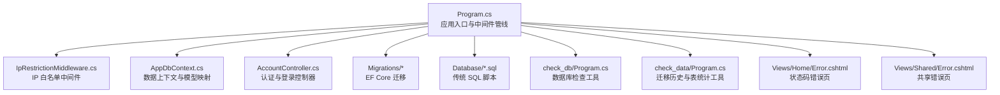
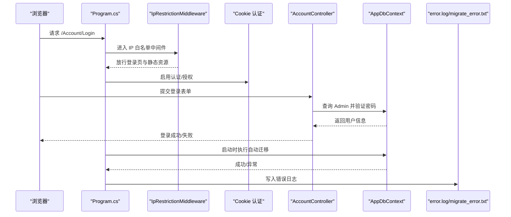
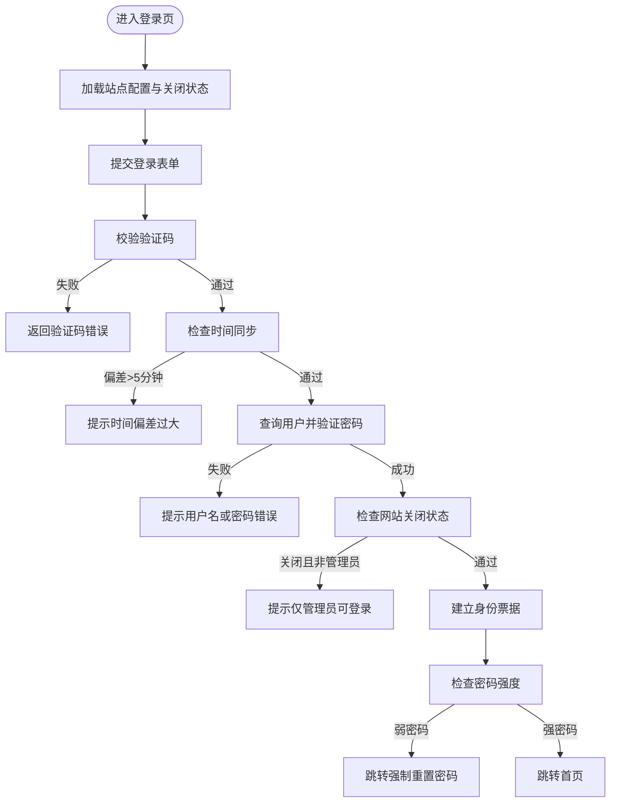
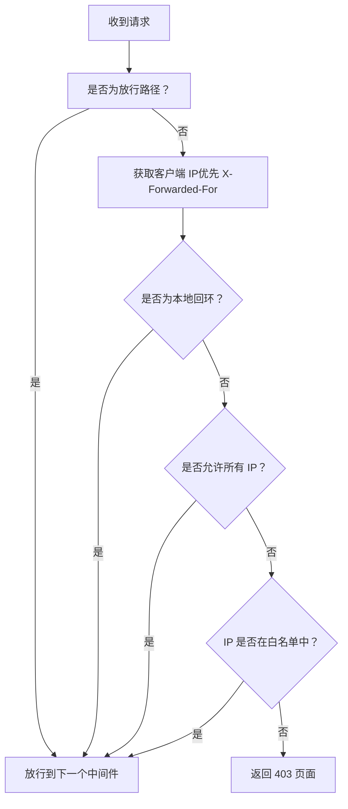
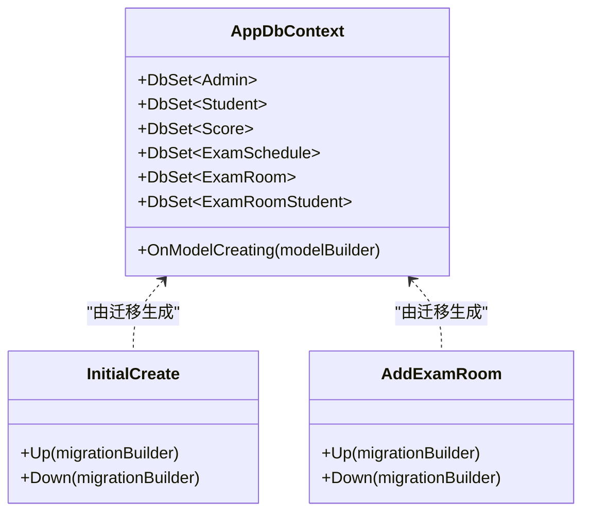
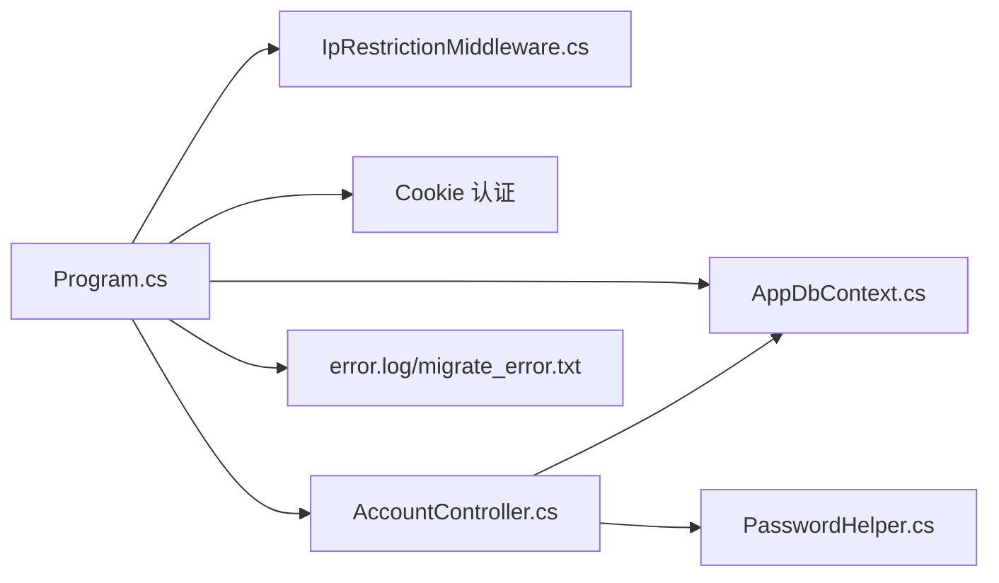

# 故障排除

<cite>
**本文引用的文件**
- [Program.cs](file://Program.cs)
- [appsettings.json](file://appsettings.json)
- [AppDbContext.cs](file://Data/AppDbContext.cs)
- [AccountController.cs](file://Controllers/AccountController.cs)
- [IpRestrictionMiddleware.cs](file://Middleware/IpRestrictionMiddleware.cs)
- [PasswordHelper.cs](file://Services/PasswordHelper.cs)
- [20260609075559_InitialCreate.cs](file://Migrations/20260609075559_InitialCreate.cs)
- [20260610054012_AddExamRoom.cs](file://Migrations/20260610054012_AddExamRoom.cs)
- [Error.cshtml（首页）](file://Views/Home/Error.cshtml)
- [Error.cshtml（共享）](file://Views/Shared/Error.cshtml)
- [check_db/Program.cs](file://check_db/Program.cs)
- [check_data/Program.cs](file://check_data/Program.cs)
- [Create_Announcement_Tables.sql](file://Database/Create_Announcement_Tables.sql)
- [Add_GradeManagement_Tables.sql](file://Database/Add_GradeManagement_Tables.sql)
</cite>

## 目录
1. [简介](#简介)
2. [项目结构](#项目结构)
3. [核心组件](#核心组件)
4. [架构总览](#架构总览)
5. [详细组件分析](#详细组件分析)
6. [依赖关系分析](#依赖关系分析)
7. [性能考虑](#性能考虑)
8. [故障排除指南](#故障排除指南)
9. [结论](#结论)
10. [附录](#附录)

## 简介
本指南面向系统管理员与开发者，聚焦于启动失败、数据库迁移失败、性能问题、用户反馈常见问题（登录失败、数据导入错误、权限不足）、日志分析方法、系统监控指标解读以及紧急情况下的应急处理与数据恢复策略。文档基于实际代码与配置文件进行梳理，提供可操作的排查步骤与可视化图示。

## 项目结构
该系统采用 ASP.NET Core MVC 架构，核心由以下部分组成：
- 应用入口与管线：Program.cs 定义服务注册、中间件顺序、自动迁移与全局异常处理。
- 数据上下文与模型映射：AppDbContext.cs 定义实体集合与复杂关系映射。
- 控制器与视图：AccountController.cs 提供登录、登出、密码修改等业务逻辑；相关视图用于展示错误页面。
- 中间件：IpRestrictionMiddleware 实现基于 IP 白名单的访问控制。
- 配置：appsettings.json 提供连接字符串、日志级别与 IP 白名单配置。
- 迁移与数据库脚本：Migrations 目录包含 EF Core 迁移；Database 目录包含传统 SQL 脚本。
- 辅助诊断工具：check_db、check_data 等独立控制台程序用于快速验证数据库状态。

图表来源
- [Program.cs:1-123](file://Program.cs#L1-L123)
- [IpRestrictionMiddleware.cs:1-98](file://Middleware/IpRestrictionMiddleware.cs#L1-L98)
- [AppDbContext.cs:1-295](file://Data/AppDbContext.cs#L1-L295)
- [AccountController.cs:1-261](file://Controllers/AccountController.cs#L1-L261)
- [check_db/Program.cs:1-35](file://check_db/Program.cs#L1-L35)
- [check_data/Program.cs:1-27](file://check_data/Program.cs#L1-L27)
- [Error.cshtml（首页）:1-31](file://Views/Home/Error.cshtml#L1-L31)
- [Error.cshtml（共享）:1-38](file://Views/Shared/Error.cshtml#L1-L38)

章节来源
- [Program.cs:1-123](file://Program.cs#L1-L123)
- [appsettings.json:1-16](file://appsettings.json#L1-L16)

## 核心组件
- 应用入口与中间件管线
  - 注册 MVC、AntiForgery、Entity Framework、Cookie 认证、会话缓存与会话。
  - 全局异常捕获并写入 error.log；状态码错误通过 /Home/Error 重执行。
  - 自动迁移在启动阶段执行，失败时写入 migrate_error.txt。
- 数据上下文与模型映射
  - 定义 Admin、Student、Score、ExamSchedule、ExamRoom、GradeLevel、ClassInfo 等实体集合。
  - 建立多表关联与唯一索引，确保数据一致性。
- 认证与登录
  - 登录前校验验证码与时间同步（偏差超过 5 分钟拒绝登录）。
  - 密码验证兼容旧版明文与新版 Identity 哈希。
- IP 白名单中间件
  - 支持多 IP 配置与反向代理 X-Forwarded-For 解析；放行静态资源与登录页。
- 配置
  - 连接字符串指向本地 MySQL；日志级别默认 Information；IP 白名单默认放行。

章节来源
- [Program.cs:18-41](file://Program.cs#L18-L41)
- [Program.cs:49-81](file://Program.cs#L49-L81)
- [Program.cs:107-121](file://Program.cs#L107-L121)
- [AppDbContext.cs:10-29](file://Data/AppDbContext.cs#L10-L29)
- [AppDbContext.cs:30-293](file://Data/AppDbContext.cs#L30-L293)
- [AccountController.cs:50-125](file://Controllers/AccountController.cs#L50-L125)
- [IpRestrictionMiddleware.cs:16-32](file://Middleware/IpRestrictionMiddleware.cs#L16-L32)
- [appsettings.json:12-14](file://appsettings.json#L12-L14)

## 架构总览
系统启动流程与关键交互如下：

图表来源
- [Program.cs:49-81](file://Program.cs#L49-L81)
- [Program.cs:107-121](file://Program.cs#L107-L121)
- [IpRestrictionMiddleware.cs:34-96](file://Middleware/IpRestrictionMiddleware.cs#L34-L96)
- [AccountController.cs:50-125](file://Controllers/AccountController.cs#L50-L125)
- [AppDbContext.cs:1-295](file://Data/AppDbContext.cs#L1-L295)

## 详细组件分析

### 组件 A：登录与认证流程
- 关键点
  - 登录页加载时预取站点配置与“网站关闭”状态。
  - 登录提交时进行验证码校验、时间同步校验、用户存在性与密码验证。
  - 密码验证支持旧版明文与新版 Identity 哈希，兼容过渡期。
  - 非管理员且弱密码时强制跳转到重置密码页。
- 常见问题定位
  - 验证码错误：检查会话与验证码生成/校验逻辑。
  - 时间偏差过大：检查服务器时间与互联网时间同步。
  - 用户名或密码错误：确认数据库中 Admin 密码字段存储格式。
  - 网站关闭仅管理员可登录：检查 SiteConfig 中的关闭标志。

图表来源
- [AccountController.cs:28-125](file://Controllers/AccountController.cs#L28-L125)
- [PasswordHelper.cs:18-34](file://Services/PasswordHelper.cs#L18-L34)

章节来源
- [AccountController.cs:28-125](file://Controllers/AccountController.cs#L28-L125)
- [PasswordHelper.cs:18-34](file://Services/PasswordHelper.cs#L18-L34)

### 组件 B：IP 白名单中间件
- 关键点
  - 支持通配符“*”放行或显式 IP 列表；反向代理场景解析 X-Forwarded-For。
  - 特例放行登录页与静态资源路径。
  - 本地回环地址始终放行，便于本机调试。
- 常见问题定位
  - 403 访问被拒绝：核对 appsettings.json 中的 AllowedIPs 配置。
  - 反向代理导致 IP 错误：确认前端代理正确设置 X-Forwarded-For。
  - 登录页无法访问：确认放行路径逻辑未被自定义路由覆盖。

图表来源
- [IpRestrictionMiddleware.cs:34-96](file://Middleware/IpRestrictionMiddleware.cs#L34-L96)
- [appsettings.json:9-11](file://appsettings.json#L9-L11)

章节来源
- [IpRestrictionMiddleware.cs:16-32](file://Middleware/IpRestrictionMiddleware.cs#L16-L32)
- [appsettings.json:9-11](file://appsettings.json#L9-L11)

### 组件 C：数据库迁移与模型映射
- 关键点
  - 启动时自动执行 EF Core 迁移；失败写入 migrate_error.txt。
  - 迁移文件定义了初始表结构与后续扩展（如 ExamRoom、ExamRoomStudent）。
  - AppDbContext 映射多个实体与外键约束，保证数据完整性。
- 常见问题定位
  - 迁移失败：查看 migrate_error.txt，结合具体迁移文件定位 SQL 错误。
  - 版本冲突：检查 __EFMigrationsHistory 表与目标数据库版本。
  - 数据不一致：使用 check_data 工具核对表计数与迁移历史。

图表来源
- [AppDbContext.cs:10-29](file://Data/AppDbContext.cs#L10-L29)
- [AppDbContext.cs:30-293](file://Data/AppDbContext.cs#L30-L293)
- [20260609075559_InitialCreate.cs:13-508](file://Migrations/20260609075559_InitialCreate.cs#L13-L508)
- [20260610054012_AddExamRoom.cs:13-85](file://Migrations/20260610054012_AddExamRoom.cs#L13-L85)

章节来源
- [Program.cs:107-121](file://Program.cs#L107-L121)
- [20260609075559_InitialCreate.cs:13-508](file://Migrations/20260609075559_InitialCreate.cs#L13-L508)
- [20260610054012_AddExamRoom.cs:13-85](file://Migrations/20260610054012_AddExamRoom.cs#L13-L85)
- [check_data/Program.cs:8-26](file://check_data/Program.cs#L8-L26)

## 依赖关系分析
- 组件耦合
  - Program.cs 作为入口，依赖中间件、认证、EF Core 与控制器。
  - AccountController 依赖 AppDbContext 与 PasswordHelper。
  - IpRestrictionMiddleware 依赖配置中心。
- 外部依赖
  - MySQL 连接字符串来自 appsettings.json。
  - 日志写入 error.log 与 migrate_error.txt。

图表来源
- [Program.cs:18-41](file://Program.cs#L18-L41)
- [AccountController.cs:17-26](file://Controllers/AccountController.cs#L17-L26)
- [PasswordHelper.cs:8-41](file://Services/PasswordHelper.cs#L8-L41)
- [IpRestrictionMiddleware.cs:16-32](file://Middleware/IpRestrictionMiddleware.cs#L16-L32)

章节来源
- [Program.cs:18-41](file://Program.cs#L18-L41)
- [AccountController.cs:17-26](file://Controllers/AccountController.cs#L17-L26)
- [PasswordHelper.cs:8-41](file://Services/PasswordHelper.cs#L8-L41)

## 性能考虑
- 启动阶段
  - 自动迁移可能在生产库上造成短暂锁表或性能抖动，建议在维护窗口执行。
  - 全局异常捕获与错误页渲染应避免在高频错误场景下产生大量磁盘 IO。
- 认证与登录
  - 密码验证使用 Identity 哈希，成本较高；建议启用缓存与合理的会话超时。
  - 时间同步 API 请求超时阈值较短，避免阻塞登录流程。
- 数据访问
  - 复杂查询建议添加必要索引；关注迁移文件中的索引定义。
  - 大批量数据导入前清理或拆分事务，降低锁竞争。

[本节为通用指导，无需列出章节来源]

## 故障排除指南

### 一、系统启动失败排查
- 数据库连接错误
  - 检查连接字符串是否正确（主机、数据库、账号、密码）。
  - 使用独立连接程序验证数据库可达性与权限。
  - 观察启动日志 migrate_error.txt，定位迁移阶段的具体错误。
- 配置文件错误
  - appsettings.json 中的连接字符串与日志级别需与部署环境一致。
  - IP 白名单配置若为“*”，将放行所有 IP；若为空或错误，可能导致 403。
- 权限问题
  - 确认运行账户对数据库具有读写权限。
  - 确认应用根目录对 error.log 与 migrate_error.txt 具备写入权限。

章节来源
- [appsettings.json:12-14](file://appsettings.json#L12-L14)
- [Program.cs:107-121](file://Program.cs#L107-L121)
- [check_db/Program.cs:2-4](file://check_db/Program.cs#L2-L4)

### 二、数据库迁移失败诊断
- 迁移脚本错误
  - 查看 migrate_error.txt 获取异常堆栈与消息。
  - 对照对应迁移文件（如 InitialCreate、AddExamRoom）逐条检查 SQL 语法与约束。
- 版本冲突
  - 使用 check_data 工具查看 __EFMigrationsHistory 表，确认目标版本与期望版本。
  - 若出现“重复迁移”或“缺失迁移”，按顺序执行或回滚到一致版本。
- 数据不一致
  - 使用 check_db 工具核对关键表（Student、Admin、Score 等）的数据量与基本字段。
  - 如发现表缺失或字段不一致，对照传统 SQL 脚本（如 Create_Announcement_Tables.sql、Add_GradeManagement_Tables.sql）逐步修复。

章节来源
- [Program.cs:107-121](file://Program.cs#L107-L121)
- [check_data/Program.cs:8-26](file://check_data/Program.cs#L8-L26)
- [check_db/Program.cs:8-34](file://check_db/Program.cs#L8-L34)
- [Create_Announcement_Tables.sql:1-31](file://Database/Create_Announcement_Tables.sql#L1-L31)
- [Add_GradeManagement_Tables.sql:1-20](file://Database/Add_GradeManagement_Tables.sql#L1-L20)

### 三、性能问题排查
- 内存泄漏
  - 关注长时间运行后的内存占用趋势；避免在请求生命周期外持有大对象。
  - 检查第三方组件（如密码哈希、HTTP 客户端）的资源释放。
- 数据库查询慢
  - 结合迁移文件中的索引定义，确认查询是否命中索引。
  - 使用数据库 EXPLAIN 分析慢查询计划，必要时补充索引或改写查询。
- 响应时间过长
  - 检查全局异常处理与错误页渲染是否频繁触发。
  - 关注登录流程中的时间同步 API 调用与会话初始化耗时。

章节来源
- [AccountController.cs:233-259](file://Controllers/AccountController.cs#L233-L259)
- [Program.cs:49-81](file://Program.cs#L49-L81)

### 四、用户反馈常见问题
- 登录失败
  - 验证码错误：检查会话与验证码生成/校验逻辑。
  - 时间偏差过大：检查服务器时间与互联网时间同步。
  - 用户名或密码错误：确认 Admin 密码字段存储格式（明文或哈希）。
  - 网站关闭仅管理员可登录：检查 SiteConfig 中的关闭标志。
- 数据导入错误
  - 核对导入数据字段与数据库表结构是否一致。
  - 使用 check_db 工具验证导入后数据完整性。
- 权限不足
  - 检查 IP 白名单配置与登录路径放行规则。
  - 确认用户角色与操作权限映射。

章节来源
- [AccountController.cs:50-125](file://Controllers/AccountController.cs#L50-L125)
- [IpRestrictionMiddleware.cs:34-96](file://Middleware/IpRestrictionMiddleware.cs#L34-L96)
- [PasswordHelper.cs:18-34](file://Services/PasswordHelper.cs#L18-L34)

### 五、日志分析方法与技巧
- error.log
  - 全局异常捕获会将异常追加写入 error.log，便于定位运行时错误。
  - 建议按日期轮转日志并限制大小，避免磁盘占满。
- migrate_error.txt
  - 启动迁移失败时写入，包含时间、错误消息与堆栈，是迁移问题的直接线索。
- 状态码错误页
  - 通过 /Home/Error 或共享错误页区分 404、403、401、500 等错误类型，辅助前端与后端协同定位。

章节来源
- [Program.cs:49-81](file://Program.cs#L49-L81)
- [Program.cs:116-120](file://Program.cs#L116-L120)
- [Error.cshtml（首页）:1-31](file://Views/Home/Error.cshtml#L1-L31)
- [Error.cshtml（共享）:1-38](file://Views/Shared/Error.cshtml#L1-L38)

### 六、系统监控指标解读
- 基础指标
  - 响应时间：观察关键接口（登录、查询、导入）的 P50/P95。
  - 错误率：统计 5xx/4xx 比例，关注 error.log 与状态码错误页。
  - 数据库连接数：监控并发与连接池使用率，避免连接耗尽。
- 安全指标
  - 异常登录尝试：结合 IP 白名单与登录失败日志，识别可疑行为。
  - 时间同步偏差：登录流程会检测时间偏差，持续异常需检查 NTP 设置。

[本节为通用指导，无需列出章节来源]

### 七、紧急情况应急处理与数据恢复
- 应急处理流程
  - 快速隔离：临时关闭网站或限制访问（调整 IP 白名单）。
  - 降级服务：暂停高风险操作（如自动迁移），改为手动迁移。
  - 通知与记录：记录事件时间、影响范围与处置过程。
- 数据恢复策略
  - 备份优先：定期导出数据库快照，保留多个版本。
  - 回滚迁移：根据 __EFMigrationsHistory 选择目标版本，必要时回滚到上一个稳定版本。
  - 修复脚本：使用传统 SQL 脚本（如 Create_Announcement_Tables.sql、Add_GradeManagement_Tables.sql）修复缺失表或字段。
  - 验证恢复：使用 check_db 与 check_data 工具核对数据完整性与迁移历史。

章节来源
- [check_data/Program.cs:8-26](file://check_data/Program.cs#L8-L26)
- [check_db/Program.cs:8-34](file://check_db/Program.cs#L8-L34)
- [Create_Announcement_Tables.sql:1-31](file://Database/Create_Announcement_Tables.sql#L1-L31)
- [Add_GradeManagement_Tables.sql:1-20](file://Database/Add_GradeManagement_Tables.sql#L1-L20)

## 结论
本指南围绕启动失败、迁移失败、性能问题与用户反馈常见问题，提供了基于代码与配置的实际排查路径，并辅以日志分析与应急恢复策略。建议在生产环境中配合自动化监控与备份演练，持续优化启动与迁移流程，提升系统稳定性与可维护性。

## 附录
- 快速检查清单
  - 连接字符串可用性与权限验证。
  - IP 白名单配置与反向代理设置。
  - 自动迁移是否成功，失败日志位置。
  - 关键表与索引是否存在与完整。
  - 登录流程各环节（验证码、时间同步、密码验证）是否正常。
  - 错误日志与状态码错误页是否准确反映问题。

[本节为通用指导，无需列出章节来源]