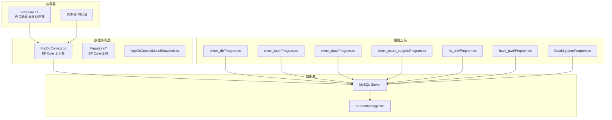
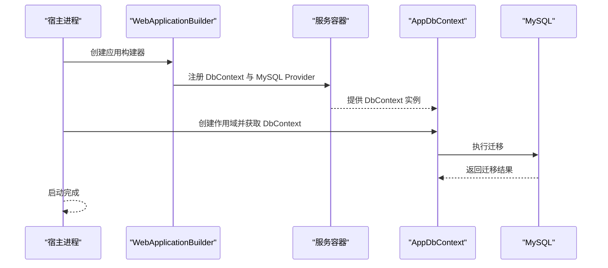
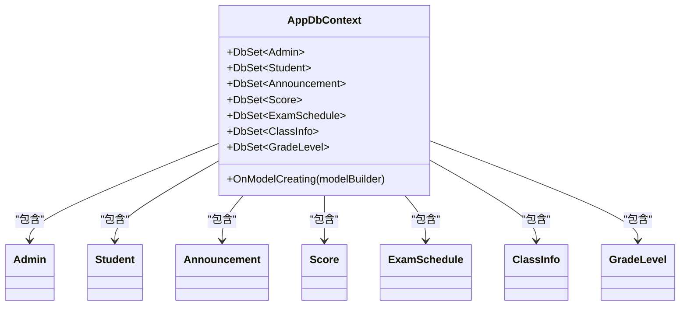
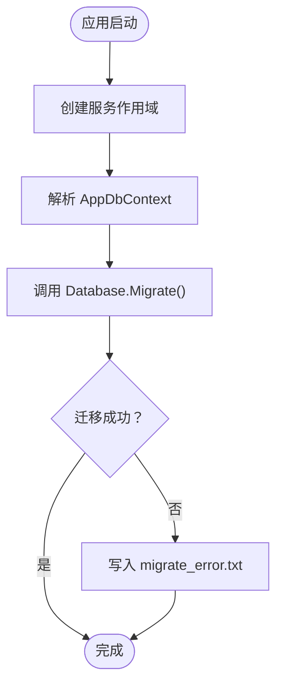
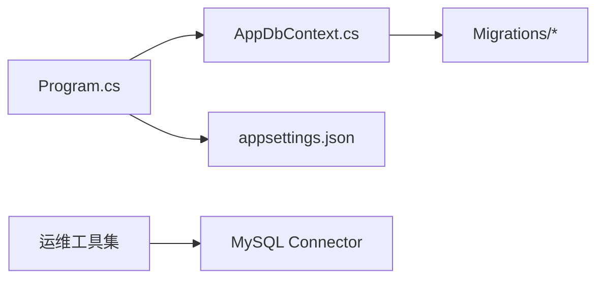
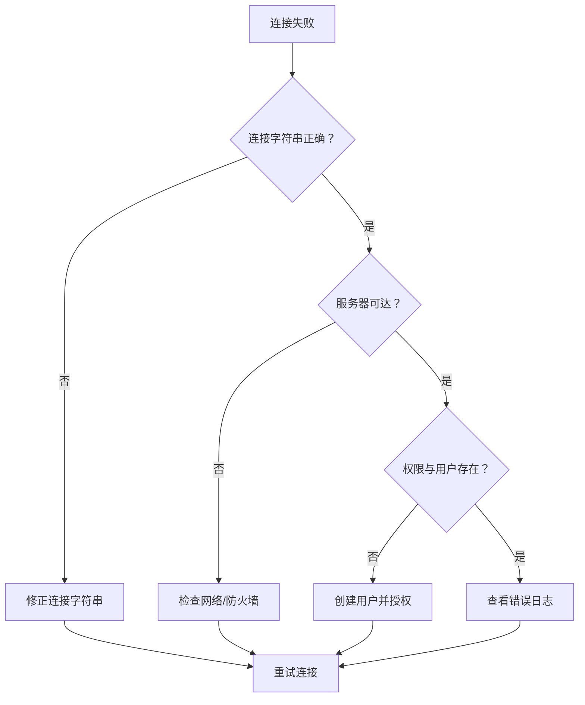
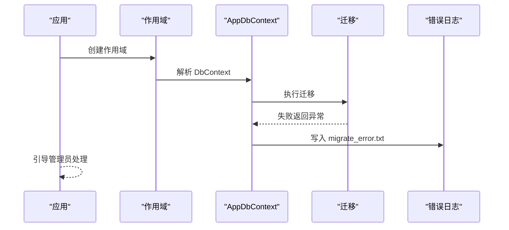

# 数据库问题

<cite>
**本文引用的文件**
- [Program.cs](file://Program.cs)
- [AppDbContext.cs](file://Data/AppDbContext.cs)
- [appsettings.json](file://appsettings.json)
- [check_db/Program.cs](file://check_db/Program.cs)
- [check_user/Program.cs](file://check_user/Program.cs)
- [check_data/Program.cs](file://check_data/Program.cs)
- [check_exam_subject/Program.cs](file://check_exam_subject/Program.cs)
- [fix_enc/Program.cs](file://fix_enc/Program.cs)
- [hash_pwd/Program.cs](file://hash_pwd/Program.cs)
- [DataMigrator/Program.cs](file://DataMigrator/Program.cs)
- [20260609075559_InitialCreate.cs](file://Migrations/20260609075559_InitialCreate.cs)
- [20260610054012_AddExamRoom.cs](file://Migrations/20260610054012_AddExamRoom.cs)
- [20260611001601_AddExamEndDate.cs](file://Migrations/20260611001601_AddExamEndDate.cs)
- [20260611075107_RefactorScoreModel.cs](file://Migrations/20260611075107_RefactorScoreModel.cs)
- [AppDbContextModelSnapshot.cs](file://Migrations/AppDbContextModelSnapshot.cs)
- [Add_GradeManagement_Tables.sql](file://Database/Add_GradeManagement_Tables.sql)
- [Create_Announcement_Tables.sql](file://Database/Create_Announcement_Tables.sql)
- [Add_Teacher_Fields.sql](file://Database/Add_Teacher_Fields.sql)
- [Add_Permissions_Field.sql](file://Database/Add_Permissions_Field.sql)
- [Update_Permission_Keys.sql](file://Database/Update_Permission_Keys.sql)
- [Update_Student_Fields.sql](file://Database/Update_Student_Fields.sql)
- [Add_EndStage_Column.sql](file://Database/Add_EndStage_Column.sql)
- [create_new_tables.sql](file://create_new_tables.sql)
- [exam_schedule_migration.sql](file://exam_schedule_migration.sql)
</cite>

## 目录
1. [简介](#简介)
2. [项目结构](#项目结构)
3. [核心组件](#核心组件)
4. [架构总览](#架构总览)
5. [详细组件分析](#详细组件分析)
6. [依赖关系分析](#依赖关系分析)
7. [性能考虑](#性能考虑)
8. [故障排除指南](#故障排除指南)
9. [结论](#结论)
10. [附录](#附录)

## 简介
本指南聚焦于该学生管理系统的数据库相关问题与排障实践，覆盖以下主题：
- 数据库连接失败的诊断与修复：连接字符串、服务器可达性、防火墙与权限等
- Entity Framework Core 迁移失败的排查：迁移脚本、版本与数据一致性问题
- 数据库性能问题的分析与优化：慢查询、锁等待、索引缺失
- 数据完整性问题的诊断与修复：外键约束、数据类型不匹配、唯一性冲突
- 备份与恢复操作：数据导出、导入与版本回滚
- 数据库监控指标的解读：如何通过日志与工具识别潜在问题与性能瓶颈

## 项目结构
该系统采用 ASP.NET Core + Entity Framework Core + MySQL 的技术栈。数据库访问由 DbContext 统一管理，应用启动时自动执行 EF Core 迁移；同时提供多个独立的 C# 控制台工具用于数据检查、修复与迁移。

图表来源
- [Program.cs:107-120](file://Program.cs#L107-L120)
- [AppDbContext.cs:6-294](file://Data/AppDbContext.cs#L6-L294)

章节来源
- [Program.cs:107-120](file://Program.cs#L107-L120)
- [AppDbContext.cs:6-294](file://Data/AppDbContext.cs#L6-L294)

## 核心组件
- 应用启动与自动迁移：在应用启动阶段，使用作用域解析 DbContext，并调用迁移以确保数据库结构与模型一致。
- EF Core 上下文：集中定义实体映射、外键关系、索引与约束，保证数据一致性与查询效率。
- 连接字符串：通过配置文件提供默认连接串，使用 MySQL Provider 进行连接。
- 运维工具集：提供独立的控制台程序用于数据校验、修复与批量迁移执行。

章节来源
- [Program.cs:18-21](file://Program.cs#L18-L21)
- [Program.cs:107-120](file://Program.cs#L107-L120)
- [appsettings.json:12-14](file://appsettings.json#L12-L14)
- [AppDbContext.cs:30-292](file://Data/AppDbContext.cs#L30-L292)

## 架构总览
应用启动流程与数据库交互的关键路径如下：

图表来源
- [Program.cs:18-21](file://Program.cs#L18-L21)
- [Program.cs:107-120](file://Program.cs#L107-L120)

## 详细组件分析

### 数据库上下文与实体映射
- 映射范围：涵盖管理员、学生、公告、成绩、考试安排、班级、年级等多个实体。
- 关系设计：包含一对一、一对多、多对多关系，以及级联删除策略。
- 约束与索引：为关键字段建立唯一索引与组合索引，提升查询与写入性能。

图表来源
- [AppDbContext.cs:10-292](file://Data/AppDbContext.cs#L10-L292)

章节来源
- [AppDbContext.cs:30-292](file://Data/AppDbContext.cs#L30-L292)

### EF Core 迁移机制
- 迁移文件：包含初始创建与后续扩展（如新增房间、结束日期、分数模型重构等）。
- 模型快照：记录当前模型状态，用于判断是否需要生成新的迁移。
- 自动迁移：应用启动时自动执行迁移，失败会写入错误文件便于排查。

图表来源
- [Program.cs:107-120](file://Program.cs#L107-L120)

章节来源
- [Program.cs:107-120](file://Program.cs#L107-L120)
- [20260609075559_InitialCreate.cs:12-450](file://Migrations/20260609075559_InitialCreate.cs#L12-L450)
- [20260610054012_AddExamRoom.cs:1-200](file://Migrations/20260610054012_AddExamRoom.cs#L1-L200)
- [20260611001601_AddExamEndDate.cs:1-200](file://Migrations/20260611001601_AddExamEndDate.cs#L1-L200)
- [20260611075107_RefactorScoreModel.cs:1-200](file://Migrations/20260611075107_RefactorScoreModel.cs#L1-L200)
- [AppDbContextModelSnapshot.cs:1-200](file://Migrations/AppDbContextModelSnapshot.cs#L1-L200)

### 连接字符串与数据库配置
- 默认连接串位于配置文件中，使用 MySQL Provider 进行连接。
- 建议在不同环境（开发/测试/生产）分别维护连接串，避免硬编码。

章节来源
- [appsettings.json:12-14](file://appsettings.json#L12-L14)
- [Program.cs:18-21](file://Program.cs#L18-L21)

### 运维工具与数据校验
- 数据检查工具：提供针对学生、教师、公告、考试科目等的查询示例。
- 编码修复与密码哈希：用于修复历史数据编码与密码字段问题。
- 批量迁移执行器：支持事务批处理与逐行回退，增强迁移稳定性。

章节来源
- [check_db/Program.cs:1-35](file://check_db/Program.cs#L1-L35)
- [check_user/Program.cs:35-42](file://check_user/Program.cs#L35-L42)
- [check_data/Program.cs:1-200](file://check_data/Program.cs#L1-L200)
- [check_exam_subject/Program.cs:1-200](file://check_exam_subject/Program.cs#L1-L200)
- [fix_enc/Program.cs:1-200](file://fix_enc/Program.cs#L1-L200)
- [hash_pwd/Program.cs:1-200](file://hash_pwd/Program.cs#L1-L200)
- [DataMigrator/Program.cs:347-386](file://DataMigrator/Program.cs#L347-L386)

## 依赖关系分析
- 应用启动依赖 DbContext 注册与 MySQL Provider 配置。
- 迁移过程依赖数据库可连接性与权限。
- 运维工具直接依赖 MySQL Connector，独立于应用运行。

图表来源
- [Program.cs:18-21](file://Program.cs#L18-L21)
- [AppDbContext.cs:6-20](file://Data/AppDbContext.cs#L6-L20)

章节来源
- [Program.cs:18-21](file://Program.cs#L18-L21)
- [AppDbContext.cs:6-294](file://Data/AppDbContext.cs#L6-L294)

## 性能考虑
- 索引策略：根据实体映射中的唯一索引与组合索引，确保高频查询命中索引。
- 查询优化：避免 N+1 查询，优先使用 Include 或显式联接；分页查询减少一次性加载。
- 锁等待：批量写入使用事务批处理，降低锁竞争；长事务拆分为短事务。
- 监控建议：结合应用日志与数据库慢查询日志定位热点。

章节来源
- [AppDbContext.cs:193-224](file://Data/AppDbContext.cs#L193-L224)

## 故障排除指南

### 一、数据库连接失败
常见原因与排查步骤：
- 连接字符串错误
  - 检查主机名、端口、数据库名、用户名与密码是否正确
  - 确认字符集与时区设置与数据库一致
  - 参考默认连接串位置与格式
- 服务器不可达
  - 使用本地工具连接验证网络连通性
  - 检查 MySQL 服务状态与监听地址
- 防火墙与权限
  - 放通端口，确认用户具备远程访问权限
  - 使用最小权限原则创建专用账号

章节来源
- [appsettings.json:12-14](file://appsettings.json#L12-L14)
- [check_db/Program.cs:1-35](file://check_db/Program.cs#L1-L35)

### 二、EF Core 迁移失败
排查步骤：
- 检查迁移错误日志文件，定位具体异常
- 对比模型快照与当前模型，确认差异
- 分析迁移脚本中的约束与索引变更
- 若出现版本不匹配，先回滚到上一个稳定版本再逐步升级
- 数据不一致导致的失败：先修复数据，再执行迁移

图表来源
- [Program.cs:107-120](file://Program.cs#L107-L120)

章节来源
- [Program.cs:107-120](file://Program.cs#L107-L120)
- [AppDbContextModelSnapshot.cs:1-200](file://Migrations/AppDbContextModelSnapshot.cs#L1-L200)
- [20260609075559_InitialCreate.cs:12-450](file://Migrations/20260609075559_InitialCreate.cs#L12-L450)

### 三、数据库性能问题
- 慢查询
  - 使用 EXPLAIN 分析执行计划，确认索引使用情况
  - 为高频过滤与排序字段添加合适索引
- 锁等待
  - 减少长事务，拆分批量操作
  - 使用合适的隔离级别
- 索引缺失
  - 根据实体映射中的索引定义，补充缺失索引
  - 定期评估索引使用率，清理无效索引

章节来源
- [AppDbContext.cs:193-224](file://Data/AppDbContext.cs#L193-L224)

### 四、数据完整性问题
- 外键约束错误
  - 先补齐父表数据，再插入子表数据
  - 使用事务保证原子性
- 数据类型不匹配
  - 统一字段类型与精度（如 decimal）
  - 使用工具进行历史数据修复
- 唯一性冲突
  - 在插入前进行去重检查
  - 利用唯一索引捕获冲突并回滚

章节来源
- [AppDbContext.cs:108-111](file://Data/AppDbContext.cs#L108-L111)
- [AppDbContext.cs:193-194](file://Data/AppDbContext.cs#L193-L194)
- [AppDbContext.cs:223](file://Data/AppDbContext.cs#L223)

### 五、备份与恢复
- 备份
  - 使用数据库自带工具导出结构与数据
  - 结合 SQL 脚本与工具生成完整备份
- 恢复
  - 在目标环境重建数据库后，按顺序执行脚本
  - 对于 EF Core 迁移，先执行基础迁移，再逐步应用后续迁移
- 版本回滚
  - 通过迁移历史回退到指定版本
  - 如需快速回滚，可使用备份文件恢复

章节来源
- [create_new_tables.sql:1-200](file://create_new_tables.sql#L1-L200)
- [exam_schedule_migration.sql:1-200](file://exam_schedule_migration.sql#L1-L200)
- [Add_GradeManagement_Tables.sql:1-200](file://Database/Add_GradeManagement_Tables.sql#L1-L200)
- [Create_Announcement_Tables.sql:1-200](file://Database/Create_Announcement_Tables.sql#L1-L200)

### 六、监控指标与日志
- 应用日志
  - 全局异常处理会写入错误日志文件，便于定位运行时异常
- 数据库日志
  - 结合慢查询日志与错误日志，识别性能瓶颈与异常
- 运维工具
  - 使用独立工具定期巡检关键表与数据状态

章节来源
- [Program.cs:49-81](file://Program.cs#L49-L81)
- [check_db/Program.cs:1-35](file://check_db/Program.cs#L1-L35)
- [check_user/Program.cs:35-42](file://check_user/Program.cs#L35-L42)

## 结论
本指南提供了从连接、迁移、性能、完整性到备份恢复与监控的全链路排障方法。建议在生产环境中：
- 分环境管理连接串与权限
- 严格控制迁移与发布流程
- 建立完善的监控与日志体系
- 定期进行数据校验与备份演练

## 附录
- 常用 SQL 脚本与迁移脚本位于 Database 与 Migrations 目录，可用于增量更新与回滚
- 运维工具独立运行，适合在非生产时段执行数据修复与批量迁移

章节来源
- [Database/](file://Database/)
- [Migrations/](file://Migrations/)
- [check_data/Program.cs:1-200](file://check_data/Program.cs#L1-L200)
- [DataMigrator/Program.cs:347-386](file://DataMigrator/Program.cs#L347-L386)