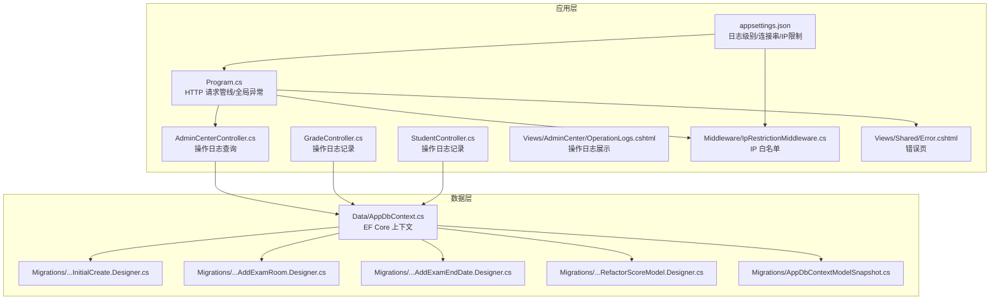
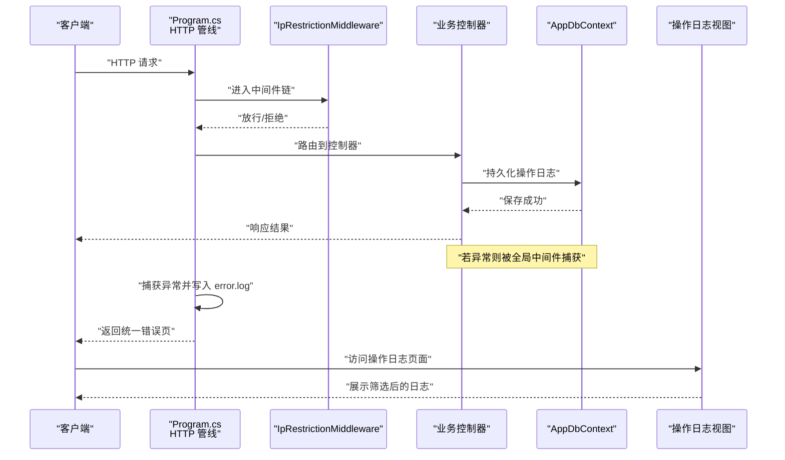
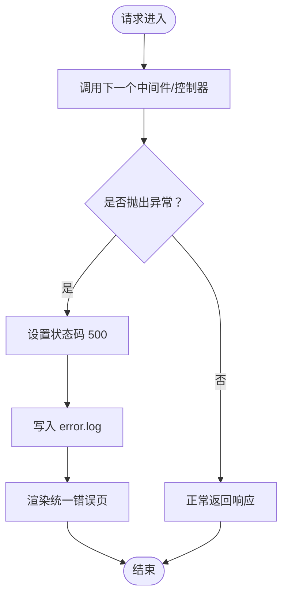
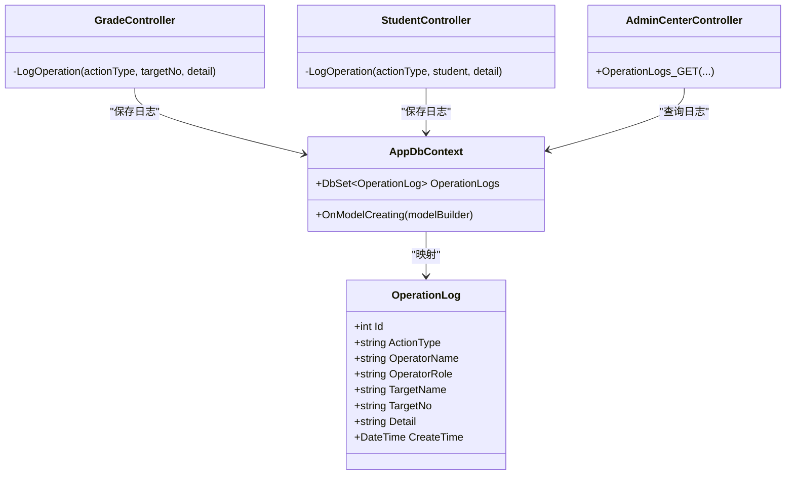
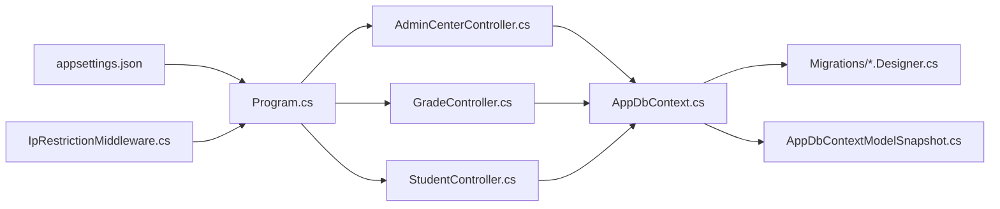

# 日志分析与调试

<cite>
**本文引用的文件**
- [Program.cs](file://Program.cs)
- [appsettings.json](file://appsettings.json)
- [IpRestrictionMiddleware.cs](file://Middleware/IpRestrictionMiddleware.cs)
- [AdminCenterController.cs](file://Controllers/AdminCenterController.cs)
- [GradeController.cs](file://Controllers/GradeController.cs)
- [StudentController.cs](file://Controllers/StudentController.cs)
- [OperationLogs.cshtml](file://Views/AdminCenter/OperationLogs.cshtml)
- [AppDbContext.cs](file://Data/AppDbContext.cs)
- [20260609_InitialCreate.Designer.cs](file://Migrations/20260609075559_InitialCreate.Designer.cs)
- [20260610_054012_AddExamRoom.Designer.cs](file://Migrations/20260610054012_AddExamRoom.Designer.cs)
- [20260611_001601_AddExamEndDate.Designer.cs](file://Migrations/20260611001601_AddExamEndDate.Designer.cs)
- [20260611_075107_RefactorScoreModel.Designer.cs](file://Migrations/20260611075107_RefactorScoreModel.Designer.cs)
- [AppDbContextModelSnapshot.cs](file://Migrations/AppDbContextModelSnapshot.cs)
- [Error.cshtml](file://Views/Shared/Error.cshtml)
</cite>

## 目录
1. [简介](#简介)
2. [项目结构](#项目结构)
3. [核心组件](#核心组件)
4. [架构总览](#架构总览)
5. [详细组件分析](#详细组件分析)
6. [依赖关系分析](#依赖关系分析)
7. [性能考量](#性能考量)
8. [故障排查指南](#故障排查指南)
9. [结论](#结论)
10. [附录](#附录)

## 简介
本指南面向开发者与运维人员，围绕学生管理系统的日志体系与调试技术展开，涵盖日志结构与分类、日志级别配置策略、关键事件解读、调试工具使用、远程调试方法以及日志分析最佳实践，并提供常见错误码与对应处置建议。文档中的所有技术细节均基于仓库内实际文件进行分析与总结。

## 项目结构
该系统采用 ASP.NET Core MVC 架构，日志相关能力主要分布在以下位置：
- 应用启动与全局异常：Program.cs
- 日志级别配置：appsettings.json
- 访问控制与安全：Middleware/IpRestrictionMiddleware.cs
- 操作审计日志：Controllers/*（如 GradeController、StudentController）与 Views/AdminCenter/OperationLogs.cshtml
- 数据模型与迁移：Data/AppDbContext.cs、Migrations/*.Designer.cs
- 错误页展示：Views/Shared/Error.cshtml

图表来源
- [Program.cs:45-81](file://Program.cs#L45-L81)
- [appsettings.json:1-15](file://appsettings.json#L1-L15)
- [IpRestrictionMiddleware.cs](file://Middleware/IpRestrictionMiddleware.cs)
- [AdminCenterController.cs:346-376](file://Controllers/AdminCenterController.cs#L346-L376)
- [GradeController.cs:384-400](file://Controllers/GradeController.cs#L384-L400)
- [StudentController.cs:978-996](file://Controllers/StudentController.cs#L978-L996)
- [OperationLogs.cshtml:130-152](file://Views/AdminCenter/OperationLogs.cshtml#L130-L152)
- [AppDbContext.cs:81-113](file://Data/AppDbContext.cs#L81-L113)
- [20260609_InitialCreate.Designer.cs:357-367](file://Migrations/20260609075559_InitialCreate.Designer.cs#L357-L367)
- [20260610_054012_AddExamRoom.Designer.cs:437-469](file://Migrations/20260610054012_AddExamRoom.Designer.cs#L437-L469)
- [20260611_001601_AddExamEndDate.Designer.cs:435-468](file://Migrations/20260611001601_AddExamEndDate.Designer.cs#L435-L468)
- [20260611_075107_RefactorScoreModel.Designer.cs:471-503](file://Migrations/20260611075107_RefactorScoreModel.Designer.cs#L471-L503)
- [AppDbContextModelSnapshot.cs:468-500](file://Migrations/AppDbContextModelSnapshot.cs#L468-L500)

章节来源
- [Program.cs:45-81](file://Program.cs#L45-L81)
- [appsettings.json:1-15](file://appsettings.json#L1-L15)

## 核心组件
- 全局异常与错误日志落盘：在 Program.cs 中通过中间件捕获未处理异常，返回用户友好的错误页，并将异常信息追加到应用根目录下的 error.log 文件，便于管理员排查。
- 日志级别配置：appsettings.json 的 Logging 节点定义了默认日志级别与第三方框架日志级别，用于控制日志输出量。
- 操作审计日志：多个控制器通过私有方法记录操作日志，字段包含操作者、角色、动作类型、目标对象标识与详情等；AdminCenterController 提供查询与统计功能；前端视图负责展示。
- 数据模型与迁移：AppDbContext 定义实体映射；各迁移文件定义了 OperationLog 表结构及索引等元数据。

章节来源
- [Program.cs:45-81](file://Program.cs#L45-L81)
- [appsettings.json:2-6](file://appsettings.json#L2-L6)
- [AdminCenterController.cs:346-376](file://Controllers/AdminCenterController.cs#L346-L376)
- [GradeController.cs:384-400](file://Controllers/GradeController.cs#L384-L400)
- [StudentController.cs:978-996](file://Controllers/StudentController.cs#L978-L996)
- [OperationLogs.cshtml:130-152](file://Views/AdminCenter/OperationLogs.cshtml#L130-L152)
- [AppDbContext.cs:81-113](file://Data/AppDbContext.cs#L81-L113)
- [20260609_InitialCreate.Designer.cs:357-367](file://Migrations/20260609075559_InitialCreate.Designer.cs#L357-L367)

## 架构总览
系统日志与调试涉及的关键流程如下：
- 请求进入 HTTP 管线，先经 IP 白名单中间件校验，再进入业务控制器处理。
- 控制器执行业务逻辑，必要时记录操作审计日志到数据库。
- 若发生未处理异常，全局中间件捕获并写入 error.log，同时向客户端返回统一错误页。
- 管理端可查询操作日志并按条件筛选统计。

图表来源
- [Program.cs:45-81](file://Program.cs#L45-L81)
- [IpRestrictionMiddleware.cs](file://Middleware/IpRestrictionMiddleware.cs)
- [AdminCenterController.cs:346-376](file://Controllers/AdminCenterController.cs#L346-L376)
- [AppDbContext.cs:81-113](file://Data/AppDbContext.cs#L81-L113)

## 详细组件分析

### 全局异常与错误日志落盘
- 异常捕获：在 Program.cs 的中间件中捕获所有未处理异常，设置状态码为 500 并返回统一错误页。
- 日志落盘：将异常信息以时间戳追加到应用根目录的 error.log 文件，便于离线分析。
- 用户体验：避免向客户端泄露堆栈细节，提升安全性与稳定性。

图表来源
- [Program.cs:45-81](file://Program.cs#L45-L81)

章节来源
- [Program.cs:45-81](file://Program.cs#L45-L81)

### 日志级别配置（开发 vs 生产）
- 默认级别：appsettings.json 将 Default 设置为 Information，确保运行期关键信息可见。
- 第三方框架：将 Microsoft.AspNetCore 设为 Warning，降低框架噪音，聚焦应用日志。
- 建议策略：
  - 开发环境：可将 Default 降至 Debug 或 Trace，配合本地日志聚合工具进行细粒度分析。
  - 生产环境：维持 Warning 或 Information，结合集中式日志平台（如 ELK、Seq、Application Insights）进行采集与告警。

章节来源
- [appsettings.json:2-6](file://appsettings.json#L2-L6)

### 操作审计日志（记录与展示）
- 记录位置：多个控制器通过私有方法记录操作日志，字段包含操作者名称、角色、动作类型、目标编号/名称、详情与创建时间。
- 查询与统计：AdminCenterController 支持按动作类型与关键词筛选、分页、统计总数与当日数量。
- 展示界面：OperationLogs.cshtml 列出日志项，包含目标名称/编号、详情与创建时间。

图表来源
- [GradeController.cs:384-400](file://Controllers/GradeController.cs#L384-L400)
- [StudentController.cs:978-996](file://Controllers/StudentController.cs#L978-L996)
- [AdminCenterController.cs:346-376](file://Controllers/AdminCenterController.cs#L346-L376)
- [AppDbContext.cs:81-113](file://Data/AppDbContext.cs#L81-L113)
- [20260609_InitialCreate.Designer.cs:357-367](file://Migrations/20260609075559_InitialCreate.Designer.cs#L357-L367)

章节来源
- [GradeController.cs:384-400](file://Controllers/GradeController.cs#L384-L400)
- [StudentController.cs:978-996](file://Controllers/StudentController.cs#L978-L996)
- [AdminCenterController.cs:346-376](file://Controllers/AdminCenterController.cs#L346-L376)
- [OperationLogs.cshtml:130-152](file://Views/AdminCenter/OperationLogs.cshtml#L130-L152)
- [AppDbContext.cs:81-113](file://Data/AppDbContext.cs#L81-L113)

### 数据库操作记录与迁移
- OperationLog 表结构：迁移文件定义了主键、动作类型、操作者、目标、详情与创建时间等列，满足审计需求。
- EF Core 映射：AppDbContext 对 OperationLog 进行实体映射，确保保存与查询一致。
- 版本演进：多版本迁移逐步完善表结构与索引，保证查询效率与扩展性。

章节来源
- [20260609_InitialCreate.Designer.cs:357-367](file://Migrations/20260609075559_InitialCreate.Designer.cs#L357-L367)
- [20260610_054012_AddExamRoom.Designer.cs:437-469](file://Migrations/20260610054012_AddExamRoom.Designer.cs#L437-L469)
- [20260611_001601_AddExamEndDate.Designer.cs:435-468](file://Migrations/20260611001601_AddExamEndDate.Designer.cs#L435-L468)
- [20260611_075107_RefactorScoreModel.Designer.cs:471-503](file://Migrations/20260611075107_RefactorScoreModel.Designer.cs#L471-L503)
- [AppDbContext.cs:81-113](file://Data/AppDbContext.cs#L81-L113)
- [AppDbContextModelSnapshot.cs:468-500](file://Migrations/AppDbContextModelSnapshot.cs#L468-L500)

### 错误页与状态码语义
- 错误页：Views/Shared/Error.cshtml 根据状态码渲染不同提示，如 500 内部错误、403 权限不足、400 请求错误、401 未登录等。
- 与全局异常中间件配合：当出现未处理异常时，会返回统一错误页，避免敏感信息泄露。

章节来源
- [Error.cshtml:1-37](file://Views/Shared/Error.cshtml#L1-L37)
- [Program.cs:45-81](file://Program.cs#L45-L81)

## 依赖关系分析
- 控制器依赖 AppDbContext 进行日志持久化。
- AdminCenterController 依赖数据库进行日志查询与统计。
- Program.cs 的全局异常中间件贯穿整个请求生命周期。
- appsettings.json 为日志级别与连接串提供配置入口。
- 迁移文件与模型快照共同维护 OperationLog 的结构一致性。

图表来源
- [appsettings.json:1-15](file://appsettings.json#L1-L15)
- [Program.cs:45-81](file://Program.cs#L45-L81)
- [IpRestrictionMiddleware.cs](file://Middleware/IpRestrictionMiddleware.cs)
- [AdminCenterController.cs:346-376](file://Controllers/AdminCenterController.cs#L346-L376)
- [GradeController.cs:384-400](file://Controllers/GradeController.cs#L384-L400)
- [StudentController.cs:978-996](file://Controllers/StudentController.cs#L978-L996)
- [AppDbContext.cs:81-113](file://Data/AppDbContext.cs#L81-L113)
- [20260609_InitialCreate.Designer.cs:357-367](file://Migrations/20260609075559_InitialCreate.Designer.cs#L357-L367)

章节来源
- [appsettings.json:1-15](file://appsettings.json#L1-L15)
- [Program.cs:45-81](file://Program.cs#L45-L81)
- [AppDbContext.cs:81-113](file://Data/AppDbContext.cs#L81-L113)

## 性能考量
- 日志级别：在高并发场景下，降低日志级别可减少 I/O 压力；生产环境建议使用 Warning 或 Information。
- 操作日志写入：批量或异步写入可降低对主业务路径的影响，但需权衡一致性与延迟。
- 查询优化：对 OperationLog 的常用查询字段建立索引，避免全表扫描。
- 中间件顺序：将 IP 白名单等前置中间件放在全局异常之前，尽早拒绝非法请求，减少后续开销。

## 故障排查指南
- 快速定位异常
  - 查看 error.log：定位异常时间、堆栈与上下文。
  - 结合浏览器网络面板与服务端日志，确认请求参数与响应状态。
- 审计追踪
  - 使用 AdminCenterController 的筛选与分页功能，按操作者、动作类型、关键词与日期范围缩小范围。
  - 关注高频失败动作与重复操作，识别潜在风险点。
- 数据一致性
  - 对比迁移文件与当前数据库结构，确保 OperationLog 字段完整。
  - 检查 AppDbContext 映射与模型快照是否一致。
- 安全与合规
  - 配置 appsettings.json 中的 AllowedIPs，结合 IpRestrictionMiddleware 实施访问控制。
  - 在生产环境避免输出详细堆栈，统一返回友好错误页。

章节来源
- [Program.cs:45-81](file://Program.cs#L45-L81)
- [AdminCenterController.cs:346-376](file://Controllers/AdminCenterController.cs#L346-L376)
- [appsettings.json:9-11](file://appsettings.json#L9-L11)
- [IpRestrictionMiddleware.cs](file://Middleware/IpRestrictionMiddleware.cs)

## 结论
本系统通过“全局异常中间件 + 操作审计日志 + 配置化日志级别”的组合，实现了从用户体验到问题定位的闭环。建议在开发阶段提高日志粒度，在生产阶段保持适度日志量并接入集中式日志平台，持续优化查询与写入性能，确保安全与合规。

## 附录

### 日志级别与分类说明
- 错误日志（Error）：严重错误导致功能不可用，需立即处理。
- 警告日志（Warning）：潜在问题或非致命异常，需要关注。
- 信息日志（Information）：常规运行信息，用于确认流程正常。
- 调试日志（Debug）：开发期用于定位问题的详细信息。
- 跟踪日志（Trace）：最细粒度的跟踪信息，通常仅在开发环境启用。

### 日志级别配置策略
- 开发环境：Default 设置为 Debug/Trace，第三方框架仍可设为 Warning。
- 测试/预生产：Default 为 Information，第三方框架 Warning。
- 生产环境：Default 为 Information，第三方框架 Warning；接入集中式日志平台进行分级存储与告警。

章节来源
- [appsettings.json:2-6](file://appsettings.json#L2-L6)

### 关键日志事件解读
- 请求处理流程：观察请求进入、中间件链、控制器执行与响应返回的时间线，定位耗时环节。
- 数据库操作记录：关注 OperationLog 的 ActionType 与 Target 字段，识别新增、修改、删除等动作。
- 异常堆栈信息：结合 error.log 的时间戳与异常类型，复现上下文并修复。

### 调试工具使用技巧
- Visual Studio 调试器：设置断点于控制器与仓储层，逐步执行，观察变量与调用栈。
- 日志聚合工具：将 error.log 与应用日志导入集中式平台，使用搜索与过滤快速定位。
- 性能分析器：在开发环境使用 CPU/内存分析工具，识别热点函数与内存泄漏。

### 远程调试方法与工具
- 远程日志查看：通过 SSH/SFTP 或日志收集代理访问 error.log 与应用日志。
- 远程断点设置：在支持的 IDE 中配置远程调试，连接生产服务器进行断点调试（需谨慎评估影响）。
- 远程性能监控：结合 APM 工具（如 Application Insights、New Relic）进行远程指标采集与告警。

### 日志分析最佳实践
- 建立标准化字段：统一 ActionType、TargetNo、Detail 等字段，便于检索与统计。
- 分级存储：将不同级别日志写入不同文件或索引，提高查询效率。
- 自动化告警：对高频错误与异常堆栈设置阈值告警，缩短故障发现时间。
- 定期巡检：定期审查操作日志，识别异常模式与潜在风险行为。

### 常见错误码与处置
- 500 内部错误：检查 error.log，定位异常并修复；确保错误页不泄露堆栈。
- 403 权限不足：核对用户角色与权限配置，调整访问控制策略。
- 400 请求错误：检查请求参数与模型绑定，修正客户端调用。
- 401 未登录：确认认证流程与会话状态，引导重新登录。

章节来源
- [Error.cshtml:1-37](file://Views/Shared/Error.cshtml#L1-L37)
- [Program.cs:45-81](file://Program.cs#L45-L81)