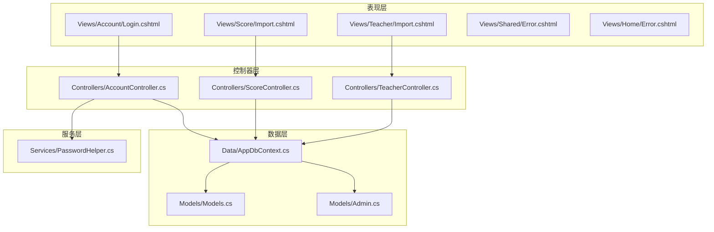
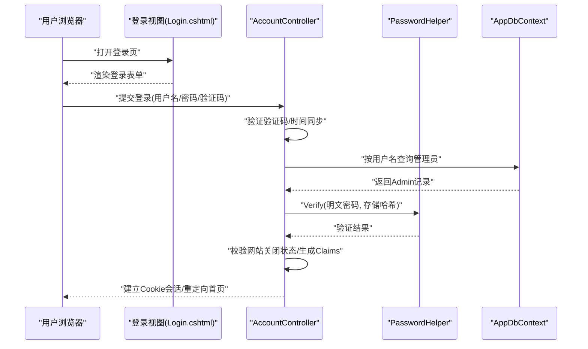
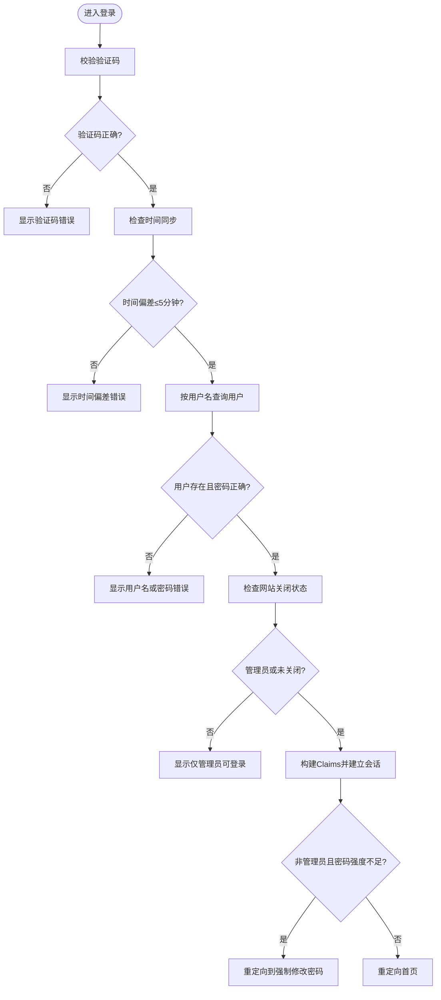
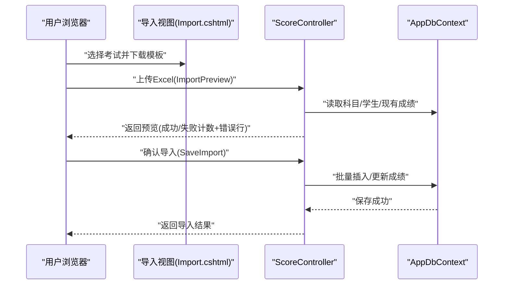
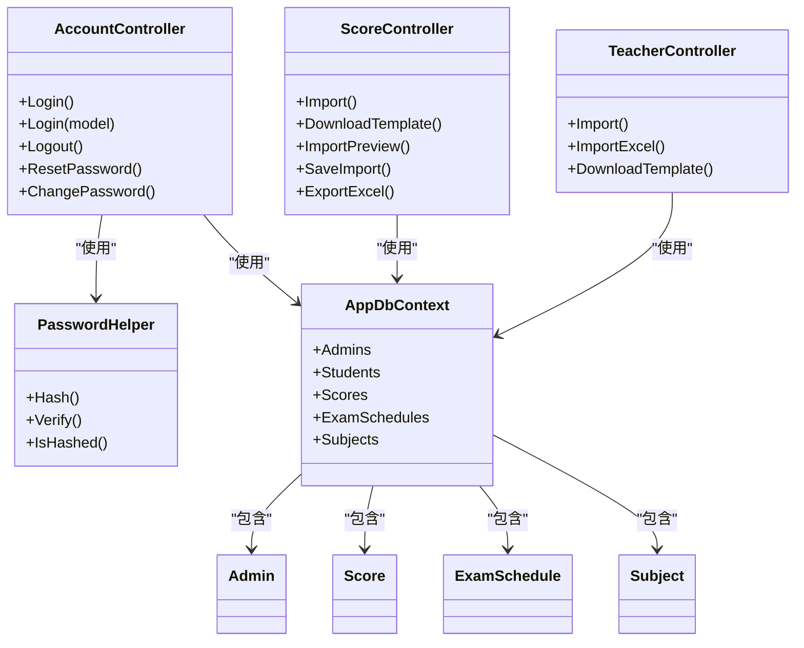

# 用户操作问题

<cite>
**本文引用的文件**
- [Controllers/AccountController.cs](file://Controllers/AccountController.cs)
- [Views/Account/Login.cshtml](file://Views/Account/Login.cshtml)
- [Services/PasswordHelper.cs](file://Services/PasswordHelper.cs)
- [Controllers/ScoreController.cs](file://Controllers/ScoreController.cs)
- [Views/Score/Import.cshtml](file://Views/Score/Import.cshtml)
- [Controllers/TeacherController.cs](file://Controllers/TeacherController.cs)
- [Views/Teacher/Import.cshtml](file://Views/Teacher/Import.cshtml)
- [Data/AppDbContext.cs](file://Data/AppDbContext.cs)
- [Models/Admin.cs](file://Models/Admin.cs)
- [Models/Models.cs](file://Models/Models.cs)
- [Views/Shared/Error.cshtml](file://Views/Shared/Error.cshtml)
- [Views/Home/Error.cshtml](file://Views/Home/Error.cshtml)
</cite>

## 目录
1. [简介](#简介)
2. [项目结构](#项目结构)
3. [核心组件](#核心组件)
4. [架构总览](#架构总览)
5. [详细组件分析](#详细组件分析)
6. [依赖关系分析](#依赖关系分析)
7. [性能考虑](#性能考虑)
8. [故障排除指南](#故障排除指南)
9. [结论](#结论)
10. [附录](#附录)

## 简介
本指南聚焦于“用户操作相关问题”的故障排除，涵盖以下方面：
- 用户登录失败的常见原因与解决方法（用户名/密码错误、账户状态、验证码、时间同步等）
- 数据导入/导出失败的诊断步骤（文件格式、编码、权限、数据校验等）
- 权限不足导致的功能限制（角色权限、菜单显示、按钮禁用）
- 数据验证错误的处理（必填字段、数据类型、业务规则）
- 批量操作失败的排查（数据量、超时、事务回滚）
- 用户体验问题的反馈与处理流程

## 项目结构
系统采用经典的三层架构（控制器-视图-模型/服务-数据上下文），围绕“用户认证”“成绩管理”“教师管理”“权限控制”等模块组织。

图表来源
- [Controllers/AccountController.cs:15-261](file://Controllers/AccountController.cs#L15-L261)
- [Controllers/ScoreController.cs:11-620](file://Controllers/ScoreController.cs#L11-L620)
- [Controllers/TeacherController.cs:12-501](file://Controllers/TeacherController.cs#L12-L501)
- [Services/PasswordHelper.cs:8-42](file://Services/PasswordHelper.cs#L8-L42)
- [Data/AppDbContext.cs:6-295](file://Data/AppDbContext.cs#L6-L295)
- [Models/Models.cs:6-463](file://Models/Models.cs#L6-L463)
- [Views/Account/Login.cshtml:1-463](file://Views/Account/Login.cshtml#L1-L463)
- [Views/Score/Import.cshtml:1-253](file://Views/Score/Import.cshtml#L1-L253)
- [Views/Teacher/Import.cshtml:1-36](file://Views/Teacher/Import.cshtml#L1-L36)

章节来源
- [Controllers/AccountController.cs:15-261](file://Controllers/AccountController.cs#L15-L261)
- [Controllers/ScoreController.cs:11-620](file://Controllers/ScoreController.cs#L11-L620)
- [Controllers/TeacherController.cs:12-501](file://Controllers/TeacherController.cs#L12-L501)
- [Services/PasswordHelper.cs:8-42](file://Services/PasswordHelper.cs#L8-L42)
- [Data/AppDbContext.cs:6-295](file://Data/AppDbContext.cs#L6-L295)
- [Models/Models.cs:6-463](file://Models/Models.cs#L6-L463)
- [Views/Account/Login.cshtml:1-463](file://Views/Account/Login.cshtml#L1-L463)
- [Views/Score/Import.cshtml:1-253](file://Views/Score/Import.cshtml#L1-L253)
- [Views/Teacher/Import.cshtml:1-36](file://Views/Teacher/Import.cshtml#L1-L36)

## 核心组件
- 认证与会话
  - 登录控制器负责登录、验证码校验、时间同步检测、Cookie会话建立、密码强度校验与强制修改流程。
  - 密码工具类提供PBKDF2哈希与兼容旧版明文的验证逻辑。
- 数据导入/导出
  - 成绩导入/预览/保存；导出Excel；教师CSV/Excel导入。
- 权限与角色
  - 基于角色的授权（如“管理员”）；部分页面/接口受[Authorize]保护；前端根据角色/权限控制菜单与按钮显示。
- 数据模型与数据库上下文
  - 定义Admin、Student、Score、ExamSchedule等实体及外键关系；约束与索引确保数据一致性。

章节来源
- [Controllers/AccountController.cs:50-125](file://Controllers/AccountController.cs#L50-L125)
- [Services/PasswordHelper.cs:12-34](file://Services/PasswordHelper.cs#L12-L34)
- [Controllers/ScoreController.cs:350-590](file://Controllers/ScoreController.cs#L350-L590)
- [Controllers/TeacherController.cs:288-474](file://Controllers/TeacherController.cs#L288-L474)
- [Data/AppDbContext.cs:30-295](file://Data/AppDbContext.cs#L30-L295)
- [Models/Models.cs:6-86](file://Models/Models.cs#L6-L86)

## 架构总览
用户操作问题的故障排除贯穿“表现层-控制器-服务-数据上下文”链路。登录失败可能由前端表单、控制器校验、服务层密码验证、数据库查询、会话建立等环节引发；导入失败可能由文件格式、解析逻辑、数据校验、数据库写入等环节导致；权限不足可能由角色/权限配置、授权中间件、前端渲染策略共同决定。

图表来源
- [Views/Account/Login.cshtml:408-446](file://Views/Account/Login.cshtml#L408-L446)
- [Controllers/AccountController.cs:50-125](file://Controllers/AccountController.cs#L50-L125)
- [Services/PasswordHelper.cs:18-34](file://Services/PasswordHelper.cs#L18-L34)
- [Data/AppDbContext.cs:10-11](file://Data/AppDbContext.cs#L10-L11)

## 详细组件分析

### 登录与会话组件分析
- 登录流程要点
  - 验证码校验、时间同步检测（与互联网时间差超过5分钟则拒绝登录）、网站关闭状态限制、密码强度校验与强制修改。
  - 会话持久化与过期时间（2小时）。
- 失败场景
  - 用户名/密码错误、验证码错误、时间偏差过大、网站关闭仅管理员可登录、非管理员弱密码强制修改。
- 建议排查路径
  - 检查验证码是否正确、网络时间是否准确、网站配置项是否开启关闭状态、用户角色与密码强度。

图表来源
- [Controllers/AccountController.cs:50-125](file://Controllers/AccountController.cs#L50-L125)
- [Views/Account/Login.cshtml:390-406](file://Views/Account/Login.cshtml#L390-L406)

章节来源
- [Controllers/AccountController.cs:50-125](file://Controllers/AccountController.cs#L50-L125)
- [Views/Account/Login.cshtml:390-406](file://Views/Account/Login.cshtml#L390-L406)
- [Services/PasswordHelper.cs:18-34](file://Services/PasswordHelper.cs#L18-L34)

### 数据导入/导出组件分析
- 成绩导入
  - 下载模板、上传Excel、预览（逐行校验学号/姓名、科目分数范围、重复行/空行跳过）、确认导入后批量保存。
  - 支持Excel列顺序严格匹配模板，分数范围校验基于科目满分。
- 教师导入
  - CSV导入（仅用户名、密码、姓名、手机号、年级、班级、职务等必要字段）；Excel导入（支持多列解析与日期转换）。
- 导出
  - 按考试安排导出Excel，包含排名、学号、姓名、各科分数与总分。

图表来源
- [Views/Score/Import.cshtml:104-139](file://Views/Score/Import.cshtml#L104-L139)
- [Controllers/ScoreController.cs:421-590](file://Controllers/ScoreController.cs#L421-L590)
- [Data/AppDbContext.cs:204-224](file://Data/AppDbContext.cs#L204-L224)

章节来源
- [Controllers/ScoreController.cs:350-590](file://Controllers/ScoreController.cs#L350-L590)
- [Views/Score/Import.cshtml:1-253](file://Views/Score/Import.cshtml#L1-L253)
- [Controllers/TeacherController.cs:288-474](file://Controllers/TeacherController.cs#L288-L474)
- [Views/Teacher/Import.cshtml:1-36](file://Views/Teacher/Import.cshtml#L1-L36)
- [Data/AppDbContext.cs:204-224](file://Data/AppDbContext.cs#L204-L224)

### 权限与角色组件分析
- 角色授权
  - 控制器/动作上标注[Authorize]或[Authorize(Roles="...")]，限制访问。
  - 教师管理仅管理员可访问。
- 前端控制
  - 角色/权限字符串用于前端菜单与按钮的显示/禁用控制（例如“edit_student”等）。
- 建议排查路径
  - 确认用户角色是否正确、权限字符串是否包含所需功能、前端脚本是否正确读取并应用权限。

章节来源
- [Controllers/TeacherController.cs:12-20](file://Controllers/TeacherController.cs#L12-L20)
- [Models/Models.cs:46-86](file://Models/Models.cs#L46-L86)

## 依赖关系分析
- 控制器依赖
  - AccountController依赖PasswordHelper与AppDbContext；ScoreController/TeacherController依赖AppDbContext与ClosedXML。
- 数据模型依赖
  - Score/ExamSchedule/Subject等实体间存在外键与唯一索引，保证数据一致性。
- 前端依赖
  - 导入页面通过AJAX调用控制器接口，依赖AntiForgeryToken与文件上传。

图表来源
- [Controllers/AccountController.cs:15-261](file://Controllers/AccountController.cs#L15-L261)
- [Controllers/ScoreController.cs:11-620](file://Controllers/ScoreController.cs#L11-L620)
- [Controllers/TeacherController.cs:12-501](file://Controllers/TeacherController.cs#L12-L501)
- [Services/PasswordHelper.cs:8-42](file://Services/PasswordHelper.cs#L8-L42)
- [Data/AppDbContext.cs:6-295](file://Data/AppDbContext.cs#L6-L295)
- [Models/Models.cs:6-463](file://Models/Models.cs#L6-L463)

章节来源
- [Controllers/AccountController.cs:15-261](file://Controllers/AccountController.cs#L15-L261)
- [Controllers/ScoreController.cs:11-620](file://Controllers/ScoreController.cs#L11-L620)
- [Controllers/TeacherController.cs:12-501](file://Controllers/TeacherController.cs#L12-L501)
- [Services/PasswordHelper.cs:8-42](file://Services/PasswordHelper.cs#L8-L42)
- [Data/AppDbContext.cs:6-295](file://Data/AppDbContext.cs#L6-L295)
- [Models/Models.cs:6-463](file://Models/Models.cs#L6-L463)

## 性能考虑
- 批量导入
  - 使用批量加载学生与现有成绩字典，减少多次数据库往返；建议控制单次导入行数，避免内存峰值过高。
- 查询优化
  - 使用Include/ThenInclude精准加载关联数据；对高频查询建立索引（如唯一索引组合）。
- 会话与超时
  - Cookie会话过期时间2小时，建议结合前端心跳与服务端会话策略避免长时间无操作导致的意外登出。

## 故障排除指南

### 一、用户登录失败
常见原因与解决方法
- 用户名或密码错误
  - 确认大小写、特殊字符；检查是否为旧版明文密码（系统兼容）；若非管理员且密码强度不足，将被强制修改。
- 验证码错误
  - 刷新验证码图片，确认输入正确；检查浏览器JavaScript是否启用。
- 时间同步错误
  - 服务器与互联网时间偏差超过5分钟将阻止登录；建议同步系统时间或NTP服务。
- 网站关闭状态
  - 网站关闭仅管理员可登录；普通用户将收到明确提示。
- 会话过期
  - 会话有效期2小时；若长时间无操作，需重新登录。

诊断步骤
- 在登录页查看错误提示与时间同步警告。
- 检查验证码刷新与输入是否正确。
- 使用开发者工具查看网络请求与响应。
- 确认用户角色与密码强度是否满足系统要求。

章节来源
- [Controllers/AccountController.cs:50-125](file://Controllers/AccountController.cs#L50-L125)
- [Views/Account/Login.cshtml:390-406](file://Views/Account/Login.cshtml#L390-L406)
- [Services/PasswordHelper.cs:18-34](file://Services/PasswordHelper.cs#L18-L34)

### 二、数据导入/导出失败
常见原因与解决方法
- 文件格式错误
  - 成绩导入仅支持Excel；教师导入支持CSV与Excel；确保扩展名正确且内容为有效文件。
- 编码问题
  - CSV导入使用系统默认编码；建议使用UTF-8无BOM编码并确保Excel另存为兼容格式。
- 权限不足
  - 导入功能需要相应角色权限；检查用户角色与权限字符串。
- 数据验证错误
  - 学号/姓名不匹配导致找不到学生；分数超出科目满分或格式错误；空行/缺失字段将被跳过或标记错误。
- 导出失败
  - 检查是否有数据、考试安排是否存在、浏览器是否阻止下载。

诊断步骤
- 成功下载模板并对照表头与注释。
- 预览阶段关注“成功/失败计数”，逐条核对错误行。
- 确认科目与年级覆盖范围是否匹配。
- 对于Excel导入，检查日期格式与单元格类型。

章节来源
- [Controllers/ScoreController.cs:421-590](file://Controllers/ScoreController.cs#L421-L590)
- [Views/Score/Import.cshtml:104-139](file://Views/Score/Import.cshtml#L104-L139)
- [Controllers/TeacherController.cs:288-474](file://Controllers/TeacherController.cs#L288-L474)
- [Views/Teacher/Import.cshtml:11-32](file://Views/Teacher/Import.cshtml#L11-L32)

### 三、权限不足导致的功能限制
常见现象
- 菜单不显示或按钮禁用
  - 前端根据角色/权限字符串控制UI元素；管理员可见所有功能。
- 访问被拒绝
  - 直接访问受保护页面或动作时返回403错误页。

排查方法
- 确认用户角色与权限字符串是否正确配置。
- 检查控制器上的[Authorize]与[Authorize(Roles="...")]标注。
- 前端脚本是否正确读取并应用权限；必要时清除缓存后重试。

章节来源
- [Controllers/TeacherController.cs:12-20](file://Controllers/TeacherController.cs#L12-L20)
- [Models/Models.cs:46-86](file://Models/Models.cs#L46-L86)
- [Views/Shared/Error.cshtml:14-18](file://Views/Shared/Error.cshtml#L14-L18)
- [Views/Home/Error.cshtml:7-18](file://Views/Home/Error.cshtml#L7-L18)

### 四、数据验证错误
常见类型与处理
- 必填字段缺失
  - 登录表单、教师导入等均要求关键字段；前端与后端双重验证。
- 数据类型不匹配
  - 分数必须为数值且在科目满分范围内；Excel日期解析失败将导致字段为空。
- 业务规则违反
  - 同一考试安排下同一学生同一科目唯一；重复导入将被跳过或合并。

修正方法
- 按模板填写字段，确保数据类型与范围正确。
- 对于Excel日期，使用标准日期格式或文本格式后手动转换。
- 遵循唯一性约束，避免重复提交。

章节来源
- [Controllers/ScoreController.cs:450-520](file://Controllers/ScoreController.cs#L450-L520)
- [Controllers/TeacherController.cs:88-135](file://Controllers/TeacherController.cs#L88-L135)
- [Data/AppDbContext.cs:223-224](file://Data/AppDbContext.cs#L223-L224)

### 五、批量操作失败
常见原因与解决方法
- 数据量过大
  - 单次导入行数过多可能导致内存压力；建议拆分为多个批次。
- 超时设置
  - 导入/保存过程耗时较长；检查服务器超时配置与网络稳定性。
- 事务回滚
  - 数据库保存失败会回滚；检查唯一性约束与外键关系。

排查方法
- 分批导入，观察每批的成功/失败计数。
- 检查服务器日志与数据库连接状态。
- 确保Excel模板与实际数据严格一致。

章节来源
- [Controllers/ScoreController.cs:523-590](file://Controllers/ScoreController.cs#L523-L590)
- [Controllers/TeacherController.cs:388-474](file://Controllers/TeacherController.cs#L388-L474)

### 六、用户体验问题反馈与处理流程
建议流程
- 收集用户反馈（登录失败、导入异常、权限受限、界面卡顿等）。
- 记录复现步骤、截图、浏览器版本与网络环境。
- 检查系统日志与数据库状态，定位问题根因。
- 发布修复补丁或临时规避方案，并通知用户。

[本节为通用指导，无需特定文件引用]

## 结论
通过梳理登录、导入导出、权限控制与批量操作等关键路径，可系统化地定位与解决用户操作问题。建议在生产环境中：
- 强化前端与后端双重校验；
- 优化大体量数据的分批处理；
- 明确角色与权限配置；
- 提升时间同步与网络稳定性保障。

## 附录
- 相关模型与实体
  - Admin、Student、Score、ExamSchedule、Subject等实体定义与约束。
- 常用接口参考
  - 登录/重置密码/登出、成绩导入预览/保存/导出、教师导入/模板下载。

章节来源
- [Models/Models.cs:6-463](file://Models/Models.cs#L6-L463)
- [Data/AppDbContext.cs:30-295](file://Data/AppDbContext.cs#L30-L295)