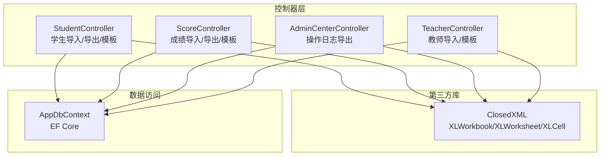
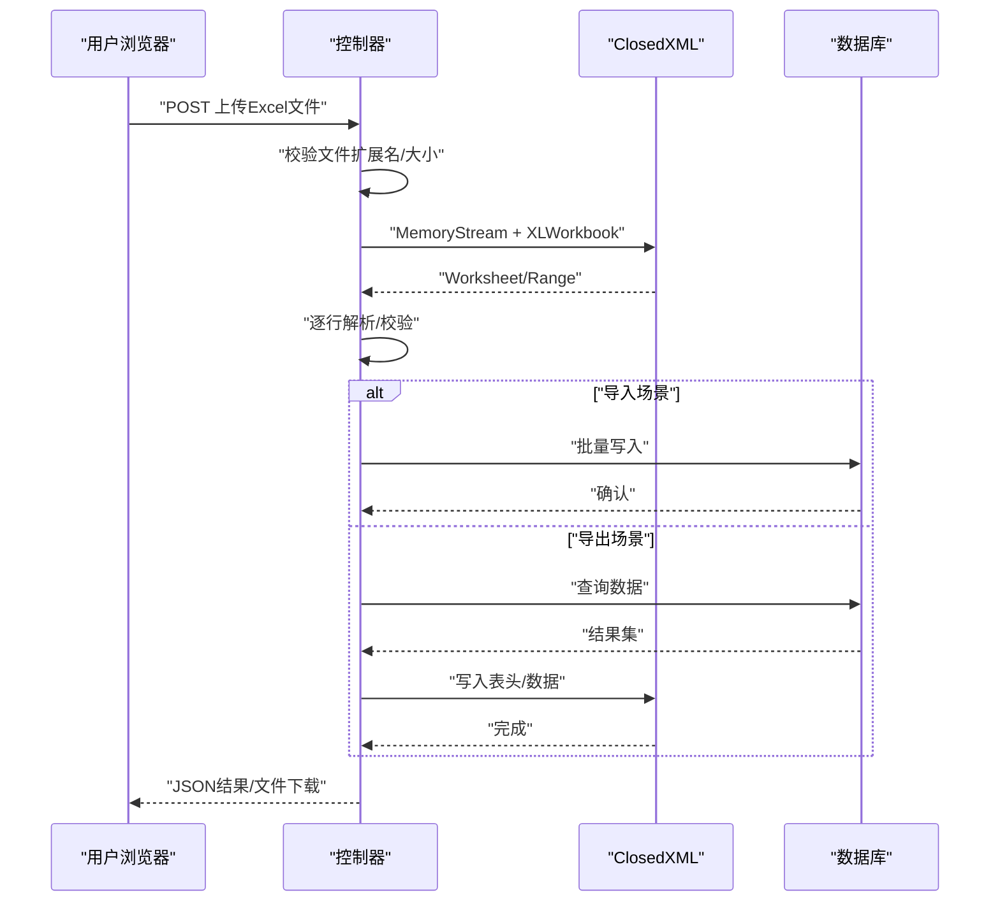
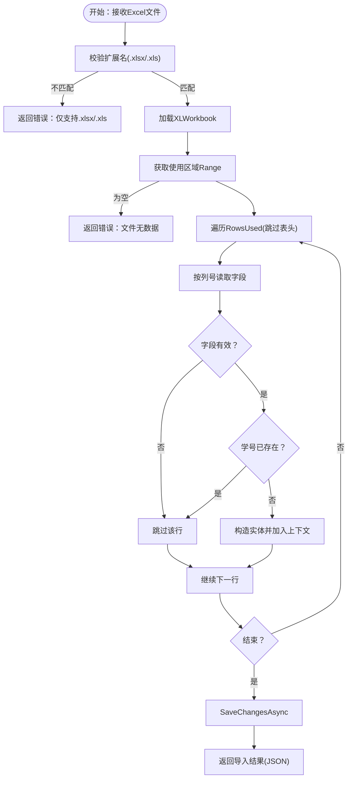
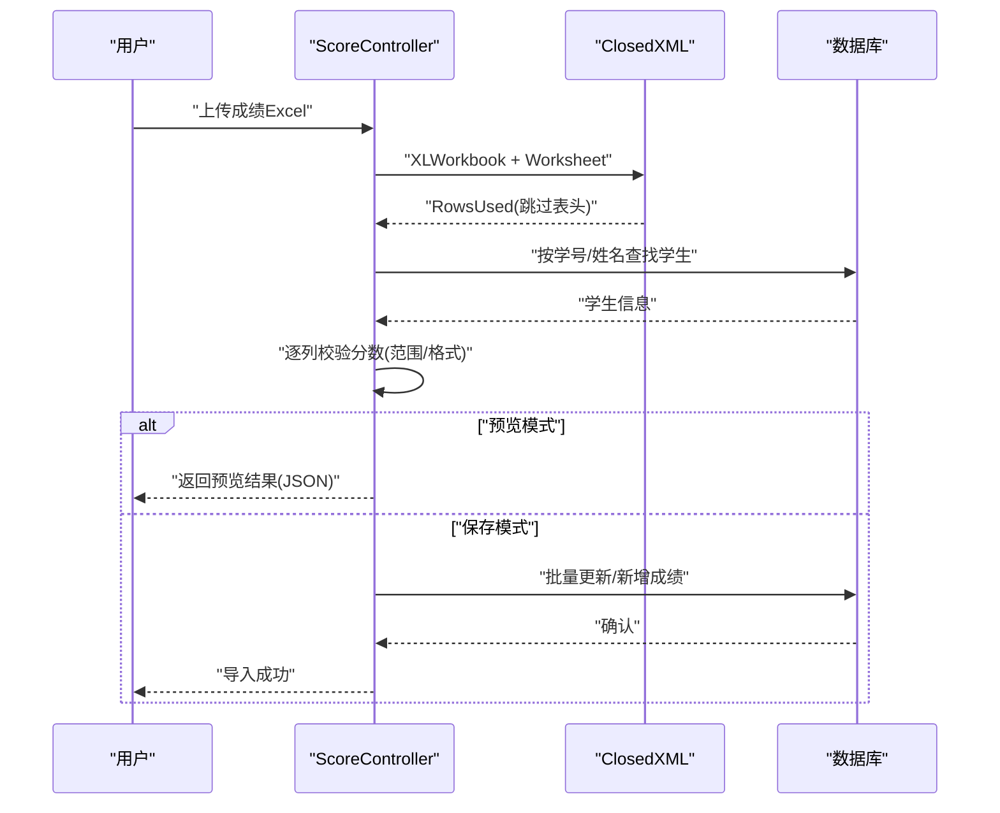
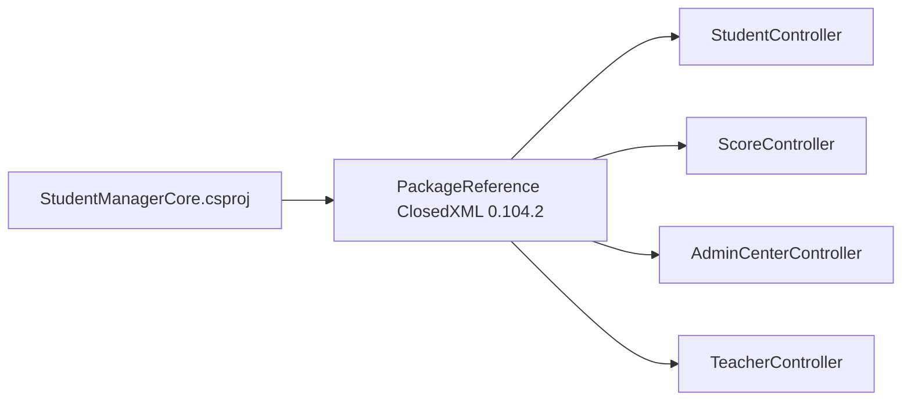

# Excel文件处理

<cite>
**本文引用的文件**
- [StudentController.cs](file://Controllers/StudentController.cs)
- [ScoreController.cs](file://Controllers/ScoreController.cs)
- [AdminCenterController.cs](file://Controllers/AdminCenterController.cs)
- [TeacherController.cs](file://Controllers/TeacherController.cs)
- [StudentManagerCore.csproj](file://StudentManagerCore.csproj)
</cite>

## 目录
1. [简介](#简介)
2. [项目结构](#项目结构)
3. [核心组件](#核心组件)
4. [架构概览](#架构概览)
5. [详细组件分析](#详细组件分析)
6. [依赖关系分析](#依赖关系分析)
7. [性能考量](#性能考量)
8. [故障排查指南](#故障排查指南)
9. [结论](#结论)
10. [附录](#附录)

## 简介
本文件系统化梳理了本项目的Excel文件处理能力，重点围绕ClosedXML库的使用展开，涵盖工作簿创建、工作表操作、单元格读写与格式设置；并总结了Excel模板设计规范（表头结构、数据列定义、注释说明与样式设置）；同时给出读取流程（文件上传、数据解析、格式校验与错误处理）、生成流程（动态表格构建、自动列宽调整、数据格式转换与文件下载）以及版本兼容性与性能优化建议。

## 项目结构
与Excel处理直接相关的后端代码集中在以下控制器中：
- 学生数据导入/导出与模板下载：StudentController
- 成绩数据导入/导出与模板下载：ScoreController
- 操作日志导出：AdminCenterController
- 教职工Excel导入与模板下载：TeacherController
- 依赖声明：StudentManagerCore.csproj（ClosedXML包引用）

**图表来源**
- [StudentController.cs:1-997](file://Controllers/StudentController.cs#L1-L997)
- [ScoreController.cs:1-620](file://Controllers/ScoreController.cs#L1-L620)
- [AdminCenterController.cs:1-491](file://Controllers/AdminCenterController.cs#L1-L491)
- [TeacherController.cs:1-501](file://Controllers/TeacherController.cs#L1-L501)
- [StudentManagerCore.csproj:1-20](file://StudentManagerCore.csproj#L1-L20)

**章节来源**
- [StudentController.cs:1-997](file://Controllers/StudentController.cs#L1-L997)
- [ScoreController.cs:1-620](file://Controllers/ScoreController.cs#L1-L620)
- [AdminCenterController.cs:1-491](file://Controllers/AdminCenterController.cs#L1-L491)
- [TeacherController.cs:1-501](file://Controllers/TeacherController.cs#L1-L501)
- [StudentManagerCore.csproj:1-20](file://StudentManagerCore.csproj#L1-L20)

## 核心组件
- 工作簿与工作表
  - 通过XLWorkbook创建/加载工作簿，通过WorkSheet或WorkSheets.Add创建工作表。
  - 示例路径：[创建工作簿与工作表:311-312](file://Controllers/ScoreController.cs#L311-L312)，[添加工作表](file://Controllers/StudentController.cs#L804)。
- 单元格读写
  - 写入：使用Cell(row, col).Value赋值；示例路径：[写入表头:314-322](file://Controllers/ScoreController.cs#L314-L322)、[写入数据行:324-338](file://Controllers/ScoreController.cs#L324-L338)。
  - 读取：IFormFile拷贝至MemoryStream，再用XLWorkbook加载，使用Cell(row, col).GetString()/GetDateTime()等读取；示例路径：[读取Excel并逐行解析:603-701](file://Controllers/StudentController.cs#L603-L701)。
- 格式设置
  - 字体加粗、背景填充、列宽自适应/固定宽度；示例路径：[表头样式:314-322](file://Controllers/ScoreController.cs#L314-L322)、[列宽自适应](file://Controllers/ScoreController.cs#L340)、[固定列宽:849-873](file://Controllers/StudentController.cs#L849-L873)。
- 注释说明
  - 为单元格添加注释（如“满分”提示）；示例路径：[添加注释:396-398](file://Controllers/ScoreController.cs#L396-L398)。
- 文件下载
  - 使用MemoryStream保存后File()输出；示例路径：[导出文件:342-347](file://Controllers/ScoreController.cs#L342-L347)、[模板下载:724-727](file://Controllers/StudentController.cs#L724-L727)。

**章节来源**
- [ScoreController.cs:276-348](file://Controllers/ScoreController.cs#L276-L348)
- [StudentController.cs:703-728](file://Controllers/StudentController.cs#L703-L728)
- [StudentController.cs:803-881](file://Controllers/StudentController.cs#L803-L881)
- [ScoreController.cs:362-419](file://Controllers/ScoreController.cs#L362-L419)

## 架构概览
Excel处理在后端采用“控制器-服务-存储”三层协作：
- 控制器负责HTTP请求/响应、文件上传、调用业务逻辑。
- 业务逻辑使用ClosedXML进行Excel读写与格式化。
- 数据持久化通过EF Core完成（导入时写入数据库，导出时从数据库读取）。

**图表来源**
- [StudentController.cs:575-701](file://Controllers/StudentController.cs#L575-L701)
- [ScoreController.cs:421-521](file://Controllers/ScoreController.cs#L421-L521)
- [AdminCenterController.cs:378-427](file://Controllers/AdminCenterController.cs#L378-L427)
- [TeacherController.cs:388-474](file://Controllers/TeacherController.cs#L388-L474)

## 详细组件分析

### 学生数据Excel处理
- 模板下载
  - 创建工作表，写入表头并设置样式，自动调整列宽；示例路径：[模板下载:703-728](file://Controllers/StudentController.cs#L703-L728)。
- 导入流程
  - 校验权限与文件类型；读取工作簿，遍历有效行，按列号读取字段，去重与空行跳过，批量入库；示例路径：[导入处理:575-701](file://Controllers/StudentController.cs#L575-L701)。
- 导出流程
  - 根据筛选条件查询数据，写入表头与数据，固定列宽，下载文件；示例路径：[导出处理:730-881](file://Controllers/StudentController.cs#L730-L881)。

**图表来源**
- [StudentController.cs:575-701](file://Controllers/StudentController.cs#L575-L701)

**章节来源**
- [StudentController.cs:575-701](file://Controllers/StudentController.cs#L575-L701)
- [StudentController.cs:703-728](file://Controllers/StudentController.cs#L703-L728)
- [StudentController.cs:730-881](file://Controllers/StudentController.cs#L730-L881)

### 成绩数据Excel处理
- 模板下载
  - 动态生成表头（含各科目列），为科目列添加“满分”注释，自动调整列宽；示例路径：[模板下载:362-419](file://Controllers/ScoreController.cs#L362-L419)。
- 导入预览
  - 读取上传文件，按表头定位学号/姓名，查找学生，逐列校验分数范围与格式，汇总错误；示例路径：[导入预览:421-521](file://Controllers/ScoreController.cs#L421-L521)。
- 导入保存
  - 批量加载现有成绩，按学生+科目去重更新或新增；示例路径：[保存导入:523-590](file://Controllers/ScoreController.cs#L523-L590)。
- 导出
  - 查询成绩并按总分排序，写入表头与数据，自动调整列宽；示例路径：[导出Excel:276-348](file://Controllers/ScoreController.cs#L276-L348)。

**图表来源**
- [ScoreController.cs:421-521](file://Controllers/ScoreController.cs#L421-L521)
- [ScoreController.cs:523-590](file://Controllers/ScoreController.cs#L523-L590)

**章节来源**
- [ScoreController.cs:362-419](file://Controllers/ScoreController.cs#L362-L419)
- [ScoreController.cs:421-521](file://Controllers/ScoreController.cs#L421-L521)
- [ScoreController.cs:523-590](file://Controllers/ScoreController.cs#L523-L590)
- [ScoreController.cs:276-348](file://Controllers/ScoreController.cs#L276-L348)

### 操作日志Excel导出
- 读取数据库日志数据，写入表头与数据行，表头加粗与浅灰填充，列宽自适应；示例路径：[导出日志:378-427](file://Controllers/AdminCenterController.cs#L378-L427)。

**章节来源**
- [AdminCenterController.cs:378-427](file://Controllers/AdminCenterController.cs#L378-L427)

### 教职工Excel导入与模板
- 模板下载
  - 写入固定表头并设置样式，列宽自适应并最小宽度约束；示例路径：[模板下载:361-385](file://Controllers/TeacherController.cs#L361-L385)。
- Excel导入
  - 校验扩展名为.xlsx，逐行读取字段，出生日期尝试解析，用户名去重，批量入库；示例路径：[Excel导入:388-474](file://Controllers/TeacherController.cs#L388-L474)。

**章节来源**
- [TeacherController.cs:361-385](file://Controllers/TeacherController.cs#L361-L385)
- [TeacherController.cs:388-474](file://Controllers/TeacherController.cs#L388-L474)

## 依赖关系分析
- 包依赖
  - 项目通过NuGet引用ClosedXML包，版本为0.104.2；示例路径：[包引用:1-20](file://StudentManagerCore.csproj#L1-L20)。
- 控制器对ClosedXML的使用
  - 各控制器均引入ClosedXML命名空间，并在导入/导出/模板下载场景中使用XLWorkbook、XLWorksheet、XLCell等API。

**图表来源**
- [StudentManagerCore.csproj:1-20](file://StudentManagerCore.csproj#L1-L20)

**章节来源**
- [StudentManagerCore.csproj:1-20](file://StudentManagerCore.csproj#L1-L20)

## 性能考量
- 流式与内存控制
  - 使用MemoryStream承载Excel读写，避免临时磁盘文件；在大文件场景建议限制文件大小与并发数，必要时拆分批次处理。
- 列宽策略
  - 自动列宽适合少量数据，大批量建议固定列宽或按列设定合理宽度，减少计算开销；参考路径：[自动列宽](file://Controllers/ScoreController.cs#L340)、[固定列宽:849-873](file://Controllers/StudentController.cs#L849-L873)。
- 批量写入
  - 导入时使用批量插入/更新，减少往返次数；参考路径：[批量保存:686-690](file://Controllers/StudentController.cs#L686-L690)、[批量保存成绩:587-589](file://Controllers/ScoreController.cs#L587-L589)。
- 数据库查询优化
  - 导出前先做筛选与分页，避免一次性加载全量数据；参考路径：[导出筛选:730-764](file://Controllers/StudentController.cs#L730-L764)、[导出排序:299-309](file://Controllers/ScoreController.cs#L299-L309)。
- 错误与回滚
  - 导入异常捕获与事务回滚（SaveChangesAsync），保证数据一致性；参考路径：[导入异常处理:696-700](file://Controllers/StudentController.cs#L696-L700)、[导入异常处理:469-473](file://Controllers/TeacherController.cs#L469-L473)。

[本节为通用性能建议，不直接分析具体代码片段]

## 故障排查指南
- 文件类型不支持
  - 现象：返回“仅支持.xlsx/.xls”或“仅支持.xlsx”。
  - 排查：确认前端accept属性与后端扩展名校验逻辑；参考路径：[学生导入扩展名校验:589-591](file://Controllers/StudentController.cs#L589-L591)、[教师Excel导入扩展名校验:394-396](file://Controllers/TeacherController.cs#L394-L396)。
- Excel无数据或仅有表头
  - 现象：返回“Excel文件中没有数据/文件为空或只有表头”。
  - 排查：检查RangeUsed是否为空，确认是否正确跳过表头；参考路径：[学生导入空数据判断:610-611](file://Controllers/StudentController.cs#L610-L611)、[教师导入空数据判断:406-408](file://Controllers/TeacherController.cs#L406-L408)。
- 导入重复与跳过
  - 现象：导入成功条数与跳过条数统计。
  - 排查：确认学号去重集合与空行跳过逻辑；参考路径：[学生导入去重与跳过:596-649](file://Controllers/StudentController.cs#L596-L649)。
- 成绩范围校验
  - 现象：预览阶段出现“超出满分”或“格式错误”。
  - 排查：核对科目满分与单元格数值解析；参考路径：[分数范围校验:478-494](file://Controllers/ScoreController.cs#L478-L494)。
- 下载文件名与MIME
  - 现象：下载文件名异常或浏览器无法识别。
  - 排查：确认文件名包含时间戳与Content-Type；参考路径：[导出文件名与MIME](file://Controllers/ScoreController.cs#L346)、[模板下载](file://Controllers/StudentController.cs#L876)。

**章节来源**
- [StudentController.cs:589-701](file://Controllers/StudentController.cs#L589-L701)
- [TeacherController.cs:394-408](file://Controllers/TeacherController.cs#L394-L408)
- [ScoreController.cs:478-494](file://Controllers/ScoreController.cs#L478-L494)
- [ScoreController.cs](file://Controllers/ScoreController.cs#L346)

## 结论
本项目基于ClosedXML实现了完整的Excel导入/导出闭环：模板设计规范明确、读取流程严谨、生成流程高效且具备良好的错误处理与兼容性。通过合理的列宽策略、批量写入与数据库筛选，可在保证用户体验的同时兼顾性能与稳定性。

## 附录

### Excel模板设计规范
- 表头结构
  - 明确列名与顺序，首行加粗并设置背景色；参考路径：[表头样式:314-322](file://Controllers/ScoreController.cs#L314-L322)、[模板表头:709-721](file://Controllers/StudentController.cs#L709-L721)。
- 数据列定义
  - 严格对应模型字段，导入时按列号映射；参考路径：[导入字段映射:620-640](file://Controllers/StudentController.cs#L620-L640)。
- 注释说明
  - 对关键字段（如“满分”）添加注释提升易用性；参考路径：[添加注释:396-398](file://Controllers/ScoreController.cs#L396-L398)。
- 样式设置
  - 表头加粗、浅灰填充；参考路径：[表头样式:404-406](file://Controllers/AdminCenterController.cs#L404-L406)。
- 列宽策略
  - 小数据量使用自动列宽；大数据量建议固定列宽；参考路径：[自动列宽](file://Controllers/ScoreController.cs#L340)、[固定列宽:849-873](file://Controllers/StudentController.cs#L849-L873)。

**章节来源**
- [ScoreController.cs:314-322](file://Controllers/ScoreController.cs#L314-L322)
- [StudentController.cs:709-721](file://Controllers/StudentController.cs#L709-L721)
- [ScoreController.cs:396-398](file://Controllers/ScoreController.cs#L396-L398)
- [AdminCenterController.cs:404-406](file://Controllers/AdminCenterController.cs#L404-L406)
- [StudentController.cs:849-873](file://Controllers/StudentController.cs#L849-L873)

### 版本兼容性与最佳实践
- 兼容性
  - 使用.xlsx格式，确保Office 2007+兼容；模板下载与导入均针对.xlsx；参考路径：[模板下载:724-727](file://Controllers/StudentController.cs#L724-L727)、[教师导入扩展名校验:394-396](file://Controllers/TeacherController.cs#L394-L396)。
- 最佳实践
  - 严格校验文件类型与内容；对导入数据进行去重与范围校验；导出前先筛选与排序；使用MemoryStream减少IO；批量写入数据库；异常捕获与统一返回。

**章节来源**
- [StudentController.cs:589-591](file://Controllers/StudentController.cs#L589-L591)
- [TeacherController.cs:394-396](file://Controllers/TeacherController.cs#L394-L396)
- [ScoreController.cs:478-494](file://Controllers/ScoreController.cs#L478-L494)